<!-- Top of page button -->
<a href="#" id="backToTopBtn" title="Go to top">↑</a>


------------------------------------------------------------------------

# **Title Page**

------------------------------------------------------------------------

## Name of study

This is a temp default title, please set

## Authors

This is a temp default author list, please set

## Desired graphic

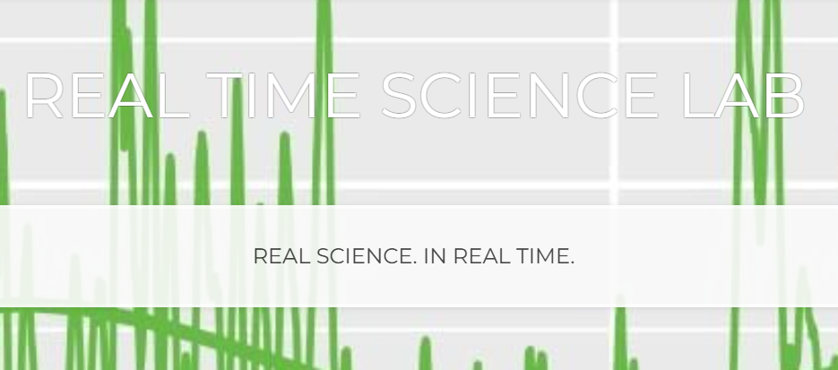<!-- -->

## Funding source

This is a temp default funding source, please set

------------------------------------------------------------------------

# **Abstract Page**

------------------------------------------------------------------------

This is a temp default abstract, please set

------------------------------------------------------------------------

# **Effective Summary**

------------------------------------------------------------------------

This is a temp default summary, please set

------------------------------------------------------------------------

# **Variable List**

------------------------------------------------------------------------


 
## Child EMA Survey ID 91
###  <!-- Header section -->

<div class = "header-shading">

#### Since your last survey did you let your parent know about... <br>

<div style="font-weight: bold; color: #2a5caa; margin-top: -0.7em; margin-bottom: 1em;">
  <a href="#Item 872-anchor"> [Item 872] </a>
</div>


</div>


<!-- Body -->


<div class = "anchor">

<div id="Question 4089-anchor">
  <strong>Question ID</strong>: Question 4089
</div>

**Way the question was delivered:** Multiple Select

**Type of data:** integer

</div> 
<div class = "anchor">


<button 
  onclick="let e = document.getElementById('Question 4089');
           let arrow = document.getElementById('Question 4089_arrow');
           e.style.display = e.style.display === 'none' ? 'block' : 'none';
           arrow.textContent = e.style.display === 'none' ? '▼' : '▲';"
  style="background: none; border: none; padding: 0; font-weight: bold; font-size: 18px; color: #2a5caa; cursor: pointer;">
Click to view visuals <span id="Question 4089_arrow">▼</span>
</button>

<div id="Question 4089" style="display: none;">


<!-- TOC-IGNORE-BEGIN -->

### Descriptives {.tabset}


#### Frequency Table

<table class="table" style="color: black; margin-left: auto; margin-right: auto;">
 <thead>
  <tr>
   <th style="text-align:left;"> Value </th>
   <th style="text-align:left;"> Label </th>
   <th style="text-align:left;"> Counts </th>
   <th style="text-align:left;"> Percentages </th>
  </tr>
 </thead>
<tbody>
  <tr>
   <td style="text-align:left;"> 1 </td>
   <td style="text-align:left;"> How you felt </td>
   <td style="text-align:left;color: darkgreen !important;"> N = 157 </td>
   <td style="text-align:left;"> 19.6% </td>
  </tr>
  <tr>
   <td style="text-align:left;"> 2 </td>
   <td style="text-align:left;"> A problem or challenge you had </td>
   <td style="text-align:left;color: darkgreen !important;"> N = 147 </td>
   <td style="text-align:left;"> 18.4% </td>
  </tr>
  <tr>
   <td style="text-align:left;"> 3 </td>
   <td style="text-align:left;"> A problem or challenge that someone else had </td>
   <td style="text-align:left;color: darkgreen !important;"> N = 49 </td>
   <td style="text-align:left;"> 6.1% </td>
  </tr>
  <tr>
   <td style="text-align:left;"> 4 </td>
   <td style="text-align:left;"> None apply </td>
   <td style="text-align:left;color: darkgreen !important;"> N = 446 </td>
   <td style="text-align:left;"> 55.8% </td>
  </tr>
</tbody>
</table>


#### Barplot

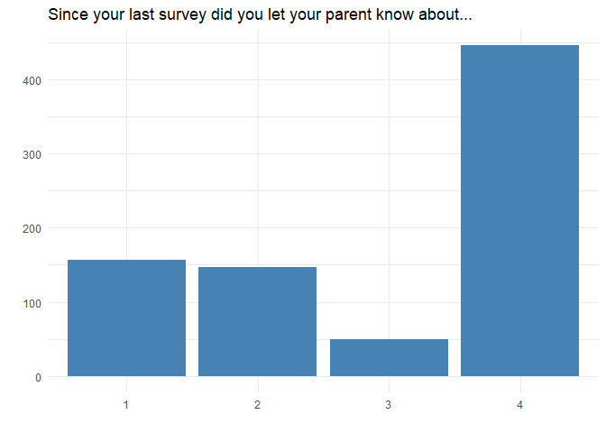<!-- -->


#### Missingness

**Missingness Descriptives**

Delivered / Answered = 693 / 688
Missing = 5
Min = 0, Max = 2, Mean = 0.04, SD = 0.22
(Descriptives are rounded to 2 decimals)

Missingness Intraclass Correlation (ICC) = 1.18 


#### Screenshot


</div>


</div> <!-- Header section -->

<div class = "header-shading">

#### Give you information, or ideas about how to make things better <br>

<div style="font-weight: bold; color: #2a5caa; margin-top: -0.7em; margin-bottom: 1em;">
  <a href="#Item 874-anchor"> [Item 874] </a>
</div>


</div>


<!-- Body -->


<div class = "anchor">

<div id="Question 5627-anchor">
  <strong>Question ID</strong>: Question 5627
</div>

**Way the question was delivered:** Slider

**Type of data:** numeric

</div> <div class = "anchor">


**Descriptives**
Min = 0, Max = 100, Mean = 51.64, SD = 32.23 


<button 
  onclick="let e = document.getElementById('Question 5627');
           let arrow = document.getElementById('Question 5627_arrow');
           e.style.display = e.style.display === 'none' ? 'block' : 'none';
           arrow.textContent = e.style.display === 'none' ? '▼' : '▲';"
  style="background: none; border: none; padding: 0; font-weight: bold; font-size: 18px; color: #2a5caa; cursor: pointer;">
Click to view visuals <span id="Question 5627_arrow">▼</span>
</button>

<div id="Question 5627" style="display: none;">


<!-- TOC-IGNORE-BEGIN -->

### Descriptives {.tabset}


#### Histogram

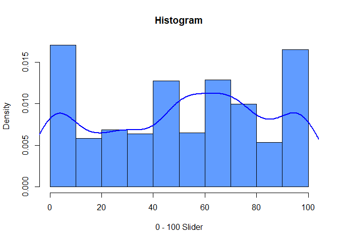<!-- -->


#### Missingness

**Missingness Descriptives**

Delivered / Answered = 587 / 582
Missing = 5
Min = 0, Max = 2, Mean = 0.04, SD = 0.24
(Descriptives are rounded to 2 decimals)

Missingness Intraclass Correlation (ICC) = 1.18 


#### Screenshot


</div>

</div> <!-- Header section -->

<div class = "header-shading">

#### Do something to help you (ex: pick you up, help with homework) <br>

<div style="font-weight: bold; color: #2a5caa; margin-top: -0.7em; margin-bottom: 1em;">
  <a href="#Item 875-anchor"> [Item 875] </a>
</div>


</div>


<!-- Body -->


<div class = "anchor">

<div id="Question 1259-anchor">
  <strong>Question ID</strong>: Question 1259
</div>

**Way the question was delivered:** Slider

**Type of data:** numeric

</div> <div class = "anchor">


**Descriptives**
Min = 0, Max = 100, Mean = 54.31, SD = 32.08 


<button 
  onclick="let e = document.getElementById('Question 1259');
           let arrow = document.getElementById('Question 1259_arrow');
           e.style.display = e.style.display === 'none' ? 'block' : 'none';
           arrow.textContent = e.style.display === 'none' ? '▼' : '▲';"
  style="background: none; border: none; padding: 0; font-weight: bold; font-size: 18px; color: #2a5caa; cursor: pointer;">
Click to view visuals <span id="Question 1259_arrow">▼</span>
</button>

<div id="Question 1259" style="display: none;">


<!-- TOC-IGNORE-BEGIN -->

### Descriptives {.tabset}


#### Histogram

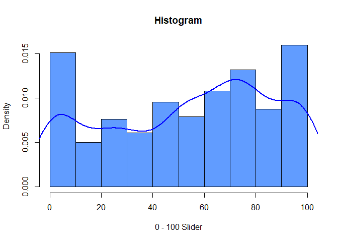<!-- -->


#### Missingness

**Missingness Descriptives**

Delivered / Answered = 724 / 721
Missing = 3
Min = 0, Max = 2, Mean = 0.02, SD = 0.18
(Descriptives are rounded to 2 decimals)

Missingness Intraclass Correlation (ICC) = 1.15 


#### Screenshot


</div>

</div> <!-- Header section -->

<div class = "header-shading">

#### Give you emotional support (ex: listen to and comfort you) <br>

<div style="font-weight: bold; color: #2a5caa; margin-top: -0.7em; margin-bottom: 1em;">
  <a href="#Item 879-anchor"> [Item 879] </a>
</div>


</div>


<!-- Body -->


<div class = "anchor">

<div id="Question 1784-anchor">
  <strong>Question ID</strong>: Question 1784
</div>

**Way the question was delivered:** Slider

**Type of data:** numeric

</div> <div class = "anchor">


**Descriptives**
Min = 0, Max = 100, Mean = 49.45, SD = 31.57 


<button 
  onclick="let e = document.getElementById('Question 1784');
           let arrow = document.getElementById('Question 1784_arrow');
           e.style.display = e.style.display === 'none' ? 'block' : 'none';
           arrow.textContent = e.style.display === 'none' ? '▼' : '▲';"
  style="background: none; border: none; padding: 0; font-weight: bold; font-size: 18px; color: #2a5caa; cursor: pointer;">
Click to view visuals <span id="Question 1784_arrow">▼</span>
</button>

<div id="Question 1784" style="display: none;">


<!-- TOC-IGNORE-BEGIN -->

### Descriptives {.tabset}


#### Histogram

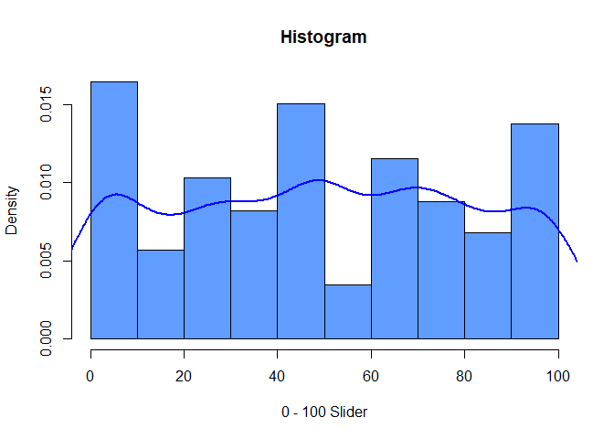<!-- -->


#### Missingness

**Missingness Descriptives**

Delivered / Answered = 725 / 719
Missing = 6
Min = 0, Max = 2, Mean = 0.04, SD = 0.23
(Descriptives are rounded to 2 decimals)

Missingness Intraclass Correlation (ICC) = 1.19 


#### Screenshot


</div>

</div> 
### Block: Item 1136 <!-- Header section -->

<div class = "header-shading">

#### Overall, how helpful was your parent? <br>

<div style="font-weight: bold; color: #2a5caa; margin-top: -0.7em; margin-bottom: 1em;">
  <a href="#Item 1143-anchor"> [Item 1143] </a>
</div>


</div>


<!-- Body -->


<div class = "anchor">

<div id="Question 2027-anchor">
  <strong>Question ID</strong>: Question 2027
</div>

**Way the question was delivered:** Slider

**Type of data:** numeric

</div> <div class = "anchor">


**Descriptives**
Min = 0, Max = 100, Mean = 71.47, SD = 23.6 


<button 
  onclick="let e = document.getElementById('Question 2027');
           let arrow = document.getElementById('Question 2027_arrow');
           e.style.display = e.style.display === 'none' ? 'block' : 'none';
           arrow.textContent = e.style.display === 'none' ? '▼' : '▲';"
  style="background: none; border: none; padding: 0; font-weight: bold; font-size: 18px; color: #2a5caa; cursor: pointer;">
Click to view visuals <span id="Question 2027_arrow">▼</span>
</button>

<div id="Question 2027" style="display: none;">


<!-- TOC-IGNORE-BEGIN -->

### Descriptives {.tabset}


#### Histogram

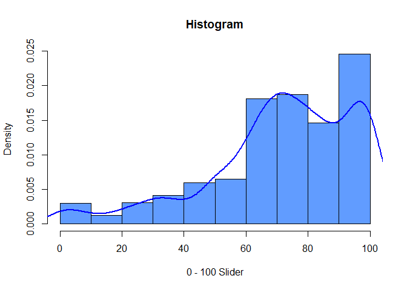<!-- -->


#### Missingness

**Missingness Descriptives**

Delivered / Answered = 709 / 705
Missing = 4
Min = 0, Max = 1, Mean = 0.03, SD = 0.16
(Descriptives are rounded to 2 decimals)

Missingness Intraclass Correlation (ICC) = 1.29 


#### Screenshot


</div>

</div> <!-- Header section -->

<div class = "header-shading">

#### How much did you want your parent to... <br>

<div style="font-weight: bold; color: #2a5caa; margin-top: -0.7em; margin-bottom: 1em;">
  <a href="#Item 1144-anchor"> [Item 1144] </a>
</div>


</div>


<!-- Body -->


<div class = "anchor">

<div id="Question 2026-anchor">
  <strong>Question ID</strong>: Question 2026
</div>

**Way the question was delivered:** Informational Fullscreen

**Type of data:** NA

</div> <div class = "anchor">


</div> <!-- Header section -->

<div class = "header-shading">

#### End Block <br>

<div style="font-weight: bold; color: #2a5caa; margin-top: -0.7em; margin-bottom: 1em;">
  <a href="#Item 1199-anchor"> [Item 1199] </a>
</div>


</div>


<!-- Body -->


<div class = "anchor">

<div id="Question 2028-anchor">
  <strong>Question ID</strong>: Question 2028
</div>

**Way the question was delivered:** End Block

**Type of data:** NA

</div>  
### Block: Item 1361 <!-- Header section -->

<div class = "header-shading">

#### Since your last survey, did you experience any stressful events at home, school or elsewhere? <br>

<div style="font-weight: bold; color: #2a5caa; margin-top: -0.7em; margin-bottom: 1em;">
  <a href="#Item 4463-anchor"> [Item 4463] </a>
</div>


</div>


<!-- Body -->


<div class = "anchor">

<div id="Question 4086-anchor">
  <strong>Question ID</strong>: Question 4086
</div>

**Way the question was delivered:** Multiple Choice

**Type of data:** integer

</div> 
<div class = "anchor">


<button 
  onclick="let e = document.getElementById('Question 4086');
           let arrow = document.getElementById('Question 4086_arrow');
           e.style.display = e.style.display === 'none' ? 'block' : 'none';
           arrow.textContent = e.style.display === 'none' ? '▼' : '▲';"
  style="background: none; border: none; padding: 0; font-weight: bold; font-size: 18px; color: #2a5caa; cursor: pointer;">
Click to view visuals <span id="Question 4086_arrow">▼</span>
</button>

<div id="Question 4086" style="display: none;">


<!-- TOC-IGNORE-BEGIN -->

### Descriptives {.tabset}


#### Frequency Table

<table class="table" style="color: black; margin-left: auto; margin-right: auto;">
 <thead>
  <tr>
   <th style="text-align:left;"> Value </th>
   <th style="text-align:left;"> Label </th>
   <th style="text-align:left;"> Counts </th>
   <th style="text-align:left;"> Percentages </th>
  </tr>
 </thead>
<tbody>
  <tr>
   <td style="text-align:left;"> 1 </td>
   <td style="text-align:left;"> Yes </td>
   <td style="text-align:left;color: darkgreen !important;"> N = 129 </td>
   <td style="text-align:left;"> 10.8% </td>
  </tr>
  <tr>
   <td style="text-align:left;"> 2 </td>
   <td style="text-align:left;"> No </td>
   <td style="text-align:left;color: darkgreen !important;"> N = 1062 </td>
   <td style="text-align:left;"> 89.2% </td>
  </tr>
</tbody>
</table>


#### Barplot

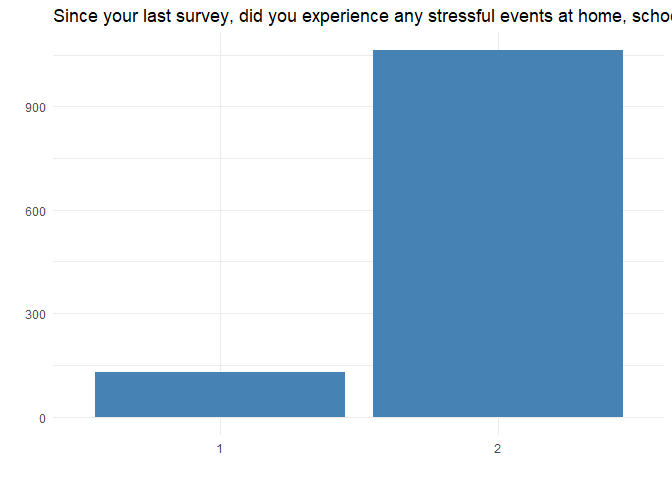<!-- -->


#### Missingness

**Missingness Descriptives**

Delivered / Answered = 1196 / 1191
Missing = 5
Min = 0, Max = 2, Mean = 0.03, SD = 0.22
(Descriptives are rounded to 2 decimals)

Missingness Intraclass Correlation (ICC) = 1.1 


#### Screenshot


</div>


</div> <!-- Header section -->

<div class = "header-shading">

#### Since your last survey, did you see or communicate with your parent? <br>

<div style="font-weight: bold; color: #2a5caa; margin-top: -0.7em; margin-bottom: 1em;">
  <a href="#Item 4464-anchor"> [Item 4464] </a>
</div>


</div>


<!-- Body -->


<div class = "anchor">

<div id="Question 4087-anchor">
  <strong>Question ID</strong>: Question 4087
</div>

**Way the question was delivered:** Multiple Choice

**Type of data:** integer

</div> 
<div class = "anchor">


<button 
  onclick="let e = document.getElementById('Question 4087');
           let arrow = document.getElementById('Question 4087_arrow');
           e.style.display = e.style.display === 'none' ? 'block' : 'none';
           arrow.textContent = e.style.display === 'none' ? '▼' : '▲';"
  style="background: none; border: none; padding: 0; font-weight: bold; font-size: 18px; color: #2a5caa; cursor: pointer;">
Click to view visuals <span id="Question 4087_arrow">▼</span>
</button>

<div id="Question 4087" style="display: none;">


<!-- TOC-IGNORE-BEGIN -->

### Descriptives {.tabset}


#### Frequency Table

<table class="table" style="color: black; margin-left: auto; margin-right: auto;">
 <thead>
  <tr>
   <th style="text-align:left;"> Value </th>
   <th style="text-align:left;"> Label </th>
   <th style="text-align:left;"> Counts </th>
   <th style="text-align:left;"> Percentages </th>
  </tr>
 </thead>
<tbody>
  <tr>
   <td style="text-align:left;"> 1 </td>
   <td style="text-align:left;"> Yes </td>
   <td style="text-align:left;color: darkgreen !important;"> N = 703 </td>
   <td style="text-align:left;"> 59.3% </td>
  </tr>
  <tr>
   <td style="text-align:left;"> 2 </td>
   <td style="text-align:left;"> No </td>
   <td style="text-align:left;color: darkgreen !important;"> N = 482 </td>
   <td style="text-align:left;"> 40.7% </td>
  </tr>
</tbody>
</table>


#### Barplot

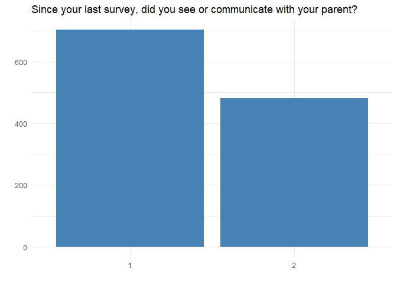<!-- -->


#### Missingness

**Missingness Descriptives**

Delivered / Answered = 1191 / 1185
Missing = 6
Min = 0, Max = 2, Mean = 0.04, SD = 0.26
(Descriptives are rounded to 2 decimals)

Missingness Intraclass Correlation (ICC) = 1.08 


#### Screenshot


</div>


</div> 
### Block: Item 5539 <!-- Header section -->

<div class = "header-shading">

#### Think about your sleep from last night to this morning: <br>

<div style="font-weight: bold; color: #2a5caa; margin-top: -0.7em; margin-bottom: 1em;">
  <a href="#Item 6302-anchor"> [Item 6302] </a>
</div>


</div>


<!-- Body -->


<div class = "anchor">

<div id="Question 6762-anchor">
  <strong>Question ID</strong>: Question 6762
</div>

**Way the question was delivered:** Informational Fullscreen

**Type of data:** NA

</div> <div class = "anchor">


</div> <!-- Header section -->

<div class = "header-shading">

#### How many minutes did it take for you to fall asleep? <br>

<div style="font-weight: bold; color: #2a5caa; margin-top: -0.7em; margin-bottom: 1em;">
  <a href="#Item 6305-anchor"> [Item 6305] </a>
</div>


</div>


<!-- Body -->


<div class = "anchor">

<div id="Question 6765-anchor">
  <strong>Question ID</strong>: Question 6765
</div>

**Way the question was delivered:** Free Response

**Type of data:** character

</div> <div class = "anchor">


<button 
  onclick="let e = document.getElementById('Question 6765');
           let arrow = document.getElementById('Question 6765_arrow');
           e.style.display = e.style.display === 'none' ? 'block' : 'none';
           arrow.textContent = e.style.display === 'none' ? '▼' : '▲';"
  style="background: none; border: none; padding: 0; font-weight: bold; font-size: 18px; color: #2a5caa; cursor: pointer;">
Click to view visuals <span id="Question 6765_arrow">▼</span>
</button>

<div id="Question 6765" style="display: none;">


<!-- TOC-IGNORE-BEGIN -->

### Descriptives {.tabset}


#### Missingness

**Missingness Descriptives**

Delivered / Answered = 326 / 324
Missing = 2
Min = 0, Max = 1, Mean = 0.03, SD = 0.16
(Descriptives are rounded to 2 decimals)

Missingness Intraclass Correlation (ICC) = 1.32 


#### Screenshot


</div>


</div> <!-- Header section -->

<div class = "header-shading">

#### Did you wake up during the night (Not counting your final wake-up in the morning)? <br>

<div style="font-weight: bold; color: #2a5caa; margin-top: -0.7em; margin-bottom: 1em;">
  <a href="#Item 6306-anchor"> [Item 6306] </a>
</div>


</div>


<!-- Body -->


<div class = "anchor">

<div id="Question 6766-anchor">
  <strong>Question ID</strong>: Question 6766
</div>

**Way the question was delivered:** Multiple Choice

**Type of data:** integer

</div> 
<div class = "anchor">


<button 
  onclick="let e = document.getElementById('Question 6766');
           let arrow = document.getElementById('Question 6766_arrow');
           e.style.display = e.style.display === 'none' ? 'block' : 'none';
           arrow.textContent = e.style.display === 'none' ? '▼' : '▲';"
  style="background: none; border: none; padding: 0; font-weight: bold; font-size: 18px; color: #2a5caa; cursor: pointer;">
Click to view visuals <span id="Question 6766_arrow">▼</span>
</button>

<div id="Question 6766" style="display: none;">


<!-- TOC-IGNORE-BEGIN -->

### Descriptives {.tabset}


#### Frequency Table

<table class="table" style="color: black; margin-left: auto; margin-right: auto;">
 <thead>
  <tr>
   <th style="text-align:left;"> Value </th>
   <th style="text-align:left;"> Label </th>
   <th style="text-align:left;"> Counts </th>
   <th style="text-align:left;"> Percentages </th>
  </tr>
 </thead>
<tbody>
  <tr>
   <td style="text-align:left;"> 1 </td>
   <td style="text-align:left;"> Yes </td>
   <td style="text-align:left;color: darkgreen !important;"> N = 73 </td>
   <td style="text-align:left;"> 22.5% </td>
  </tr>
  <tr>
   <td style="text-align:left;"> 2 </td>
   <td style="text-align:left;"> No </td>
   <td style="text-align:left;color: darkgreen !important;"> N = 252 </td>
   <td style="text-align:left;"> 77.5% </td>
  </tr>
</tbody>
</table>


#### Barplot

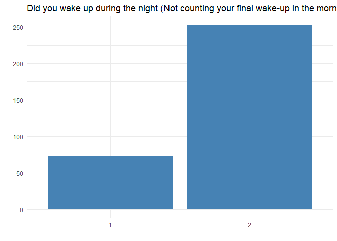<!-- -->


#### Missingness

**Missingness Descriptives**

Delivered / Answered = 326 / 325
Missing = 1
Min = 0, Max = 1, Mean = 0.01, SD = 0.11
(Descriptives are rounded to 2 decimals)

Missingness Intraclass Correlation (ICC) = 1.34 


#### Screenshot


</div>


</div> 
### Block: Item 6307 <!-- Header section -->

<div class = "header-shading">

#### How would you rate the quality of your sleep? <br>

<div style="font-weight: bold; color: #2a5caa; margin-top: -0.7em; margin-bottom: 1em;">
  <a href="#Item 6309-anchor"> [Item 6309] </a>
</div>


</div>


<!-- Body -->


<div class = "anchor">

<div id="Question 6771-anchor">
  <strong>Question ID</strong>: Question 6771
</div>

**Way the question was delivered:** Slider

**Type of data:** numeric

</div> <div class = "anchor">


**Descriptives**
Min = 0, Max = 100, Mean = 71.02, SD = 25.03 


<button 
  onclick="let e = document.getElementById('Question 6771');
           let arrow = document.getElementById('Question 6771_arrow');
           e.style.display = e.style.display === 'none' ? 'block' : 'none';
           arrow.textContent = e.style.display === 'none' ? '▼' : '▲';"
  style="background: none; border: none; padding: 0; font-weight: bold; font-size: 18px; color: #2a5caa; cursor: pointer;">
Click to view visuals <span id="Question 6771_arrow">▼</span>
</button>

<div id="Question 6771" style="display: none;">


<!-- TOC-IGNORE-BEGIN -->

### Descriptives {.tabset}


#### Histogram

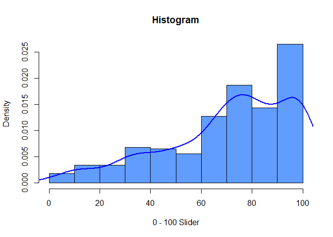<!-- -->


#### Missingness

**Missingness Descriptives**

Delivered / Answered = 324 / 321
Missing = 3
Min = 0, Max = 1, Mean = 0.04, SD = 0.19
(Descriptives are rounded to 2 decimals)

Missingness Intraclass Correlation (ICC) = 1.35 


#### Screenshot


</div>

</div> <!-- Header section -->

<div class = "header-shading">

#### How bothered or stressed were you because of this? <br>

<div style="font-weight: bold; color: #2a5caa; margin-top: -0.7em; margin-bottom: 1em;">
  <a href="#Item 1118-anchor"> [Item 1118] </a>
</div>


</div>


<!-- Body -->


<div class = "anchor">

<div id="Question 1769-anchor">
  <strong>Question ID</strong>: Question 1769
</div>

**Way the question was delivered:** Slider

**Type of data:** numeric

</div> <div class = "anchor">


**Descriptives**
Min = 18, Max = 100, Mean = 66.97, SD = 21.02 


<button 
  onclick="let e = document.getElementById('Question 1769');
           let arrow = document.getElementById('Question 1769_arrow');
           e.style.display = e.style.display === 'none' ? 'block' : 'none';
           arrow.textContent = e.style.display === 'none' ? '▼' : '▲';"
  style="background: none; border: none; padding: 0; font-weight: bold; font-size: 18px; color: #2a5caa; cursor: pointer;">
Click to view visuals <span id="Question 1769_arrow">▼</span>
</button>

<div id="Question 1769" style="display: none;">


<!-- TOC-IGNORE-BEGIN -->

### Descriptives {.tabset}


#### Histogram

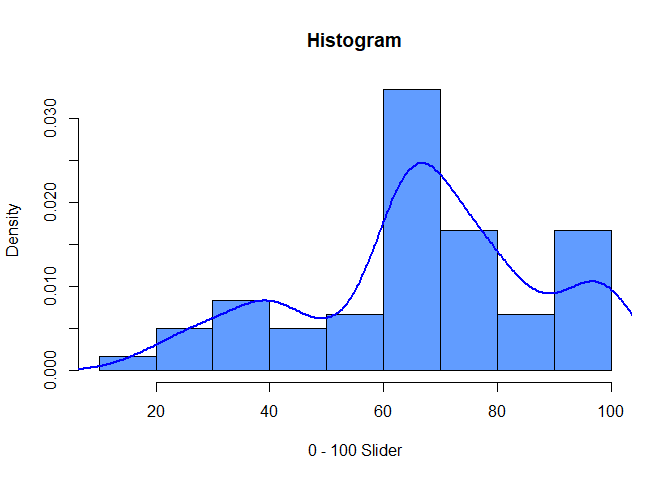<!-- -->


#### Missingness

**Missingness Descriptives**

Delivered / Answered = 60 / 60
Missing = 0
Min = 0, Max = 0, Mean = 0, SD = 0
(Descriptives are rounded to 2 decimals)

Missingness Intraclass Correlation (ICC) = NaN 


#### Screenshot


</div>

</div> <!-- Header section -->

<div class = "header-shading">

#### With whom did you have an argument or disagreement? <br>

<div style="font-weight: bold; color: #2a5caa; margin-top: -0.7em; margin-bottom: 1em;">
  <a href="#Item 1119-anchor"> [Item 1119] </a>
</div>


</div>


<!-- Body -->


<div class = "anchor">

<div id="Question 1770-anchor">
  <strong>Question ID</strong>: Question 1770
</div>

**Way the question was delivered:** Multiple Select

**Type of data:** integer

</div> 
<div class = "anchor">


<button 
  onclick="let e = document.getElementById('Question 1770');
           let arrow = document.getElementById('Question 1770_arrow');
           e.style.display = e.style.display === 'none' ? 'block' : 'none';
           arrow.textContent = e.style.display === 'none' ? '▼' : '▲';"
  style="background: none; border: none; padding: 0; font-weight: bold; font-size: 18px; color: #2a5caa; cursor: pointer;">
Click to view visuals <span id="Question 1770_arrow">▼</span>
</button>

<div id="Question 1770" style="display: none;">


<!-- TOC-IGNORE-BEGIN -->

### Descriptives {.tabset}


#### Frequency Table

<table class="table" style="color: black; margin-left: auto; margin-right: auto;">
 <thead>
  <tr>
   <th style="text-align:left;"> Value </th>
   <th style="text-align:left;"> Label </th>
   <th style="text-align:left;"> Counts </th>
   <th style="text-align:left;"> Percentages </th>
  </tr>
 </thead>
<tbody>
  <tr>
   <td style="text-align:left;"> 1 </td>
   <td style="text-align:left;"> Parents </td>
   <td style="text-align:left;color: darkgreen !important;"> N = 36 </td>
   <td style="text-align:left;"> 44.4% </td>
  </tr>
  <tr>
   <td style="text-align:left;"> 2 </td>
   <td style="text-align:left;"> Siblings </td>
   <td style="text-align:left;color: darkgreen !important;"> N = 13 </td>
   <td style="text-align:left;"> 16% </td>
  </tr>
  <tr>
   <td style="text-align:left;"> 3 </td>
   <td style="text-align:left;"> Friends, other people your age </td>
   <td style="text-align:left;color: darkgreen !important;"> N = 21 </td>
   <td style="text-align:left;"> 25.9% </td>
  </tr>
  <tr>
   <td style="text-align:left;"> 4 </td>
   <td style="text-align:left;"> Teachers, coaches, other adults </td>
   <td style="text-align:left;color: darkgreen !important;"> N = 9 </td>
   <td style="text-align:left;"> 11.1% </td>
  </tr>
  <tr>
   <td style="text-align:left;"> 5 </td>
   <td style="text-align:left;"> Other (ex: cashier, a stranger) </td>
   <td style="text-align:left;color: darkgreen !important;"> N = 2 </td>
   <td style="text-align:left;"> 2.5% </td>
  </tr>
</tbody>
</table>


#### Barplot

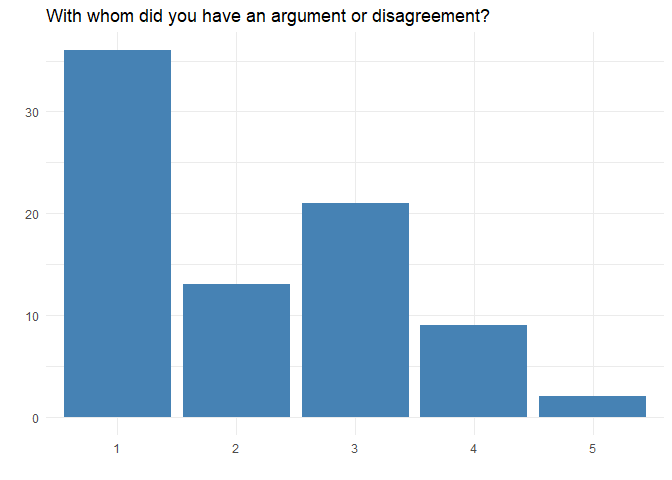<!-- -->


#### Missingness

**Missingness Descriptives**

Delivered / Answered = 60 / 60
Missing = 0
Min = 0, Max = 0, Mean = 0, SD = 0
(Descriptives are rounded to 2 decimals)

Missingness Intraclass Correlation (ICC) = NaN 


#### Screenshot


</div>


</div> <!-- Header section -->

<div class = "header-shading">

#### How bothered or stressed were you because of this? <br>

<div style="font-weight: bold; color: #2a5caa; margin-top: -0.7em; margin-bottom: 1em;">
  <a href="#Item 1122-anchor"> [Item 1122] </a>
</div>


</div>


<!-- Body -->


<div class = "anchor">

<div id="Question 1772-anchor">
  <strong>Question ID</strong>: Question 1772
</div>

**Way the question was delivered:** Slider

**Type of data:** numeric

</div> <div class = "anchor">


**Descriptives**
Min = 27, Max = 100, Mean = 72.33, SD = 15.83 


<button 
  onclick="let e = document.getElementById('Question 1772');
           let arrow = document.getElementById('Question 1772_arrow');
           e.style.display = e.style.display === 'none' ? 'block' : 'none';
           arrow.textContent = e.style.display === 'none' ? '▼' : '▲';"
  style="background: none; border: none; padding: 0; font-weight: bold; font-size: 18px; color: #2a5caa; cursor: pointer;">
Click to view visuals <span id="Question 1772_arrow">▼</span>
</button>

<div id="Question 1772" style="display: none;">


<!-- TOC-IGNORE-BEGIN -->

### Descriptives {.tabset}


#### Histogram

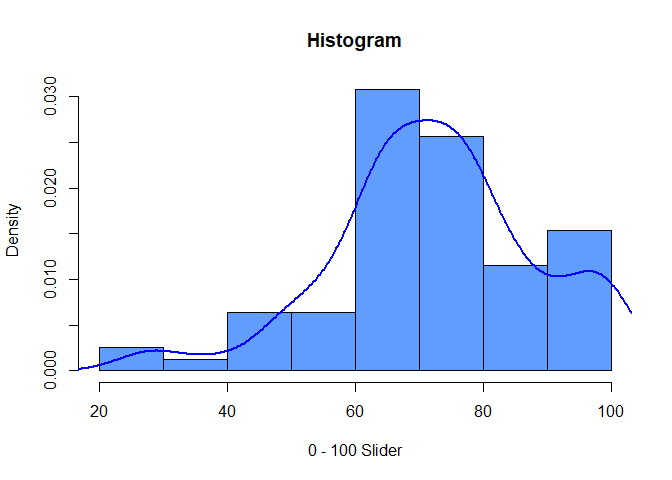<!-- -->


#### Missingness

**Missingness Descriptives**

Delivered / Answered = 78 / 78
Missing = 0
Min = 0, Max = 0, Mean = 0, SD = 0
(Descriptives are rounded to 2 decimals)

Missingness Intraclass Correlation (ICC) = NaN 


#### Screenshot


</div>

</div> <!-- Header section -->

<div class = "header-shading">

#### Where did you feel this way? <br>

<div style="font-weight: bold; color: #2a5caa; margin-top: -0.7em; margin-bottom: 1em;">
  <a href="#Item 1123-anchor"> [Item 1123] </a>
</div>


</div>


<!-- Body -->


<div class = "anchor">

<div id="Question 1773-anchor">
  <strong>Question ID</strong>: Question 1773
</div>

**Way the question was delivered:** Multiple Select

**Type of data:** integer

</div> 
<div class = "anchor">


<button 
  onclick="let e = document.getElementById('Question 1773');
           let arrow = document.getElementById('Question 1773_arrow');
           e.style.display = e.style.display === 'none' ? 'block' : 'none';
           arrow.textContent = e.style.display === 'none' ? '▼' : '▲';"
  style="background: none; border: none; padding: 0; font-weight: bold; font-size: 18px; color: #2a5caa; cursor: pointer;">
Click to view visuals <span id="Question 1773_arrow">▼</span>
</button>

<div id="Question 1773" style="display: none;">


<!-- TOC-IGNORE-BEGIN -->

### Descriptives {.tabset}


#### Frequency Table

<table class="table" style="color: black; margin-left: auto; margin-right: auto;">
 <thead>
  <tr>
   <th style="text-align:left;"> Value </th>
   <th style="text-align:left;"> Label </th>
   <th style="text-align:left;"> Counts </th>
   <th style="text-align:left;"> Percentages </th>
  </tr>
 </thead>
<tbody>
  <tr>
   <td style="text-align:left;"> 1 </td>
   <td style="text-align:left;"> Home </td>
   <td style="text-align:left;color: darkgreen !important;"> N = 42 </td>
   <td style="text-align:left;"> 38.9% </td>
  </tr>
  <tr>
   <td style="text-align:left;"> 2 </td>
   <td style="text-align:left;"> School or extracurricular activity </td>
   <td style="text-align:left;color: darkgreen !important;"> N = 52 </td>
   <td style="text-align:left;"> 48.1% </td>
  </tr>
  <tr>
   <td style="text-align:left;"> 3 </td>
   <td style="text-align:left;"> Other (ex: at the store) </td>
   <td style="text-align:left;color: darkgreen !important;"> N = 14 </td>
   <td style="text-align:left;"> 13% </td>
  </tr>
</tbody>
</table>


#### Barplot

<!-- -->


#### Missingness

**Missingness Descriptives**

Delivered / Answered = 78 / 78
Missing = 0
Min = 0, Max = 0, Mean = 0, SD = 0
(Descriptives are rounded to 2 decimals)

Missingness Intraclass Correlation (ICC) = NaN 


#### Screenshot


</div>


</div> <!-- Header section -->

<div class = "header-shading">

#### How bothered or stressed were you because of this? <br>

<div style="font-weight: bold; color: #2a5caa; margin-top: -0.7em; margin-bottom: 1em;">
  <a href="#Item 1126-anchor"> [Item 1126] </a>
</div>


</div>


<!-- Body -->


<div class = "anchor">

<div id="Question 1775-anchor">
  <strong>Question ID</strong>: Question 1775
</div>

**Way the question was delivered:** Slider

**Type of data:** numeric

</div> <div class = "anchor">


**Descriptives**
Min = 0, Max = 100, Mean = 65.49, SD = 24.38 


<button 
  onclick="let e = document.getElementById('Question 1775');
           let arrow = document.getElementById('Question 1775_arrow');
           e.style.display = e.style.display === 'none' ? 'block' : 'none';
           arrow.textContent = e.style.display === 'none' ? '▼' : '▲';"
  style="background: none; border: none; padding: 0; font-weight: bold; font-size: 18px; color: #2a5caa; cursor: pointer;">
Click to view visuals <span id="Question 1775_arrow">▼</span>
</button>

<div id="Question 1775" style="display: none;">


<!-- TOC-IGNORE-BEGIN -->

### Descriptives {.tabset}


#### Histogram

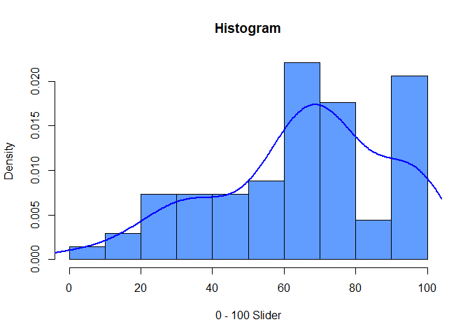<!-- -->


#### Missingness

**Missingness Descriptives**

Delivered / Answered = 68 / 68
Missing = 0
Min = 0, Max = 0, Mean = 0, SD = 0
(Descriptives are rounded to 2 decimals)

Missingness Intraclass Correlation (ICC) = NaN 


#### Screenshot


</div>

</div> <!-- Header section -->

<div class = "header-shading">

#### Where did this happen? <br>

<div style="font-weight: bold; color: #2a5caa; margin-top: -0.7em; margin-bottom: 1em;">
  <a href="#Item 1127-anchor"> [Item 1127] </a>
</div>


</div>


<!-- Body -->


<div class = "anchor">

<div id="Question 1776-anchor">
  <strong>Question ID</strong>: Question 1776
</div>

**Way the question was delivered:** Multiple Select

**Type of data:** integer

</div> 
<div class = "anchor">


<button 
  onclick="let e = document.getElementById('Question 1776');
           let arrow = document.getElementById('Question 1776_arrow');
           e.style.display = e.style.display === 'none' ? 'block' : 'none';
           arrow.textContent = e.style.display === 'none' ? '▼' : '▲';"
  style="background: none; border: none; padding: 0; font-weight: bold; font-size: 18px; color: #2a5caa; cursor: pointer;">
Click to view visuals <span id="Question 1776_arrow">▼</span>
</button>

<div id="Question 1776" style="display: none;">


<!-- TOC-IGNORE-BEGIN -->

### Descriptives {.tabset}


#### Frequency Table

<table class="table" style="color: black; margin-left: auto; margin-right: auto;">
 <thead>
  <tr>
   <th style="text-align:left;"> Value </th>
   <th style="text-align:left;"> Label </th>
   <th style="text-align:left;"> Counts </th>
   <th style="text-align:left;"> Percentages </th>
  </tr>
 </thead>
<tbody>
  <tr>
   <td style="text-align:left;"> 1 </td>
   <td style="text-align:left;"> Home </td>
   <td style="text-align:left;color: darkgreen !important;"> N = 32 </td>
   <td style="text-align:left;"> 40% </td>
  </tr>
  <tr>
   <td style="text-align:left;"> 2 </td>
   <td style="text-align:left;"> School or extracurricular activity </td>
   <td style="text-align:left;color: darkgreen !important;"> N = 35 </td>
   <td style="text-align:left;"> 43.8% </td>
  </tr>
  <tr>
   <td style="text-align:left;"> 3 </td>
   <td style="text-align:left;"> Other (ex: at the store) </td>
   <td style="text-align:left;color: darkgreen !important;"> N = 13 </td>
   <td style="text-align:left;"> 16.2% </td>
  </tr>
</tbody>
</table>


#### Barplot

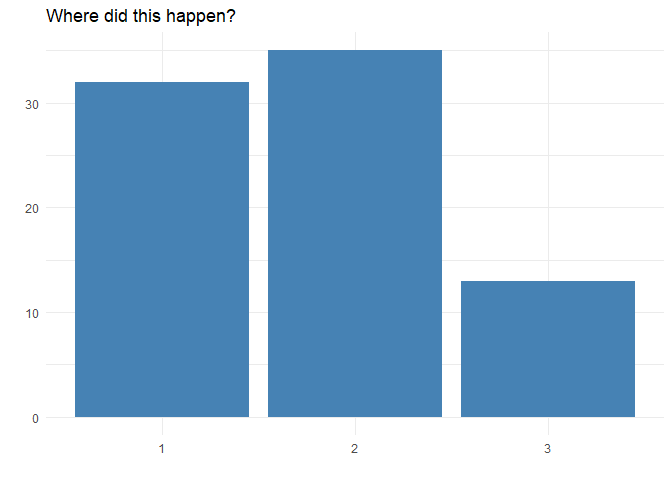<!-- -->


#### Missingness

**Missingness Descriptives**

Delivered / Answered = 68 / 68
Missing = 0
Min = 0, Max = 0, Mean = 0, SD = 0
(Descriptives are rounded to 2 decimals)

Missingness Intraclass Correlation (ICC) = NaN 


#### Screenshot


</div>


</div> <!-- Header section -->

<div class = "header-shading">

#### How bothered or stressed were you because of this? <br>

<div style="font-weight: bold; color: #2a5caa; margin-top: -0.7em; margin-bottom: 1em;">
  <a href="#Item 1130-anchor"> [Item 1130] </a>
</div>


</div>


<!-- Body -->


<div class = "anchor">

<div id="Question 1778-anchor">
  <strong>Question ID</strong>: Question 1778
</div>

**Way the question was delivered:** Slider

**Type of data:** numeric

</div> <div class = "anchor">


**Descriptives**
Min = 15, Max = 98, Mean = 66.08, SD = 21.57 


<button 
  onclick="let e = document.getElementById('Question 1778');
           let arrow = document.getElementById('Question 1778_arrow');
           e.style.display = e.style.display === 'none' ? 'block' : 'none';
           arrow.textContent = e.style.display === 'none' ? '▼' : '▲';"
  style="background: none; border: none; padding: 0; font-weight: bold; font-size: 18px; color: #2a5caa; cursor: pointer;">
Click to view visuals <span id="Question 1778_arrow">▼</span>
</button>

<div id="Question 1778" style="display: none;">


<!-- TOC-IGNORE-BEGIN -->

### Descriptives {.tabset}


#### Histogram

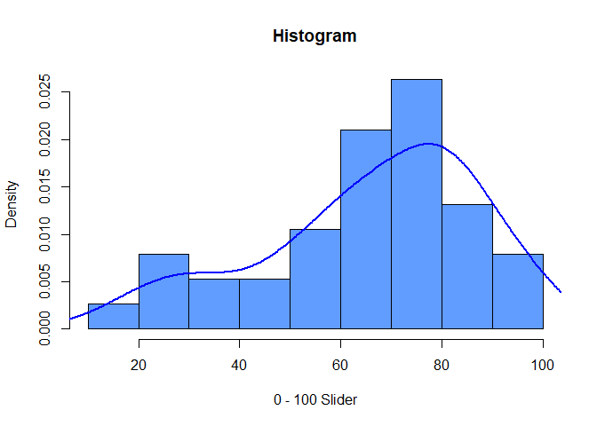<!-- -->


#### Missingness

**Missingness Descriptives**

Delivered / Answered = 38 / 38
Missing = 0
Min = 0, Max = 0, Mean = 0, SD = 0
(Descriptives are rounded to 2 decimals)

Missingness Intraclass Correlation (ICC) = NaN 


#### Screenshot


</div>

</div> <!-- Header section -->

<div class = "header-shading">

#### Who did this problem involve? <br>

<div style="font-weight: bold; color: #2a5caa; margin-top: -0.7em; margin-bottom: 1em;">
  <a href="#Item 1131-anchor"> [Item 1131] </a>
</div>


</div>


<!-- Body -->


<div class = "anchor">

<div id="Question 1779-anchor">
  <strong>Question ID</strong>: Question 1779
</div>

**Way the question was delivered:** Multiple Select

**Type of data:** integer

</div> 
<div class = "anchor">


<button 
  onclick="let e = document.getElementById('Question 1779');
           let arrow = document.getElementById('Question 1779_arrow');
           e.style.display = e.style.display === 'none' ? 'block' : 'none';
           arrow.textContent = e.style.display === 'none' ? '▼' : '▲';"
  style="background: none; border: none; padding: 0; font-weight: bold; font-size: 18px; color: #2a5caa; cursor: pointer;">
Click to view visuals <span id="Question 1779_arrow">▼</span>
</button>

<div id="Question 1779" style="display: none;">


<!-- TOC-IGNORE-BEGIN -->

### Descriptives {.tabset}


#### Frequency Table

<table class="table" style="color: black; margin-left: auto; margin-right: auto;">
 <thead>
  <tr>
   <th style="text-align:left;"> Value </th>
   <th style="text-align:left;"> Label </th>
   <th style="text-align:left;"> Counts </th>
   <th style="text-align:left;"> Percentages </th>
  </tr>
 </thead>
<tbody>
  <tr>
   <td style="text-align:left;"> 1 </td>
   <td style="text-align:left;"> Family </td>
   <td style="text-align:left;color: darkgreen !important;"> N = 16 </td>
   <td style="text-align:left;"> 36.4% </td>
  </tr>
  <tr>
   <td style="text-align:left;"> 2 </td>
   <td style="text-align:left;"> Friends or someone you know </td>
   <td style="text-align:left;color: darkgreen !important;"> N = 20 </td>
   <td style="text-align:left;"> 45.5% </td>
  </tr>
  <tr>
   <td style="text-align:left;"> 3 </td>
   <td style="text-align:left;"> Other (ex: strangers) </td>
   <td style="text-align:left;color: darkgreen !important;"> N = 8 </td>
   <td style="text-align:left;"> 18.2% </td>
  </tr>
</tbody>
</table>


#### Barplot

<!-- -->


#### Missingness

**Missingness Descriptives**

Delivered / Answered = 37 / 37
Missing = 0
Min = 0, Max = 0, Mean = 0, SD = 0
(Descriptives are rounded to 2 decimals)

Missingness Intraclass Correlation (ICC) = NaN 


#### Screenshot


</div>


</div> <!-- Header section -->

<div class = "header-shading">

#### Check all the ways that you interacted with your parent, in person. <br>

<div style="font-weight: bold; color: #2a5caa; margin-top: -0.7em; margin-bottom: 1em;">
  <a href="#Item 1133-anchor"> [Item 1133] </a>
</div>


</div>


<!-- Body -->


<div class = "anchor">

<div id="Question 1781-anchor">
  <strong>Question ID</strong>: Question 1781
</div>

**Way the question was delivered:** Multiple Select

**Type of data:** integer

</div> 
<div class = "anchor">


<button 
  onclick="let e = document.getElementById('Question 1781');
           let arrow = document.getElementById('Question 1781_arrow');
           e.style.display = e.style.display === 'none' ? 'block' : 'none';
           arrow.textContent = e.style.display === 'none' ? '▼' : '▲';"
  style="background: none; border: none; padding: 0; font-weight: bold; font-size: 18px; color: #2a5caa; cursor: pointer;">
Click to view visuals <span id="Question 1781_arrow">▼</span>
</button>

<div id="Question 1781" style="display: none;">


<!-- TOC-IGNORE-BEGIN -->

### Descriptives {.tabset}


#### Frequency Table

<table class="table" style="color: black; margin-left: auto; margin-right: auto;">
 <thead>
  <tr>
   <th style="text-align:left;"> Value </th>
   <th style="text-align:left;"> Label </th>
   <th style="text-align:left;"> Counts </th>
   <th style="text-align:left;"> Percentages </th>
  </tr>
 </thead>
<tbody>
  <tr>
   <td style="text-align:left;"> 1 </td>
   <td style="text-align:left;"> Do something together (ex: eat, clean, watch a show) </td>
   <td style="text-align:left;color: darkgreen !important;"> N = 359 </td>
   <td style="text-align:left;"> 18.4% </td>
  </tr>
  <tr>
   <td style="text-align:left;"> 2 </td>
   <td style="text-align:left;"> Make physical contact (ex: hug, lean on each other) </td>
   <td style="text-align:left;color: darkgreen !important;"> N = 238 </td>
   <td style="text-align:left;"> 12.2% </td>
  </tr>
  <tr>
   <td style="text-align:left;"> 3 </td>
   <td style="text-align:left;"> Just be together (ex: be on your own phones) </td>
   <td style="text-align:left;color: darkgreen !important;"> N = 323 </td>
   <td style="text-align:left;"> 16.6% </td>
  </tr>
  <tr>
   <td style="text-align:left;"> 4 </td>
   <td style="text-align:left;"> Ask a question or make a request </td>
   <td style="text-align:left;color: darkgreen !important;"> N = 242 </td>
   <td style="text-align:left;"> 12.4% </td>
  </tr>
  <tr>
   <td style="text-align:left;"> 5 </td>
   <td style="text-align:left;"> Reply to a question or request </td>
   <td style="text-align:left;color: darkgreen !important;"> N = 237 </td>
   <td style="text-align:left;"> 12.2% </td>
  </tr>
  <tr>
   <td style="text-align:left;"> 6 </td>
   <td style="text-align:left;"> Have a conversation (ex: exchange a few words or more) </td>
   <td style="text-align:left;color: darkgreen !important;"> N = 468 </td>
   <td style="text-align:left;"> 24% </td>
  </tr>
  <tr>
   <td style="text-align:left;"> 7 </td>
   <td style="text-align:left;"> Other </td>
   <td style="text-align:left;color: darkgreen !important;"> N = 51 </td>
   <td style="text-align:left;"> 2.6% </td>
  </tr>
  <tr>
   <td style="text-align:left;"> 8 </td>
   <td style="text-align:left;"> None apply </td>
   <td style="text-align:left;color: darkgreen !important;"> N = 32 </td>
   <td style="text-align:left;"> 1.6% </td>
  </tr>
</tbody>
</table>


#### Barplot

<!-- -->


#### Missingness

**Missingness Descriptives**

Delivered / Answered = 694 / 692
Missing = 2
Min = 0, Max = 1, Mean = 0.01, SD = 0.12
(Descriptives are rounded to 2 decimals)

Missingness Intraclass Correlation (ICC) = 1.25 


#### Screenshot


</div>


</div> <!-- Header section -->

<div class = "header-shading">

#### How close did you feel to your parent? <br>

<div style="font-weight: bold; color: #2a5caa; margin-top: -0.7em; margin-bottom: 1em;">
  <a href="#Item 1134-anchor"> [Item 1134] </a>
</div>


</div>


<!-- Body -->


<div class = "anchor">

<div id="Question 2025-anchor">
  <strong>Question ID</strong>: Question 2025
</div>

**Way the question was delivered:** Slider

**Type of data:** numeric

</div> <div class = "anchor">


**Descriptives**
Min = 1, Max = 4, Mean = 3.11, SD = 0.8 


<button 
  onclick="let e = document.getElementById('Question 2025');
           let arrow = document.getElementById('Question 2025_arrow');
           e.style.display = e.style.display === 'none' ? 'block' : 'none';
           arrow.textContent = e.style.display === 'none' ? '▼' : '▲';"
  style="background: none; border: none; padding: 0; font-weight: bold; font-size: 18px; color: #2a5caa; cursor: pointer;">
Click to view visuals <span id="Question 2025_arrow">▼</span>
</button>

<div id="Question 2025" style="display: none;">


<!-- TOC-IGNORE-BEGIN -->

### Descriptives {.tabset}


#### Histogram

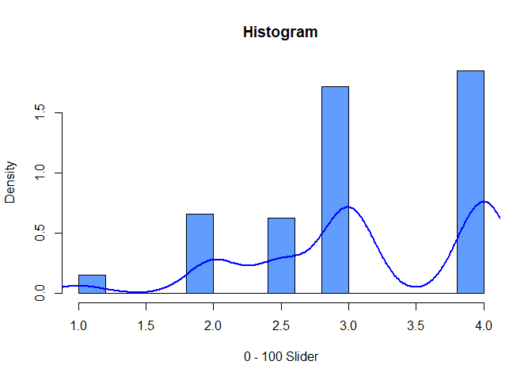<!-- -->


#### Missingness

**Missingness Descriptives**

Delivered / Answered = 730 / 723
Missing = 7
Min = 0, Max = 3, Mean = 0.05, SD = 0.32
(Descriptives are rounded to 2 decimals)

Missingness Intraclass Correlation (ICC) = 1.11 


#### Screenshot


</div>

</div> <!-- Header section -->

<div class = "header-shading">

#### Who else was a part of your most recent interaction with your parent? <br>

<div style="font-weight: bold; color: #2a5caa; margin-top: -0.7em; margin-bottom: 1em;">
  <a href="#Item 1135-anchor"> [Item 1135] </a>
</div>


</div>


<!-- Body -->


<div class = "anchor">

<div id="Question 1783-anchor">
  <strong>Question ID</strong>: Question 1783
</div>

**Way the question was delivered:** Multiple Select

**Type of data:** integer

</div> 
<div class = "anchor">


<button 
  onclick="let e = document.getElementById('Question 1783');
           let arrow = document.getElementById('Question 1783_arrow');
           e.style.display = e.style.display === 'none' ? 'block' : 'none';
           arrow.textContent = e.style.display === 'none' ? '▼' : '▲';"
  style="background: none; border: none; padding: 0; font-weight: bold; font-size: 18px; color: #2a5caa; cursor: pointer;">
Click to view visuals <span id="Question 1783_arrow">▼</span>
</button>

<div id="Question 1783" style="display: none;">


<!-- TOC-IGNORE-BEGIN -->

### Descriptives {.tabset}


#### Frequency Table

<table class="table" style="color: black; margin-left: auto; margin-right: auto;">
 <thead>
  <tr>
   <th style="text-align:left;"> Value </th>
   <th style="text-align:left;"> Label </th>
   <th style="text-align:left;"> Counts </th>
   <th style="text-align:left;"> Percentages </th>
  </tr>
 </thead>
<tbody>
  <tr>
   <td style="text-align:left;"> 1 </td>
   <td style="text-align:left;"> Other parent or caregivers </td>
   <td style="text-align:left;color: darkgreen !important;"> N = 288 </td>
   <td style="text-align:left;"> 25.3% </td>
  </tr>
  <tr>
   <td style="text-align:left;"> 2 </td>
   <td style="text-align:left;"> Siblings </td>
   <td style="text-align:left;color: darkgreen !important;"> N = 347 </td>
   <td style="text-align:left;"> 30.5% </td>
  </tr>
  <tr>
   <td style="text-align:left;"> 3 </td>
   <td style="text-align:left;"> Other adults </td>
   <td style="text-align:left;color: darkgreen !important;"> N = 141 </td>
   <td style="text-align:left;"> 12.4% </td>
  </tr>
  <tr>
   <td style="text-align:left;"> 4 </td>
   <td style="text-align:left;"> Other children or teens </td>
   <td style="text-align:left;color: darkgreen !important;"> N = 105 </td>
   <td style="text-align:left;"> 9.2% </td>
  </tr>
  <tr>
   <td style="text-align:left;"> 5 </td>
   <td style="text-align:left;"> Strangers (ex: cashier) </td>
   <td style="text-align:left;color: darkgreen !important;"> N = 39 </td>
   <td style="text-align:left;"> 3.4% </td>
  </tr>
  <tr>
   <td style="text-align:left;"> 6 </td>
   <td style="text-align:left;"> None apply </td>
   <td style="text-align:left;color: darkgreen !important;"> N = 217 </td>
   <td style="text-align:left;"> 19.1% </td>
  </tr>
</tbody>
</table>


#### Barplot

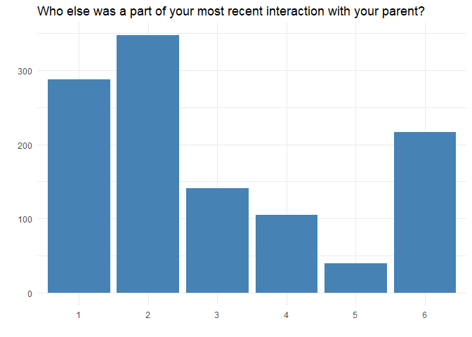<!-- -->


#### Missingness

**Missingness Descriptives**

Delivered / Answered = 730 / 724
Missing = 6
Min = 0, Max = 2, Mean = 0.04, SD = 0.23
(Descriptives are rounded to 2 decimals)

Missingness Intraclass Correlation (ICC) = 1.19 


#### Screenshot


</div>


</div> <!-- Header section -->

<div class = "header-shading">

#### Check all the ways that you interacted with parents. <br>

<div style="font-weight: bold; color: #2a5caa; margin-top: -0.7em; margin-bottom: 1em;">
  <a href="#Item 4465-anchor"> [Item 4465] </a>
</div>


</div>


<!-- Body -->


<div class = "anchor">

<div id="Question 4088-anchor">
  <strong>Question ID</strong>: Question 4088
</div>

**Way the question was delivered:** Multiple Select

**Type of data:** integer

</div> 
<div class = "anchor">


<button 
  onclick="let e = document.getElementById('Question 4088');
           let arrow = document.getElementById('Question 4088_arrow');
           e.style.display = e.style.display === 'none' ? 'block' : 'none';
           arrow.textContent = e.style.display === 'none' ? '▼' : '▲';"
  style="background: none; border: none; padding: 0; font-weight: bold; font-size: 18px; color: #2a5caa; cursor: pointer;">
Click to view visuals <span id="Question 4088_arrow">▼</span>
</button>

<div id="Question 4088" style="display: none;">


<!-- TOC-IGNORE-BEGIN -->

### Descriptives {.tabset}


#### Frequency Table

<table class="table" style="color: black; margin-left: auto; margin-right: auto;">
 <thead>
  <tr>
   <th style="text-align:left;"> Value </th>
   <th style="text-align:left;"> Label </th>
   <th style="text-align:left;"> Counts </th>
   <th style="text-align:left;"> Percentages </th>
  </tr>
 </thead>
<tbody>
  <tr>
   <td style="text-align:left;"> 1 </td>
   <td style="text-align:left;"> in person </td>
   <td style="text-align:left;color: darkgreen !important;"> N = 666 </td>
   <td style="text-align:left;"> 61.2% </td>
  </tr>
  <tr>
   <td style="text-align:left;"> 2 </td>
   <td style="text-align:left;"> text </td>
   <td style="text-align:left;color: darkgreen !important;"> N = 247 </td>
   <td style="text-align:left;"> 22.7% </td>
  </tr>
  <tr>
   <td style="text-align:left;"> 3 </td>
   <td style="text-align:left;"> Phone call </td>
   <td style="text-align:left;color: darkgreen !important;"> N = 122 </td>
   <td style="text-align:left;"> 11.2% </td>
  </tr>
  <tr>
   <td style="text-align:left;"> 4 </td>
   <td style="text-align:left;"> video chat </td>
   <td style="text-align:left;color: darkgreen !important;"> N = 26 </td>
   <td style="text-align:left;"> 2.4% </td>
  </tr>
  <tr>
   <td style="text-align:left;"> 5 </td>
   <td style="text-align:left;"> Other </td>
   <td style="text-align:left;color: darkgreen !important;"> N = 28 </td>
   <td style="text-align:left;"> 2.6% </td>
  </tr>
</tbody>
</table>


#### Barplot

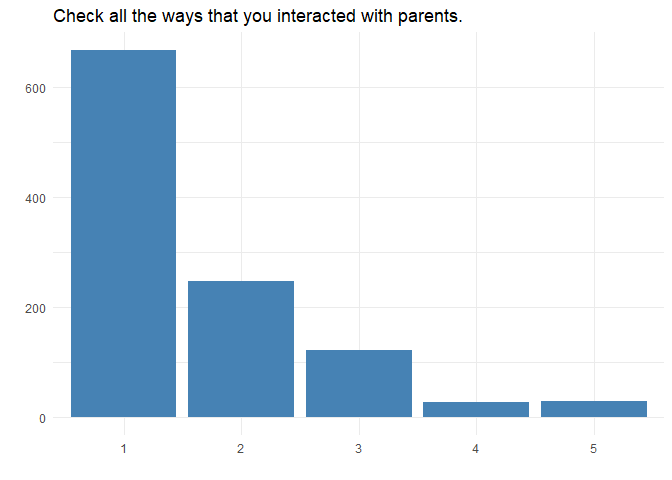<!-- -->


#### Missingness

**Missingness Descriptives**

Delivered / Answered = 705 / 703
Missing = 2
Min = 0, Max = 2, Mean = 0.01, SD = 0.17
(Descriptives are rounded to 2 decimals)

Missingness Intraclass Correlation (ICC) = 1.11 


#### Screenshot


</div>


</div> <!-- Header section -->

<div class = "header-shading">

#### Did you have an argument or disagreement? <br>

<div style="font-weight: bold; color: #2a5caa; margin-top: -0.7em; margin-bottom: 1em;">
  <a href="#Item 1117-anchor"> [Item 1117] </a>
</div>


</div>


<!-- Body -->


<div class = "anchor">

<div id="Question 1768-anchor">
  <strong>Question ID</strong>: Question 1768
</div>

**Way the question was delivered:** Multiple Choice

**Type of data:** integer

</div> 
<div class = "anchor">


<button 
  onclick="let e = document.getElementById('Question 1768');
           let arrow = document.getElementById('Question 1768_arrow');
           e.style.display = e.style.display === 'none' ? 'block' : 'none';
           arrow.textContent = e.style.display === 'none' ? '▼' : '▲';"
  style="background: none; border: none; padding: 0; font-weight: bold; font-size: 18px; color: #2a5caa; cursor: pointer;">
Click to view visuals <span id="Question 1768_arrow">▼</span>
</button>

<div id="Question 1768" style="display: none;">


<!-- TOC-IGNORE-BEGIN -->

### Descriptives {.tabset}


#### Frequency Table

<table class="table" style="color: black; margin-left: auto; margin-right: auto;">
 <thead>
  <tr>
   <th style="text-align:left;"> Value </th>
   <th style="text-align:left;"> Label </th>
   <th style="text-align:left;"> Counts </th>
   <th style="text-align:left;"> Percentages </th>
  </tr>
 </thead>
<tbody>
  <tr>
   <td style="text-align:left;"> 1 </td>
   <td style="text-align:left;"> Yes </td>
   <td style="text-align:left;color: darkgreen !important;"> N = 61 </td>
   <td style="text-align:left;"> 39.4% </td>
  </tr>
  <tr>
   <td style="text-align:left;"> 2 </td>
   <td style="text-align:left;"> No </td>
   <td style="text-align:left;color: darkgreen !important;"> N = 94 </td>
   <td style="text-align:left;"> 60.6% </td>
  </tr>
</tbody>
</table>


#### Barplot

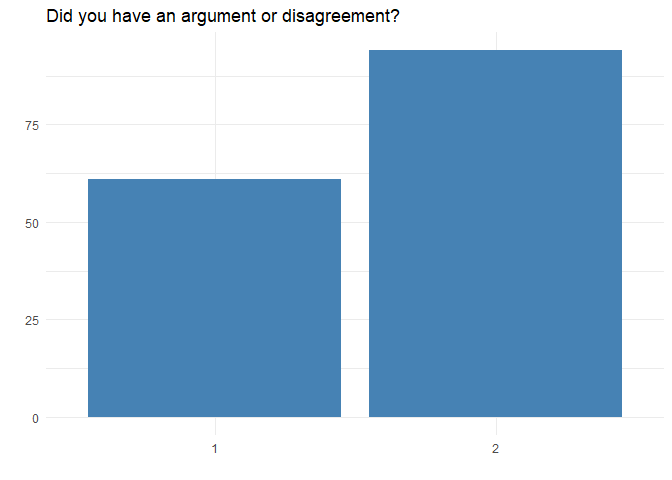<!-- -->


#### Missingness

**Missingness Descriptives**

Delivered / Answered = 155 / 155
Missing = 0
Min = 0, Max = 0, Mean = 0, SD = 0
(Descriptives are rounded to 2 decimals)

Missingness Intraclass Correlation (ICC) = NaN 


#### Screenshot


</div>


</div> 
### Block: Item 1120 <!-- Header section -->

<div class = "header-shading">

#### Did you feel like you had a lot of demands placed on you that were stressful? (ex: had to do a chore; had too much homework)? <br>

<div style="font-weight: bold; color: #2a5caa; margin-top: -0.7em; margin-bottom: 1em;">
  <a href="#Item 1121-anchor"> [Item 1121] </a>
</div>


</div>


<!-- Body -->


<div class = "anchor">

<div id="Question 1771-anchor">
  <strong>Question ID</strong>: Question 1771
</div>

**Way the question was delivered:** Multiple Choice

**Type of data:** integer

</div> 
<div class = "anchor">


<button 
  onclick="let e = document.getElementById('Question 1771');
           let arrow = document.getElementById('Question 1771_arrow');
           e.style.display = e.style.display === 'none' ? 'block' : 'none';
           arrow.textContent = e.style.display === 'none' ? '▼' : '▲';"
  style="background: none; border: none; padding: 0; font-weight: bold; font-size: 18px; color: #2a5caa; cursor: pointer;">
Click to view visuals <span id="Question 1771_arrow">▼</span>
</button>

<div id="Question 1771" style="display: none;">


<!-- TOC-IGNORE-BEGIN -->

### Descriptives {.tabset}


#### Frequency Table

<table class="table" style="color: black; margin-left: auto; margin-right: auto;">
 <thead>
  <tr>
   <th style="text-align:left;"> Value </th>
   <th style="text-align:left;"> Label </th>
   <th style="text-align:left;"> Counts </th>
   <th style="text-align:left;"> Percentages </th>
  </tr>
 </thead>
<tbody>
  <tr>
   <td style="text-align:left;"> 1 </td>
   <td style="text-align:left;"> Yes </td>
   <td style="text-align:left;color: darkgreen !important;"> N = 78 </td>
   <td style="text-align:left;"> 50.6% </td>
  </tr>
  <tr>
   <td style="text-align:left;"> 2 </td>
   <td style="text-align:left;"> No </td>
   <td style="text-align:left;color: darkgreen !important;"> N = 76 </td>
   <td style="text-align:left;"> 49.4% </td>
  </tr>
</tbody>
</table>


#### Barplot

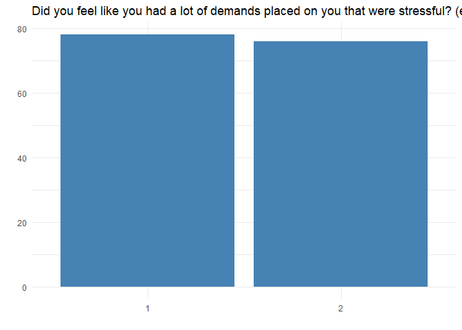<!-- -->


#### Missingness

**Missingness Descriptives**

Delivered / Answered = 154 / 154
Missing = 0
Min = 0, Max = 0, Mean = 0, SD = 0
(Descriptives are rounded to 2 decimals)

Missingness Intraclass Correlation (ICC) = NaN 


#### Screenshot


</div>


</div> 
### Block: Item 1124 <!-- Header section -->

<div class = "header-shading">

#### Did you have some other problem or event that was stressful? (ex: forgot something; was late to an appointment)? <br>

<div style="font-weight: bold; color: #2a5caa; margin-top: -0.7em; margin-bottom: 1em;">
  <a href="#Item 1125-anchor"> [Item 1125] </a>
</div>


</div>


<!-- Body -->


<div class = "anchor">

<div id="Question 1774-anchor">
  <strong>Question ID</strong>: Question 1774
</div>

**Way the question was delivered:** Multiple Choice

**Type of data:** integer

</div> 
<div class = "anchor">


<button 
  onclick="let e = document.getElementById('Question 1774');
           let arrow = document.getElementById('Question 1774_arrow');
           e.style.display = e.style.display === 'none' ? 'block' : 'none';
           arrow.textContent = e.style.display === 'none' ? '▼' : '▲';"
  style="background: none; border: none; padding: 0; font-weight: bold; font-size: 18px; color: #2a5caa; cursor: pointer;">
Click to view visuals <span id="Question 1774_arrow">▼</span>
</button>

<div id="Question 1774" style="display: none;">


<!-- TOC-IGNORE-BEGIN -->

### Descriptives {.tabset}


#### Frequency Table

<table class="table" style="color: black; margin-left: auto; margin-right: auto;">
 <thead>
  <tr>
   <th style="text-align:left;"> Value </th>
   <th style="text-align:left;"> Label </th>
   <th style="text-align:left;"> Counts </th>
   <th style="text-align:left;"> Percentages </th>
  </tr>
 </thead>
<tbody>
  <tr>
   <td style="text-align:left;"> 1 </td>
   <td style="text-align:left;"> Yes </td>
   <td style="text-align:left;color: darkgreen !important;"> N = 68 </td>
   <td style="text-align:left;"> 44.4% </td>
  </tr>
  <tr>
   <td style="text-align:left;"> 2 </td>
   <td style="text-align:left;"> No </td>
   <td style="text-align:left;color: darkgreen !important;"> N = 85 </td>
   <td style="text-align:left;"> 55.6% </td>
  </tr>
</tbody>
</table>


#### Barplot

<!-- -->


#### Missingness

**Missingness Descriptives**

Delivered / Answered = 154 / 153
Missing = 1
Min = 0, Max = 1, Mean = 0.01, SD = 0.12
(Descriptives are rounded to 2 decimals)

Missingness Intraclass Correlation (ICC) = 1.84 


#### Screenshot


</div>


</div> 
### Block: Item 1128 <!-- Header section -->

<div class = "header-shading">

#### Did someone else have a problem or event that turned out to be stressful for you? <br>

<div style="font-weight: bold; color: #2a5caa; margin-top: -0.7em; margin-bottom: 1em;">
  <a href="#Item 1129-anchor"> [Item 1129] </a>
</div>


</div>


<!-- Body -->


<div class = "anchor">

<div id="Question 1777-anchor">
  <strong>Question ID</strong>: Question 1777
</div>

**Way the question was delivered:** Multiple Choice

**Type of data:** integer

</div> 
<div class = "anchor">


<button 
  onclick="let e = document.getElementById('Question 1777');
           let arrow = document.getElementById('Question 1777_arrow');
           e.style.display = e.style.display === 'none' ? 'block' : 'none';
           arrow.textContent = e.style.display === 'none' ? '▼' : '▲';"
  style="background: none; border: none; padding: 0; font-weight: bold; font-size: 18px; color: #2a5caa; cursor: pointer;">
Click to view visuals <span id="Question 1777_arrow">▼</span>
</button>

<div id="Question 1777" style="display: none;">


<!-- TOC-IGNORE-BEGIN -->

### Descriptives {.tabset}


#### Frequency Table

<table class="table" style="color: black; margin-left: auto; margin-right: auto;">
 <thead>
  <tr>
   <th style="text-align:left;"> Value </th>
   <th style="text-align:left;"> Label </th>
   <th style="text-align:left;"> Counts </th>
   <th style="text-align:left;"> Percentages </th>
  </tr>
 </thead>
<tbody>
  <tr>
   <td style="text-align:left;"> 1 </td>
   <td style="text-align:left;"> Yes </td>
   <td style="text-align:left;color: darkgreen !important;"> N = 38 </td>
   <td style="text-align:left;"> 24.7% </td>
  </tr>
  <tr>
   <td style="text-align:left;"> 2 </td>
   <td style="text-align:left;"> No </td>
   <td style="text-align:left;color: darkgreen !important;"> N = 116 </td>
   <td style="text-align:left;"> 75.3% </td>
  </tr>
</tbody>
</table>


#### Barplot

<!-- -->


#### Missingness

**Missingness Descriptives**

Delivered / Answered = 154 / 154
Missing = 0
Min = 0, Max = 0, Mean = 0, SD = 0
(Descriptives are rounded to 2 decimals)

Missingness Intraclass Correlation (ICC) = NaN 


#### Screenshot


</div>


</div> 
### Block: Item 1132 <!-- Header section -->

<div class = "header-shading">

#### No Text <br>

<div style="font-weight: bold; color: #2a5caa; margin-top: -0.7em; margin-bottom: 1em;">
  <a href="#Item 1364-anchor"> [Item 1364] </a>
</div>


</div>


<!-- Body -->


<div class = "anchor">

<div id="Question 2300-anchor">
  <strong>Question ID</strong>: Question 2300
</div>

**Way the question was delivered:** End Block

**Type of data:** NA

</div>  <!-- Header section -->

<div class = "header-shading">

#### Did you ask your parent to <br>

<div style="font-weight: bold; color: #2a5caa; margin-top: -0.7em; margin-bottom: 1em;">
  <a href="#Item 5525-anchor"> [Item 5525] </a>
</div>


</div>


<!-- Body -->


<div class = "anchor">

<div id="Question 5633-anchor">
  <strong>Question ID</strong>: Question 5633
</div>

**Way the question was delivered:** Multiple Select

**Type of data:** integer

</div> 
<div class = "anchor">


<button 
  onclick="let e = document.getElementById('Question 5633');
           let arrow = document.getElementById('Question 5633_arrow');
           e.style.display = e.style.display === 'none' ? 'block' : 'none';
           arrow.textContent = e.style.display === 'none' ? '▼' : '▲';"
  style="background: none; border: none; padding: 0; font-weight: bold; font-size: 18px; color: #2a5caa; cursor: pointer;">
Click to view visuals <span id="Question 5633_arrow">▼</span>
</button>

<div id="Question 5633" style="display: none;">


<!-- TOC-IGNORE-BEGIN -->

### Descriptives {.tabset}


#### Frequency Table

<table class="table" style="color: black; margin-left: auto; margin-right: auto;">
 <thead>
  <tr>
   <th style="text-align:left;"> Value </th>
   <th style="text-align:left;"> Label </th>
   <th style="text-align:left;"> Counts </th>
   <th style="text-align:left;"> Percentages </th>
  </tr>
 </thead>
<tbody>
  <tr>
   <td style="text-align:left;"> 1 </td>
   <td style="text-align:left;"> Give you emotional support </td>
   <td style="text-align:left;color: darkgreen !important;"> N = 51 </td>
   <td style="text-align:left;"> 5.3% </td>
  </tr>
  <tr>
   <td style="text-align:left;"> 2 </td>
   <td style="text-align:left;"> Listen to you when you speak </td>
   <td style="text-align:left;color: darkgreen !important;"> N = 75 </td>
   <td style="text-align:left;"> 7.8% </td>
  </tr>
  <tr>
   <td style="text-align:left;"> 3 </td>
   <td style="text-align:left;"> Show that she understands or tell you about a similar situation </td>
   <td style="text-align:left;color: darkgreen !important;"> N = 57 </td>
   <td style="text-align:left;"> 5.9% </td>
  </tr>
  <tr>
   <td style="text-align:left;"> 4 </td>
   <td style="text-align:left;"> Give you information and ideas about how to make things better </td>
   <td style="text-align:left;color: darkgreen !important;"> N = 70 </td>
   <td style="text-align:left;"> 7.2% </td>
  </tr>
  <tr>
   <td style="text-align:left;"> 5 </td>
   <td style="text-align:left;"> Give you advice about what to do </td>
   <td style="text-align:left;color: darkgreen !important;"> N = 90 </td>
   <td style="text-align:left;"> 9.3% </td>
  </tr>
  <tr>
   <td style="text-align:left;"> 6 </td>
   <td style="text-align:left;"> Think about the situation with you and tell you what you can do about it </td>
   <td style="text-align:left;color: darkgreen !important;"> N = 69 </td>
   <td style="text-align:left;"> 7.1% </td>
  </tr>
  <tr>
   <td style="text-align:left;"> 7 </td>
   <td style="text-align:left;"> Do something to help you </td>
   <td style="text-align:left;color: darkgreen !important;"> N = 153 </td>
   <td style="text-align:left;"> 15.8% </td>
  </tr>
  <tr>
   <td style="text-align:left;"> 8 </td>
   <td style="text-align:left;"> Offer to do something to help you </td>
   <td style="text-align:left;color: darkgreen !important;"> N = 72 </td>
   <td style="text-align:left;"> 7.5% </td>
  </tr>
  <tr>
   <td style="text-align:left;"> 9 </td>
   <td style="text-align:left;"> None apply </td>
   <td style="text-align:left;color: darkgreen !important;"> N = 329 </td>
   <td style="text-align:left;"> 34.1% </td>
  </tr>
</tbody>
</table>


#### Barplot

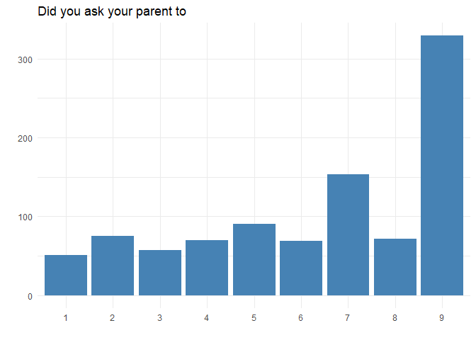<!-- -->


#### Missingness

**Missingness Descriptives**

Delivered / Answered = 583 / 579
Missing = 4
Min = 0, Max = 1, Mean = 0.03, SD = 0.18
(Descriptives are rounded to 2 decimals)

Missingness Intraclass Correlation (ICC) = 1.27 


#### Screenshot


</div>


</div> <!-- Header section -->

<div class = "header-shading">

#### Please describe how you asked (ex: directly asking is when you use your words to say what you would like your parents to do; indirectly asking is when you hint at something and hope your parent understands) <br>

<div style="font-weight: bold; color: #2a5caa; margin-top: -0.7em; margin-bottom: 1em;">
  <a href="#Item 5526-anchor"> [Item 5526] </a>
</div>


</div>


<!-- Body -->


<div class = "anchor">

<div id="Question 5634-anchor">
  <strong>Question ID</strong>: Question 5634
</div>

**Way the question was delivered:** Slider

**Type of data:** numeric

</div> <div class = "anchor">


**Descriptives**
Min = 0, Max = 100, Mean = 71.47, SD = 25.06 


<button 
  onclick="let e = document.getElementById('Question 5634');
           let arrow = document.getElementById('Question 5634_arrow');
           e.style.display = e.style.display === 'none' ? 'block' : 'none';
           arrow.textContent = e.style.display === 'none' ? '▼' : '▲';"
  style="background: none; border: none; padding: 0; font-weight: bold; font-size: 18px; color: #2a5caa; cursor: pointer;">
Click to view visuals <span id="Question 5634_arrow">▼</span>
</button>

<div id="Question 5634" style="display: none;">


<!-- TOC-IGNORE-BEGIN -->

### Descriptives {.tabset}


#### Histogram

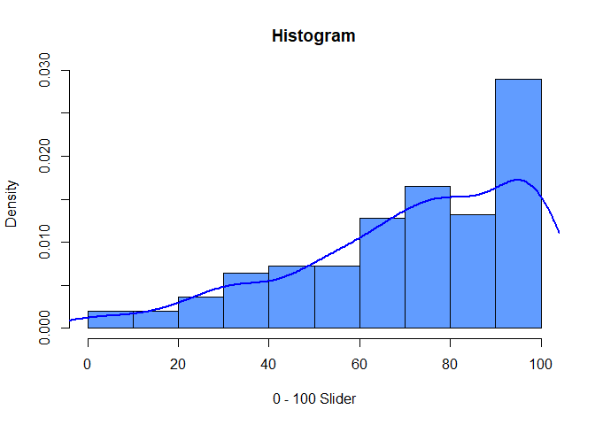<!-- -->


#### Missingness

**Missingness Descriptives**

Delivered / Answered = 250 / 249
Missing = 1
Min = 0, Max = 1, Mean = 0.01, SD = 0.11
(Descriptives are rounded to 2 decimals)

Missingness Intraclass Correlation (ICC) = 1.5 


#### Screenshot


</div>

</div> <!-- Header section -->

<div class = "header-shading">

#### Check all that she did: <br>

<div style="font-weight: bold; color: #2a5caa; margin-top: -0.7em; margin-bottom: 1em;">
  <a href="#Item 5527-anchor"> [Item 5527] </a>
</div>


</div>


<!-- Body -->


<div class = "anchor">

<div id="Question 5635-anchor">
  <strong>Question ID</strong>: Question 5635
</div>

**Way the question was delivered:** Multiple Select

**Type of data:** integer

</div> 
<div class = "anchor">


<button 
  onclick="let e = document.getElementById('Question 5635');
           let arrow = document.getElementById('Question 5635_arrow');
           e.style.display = e.style.display === 'none' ? 'block' : 'none';
           arrow.textContent = e.style.display === 'none' ? '▼' : '▲';"
  style="background: none; border: none; padding: 0; font-weight: bold; font-size: 18px; color: #2a5caa; cursor: pointer;">
Click to view visuals <span id="Question 5635_arrow">▼</span>
</button>

<div id="Question 5635" style="display: none;">


<!-- TOC-IGNORE-BEGIN -->

### Descriptives {.tabset}


#### Frequency Table

<table class="table" style="color: black; margin-left: auto; margin-right: auto;">
 <thead>
  <tr>
   <th style="text-align:left;"> Value </th>
   <th style="text-align:left;"> Label </th>
   <th style="text-align:left;"> Counts </th>
   <th style="text-align:left;"> Percentages </th>
  </tr>
 </thead>
<tbody>
  <tr>
   <td style="text-align:left;"> 1 </td>
   <td style="text-align:left;"> Give you emotional support </td>
   <td style="text-align:left;color: darkgreen !important;"> N = 106 </td>
   <td style="text-align:left;"> 7.7% </td>
  </tr>
  <tr>
   <td style="text-align:left;"> 2 </td>
   <td style="text-align:left;"> Listen to you when you speak </td>
   <td style="text-align:left;color: darkgreen !important;"> N = 279 </td>
   <td style="text-align:left;"> 20.2% </td>
  </tr>
  <tr>
   <td style="text-align:left;"> 3 </td>
   <td style="text-align:left;"> Show that she understands or tell you about a similar situation </td>
   <td style="text-align:left;color: darkgreen !important;"> N = 138 </td>
   <td style="text-align:left;"> 10% </td>
  </tr>
  <tr>
   <td style="text-align:left;"> 4 </td>
   <td style="text-align:left;"> Give you information and ideas about how to make things better </td>
   <td style="text-align:left;color: darkgreen !important;"> N = 112 </td>
   <td style="text-align:left;"> 8.1% </td>
  </tr>
  <tr>
   <td style="text-align:left;"> 5 </td>
   <td style="text-align:left;"> Give you advice about what to do </td>
   <td style="text-align:left;color: darkgreen !important;"> N = 130 </td>
   <td style="text-align:left;"> 9.4% </td>
  </tr>
  <tr>
   <td style="text-align:left;"> 6 </td>
   <td style="text-align:left;"> Think about the situation with you and tell you what you can do about it </td>
   <td style="text-align:left;color: darkgreen !important;"> N = 96 </td>
   <td style="text-align:left;"> 7% </td>
  </tr>
  <tr>
   <td style="text-align:left;"> 7 </td>
   <td style="text-align:left;"> Do something to help you </td>
   <td style="text-align:left;color: darkgreen !important;"> N = 201 </td>
   <td style="text-align:left;"> 14.6% </td>
  </tr>
  <tr>
   <td style="text-align:left;"> 8 </td>
   <td style="text-align:left;"> Offer to do something to help you </td>
   <td style="text-align:left;color: darkgreen !important;"> N = 139 </td>
   <td style="text-align:left;"> 10.1% </td>
  </tr>
  <tr>
   <td style="text-align:left;"> 9 </td>
   <td style="text-align:left;"> None apply </td>
   <td style="text-align:left;color: darkgreen !important;"> N = 177 </td>
   <td style="text-align:left;"> 12.8% </td>
  </tr>
</tbody>
</table>


#### Barplot

<!-- -->


#### Missingness

**Missingness Descriptives**

Delivered / Answered = 582 / 578
Missing = 4
Min = 0, Max = 1, Mean = 0.03, SD = 0.18
(Descriptives are rounded to 2 decimals)

Missingness Intraclass Correlation (ICC) = 1.27 


#### Screenshot


</div>


</div> <!-- Header section -->

<div class = "header-shading">

#### Please tell us about the interaction you had with your mom: <br>

<div style="font-weight: bold; color: #2a5caa; margin-top: -0.7em; margin-bottom: 1em;">
  <a href="#Item 5528-anchor"> [Item 5528] </a>
</div>


</div>


<!-- Body -->


<div class = "anchor">

<div id="Question 5636-anchor">
  <strong>Question ID</strong>: Question 5636
</div>

**Way the question was delivered:** Informational Fullscreen

**Type of data:** NA

</div> <div class = "anchor">


</div> <!-- Header section -->

<div class = "header-shading">

#### I think that the interaction was high quality <br>

<div style="font-weight: bold; color: #2a5caa; margin-top: -0.7em; margin-bottom: 1em;">
  <a href="#Item 5529-anchor"> [Item 5529] </a>
</div>


</div>


<!-- Body -->


<div class = "anchor">

<div id="Question 5721-anchor">
  <strong>Question ID</strong>: Question 5721
</div>

**Way the question was delivered:** Multiple Choice

**Type of data:** integer

</div> 
<div class = "anchor">


<button 
  onclick="let e = document.getElementById('Question 5721');
           let arrow = document.getElementById('Question 5721_arrow');
           e.style.display = e.style.display === 'none' ? 'block' : 'none';
           arrow.textContent = e.style.display === 'none' ? '▼' : '▲';"
  style="background: none; border: none; padding: 0; font-weight: bold; font-size: 18px; color: #2a5caa; cursor: pointer;">
Click to view visuals <span id="Question 5721_arrow">▼</span>
</button>

<div id="Question 5721" style="display: none;">


<!-- TOC-IGNORE-BEGIN -->

### Descriptives {.tabset}


#### Frequency Table

<table class="table" style="color: black; margin-left: auto; margin-right: auto;">
 <thead>
  <tr>
   <th style="text-align:left;"> Value </th>
   <th style="text-align:left;"> Label </th>
   <th style="text-align:left;"> Counts </th>
   <th style="text-align:left;"> Percentages </th>
  </tr>
 </thead>
<tbody>
  <tr>
   <td style="text-align:left;"> 1 </td>
   <td style="text-align:left;"> Strongly disagree </td>
   <td style="text-align:left;color: darkgreen !important;"> N = 14 </td>
   <td style="text-align:left;"> 2.4% </td>
  </tr>
  <tr>
   <td style="text-align:left;"> 2 </td>
   <td style="text-align:left;"> Disagree </td>
   <td style="text-align:left;color: darkgreen !important;"> N = 30 </td>
   <td style="text-align:left;"> 5.2% </td>
  </tr>
  <tr>
   <td style="text-align:left;"> 3 </td>
   <td style="text-align:left;"> Agree some and disagree some </td>
   <td style="text-align:left;color: darkgreen !important;"> N = 137 </td>
   <td style="text-align:left;"> 23.8% </td>
  </tr>
  <tr>
   <td style="text-align:left;"> 4 </td>
   <td style="text-align:left;"> Agree </td>
   <td style="text-align:left;color: darkgreen !important;"> N = 233 </td>
   <td style="text-align:left;"> 40.5% </td>
  </tr>
  <tr>
   <td style="text-align:left;"> 5 </td>
   <td style="text-align:left;"> Strongly agree </td>
   <td style="text-align:left;color: darkgreen !important;"> N = 162 </td>
   <td style="text-align:left;"> 28.1% </td>
  </tr>
</tbody>
</table>


#### Barplot

<!-- -->


#### Missingness

**Missingness Descriptives**

Delivered / Answered = 579 / 576
Missing = 3
Min = 0, Max = 1, Mean = 0.03, SD = 0.16
(Descriptives are rounded to 2 decimals)

Missingness Intraclass Correlation (ICC) = 1.26 


#### Screenshot


</div>


</div> <!-- Header section -->

<div class = "header-shading">

#### The interaction was good <br>

<div style="font-weight: bold; color: #2a5caa; margin-top: -0.7em; margin-bottom: 1em;">
  <a href="#Item 5530-anchor"> [Item 5530] </a>
</div>


</div>


<!-- Body -->


<div class = "anchor">

<div id="Question 5722-anchor">
  <strong>Question ID</strong>: Question 5722
</div>

**Way the question was delivered:** Multiple Choice

**Type of data:** integer

</div> 
<div class = "anchor">


<button 
  onclick="let e = document.getElementById('Question 5722');
           let arrow = document.getElementById('Question 5722_arrow');
           e.style.display = e.style.display === 'none' ? 'block' : 'none';
           arrow.textContent = e.style.display === 'none' ? '▼' : '▲';"
  style="background: none; border: none; padding: 0; font-weight: bold; font-size: 18px; color: #2a5caa; cursor: pointer;">
Click to view visuals <span id="Question 5722_arrow">▼</span>
</button>

<div id="Question 5722" style="display: none;">


<!-- TOC-IGNORE-BEGIN -->

### Descriptives {.tabset}


#### Frequency Table

<table class="table" style="color: black; margin-left: auto; margin-right: auto;">
 <thead>
  <tr>
   <th style="text-align:left;"> Value </th>
   <th style="text-align:left;"> Label </th>
   <th style="text-align:left;"> Counts </th>
   <th style="text-align:left;"> Percentages </th>
  </tr>
 </thead>
<tbody>
  <tr>
   <td style="text-align:left;"> 1 </td>
   <td style="text-align:left;"> Strongly disagree </td>
   <td style="text-align:left;color: darkgreen !important;"> N = 11 </td>
   <td style="text-align:left;"> 1.9% </td>
  </tr>
  <tr>
   <td style="text-align:left;"> 2 </td>
   <td style="text-align:left;"> Disagree </td>
   <td style="text-align:left;color: darkgreen !important;"> N = 17 </td>
   <td style="text-align:left;"> 3% </td>
  </tr>
  <tr>
   <td style="text-align:left;"> 3 </td>
   <td style="text-align:left;"> Agree some and disagree some </td>
   <td style="text-align:left;color: darkgreen !important;"> N = 84 </td>
   <td style="text-align:left;"> 14.6% </td>
  </tr>
  <tr>
   <td style="text-align:left;"> 4 </td>
   <td style="text-align:left;"> Agree </td>
   <td style="text-align:left;color: darkgreen !important;"> N = 271 </td>
   <td style="text-align:left;"> 47.2% </td>
  </tr>
  <tr>
   <td style="text-align:left;"> 5 </td>
   <td style="text-align:left;"> Strongly agree </td>
   <td style="text-align:left;color: darkgreen !important;"> N = 191 </td>
   <td style="text-align:left;"> 33.3% </td>
  </tr>
</tbody>
</table>


#### Barplot

<!-- -->


#### Missingness

**Missingness Descriptives**

Delivered / Answered = 577 / 574
Missing = 3
Min = 0, Max = 1, Mean = 0.03, SD = 0.16
(Descriptives are rounded to 2 decimals)

Missingness Intraclass Correlation (ICC) = 1.26 


#### Screenshot


</div>


</div> <!-- Header section -->

<div class = "header-shading">

#### I feel supported <br>

<div style="font-weight: bold; color: #2a5caa; margin-top: -0.7em; margin-bottom: 1em;">
  <a href="#Item 5531-anchor"> [Item 5531] </a>
</div>


</div>


<!-- Body -->


<div class = "anchor">

<div id="Question 5639-anchor">
  <strong>Question ID</strong>: Question 5639
</div>

**Way the question was delivered:** Multiple Choice

**Type of data:** integer

</div> 
<div class = "anchor">


<button 
  onclick="let e = document.getElementById('Question 5639');
           let arrow = document.getElementById('Question 5639_arrow');
           e.style.display = e.style.display === 'none' ? 'block' : 'none';
           arrow.textContent = e.style.display === 'none' ? '▼' : '▲';"
  style="background: none; border: none; padding: 0; font-weight: bold; font-size: 18px; color: #2a5caa; cursor: pointer;">
Click to view visuals <span id="Question 5639_arrow">▼</span>
</button>

<div id="Question 5639" style="display: none;">


<!-- TOC-IGNORE-BEGIN -->

### Descriptives {.tabset}


#### Frequency Table

<table class="table" style="color: black; margin-left: auto; margin-right: auto;">
 <thead>
  <tr>
   <th style="text-align:left;"> Value </th>
   <th style="text-align:left;"> Label </th>
   <th style="text-align:left;"> Counts </th>
   <th style="text-align:left;"> Percentages </th>
  </tr>
 </thead>
<tbody>
  <tr>
   <td style="text-align:left;"> 1 </td>
   <td style="text-align:left;"> Strongly disagree </td>
   <td style="text-align:left;color: darkgreen !important;"> N = 10 </td>
   <td style="text-align:left;"> 1.7% </td>
  </tr>
  <tr>
   <td style="text-align:left;"> 2 </td>
   <td style="text-align:left;"> Disagree </td>
   <td style="text-align:left;color: darkgreen !important;"> N = 18 </td>
   <td style="text-align:left;"> 3.1% </td>
  </tr>
  <tr>
   <td style="text-align:left;"> 3 </td>
   <td style="text-align:left;"> Agree some and disagree some </td>
   <td style="text-align:left;color: darkgreen !important;"> N = 102 </td>
   <td style="text-align:left;"> 17.7% </td>
  </tr>
  <tr>
   <td style="text-align:left;"> 4 </td>
   <td style="text-align:left;"> Agree </td>
   <td style="text-align:left;color: darkgreen !important;"> N = 261 </td>
   <td style="text-align:left;"> 45.4% </td>
  </tr>
  <tr>
   <td style="text-align:left;"> 5 </td>
   <td style="text-align:left;"> Strongly agree </td>
   <td style="text-align:left;color: darkgreen !important;"> N = 184 </td>
   <td style="text-align:left;"> 32% </td>
  </tr>
</tbody>
</table>


#### Barplot

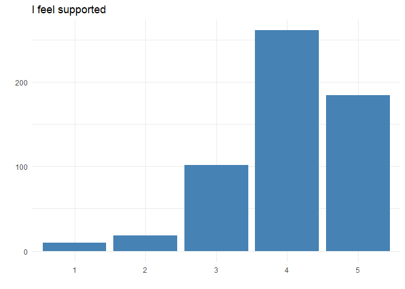<!-- -->


#### Missingness

**Missingness Descriptives**

Delivered / Answered = 578 / 575
Missing = 3
Min = 0, Max = 1, Mean = 0.03, SD = 0.16
(Descriptives are rounded to 2 decimals)

Missingness Intraclass Correlation (ICC) = 1.26 


#### Screenshot


</div>


</div> <!-- Header section -->

<div class = "header-shading">

#### That was an excellent supportive interaction <br>

<div style="font-weight: bold; color: #2a5caa; margin-top: -0.7em; margin-bottom: 1em;">
  <a href="#Item 5532-anchor"> [Item 5532] </a>
</div>


</div>


<!-- Body -->


<div class = "anchor">

<div id="Question 5723-anchor">
  <strong>Question ID</strong>: Question 5723
</div>

**Way the question was delivered:** Multiple Choice

**Type of data:** integer

</div> 
<div class = "anchor">


<button 
  onclick="let e = document.getElementById('Question 5723');
           let arrow = document.getElementById('Question 5723_arrow');
           e.style.display = e.style.display === 'none' ? 'block' : 'none';
           arrow.textContent = e.style.display === 'none' ? '▼' : '▲';"
  style="background: none; border: none; padding: 0; font-weight: bold; font-size: 18px; color: #2a5caa; cursor: pointer;">
Click to view visuals <span id="Question 5723_arrow">▼</span>
</button>

<div id="Question 5723" style="display: none;">


<!-- TOC-IGNORE-BEGIN -->

### Descriptives {.tabset}


#### Frequency Table

<table class="table" style="color: black; margin-left: auto; margin-right: auto;">
 <thead>
  <tr>
   <th style="text-align:left;"> Value </th>
   <th style="text-align:left;"> Label </th>
   <th style="text-align:left;"> Counts </th>
   <th style="text-align:left;"> Percentages </th>
  </tr>
 </thead>
<tbody>
  <tr>
   <td style="text-align:left;"> 1 </td>
   <td style="text-align:left;"> Strongly disagree </td>
   <td style="text-align:left;color: darkgreen !important;"> N = 14 </td>
   <td style="text-align:left;"> 2.4% </td>
  </tr>
  <tr>
   <td style="text-align:left;"> 2 </td>
   <td style="text-align:left;"> Disagree </td>
   <td style="text-align:left;color: darkgreen !important;"> N = 40 </td>
   <td style="text-align:left;"> 6.9% </td>
  </tr>
  <tr>
   <td style="text-align:left;"> 3 </td>
   <td style="text-align:left;"> Agree some and disagree some </td>
   <td style="text-align:left;color: darkgreen !important;"> N = 130 </td>
   <td style="text-align:left;"> 22.6% </td>
  </tr>
  <tr>
   <td style="text-align:left;"> 4 </td>
   <td style="text-align:left;"> Agree </td>
   <td style="text-align:left;color: darkgreen !important;"> N = 223 </td>
   <td style="text-align:left;"> 38.7% </td>
  </tr>
  <tr>
   <td style="text-align:left;"> 5 </td>
   <td style="text-align:left;"> Strongly agree </td>
   <td style="text-align:left;color: darkgreen !important;"> N = 169 </td>
   <td style="text-align:left;"> 29.3% </td>
  </tr>
</tbody>
</table>


#### Barplot

<!-- -->


#### Missingness

**Missingness Descriptives**

Delivered / Answered = 577 / 576
Missing = 1
Min = 0, Max = 1, Mean = 0.01, SD = 0.09
(Descriptives are rounded to 2 decimals)

Missingness Intraclass Correlation (ICC) = 1.27 


#### Screenshot


</div>


</div> <!-- Header section -->

<div class = "header-shading">

#### The interaction made me feel better <br>

<div style="font-weight: bold; color: #2a5caa; margin-top: -0.7em; margin-bottom: 1em;">
  <a href="#Item 5533-anchor"> [Item 5533] </a>
</div>


</div>


<!-- Body -->


<div class = "anchor">

<div id="Question 5724-anchor">
  <strong>Question ID</strong>: Question 5724
</div>

**Way the question was delivered:** Multiple Choice

**Type of data:** integer

</div> 
<div class = "anchor">


<button 
  onclick="let e = document.getElementById('Question 5724');
           let arrow = document.getElementById('Question 5724_arrow');
           e.style.display = e.style.display === 'none' ? 'block' : 'none';
           arrow.textContent = e.style.display === 'none' ? '▼' : '▲';"
  style="background: none; border: none; padding: 0; font-weight: bold; font-size: 18px; color: #2a5caa; cursor: pointer;">
Click to view visuals <span id="Question 5724_arrow">▼</span>
</button>

<div id="Question 5724" style="display: none;">


<!-- TOC-IGNORE-BEGIN -->

### Descriptives {.tabset}


#### Frequency Table

<table class="table" style="color: black; margin-left: auto; margin-right: auto;">
 <thead>
  <tr>
   <th style="text-align:left;"> Value </th>
   <th style="text-align:left;"> Label </th>
   <th style="text-align:left;"> Counts </th>
   <th style="text-align:left;"> Percentages </th>
  </tr>
 </thead>
<tbody>
  <tr>
   <td style="text-align:left;"> 1 </td>
   <td style="text-align:left;"> Strongly disagree </td>
   <td style="text-align:left;color: darkgreen !important;"> N = 12 </td>
   <td style="text-align:left;"> 2.1% </td>
  </tr>
  <tr>
   <td style="text-align:left;"> 2 </td>
   <td style="text-align:left;"> Disagree </td>
   <td style="text-align:left;color: darkgreen !important;"> N = 42 </td>
   <td style="text-align:left;"> 7.3% </td>
  </tr>
  <tr>
   <td style="text-align:left;"> 3 </td>
   <td style="text-align:left;"> Agree some and disagree some </td>
   <td style="text-align:left;color: darkgreen !important;"> N = 142 </td>
   <td style="text-align:left;"> 24.7% </td>
  </tr>
  <tr>
   <td style="text-align:left;"> 4 </td>
   <td style="text-align:left;"> Agree </td>
   <td style="text-align:left;color: darkgreen !important;"> N = 223 </td>
   <td style="text-align:left;"> 38.7% </td>
  </tr>
  <tr>
   <td style="text-align:left;"> 5 </td>
   <td style="text-align:left;"> Strongly agree </td>
   <td style="text-align:left;color: darkgreen !important;"> N = 157 </td>
   <td style="text-align:left;"> 27.3% </td>
  </tr>
</tbody>
</table>


#### Barplot

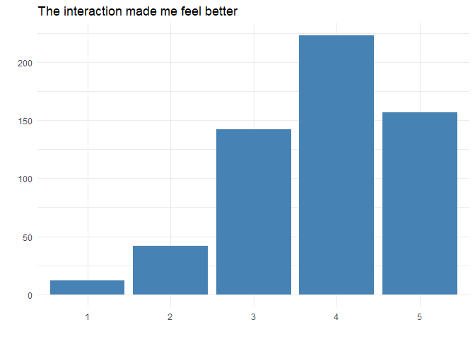<!-- -->


#### Missingness

**Missingness Descriptives**

Delivered / Answered = 577 / 576
Missing = 1
Min = 0, Max = 1, Mean = 0.01, SD = 0.09
(Descriptives are rounded to 2 decimals)

Missingness Intraclass Correlation (ICC) = 1.27 


#### Screenshot


</div>


</div> <!-- Header section -->

<div class = "header-shading">

#### The interaction made me feel supported <br>

<div style="font-weight: bold; color: #2a5caa; margin-top: -0.7em; margin-bottom: 1em;">
  <a href="#Item 5534-anchor"> [Item 5534] </a>
</div>


</div>


<!-- Body -->


<div class = "anchor">

<div id="Question 5725-anchor">
  <strong>Question ID</strong>: Question 5725
</div>

**Way the question was delivered:** Multiple Choice

**Type of data:** integer

</div> 
<div class = "anchor">


<button 
  onclick="let e = document.getElementById('Question 5725');
           let arrow = document.getElementById('Question 5725_arrow');
           e.style.display = e.style.display === 'none' ? 'block' : 'none';
           arrow.textContent = e.style.display === 'none' ? '▼' : '▲';"
  style="background: none; border: none; padding: 0; font-weight: bold; font-size: 18px; color: #2a5caa; cursor: pointer;">
Click to view visuals <span id="Question 5725_arrow">▼</span>
</button>

<div id="Question 5725" style="display: none;">


<!-- TOC-IGNORE-BEGIN -->

### Descriptives {.tabset}


#### Frequency Table

<table class="table" style="color: black; margin-left: auto; margin-right: auto;">
 <thead>
  <tr>
   <th style="text-align:left;"> Value </th>
   <th style="text-align:left;"> Label </th>
   <th style="text-align:left;"> Counts </th>
   <th style="text-align:left;"> Percentages </th>
  </tr>
 </thead>
<tbody>
  <tr>
   <td style="text-align:left;"> 1 </td>
   <td style="text-align:left;"> Strongly disagree </td>
   <td style="text-align:left;color: darkgreen !important;"> N = 10 </td>
   <td style="text-align:left;"> 1.7% </td>
  </tr>
  <tr>
   <td style="text-align:left;"> 2 </td>
   <td style="text-align:left;"> Disagree </td>
   <td style="text-align:left;color: darkgreen !important;"> N = 32 </td>
   <td style="text-align:left;"> 5.6% </td>
  </tr>
  <tr>
   <td style="text-align:left;"> 3 </td>
   <td style="text-align:left;"> Agree some and disagree some </td>
   <td style="text-align:left;color: darkgreen !important;"> N = 140 </td>
   <td style="text-align:left;"> 24.3% </td>
  </tr>
  <tr>
   <td style="text-align:left;"> 4 </td>
   <td style="text-align:left;"> Agree </td>
   <td style="text-align:left;color: darkgreen !important;"> N = 230 </td>
   <td style="text-align:left;"> 39.9% </td>
  </tr>
  <tr>
   <td style="text-align:left;"> 5 </td>
   <td style="text-align:left;"> Strongly agree </td>
   <td style="text-align:left;color: darkgreen !important;"> N = 164 </td>
   <td style="text-align:left;"> 28.5% </td>
  </tr>
</tbody>
</table>


#### Barplot

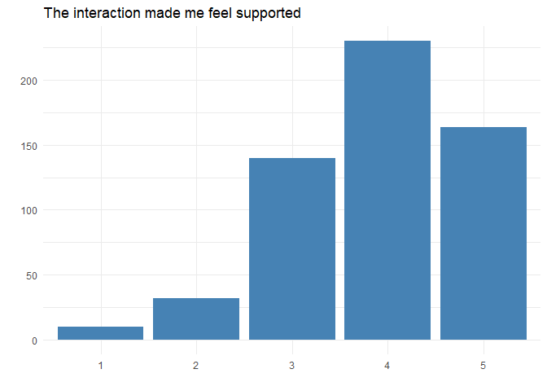<!-- -->


#### Missingness

**Missingness Descriptives**

Delivered / Answered = 577 / 576
Missing = 1
Min = 0, Max = 1, Mean = 0.01, SD = 0.09
(Descriptives are rounded to 2 decimals)

Missingness Intraclass Correlation (ICC) = 1.27 


#### Screenshot


</div>


</div> <!-- Header section -->

<div class = "header-shading">

#### I dont feel better after the interaction <br>

<div style="font-weight: bold; color: #2a5caa; margin-top: -0.7em; margin-bottom: 1em;">
  <a href="#Item 5535-anchor"> [Item 5535] </a>
</div>


</div>


<!-- Body -->


<div class = "anchor">

<div id="Question 5643-anchor">
  <strong>Question ID</strong>: Question 5643
</div>

**Way the question was delivered:** Multiple Choice

**Type of data:** integer

</div> 
<div class = "anchor">


<button 
  onclick="let e = document.getElementById('Question 5643');
           let arrow = document.getElementById('Question 5643_arrow');
           e.style.display = e.style.display === 'none' ? 'block' : 'none';
           arrow.textContent = e.style.display === 'none' ? '▼' : '▲';"
  style="background: none; border: none; padding: 0; font-weight: bold; font-size: 18px; color: #2a5caa; cursor: pointer;">
Click to view visuals <span id="Question 5643_arrow">▼</span>
</button>

<div id="Question 5643" style="display: none;">


<!-- TOC-IGNORE-BEGIN -->

### Descriptives {.tabset}


#### Frequency Table

<table class="table" style="color: black; margin-left: auto; margin-right: auto;">
 <thead>
  <tr>
   <th style="text-align:left;"> Value </th>
   <th style="text-align:left;"> Label </th>
   <th style="text-align:left;"> Counts </th>
   <th style="text-align:left;"> Percentages </th>
  </tr>
 </thead>
<tbody>
  <tr>
   <td style="text-align:left;"> 1 </td>
   <td style="text-align:left;"> Strongly disagree </td>
   <td style="text-align:left;color: darkgreen !important;"> N = 186 </td>
   <td style="text-align:left;"> 32.3% </td>
  </tr>
  <tr>
   <td style="text-align:left;"> 2 </td>
   <td style="text-align:left;"> Disagree </td>
   <td style="text-align:left;color: darkgreen !important;"> N = 241 </td>
   <td style="text-align:left;"> 41.9% </td>
  </tr>
  <tr>
   <td style="text-align:left;"> 3 </td>
   <td style="text-align:left;"> Agree some and disagree some </td>
   <td style="text-align:left;color: darkgreen !important;"> N = 85 </td>
   <td style="text-align:left;"> 14.8% </td>
  </tr>
  <tr>
   <td style="text-align:left;"> 4 </td>
   <td style="text-align:left;"> Agree </td>
   <td style="text-align:left;color: darkgreen !important;"> N = 47 </td>
   <td style="text-align:left;"> 8.2% </td>
  </tr>
  <tr>
   <td style="text-align:left;"> 5 </td>
   <td style="text-align:left;"> Strongly agree </td>
   <td style="text-align:left;color: darkgreen !important;"> N = 16 </td>
   <td style="text-align:left;"> 2.8% </td>
  </tr>
</tbody>
</table>


#### Barplot

<!-- -->


#### Missingness

**Missingness Descriptives**

Delivered / Answered = 577 / 575
Missing = 2
Min = 0, Max = 1, Mean = 0.02, SD = 0.13
(Descriptives are rounded to 2 decimals)

Missingness Intraclass Correlation (ICC) = 1.26 


#### Screenshot


</div>


</div> <!-- Header section -->

<div class = "header-shading">

#### The interaction made me feel worse <br>

<div style="font-weight: bold; color: #2a5caa; margin-top: -0.7em; margin-bottom: 1em;">
  <a href="#Item 5536-anchor"> [Item 5536] </a>
</div>


</div>


<!-- Body -->


<div class = "anchor">

<div id="Question 5644-anchor">
  <strong>Question ID</strong>: Question 5644
</div>

**Way the question was delivered:** Multiple Choice

**Type of data:** integer

</div> 
<div class = "anchor">


<button 
  onclick="let e = document.getElementById('Question 5644');
           let arrow = document.getElementById('Question 5644_arrow');
           e.style.display = e.style.display === 'none' ? 'block' : 'none';
           arrow.textContent = e.style.display === 'none' ? '▼' : '▲';"
  style="background: none; border: none; padding: 0; font-weight: bold; font-size: 18px; color: #2a5caa; cursor: pointer;">
Click to view visuals <span id="Question 5644_arrow">▼</span>
</button>

<div id="Question 5644" style="display: none;">


<!-- TOC-IGNORE-BEGIN -->

### Descriptives {.tabset}


#### Frequency Table

<table class="table" style="color: black; margin-left: auto; margin-right: auto;">
 <thead>
  <tr>
   <th style="text-align:left;"> Value </th>
   <th style="text-align:left;"> Label </th>
   <th style="text-align:left;"> Counts </th>
   <th style="text-align:left;"> Percentages </th>
  </tr>
 </thead>
<tbody>
  <tr>
   <td style="text-align:left;"> 1 </td>
   <td style="text-align:left;"> Strongly disagree </td>
   <td style="text-align:left;color: darkgreen !important;"> N = 240 </td>
   <td style="text-align:left;"> 41.7% </td>
  </tr>
  <tr>
   <td style="text-align:left;"> 2 </td>
   <td style="text-align:left;"> Disagree </td>
   <td style="text-align:left;color: darkgreen !important;"> N = 244 </td>
   <td style="text-align:left;"> 42.4% </td>
  </tr>
  <tr>
   <td style="text-align:left;"> 3 </td>
   <td style="text-align:left;"> Agree some and disagree some </td>
   <td style="text-align:left;color: darkgreen !important;"> N = 65 </td>
   <td style="text-align:left;"> 11.3% </td>
  </tr>
  <tr>
   <td style="text-align:left;"> 4 </td>
   <td style="text-align:left;"> Agree </td>
   <td style="text-align:left;color: darkgreen !important;"> N = 13 </td>
   <td style="text-align:left;"> 2.3% </td>
  </tr>
  <tr>
   <td style="text-align:left;"> 5 </td>
   <td style="text-align:left;"> Strongly agree </td>
   <td style="text-align:left;color: darkgreen !important;"> N = 13 </td>
   <td style="text-align:left;"> 2.3% </td>
  </tr>
</tbody>
</table>


#### Barplot

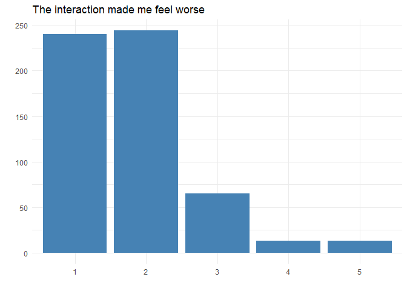<!-- -->


#### Missingness

**Missingness Descriptives**

Delivered / Answered = 577 / 575
Missing = 2
Min = 0, Max = 1, Mean = 0.02, SD = 0.13
(Descriptives are rounded to 2 decimals)

Missingness Intraclass Correlation (ICC) = 1.26 


#### Screenshot


</div>


</div> <!-- Header section -->

<div class = "header-shading">

#### The interaction helped with a problem I was having <br>

<div style="font-weight: bold; color: #2a5caa; margin-top: -0.7em; margin-bottom: 1em;">
  <a href="#Item 5537-anchor"> [Item 5537] </a>
</div>


</div>


<!-- Body -->


<div class = "anchor">

<div id="Question 5726-anchor">
  <strong>Question ID</strong>: Question 5726
</div>

**Way the question was delivered:** Multiple Choice

**Type of data:** integer

</div> 
<div class = "anchor">


<button 
  onclick="let e = document.getElementById('Question 5726');
           let arrow = document.getElementById('Question 5726_arrow');
           e.style.display = e.style.display === 'none' ? 'block' : 'none';
           arrow.textContent = e.style.display === 'none' ? '▼' : '▲';"
  style="background: none; border: none; padding: 0; font-weight: bold; font-size: 18px; color: #2a5caa; cursor: pointer;">
Click to view visuals <span id="Question 5726_arrow">▼</span>
</button>

<div id="Question 5726" style="display: none;">


<!-- TOC-IGNORE-BEGIN -->

### Descriptives {.tabset}


#### Frequency Table

<table class="table" style="color: black; margin-left: auto; margin-right: auto;">
 <thead>
  <tr>
   <th style="text-align:left;"> Value </th>
   <th style="text-align:left;"> Label </th>
   <th style="text-align:left;"> Counts </th>
   <th style="text-align:left;"> Percentages </th>
  </tr>
 </thead>
<tbody>
  <tr>
   <td style="text-align:left;"> 1 </td>
   <td style="text-align:left;"> Strongly disagree </td>
   <td style="text-align:left;color: darkgreen !important;"> N = 35 </td>
   <td style="text-align:left;"> 6.1% </td>
  </tr>
  <tr>
   <td style="text-align:left;"> 2 </td>
   <td style="text-align:left;"> Disagree </td>
   <td style="text-align:left;color: darkgreen !important;"> N = 110 </td>
   <td style="text-align:left;"> 19.3% </td>
  </tr>
  <tr>
   <td style="text-align:left;"> 3 </td>
   <td style="text-align:left;"> Agree some and disagree some </td>
   <td style="text-align:left;color: darkgreen !important;"> N = 197 </td>
   <td style="text-align:left;"> 34.5% </td>
  </tr>
  <tr>
   <td style="text-align:left;"> 4 </td>
   <td style="text-align:left;"> Agree </td>
   <td style="text-align:left;color: darkgreen !important;"> N = 135 </td>
   <td style="text-align:left;"> 23.6% </td>
  </tr>
  <tr>
   <td style="text-align:left;"> 5 </td>
   <td style="text-align:left;"> Strongly agree </td>
   <td style="text-align:left;color: darkgreen !important;"> N = 94 </td>
   <td style="text-align:left;"> 16.5% </td>
  </tr>
</tbody>
</table>


#### Barplot

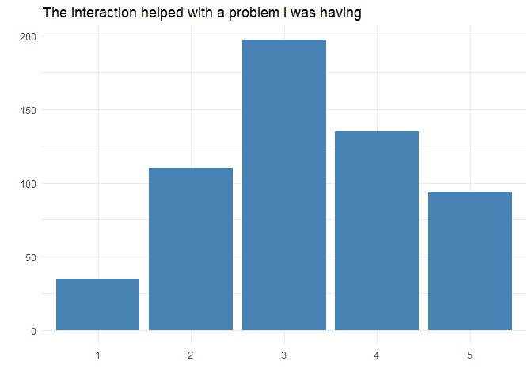<!-- -->


#### Missingness

**Missingness Descriptives**

Delivered / Answered = 576 / 571
Missing = 5
Min = 0, Max = 3, Mean = 0.04, SD = 0.31
(Descriptives are rounded to 2 decimals)

Missingness Intraclass Correlation (ICC) = 1.1 


#### Screenshot


</div>


</div> <!-- Header section -->

<div class = "header-shading">

#### The interaction helped me feel better about a problem <br>

<div style="font-weight: bold; color: #2a5caa; margin-top: -0.7em; margin-bottom: 1em;">
  <a href="#Item 5538-anchor"> [Item 5538] </a>
</div>


</div>


<!-- Body -->


<div class = "anchor">

<div id="Question 5727-anchor">
  <strong>Question ID</strong>: Question 5727
</div>

**Way the question was delivered:** Multiple Choice

**Type of data:** integer

</div> 
<div class = "anchor">


<button 
  onclick="let e = document.getElementById('Question 5727');
           let arrow = document.getElementById('Question 5727_arrow');
           e.style.display = e.style.display === 'none' ? 'block' : 'none';
           arrow.textContent = e.style.display === 'none' ? '▼' : '▲';"
  style="background: none; border: none; padding: 0; font-weight: bold; font-size: 18px; color: #2a5caa; cursor: pointer;">
Click to view visuals <span id="Question 5727_arrow">▼</span>
</button>

<div id="Question 5727" style="display: none;">


<!-- TOC-IGNORE-BEGIN -->

### Descriptives {.tabset}


#### Frequency Table

<table class="table" style="color: black; margin-left: auto; margin-right: auto;">
 <thead>
  <tr>
   <th style="text-align:left;"> Value </th>
   <th style="text-align:left;"> Label </th>
   <th style="text-align:left;"> Counts </th>
   <th style="text-align:left;"> Percentages </th>
  </tr>
 </thead>
<tbody>
  <tr>
   <td style="text-align:left;"> 1 </td>
   <td style="text-align:left;"> Strongly disagree </td>
   <td style="text-align:left;color: darkgreen !important;"> N = 25 </td>
   <td style="text-align:left;"> 4.4% </td>
  </tr>
  <tr>
   <td style="text-align:left;"> 2 </td>
   <td style="text-align:left;"> Disagree </td>
   <td style="text-align:left;color: darkgreen !important;"> N = 108 </td>
   <td style="text-align:left;"> 18.9% </td>
  </tr>
  <tr>
   <td style="text-align:left;"> 3 </td>
   <td style="text-align:left;"> Agree some and disagree some </td>
   <td style="text-align:left;color: darkgreen !important;"> N = 183 </td>
   <td style="text-align:left;"> 32% </td>
  </tr>
  <tr>
   <td style="text-align:left;"> 4 </td>
   <td style="text-align:left;"> Agree </td>
   <td style="text-align:left;color: darkgreen !important;"> N = 142 </td>
   <td style="text-align:left;"> 24.9% </td>
  </tr>
  <tr>
   <td style="text-align:left;"> 5 </td>
   <td style="text-align:left;"> Strongly agree </td>
   <td style="text-align:left;color: darkgreen !important;"> N = 113 </td>
   <td style="text-align:left;"> 19.8% </td>
  </tr>
</tbody>
</table>


#### Barplot

<!-- -->


#### Missingness

**Missingness Descriptives**

Delivered / Answered = 575 / 571
Missing = 4
Min = 0, Max = 2, Mean = 0.04, SD = 0.23
(Descriptives are rounded to 2 decimals)

Missingness Intraclass Correlation (ICC) = 1.15 


#### Screenshot


</div>


</div> 
## Child End of Day Survey ID 92
###  <!-- Header section -->

<div class = "header-shading">

#### If you didnt go to school today, why? <br>

<div style="font-weight: bold; color: #2a5caa; margin-top: -0.7em; margin-bottom: 1em;">
  <a href="#Item 809-anchor"> [Item 809] </a>
</div>


</div>


<!-- Body -->


<div class = "anchor">

<div id="Question 2050-anchor">
  <strong>Question ID</strong>: Question 2050
</div>

**Way the question was delivered:** Multiple Select

**Type of data:** integer

</div> 
<div class = "anchor">


<button 
  onclick="let e = document.getElementById('Question 2050');
           let arrow = document.getElementById('Question 2050_arrow');
           e.style.display = e.style.display === 'none' ? 'block' : 'none';
           arrow.textContent = e.style.display === 'none' ? '▼' : '▲';"
  style="background: none; border: none; padding: 0; font-weight: bold; font-size: 18px; color: #2a5caa; cursor: pointer;">
Click to view visuals <span id="Question 2050_arrow">▼</span>
</button>

<div id="Question 2050" style="display: none;">


<!-- TOC-IGNORE-BEGIN -->

### Descriptives {.tabset}


#### Frequency Table

<table class="table" style="color: black; margin-left: auto; margin-right: auto;">
 <thead>
  <tr>
   <th style="text-align:left;"> Value </th>
   <th style="text-align:left;"> Label </th>
   <th style="text-align:left;"> Counts </th>
   <th style="text-align:left;"> Percentages </th>
  </tr>
 </thead>
<tbody>
  <tr>
   <td style="text-align:left;"> 1 </td>
   <td style="text-align:left;"> Weekend </td>
   <td style="text-align:left;color: darkgreen !important;"> N = 207 </td>
   <td style="text-align:left;"> 50.6% </td>
  </tr>
  <tr>
   <td style="text-align:left;"> 2 </td>
   <td style="text-align:left;"> School holiday </td>
   <td style="text-align:left;color: darkgreen !important;"> N = 102 </td>
   <td style="text-align:left;"> 24.9% </td>
  </tr>
  <tr>
   <td style="text-align:left;"> 3 </td>
   <td style="text-align:left;"> didn't feel well </td>
   <td style="text-align:left;color: darkgreen !important;"> N = 17 </td>
   <td style="text-align:left;"> 4.2% </td>
  </tr>
  <tr>
   <td style="text-align:left;"> 4 </td>
   <td style="text-align:left;"> Other </td>
   <td style="text-align:left;color: darkgreen !important;"> N = 76 </td>
   <td style="text-align:left;"> 18.6% </td>
  </tr>
  <tr>
   <td style="text-align:left;"> 5 </td>
   <td style="text-align:left;"> None apply </td>
   <td style="text-align:left;color: darkgreen !important;"> N = 7 </td>
   <td style="text-align:left;"> 1.7% </td>
  </tr>
</tbody>
</table>


#### Barplot

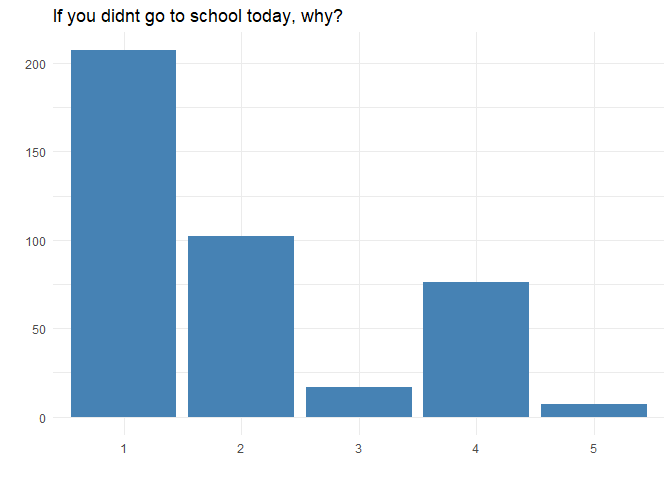<!-- -->


#### Missingness

**Missingness Descriptives**

Delivered / Answered = 373 / 373
Missing = 0
Min = 0, Max = 0, Mean = 0, SD = 0
(Descriptives are rounded to 2 decimals)

Missingness Intraclass Correlation (ICC) = NaN 


#### Screenshot


</div>


</div> <!-- Header section -->

<div class = "header-shading">

#### Check all that happened at school today: <br>

<div style="font-weight: bold; color: #2a5caa; margin-top: -0.7em; margin-bottom: 1em;">
  <a href="#Item 810-anchor"> [Item 810] </a>
</div>


</div>


<!-- Body -->


<div class = "anchor">

<div id="Question 2049-anchor">
  <strong>Question ID</strong>: Question 2049
</div>

**Way the question was delivered:** Multiple Select

**Type of data:** integer

</div> 
<div class = "anchor">


<button 
  onclick="let e = document.getElementById('Question 2049');
           let arrow = document.getElementById('Question 2049_arrow');
           e.style.display = e.style.display === 'none' ? 'block' : 'none';
           arrow.textContent = e.style.display === 'none' ? '▼' : '▲';"
  style="background: none; border: none; padding: 0; font-weight: bold; font-size: 18px; color: #2a5caa; cursor: pointer;">
Click to view visuals <span id="Question 2049_arrow">▼</span>
</button>

<div id="Question 2049" style="display: none;">


<!-- TOC-IGNORE-BEGIN -->

### Descriptives {.tabset}


#### Frequency Table

<table class="table" style="color: black; margin-left: auto; margin-right: auto;">
 <thead>
  <tr>
   <th style="text-align:left;"> Value </th>
   <th style="text-align:left;"> Label </th>
   <th style="text-align:left;"> Counts </th>
   <th style="text-align:left;"> Percentages </th>
  </tr>
 </thead>
<tbody>
  <tr>
   <td style="text-align:left;"> 1 </td>
   <td style="text-align:left;"> I did not go to school today </td>
   <td style="text-align:left;color: darkgreen !important;"> N = 373 </td>
   <td style="text-align:left;"> 27.8% </td>
  </tr>
  <tr>
   <td style="text-align:left;"> 2 </td>
   <td style="text-align:left;"> My school work was too hard today. </td>
   <td style="text-align:left;color: darkgreen !important;"> N = 69 </td>
   <td style="text-align:left;"> 5.1% </td>
  </tr>
  <tr>
   <td style="text-align:left;"> 3 </td>
   <td style="text-align:left;"> I had trouble finishing my schoolwork today. </td>
   <td style="text-align:left;color: darkgreen !important;"> N = 120 </td>
   <td style="text-align:left;"> 8.9% </td>
  </tr>
  <tr>
   <td style="text-align:left;"> 4 </td>
   <td style="text-align:left;"> I had trouble learning something new today. </td>
   <td style="text-align:left;color: darkgreen !important;"> N = 68 </td>
   <td style="text-align:left;"> 5.1% </td>
  </tr>
  <tr>
   <td style="text-align:left;"> 5 </td>
   <td style="text-align:left;"> I received a bad grade on a test or paper today. </td>
   <td style="text-align:left;color: darkgreen !important;"> N = 40 </td>
   <td style="text-align:left;"> 3% </td>
  </tr>
  <tr>
   <td style="text-align:left;"> 6 </td>
   <td style="text-align:left;"> None apply </td>
   <td style="text-align:left;color: darkgreen !important;"> N = 673 </td>
   <td style="text-align:left;"> 50.1% </td>
  </tr>
</tbody>
</table>


#### Barplot

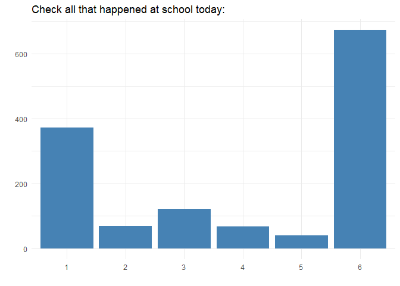<!-- -->


#### Missingness

**Missingness Descriptives**

Delivered / Answered = 1251 / 1247
Missing = 4
Min = 0, Max = 2, Mean = 0.03, SD = 0.2
(Descriptives are rounded to 2 decimals)

Missingness Intraclass Correlation (ICC) = 1.09 


#### Screenshot


</div>


</div> <!-- Header section -->

<div class = "header-shading">

#### Today, how much did you feel <br>

<div style="font-weight: bold; color: #2a5caa; margin-top: -0.7em; margin-bottom: 1em;">
  <a href="#Item 844-anchor"> [Item 844] </a>
</div>


</div>


<!-- Body -->


<div class = "anchor">

<div id="Question 1325-anchor">
  <strong>Question ID</strong>: Question 1325
</div>

**Way the question was delivered:** Multiple Slider

**Type of data:** NA

</div> <div class = "anchor">


</div>

 <div class = "anchor">


**Descriptives**
Min = 0, max = 100, mean = 67.49, std = 23.61


<button 
  onclick="let e = document.getElementById('multiplesliderQuestion-13255201');
           let arrow = document.getElementById('multiplesliderQuestion-13255201_arrow');
           e.style.display = e.style.display === 'none' ? 'block' : 'none';
           arrow.textContent = e.style.display === 'none' ? '▼' : '▲';"
  style="background: none; border: none; padding: 0; font-weight: bold; font-size: 18px; color: #2a5caa; cursor: pointer;">
Click to view visuals <span id="multiplesliderQuestion-13255201_arrow">▼</span>
</button>

<div id="multiplesliderQuestion-13255201" style="display: none;">


<!-- TOC-IGNORE-BEGIN -->

### Descriptives {.tabset}


#### Histogram


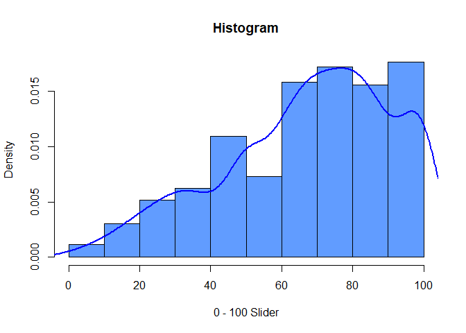<!-- -->


#### Missingness


**Missingness Descriptives**

Min = 2, max = 18, mean = 7.4, std = 3.6

Interclass Correlation (ICC) = 0.41

**Missingness Codes**

<details>
<summary style="font-weight: bold; font-size: 18px; color: #2a5caa; cursor: pointer;">Click to view missingness codes</summary>

<br>

| Code | Description           |
|------|-----------------------|
| -1   | Skipped by respondent |
| -3   | No response recorded  |
| -6   | Survey timeout        |
| -8   | Consent withdrawn     |
| -9   | Other missing reason  |

</details>


#### Screenshot


</div>

</div>

 <div class = "anchor">


**Descriptives**
Min = 0, max = 100, mean = 24.05, std = 24.99


<button 
  onclick="let e = document.getElementById('multiplesliderQuestion-13255217');
           let arrow = document.getElementById('multiplesliderQuestion-13255217_arrow');
           e.style.display = e.style.display === 'none' ? 'block' : 'none';
           arrow.textContent = e.style.display === 'none' ? '▼' : '▲';"
  style="background: none; border: none; padding: 0; font-weight: bold; font-size: 18px; color: #2a5caa; cursor: pointer;">
Click to view visuals <span id="multiplesliderQuestion-13255217_arrow">▼</span>
</button>

<div id="multiplesliderQuestion-13255217" style="display: none;">


<!-- TOC-IGNORE-BEGIN -->

### Descriptives {.tabset}


#### Histogram


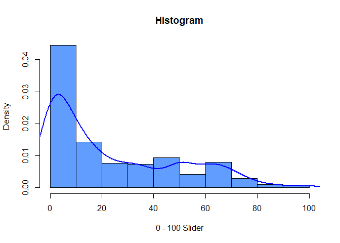<!-- -->


#### Missingness


**Missingness Descriptives**

Min = 2, max = 18, mean = 7.4, std = 3.6

Interclass Correlation (ICC) = 0.41

**Missingness Codes**

<details>
<summary style="font-weight: bold; font-size: 18px; color: #2a5caa; cursor: pointer;">Click to view missingness codes</summary>

<br>

| Code | Description           |
|------|-----------------------|
| -1   | Skipped by respondent |
| -3   | No response recorded  |
| -6   | Survey timeout        |
| -8   | Consent withdrawn     |
| -9   | Other missing reason  |

</details>


#### Screenshot


</div>

</div>

 <div class = "anchor">


**Descriptives**
Min = 0, max = 100, mean = 72.21, std = 21.13


<button 
  onclick="let e = document.getElementById('multiplesliderQuestion-13255203');
           let arrow = document.getElementById('multiplesliderQuestion-13255203_arrow');
           e.style.display = e.style.display === 'none' ? 'block' : 'none';
           arrow.textContent = e.style.display === 'none' ? '▼' : '▲';"
  style="background: none; border: none; padding: 0; font-weight: bold; font-size: 18px; color: #2a5caa; cursor: pointer;">
Click to view visuals <span id="multiplesliderQuestion-13255203_arrow">▼</span>
</button>

<div id="multiplesliderQuestion-13255203" style="display: none;">


<!-- TOC-IGNORE-BEGIN -->

### Descriptives {.tabset}


#### Histogram


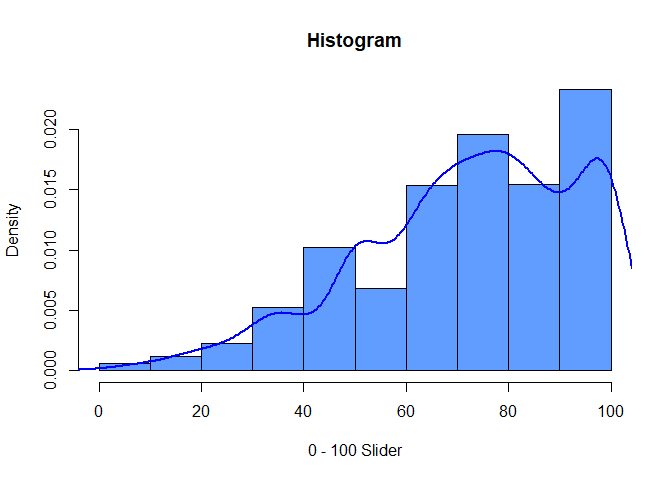<!-- -->


#### Missingness


**Missingness Descriptives**

Min = 2, max = 18, mean = 7.4, std = 3.6

Interclass Correlation (ICC) = 0.41

**Missingness Codes**

<details>
<summary style="font-weight: bold; font-size: 18px; color: #2a5caa; cursor: pointer;">Click to view missingness codes</summary>

<br>

| Code | Description           |
|------|-----------------------|
| -1   | Skipped by respondent |
| -3   | No response recorded  |
| -6   | Survey timeout        |
| -8   | Consent withdrawn     |
| -9   | Other missing reason  |

</details>


#### Screenshot


</div>

</div>

 <div class = "anchor">


**Descriptives**
Min = 0, max = 100, mean = 63.98, std = 25.73


<button 
  onclick="let e = document.getElementById('multiplesliderQuestion-13255205');
           let arrow = document.getElementById('multiplesliderQuestion-13255205_arrow');
           e.style.display = e.style.display === 'none' ? 'block' : 'none';
           arrow.textContent = e.style.display === 'none' ? '▼' : '▲';"
  style="background: none; border: none; padding: 0; font-weight: bold; font-size: 18px; color: #2a5caa; cursor: pointer;">
Click to view visuals <span id="multiplesliderQuestion-13255205_arrow">▼</span>
</button>

<div id="multiplesliderQuestion-13255205" style="display: none;">


<!-- TOC-IGNORE-BEGIN -->

### Descriptives {.tabset}


#### Histogram


<!-- -->


#### Missingness


**Missingness Descriptives**

Min = 2, max = 18, mean = 7.4, std = 3.6

Interclass Correlation (ICC) = 0.41

**Missingness Codes**

<details>
<summary style="font-weight: bold; font-size: 18px; color: #2a5caa; cursor: pointer;">Click to view missingness codes</summary>

<br>

| Code | Description           |
|------|-----------------------|
| -1   | Skipped by respondent |
| -3   | No response recorded  |
| -6   | Survey timeout        |
| -8   | Consent withdrawn     |
| -9   | Other missing reason  |

</details>


#### Screenshot


</div>

</div>

 <div class = "anchor">


**Descriptives**
Min = 0, max = 100, mean = 55.97, std = 28.7


<button 
  onclick="let e = document.getElementById('multiplesliderQuestion-13255207');
           let arrow = document.getElementById('multiplesliderQuestion-13255207_arrow');
           e.style.display = e.style.display === 'none' ? 'block' : 'none';
           arrow.textContent = e.style.display === 'none' ? '▼' : '▲';"
  style="background: none; border: none; padding: 0; font-weight: bold; font-size: 18px; color: #2a5caa; cursor: pointer;">
Click to view visuals <span id="multiplesliderQuestion-13255207_arrow">▼</span>
</button>

<div id="multiplesliderQuestion-13255207" style="display: none;">


<!-- TOC-IGNORE-BEGIN -->

### Descriptives {.tabset}


#### Histogram


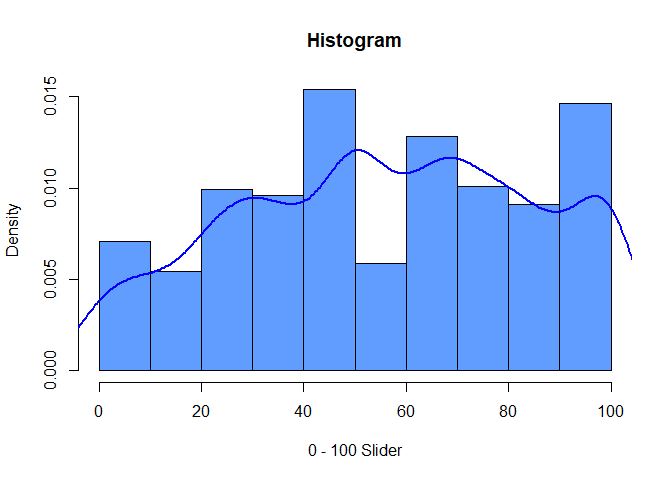<!-- -->


#### Missingness


**Missingness Descriptives**

Min = 2, max = 18, mean = 7.4, std = 3.6

Interclass Correlation (ICC) = 0.41

**Missingness Codes**

<details>
<summary style="font-weight: bold; font-size: 18px; color: #2a5caa; cursor: pointer;">Click to view missingness codes</summary>

<br>

| Code | Description           |
|------|-----------------------|
| -1   | Skipped by respondent |
| -3   | No response recorded  |
| -6   | Survey timeout        |
| -8   | Consent withdrawn     |
| -9   | Other missing reason  |

</details>


#### Screenshot


</div>

</div>

 <div class = "anchor">


**Descriptives**
Min = 0, max = 100, mean = 21.76, std = 23.32


<button 
  onclick="let e = document.getElementById('multiplesliderQuestion-13255209');
           let arrow = document.getElementById('multiplesliderQuestion-13255209_arrow');
           e.style.display = e.style.display === 'none' ? 'block' : 'none';
           arrow.textContent = e.style.display === 'none' ? '▼' : '▲';"
  style="background: none; border: none; padding: 0; font-weight: bold; font-size: 18px; color: #2a5caa; cursor: pointer;">
Click to view visuals <span id="multiplesliderQuestion-13255209_arrow">▼</span>
</button>

<div id="multiplesliderQuestion-13255209" style="display: none;">


<!-- TOC-IGNORE-BEGIN -->

### Descriptives {.tabset}


#### Histogram


<!-- -->


#### Missingness


**Missingness Descriptives**

Min = 2, max = 18, mean = 7.4, std = 3.6

Interclass Correlation (ICC) = 0.41

**Missingness Codes**

<details>
<summary style="font-weight: bold; font-size: 18px; color: #2a5caa; cursor: pointer;">Click to view missingness codes</summary>

<br>

| Code | Description           |
|------|-----------------------|
| -1   | Skipped by respondent |
| -3   | No response recorded  |
| -6   | Survey timeout        |
| -8   | Consent withdrawn     |
| -9   | Other missing reason  |

</details>


#### Screenshot


</div>

</div>

 <div class = "anchor">


**Descriptives**
Min = 0, max = 100, mean = 22.28, std = 23.32


<button 
  onclick="let e = document.getElementById('multiplesliderQuestion-13255211');
           let arrow = document.getElementById('multiplesliderQuestion-13255211_arrow');
           e.style.display = e.style.display === 'none' ? 'block' : 'none';
           arrow.textContent = e.style.display === 'none' ? '▼' : '▲';"
  style="background: none; border: none; padding: 0; font-weight: bold; font-size: 18px; color: #2a5caa; cursor: pointer;">
Click to view visuals <span id="multiplesliderQuestion-13255211_arrow">▼</span>
</button>

<div id="multiplesliderQuestion-13255211" style="display: none;">


<!-- TOC-IGNORE-BEGIN -->

### Descriptives {.tabset}


#### Histogram


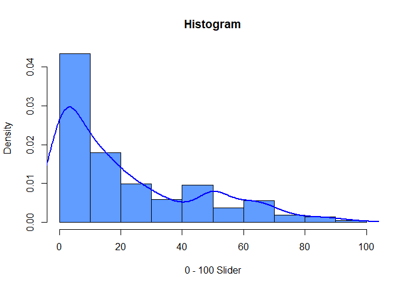<!-- -->


#### Missingness


**Missingness Descriptives**

Min = 2, max = 18, mean = 7.4, std = 3.6

Interclass Correlation (ICC) = 0.41

**Missingness Codes**

<details>
<summary style="font-weight: bold; font-size: 18px; color: #2a5caa; cursor: pointer;">Click to view missingness codes</summary>

<br>

| Code | Description           |
|------|-----------------------|
| -1   | Skipped by respondent |
| -3   | No response recorded  |
| -6   | Survey timeout        |
| -8   | Consent withdrawn     |
| -9   | Other missing reason  |

</details>


#### Screenshot


</div>

</div>

 <div class = "anchor">


**Descriptives**
Min = 0, max = 100, mean = 15.09, std = 20.45


<button 
  onclick="let e = document.getElementById('multiplesliderQuestion-13255213');
           let arrow = document.getElementById('multiplesliderQuestion-13255213_arrow');
           e.style.display = e.style.display === 'none' ? 'block' : 'none';
           arrow.textContent = e.style.display === 'none' ? '▼' : '▲';"
  style="background: none; border: none; padding: 0; font-weight: bold; font-size: 18px; color: #2a5caa; cursor: pointer;">
Click to view visuals <span id="multiplesliderQuestion-13255213_arrow">▼</span>
</button>

<div id="multiplesliderQuestion-13255213" style="display: none;">


<!-- TOC-IGNORE-BEGIN -->

### Descriptives {.tabset}


#### Histogram


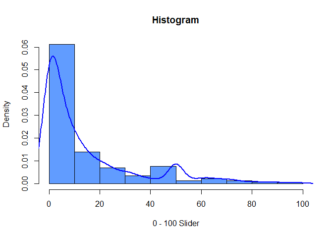<!-- -->


#### Missingness


**Missingness Descriptives**

Min = 2, max = 18, mean = 7.4, std = 3.6

Interclass Correlation (ICC) = 0.41

**Missingness Codes**

<details>
<summary style="font-weight: bold; font-size: 18px; color: #2a5caa; cursor: pointer;">Click to view missingness codes</summary>

<br>

| Code | Description           |
|------|-----------------------|
| -1   | Skipped by respondent |
| -3   | No response recorded  |
| -6   | Survey timeout        |
| -8   | Consent withdrawn     |
| -9   | Other missing reason  |

</details>


#### Screenshot


</div>

</div>

 <div class = "anchor">


**Descriptives**
Min = 0, max = 100, mean = 67.8, std = 23.16


<button 
  onclick="let e = document.getElementById('multiplesliderQuestion-13255199');
           let arrow = document.getElementById('multiplesliderQuestion-13255199_arrow');
           e.style.display = e.style.display === 'none' ? 'block' : 'none';
           arrow.textContent = e.style.display === 'none' ? '▼' : '▲';"
  style="background: none; border: none; padding: 0; font-weight: bold; font-size: 18px; color: #2a5caa; cursor: pointer;">
Click to view visuals <span id="multiplesliderQuestion-13255199_arrow">▼</span>
</button>

<div id="multiplesliderQuestion-13255199" style="display: none;">


<!-- TOC-IGNORE-BEGIN -->

### Descriptives {.tabset}


#### Histogram


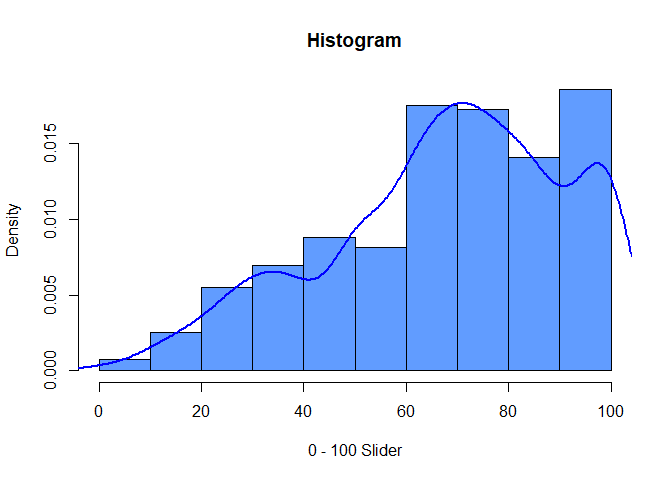<!-- -->


#### Missingness


**Missingness Descriptives**

Min = 2, max = 18, mean = 7.4, std = 3.6

Interclass Correlation (ICC) = 0.41

**Missingness Codes**

<details>
<summary style="font-weight: bold; font-size: 18px; color: #2a5caa; cursor: pointer;">Click to view missingness codes</summary>

<br>

| Code | Description           |
|------|-----------------------|
| -1   | Skipped by respondent |
| -3   | No response recorded  |
| -6   | Survey timeout        |
| -8   | Consent withdrawn     |
| -9   | Other missing reason  |

</details>


#### Screenshot


</div>

</div>

 <div class = "anchor">


**Descriptives**
Min = 0, max = 100, mean = 14.6, std = 20.17


<button 
  onclick="let e = document.getElementById('multiplesliderQuestion-13255215');
           let arrow = document.getElementById('multiplesliderQuestion-13255215_arrow');
           e.style.display = e.style.display === 'none' ? 'block' : 'none';
           arrow.textContent = e.style.display === 'none' ? '▼' : '▲';"
  style="background: none; border: none; padding: 0; font-weight: bold; font-size: 18px; color: #2a5caa; cursor: pointer;">
Click to view visuals <span id="multiplesliderQuestion-13255215_arrow">▼</span>
</button>

<div id="multiplesliderQuestion-13255215" style="display: none;">


<!-- TOC-IGNORE-BEGIN -->

### Descriptives {.tabset}


#### Histogram


<!-- -->


#### Missingness


**Missingness Descriptives**

Min = 2, max = 18, mean = 7.4, std = 3.6

Interclass Correlation (ICC) = 0.41

**Missingness Codes**

<details>
<summary style="font-weight: bold; font-size: 18px; color: #2a5caa; cursor: pointer;">Click to view missingness codes</summary>

<br>

| Code | Description           |
|------|-----------------------|
| -1   | Skipped by respondent |
| -3   | No response recorded  |
| -6   | Survey timeout        |
| -8   | Consent withdrawn     |
| -9   | Other missing reason  |

</details>


#### Screenshot


</div>

</div>


 <!-- Header section -->

<div class = "header-shading">

#### Overall, how stressed have you felt today? <br>

<div style="font-weight: bold; color: #2a5caa; margin-top: -0.7em; margin-bottom: 1em;">
  <a href="#Item 845-anchor"> [Item 845] </a>
</div>


</div>


<!-- Body -->


<div class = "anchor">

<div id="Question 1326-anchor">
  <strong>Question ID</strong>: Question 1326
</div>

**Way the question was delivered:** Slider

**Type of data:** numeric

</div> <div class = "anchor">


**Descriptives**
Min = 0, Max = 100, Mean = 33.98, SD = 27.31 


<button 
  onclick="let e = document.getElementById('Question 1326');
           let arrow = document.getElementById('Question 1326_arrow');
           e.style.display = e.style.display === 'none' ? 'block' : 'none';
           arrow.textContent = e.style.display === 'none' ? '▼' : '▲';"
  style="background: none; border: none; padding: 0; font-weight: bold; font-size: 18px; color: #2a5caa; cursor: pointer;">
Click to view visuals <span id="Question 1326_arrow">▼</span>
</button>

<div id="Question 1326" style="display: none;">


<!-- TOC-IGNORE-BEGIN -->

### Descriptives {.tabset}


#### Histogram

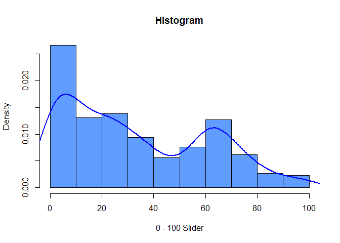<!-- -->


#### Missingness

**Missingness Descriptives**

Delivered / Answered = 1253 / 1253
Missing = 0
Min = 0, Max = 0, Mean = 0, SD = 0
(Descriptives are rounded to 2 decimals)

Missingness Intraclass Correlation (ICC) = NaN 


#### Screenshot


</div>

</div> 
### Block: Item 1160 <!-- Header section -->

<div class = "header-shading">

#### Check all that happened to you today: <br>

<div style="font-weight: bold; color: #2a5caa; margin-top: -0.7em; margin-bottom: 1em;">
  <a href="#Item 1220-anchor"> [Item 1220] </a>
</div>


</div>


<!-- Body -->


<div class = "anchor">

<div id="Question 2051-anchor">
  <strong>Question ID</strong>: Question 2051
</div>

**Way the question was delivered:** Multiple Select

**Type of data:** integer

</div> 
<div class = "anchor">


<button 
  onclick="let e = document.getElementById('Question 2051');
           let arrow = document.getElementById('Question 2051_arrow');
           e.style.display = e.style.display === 'none' ? 'block' : 'none';
           arrow.textContent = e.style.display === 'none' ? '▼' : '▲';"
  style="background: none; border: none; padding: 0; font-weight: bold; font-size: 18px; color: #2a5caa; cursor: pointer;">
Click to view visuals <span id="Question 2051_arrow">▼</span>
</button>

<div id="Question 2051" style="display: none;">


<!-- TOC-IGNORE-BEGIN -->

### Descriptives {.tabset}


#### Frequency Table

<table class="table" style="color: black; margin-left: auto; margin-right: auto;">
 <thead>
  <tr>
   <th style="text-align:left;"> Value </th>
   <th style="text-align:left;"> Label </th>
   <th style="text-align:left;"> Counts </th>
   <th style="text-align:left;"> Percentages </th>
  </tr>
 </thead>
<tbody>
  <tr>
   <td style="text-align:left;"> 1 </td>
   <td style="text-align:left;"> I felt that my friends didn’t want to be around me today. </td>
   <td style="text-align:left;color: darkgreen !important;"> N = 81 </td>
   <td style="text-align:left;"> 6.2% </td>
  </tr>
  <tr>
   <td style="text-align:left;"> 2 </td>
   <td style="text-align:left;"> Another kid teased me today. </td>
   <td style="text-align:left;color: darkgreen !important;"> N = 29 </td>
   <td style="text-align:left;"> 2.2% </td>
  </tr>
  <tr>
   <td style="text-align:left;"> 3 </td>
   <td style="text-align:left;"> I felt that my friends were talking about me behind my back today. </td>
   <td style="text-align:left;color: darkgreen !important;"> N = 41 </td>
   <td style="text-align:left;"> 3.1% </td>
  </tr>
  <tr>
   <td style="text-align:left;"> 4 </td>
   <td style="text-align:left;"> I got into a fight with another kid today. </td>
   <td style="text-align:left;color: darkgreen !important;"> N = 14 </td>
   <td style="text-align:left;"> 1.1% </td>
  </tr>
  <tr>
   <td style="text-align:left;"> 5 </td>
   <td style="text-align:left;"> One of my friends was mad at me today. </td>
   <td style="text-align:left;color: darkgreen !important;"> N = 52 </td>
   <td style="text-align:left;"> 4% </td>
  </tr>
  <tr>
   <td style="text-align:left;"> 6 </td>
   <td style="text-align:left;"> None apply </td>
   <td style="text-align:left;color: darkgreen !important;"> N = 1090 </td>
   <td style="text-align:left;"> 83.4% </td>
  </tr>
</tbody>
</table>


#### Barplot

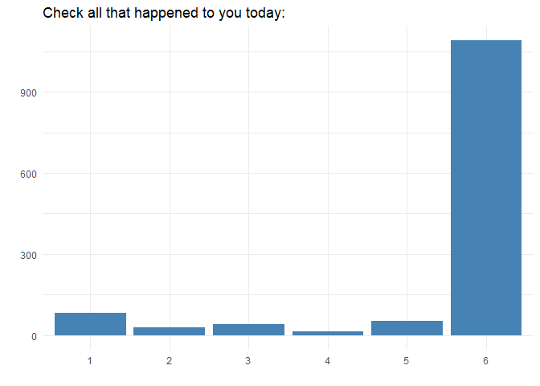<!-- -->


#### Missingness

**Missingness Descriptives**

Delivered / Answered = 1250 / 1246
Missing = 4
Min = 0, Max = 2, Mean = 0.03, SD = 0.2
(Descriptives are rounded to 2 decimals)

Missingness Intraclass Correlation (ICC) = 1.09 


#### Screenshot


</div>


</div> <!-- Header section -->

<div class = "header-shading">

#### Please tell us about your day overall. <br>

<div style="font-weight: bold; color: #2a5caa; margin-top: -0.7em; margin-bottom: 1em;">
  <a href="#Item 1358-anchor"> [Item 1358] </a>
</div>


</div>


<!-- Body -->


<div class = "anchor">

<div id="Question 2293-anchor">
  <strong>Question ID</strong>: Question 2293
</div>

**Way the question was delivered:** Informational Fullscreen

**Type of data:** NA

</div> <div class = "anchor">


</div> 
### Block: Item 1359 <!-- Header section -->

<div class = "header-shading">

#### At any time today, did you ask your friends to: <br>

<div style="font-weight: bold; color: #2a5caa; margin-top: -0.7em; margin-bottom: 1em;">
  <a href="#Item 5540-anchor"> [Item 5540] </a>
</div>


</div>


<!-- Body -->


<div class = "anchor">

<div id="Question 5661-anchor">
  <strong>Question ID</strong>: Question 5661
</div>

**Way the question was delivered:** Multiple Select

**Type of data:** integer

</div> 
<div class = "anchor">


<button 
  onclick="let e = document.getElementById('Question 5661');
           let arrow = document.getElementById('Question 5661_arrow');
           e.style.display = e.style.display === 'none' ? 'block' : 'none';
           arrow.textContent = e.style.display === 'none' ? '▼' : '▲';"
  style="background: none; border: none; padding: 0; font-weight: bold; font-size: 18px; color: #2a5caa; cursor: pointer;">
Click to view visuals <span id="Question 5661_arrow">▼</span>
</button>

<div id="Question 5661" style="display: none;">


<!-- TOC-IGNORE-BEGIN -->

### Descriptives {.tabset}


#### Frequency Table

<table class="table" style="color: black; margin-left: auto; margin-right: auto;">
 <thead>
  <tr>
   <th style="text-align:left;"> Value </th>
   <th style="text-align:left;"> Label </th>
   <th style="text-align:left;"> Counts </th>
   <th style="text-align:left;"> Percentages </th>
  </tr>
 </thead>
<tbody>
  <tr>
   <td style="text-align:left;"> 1 </td>
   <td style="text-align:left;"> Give you emotional support </td>
   <td style="text-align:left;color: darkgreen !important;"> N = 73 </td>
   <td style="text-align:left;"> 4.9% </td>
  </tr>
  <tr>
   <td style="text-align:left;"> 2 </td>
   <td style="text-align:left;"> Listen to you when you speak </td>
   <td style="text-align:left;color: darkgreen !important;"> N = 136 </td>
   <td style="text-align:left;"> 9.2% </td>
  </tr>
  <tr>
   <td style="text-align:left;"> 3 </td>
   <td style="text-align:left;"> Show that she understands or tell you about a similar situation </td>
   <td style="text-align:left;color: darkgreen !important;"> N = 79 </td>
   <td style="text-align:left;"> 5.3% </td>
  </tr>
  <tr>
   <td style="text-align:left;"> 4 </td>
   <td style="text-align:left;"> Give you information and ideas about how to make things better </td>
   <td style="text-align:left;color: darkgreen !important;"> N = 72 </td>
   <td style="text-align:left;"> 4.9% </td>
  </tr>
  <tr>
   <td style="text-align:left;"> 5 </td>
   <td style="text-align:left;"> Give you advice about what to do </td>
   <td style="text-align:left;color: darkgreen !important;"> N = 106 </td>
   <td style="text-align:left;"> 7.2% </td>
  </tr>
  <tr>
   <td style="text-align:left;"> 6 </td>
   <td style="text-align:left;"> Think about the situation with you and tell you what you can do about it </td>
   <td style="text-align:left;color: darkgreen !important;"> N = 70 </td>
   <td style="text-align:left;"> 4.7% </td>
  </tr>
  <tr>
   <td style="text-align:left;"> 7 </td>
   <td style="text-align:left;"> Do something to help you </td>
   <td style="text-align:left;color: darkgreen !important;"> N = 123 </td>
   <td style="text-align:left;"> 8.3% </td>
  </tr>
  <tr>
   <td style="text-align:left;"> 8 </td>
   <td style="text-align:left;"> Offer to do something to help you </td>
   <td style="text-align:left;color: darkgreen !important;"> N = 57 </td>
   <td style="text-align:left;"> 3.8% </td>
  </tr>
  <tr>
   <td style="text-align:left;"> 9 </td>
   <td style="text-align:left;"> None apply </td>
   <td style="text-align:left;color: darkgreen !important;"> N = 765 </td>
   <td style="text-align:left;"> 51.7% </td>
  </tr>
</tbody>
</table>


#### Barplot

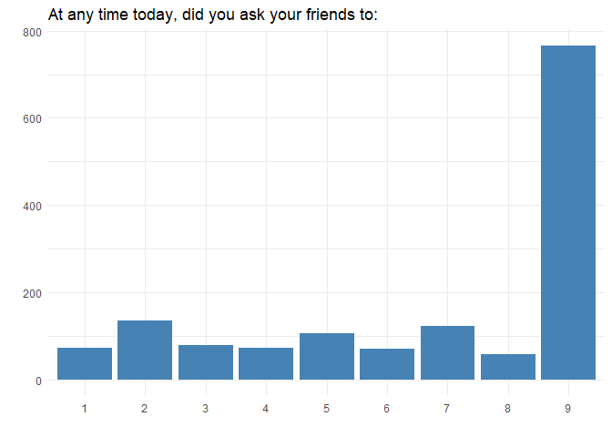<!-- -->


#### Missingness

**Missingness Descriptives**

Delivered / Answered = 1048 / 1042
Missing = 6
Min = 0, Max = 2, Mean = 0.05, SD = 0.29
(Descriptives are rounded to 2 decimals)

Missingness Intraclass Correlation (ICC) = 1.07 


#### Screenshot


</div>


</div> 
### Block: Item 5545 <!-- Header section -->

<div class = "header-shading">

#### Today, did you see or communicate with your parent? <br>

<div style="font-weight: bold; color: #2a5caa; margin-top: -0.7em; margin-bottom: 1em;">
  <a href="#Item 6310-anchor"> [Item 6310] </a>
</div>


</div>


<!-- Body -->


<div class = "anchor">

<div id="Question 6738-anchor">
  <strong>Question ID</strong>: Question 6738
</div>

**Way the question was delivered:** Multiple Choice

**Type of data:** integer

</div> 
<div class = "anchor">


<button 
  onclick="let e = document.getElementById('Question 6738');
           let arrow = document.getElementById('Question 6738_arrow');
           e.style.display = e.style.display === 'none' ? 'block' : 'none';
           arrow.textContent = e.style.display === 'none' ? '▼' : '▲';"
  style="background: none; border: none; padding: 0; font-weight: bold; font-size: 18px; color: #2a5caa; cursor: pointer;">
Click to view visuals <span id="Question 6738_arrow">▼</span>
</button>

<div id="Question 6738" style="display: none;">


<!-- TOC-IGNORE-BEGIN -->

### Descriptives {.tabset}


#### Frequency Table

<table class="table" style="color: black; margin-left: auto; margin-right: auto;">
 <thead>
  <tr>
   <th style="text-align:left;"> Value </th>
   <th style="text-align:left;"> Label </th>
   <th style="text-align:left;"> Counts </th>
   <th style="text-align:left;"> Percentages </th>
  </tr>
 </thead>
<tbody>
  <tr>
   <td style="text-align:left;"> 1 </td>
   <td style="text-align:left;"> Yes </td>
   <td style="text-align:left;color: darkgreen !important;"> N = 697 </td>
   <td style="text-align:left;"> 92.7% </td>
  </tr>
  <tr>
   <td style="text-align:left;"> 2 </td>
   <td style="text-align:left;"> No </td>
   <td style="text-align:left;color: darkgreen !important;"> N = 55 </td>
   <td style="text-align:left;"> 7.3% </td>
  </tr>
</tbody>
</table>


#### Barplot

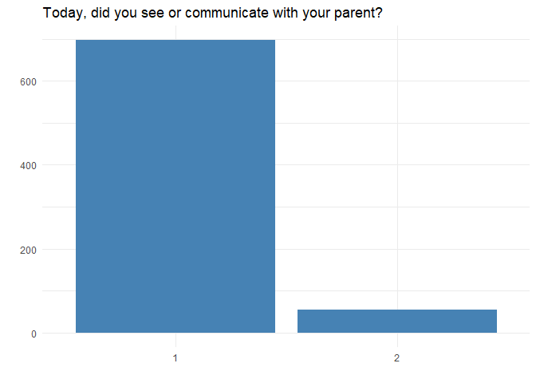<!-- -->


#### Missingness

**Missingness Descriptives**

Delivered / Answered = 752 / 752
Missing = 0
Min = 0, Max = 0, Mean = 0, SD = 0
(Descriptives are rounded to 2 decimals)

Missingness Intraclass Correlation (ICC) = NaN 


#### Screenshot


</div>


</div> 
### Block: Item 6334 
### Block: Item 6342 <!-- Header section -->

<div class = "header-shading">

#### How bothered or stressed were you because of this? <br>

<div style="font-weight: bold; color: #2a5caa; margin-top: -0.7em; margin-bottom: 1em;">
  <a href="#Item 1118-anchor"> [Item 1118] </a>
</div>


</div>


<!-- Body -->


<div class = "anchor">

<div id="Question 1907-anchor">
  <strong>Question ID</strong>: Question 1907
</div>

**Way the question was delivered:** Slider

**Type of data:** numeric

</div> <div class = "anchor">


**Descriptives**
Min = NA, Max = NA, Mean = NA, SD = NA 


<button 
  onclick="let e = document.getElementById('Question 1907');
           let arrow = document.getElementById('Question 1907_arrow');
           e.style.display = e.style.display === 'none' ? 'block' : 'none';
           arrow.textContent = e.style.display === 'none' ? '▼' : '▲';"
  style="background: none; border: none; padding: 0; font-weight: bold; font-size: 18px; color: #2a5caa; cursor: pointer;">
Click to view visuals <span id="Question 1907_arrow">▼</span>
</button>

<div id="Question 1907" style="display: none;">


<!-- TOC-IGNORE-BEGIN -->

### Descriptives {.tabset}


#### Missingness

**Missingness Descriptives**

Delivered / Answered = 0 / 0
Missing = 0
Min = NA, Max = NA, Mean = NA, SD = NA
(Descriptives are rounded to 2 decimals)

Missingness Intraclass Correlation (ICC) = NA 


#### Screenshot


</div>

</div> <!-- Header section -->

<div class = "header-shading">

#### With whom did you have an argument or disagreement? <br>

<div style="font-weight: bold; color: #2a5caa; margin-top: -0.7em; margin-bottom: 1em;">
  <a href="#Item 1119-anchor"> [Item 1119] </a>
</div>


</div>


<!-- Body -->


<div class = "anchor">

<div id="Question 1908-anchor">
  <strong>Question ID</strong>: Question 1908
</div>

**Way the question was delivered:** Multiple Select

**Type of data:** integer

</div> 
<div class = "anchor">


<button 
  onclick="let e = document.getElementById('Question 1908');
           let arrow = document.getElementById('Question 1908_arrow');
           e.style.display = e.style.display === 'none' ? 'block' : 'none';
           arrow.textContent = e.style.display === 'none' ? '▼' : '▲';"
  style="background: none; border: none; padding: 0; font-weight: bold; font-size: 18px; color: #2a5caa; cursor: pointer;">
Click to view visuals <span id="Question 1908_arrow">▼</span>
</button>

<div id="Question 1908" style="display: none;">


<!-- TOC-IGNORE-BEGIN -->

### Descriptives {.tabset}


<table class="table" style="color: black; margin-left: auto; margin-right: auto;">
 <thead>
  <tr>
   <th style="text-align:right;"> Value </th>
   <th style="text-align:left;"> Label </th>
   <th style="text-align:left;"> Counts </th>
   <th style="text-align:left;"> Percentages </th>
  </tr>
 </thead>
<tbody>
  <tr>
   <td style="text-align:right;"> 1 </td>
   <td style="text-align:left;"> Parents </td>
   <td style="text-align:left;color: darkgreen !important;"> N = 0 </td>
   <td style="text-align:left;"> 0% </td>
  </tr>
  <tr>
   <td style="text-align:right;"> 2 </td>
   <td style="text-align:left;"> Siblings </td>
   <td style="text-align:left;color: darkgreen !important;"> N = 0 </td>
   <td style="text-align:left;"> 0% </td>
  </tr>
  <tr>
   <td style="text-align:right;"> 3 </td>
   <td style="text-align:left;"> Friends, other people your age </td>
   <td style="text-align:left;color: darkgreen !important;"> N = 0 </td>
   <td style="text-align:left;"> 0% </td>
  </tr>
  <tr>
   <td style="text-align:right;"> 4 </td>
   <td style="text-align:left;"> Teachers, coaches, other adults </td>
   <td style="text-align:left;color: darkgreen !important;"> N = 0 </td>
   <td style="text-align:left;"> 0% </td>
  </tr>
  <tr>
   <td style="text-align:right;"> 5 </td>
   <td style="text-align:left;"> Other (ex: cashier, a stranger) </td>
   <td style="text-align:left;color: darkgreen !important;"> N = 0 </td>
   <td style="text-align:left;"> 0% </td>
  </tr>
</tbody>
</table>


#### Missingness

**Missingness Descriptives**

Delivered / Answered = 0 / 0
Missing = 0
Min = NA, Max = NA, Mean = NA, SD = NA
(Descriptives are rounded to 2 decimals)

Missingness Intraclass Correlation (ICC) = NA 


#### Screenshot


</div>


</div> <!-- Header section -->

<div class = "header-shading">

#### How bothered or stressed were you because of this? <br>

<div style="font-weight: bold; color: #2a5caa; margin-top: -0.7em; margin-bottom: 1em;">
  <a href="#Item 1122-anchor"> [Item 1122] </a>
</div>


</div>


<!-- Body -->


<div class = "anchor">

<div id="Question 1910-anchor">
  <strong>Question ID</strong>: Question 1910
</div>

**Way the question was delivered:** Slider

**Type of data:** numeric

</div> <div class = "anchor">


**Descriptives**
Min = NA, Max = NA, Mean = NA, SD = NA 


<button 
  onclick="let e = document.getElementById('Question 1910');
           let arrow = document.getElementById('Question 1910_arrow');
           e.style.display = e.style.display === 'none' ? 'block' : 'none';
           arrow.textContent = e.style.display === 'none' ? '▼' : '▲';"
  style="background: none; border: none; padding: 0; font-weight: bold; font-size: 18px; color: #2a5caa; cursor: pointer;">
Click to view visuals <span id="Question 1910_arrow">▼</span>
</button>

<div id="Question 1910" style="display: none;">


<!-- TOC-IGNORE-BEGIN -->

### Descriptives {.tabset}


#### Missingness

**Missingness Descriptives**

Delivered / Answered = 0 / 0
Missing = 0
Min = NA, Max = NA, Mean = NA, SD = NA
(Descriptives are rounded to 2 decimals)

Missingness Intraclass Correlation (ICC) = NA 


#### Screenshot


</div>

</div> <!-- Header section -->

<div class = "header-shading">

#### Where did you feel this way? <br>

<div style="font-weight: bold; color: #2a5caa; margin-top: -0.7em; margin-bottom: 1em;">
  <a href="#Item 1123-anchor"> [Item 1123] </a>
</div>


</div>


<!-- Body -->


<div class = "anchor">

<div id="Question 1911-anchor">
  <strong>Question ID</strong>: Question 1911
</div>

**Way the question was delivered:** Multiple Select

**Type of data:** integer

</div> 
<div class = "anchor">


<button 
  onclick="let e = document.getElementById('Question 1911');
           let arrow = document.getElementById('Question 1911_arrow');
           e.style.display = e.style.display === 'none' ? 'block' : 'none';
           arrow.textContent = e.style.display === 'none' ? '▼' : '▲';"
  style="background: none; border: none; padding: 0; font-weight: bold; font-size: 18px; color: #2a5caa; cursor: pointer;">
Click to view visuals <span id="Question 1911_arrow">▼</span>
</button>

<div id="Question 1911" style="display: none;">


<!-- TOC-IGNORE-BEGIN -->

### Descriptives {.tabset}


<table class="table" style="color: black; margin-left: auto; margin-right: auto;">
 <thead>
  <tr>
   <th style="text-align:right;"> Value </th>
   <th style="text-align:left;"> Label </th>
   <th style="text-align:left;"> Counts </th>
   <th style="text-align:left;"> Percentages </th>
  </tr>
 </thead>
<tbody>
  <tr>
   <td style="text-align:right;"> 1 </td>
   <td style="text-align:left;"> Home </td>
   <td style="text-align:left;color: darkgreen !important;"> N = 0 </td>
   <td style="text-align:left;"> 0% </td>
  </tr>
  <tr>
   <td style="text-align:right;"> 2 </td>
   <td style="text-align:left;"> School or extracurricular activity </td>
   <td style="text-align:left;color: darkgreen !important;"> N = 0 </td>
   <td style="text-align:left;"> 0% </td>
  </tr>
  <tr>
   <td style="text-align:right;"> 3 </td>
   <td style="text-align:left;"> Other (ex: at the store) </td>
   <td style="text-align:left;color: darkgreen !important;"> N = 0 </td>
   <td style="text-align:left;"> 0% </td>
  </tr>
</tbody>
</table>


#### Missingness

**Missingness Descriptives**

Delivered / Answered = 0 / 0
Missing = 0
Min = NA, Max = NA, Mean = NA, SD = NA
(Descriptives are rounded to 2 decimals)

Missingness Intraclass Correlation (ICC) = NA 


#### Screenshot


</div>


</div> <!-- Header section -->

<div class = "header-shading">

#### How bothered or stressed were you because of this? <br>

<div style="font-weight: bold; color: #2a5caa; margin-top: -0.7em; margin-bottom: 1em;">
  <a href="#Item 1126-anchor"> [Item 1126] </a>
</div>


</div>


<!-- Body -->


<div class = "anchor">

<div id="Question 1913-anchor">
  <strong>Question ID</strong>: Question 1913
</div>

**Way the question was delivered:** Slider

**Type of data:** numeric

</div> <div class = "anchor">


**Descriptives**
Min = NA, Max = NA, Mean = NA, SD = NA 


<button 
  onclick="let e = document.getElementById('Question 1913');
           let arrow = document.getElementById('Question 1913_arrow');
           e.style.display = e.style.display === 'none' ? 'block' : 'none';
           arrow.textContent = e.style.display === 'none' ? '▼' : '▲';"
  style="background: none; border: none; padding: 0; font-weight: bold; font-size: 18px; color: #2a5caa; cursor: pointer;">
Click to view visuals <span id="Question 1913_arrow">▼</span>
</button>

<div id="Question 1913" style="display: none;">


<!-- TOC-IGNORE-BEGIN -->

### Descriptives {.tabset}


#### Missingness

**Missingness Descriptives**

Delivered / Answered = 0 / 0
Missing = 0
Min = NA, Max = NA, Mean = NA, SD = NA
(Descriptives are rounded to 2 decimals)

Missingness Intraclass Correlation (ICC) = NA 


#### Screenshot


</div>

</div> <!-- Header section -->

<div class = "header-shading">

#### Where did this happen? <br>

<div style="font-weight: bold; color: #2a5caa; margin-top: -0.7em; margin-bottom: 1em;">
  <a href="#Item 1127-anchor"> [Item 1127] </a>
</div>


</div>


<!-- Body -->


<div class = "anchor">

<div id="Question 1914-anchor">
  <strong>Question ID</strong>: Question 1914
</div>

**Way the question was delivered:** Multiple Select

**Type of data:** integer

</div> 
<div class = "anchor">


<button 
  onclick="let e = document.getElementById('Question 1914');
           let arrow = document.getElementById('Question 1914_arrow');
           e.style.display = e.style.display === 'none' ? 'block' : 'none';
           arrow.textContent = e.style.display === 'none' ? '▼' : '▲';"
  style="background: none; border: none; padding: 0; font-weight: bold; font-size: 18px; color: #2a5caa; cursor: pointer;">
Click to view visuals <span id="Question 1914_arrow">▼</span>
</button>

<div id="Question 1914" style="display: none;">


<!-- TOC-IGNORE-BEGIN -->

### Descriptives {.tabset}


<table class="table" style="color: black; margin-left: auto; margin-right: auto;">
 <thead>
  <tr>
   <th style="text-align:right;"> Value </th>
   <th style="text-align:left;"> Label </th>
   <th style="text-align:left;"> Counts </th>
   <th style="text-align:left;"> Percentages </th>
  </tr>
 </thead>
<tbody>
  <tr>
   <td style="text-align:right;"> 1 </td>
   <td style="text-align:left;"> Home </td>
   <td style="text-align:left;color: darkgreen !important;"> N = 0 </td>
   <td style="text-align:left;"> 0% </td>
  </tr>
  <tr>
   <td style="text-align:right;"> 2 </td>
   <td style="text-align:left;"> School or extracurricular activity </td>
   <td style="text-align:left;color: darkgreen !important;"> N = 0 </td>
   <td style="text-align:left;"> 0% </td>
  </tr>
  <tr>
   <td style="text-align:right;"> 3 </td>
   <td style="text-align:left;"> Other (ex: at the store) </td>
   <td style="text-align:left;color: darkgreen !important;"> N = 0 </td>
   <td style="text-align:left;"> 0% </td>
  </tr>
</tbody>
</table>


#### Missingness

**Missingness Descriptives**

Delivered / Answered = 0 / 0
Missing = 0
Min = NA, Max = NA, Mean = NA, SD = NA
(Descriptives are rounded to 2 decimals)

Missingness Intraclass Correlation (ICC) = NA 


#### Screenshot


</div>


</div> <!-- Header section -->

<div class = "header-shading">

#### How bothered or stressed were you because of this? <br>

<div style="font-weight: bold; color: #2a5caa; margin-top: -0.7em; margin-bottom: 1em;">
  <a href="#Item 1130-anchor"> [Item 1130] </a>
</div>


</div>


<!-- Body -->


<div class = "anchor">

<div id="Question 2273-anchor">
  <strong>Question ID</strong>: Question 2273
</div>

**Way the question was delivered:** Slider

**Type of data:** numeric

</div> <div class = "anchor">


**Descriptives**
Min = NA, Max = NA, Mean = NA, SD = NA 


<button 
  onclick="let e = document.getElementById('Question 2273');
           let arrow = document.getElementById('Question 2273_arrow');
           e.style.display = e.style.display === 'none' ? 'block' : 'none';
           arrow.textContent = e.style.display === 'none' ? '▼' : '▲';"
  style="background: none; border: none; padding: 0; font-weight: bold; font-size: 18px; color: #2a5caa; cursor: pointer;">
Click to view visuals <span id="Question 2273_arrow">▼</span>
</button>

<div id="Question 2273" style="display: none;">


<!-- TOC-IGNORE-BEGIN -->

### Descriptives {.tabset}


#### Missingness

**Missingness Descriptives**

Delivered / Answered = 0 / 0
Missing = 0
Min = NA, Max = NA, Mean = NA, SD = NA
(Descriptives are rounded to 2 decimals)

Missingness Intraclass Correlation (ICC) = NA 


#### Screenshot


</div>

</div> <!-- Header section -->

<div class = "header-shading">

#### Who did this problem involve? <br>

<div style="font-weight: bold; color: #2a5caa; margin-top: -0.7em; margin-bottom: 1em;">
  <a href="#Item 1131-anchor"> [Item 1131] </a>
</div>


</div>


<!-- Body -->


<div class = "anchor">

<div id="Question 2274-anchor">
  <strong>Question ID</strong>: Question 2274
</div>

**Way the question was delivered:** Multiple Select

**Type of data:** integer

</div> 
<div class = "anchor">


<button 
  onclick="let e = document.getElementById('Question 2274');
           let arrow = document.getElementById('Question 2274_arrow');
           e.style.display = e.style.display === 'none' ? 'block' : 'none';
           arrow.textContent = e.style.display === 'none' ? '▼' : '▲';"
  style="background: none; border: none; padding: 0; font-weight: bold; font-size: 18px; color: #2a5caa; cursor: pointer;">
Click to view visuals <span id="Question 2274_arrow">▼</span>
</button>

<div id="Question 2274" style="display: none;">


<!-- TOC-IGNORE-BEGIN -->

### Descriptives {.tabset}


<table class="table" style="color: black; margin-left: auto; margin-right: auto;">
 <thead>
  <tr>
   <th style="text-align:right;"> Value </th>
   <th style="text-align:left;"> Label </th>
   <th style="text-align:left;"> Counts </th>
   <th style="text-align:left;"> Percentages </th>
  </tr>
 </thead>
<tbody>
  <tr>
   <td style="text-align:right;"> 1 </td>
   <td style="text-align:left;"> Family </td>
   <td style="text-align:left;color: darkgreen !important;"> N = 0 </td>
   <td style="text-align:left;"> 0% </td>
  </tr>
  <tr>
   <td style="text-align:right;"> 2 </td>
   <td style="text-align:left;"> Friends or someone you know </td>
   <td style="text-align:left;color: darkgreen !important;"> N = 0 </td>
   <td style="text-align:left;"> 0% </td>
  </tr>
  <tr>
   <td style="text-align:right;"> 3 </td>
   <td style="text-align:left;"> Other (ex: strangers) </td>
   <td style="text-align:left;color: darkgreen !important;"> N = 0 </td>
   <td style="text-align:left;"> 0% </td>
  </tr>
</tbody>
</table>


#### Missingness

**Missingness Descriptives**

Delivered / Answered = 0 / 0
Missing = 0
Min = NA, Max = NA, Mean = NA, SD = NA
(Descriptives are rounded to 2 decimals)

Missingness Intraclass Correlation (ICC) = NA 


#### Screenshot


</div>


</div> <!-- Header section -->

<div class = "header-shading">

#### Check all the ways that you interacted with your parent, in person. <br>

<div style="font-weight: bold; color: #2a5caa; margin-top: -0.7em; margin-bottom: 1em;">
  <a href="#Item 1133-anchor"> [Item 1133] </a>
</div>


</div>


<!-- Body -->


<div class = "anchor">

<div id="Question 2277-anchor">
  <strong>Question ID</strong>: Question 2277
</div>

**Way the question was delivered:** Multiple Select

**Type of data:** integer

</div> 
<div class = "anchor">


<button 
  onclick="let e = document.getElementById('Question 2277');
           let arrow = document.getElementById('Question 2277_arrow');
           e.style.display = e.style.display === 'none' ? 'block' : 'none';
           arrow.textContent = e.style.display === 'none' ? '▼' : '▲';"
  style="background: none; border: none; padding: 0; font-weight: bold; font-size: 18px; color: #2a5caa; cursor: pointer;">
Click to view visuals <span id="Question 2277_arrow">▼</span>
</button>

<div id="Question 2277" style="display: none;">


<!-- TOC-IGNORE-BEGIN -->

### Descriptives {.tabset}


<table class="table" style="color: black; margin-left: auto; margin-right: auto;">
 <thead>
  <tr>
   <th style="text-align:right;"> Value </th>
   <th style="text-align:left;"> Label </th>
   <th style="text-align:left;"> Counts </th>
   <th style="text-align:left;"> Percentages </th>
  </tr>
 </thead>
<tbody>
  <tr>
   <td style="text-align:right;"> 1 </td>
   <td style="text-align:left;"> Do something together (ex: eat, clean, watch a show) </td>
   <td style="text-align:left;color: darkgreen !important;"> N = 0 </td>
   <td style="text-align:left;"> 0% </td>
  </tr>
  <tr>
   <td style="text-align:right;"> 2 </td>
   <td style="text-align:left;"> Make physical contact (ex: hug, lean on each other) </td>
   <td style="text-align:left;color: darkgreen !important;"> N = 0 </td>
   <td style="text-align:left;"> 0% </td>
  </tr>
  <tr>
   <td style="text-align:right;"> 3 </td>
   <td style="text-align:left;"> Just be together (ex: be on your own phones) </td>
   <td style="text-align:left;color: darkgreen !important;"> N = 0 </td>
   <td style="text-align:left;"> 0% </td>
  </tr>
  <tr>
   <td style="text-align:right;"> 4 </td>
   <td style="text-align:left;"> Ask a question or make a request </td>
   <td style="text-align:left;color: darkgreen !important;"> N = 0 </td>
   <td style="text-align:left;"> 0% </td>
  </tr>
  <tr>
   <td style="text-align:right;"> 5 </td>
   <td style="text-align:left;"> Reply to a question or request </td>
   <td style="text-align:left;color: darkgreen !important;"> N = 0 </td>
   <td style="text-align:left;"> 0% </td>
  </tr>
  <tr>
   <td style="text-align:right;"> 6 </td>
   <td style="text-align:left;"> Have a conversation (ex: exchange a few words or more) </td>
   <td style="text-align:left;color: darkgreen !important;"> N = 0 </td>
   <td style="text-align:left;"> 0% </td>
  </tr>
  <tr>
   <td style="text-align:right;"> 7 </td>
   <td style="text-align:left;"> Other </td>
   <td style="text-align:left;color: darkgreen !important;"> N = 0 </td>
   <td style="text-align:left;"> 0% </td>
  </tr>
  <tr>
   <td style="text-align:right;"> 8 </td>
   <td style="text-align:left;"> None apply </td>
   <td style="text-align:left;color: darkgreen !important;"> N = 0 </td>
   <td style="text-align:left;"> 0% </td>
  </tr>
</tbody>
</table>


#### Missingness

**Missingness Descriptives**

Delivered / Answered = 0 / 0
Missing = 0
Min = NA, Max = NA, Mean = NA, SD = NA
(Descriptives are rounded to 2 decimals)

Missingness Intraclass Correlation (ICC) = NA 


#### Screenshot


</div>


</div> <!-- Header section -->

<div class = "header-shading">

#### How close did you feel to your parent? <br>

<div style="font-weight: bold; color: #2a5caa; margin-top: -0.7em; margin-bottom: 1em;">
  <a href="#Item 1134-anchor"> [Item 1134] </a>
</div>


</div>


<!-- Body -->


<div class = "anchor">

<div id="Question 2278-anchor">
  <strong>Question ID</strong>: Question 2278
</div>

**Way the question was delivered:** Slider

**Type of data:** numeric

</div> <div class = "anchor">


**Descriptives**
Min = NA, Max = NA, Mean = NA, SD = NA 


<button 
  onclick="let e = document.getElementById('Question 2278');
           let arrow = document.getElementById('Question 2278_arrow');
           e.style.display = e.style.display === 'none' ? 'block' : 'none';
           arrow.textContent = e.style.display === 'none' ? '▼' : '▲';"
  style="background: none; border: none; padding: 0; font-weight: bold; font-size: 18px; color: #2a5caa; cursor: pointer;">
Click to view visuals <span id="Question 2278_arrow">▼</span>
</button>

<div id="Question 2278" style="display: none;">


<!-- TOC-IGNORE-BEGIN -->

### Descriptives {.tabset}


#### Missingness

**Missingness Descriptives**

Delivered / Answered = 0 / 0
Missing = 0
Min = NA, Max = NA, Mean = NA, SD = NA
(Descriptives are rounded to 2 decimals)

Missingness Intraclass Correlation (ICC) = NA 


#### Screenshot


</div>

</div> <!-- Header section -->

<div class = "header-shading">

#### Who else was a part of your most recent interaction with your parent? <br>

<div style="font-weight: bold; color: #2a5caa; margin-top: -0.7em; margin-bottom: 1em;">
  <a href="#Item 1135-anchor"> [Item 1135] </a>
</div>


</div>


<!-- Body -->


<div class = "anchor">

<div id="Question 2279-anchor">
  <strong>Question ID</strong>: Question 2279
</div>

**Way the question was delivered:** Multiple Select

**Type of data:** integer

</div> 
<div class = "anchor">


<button 
  onclick="let e = document.getElementById('Question 2279');
           let arrow = document.getElementById('Question 2279_arrow');
           e.style.display = e.style.display === 'none' ? 'block' : 'none';
           arrow.textContent = e.style.display === 'none' ? '▼' : '▲';"
  style="background: none; border: none; padding: 0; font-weight: bold; font-size: 18px; color: #2a5caa; cursor: pointer;">
Click to view visuals <span id="Question 2279_arrow">▼</span>
</button>

<div id="Question 2279" style="display: none;">


<!-- TOC-IGNORE-BEGIN -->

### Descriptives {.tabset}


<table class="table" style="color: black; margin-left: auto; margin-right: auto;">
 <thead>
  <tr>
   <th style="text-align:right;"> Value </th>
   <th style="text-align:left;"> Label </th>
   <th style="text-align:left;"> Counts </th>
   <th style="text-align:left;"> Percentages </th>
  </tr>
 </thead>
<tbody>
  <tr>
   <td style="text-align:right;"> 1 </td>
   <td style="text-align:left;"> Other parent or caregivers </td>
   <td style="text-align:left;color: darkgreen !important;"> N = 0 </td>
   <td style="text-align:left;"> 0% </td>
  </tr>
  <tr>
   <td style="text-align:right;"> 2 </td>
   <td style="text-align:left;"> Siblings </td>
   <td style="text-align:left;color: darkgreen !important;"> N = 0 </td>
   <td style="text-align:left;"> 0% </td>
  </tr>
  <tr>
   <td style="text-align:right;"> 3 </td>
   <td style="text-align:left;"> Other adults </td>
   <td style="text-align:left;color: darkgreen !important;"> N = 0 </td>
   <td style="text-align:left;"> 0% </td>
  </tr>
  <tr>
   <td style="text-align:right;"> 4 </td>
   <td style="text-align:left;"> Other children or teens </td>
   <td style="text-align:left;color: darkgreen !important;"> N = 0 </td>
   <td style="text-align:left;"> 0% </td>
  </tr>
  <tr>
   <td style="text-align:right;"> 5 </td>
   <td style="text-align:left;"> Strangers (ex: cashier) </td>
   <td style="text-align:left;color: darkgreen !important;"> N = 0 </td>
   <td style="text-align:left;"> 0% </td>
  </tr>
  <tr>
   <td style="text-align:right;"> 6 </td>
   <td style="text-align:left;"> None apply </td>
   <td style="text-align:left;color: darkgreen !important;"> N = 0 </td>
   <td style="text-align:left;"> 0% </td>
  </tr>
</tbody>
</table>


#### Missingness

**Missingness Descriptives**

Delivered / Answered = 0 / 0
Missing = 0
Min = NA, Max = NA, Mean = NA, SD = NA
(Descriptives are rounded to 2 decimals)

Missingness Intraclass Correlation (ICC) = NA 


#### Screenshot


</div>


</div> <!-- Header section -->

<div class = "header-shading">

#### Check all the ways that you interacted with parents. <br>

<div style="font-weight: bold; color: #2a5caa; margin-top: -0.7em; margin-bottom: 1em;">
  <a href="#Item 4465-anchor"> [Item 4465] </a>
</div>


</div>


<!-- Body -->


<div class = "anchor">

<div id="Question 4099-anchor">
  <strong>Question ID</strong>: Question 4099
</div>

**Way the question was delivered:** Multiple Select

**Type of data:** integer

</div> 
<div class = "anchor">


<button 
  onclick="let e = document.getElementById('Question 4099');
           let arrow = document.getElementById('Question 4099_arrow');
           e.style.display = e.style.display === 'none' ? 'block' : 'none';
           arrow.textContent = e.style.display === 'none' ? '▼' : '▲';"
  style="background: none; border: none; padding: 0; font-weight: bold; font-size: 18px; color: #2a5caa; cursor: pointer;">
Click to view visuals <span id="Question 4099_arrow">▼</span>
</button>

<div id="Question 4099" style="display: none;">


<!-- TOC-IGNORE-BEGIN -->

### Descriptives {.tabset}


<table class="table" style="color: black; margin-left: auto; margin-right: auto;">
 <thead>
  <tr>
   <th style="text-align:right;"> Value </th>
   <th style="text-align:left;"> Label </th>
   <th style="text-align:left;"> Counts </th>
   <th style="text-align:left;"> Percentages </th>
  </tr>
 </thead>
<tbody>
  <tr>
   <td style="text-align:right;"> 1 </td>
   <td style="text-align:left;"> in person </td>
   <td style="text-align:left;color: darkgreen !important;"> N = 0 </td>
   <td style="text-align:left;"> 0% </td>
  </tr>
  <tr>
   <td style="text-align:right;"> 2 </td>
   <td style="text-align:left;"> text </td>
   <td style="text-align:left;color: darkgreen !important;"> N = 0 </td>
   <td style="text-align:left;"> 0% </td>
  </tr>
  <tr>
   <td style="text-align:right;"> 3 </td>
   <td style="text-align:left;"> Phone call </td>
   <td style="text-align:left;color: darkgreen !important;"> N = 0 </td>
   <td style="text-align:left;"> 0% </td>
  </tr>
  <tr>
   <td style="text-align:right;"> 4 </td>
   <td style="text-align:left;"> video chat </td>
   <td style="text-align:left;color: darkgreen !important;"> N = 0 </td>
   <td style="text-align:left;"> 0% </td>
  </tr>
  <tr>
   <td style="text-align:right;"> 5 </td>
   <td style="text-align:left;"> Other </td>
   <td style="text-align:left;color: darkgreen !important;"> N = 0 </td>
   <td style="text-align:left;"> 0% </td>
  </tr>
</tbody>
</table>


#### Missingness

**Missingness Descriptives**

Delivered / Answered = 0 / 0
Missing = 0
Min = NA, Max = NA, Mean = NA, SD = NA
(Descriptives are rounded to 2 decimals)

Missingness Intraclass Correlation (ICC) = NA 


#### Screenshot


</div>


</div> <!-- Header section -->

<div class = "header-shading">

#### Please think about the most stressful event, situation or experience you faced today. <br>

<div style="font-weight: bold; color: #2a5caa; margin-top: -0.7em; margin-bottom: 1em;">
  <a href="#Item 1154-anchor"> [Item 1154] </a>
</div>


</div>


<!-- Body -->


<div class = "anchor">

<div id="Question 2294-anchor">
  <strong>Question ID</strong>: Question 2294
</div>

**Way the question was delivered:** Informational Fullscreen

**Type of data:** NA

</div> <div class = "anchor">


</div> <!-- Header section -->

<div class = "header-shading">

#### Who did you want to talk to? <br>

<div style="font-weight: bold; color: #2a5caa; margin-top: -0.7em; margin-bottom: 1em;">
  <a href="#Item 1156-anchor"> [Item 1156] </a>
</div>


</div>


<!-- Body -->


<div class = "anchor">

<div id="Question 2295-anchor">
  <strong>Question ID</strong>: Question 2295
</div>

**Way the question was delivered:** Multiple Select

**Type of data:** integer

</div> 
<div class = "anchor">


<button 
  onclick="let e = document.getElementById('Question 2295');
           let arrow = document.getElementById('Question 2295_arrow');
           e.style.display = e.style.display === 'none' ? 'block' : 'none';
           arrow.textContent = e.style.display === 'none' ? '▼' : '▲';"
  style="background: none; border: none; padding: 0; font-weight: bold; font-size: 18px; color: #2a5caa; cursor: pointer;">
Click to view visuals <span id="Question 2295_arrow">▼</span>
</button>

<div id="Question 2295" style="display: none;">


<!-- TOC-IGNORE-BEGIN -->

### Descriptives {.tabset}


#### Frequency Table

<table class="table" style="color: black; margin-left: auto; margin-right: auto;">
 <thead>
  <tr>
   <th style="text-align:left;"> Value </th>
   <th style="text-align:left;"> Label </th>
   <th style="text-align:left;"> Counts </th>
   <th style="text-align:left;"> Percentages </th>
  </tr>
 </thead>
<tbody>
  <tr>
   <td style="text-align:left;"> 1 </td>
   <td style="text-align:left;"> Siblings </td>
   <td style="text-align:left;color: darkgreen !important;"> N = 26 </td>
   <td style="text-align:left;"> 8.2% </td>
  </tr>
  <tr>
   <td style="text-align:left;"> 2 </td>
   <td style="text-align:left;"> Parents or caregivers </td>
   <td style="text-align:left;color: darkgreen !important;"> N = 117 </td>
   <td style="text-align:left;"> 36.9% </td>
  </tr>
  <tr>
   <td style="text-align:left;"> 3 </td>
   <td style="text-align:left;"> Other family members </td>
   <td style="text-align:left;color: darkgreen !important;"> N = 20 </td>
   <td style="text-align:left;"> 6.3% </td>
  </tr>
  <tr>
   <td style="text-align:left;"> 4 </td>
   <td style="text-align:left;"> Friends </td>
   <td style="text-align:left;color: darkgreen !important;"> N = 94 </td>
   <td style="text-align:left;"> 29.7% </td>
  </tr>
  <tr>
   <td style="text-align:left;"> 5 </td>
   <td style="text-align:left;"> Online friends </td>
   <td style="text-align:left;color: darkgreen !important;"> N = 13 </td>
   <td style="text-align:left;"> 4.1% </td>
  </tr>
  <tr>
   <td style="text-align:left;"> 6 </td>
   <td style="text-align:left;"> Teachers, coaches or other adults </td>
   <td style="text-align:left;color: darkgreen !important;"> N = 22 </td>
   <td style="text-align:left;"> 6.9% </td>
  </tr>
  <tr>
   <td style="text-align:left;"> 7 </td>
   <td style="text-align:left;"> None apply </td>
   <td style="text-align:left;color: darkgreen !important;"> N = 25 </td>
   <td style="text-align:left;"> 7.9% </td>
  </tr>
</tbody>
</table>


#### Barplot

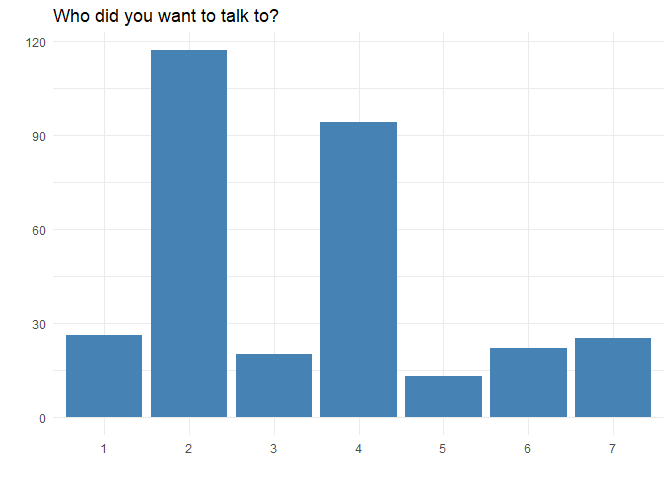<!-- -->


#### Missingness

**Missingness Descriptives**

Delivered / Answered = 214 / 214
Missing = 0
Min = 0, Max = 0, Mean = 0, SD = 0
(Descriptives are rounded to 2 decimals)

Missingness Intraclass Correlation (ICC) = NaN 


#### Screenshot


</div>


</div> <!-- Header section -->

<div class = "header-shading">

#### After experiencing this situation, I felt like I needed to talk to someone about it. <br>

<div style="font-weight: bold; color: #2a5caa; margin-top: -0.7em; margin-bottom: 1em;">
  <a href="#Item 4473-anchor"> [Item 4473] </a>
</div>


</div>


<!-- Body -->


<div class = "anchor">

<div id="Question 4113-anchor">
  <strong>Question ID</strong>: Question 4113
</div>

**Way the question was delivered:** Multiple Choice

**Type of data:** integer

</div> 
<div class = "anchor">


<button 
  onclick="let e = document.getElementById('Question 4113');
           let arrow = document.getElementById('Question 4113_arrow');
           e.style.display = e.style.display === 'none' ? 'block' : 'none';
           arrow.textContent = e.style.display === 'none' ? '▼' : '▲';"
  style="background: none; border: none; padding: 0; font-weight: bold; font-size: 18px; color: #2a5caa; cursor: pointer;">
Click to view visuals <span id="Question 4113_arrow">▼</span>
</button>

<div id="Question 4113" style="display: none;">


<!-- TOC-IGNORE-BEGIN -->

### Descriptives {.tabset}


#### Frequency Table

<table class="table" style="color: black; margin-left: auto; margin-right: auto;">
 <thead>
  <tr>
   <th style="text-align:left;"> Value </th>
   <th style="text-align:left;"> Label </th>
   <th style="text-align:left;"> Counts </th>
   <th style="text-align:left;"> Percentages </th>
  </tr>
 </thead>
<tbody>
  <tr>
   <td style="text-align:left;"> 1 </td>
   <td style="text-align:left;"> Yes </td>
   <td style="text-align:left;color: darkgreen !important;"> N = 178 </td>
   <td style="text-align:left;"> 14.8% </td>
  </tr>
  <tr>
   <td style="text-align:left;"> 2 </td>
   <td style="text-align:left;"> No </td>
   <td style="text-align:left;color: darkgreen !important;"> N = 1021 </td>
   <td style="text-align:left;"> 85.2% </td>
  </tr>
</tbody>
</table>


#### Barplot

<!-- -->


#### Missingness

**Missingness Descriptives**

Delivered / Answered = 1211 / 1199
Missing = 12
Min = 0, Max = 8, Mean = 0.09, SD = 0.72
(Descriptives are rounded to 2 decimals)

Missingness Intraclass Correlation (ICC) = 1.02 


#### Screenshot


</div>


</div> <!-- Header section -->

<div class = "header-shading">

#### End Block <br>

<div style="font-weight: bold; color: #2a5caa; margin-top: -0.7em; margin-bottom: 1em;">
  <a href="#Item 4474-anchor"> [Item 4474] </a>
</div>


</div>


<!-- Body -->


<div class = "anchor">

<div id="Question 4114-anchor">
  <strong>Question ID</strong>: Question 4114
</div>

**Way the question was delivered:** End Block

**Type of data:** NA

</div>  <!-- Header section -->

<div class = "header-shading">

#### Since your last survey did you let your parent know about... <br>

<div style="font-weight: bold; color: #2a5caa; margin-top: -0.7em; margin-bottom: 1em;">
  <a href="#Item 872-anchor"> [Item 872] </a>
</div>


</div>


<!-- Body -->


<div class = "anchor">

<div id="Question 4100-anchor">
  <strong>Question ID</strong>: Question 4100
</div>

**Way the question was delivered:** Multiple Select

**Type of data:** integer

</div> 
<div class = "anchor">


<button 
  onclick="let e = document.getElementById('Question 4100');
           let arrow = document.getElementById('Question 4100_arrow');
           e.style.display = e.style.display === 'none' ? 'block' : 'none';
           arrow.textContent = e.style.display === 'none' ? '▼' : '▲';"
  style="background: none; border: none; padding: 0; font-weight: bold; font-size: 18px; color: #2a5caa; cursor: pointer;">
Click to view visuals <span id="Question 4100_arrow">▼</span>
</button>

<div id="Question 4100" style="display: none;">


<!-- TOC-IGNORE-BEGIN -->

### Descriptives {.tabset}


#### Frequency Table

<table class="table" style="color: black; margin-left: auto; margin-right: auto;">
 <thead>
  <tr>
   <th style="text-align:left;"> Value </th>
   <th style="text-align:left;"> Label </th>
   <th style="text-align:left;"> Counts </th>
   <th style="text-align:left;"> Percentages </th>
  </tr>
 </thead>
<tbody>
  <tr>
   <td style="text-align:left;"> 1 </td>
   <td style="text-align:left;"> How you felt </td>
   <td style="text-align:left;color: darkgreen !important;"> N = 167 </td>
   <td style="text-align:left;"> 17.1% </td>
  </tr>
  <tr>
   <td style="text-align:left;"> 2 </td>
   <td style="text-align:left;"> A problem or challenge you had </td>
   <td style="text-align:left;color: darkgreen !important;"> N = 143 </td>
   <td style="text-align:left;"> 14.7% </td>
  </tr>
  <tr>
   <td style="text-align:left;"> 3 </td>
   <td style="text-align:left;"> A problem or challenge that someone else had </td>
   <td style="text-align:left;color: darkgreen !important;"> N = 37 </td>
   <td style="text-align:left;"> 3.8% </td>
  </tr>
  <tr>
   <td style="text-align:left;"> 4 </td>
   <td style="text-align:left;"> None apply </td>
   <td style="text-align:left;color: darkgreen !important;"> N = 627 </td>
   <td style="text-align:left;"> 64.4% </td>
  </tr>
</tbody>
</table>


#### Barplot

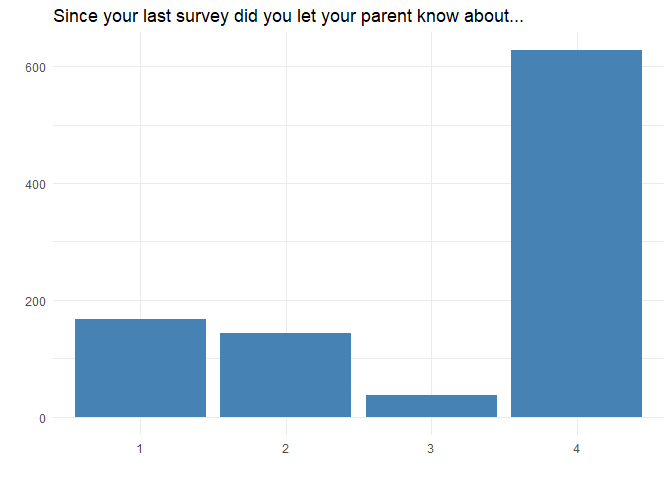<!-- -->


#### Missingness

**Missingness Descriptives**

Delivered / Answered = 861 / 857
Missing = 4
Min = 0, Max = 2, Mean = 0.03, SD = 0.21
(Descriptives are rounded to 2 decimals)

Missingness Intraclass Correlation (ICC) = 1.12 


#### Screenshot


</div>


</div> <!-- Header section -->

<div class = "header-shading">

#### Give you information, or ideas about how to make things better <br>

<div style="font-weight: bold; color: #2a5caa; margin-top: -0.7em; margin-bottom: 1em;">
  <a href="#Item 874-anchor"> [Item 874] </a>
</div>


</div>


<!-- Body -->


<div class = "anchor">

<div id="Question 5628-anchor">
  <strong>Question ID</strong>: Question 5628
</div>

**Way the question was delivered:** Slider

**Type of data:** numeric

</div> <div class = "anchor">


**Descriptives**
Min = 0, Max = 100, Mean = 43.55, SD = 33.27 


<button 
  onclick="let e = document.getElementById('Question 5628');
           let arrow = document.getElementById('Question 5628_arrow');
           e.style.display = e.style.display === 'none' ? 'block' : 'none';
           arrow.textContent = e.style.display === 'none' ? '▼' : '▲';"
  style="background: none; border: none; padding: 0; font-weight: bold; font-size: 18px; color: #2a5caa; cursor: pointer;">
Click to view visuals <span id="Question 5628_arrow">▼</span>
</button>

<div id="Question 5628" style="display: none;">


<!-- TOC-IGNORE-BEGIN -->

### Descriptives {.tabset}


#### Histogram

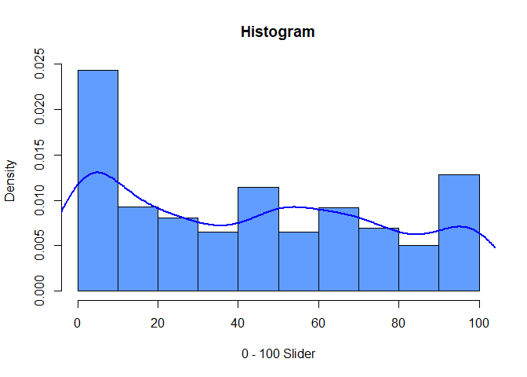<!-- -->


#### Missingness

**Missingness Descriptives**

Delivered / Answered = 715 / 709
Missing = 6
Min = 0, Max = 4, Mean = 0.05, SD = 0.4
(Descriptives are rounded to 2 decimals)

Missingness Intraclass Correlation (ICC) = 1.06 


#### Screenshot


</div>

</div> <!-- Header section -->

<div class = "header-shading">

#### Do something to help you (ex: pick you up, help with homework) <br>

<div style="font-weight: bold; color: #2a5caa; margin-top: -0.7em; margin-bottom: 1em;">
  <a href="#Item 875-anchor"> [Item 875] </a>
</div>


</div>


<!-- Body -->


<div class = "anchor">

<div id="Question 2285-anchor">
  <strong>Question ID</strong>: Question 2285
</div>

**Way the question was delivered:** Slider

**Type of data:** numeric

</div> <div class = "anchor">


**Descriptives**
Min = 0, Max = 100, Mean = 47.56, SD = 33.77 


<button 
  onclick="let e = document.getElementById('Question 2285');
           let arrow = document.getElementById('Question 2285_arrow');
           e.style.display = e.style.display === 'none' ? 'block' : 'none';
           arrow.textContent = e.style.display === 'none' ? '▼' : '▲';"
  style="background: none; border: none; padding: 0; font-weight: bold; font-size: 18px; color: #2a5caa; cursor: pointer;">
Click to view visuals <span id="Question 2285_arrow">▼</span>
</button>

<div id="Question 2285" style="display: none;">


<!-- TOC-IGNORE-BEGIN -->

### Descriptives {.tabset}


#### Histogram

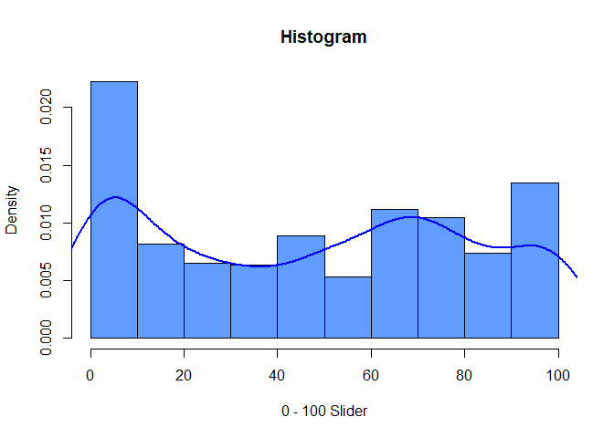<!-- -->


#### Missingness

**Missingness Descriptives**

Delivered / Answered = 884 / 878
Missing = 6
Min = 0, Max = 5, Mean = 0.04, SD = 0.43
(Descriptives are rounded to 2 decimals)

Missingness Intraclass Correlation (ICC) = 1.04 


#### Screenshot


</div>

</div> <!-- Header section -->

<div class = "header-shading">

#### Give you emotional support (ex: listen to and comfort you) <br>

<div style="font-weight: bold; color: #2a5caa; margin-top: -0.7em; margin-bottom: 1em;">
  <a href="#Item 879-anchor"> [Item 879] </a>
</div>


</div>


<!-- Body -->


<div class = "anchor">

<div id="Question 2283-anchor">
  <strong>Question ID</strong>: Question 2283
</div>

**Way the question was delivered:** Slider

**Type of data:** numeric

</div> <div class = "anchor">


**Descriptives**
Min = 0, Max = 100, Mean = 42.14, SD = 31.54 


<button 
  onclick="let e = document.getElementById('Question 2283');
           let arrow = document.getElementById('Question 2283_arrow');
           e.style.display = e.style.display === 'none' ? 'block' : 'none';
           arrow.textContent = e.style.display === 'none' ? '▼' : '▲';"
  style="background: none; border: none; padding: 0; font-weight: bold; font-size: 18px; color: #2a5caa; cursor: pointer;">
Click to view visuals <span id="Question 2283_arrow">▼</span>
</button>

<div id="Question 2283" style="display: none;">


<!-- TOC-IGNORE-BEGIN -->

### Descriptives {.tabset}


#### Histogram

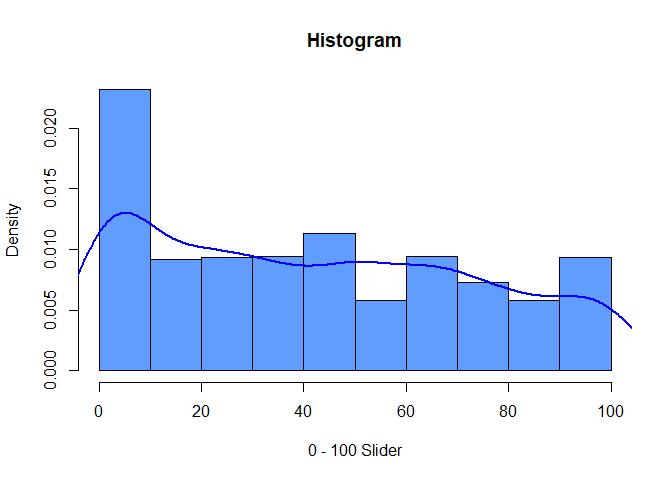<!-- -->


#### Missingness

**Missingness Descriptives**

Delivered / Answered = 886 / 881
Missing = 5
Min = 0, Max = 3, Mean = 0.03, SD = 0.28
(Descriptives are rounded to 2 decimals)

Missingness Intraclass Correlation (ICC) = 1.08 


#### Screenshot


</div>

</div> 
### Block: Item 1136 <!-- Header section -->

<div class = "header-shading">

#### Overall, how helpful was your parent? <br>

<div style="font-weight: bold; color: #2a5caa; margin-top: -0.7em; margin-bottom: 1em;">
  <a href="#Item 1143-anchor"> [Item 1143] </a>
</div>


</div>


<!-- Body -->


<div class = "anchor">

<div id="Question 2292-anchor">
  <strong>Question ID</strong>: Question 2292
</div>

**Way the question was delivered:** Slider

**Type of data:** numeric

</div> <div class = "anchor">


**Descriptives**
Min = 0, Max = 100, Mean = 70.87, SD = 22.96 


<button 
  onclick="let e = document.getElementById('Question 2292');
           let arrow = document.getElementById('Question 2292_arrow');
           e.style.display = e.style.display === 'none' ? 'block' : 'none';
           arrow.textContent = e.style.display === 'none' ? '▼' : '▲';"
  style="background: none; border: none; padding: 0; font-weight: bold; font-size: 18px; color: #2a5caa; cursor: pointer;">
Click to view visuals <span id="Question 2292_arrow">▼</span>
</button>

<div id="Question 2292" style="display: none;">


<!-- TOC-IGNORE-BEGIN -->

### Descriptives {.tabset}


#### Histogram

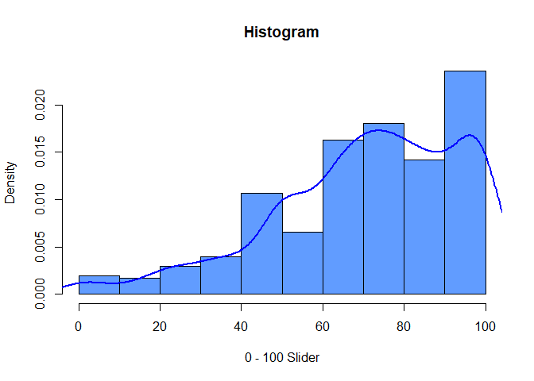<!-- -->


#### Missingness

**Missingness Descriptives**

Delivered / Answered = 880 / 879
Missing = 1
Min = 0, Max = 1, Mean = 0.01, SD = 0.08
(Descriptives are rounded to 2 decimals)

Missingness Intraclass Correlation (ICC) = 1.22 


#### Screenshot


</div>

</div> <!-- Header section -->

<div class = "header-shading">

#### How much did you want your parent to... <br>

<div style="font-weight: bold; color: #2a5caa; margin-top: -0.7em; margin-bottom: 1em;">
  <a href="#Item 1144-anchor"> [Item 1144] </a>
</div>


</div>


<!-- Body -->


<div class = "anchor">

<div id="Question 2282-anchor">
  <strong>Question ID</strong>: Question 2282
</div>

**Way the question was delivered:** Informational Fullscreen

**Type of data:** NA

</div> <div class = "anchor">


</div> <!-- Header section -->

<div class = "header-shading">

#### End Block <br>

<div style="font-weight: bold; color: #2a5caa; margin-top: -0.7em; margin-bottom: 1em;">
  <a href="#Item 1199-anchor"> [Item 1199] </a>
</div>


</div>


<!-- Body -->


<div class = "anchor">

<div id="Question 2276-anchor">
  <strong>Question ID</strong>: Question 2276
</div>

**Way the question was delivered:** End Block

**Type of data:** NA

</div>  
### Block: Item 1361 <!-- Header section -->

<div class = "header-shading">

#### Since your last survey, did you experience any stressful events at home, school or elsewhere? <br>

<div style="font-weight: bold; color: #2a5caa; margin-top: -0.7em; margin-bottom: 1em;">
  <a href="#Item 4463-anchor"> [Item 4463] </a>
</div>


</div>


<!-- Body -->


<div class = "anchor">

<div id="Question 4097-anchor">
  <strong>Question ID</strong>: Question 4097
</div>

**Way the question was delivered:** Multiple Choice

**Type of data:** integer

</div> 
<div class = "anchor">


<button 
  onclick="let e = document.getElementById('Question 4097');
           let arrow = document.getElementById('Question 4097_arrow');
           e.style.display = e.style.display === 'none' ? 'block' : 'none';
           arrow.textContent = e.style.display === 'none' ? '▼' : '▲';"
  style="background: none; border: none; padding: 0; font-weight: bold; font-size: 18px; color: #2a5caa; cursor: pointer;">
Click to view visuals <span id="Question 4097_arrow">▼</span>
</button>

<div id="Question 4097" style="display: none;">


<!-- TOC-IGNORE-BEGIN -->

### Descriptives {.tabset}


#### Frequency Table

<table class="table" style="color: black; margin-left: auto; margin-right: auto;">
 <thead>
  <tr>
   <th style="text-align:left;"> Value </th>
   <th style="text-align:left;"> Label </th>
   <th style="text-align:left;"> Counts </th>
   <th style="text-align:left;"> Percentages </th>
  </tr>
 </thead>
<tbody>
  <tr>
   <td style="text-align:left;"> 1 </td>
   <td style="text-align:left;"> Yes </td>
   <td style="text-align:left;color: darkgreen !important;"> N = 112 </td>
   <td style="text-align:left;"> 8.9% </td>
  </tr>
  <tr>
   <td style="text-align:left;"> 2 </td>
   <td style="text-align:left;"> No </td>
   <td style="text-align:left;color: darkgreen !important;"> N = 1144 </td>
   <td style="text-align:left;"> 91.1% </td>
  </tr>
</tbody>
</table>


#### Barplot

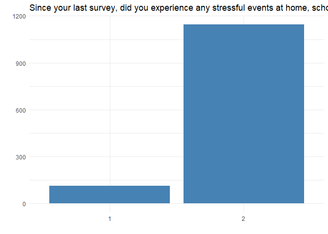<!-- -->


#### Missingness

**Missingness Descriptives**

Delivered / Answered = 1258 / 1256
Missing = 2
Min = 0, Max = 1, Mean = 0.01, SD = 0.12
(Descriptives are rounded to 2 decimals)

Missingness Intraclass Correlation (ICC) = 1.12 


#### Screenshot


</div>


</div> <!-- Header section -->

<div class = "header-shading">

#### Since your last survey, did you see or communicate with your parent? <br>

<div style="font-weight: bold; color: #2a5caa; margin-top: -0.7em; margin-bottom: 1em;">
  <a href="#Item 4464-anchor"> [Item 4464] </a>
</div>


</div>


<!-- Body -->


<div class = "anchor">

<div id="Question 4098-anchor">
  <strong>Question ID</strong>: Question 4098
</div>

**Way the question was delivered:** Multiple Choice

**Type of data:** integer

</div> 
<div class = "anchor">


<button 
  onclick="let e = document.getElementById('Question 4098');
           let arrow = document.getElementById('Question 4098_arrow');
           e.style.display = e.style.display === 'none' ? 'block' : 'none';
           arrow.textContent = e.style.display === 'none' ? '▼' : '▲';"
  style="background: none; border: none; padding: 0; font-weight: bold; font-size: 18px; color: #2a5caa; cursor: pointer;">
Click to view visuals <span id="Question 4098_arrow">▼</span>
</button>

<div id="Question 4098" style="display: none;">


<!-- TOC-IGNORE-BEGIN -->

### Descriptives {.tabset}


#### Frequency Table

<table class="table" style="color: black; margin-left: auto; margin-right: auto;">
 <thead>
  <tr>
   <th style="text-align:left;"> Value </th>
   <th style="text-align:left;"> Label </th>
   <th style="text-align:left;"> Counts </th>
   <th style="text-align:left;"> Percentages </th>
  </tr>
 </thead>
<tbody>
  <tr>
   <td style="text-align:left;"> 1 </td>
   <td style="text-align:left;"> Yes </td>
   <td style="text-align:left;color: darkgreen !important;"> N = 871 </td>
   <td style="text-align:left;"> 69.3% </td>
  </tr>
  <tr>
   <td style="text-align:left;"> 2 </td>
   <td style="text-align:left;"> No </td>
   <td style="text-align:left;color: darkgreen !important;"> N = 386 </td>
   <td style="text-align:left;"> 30.7% </td>
  </tr>
</tbody>
</table>


#### Barplot

<!-- -->


#### Missingness

**Missingness Descriptives**

Delivered / Answered = 1257 / 1257
Missing = 0
Min = 0, Max = 0, Mean = 0, SD = 0
(Descriptives are rounded to 2 decimals)

Missingness Intraclass Correlation (ICC) = NaN 


#### Screenshot


</div>


</div> 
### Block: Item 5539 <!-- Header section -->

<div class = "header-shading">

#### Did you have an argument or disagreement? <br>

<div style="font-weight: bold; color: #2a5caa; margin-top: -0.7em; margin-bottom: 1em;">
  <a href="#Item 1117-anchor"> [Item 1117] </a>
</div>


</div>


<!-- Body -->


<div class = "anchor">

<div id="Question 2269-anchor">
  <strong>Question ID</strong>: Question 2269
</div>

**Way the question was delivered:** Multiple Choice

**Type of data:** integer

</div> 
<div class = "anchor">


<button 
  onclick="let e = document.getElementById('Question 2269');
           let arrow = document.getElementById('Question 2269_arrow');
           e.style.display = e.style.display === 'none' ? 'block' : 'none';
           arrow.textContent = e.style.display === 'none' ? '▼' : '▲';"
  style="background: none; border: none; padding: 0; font-weight: bold; font-size: 18px; color: #2a5caa; cursor: pointer;">
Click to view visuals <span id="Question 2269_arrow">▼</span>
</button>

<div id="Question 2269" style="display: none;">


<!-- TOC-IGNORE-BEGIN -->

### Descriptives {.tabset}


<table class="table" style="color: black; margin-left: auto; margin-right: auto;">
 <thead>
  <tr>
   <th style="text-align:right;"> Value </th>
   <th style="text-align:left;"> Label </th>
   <th style="text-align:left;"> Counts </th>
   <th style="text-align:left;"> Percentages </th>
  </tr>
 </thead>
<tbody>
  <tr>
   <td style="text-align:right;"> 1 </td>
   <td style="text-align:left;"> Yes </td>
   <td style="text-align:left;color: darkgreen !important;"> N = 0 </td>
   <td style="text-align:left;"> 0% </td>
  </tr>
  <tr>
   <td style="text-align:right;"> 2 </td>
   <td style="text-align:left;"> No </td>
   <td style="text-align:left;color: darkgreen !important;"> N = 0 </td>
   <td style="text-align:left;"> 0% </td>
  </tr>
</tbody>
</table>


#### Missingness

**Missingness Descriptives**

Delivered / Answered = 0 / 0
Missing = 0
Min = NA, Max = NA, Mean = NA, SD = NA
(Descriptives are rounded to 2 decimals)

Missingness Intraclass Correlation (ICC) = NA 


#### Screenshot


</div>


</div> 
### Block: Item 1120 <!-- Header section -->

<div class = "header-shading">

#### Did you feel like you had a lot of demands placed on you that were stressful? (ex: had to do a chore; had too much homework)? <br>

<div style="font-weight: bold; color: #2a5caa; margin-top: -0.7em; margin-bottom: 1em;">
  <a href="#Item 1121-anchor"> [Item 1121] </a>
</div>


</div>


<!-- Body -->


<div class = "anchor">

<div id="Question 2270-anchor">
  <strong>Question ID</strong>: Question 2270
</div>

**Way the question was delivered:** Multiple Choice

**Type of data:** integer

</div> 
<div class = "anchor">


<button 
  onclick="let e = document.getElementById('Question 2270');
           let arrow = document.getElementById('Question 2270_arrow');
           e.style.display = e.style.display === 'none' ? 'block' : 'none';
           arrow.textContent = e.style.display === 'none' ? '▼' : '▲';"
  style="background: none; border: none; padding: 0; font-weight: bold; font-size: 18px; color: #2a5caa; cursor: pointer;">
Click to view visuals <span id="Question 2270_arrow">▼</span>
</button>

<div id="Question 2270" style="display: none;">


<!-- TOC-IGNORE-BEGIN -->

### Descriptives {.tabset}


<table class="table" style="color: black; margin-left: auto; margin-right: auto;">
 <thead>
  <tr>
   <th style="text-align:right;"> Value </th>
   <th style="text-align:left;"> Label </th>
   <th style="text-align:left;"> Counts </th>
   <th style="text-align:left;"> Percentages </th>
  </tr>
 </thead>
<tbody>
  <tr>
   <td style="text-align:right;"> 1 </td>
   <td style="text-align:left;"> Yes </td>
   <td style="text-align:left;color: darkgreen !important;"> N = 0 </td>
   <td style="text-align:left;"> 0% </td>
  </tr>
  <tr>
   <td style="text-align:right;"> 2 </td>
   <td style="text-align:left;"> No </td>
   <td style="text-align:left;color: darkgreen !important;"> N = 0 </td>
   <td style="text-align:left;"> 0% </td>
  </tr>
</tbody>
</table>


#### Missingness

**Missingness Descriptives**

Delivered / Answered = 0 / 0
Missing = 0
Min = NA, Max = NA, Mean = NA, SD = NA
(Descriptives are rounded to 2 decimals)

Missingness Intraclass Correlation (ICC) = NA 


#### Screenshot


</div>


</div> 
### Block: Item 1124 <!-- Header section -->

<div class = "header-shading">

#### Did you have some other problem or event that was stressful? (ex: forgot something; was late to an appointment)? <br>

<div style="font-weight: bold; color: #2a5caa; margin-top: -0.7em; margin-bottom: 1em;">
  <a href="#Item 1125-anchor"> [Item 1125] </a>
</div>


</div>


<!-- Body -->


<div class = "anchor">

<div id="Question 2271-anchor">
  <strong>Question ID</strong>: Question 2271
</div>

**Way the question was delivered:** Multiple Choice

**Type of data:** integer

</div> 
<div class = "anchor">


<button 
  onclick="let e = document.getElementById('Question 2271');
           let arrow = document.getElementById('Question 2271_arrow');
           e.style.display = e.style.display === 'none' ? 'block' : 'none';
           arrow.textContent = e.style.display === 'none' ? '▼' : '▲';"
  style="background: none; border: none; padding: 0; font-weight: bold; font-size: 18px; color: #2a5caa; cursor: pointer;">
Click to view visuals <span id="Question 2271_arrow">▼</span>
</button>

<div id="Question 2271" style="display: none;">


<!-- TOC-IGNORE-BEGIN -->

### Descriptives {.tabset}


<table class="table" style="color: black; margin-left: auto; margin-right: auto;">
 <thead>
  <tr>
   <th style="text-align:right;"> Value </th>
   <th style="text-align:left;"> Label </th>
   <th style="text-align:left;"> Counts </th>
   <th style="text-align:left;"> Percentages </th>
  </tr>
 </thead>
<tbody>
  <tr>
   <td style="text-align:right;"> 1 </td>
   <td style="text-align:left;"> Yes </td>
   <td style="text-align:left;color: darkgreen !important;"> N = 0 </td>
   <td style="text-align:left;"> 0% </td>
  </tr>
  <tr>
   <td style="text-align:right;"> 2 </td>
   <td style="text-align:left;"> No </td>
   <td style="text-align:left;color: darkgreen !important;"> N = 0 </td>
   <td style="text-align:left;"> 0% </td>
  </tr>
</tbody>
</table>


#### Missingness

**Missingness Descriptives**

Delivered / Answered = 0 / 0
Missing = 0
Min = NA, Max = NA, Mean = NA, SD = NA
(Descriptives are rounded to 2 decimals)

Missingness Intraclass Correlation (ICC) = NA 


#### Screenshot


</div>


</div> 
### Block: Item 1128 <!-- Header section -->

<div class = "header-shading">

#### Did someone else have a problem or event that turned out to be stressful for you? <br>

<div style="font-weight: bold; color: #2a5caa; margin-top: -0.7em; margin-bottom: 1em;">
  <a href="#Item 1129-anchor"> [Item 1129] </a>
</div>


</div>


<!-- Body -->


<div class = "anchor">

<div id="Question 2272-anchor">
  <strong>Question ID</strong>: Question 2272
</div>

**Way the question was delivered:** Multiple Choice

**Type of data:** integer

</div> 
<div class = "anchor">


<button 
  onclick="let e = document.getElementById('Question 2272');
           let arrow = document.getElementById('Question 2272_arrow');
           e.style.display = e.style.display === 'none' ? 'block' : 'none';
           arrow.textContent = e.style.display === 'none' ? '▼' : '▲';"
  style="background: none; border: none; padding: 0; font-weight: bold; font-size: 18px; color: #2a5caa; cursor: pointer;">
Click to view visuals <span id="Question 2272_arrow">▼</span>
</button>

<div id="Question 2272" style="display: none;">


<!-- TOC-IGNORE-BEGIN -->

### Descriptives {.tabset}


<table class="table" style="color: black; margin-left: auto; margin-right: auto;">
 <thead>
  <tr>
   <th style="text-align:right;"> Value </th>
   <th style="text-align:left;"> Label </th>
   <th style="text-align:left;"> Counts </th>
   <th style="text-align:left;"> Percentages </th>
  </tr>
 </thead>
<tbody>
  <tr>
   <td style="text-align:right;"> 1 </td>
   <td style="text-align:left;"> Yes </td>
   <td style="text-align:left;color: darkgreen !important;"> N = 0 </td>
   <td style="text-align:left;"> 0% </td>
  </tr>
  <tr>
   <td style="text-align:right;"> 2 </td>
   <td style="text-align:left;"> No </td>
   <td style="text-align:left;color: darkgreen !important;"> N = 0 </td>
   <td style="text-align:left;"> 0% </td>
  </tr>
</tbody>
</table>


#### Missingness

**Missingness Descriptives**

Delivered / Answered = 0 / 0
Missing = 0
Min = NA, Max = NA, Mean = NA, SD = NA
(Descriptives are rounded to 2 decimals)

Missingness Intraclass Correlation (ICC) = NA 


#### Screenshot


</div>


</div> 
### Block: Item 1132 <!-- Header section -->

<div class = "header-shading">

#### No Text <br>

<div style="font-weight: bold; color: #2a5caa; margin-top: -0.7em; margin-bottom: 1em;">
  <a href="#Item 1364-anchor"> [Item 1364] </a>
</div>


</div>


<!-- Body -->


<div class = "anchor">

<div id="Question 2301-anchor">
  <strong>Question ID</strong>: Question 2301
</div>

**Way the question was delivered:** End Block

**Type of data:** NA

</div>  <!-- Header section -->

<div class = "header-shading">

#### Did you ask your parent to <br>

<div style="font-weight: bold; color: #2a5caa; margin-top: -0.7em; margin-bottom: 1em;">
  <a href="#Item 5525-anchor"> [Item 5525] </a>
</div>


</div>


<!-- Body -->


<div class = "anchor">

<div id="Question 5647-anchor">
  <strong>Question ID</strong>: Question 5647
</div>

**Way the question was delivered:** Multiple Select

**Type of data:** integer

</div> 
<div class = "anchor">


<button 
  onclick="let e = document.getElementById('Question 5647');
           let arrow = document.getElementById('Question 5647_arrow');
           e.style.display = e.style.display === 'none' ? 'block' : 'none';
           arrow.textContent = e.style.display === 'none' ? '▼' : '▲';"
  style="background: none; border: none; padding: 0; font-weight: bold; font-size: 18px; color: #2a5caa; cursor: pointer;">
Click to view visuals <span id="Question 5647_arrow">▼</span>
</button>

<div id="Question 5647" style="display: none;">


<!-- TOC-IGNORE-BEGIN -->

### Descriptives {.tabset}


<table class="table" style="color: black; margin-left: auto; margin-right: auto;">
 <thead>
  <tr>
   <th style="text-align:right;"> Value </th>
   <th style="text-align:left;"> Label </th>
   <th style="text-align:left;"> Counts </th>
   <th style="text-align:left;"> Percentages </th>
  </tr>
 </thead>
<tbody>
  <tr>
   <td style="text-align:right;"> 1 </td>
   <td style="text-align:left;"> Give you emotional support </td>
   <td style="text-align:left;color: darkgreen !important;"> N = 0 </td>
   <td style="text-align:left;"> 0% </td>
  </tr>
  <tr>
   <td style="text-align:right;"> 2 </td>
   <td style="text-align:left;"> Listen to you when you speak </td>
   <td style="text-align:left;color: darkgreen !important;"> N = 0 </td>
   <td style="text-align:left;"> 0% </td>
  </tr>
  <tr>
   <td style="text-align:right;"> 3 </td>
   <td style="text-align:left;"> Show that she understands or tell you about a similar situation </td>
   <td style="text-align:left;color: darkgreen !important;"> N = 0 </td>
   <td style="text-align:left;"> 0% </td>
  </tr>
  <tr>
   <td style="text-align:right;"> 4 </td>
   <td style="text-align:left;"> Give you information and ideas about how to make things better </td>
   <td style="text-align:left;color: darkgreen !important;"> N = 0 </td>
   <td style="text-align:left;"> 0% </td>
  </tr>
  <tr>
   <td style="text-align:right;"> 5 </td>
   <td style="text-align:left;"> Give you advice about what to do </td>
   <td style="text-align:left;color: darkgreen !important;"> N = 0 </td>
   <td style="text-align:left;"> 0% </td>
  </tr>
  <tr>
   <td style="text-align:right;"> 6 </td>
   <td style="text-align:left;"> Think about the situation with you and tell you what you can do about it </td>
   <td style="text-align:left;color: darkgreen !important;"> N = 0 </td>
   <td style="text-align:left;"> 0% </td>
  </tr>
  <tr>
   <td style="text-align:right;"> 7 </td>
   <td style="text-align:left;"> Do something to help you </td>
   <td style="text-align:left;color: darkgreen !important;"> N = 0 </td>
   <td style="text-align:left;"> 0% </td>
  </tr>
  <tr>
   <td style="text-align:right;"> 8 </td>
   <td style="text-align:left;"> Offer to do something to help you </td>
   <td style="text-align:left;color: darkgreen !important;"> N = 0 </td>
   <td style="text-align:left;"> 0% </td>
  </tr>
  <tr>
   <td style="text-align:right;"> 9 </td>
   <td style="text-align:left;"> None apply </td>
   <td style="text-align:left;color: darkgreen !important;"> N = 0 </td>
   <td style="text-align:left;"> 0% </td>
  </tr>
</tbody>
</table>


#### Missingness

**Missingness Descriptives**

Delivered / Answered = 0 / 0
Missing = 0
Min = NA, Max = NA, Mean = NA, SD = NA
(Descriptives are rounded to 2 decimals)

Missingness Intraclass Correlation (ICC) = NA 


#### Screenshot


</div>


</div> <!-- Header section -->

<div class = "header-shading">

#### Please describe how you asked (ex: directly asking is when you use your words to say what you would like your parents to do; indirectly asking is when you hint at something and hope your parent understands) <br>

<div style="font-weight: bold; color: #2a5caa; margin-top: -0.7em; margin-bottom: 1em;">
  <a href="#Item 5526-anchor"> [Item 5526] </a>
</div>


</div>


<!-- Body -->


<div class = "anchor">

<div id="Question 5648-anchor">
  <strong>Question ID</strong>: Question 5648
</div>

**Way the question was delivered:** Slider

**Type of data:** numeric

</div> <div class = "anchor">


**Descriptives**
Min = NA, Max = NA, Mean = NA, SD = NA 


<button 
  onclick="let e = document.getElementById('Question 5648');
           let arrow = document.getElementById('Question 5648_arrow');
           e.style.display = e.style.display === 'none' ? 'block' : 'none';
           arrow.textContent = e.style.display === 'none' ? '▼' : '▲';"
  style="background: none; border: none; padding: 0; font-weight: bold; font-size: 18px; color: #2a5caa; cursor: pointer;">
Click to view visuals <span id="Question 5648_arrow">▼</span>
</button>

<div id="Question 5648" style="display: none;">


<!-- TOC-IGNORE-BEGIN -->

### Descriptives {.tabset}


#### Missingness

**Missingness Descriptives**

Delivered / Answered = 0 / 0
Missing = 0
Min = NA, Max = NA, Mean = NA, SD = NA
(Descriptives are rounded to 2 decimals)

Missingness Intraclass Correlation (ICC) = NA 


#### Screenshot


</div>

</div> <!-- Header section -->

<div class = "header-shading">

#### Check all that she did: <br>

<div style="font-weight: bold; color: #2a5caa; margin-top: -0.7em; margin-bottom: 1em;">
  <a href="#Item 5527-anchor"> [Item 5527] </a>
</div>


</div>


<!-- Body -->


<div class = "anchor">

<div id="Question 5649-anchor">
  <strong>Question ID</strong>: Question 5649
</div>

**Way the question was delivered:** Multiple Select

**Type of data:** integer

</div> 
<div class = "anchor">


<button 
  onclick="let e = document.getElementById('Question 5649');
           let arrow = document.getElementById('Question 5649_arrow');
           e.style.display = e.style.display === 'none' ? 'block' : 'none';
           arrow.textContent = e.style.display === 'none' ? '▼' : '▲';"
  style="background: none; border: none; padding: 0; font-weight: bold; font-size: 18px; color: #2a5caa; cursor: pointer;">
Click to view visuals <span id="Question 5649_arrow">▼</span>
</button>

<div id="Question 5649" style="display: none;">


<!-- TOC-IGNORE-BEGIN -->

### Descriptives {.tabset}


<table class="table" style="color: black; margin-left: auto; margin-right: auto;">
 <thead>
  <tr>
   <th style="text-align:right;"> Value </th>
   <th style="text-align:left;"> Label </th>
   <th style="text-align:left;"> Counts </th>
   <th style="text-align:left;"> Percentages </th>
  </tr>
 </thead>
<tbody>
  <tr>
   <td style="text-align:right;"> 1 </td>
   <td style="text-align:left;"> Give you emotional support </td>
   <td style="text-align:left;color: darkgreen !important;"> N = 0 </td>
   <td style="text-align:left;"> 0% </td>
  </tr>
  <tr>
   <td style="text-align:right;"> 2 </td>
   <td style="text-align:left;"> Listen to you when you speak </td>
   <td style="text-align:left;color: darkgreen !important;"> N = 0 </td>
   <td style="text-align:left;"> 0% </td>
  </tr>
  <tr>
   <td style="text-align:right;"> 3 </td>
   <td style="text-align:left;"> Show that she understands or tell you about a similar situation </td>
   <td style="text-align:left;color: darkgreen !important;"> N = 0 </td>
   <td style="text-align:left;"> 0% </td>
  </tr>
  <tr>
   <td style="text-align:right;"> 4 </td>
   <td style="text-align:left;"> Give you information and ideas about how to make things better </td>
   <td style="text-align:left;color: darkgreen !important;"> N = 0 </td>
   <td style="text-align:left;"> 0% </td>
  </tr>
  <tr>
   <td style="text-align:right;"> 5 </td>
   <td style="text-align:left;"> Give you advice about what to do </td>
   <td style="text-align:left;color: darkgreen !important;"> N = 0 </td>
   <td style="text-align:left;"> 0% </td>
  </tr>
  <tr>
   <td style="text-align:right;"> 6 </td>
   <td style="text-align:left;"> Think about the situation with you and tell you what you can do about it </td>
   <td style="text-align:left;color: darkgreen !important;"> N = 0 </td>
   <td style="text-align:left;"> 0% </td>
  </tr>
  <tr>
   <td style="text-align:right;"> 7 </td>
   <td style="text-align:left;"> Do something to help you </td>
   <td style="text-align:left;color: darkgreen !important;"> N = 0 </td>
   <td style="text-align:left;"> 0% </td>
  </tr>
  <tr>
   <td style="text-align:right;"> 8 </td>
   <td style="text-align:left;"> Offer to do something to help you </td>
   <td style="text-align:left;color: darkgreen !important;"> N = 0 </td>
   <td style="text-align:left;"> 0% </td>
  </tr>
  <tr>
   <td style="text-align:right;"> 9 </td>
   <td style="text-align:left;"> None apply </td>
   <td style="text-align:left;color: darkgreen !important;"> N = 0 </td>
   <td style="text-align:left;"> 0% </td>
  </tr>
</tbody>
</table>


#### Missingness

**Missingness Descriptives**

Delivered / Answered = 0 / 0
Missing = 0
Min = NA, Max = NA, Mean = NA, SD = NA
(Descriptives are rounded to 2 decimals)

Missingness Intraclass Correlation (ICC) = NA 


#### Screenshot


</div>


</div> <!-- Header section -->

<div class = "header-shading">

#### Please tell us about the interaction you had with your mom: <br>

<div style="font-weight: bold; color: #2a5caa; margin-top: -0.7em; margin-bottom: 1em;">
  <a href="#Item 5528-anchor"> [Item 5528] </a>
</div>


</div>


<!-- Body -->


<div class = "anchor">

<div id="Question 5650-anchor">
  <strong>Question ID</strong>: Question 5650
</div>

**Way the question was delivered:** Informational Fullscreen

**Type of data:** NA

</div> <div class = "anchor">


</div> <!-- Header section -->

<div class = "header-shading">

#### I think that the interaction was high quality <br>

<div style="font-weight: bold; color: #2a5caa; margin-top: -0.7em; margin-bottom: 1em;">
  <a href="#Item 5529-anchor"> [Item 5529] </a>
</div>


</div>


<!-- Body -->


<div class = "anchor">

<div id="Question 5728-anchor">
  <strong>Question ID</strong>: Question 5728
</div>

**Way the question was delivered:** Multiple Choice

**Type of data:** integer

</div> 
<div class = "anchor">


<button 
  onclick="let e = document.getElementById('Question 5728');
           let arrow = document.getElementById('Question 5728_arrow');
           e.style.display = e.style.display === 'none' ? 'block' : 'none';
           arrow.textContent = e.style.display === 'none' ? '▼' : '▲';"
  style="background: none; border: none; padding: 0; font-weight: bold; font-size: 18px; color: #2a5caa; cursor: pointer;">
Click to view visuals <span id="Question 5728_arrow">▼</span>
</button>

<div id="Question 5728" style="display: none;">


<!-- TOC-IGNORE-BEGIN -->

### Descriptives {.tabset}


<table class="table" style="color: black; margin-left: auto; margin-right: auto;">
 <thead>
  <tr>
   <th style="text-align:right;"> Value </th>
   <th style="text-align:left;"> Label </th>
   <th style="text-align:left;"> Counts </th>
   <th style="text-align:left;"> Percentages </th>
  </tr>
 </thead>
<tbody>
  <tr>
   <td style="text-align:right;"> 1 </td>
   <td style="text-align:left;"> Strongly disagree </td>
   <td style="text-align:left;color: darkgreen !important;"> N = 0 </td>
   <td style="text-align:left;"> 0% </td>
  </tr>
  <tr>
   <td style="text-align:right;"> 2 </td>
   <td style="text-align:left;"> Disagree </td>
   <td style="text-align:left;color: darkgreen !important;"> N = 0 </td>
   <td style="text-align:left;"> 0% </td>
  </tr>
  <tr>
   <td style="text-align:right;"> 3 </td>
   <td style="text-align:left;"> Agree some and disagree some </td>
   <td style="text-align:left;color: darkgreen !important;"> N = 0 </td>
   <td style="text-align:left;"> 0% </td>
  </tr>
  <tr>
   <td style="text-align:right;"> 4 </td>
   <td style="text-align:left;"> Agree </td>
   <td style="text-align:left;color: darkgreen !important;"> N = 0 </td>
   <td style="text-align:left;"> 0% </td>
  </tr>
  <tr>
   <td style="text-align:right;"> 5 </td>
   <td style="text-align:left;"> Strongly agree </td>
   <td style="text-align:left;color: darkgreen !important;"> N = 0 </td>
   <td style="text-align:left;"> 0% </td>
  </tr>
</tbody>
</table>


#### Missingness

**Missingness Descriptives**

Delivered / Answered = 0 / 0
Missing = 0
Min = NA, Max = NA, Mean = NA, SD = NA
(Descriptives are rounded to 2 decimals)

Missingness Intraclass Correlation (ICC) = NA 


#### Screenshot


</div>


</div> <!-- Header section -->

<div class = "header-shading">

#### The interaction was good <br>

<div style="font-weight: bold; color: #2a5caa; margin-top: -0.7em; margin-bottom: 1em;">
  <a href="#Item 5530-anchor"> [Item 5530] </a>
</div>


</div>


<!-- Body -->


<div class = "anchor">

<div id="Question 5729-anchor">
  <strong>Question ID</strong>: Question 5729
</div>

**Way the question was delivered:** Multiple Choice

**Type of data:** integer

</div> 
<div class = "anchor">


<button 
  onclick="let e = document.getElementById('Question 5729');
           let arrow = document.getElementById('Question 5729_arrow');
           e.style.display = e.style.display === 'none' ? 'block' : 'none';
           arrow.textContent = e.style.display === 'none' ? '▼' : '▲';"
  style="background: none; border: none; padding: 0; font-weight: bold; font-size: 18px; color: #2a5caa; cursor: pointer;">
Click to view visuals <span id="Question 5729_arrow">▼</span>
</button>

<div id="Question 5729" style="display: none;">


<!-- TOC-IGNORE-BEGIN -->

### Descriptives {.tabset}


<table class="table" style="color: black; margin-left: auto; margin-right: auto;">
 <thead>
  <tr>
   <th style="text-align:right;"> Value </th>
   <th style="text-align:left;"> Label </th>
   <th style="text-align:left;"> Counts </th>
   <th style="text-align:left;"> Percentages </th>
  </tr>
 </thead>
<tbody>
  <tr>
   <td style="text-align:right;"> 1 </td>
   <td style="text-align:left;"> Strongly disagree </td>
   <td style="text-align:left;color: darkgreen !important;"> N = 0 </td>
   <td style="text-align:left;"> 0% </td>
  </tr>
  <tr>
   <td style="text-align:right;"> 2 </td>
   <td style="text-align:left;"> Disagree </td>
   <td style="text-align:left;color: darkgreen !important;"> N = 0 </td>
   <td style="text-align:left;"> 0% </td>
  </tr>
  <tr>
   <td style="text-align:right;"> 3 </td>
   <td style="text-align:left;"> Agree some and disagree some </td>
   <td style="text-align:left;color: darkgreen !important;"> N = 0 </td>
   <td style="text-align:left;"> 0% </td>
  </tr>
  <tr>
   <td style="text-align:right;"> 4 </td>
   <td style="text-align:left;"> Agree </td>
   <td style="text-align:left;color: darkgreen !important;"> N = 0 </td>
   <td style="text-align:left;"> 0% </td>
  </tr>
  <tr>
   <td style="text-align:right;"> 5 </td>
   <td style="text-align:left;"> Strongly agree </td>
   <td style="text-align:left;color: darkgreen !important;"> N = 0 </td>
   <td style="text-align:left;"> 0% </td>
  </tr>
</tbody>
</table>


#### Missingness

**Missingness Descriptives**

Delivered / Answered = 0 / 0
Missing = 0
Min = NA, Max = NA, Mean = NA, SD = NA
(Descriptives are rounded to 2 decimals)

Missingness Intraclass Correlation (ICC) = NA 


#### Screenshot


</div>


</div> <!-- Header section -->

<div class = "header-shading">

#### I feel supported <br>

<div style="font-weight: bold; color: #2a5caa; margin-top: -0.7em; margin-bottom: 1em;">
  <a href="#Item 5531-anchor"> [Item 5531] </a>
</div>


</div>


<!-- Body -->


<div class = "anchor">

<div id="Question 5653-anchor">
  <strong>Question ID</strong>: Question 5653
</div>

**Way the question was delivered:** Multiple Choice

**Type of data:** integer

</div> 
<div class = "anchor">


<button 
  onclick="let e = document.getElementById('Question 5653');
           let arrow = document.getElementById('Question 5653_arrow');
           e.style.display = e.style.display === 'none' ? 'block' : 'none';
           arrow.textContent = e.style.display === 'none' ? '▼' : '▲';"
  style="background: none; border: none; padding: 0; font-weight: bold; font-size: 18px; color: #2a5caa; cursor: pointer;">
Click to view visuals <span id="Question 5653_arrow">▼</span>
</button>

<div id="Question 5653" style="display: none;">


<!-- TOC-IGNORE-BEGIN -->

### Descriptives {.tabset}


<table class="table" style="color: black; margin-left: auto; margin-right: auto;">
 <thead>
  <tr>
   <th style="text-align:right;"> Value </th>
   <th style="text-align:left;"> Label </th>
   <th style="text-align:left;"> Counts </th>
   <th style="text-align:left;"> Percentages </th>
  </tr>
 </thead>
<tbody>
  <tr>
   <td style="text-align:right;"> 1 </td>
   <td style="text-align:left;"> Strongly disagree </td>
   <td style="text-align:left;color: darkgreen !important;"> N = 0 </td>
   <td style="text-align:left;"> 0% </td>
  </tr>
  <tr>
   <td style="text-align:right;"> 2 </td>
   <td style="text-align:left;"> Disagree </td>
   <td style="text-align:left;color: darkgreen !important;"> N = 0 </td>
   <td style="text-align:left;"> 0% </td>
  </tr>
  <tr>
   <td style="text-align:right;"> 3 </td>
   <td style="text-align:left;"> Agree some and disagree some </td>
   <td style="text-align:left;color: darkgreen !important;"> N = 0 </td>
   <td style="text-align:left;"> 0% </td>
  </tr>
  <tr>
   <td style="text-align:right;"> 4 </td>
   <td style="text-align:left;"> Agree </td>
   <td style="text-align:left;color: darkgreen !important;"> N = 0 </td>
   <td style="text-align:left;"> 0% </td>
  </tr>
  <tr>
   <td style="text-align:right;"> 5 </td>
   <td style="text-align:left;"> Strongly agree </td>
   <td style="text-align:left;color: darkgreen !important;"> N = 0 </td>
   <td style="text-align:left;"> 0% </td>
  </tr>
</tbody>
</table>


#### Missingness

**Missingness Descriptives**

Delivered / Answered = 0 / 0
Missing = 0
Min = NA, Max = NA, Mean = NA, SD = NA
(Descriptives are rounded to 2 decimals)

Missingness Intraclass Correlation (ICC) = NA 


#### Screenshot


</div>


</div> <!-- Header section -->

<div class = "header-shading">

#### That was an excellent supportive interaction <br>

<div style="font-weight: bold; color: #2a5caa; margin-top: -0.7em; margin-bottom: 1em;">
  <a href="#Item 5532-anchor"> [Item 5532] </a>
</div>


</div>


<!-- Body -->


<div class = "anchor">

<div id="Question 5730-anchor">
  <strong>Question ID</strong>: Question 5730
</div>

**Way the question was delivered:** Multiple Choice

**Type of data:** integer

</div> 
<div class = "anchor">


<button 
  onclick="let e = document.getElementById('Question 5730');
           let arrow = document.getElementById('Question 5730_arrow');
           e.style.display = e.style.display === 'none' ? 'block' : 'none';
           arrow.textContent = e.style.display === 'none' ? '▼' : '▲';"
  style="background: none; border: none; padding: 0; font-weight: bold; font-size: 18px; color: #2a5caa; cursor: pointer;">
Click to view visuals <span id="Question 5730_arrow">▼</span>
</button>

<div id="Question 5730" style="display: none;">


<!-- TOC-IGNORE-BEGIN -->

### Descriptives {.tabset}


<table class="table" style="color: black; margin-left: auto; margin-right: auto;">
 <thead>
  <tr>
   <th style="text-align:right;"> Value </th>
   <th style="text-align:left;"> Label </th>
   <th style="text-align:left;"> Counts </th>
   <th style="text-align:left;"> Percentages </th>
  </tr>
 </thead>
<tbody>
  <tr>
   <td style="text-align:right;"> 1 </td>
   <td style="text-align:left;"> Strongly disagree </td>
   <td style="text-align:left;color: darkgreen !important;"> N = 0 </td>
   <td style="text-align:left;"> 0% </td>
  </tr>
  <tr>
   <td style="text-align:right;"> 2 </td>
   <td style="text-align:left;"> Disagree </td>
   <td style="text-align:left;color: darkgreen !important;"> N = 0 </td>
   <td style="text-align:left;"> 0% </td>
  </tr>
  <tr>
   <td style="text-align:right;"> 3 </td>
   <td style="text-align:left;"> Agree some and disagree some </td>
   <td style="text-align:left;color: darkgreen !important;"> N = 0 </td>
   <td style="text-align:left;"> 0% </td>
  </tr>
  <tr>
   <td style="text-align:right;"> 4 </td>
   <td style="text-align:left;"> Agree </td>
   <td style="text-align:left;color: darkgreen !important;"> N = 0 </td>
   <td style="text-align:left;"> 0% </td>
  </tr>
  <tr>
   <td style="text-align:right;"> 5 </td>
   <td style="text-align:left;"> Strongly agree </td>
   <td style="text-align:left;color: darkgreen !important;"> N = 0 </td>
   <td style="text-align:left;"> 0% </td>
  </tr>
</tbody>
</table>


#### Missingness

**Missingness Descriptives**

Delivered / Answered = 0 / 0
Missing = 0
Min = NA, Max = NA, Mean = NA, SD = NA
(Descriptives are rounded to 2 decimals)

Missingness Intraclass Correlation (ICC) = NA 


#### Screenshot


</div>


</div> <!-- Header section -->

<div class = "header-shading">

#### The interaction made me feel better <br>

<div style="font-weight: bold; color: #2a5caa; margin-top: -0.7em; margin-bottom: 1em;">
  <a href="#Item 5533-anchor"> [Item 5533] </a>
</div>


</div>


<!-- Body -->


<div class = "anchor">

<div id="Question 5731-anchor">
  <strong>Question ID</strong>: Question 5731
</div>

**Way the question was delivered:** Multiple Choice

**Type of data:** integer

</div> 
<div class = "anchor">


<button 
  onclick="let e = document.getElementById('Question 5731');
           let arrow = document.getElementById('Question 5731_arrow');
           e.style.display = e.style.display === 'none' ? 'block' : 'none';
           arrow.textContent = e.style.display === 'none' ? '▼' : '▲';"
  style="background: none; border: none; padding: 0; font-weight: bold; font-size: 18px; color: #2a5caa; cursor: pointer;">
Click to view visuals <span id="Question 5731_arrow">▼</span>
</button>

<div id="Question 5731" style="display: none;">


<!-- TOC-IGNORE-BEGIN -->

### Descriptives {.tabset}


<table class="table" style="color: black; margin-left: auto; margin-right: auto;">
 <thead>
  <tr>
   <th style="text-align:right;"> Value </th>
   <th style="text-align:left;"> Label </th>
   <th style="text-align:left;"> Counts </th>
   <th style="text-align:left;"> Percentages </th>
  </tr>
 </thead>
<tbody>
  <tr>
   <td style="text-align:right;"> 1 </td>
   <td style="text-align:left;"> Strongly disagree </td>
   <td style="text-align:left;color: darkgreen !important;"> N = 0 </td>
   <td style="text-align:left;"> 0% </td>
  </tr>
  <tr>
   <td style="text-align:right;"> 2 </td>
   <td style="text-align:left;"> Disagree </td>
   <td style="text-align:left;color: darkgreen !important;"> N = 0 </td>
   <td style="text-align:left;"> 0% </td>
  </tr>
  <tr>
   <td style="text-align:right;"> 3 </td>
   <td style="text-align:left;"> Agree some and disagree some </td>
   <td style="text-align:left;color: darkgreen !important;"> N = 0 </td>
   <td style="text-align:left;"> 0% </td>
  </tr>
  <tr>
   <td style="text-align:right;"> 4 </td>
   <td style="text-align:left;"> Agree </td>
   <td style="text-align:left;color: darkgreen !important;"> N = 0 </td>
   <td style="text-align:left;"> 0% </td>
  </tr>
  <tr>
   <td style="text-align:right;"> 5 </td>
   <td style="text-align:left;"> Strongly agree </td>
   <td style="text-align:left;color: darkgreen !important;"> N = 0 </td>
   <td style="text-align:left;"> 0% </td>
  </tr>
</tbody>
</table>


#### Missingness

**Missingness Descriptives**

Delivered / Answered = 0 / 0
Missing = 0
Min = NA, Max = NA, Mean = NA, SD = NA
(Descriptives are rounded to 2 decimals)

Missingness Intraclass Correlation (ICC) = NA 


#### Screenshot


</div>


</div> <!-- Header section -->

<div class = "header-shading">

#### The interaction made me feel supported <br>

<div style="font-weight: bold; color: #2a5caa; margin-top: -0.7em; margin-bottom: 1em;">
  <a href="#Item 5534-anchor"> [Item 5534] </a>
</div>


</div>


<!-- Body -->


<div class = "anchor">

<div id="Question 5732-anchor">
  <strong>Question ID</strong>: Question 5732
</div>

**Way the question was delivered:** Multiple Choice

**Type of data:** integer

</div> 
<div class = "anchor">


<button 
  onclick="let e = document.getElementById('Question 5732');
           let arrow = document.getElementById('Question 5732_arrow');
           e.style.display = e.style.display === 'none' ? 'block' : 'none';
           arrow.textContent = e.style.display === 'none' ? '▼' : '▲';"
  style="background: none; border: none; padding: 0; font-weight: bold; font-size: 18px; color: #2a5caa; cursor: pointer;">
Click to view visuals <span id="Question 5732_arrow">▼</span>
</button>

<div id="Question 5732" style="display: none;">


<!-- TOC-IGNORE-BEGIN -->

### Descriptives {.tabset}


<table class="table" style="color: black; margin-left: auto; margin-right: auto;">
 <thead>
  <tr>
   <th style="text-align:right;"> Value </th>
   <th style="text-align:left;"> Label </th>
   <th style="text-align:left;"> Counts </th>
   <th style="text-align:left;"> Percentages </th>
  </tr>
 </thead>
<tbody>
  <tr>
   <td style="text-align:right;"> 1 </td>
   <td style="text-align:left;"> Strongly disagree </td>
   <td style="text-align:left;color: darkgreen !important;"> N = 0 </td>
   <td style="text-align:left;"> 0% </td>
  </tr>
  <tr>
   <td style="text-align:right;"> 2 </td>
   <td style="text-align:left;"> Disagree </td>
   <td style="text-align:left;color: darkgreen !important;"> N = 0 </td>
   <td style="text-align:left;"> 0% </td>
  </tr>
  <tr>
   <td style="text-align:right;"> 3 </td>
   <td style="text-align:left;"> Agree some and disagree some </td>
   <td style="text-align:left;color: darkgreen !important;"> N = 0 </td>
   <td style="text-align:left;"> 0% </td>
  </tr>
  <tr>
   <td style="text-align:right;"> 4 </td>
   <td style="text-align:left;"> Agree </td>
   <td style="text-align:left;color: darkgreen !important;"> N = 0 </td>
   <td style="text-align:left;"> 0% </td>
  </tr>
  <tr>
   <td style="text-align:right;"> 5 </td>
   <td style="text-align:left;"> Strongly agree </td>
   <td style="text-align:left;color: darkgreen !important;"> N = 0 </td>
   <td style="text-align:left;"> 0% </td>
  </tr>
</tbody>
</table>


#### Missingness

**Missingness Descriptives**

Delivered / Answered = 0 / 0
Missing = 0
Min = NA, Max = NA, Mean = NA, SD = NA
(Descriptives are rounded to 2 decimals)

Missingness Intraclass Correlation (ICC) = NA 


#### Screenshot


</div>


</div> <!-- Header section -->

<div class = "header-shading">

#### I dont feel better after the interaction <br>

<div style="font-weight: bold; color: #2a5caa; margin-top: -0.7em; margin-bottom: 1em;">
  <a href="#Item 5535-anchor"> [Item 5535] </a>
</div>


</div>


<!-- Body -->


<div class = "anchor">

<div id="Question 5657-anchor">
  <strong>Question ID</strong>: Question 5657
</div>

**Way the question was delivered:** Multiple Choice

**Type of data:** integer

</div> 
<div class = "anchor">


<button 
  onclick="let e = document.getElementById('Question 5657');
           let arrow = document.getElementById('Question 5657_arrow');
           e.style.display = e.style.display === 'none' ? 'block' : 'none';
           arrow.textContent = e.style.display === 'none' ? '▼' : '▲';"
  style="background: none; border: none; padding: 0; font-weight: bold; font-size: 18px; color: #2a5caa; cursor: pointer;">
Click to view visuals <span id="Question 5657_arrow">▼</span>
</button>

<div id="Question 5657" style="display: none;">


<!-- TOC-IGNORE-BEGIN -->

### Descriptives {.tabset}


<table class="table" style="color: black; margin-left: auto; margin-right: auto;">
 <thead>
  <tr>
   <th style="text-align:right;"> Value </th>
   <th style="text-align:left;"> Label </th>
   <th style="text-align:left;"> Counts </th>
   <th style="text-align:left;"> Percentages </th>
  </tr>
 </thead>
<tbody>
  <tr>
   <td style="text-align:right;"> 1 </td>
   <td style="text-align:left;"> Strongly disagree </td>
   <td style="text-align:left;color: darkgreen !important;"> N = 0 </td>
   <td style="text-align:left;"> 0% </td>
  </tr>
  <tr>
   <td style="text-align:right;"> 2 </td>
   <td style="text-align:left;"> Disagree </td>
   <td style="text-align:left;color: darkgreen !important;"> N = 0 </td>
   <td style="text-align:left;"> 0% </td>
  </tr>
  <tr>
   <td style="text-align:right;"> 3 </td>
   <td style="text-align:left;"> Agree some and disagree some </td>
   <td style="text-align:left;color: darkgreen !important;"> N = 0 </td>
   <td style="text-align:left;"> 0% </td>
  </tr>
  <tr>
   <td style="text-align:right;"> 4 </td>
   <td style="text-align:left;"> Agree </td>
   <td style="text-align:left;color: darkgreen !important;"> N = 0 </td>
   <td style="text-align:left;"> 0% </td>
  </tr>
  <tr>
   <td style="text-align:right;"> 5 </td>
   <td style="text-align:left;"> Strongly agree </td>
   <td style="text-align:left;color: darkgreen !important;"> N = 0 </td>
   <td style="text-align:left;"> 0% </td>
  </tr>
</tbody>
</table>


#### Missingness

**Missingness Descriptives**

Delivered / Answered = 0 / 0
Missing = 0
Min = NA, Max = NA, Mean = NA, SD = NA
(Descriptives are rounded to 2 decimals)

Missingness Intraclass Correlation (ICC) = NA 


#### Screenshot


</div>


</div> <!-- Header section -->

<div class = "header-shading">

#### The interaction made me feel worse <br>

<div style="font-weight: bold; color: #2a5caa; margin-top: -0.7em; margin-bottom: 1em;">
  <a href="#Item 5536-anchor"> [Item 5536] </a>
</div>


</div>


<!-- Body -->


<div class = "anchor">

<div id="Question 5658-anchor">
  <strong>Question ID</strong>: Question 5658
</div>

**Way the question was delivered:** Multiple Choice

**Type of data:** integer

</div> 
<div class = "anchor">


<button 
  onclick="let e = document.getElementById('Question 5658');
           let arrow = document.getElementById('Question 5658_arrow');
           e.style.display = e.style.display === 'none' ? 'block' : 'none';
           arrow.textContent = e.style.display === 'none' ? '▼' : '▲';"
  style="background: none; border: none; padding: 0; font-weight: bold; font-size: 18px; color: #2a5caa; cursor: pointer;">
Click to view visuals <span id="Question 5658_arrow">▼</span>
</button>

<div id="Question 5658" style="display: none;">


<!-- TOC-IGNORE-BEGIN -->

### Descriptives {.tabset}


<table class="table" style="color: black; margin-left: auto; margin-right: auto;">
 <thead>
  <tr>
   <th style="text-align:right;"> Value </th>
   <th style="text-align:left;"> Label </th>
   <th style="text-align:left;"> Counts </th>
   <th style="text-align:left;"> Percentages </th>
  </tr>
 </thead>
<tbody>
  <tr>
   <td style="text-align:right;"> 1 </td>
   <td style="text-align:left;"> Strongly disagree </td>
   <td style="text-align:left;color: darkgreen !important;"> N = 0 </td>
   <td style="text-align:left;"> 0% </td>
  </tr>
  <tr>
   <td style="text-align:right;"> 2 </td>
   <td style="text-align:left;"> Disagree </td>
   <td style="text-align:left;color: darkgreen !important;"> N = 0 </td>
   <td style="text-align:left;"> 0% </td>
  </tr>
  <tr>
   <td style="text-align:right;"> 3 </td>
   <td style="text-align:left;"> Agree some and disagree some </td>
   <td style="text-align:left;color: darkgreen !important;"> N = 0 </td>
   <td style="text-align:left;"> 0% </td>
  </tr>
  <tr>
   <td style="text-align:right;"> 4 </td>
   <td style="text-align:left;"> Agree </td>
   <td style="text-align:left;color: darkgreen !important;"> N = 0 </td>
   <td style="text-align:left;"> 0% </td>
  </tr>
  <tr>
   <td style="text-align:right;"> 5 </td>
   <td style="text-align:left;"> Strongly agree </td>
   <td style="text-align:left;color: darkgreen !important;"> N = 0 </td>
   <td style="text-align:left;"> 0% </td>
  </tr>
</tbody>
</table>


#### Missingness

**Missingness Descriptives**

Delivered / Answered = 0 / 0
Missing = 0
Min = NA, Max = NA, Mean = NA, SD = NA
(Descriptives are rounded to 2 decimals)

Missingness Intraclass Correlation (ICC) = NA 


#### Screenshot


</div>


</div> <!-- Header section -->

<div class = "header-shading">

#### The interaction helped with a problem I was having <br>

<div style="font-weight: bold; color: #2a5caa; margin-top: -0.7em; margin-bottom: 1em;">
  <a href="#Item 5537-anchor"> [Item 5537] </a>
</div>


</div>


<!-- Body -->


<div class = "anchor">

<div id="Question 5733-anchor">
  <strong>Question ID</strong>: Question 5733
</div>

**Way the question was delivered:** Multiple Choice

**Type of data:** integer

</div> 
<div class = "anchor">


<button 
  onclick="let e = document.getElementById('Question 5733');
           let arrow = document.getElementById('Question 5733_arrow');
           e.style.display = e.style.display === 'none' ? 'block' : 'none';
           arrow.textContent = e.style.display === 'none' ? '▼' : '▲';"
  style="background: none; border: none; padding: 0; font-weight: bold; font-size: 18px; color: #2a5caa; cursor: pointer;">
Click to view visuals <span id="Question 5733_arrow">▼</span>
</button>

<div id="Question 5733" style="display: none;">


<!-- TOC-IGNORE-BEGIN -->

### Descriptives {.tabset}


<table class="table" style="color: black; margin-left: auto; margin-right: auto;">
 <thead>
  <tr>
   <th style="text-align:right;"> Value </th>
   <th style="text-align:left;"> Label </th>
   <th style="text-align:left;"> Counts </th>
   <th style="text-align:left;"> Percentages </th>
  </tr>
 </thead>
<tbody>
  <tr>
   <td style="text-align:right;"> 1 </td>
   <td style="text-align:left;"> Strongly disagree </td>
   <td style="text-align:left;color: darkgreen !important;"> N = 0 </td>
   <td style="text-align:left;"> 0% </td>
  </tr>
  <tr>
   <td style="text-align:right;"> 2 </td>
   <td style="text-align:left;"> Disagree </td>
   <td style="text-align:left;color: darkgreen !important;"> N = 0 </td>
   <td style="text-align:left;"> 0% </td>
  </tr>
  <tr>
   <td style="text-align:right;"> 3 </td>
   <td style="text-align:left;"> Agree some and disagree some </td>
   <td style="text-align:left;color: darkgreen !important;"> N = 0 </td>
   <td style="text-align:left;"> 0% </td>
  </tr>
  <tr>
   <td style="text-align:right;"> 4 </td>
   <td style="text-align:left;"> Agree </td>
   <td style="text-align:left;color: darkgreen !important;"> N = 0 </td>
   <td style="text-align:left;"> 0% </td>
  </tr>
  <tr>
   <td style="text-align:right;"> 5 </td>
   <td style="text-align:left;"> Strongly agree </td>
   <td style="text-align:left;color: darkgreen !important;"> N = 0 </td>
   <td style="text-align:left;"> 0% </td>
  </tr>
</tbody>
</table>


#### Missingness

**Missingness Descriptives**

Delivered / Answered = 0 / 0
Missing = 0
Min = NA, Max = NA, Mean = NA, SD = NA
(Descriptives are rounded to 2 decimals)

Missingness Intraclass Correlation (ICC) = NA 


#### Screenshot


</div>


</div> <!-- Header section -->

<div class = "header-shading">

#### The interaction helped me feel better about a problem <br>

<div style="font-weight: bold; color: #2a5caa; margin-top: -0.7em; margin-bottom: 1em;">
  <a href="#Item 5538-anchor"> [Item 5538] </a>
</div>


</div>


<!-- Body -->


<div class = "anchor">

<div id="Question 5734-anchor">
  <strong>Question ID</strong>: Question 5734
</div>

**Way the question was delivered:** Multiple Choice

**Type of data:** integer

</div> 
<div class = "anchor">


<button 
  onclick="let e = document.getElementById('Question 5734');
           let arrow = document.getElementById('Question 5734_arrow');
           e.style.display = e.style.display === 'none' ? 'block' : 'none';
           arrow.textContent = e.style.display === 'none' ? '▼' : '▲';"
  style="background: none; border: none; padding: 0; font-weight: bold; font-size: 18px; color: #2a5caa; cursor: pointer;">
Click to view visuals <span id="Question 5734_arrow">▼</span>
</button>

<div id="Question 5734" style="display: none;">


<!-- TOC-IGNORE-BEGIN -->

### Descriptives {.tabset}


<table class="table" style="color: black; margin-left: auto; margin-right: auto;">
 <thead>
  <tr>
   <th style="text-align:right;"> Value </th>
   <th style="text-align:left;"> Label </th>
   <th style="text-align:left;"> Counts </th>
   <th style="text-align:left;"> Percentages </th>
  </tr>
 </thead>
<tbody>
  <tr>
   <td style="text-align:right;"> 1 </td>
   <td style="text-align:left;"> Strongly disagree </td>
   <td style="text-align:left;color: darkgreen !important;"> N = 0 </td>
   <td style="text-align:left;"> 0% </td>
  </tr>
  <tr>
   <td style="text-align:right;"> 2 </td>
   <td style="text-align:left;"> Disagree </td>
   <td style="text-align:left;color: darkgreen !important;"> N = 0 </td>
   <td style="text-align:left;"> 0% </td>
  </tr>
  <tr>
   <td style="text-align:right;"> 3 </td>
   <td style="text-align:left;"> Agree some and disagree some </td>
   <td style="text-align:left;color: darkgreen !important;"> N = 0 </td>
   <td style="text-align:left;"> 0% </td>
  </tr>
  <tr>
   <td style="text-align:right;"> 4 </td>
   <td style="text-align:left;"> Agree </td>
   <td style="text-align:left;color: darkgreen !important;"> N = 0 </td>
   <td style="text-align:left;"> 0% </td>
  </tr>
  <tr>
   <td style="text-align:right;"> 5 </td>
   <td style="text-align:left;"> Strongly agree </td>
   <td style="text-align:left;color: darkgreen !important;"> N = 0 </td>
   <td style="text-align:left;"> 0% </td>
  </tr>
</tbody>
</table>


#### Missingness

**Missingness Descriptives**

Delivered / Answered = 0 / 0
Missing = 0
Min = NA, Max = NA, Mean = NA, SD = NA
(Descriptives are rounded to 2 decimals)

Missingness Intraclass Correlation (ICC) = NA 


#### Screenshot


</div>


</div> <!-- Header section -->

<div class = "header-shading">

#### How helpful was the support you received from: %% <br>

<div style="font-weight: bold; color: #2a5caa; margin-top: -0.7em; margin-bottom: 1em;">
  <a href="#Item 5544-anchor"> [Item 5544] </a>
</div>


</div>


<!-- Body -->


<div class = "anchor">

<div id="Question 5719-anchor">
  <strong>Question ID</strong>: Question 5719
</div>

**Way the question was delivered:** Slider

**Type of data:** numeric

</div> <div class = "anchor">


```
## Warning in sliderDescriptives(id = "Question 5719", thisData = thisData): NAs introduced by
## coercion
```

**Descriptives**
Min = 18, Max = 100, Mean = 79, SD = 16.68 


<button 
  onclick="let e = document.getElementById('Question 5719');
           let arrow = document.getElementById('Question 5719_arrow');
           e.style.display = e.style.display === 'none' ? 'block' : 'none';
           arrow.textContent = e.style.display === 'none' ? '▼' : '▲';"
  style="background: none; border: none; padding: 0; font-weight: bold; font-size: 18px; color: #2a5caa; cursor: pointer;">
Click to view visuals <span id="Question 5719_arrow">▼</span>
</button>

<div id="Question 5719" style="display: none;">


<!-- TOC-IGNORE-BEGIN -->

### Descriptives {.tabset}


#### Histogram

```
## Warning in sliderHist(id = "Question 5719", thisData = thisData): NAs introduced by
## coercion
```

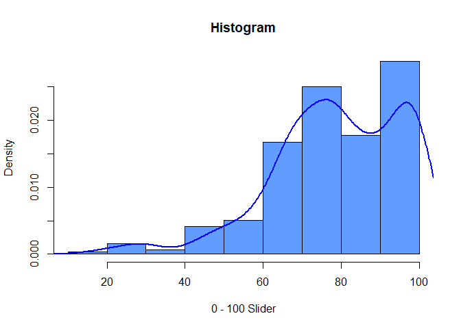<!-- -->


#### Missingness

**Missingness Descriptives**

Delivered / Answered = 554 / 553
Missing = 1
Min = 0, Max = 1, Mean = 0.01, SD = 0.1
(Descriptives are rounded to 2 decimals)

Missingness Intraclass Correlation (ICC) = 1.22 


#### Screenshot


</div>

</div> <!-- Header section -->

<div class = "header-shading">

#### From who else did you receive emotional support today, other than your mother? <br>

<div style="font-weight: bold; color: #2a5caa; margin-top: -0.7em; margin-bottom: 1em;">
  <a href="#Item 5541-anchor"> [Item 5541] </a>
</div>


</div>


<!-- Body -->


<div class = "anchor">

<div id="Question 5718-anchor">
  <strong>Question ID</strong>: Question 5718
</div>

**Way the question was delivered:** Multiple Select

**Type of data:** integer

</div> 
<div class = "anchor">


<button 
  onclick="let e = document.getElementById('Question 5718');
           let arrow = document.getElementById('Question 5718_arrow');
           e.style.display = e.style.display === 'none' ? 'block' : 'none';
           arrow.textContent = e.style.display === 'none' ? '▼' : '▲';"
  style="background: none; border: none; padding: 0; font-weight: bold; font-size: 18px; color: #2a5caa; cursor: pointer;">
Click to view visuals <span id="Question 5718_arrow">▼</span>
</button>

<div id="Question 5718" style="display: none;">


<!-- TOC-IGNORE-BEGIN -->

### Descriptives {.tabset}


#### Frequency Table

<table class="table" style="color: black; margin-left: auto; margin-right: auto;">
 <thead>
  <tr>
   <th style="text-align:left;"> Value </th>
   <th style="text-align:left;"> Label </th>
   <th style="text-align:left;"> Counts </th>
   <th style="text-align:left;"> Percentages </th>
  </tr>
 </thead>
<tbody>
  <tr>
   <td style="text-align:left;"> 1 </td>
   <td style="text-align:left;"> Siblings </td>
   <td style="text-align:left;color: darkgreen !important;"> N = 120 </td>
   <td style="text-align:left;"> 8.5% </td>
  </tr>
  <tr>
   <td style="text-align:left;"> 2 </td>
   <td style="text-align:left;"> Other parent or caregiver </td>
   <td style="text-align:left;color: darkgreen !important;"> N = 237 </td>
   <td style="text-align:left;"> 16.8% </td>
  </tr>
  <tr>
   <td style="text-align:left;"> 3 </td>
   <td style="text-align:left;"> Other family members </td>
   <td style="text-align:left;color: darkgreen !important;"> N = 61 </td>
   <td style="text-align:left;"> 4.3% </td>
  </tr>
  <tr>
   <td style="text-align:left;"> 4 </td>
   <td style="text-align:left;"> Friends </td>
   <td style="text-align:left;color: darkgreen !important;"> N = 325 </td>
   <td style="text-align:left;"> 23% </td>
  </tr>
  <tr>
   <td style="text-align:left;"> 5 </td>
   <td style="text-align:left;"> Romantic partner </td>
   <td style="text-align:left;color: darkgreen !important;"> N = 55 </td>
   <td style="text-align:left;"> 3.9% </td>
  </tr>
  <tr>
   <td style="text-align:left;"> 6 </td>
   <td style="text-align:left;"> Online friends </td>
   <td style="text-align:left;color: darkgreen !important;"> N = 34 </td>
   <td style="text-align:left;"> 2.4% </td>
  </tr>
  <tr>
   <td style="text-align:left;"> 7 </td>
   <td style="text-align:left;"> Teachers, coaches, or other adults </td>
   <td style="text-align:left;color: darkgreen !important;"> N = 75 </td>
   <td style="text-align:left;"> 5.3% </td>
  </tr>
  <tr>
   <td style="text-align:left;"> 8 </td>
   <td style="text-align:left;"> Health professionals (like a doctor) </td>
   <td style="text-align:left;color: darkgreen !important;"> N = 6 </td>
   <td style="text-align:left;"> 0.4% </td>
  </tr>
  <tr>
   <td style="text-align:left;"> 9 </td>
   <td style="text-align:left;"> Websites </td>
   <td style="text-align:left;color: darkgreen !important;"> N = 12 </td>
   <td style="text-align:left;"> 0.8% </td>
  </tr>
  <tr>
   <td style="text-align:left;"> 10 </td>
   <td style="text-align:left;"> None apply </td>
   <td style="text-align:left;color: darkgreen !important;"> N = 489 </td>
   <td style="text-align:left;"> 34.6% </td>
  </tr>
</tbody>
</table>


#### Barplot

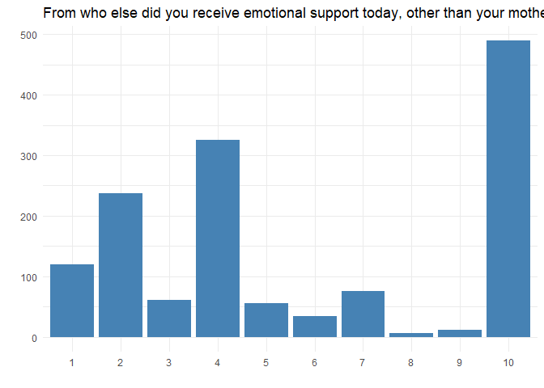<!-- -->


#### Missingness

**Missingness Descriptives**

Delivered / Answered = 1048 / 1043
Missing = 5
Min = 0, Max = 2, Mean = 0.04, SD = 0.24
(Descriptives are rounded to 2 decimals)

Missingness Intraclass Correlation (ICC) = 1.09 


#### Screenshot


</div>


</div> 
### Block: Item 5542 <!-- Header section -->

<div class = "header-shading">

#### To whom did you give emotional support today? <br>

<div style="font-weight: bold; color: #2a5caa; margin-top: -0.7em; margin-bottom: 1em;">
  <a href="#Item 5543-anchor"> [Item 5543] </a>
</div>


</div>


<!-- Body -->


<div class = "anchor">

<div id="Question 5763-anchor">
  <strong>Question ID</strong>: Question 5763
</div>

**Way the question was delivered:** Multiple Select

**Type of data:** integer

</div> 
<div class = "anchor">


<button 
  onclick="let e = document.getElementById('Question 5763');
           let arrow = document.getElementById('Question 5763_arrow');
           e.style.display = e.style.display === 'none' ? 'block' : 'none';
           arrow.textContent = e.style.display === 'none' ? '▼' : '▲';"
  style="background: none; border: none; padding: 0; font-weight: bold; font-size: 18px; color: #2a5caa; cursor: pointer;">
Click to view visuals <span id="Question 5763_arrow">▼</span>
</button>

<div id="Question 5763" style="display: none;">


<!-- TOC-IGNORE-BEGIN -->

### Descriptives {.tabset}


#### Frequency Table

<table class="table" style="color: black; margin-left: auto; margin-right: auto;">
 <thead>
  <tr>
   <th style="text-align:left;"> Value </th>
   <th style="text-align:left;"> Label </th>
   <th style="text-align:left;"> Counts </th>
   <th style="text-align:left;"> Percentages </th>
  </tr>
 </thead>
<tbody>
  <tr>
   <td style="text-align:left;"> 1 </td>
   <td style="text-align:left;"> Siblings </td>
   <td style="text-align:left;color: darkgreen !important;"> N = 179 </td>
   <td style="text-align:left;"> 12.2% </td>
  </tr>
  <tr>
   <td style="text-align:left;"> 2 </td>
   <td style="text-align:left;"> Parents or caregivers </td>
   <td style="text-align:left;color: darkgreen !important;"> N = 225 </td>
   <td style="text-align:left;"> 15.4% </td>
  </tr>
  <tr>
   <td style="text-align:left;"> 3 </td>
   <td style="text-align:left;"> Other family members </td>
   <td style="text-align:left;color: darkgreen !important;"> N = 75 </td>
   <td style="text-align:left;"> 5.1% </td>
  </tr>
  <tr>
   <td style="text-align:left;"> 4 </td>
   <td style="text-align:left;"> Friends </td>
   <td style="text-align:left;color: darkgreen !important;"> N = 381 </td>
   <td style="text-align:left;"> 26% </td>
  </tr>
  <tr>
   <td style="text-align:left;"> 5 </td>
   <td style="text-align:left;"> Romantic partners </td>
   <td style="text-align:left;color: darkgreen !important;"> N = 56 </td>
   <td style="text-align:left;"> 3.8% </td>
  </tr>
  <tr>
   <td style="text-align:left;"> 6 </td>
   <td style="text-align:left;"> Online friends </td>
   <td style="text-align:left;color: darkgreen !important;"> N = 37 </td>
   <td style="text-align:left;"> 2.5% </td>
  </tr>
  <tr>
   <td style="text-align:left;"> 7 </td>
   <td style="text-align:left;"> Others </td>
   <td style="text-align:left;color: darkgreen !important;"> N = 29 </td>
   <td style="text-align:left;"> 2% </td>
  </tr>
  <tr>
   <td style="text-align:left;"> 8 </td>
   <td style="text-align:left;"> None apply </td>
   <td style="text-align:left;color: darkgreen !important;"> N = 482 </td>
   <td style="text-align:left;"> 32.9% </td>
  </tr>
</tbody>
</table>


#### Barplot

<!-- -->


#### Missingness

**Missingness Descriptives**

Delivered / Answered = 1047 / 1043
Missing = 4
Min = 0, Max = 2, Mean = 0.03, SD = 0.22
(Descriptives are rounded to 2 decimals)

Missingness Intraclass Correlation (ICC) = 1.09 


#### Screenshot


</div>


</div> <!-- Header section -->

<div class = "header-shading">

#### Tell us about your day with your family <br>

<div style="font-weight: bold; color: #2a5caa; margin-top: -0.7em; margin-bottom: 1em;">
  <a href="#Item 6311-anchor"> [Item 6311] </a>
</div>


</div>


<!-- Body -->


<div class = "anchor">

<div id="Question 6739-anchor">
  <strong>Question ID</strong>: Question 6739
</div>

**Way the question was delivered:** Informational Fullscreen

**Type of data:** NA

</div> <div class = "anchor">


</div> <!-- Header section -->

<div class = "header-shading">

#### I had fun with my parent today. <br>

<div style="font-weight: bold; color: #2a5caa; margin-top: -0.7em; margin-bottom: 1em;">
  <a href="#Item 6312-anchor"> [Item 6312] </a>
</div>


</div>


<!-- Body -->


<div class = "anchor">

<div id="Question 6740-anchor">
  <strong>Question ID</strong>: Question 6740
</div>

**Way the question was delivered:** Slider

**Type of data:** numeric

</div> <div class = "anchor">


**Descriptives**
Min = 0, Max = 100, Mean = 68.35, SD = 24.69 


<button 
  onclick="let e = document.getElementById('Question 6740');
           let arrow = document.getElementById('Question 6740_arrow');
           e.style.display = e.style.display === 'none' ? 'block' : 'none';
           arrow.textContent = e.style.display === 'none' ? '▼' : '▲';"
  style="background: none; border: none; padding: 0; font-weight: bold; font-size: 18px; color: #2a5caa; cursor: pointer;">
Click to view visuals <span id="Question 6740_arrow">▼</span>
</button>

<div id="Question 6740" style="display: none;">


<!-- TOC-IGNORE-BEGIN -->

### Descriptives {.tabset}


#### Histogram

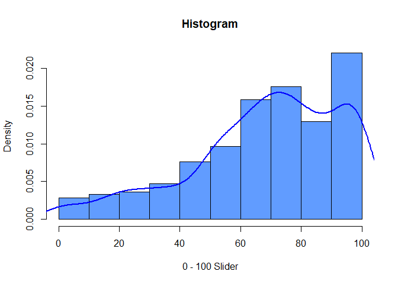<!-- -->


#### Missingness

**Missingness Descriptives**

Delivered / Answered = 697 / 696
Missing = 1
Min = 0, Max = 1, Mean = 0.01, SD = 0.11
(Descriptives are rounded to 2 decimals)

Missingness Intraclass Correlation (ICC) = 1.13 


#### Screenshot


</div>

</div> <!-- Header section -->

<div class = "header-shading">

#### My parent and I got along today. <br>

<div style="font-weight: bold; color: #2a5caa; margin-top: -0.7em; margin-bottom: 1em;">
  <a href="#Item 6313-anchor"> [Item 6313] </a>
</div>


</div>


<!-- Body -->


<div class = "anchor">

<div id="Question 6741-anchor">
  <strong>Question ID</strong>: Question 6741
</div>

**Way the question was delivered:** Slider

**Type of data:** numeric

</div> <div class = "anchor">


**Descriptives**
Min = 0, Max = 100, Mean = 77.7, SD = 20.45 


<button 
  onclick="let e = document.getElementById('Question 6741');
           let arrow = document.getElementById('Question 6741_arrow');
           e.style.display = e.style.display === 'none' ? 'block' : 'none';
           arrow.textContent = e.style.display === 'none' ? '▼' : '▲';"
  style="background: none; border: none; padding: 0; font-weight: bold; font-size: 18px; color: #2a5caa; cursor: pointer;">
Click to view visuals <span id="Question 6741_arrow">▼</span>
</button>

<div id="Question 6741" style="display: none;">


<!-- TOC-IGNORE-BEGIN -->

### Descriptives {.tabset}


#### Histogram

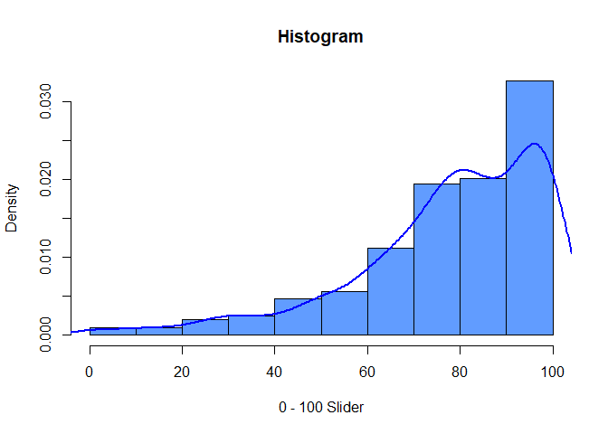<!-- -->


#### Missingness

**Missingness Descriptives**

Delivered / Answered = 697 / 697
Missing = 0
Min = 0, Max = 0, Mean = 0, SD = 0
(Descriptives are rounded to 2 decimals)

Missingness Intraclass Correlation (ICC) = NaN 


#### Screenshot


</div>

</div> <!-- Header section -->

<div class = "header-shading">

#### My parent gave me love and attention today. <br>

<div style="font-weight: bold; color: #2a5caa; margin-top: -0.7em; margin-bottom: 1em;">
  <a href="#Item 6314-anchor"> [Item 6314] </a>
</div>


</div>


<!-- Body -->


<div class = "anchor">

<div id="Question 6742-anchor">
  <strong>Question ID</strong>: Question 6742
</div>

**Way the question was delivered:** Slider

**Type of data:** numeric

</div> <div class = "anchor">


**Descriptives**
Min = 0, Max = 100, Mean = 77.07, SD = 20.47 


<button 
  onclick="let e = document.getElementById('Question 6742');
           let arrow = document.getElementById('Question 6742_arrow');
           e.style.display = e.style.display === 'none' ? 'block' : 'none';
           arrow.textContent = e.style.display === 'none' ? '▼' : '▲';"
  style="background: none; border: none; padding: 0; font-weight: bold; font-size: 18px; color: #2a5caa; cursor: pointer;">
Click to view visuals <span id="Question 6742_arrow">▼</span>
</button>

<div id="Question 6742" style="display: none;">


<!-- TOC-IGNORE-BEGIN -->

### Descriptives {.tabset}


#### Histogram

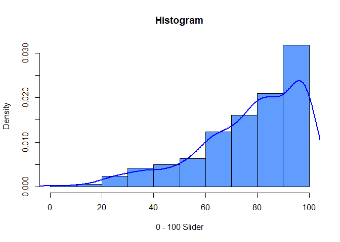<!-- -->


#### Missingness

**Missingness Descriptives**

Delivered / Answered = 697 / 697
Missing = 0
Min = 0, Max = 0, Mean = 0, SD = 0
(Descriptives are rounded to 2 decimals)

Missingness Intraclass Correlation (ICC) = NaN 


#### Screenshot


</div>

</div> <!-- Header section -->

<div class = "header-shading">

#### My parent got mad at me today. <br>

<div style="font-weight: bold; color: #2a5caa; margin-top: -0.7em; margin-bottom: 1em;">
  <a href="#Item 6315-anchor"> [Item 6315] </a>
</div>


</div>


<!-- Body -->


<div class = "anchor">

<div id="Question 6743-anchor">
  <strong>Question ID</strong>: Question 6743
</div>

**Way the question was delivered:** Slider

**Type of data:** numeric

</div> <div class = "anchor">


**Descriptives**
Min = 0, Max = 100, Mean = 16.48, SD = 21.37 


<button 
  onclick="let e = document.getElementById('Question 6743');
           let arrow = document.getElementById('Question 6743_arrow');
           e.style.display = e.style.display === 'none' ? 'block' : 'none';
           arrow.textContent = e.style.display === 'none' ? '▼' : '▲';"
  style="background: none; border: none; padding: 0; font-weight: bold; font-size: 18px; color: #2a5caa; cursor: pointer;">
Click to view visuals <span id="Question 6743_arrow">▼</span>
</button>

<div id="Question 6743" style="display: none;">


<!-- TOC-IGNORE-BEGIN -->

### Descriptives {.tabset}


#### Histogram

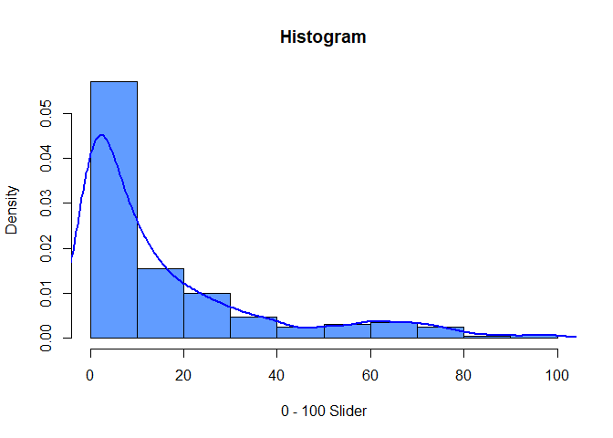<!-- -->


#### Missingness

**Missingness Descriptives**

Delivered / Answered = 696 / 696
Missing = 0
Min = 0, Max = 0, Mean = 0, SD = 0
(Descriptives are rounded to 2 decimals)

Missingness Intraclass Correlation (ICC) = NaN 


#### Screenshot


</div>

</div> <!-- Header section -->

<div class = "header-shading">

#### I was angry at my parent today. <br>

<div style="font-weight: bold; color: #2a5caa; margin-top: -0.7em; margin-bottom: 1em;">
  <a href="#Item 6316-anchor"> [Item 6316] </a>
</div>


</div>


<!-- Body -->


<div class = "anchor">

<div id="Question 6744-anchor">
  <strong>Question ID</strong>: Question 6744
</div>

**Way the question was delivered:** Slider

**Type of data:** numeric

</div> <div class = "anchor">


**Descriptives**
Min = 0, Max = 98, Mean = 16.76, SD = 22.83 


<button 
  onclick="let e = document.getElementById('Question 6744');
           let arrow = document.getElementById('Question 6744_arrow');
           e.style.display = e.style.display === 'none' ? 'block' : 'none';
           arrow.textContent = e.style.display === 'none' ? '▼' : '▲';"
  style="background: none; border: none; padding: 0; font-weight: bold; font-size: 18px; color: #2a5caa; cursor: pointer;">
Click to view visuals <span id="Question 6744_arrow">▼</span>
</button>

<div id="Question 6744" style="display: none;">


<!-- TOC-IGNORE-BEGIN -->

### Descriptives {.tabset}


#### Histogram

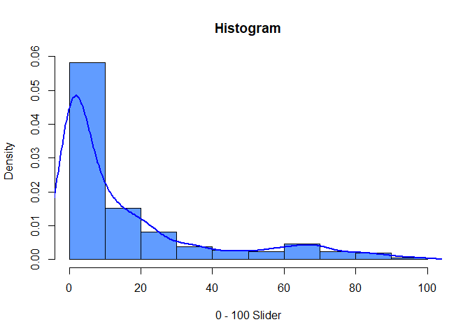<!-- -->


#### Missingness

**Missingness Descriptives**

Delivered / Answered = 695 / 695
Missing = 0
Min = 0, Max = 0, Mean = 0, SD = 0
(Descriptives are rounded to 2 decimals)

Missingness Intraclass Correlation (ICC) = NaN 


#### Screenshot


</div>

</div> <!-- Header section -->

<div class = "header-shading">

#### My parent punished me today. <br>

<div style="font-weight: bold; color: #2a5caa; margin-top: -0.7em; margin-bottom: 1em;">
  <a href="#Item 6317-anchor"> [Item 6317] </a>
</div>


</div>


<!-- Body -->


<div class = "anchor">

<div id="Question 6745-anchor">
  <strong>Question ID</strong>: Question 6745
</div>

**Way the question was delivered:** Slider

**Type of data:** numeric

</div> <div class = "anchor">


**Descriptives**
Min = 0, Max = 93, Mean = 6.38, SD = 12.81 


<button 
  onclick="let e = document.getElementById('Question 6745');
           let arrow = document.getElementById('Question 6745_arrow');
           e.style.display = e.style.display === 'none' ? 'block' : 'none';
           arrow.textContent = e.style.display === 'none' ? '▼' : '▲';"
  style="background: none; border: none; padding: 0; font-weight: bold; font-size: 18px; color: #2a5caa; cursor: pointer;">
Click to view visuals <span id="Question 6745_arrow">▼</span>
</button>

<div id="Question 6745" style="display: none;">


<!-- TOC-IGNORE-BEGIN -->

### Descriptives {.tabset}


#### Histogram

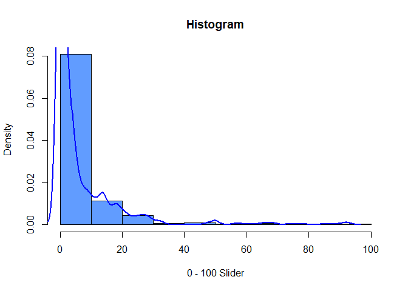<!-- -->


#### Missingness

**Missingness Descriptives**

Delivered / Answered = 695 / 693
Missing = 2
Min = 0, Max = 1, Mean = 0.03, SD = 0.16
(Descriptives are rounded to 2 decimals)

Missingness Intraclass Correlation (ICC) = 1.13 


#### Screenshot


</div>

</div> <!-- Header section -->

<div class = "header-shading">

#### Check all that apply <br>

<div style="font-weight: bold; color: #2a5caa; margin-top: -0.7em; margin-bottom: 1em;">
  <a href="#Item 6318-anchor"> [Item 6318] </a>
</div>


</div>


<!-- Body -->


<div class = "anchor">

<div id="Question 6746-anchor">
  <strong>Question ID</strong>: Question 6746
</div>

**Way the question was delivered:** Multiple Select

**Type of data:** integer

</div> 
<div class = "anchor">


<button 
  onclick="let e = document.getElementById('Question 6746');
           let arrow = document.getElementById('Question 6746_arrow');
           e.style.display = e.style.display === 'none' ? 'block' : 'none';
           arrow.textContent = e.style.display === 'none' ? '▼' : '▲';"
  style="background: none; border: none; padding: 0; font-weight: bold; font-size: 18px; color: #2a5caa; cursor: pointer;">
Click to view visuals <span id="Question 6746_arrow">▼</span>
</button>

<div id="Question 6746" style="display: none;">


<!-- TOC-IGNORE-BEGIN -->

### Descriptives {.tabset}


#### Frequency Table

<table class="table" style="color: black; margin-left: auto; margin-right: auto;">
 <thead>
  <tr>
   <th style="text-align:left;"> Value </th>
   <th style="text-align:left;"> Label </th>
   <th style="text-align:left;"> Counts </th>
   <th style="text-align:left;"> Percentages </th>
  </tr>
 </thead>
<tbody>
  <tr>
   <td style="text-align:left;"> 1 </td>
   <td style="text-align:left;"> I ate a meal with my family </td>
   <td style="text-align:left;color: darkgreen !important;"> N = 482 </td>
   <td style="text-align:left;"> 44.6% </td>
  </tr>
  <tr>
   <td style="text-align:left;"> 2 </td>
   <td style="text-align:left;"> I spent leisure time with my family </td>
   <td style="text-align:left;color: darkgreen !important;"> N = 485 </td>
   <td style="text-align:left;"> 44.9% </td>
  </tr>
  <tr>
   <td style="text-align:left;"> 3 </td>
   <td style="text-align:left;"> None apply </td>
   <td style="text-align:left;color: darkgreen !important;"> N = 114 </td>
   <td style="text-align:left;"> 10.5% </td>
  </tr>
</tbody>
</table>


#### Barplot

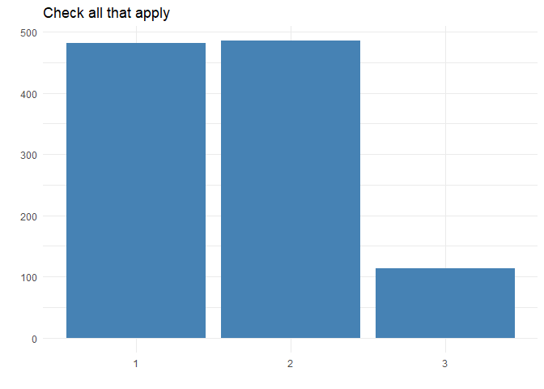<!-- -->


#### Missingness

**Missingness Descriptives**

Delivered / Answered = 693 / 692
Missing = 1
Min = 0, Max = 1, Mean = 0.01, SD = 0.11
(Descriptives are rounded to 2 decimals)

Missingness Intraclass Correlation (ICC) = 1.14 


#### Screenshot


</div>


</div> <!-- Header section -->

<div class = "header-shading">

#### Today, how much did you feel... <br>

<div style="font-weight: bold; color: #2a5caa; margin-top: -0.7em; margin-bottom: 1em;">
  <a href="#Item 6319-anchor"> [Item 6319] </a>
</div>


</div>


<!-- Body -->


<div class = "anchor">

<div id="Question 6747-anchor">
  <strong>Question ID</strong>: Question 6747
</div>

**Way the question was delivered:** Informational Fullscreen

**Type of data:** NA

</div> <div class = "anchor">


</div> <!-- Header section -->

<div class = "header-shading">

#### Accepted by your parent <br>

<div style="font-weight: bold; color: #2a5caa; margin-top: -0.7em; margin-bottom: 1em;">
  <a href="#Item 6320-anchor"> [Item 6320] </a>
</div>


</div>


<!-- Body -->


<div class = "anchor">

<div id="Question 6748-anchor">
  <strong>Question ID</strong>: Question 6748
</div>

**Way the question was delivered:** Slider

**Type of data:** numeric

</div> <div class = "anchor">


**Descriptives**
Min = 0, Max = 100, Mean = 76.68, SD = 20.99 


<button 
  onclick="let e = document.getElementById('Question 6748');
           let arrow = document.getElementById('Question 6748_arrow');
           e.style.display = e.style.display === 'none' ? 'block' : 'none';
           arrow.textContent = e.style.display === 'none' ? '▼' : '▲';"
  style="background: none; border: none; padding: 0; font-weight: bold; font-size: 18px; color: #2a5caa; cursor: pointer;">
Click to view visuals <span id="Question 6748_arrow">▼</span>
</button>

<div id="Question 6748" style="display: none;">


<!-- TOC-IGNORE-BEGIN -->

### Descriptives {.tabset}


#### Histogram

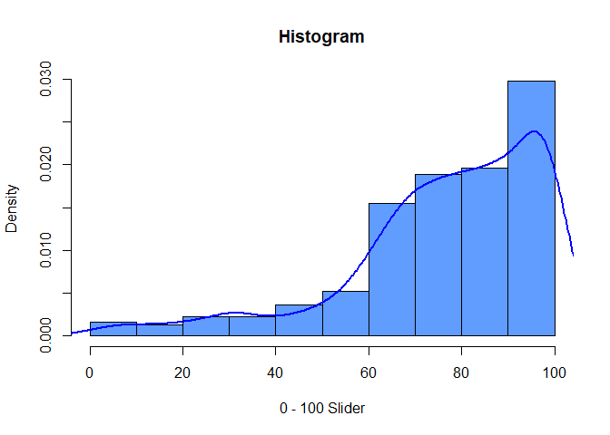<!-- -->


#### Missingness

**Missingness Descriptives**

Delivered / Answered = 693 / 693
Missing = 0
Min = 0, Max = 0, Mean = 0, SD = 0
(Descriptives are rounded to 2 decimals)

Missingness Intraclass Correlation (ICC) = NaN 


#### Screenshot


</div>

</div> <!-- Header section -->

<div class = "header-shading">

#### Understood by your parent <br>

<div style="font-weight: bold; color: #2a5caa; margin-top: -0.7em; margin-bottom: 1em;">
  <a href="#Item 6321-anchor"> [Item 6321] </a>
</div>


</div>


<!-- Body -->


<div class = "anchor">

<div id="Question 6749-anchor">
  <strong>Question ID</strong>: Question 6749
</div>

**Way the question was delivered:** Slider

**Type of data:** numeric

</div> <div class = "anchor">


**Descriptives**
Min = 0, Max = 100, Mean = 73.76, SD = 23.45 


<button 
  onclick="let e = document.getElementById('Question 6749');
           let arrow = document.getElementById('Question 6749_arrow');
           e.style.display = e.style.display === 'none' ? 'block' : 'none';
           arrow.textContent = e.style.display === 'none' ? '▼' : '▲';"
  style="background: none; border: none; padding: 0; font-weight: bold; font-size: 18px; color: #2a5caa; cursor: pointer;">
Click to view visuals <span id="Question 6749_arrow">▼</span>
</button>

<div id="Question 6749" style="display: none;">


<!-- TOC-IGNORE-BEGIN -->

### Descriptives {.tabset}


#### Histogram

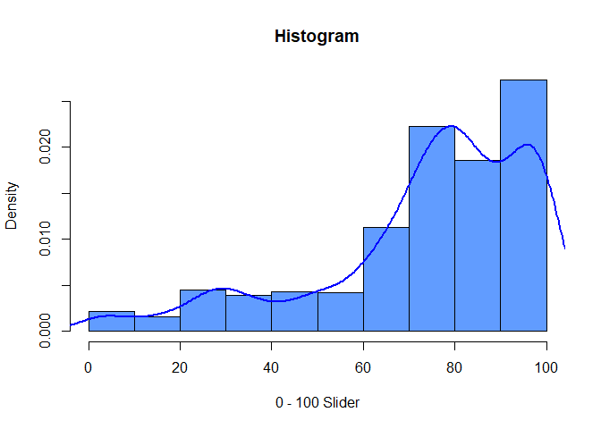<!-- -->


#### Missingness

**Missingness Descriptives**

Delivered / Answered = 693 / 693
Missing = 0
Min = 0, Max = 0, Mean = 0, SD = 0
(Descriptives are rounded to 2 decimals)

Missingness Intraclass Correlation (ICC) = NaN 


#### Screenshot


</div>

</div> <!-- Header section -->

<div class = "header-shading">

#### Cared for by your parent <br>

<div style="font-weight: bold; color: #2a5caa; margin-top: -0.7em; margin-bottom: 1em;">
  <a href="#Item 6322-anchor"> [Item 6322] </a>
</div>


</div>


<!-- Body -->


<div class = "anchor">

<div id="Question 6750-anchor">
  <strong>Question ID</strong>: Question 6750
</div>

**Way the question was delivered:** Slider

**Type of data:** numeric

</div> <div class = "anchor">


**Descriptives**
Min = 0, Max = 100, Mean = 80.09, SD = 19.76 


<button 
  onclick="let e = document.getElementById('Question 6750');
           let arrow = document.getElementById('Question 6750_arrow');
           e.style.display = e.style.display === 'none' ? 'block' : 'none';
           arrow.textContent = e.style.display === 'none' ? '▼' : '▲';"
  style="background: none; border: none; padding: 0; font-weight: bold; font-size: 18px; color: #2a5caa; cursor: pointer;">
Click to view visuals <span id="Question 6750_arrow">▼</span>
</button>

<div id="Question 6750" style="display: none;">


<!-- TOC-IGNORE-BEGIN -->

### Descriptives {.tabset}


#### Histogram

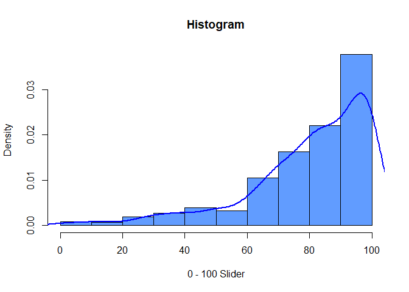<!-- -->


#### Missingness

**Missingness Descriptives**

Delivered / Answered = 693 / 693
Missing = 0
Min = 0, Max = 0, Mean = 0, SD = 0
(Descriptives are rounded to 2 decimals)

Missingness Intraclass Correlation (ICC) = NaN 


#### Screenshot


</div>

</div> <!-- Header section -->

<div class = "header-shading">

#### Overall, rate the quality of your parents support today. <br>

<div style="font-weight: bold; color: #2a5caa; margin-top: -0.7em; margin-bottom: 1em;">
  <a href="#Item 6323-anchor"> [Item 6323] </a>
</div>


</div>


<!-- Body -->


<div class = "anchor">

<div id="Question 6751-anchor">
  <strong>Question ID</strong>: Question 6751
</div>

**Way the question was delivered:** Slider

**Type of data:** numeric

</div> <div class = "anchor">


**Descriptives**
Min = 0, Max = 100, Mean = 79.35, SD = 18.95 


<button 
  onclick="let e = document.getElementById('Question 6751');
           let arrow = document.getElementById('Question 6751_arrow');
           e.style.display = e.style.display === 'none' ? 'block' : 'none';
           arrow.textContent = e.style.display === 'none' ? '▼' : '▲';"
  style="background: none; border: none; padding: 0; font-weight: bold; font-size: 18px; color: #2a5caa; cursor: pointer;">
Click to view visuals <span id="Question 6751_arrow">▼</span>
</button>

<div id="Question 6751" style="display: none;">


<!-- TOC-IGNORE-BEGIN -->

### Descriptives {.tabset}


#### Histogram

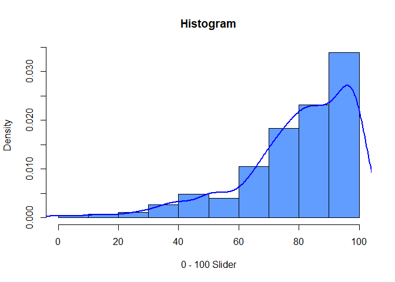<!-- -->


#### Missingness

**Missingness Descriptives**

Delivered / Answered = 692 / 692
Missing = 0
Min = 0, Max = 0, Mean = 0, SD = 0
(Descriptives are rounded to 2 decimals)

Missingness Intraclass Correlation (ICC) = NaN 


#### Screenshot


</div>

</div> <!-- Header section -->

<div class = "header-shading">

#### Check all that you wanted your parent to do today: <br>

<div style="font-weight: bold; color: #2a5caa; margin-top: -0.7em; margin-bottom: 1em;">
  <a href="#Item 6324-anchor"> [Item 6324] </a>
</div>


</div>


<!-- Body -->


<div class = "anchor">

<div id="Question 6752-anchor">
  <strong>Question ID</strong>: Question 6752
</div>

**Way the question was delivered:** Multiple Select

**Type of data:** integer

</div> 
<div class = "anchor">


<button 
  onclick="let e = document.getElementById('Question 6752');
           let arrow = document.getElementById('Question 6752_arrow');
           e.style.display = e.style.display === 'none' ? 'block' : 'none';
           arrow.textContent = e.style.display === 'none' ? '▼' : '▲';"
  style="background: none; border: none; padding: 0; font-weight: bold; font-size: 18px; color: #2a5caa; cursor: pointer;">
Click to view visuals <span id="Question 6752_arrow">▼</span>
</button>

<div id="Question 6752" style="display: none;">


<!-- TOC-IGNORE-BEGIN -->

### Descriptives {.tabset}


#### Frequency Table

<table class="table" style="color: black; margin-left: auto; margin-right: auto;">
 <thead>
  <tr>
   <th style="text-align:left;"> Value </th>
   <th style="text-align:left;"> Label </th>
   <th style="text-align:left;"> Counts </th>
   <th style="text-align:left;"> Percentages </th>
  </tr>
 </thead>
<tbody>
  <tr>
   <td style="text-align:left;"> 1 </td>
   <td style="text-align:left;"> Give me information or tools I need to deal with a situation </td>
   <td style="text-align:left;color: darkgreen !important;"> N = 119 </td>
   <td style="text-align:left;"> 11.5% </td>
  </tr>
  <tr>
   <td style="text-align:left;"> 2 </td>
   <td style="text-align:left;"> Give me advice about what to do </td>
   <td style="text-align:left;color: darkgreen !important;"> N = 179 </td>
   <td style="text-align:left;"> 17.3% </td>
  </tr>
  <tr>
   <td style="text-align:left;"> 3 </td>
   <td style="text-align:left;"> Give me reasons why I should or should not do something </td>
   <td style="text-align:left;color: darkgreen !important;"> N = 96 </td>
   <td style="text-align:left;"> 9.3% </td>
  </tr>
  <tr>
   <td style="text-align:left;"> 4 </td>
   <td style="text-align:left;"> Help me understand why I did not do something well </td>
   <td style="text-align:left;color: darkgreen !important;"> N = 92 </td>
   <td style="text-align:left;"> 8.9% </td>
  </tr>
  <tr>
   <td style="text-align:left;"> 5 </td>
   <td style="text-align:left;"> Think about a situation with me and tell me what I can do about it </td>
   <td style="text-align:left;color: darkgreen !important;"> N = 124 </td>
   <td style="text-align:left;"> 12% </td>
  </tr>
  <tr>
   <td style="text-align:left;"> 6 </td>
   <td style="text-align:left;"> None apply </td>
   <td style="text-align:left;color: darkgreen !important;"> N = 422 </td>
   <td style="text-align:left;"> 40.9% </td>
  </tr>
</tbody>
</table>


#### Barplot

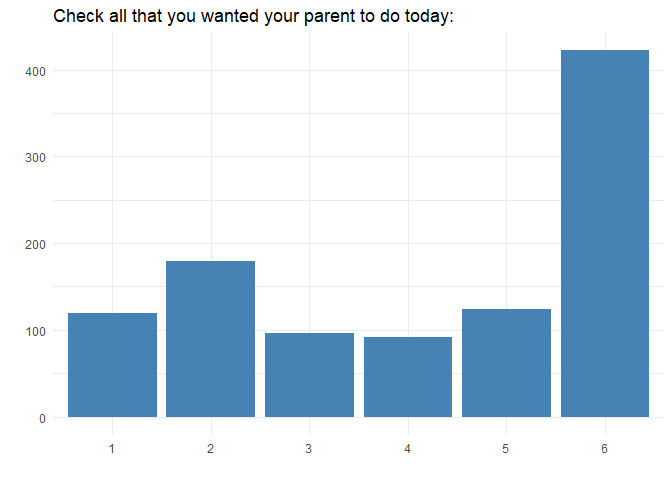<!-- -->


#### Missingness

**Missingness Descriptives**

Delivered / Answered = 692 / 686
Missing = 6
Min = 0, Max = 4, Mean = 0.08, SD = 0.47
(Descriptives are rounded to 2 decimals)

Missingness Intraclass Correlation (ICC) = 1.04 


#### Screenshot


</div>


</div> <!-- Header section -->

<div class = "header-shading">

#### Check all that you wanted your parent to do today: <br>

<div style="font-weight: bold; color: #2a5caa; margin-top: -0.7em; margin-bottom: 1em;">
  <a href="#Item 6325-anchor"> [Item 6325] </a>
</div>


</div>


<!-- Body -->


<div class = "anchor">

<div id="Question 6753-anchor">
  <strong>Question ID</strong>: Question 6753
</div>

**Way the question was delivered:** Multiple Select

**Type of data:** integer

</div> 
<div class = "anchor">


<button 
  onclick="let e = document.getElementById('Question 6753');
           let arrow = document.getElementById('Question 6753_arrow');
           e.style.display = e.style.display === 'none' ? 'block' : 'none';
           arrow.textContent = e.style.display === 'none' ? '▼' : '▲';"
  style="background: none; border: none; padding: 0; font-weight: bold; font-size: 18px; color: #2a5caa; cursor: pointer;">
Click to view visuals <span id="Question 6753_arrow">▼</span>
</button>

<div id="Question 6753" style="display: none;">


<!-- TOC-IGNORE-BEGIN -->

### Descriptives {.tabset}


#### Frequency Table

<table class="table" style="color: black; margin-left: auto; margin-right: auto;">
 <thead>
  <tr>
   <th style="text-align:left;"> Value </th>
   <th style="text-align:left;"> Label </th>
   <th style="text-align:left;"> Counts </th>
   <th style="text-align:left;"> Percentages </th>
  </tr>
 </thead>
<tbody>
  <tr>
   <td style="text-align:left;"> 1 </td>
   <td style="text-align:left;"> Show sadness for my situation </td>
   <td style="text-align:left;color: darkgreen !important;"> N = 97 </td>
   <td style="text-align:left;"> 7.9% </td>
  </tr>
  <tr>
   <td style="text-align:left;"> 2 </td>
   <td style="text-align:left;"> Listen to me when I speak </td>
   <td style="text-align:left;color: darkgreen !important;"> N = 341 </td>
   <td style="text-align:left;"> 27.7% </td>
  </tr>
  <tr>
   <td style="text-align:left;"> 3 </td>
   <td style="text-align:left;"> Tell me that she or he loves me </td>
   <td style="text-align:left;color: darkgreen !important;"> N = 205 </td>
   <td style="text-align:left;"> 16.7% </td>
  </tr>
  <tr>
   <td style="text-align:left;"> 4 </td>
   <td style="text-align:left;"> Show that she or he understands, or tell me about a similar situation </td>
   <td style="text-align:left;color: darkgreen !important;"> N = 146 </td>
   <td style="text-align:left;"> 11.9% </td>
  </tr>
  <tr>
   <td style="text-align:left;"> 5 </td>
   <td style="text-align:left;"> Provide me with hope or confidence </td>
   <td style="text-align:left;color: darkgreen !important;"> N = 183 </td>
   <td style="text-align:left;"> 14.9% </td>
  </tr>
  <tr>
   <td style="text-align:left;"> 6 </td>
   <td style="text-align:left;"> None apply </td>
   <td style="text-align:left;color: darkgreen !important;"> N = 258 </td>
   <td style="text-align:left;"> 21% </td>
  </tr>
</tbody>
</table>


#### Barplot

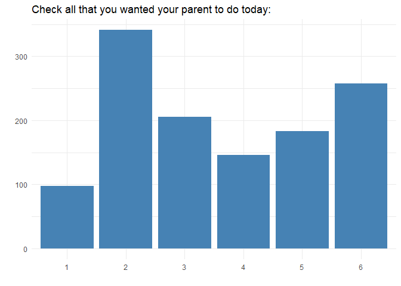<!-- -->


#### Missingness

**Missingness Descriptives**

Delivered / Answered = 692 / 681
Missing = 11
Min = 0, Max = 5, Mean = 0.14, SD = 0.67
(Descriptives are rounded to 2 decimals)

Missingness Intraclass Correlation (ICC) = 1.04 


#### Screenshot


</div>


</div> <!-- Header section -->

<div class = "header-shading">

#### Check all that you wanted your parent to do today: <br>

<div style="font-weight: bold; color: #2a5caa; margin-top: -0.7em; margin-bottom: 1em;">
  <a href="#Item 6326-anchor"> [Item 6326] </a>
</div>


</div>


<!-- Body -->


<div class = "anchor">

<div id="Question 6754-anchor">
  <strong>Question ID</strong>: Question 6754
</div>

**Way the question was delivered:** Multiple Select

**Type of data:** integer

</div> 
<div class = "anchor">


<button 
  onclick="let e = document.getElementById('Question 6754');
           let arrow = document.getElementById('Question 6754_arrow');
           e.style.display = e.style.display === 'none' ? 'block' : 'none';
           arrow.textContent = e.style.display === 'none' ? '▼' : '▲';"
  style="background: none; border: none; padding: 0; font-weight: bold; font-size: 18px; color: #2a5caa; cursor: pointer;">
Click to view visuals <span id="Question 6754_arrow">▼</span>
</button>

<div id="Question 6754" style="display: none;">


<!-- TOC-IGNORE-BEGIN -->

### Descriptives {.tabset}


#### Frequency Table

<table class="table" style="color: black; margin-left: auto; margin-right: auto;">
 <thead>
  <tr>
   <th style="text-align:left;"> Value </th>
   <th style="text-align:left;"> Label </th>
   <th style="text-align:left;"> Counts </th>
   <th style="text-align:left;"> Percentages </th>
  </tr>
 </thead>
<tbody>
  <tr>
   <td style="text-align:left;"> 1 </td>
   <td style="text-align:left;"> Offer to do something to help me </td>
   <td style="text-align:left;color: darkgreen !important;"> N = 156 </td>
   <td style="text-align:left;"> 17% </td>
  </tr>
  <tr>
   <td style="text-align:left;"> 2 </td>
   <td style="text-align:left;"> Do something to help me </td>
   <td style="text-align:left;color: darkgreen !important;"> N = 289 </td>
   <td style="text-align:left;"> 31.4% </td>
  </tr>
  <tr>
   <td style="text-align:left;"> 3 </td>
   <td style="text-align:left;"> Offer to do something with me to help me feel better </td>
   <td style="text-align:left;color: darkgreen !important;"> N = 142 </td>
   <td style="text-align:left;"> 15.5% </td>
  </tr>
  <tr>
   <td style="text-align:left;"> 4 </td>
   <td style="text-align:left;"> None apply </td>
   <td style="text-align:left;color: darkgreen !important;"> N = 332 </td>
   <td style="text-align:left;"> 36.1% </td>
  </tr>
</tbody>
</table>


#### Barplot

<!-- -->


#### Missingness

**Missingness Descriptives**

Delivered / Answered = 692 / 683
Missing = 9
Min = 0, Max = 6, Mean = 0.11, SD = 0.7
(Descriptives are rounded to 2 decimals)

Missingness Intraclass Correlation (ICC) = 1.03 


#### Screenshot


</div>


</div> <!-- Header section -->

<div class = "header-shading">

#### Check all that you asked your parent to do today: <br>

<div style="font-weight: bold; color: #2a5caa; margin-top: -0.7em; margin-bottom: 1em;">
  <a href="#Item 6327-anchor"> [Item 6327] </a>
</div>


</div>


<!-- Body -->


<div class = "anchor">

<div id="Question 6755-anchor">
  <strong>Question ID</strong>: Question 6755
</div>

**Way the question was delivered:** Multiple Select

**Type of data:** integer

</div> 
<div class = "anchor">


<button 
  onclick="let e = document.getElementById('Question 6755');
           let arrow = document.getElementById('Question 6755_arrow');
           e.style.display = e.style.display === 'none' ? 'block' : 'none';
           arrow.textContent = e.style.display === 'none' ? '▼' : '▲';"
  style="background: none; border: none; padding: 0; font-weight: bold; font-size: 18px; color: #2a5caa; cursor: pointer;">
Click to view visuals <span id="Question 6755_arrow">▼</span>
</button>

<div id="Question 6755" style="display: none;">


<!-- TOC-IGNORE-BEGIN -->

### Descriptives {.tabset}


#### Frequency Table

<table class="table" style="color: black; margin-left: auto; margin-right: auto;">
 <thead>
  <tr>
   <th style="text-align:left;"> Value </th>
   <th style="text-align:left;"> Label </th>
   <th style="text-align:left;"> Counts </th>
   <th style="text-align:left;"> Percentages </th>
  </tr>
 </thead>
<tbody>
  <tr>
   <td style="text-align:left;"> 1 </td>
   <td style="text-align:left;"> Give me information or tools I need to deal with a situation </td>
   <td style="text-align:left;color: darkgreen !important;"> N = 79 </td>
   <td style="text-align:left;"> 8.4% </td>
  </tr>
  <tr>
   <td style="text-align:left;"> 2 </td>
   <td style="text-align:left;"> Give me advice about what to do </td>
   <td style="text-align:left;color: darkgreen !important;"> N = 137 </td>
   <td style="text-align:left;"> 14.6% </td>
  </tr>
  <tr>
   <td style="text-align:left;"> 3 </td>
   <td style="text-align:left;"> Give me reasons why I should or should not do something </td>
   <td style="text-align:left;color: darkgreen !important;"> N = 83 </td>
   <td style="text-align:left;"> 8.8% </td>
  </tr>
  <tr>
   <td style="text-align:left;"> 4 </td>
   <td style="text-align:left;"> Help me understand why I did not do something well </td>
   <td style="text-align:left;color: darkgreen !important;"> N = 80 </td>
   <td style="text-align:left;"> 8.5% </td>
  </tr>
  <tr>
   <td style="text-align:left;"> 5 </td>
   <td style="text-align:left;"> Think about a situation with me and tell me what I can do about it </td>
   <td style="text-align:left;color: darkgreen !important;"> N = 90 </td>
   <td style="text-align:left;"> 9.6% </td>
  </tr>
  <tr>
   <td style="text-align:left;"> 6 </td>
   <td style="text-align:left;"> None apply </td>
   <td style="text-align:left;color: darkgreen !important;"> N = 472 </td>
   <td style="text-align:left;"> 50.2% </td>
  </tr>
</tbody>
</table>


#### Barplot

<!-- -->


#### Missingness

**Missingness Descriptives**

Delivered / Answered = 692 / 685
Missing = 7
Min = 0, Max = 5, Mean = 0.09, SD = 0.58
(Descriptives are rounded to 2 decimals)

Missingness Intraclass Correlation (ICC) = 1.03 


#### Screenshot


</div>


</div> <!-- Header section -->

<div class = "header-shading">

#### Check all that you asked your parent to do today: <br>

<div style="font-weight: bold; color: #2a5caa; margin-top: -0.7em; margin-bottom: 1em;">
  <a href="#Item 6328-anchor"> [Item 6328] </a>
</div>


</div>


<!-- Body -->


<div class = "anchor">

<div id="Question 6756-anchor">
  <strong>Question ID</strong>: Question 6756
</div>

**Way the question was delivered:** Multiple Select

**Type of data:** integer

</div> 
<div class = "anchor">


<button 
  onclick="let e = document.getElementById('Question 6756');
           let arrow = document.getElementById('Question 6756_arrow');
           e.style.display = e.style.display === 'none' ? 'block' : 'none';
           arrow.textContent = e.style.display === 'none' ? '▼' : '▲';"
  style="background: none; border: none; padding: 0; font-weight: bold; font-size: 18px; color: #2a5caa; cursor: pointer;">
Click to view visuals <span id="Question 6756_arrow">▼</span>
</button>

<div id="Question 6756" style="display: none;">


<!-- TOC-IGNORE-BEGIN -->

### Descriptives {.tabset}


#### Frequency Table

<table class="table" style="color: black; margin-left: auto; margin-right: auto;">
 <thead>
  <tr>
   <th style="text-align:left;"> Value </th>
   <th style="text-align:left;"> Label </th>
   <th style="text-align:left;"> Counts </th>
   <th style="text-align:left;"> Percentages </th>
  </tr>
 </thead>
<tbody>
  <tr>
   <td style="text-align:left;"> 1 </td>
   <td style="text-align:left;"> Show sadness for my situation </td>
   <td style="text-align:left;color: darkgreen !important;"> N = 47 </td>
   <td style="text-align:left;"> 5.2% </td>
  </tr>
  <tr>
   <td style="text-align:left;"> 2 </td>
   <td style="text-align:left;"> Listen to me when I speak </td>
   <td style="text-align:left;color: darkgreen !important;"> N = 123 </td>
   <td style="text-align:left;"> 13.5% </td>
  </tr>
  <tr>
   <td style="text-align:left;"> 3 </td>
   <td style="text-align:left;"> Tell me that she or he loves me </td>
   <td style="text-align:left;color: darkgreen !important;"> N = 80 </td>
   <td style="text-align:left;"> 8.8% </td>
  </tr>
  <tr>
   <td style="text-align:left;"> 4 </td>
   <td style="text-align:left;"> Show that she or he understands, or tell me about a similar situation </td>
   <td style="text-align:left;color: darkgreen !important;"> N = 87 </td>
   <td style="text-align:left;"> 9.5% </td>
  </tr>
  <tr>
   <td style="text-align:left;"> 5 </td>
   <td style="text-align:left;"> Provide me with hope or confidence </td>
   <td style="text-align:left;color: darkgreen !important;"> N = 67 </td>
   <td style="text-align:left;"> 7.3% </td>
  </tr>
  <tr>
   <td style="text-align:left;"> 6 </td>
   <td style="text-align:left;"> None apply </td>
   <td style="text-align:left;color: darkgreen !important;"> N = 508 </td>
   <td style="text-align:left;"> 55.7% </td>
  </tr>
</tbody>
</table>


#### Barplot

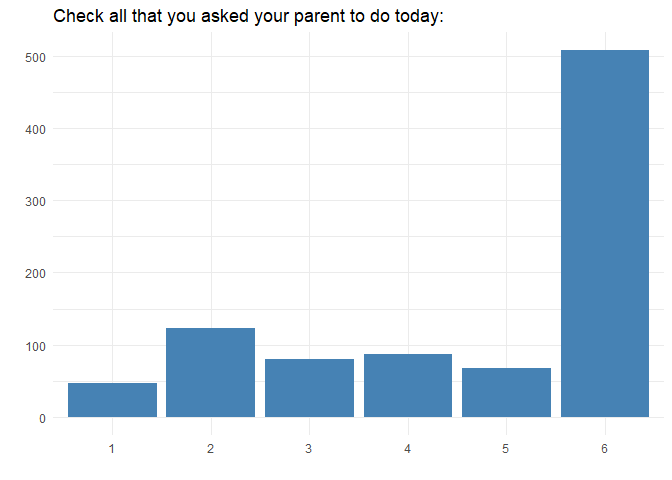<!-- -->


#### Missingness

**Missingness Descriptives**

Delivered / Answered = 692 / 684
Missing = 8
Min = 0, Max = 5, Mean = 0.1, SD = 0.59
(Descriptives are rounded to 2 decimals)

Missingness Intraclass Correlation (ICC) = 1.04 


#### Screenshot


</div>


</div> <!-- Header section -->

<div class = "header-shading">

#### Check all that you asked your parent to do today: <br>

<div style="font-weight: bold; color: #2a5caa; margin-top: -0.7em; margin-bottom: 1em;">
  <a href="#Item 6329-anchor"> [Item 6329] </a>
</div>


</div>


<!-- Body -->


<div class = "anchor">

<div id="Question 6757-anchor">
  <strong>Question ID</strong>: Question 6757
</div>

**Way the question was delivered:** Multiple Select

**Type of data:** integer

</div> 
<div class = "anchor">


<button 
  onclick="let e = document.getElementById('Question 6757');
           let arrow = document.getElementById('Question 6757_arrow');
           e.style.display = e.style.display === 'none' ? 'block' : 'none';
           arrow.textContent = e.style.display === 'none' ? '▼' : '▲';"
  style="background: none; border: none; padding: 0; font-weight: bold; font-size: 18px; color: #2a5caa; cursor: pointer;">
Click to view visuals <span id="Question 6757_arrow">▼</span>
</button>

<div id="Question 6757" style="display: none;">


<!-- TOC-IGNORE-BEGIN -->

### Descriptives {.tabset}


#### Frequency Table

<table class="table" style="color: black; margin-left: auto; margin-right: auto;">
 <thead>
  <tr>
   <th style="text-align:left;"> Value </th>
   <th style="text-align:left;"> Label </th>
   <th style="text-align:left;"> Counts </th>
   <th style="text-align:left;"> Percentages </th>
  </tr>
 </thead>
<tbody>
  <tr>
   <td style="text-align:left;"> 1 </td>
   <td style="text-align:left;"> Offer to do something to help me </td>
   <td style="text-align:left;color: darkgreen !important;"> N = 95 </td>
   <td style="text-align:left;"> 11.7% </td>
  </tr>
  <tr>
   <td style="text-align:left;"> 2 </td>
   <td style="text-align:left;"> Do something to help me </td>
   <td style="text-align:left;color: darkgreen !important;"> N = 240 </td>
   <td style="text-align:left;"> 29.4% </td>
  </tr>
  <tr>
   <td style="text-align:left;"> 3 </td>
   <td style="text-align:left;"> Offer to do something with me to help me feel better </td>
   <td style="text-align:left;color: darkgreen !important;"> N = 86 </td>
   <td style="text-align:left;"> 10.6% </td>
  </tr>
  <tr>
   <td style="text-align:left;"> 4 </td>
   <td style="text-align:left;"> None apply </td>
   <td style="text-align:left;color: darkgreen !important;"> N = 394 </td>
   <td style="text-align:left;"> 48.3% </td>
  </tr>
</tbody>
</table>


#### Barplot

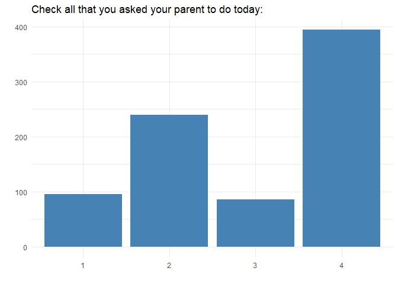<!-- -->


#### Missingness

**Missingness Descriptives**

Delivered / Answered = 692 / 685
Missing = 7
Min = 0, Max = 5, Mean = 0.09, SD = 0.58
(Descriptives are rounded to 2 decimals)

Missingness Intraclass Correlation (ICC) = 1.03 


#### Screenshot


</div>


</div> <!-- Header section -->

<div class = "header-shading">

#### Check all that your parent did for you today: <br>

<div style="font-weight: bold; color: #2a5caa; margin-top: -0.7em; margin-bottom: 1em;">
  <a href="#Item 6330-anchor"> [Item 6330] </a>
</div>


</div>


<!-- Body -->


<div class = "anchor">

<div id="Question 6758-anchor">
  <strong>Question ID</strong>: Question 6758
</div>

**Way the question was delivered:** Multiple Select

**Type of data:** integer

</div> 
<div class = "anchor">


<button 
  onclick="let e = document.getElementById('Question 6758');
           let arrow = document.getElementById('Question 6758_arrow');
           e.style.display = e.style.display === 'none' ? 'block' : 'none';
           arrow.textContent = e.style.display === 'none' ? '▼' : '▲';"
  style="background: none; border: none; padding: 0; font-weight: bold; font-size: 18px; color: #2a5caa; cursor: pointer;">
Click to view visuals <span id="Question 6758_arrow">▼</span>
</button>

<div id="Question 6758" style="display: none;">


<!-- TOC-IGNORE-BEGIN -->

### Descriptives {.tabset}


#### Frequency Table

<table class="table" style="color: black; margin-left: auto; margin-right: auto;">
 <thead>
  <tr>
   <th style="text-align:left;"> Value </th>
   <th style="text-align:left;"> Label </th>
   <th style="text-align:left;"> Counts </th>
   <th style="text-align:left;"> Percentages </th>
  </tr>
 </thead>
<tbody>
  <tr>
   <td style="text-align:left;"> 1 </td>
   <td style="text-align:left;"> Give me information or tools I need to deal with a situation </td>
   <td style="text-align:left;color: darkgreen !important;"> N = 158 </td>
   <td style="text-align:left;"> 13.8% </td>
  </tr>
  <tr>
   <td style="text-align:left;"> 2 </td>
   <td style="text-align:left;"> Give me advice about what to do </td>
   <td style="text-align:left;color: darkgreen !important;"> N = 225 </td>
   <td style="text-align:left;"> 19.6% </td>
  </tr>
  <tr>
   <td style="text-align:left;"> 3 </td>
   <td style="text-align:left;"> Give me reasons why I should or should not do something </td>
   <td style="text-align:left;color: darkgreen !important;"> N = 140 </td>
   <td style="text-align:left;"> 12.2% </td>
  </tr>
  <tr>
   <td style="text-align:left;"> 4 </td>
   <td style="text-align:left;"> Help me understand why I did not do something well </td>
   <td style="text-align:left;color: darkgreen !important;"> N = 108 </td>
   <td style="text-align:left;"> 9.4% </td>
  </tr>
  <tr>
   <td style="text-align:left;"> 5 </td>
   <td style="text-align:left;"> Think about a situation with me and tell me what I can do about it </td>
   <td style="text-align:left;color: darkgreen !important;"> N = 156 </td>
   <td style="text-align:left;"> 13.6% </td>
  </tr>
  <tr>
   <td style="text-align:left;"> 6 </td>
   <td style="text-align:left;"> None apply </td>
   <td style="text-align:left;color: darkgreen !important;"> N = 360 </td>
   <td style="text-align:left;"> 31.4% </td>
  </tr>
</tbody>
</table>


#### Barplot

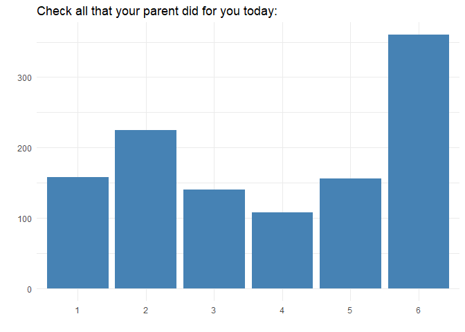<!-- -->


#### Missingness

**Missingness Descriptives**

Delivered / Answered = 691 / 683
Missing = 8
Min = 0, Max = 6, Mean = 0.1, SD = 0.69
(Descriptives are rounded to 2 decimals)

Missingness Intraclass Correlation (ICC) = 1.03 


#### Screenshot


</div>


</div> <!-- Header section -->

<div class = "header-shading">

#### Check all that your parent did for you today: <br>

<div style="font-weight: bold; color: #2a5caa; margin-top: -0.7em; margin-bottom: 1em;">
  <a href="#Item 6331-anchor"> [Item 6331] </a>
</div>


</div>


<!-- Body -->


<div class = "anchor">

<div id="Question 6759-anchor">
  <strong>Question ID</strong>: Question 6759
</div>

**Way the question was delivered:** Multiple Select

**Type of data:** integer

</div> 
<div class = "anchor">


<button 
  onclick="let e = document.getElementById('Question 6759');
           let arrow = document.getElementById('Question 6759_arrow');
           e.style.display = e.style.display === 'none' ? 'block' : 'none';
           arrow.textContent = e.style.display === 'none' ? '▼' : '▲';"
  style="background: none; border: none; padding: 0; font-weight: bold; font-size: 18px; color: #2a5caa; cursor: pointer;">
Click to view visuals <span id="Question 6759_arrow">▼</span>
</button>

<div id="Question 6759" style="display: none;">


<!-- TOC-IGNORE-BEGIN -->

### Descriptives {.tabset}


#### Frequency Table

<table class="table" style="color: black; margin-left: auto; margin-right: auto;">
 <thead>
  <tr>
   <th style="text-align:left;"> Value </th>
   <th style="text-align:left;"> Label </th>
   <th style="text-align:left;"> Counts </th>
   <th style="text-align:left;"> Percentages </th>
  </tr>
 </thead>
<tbody>
  <tr>
   <td style="text-align:left;"> 1 </td>
   <td style="text-align:left;"> Show sadness for my situation </td>
   <td style="text-align:left;color: darkgreen !important;"> N = 108 </td>
   <td style="text-align:left;"> 7.6% </td>
  </tr>
  <tr>
   <td style="text-align:left;"> 2 </td>
   <td style="text-align:left;"> Listen to me when I speak </td>
   <td style="text-align:left;color: darkgreen !important;"> N = 443 </td>
   <td style="text-align:left;"> 31% </td>
  </tr>
  <tr>
   <td style="text-align:left;"> 3 </td>
   <td style="text-align:left;"> Tell me that she or he loves me </td>
   <td style="text-align:left;color: darkgreen !important;"> N = 323 </td>
   <td style="text-align:left;"> 22.6% </td>
  </tr>
  <tr>
   <td style="text-align:left;"> 4 </td>
   <td style="text-align:left;"> Show that she or he understands, or tell me about a similar situation </td>
   <td style="text-align:left;color: darkgreen !important;"> N = 178 </td>
   <td style="text-align:left;"> 12.5% </td>
  </tr>
  <tr>
   <td style="text-align:left;"> 5 </td>
   <td style="text-align:left;"> Provide me with hope or confidence </td>
   <td style="text-align:left;color: darkgreen !important;"> N = 209 </td>
   <td style="text-align:left;"> 14.6% </td>
  </tr>
  <tr>
   <td style="text-align:left;"> 6 </td>
   <td style="text-align:left;"> None apply </td>
   <td style="text-align:left;color: darkgreen !important;"> N = 166 </td>
   <td style="text-align:left;"> 11.6% </td>
  </tr>
</tbody>
</table>


#### Barplot

<!-- -->


#### Missingness

**Missingness Descriptives**

Delivered / Answered = 691 / 683
Missing = 8
Min = 0, Max = 6, Mean = 0.1, SD = 0.69
(Descriptives are rounded to 2 decimals)

Missingness Intraclass Correlation (ICC) = 1.03 


#### Screenshot


</div>


</div> <!-- Header section -->

<div class = "header-shading">

#### Check all that your parent did for you today: <br>

<div style="font-weight: bold; color: #2a5caa; margin-top: -0.7em; margin-bottom: 1em;">
  <a href="#Item 6332-anchor"> [Item 6332] </a>
</div>


</div>


<!-- Body -->


<div class = "anchor">

<div id="Question 6760-anchor">
  <strong>Question ID</strong>: Question 6760
</div>

**Way the question was delivered:** Multiple Select

**Type of data:** integer

</div> 
<div class = "anchor">


<button 
  onclick="let e = document.getElementById('Question 6760');
           let arrow = document.getElementById('Question 6760_arrow');
           e.style.display = e.style.display === 'none' ? 'block' : 'none';
           arrow.textContent = e.style.display === 'none' ? '▼' : '▲';"
  style="background: none; border: none; padding: 0; font-weight: bold; font-size: 18px; color: #2a5caa; cursor: pointer;">
Click to view visuals <span id="Question 6760_arrow">▼</span>
</button>

<div id="Question 6760" style="display: none;">


<!-- TOC-IGNORE-BEGIN -->

### Descriptives {.tabset}


#### Frequency Table

<table class="table" style="color: black; margin-left: auto; margin-right: auto;">
 <thead>
  <tr>
   <th style="text-align:left;"> Value </th>
   <th style="text-align:left;"> Label </th>
   <th style="text-align:left;"> Counts </th>
   <th style="text-align:left;"> Percentages </th>
  </tr>
 </thead>
<tbody>
  <tr>
   <td style="text-align:left;"> 1 </td>
   <td style="text-align:left;"> Offer to do something to help me </td>
   <td style="text-align:left;color: darkgreen !important;"> N = 237 </td>
   <td style="text-align:left;"> 23.6% </td>
  </tr>
  <tr>
   <td style="text-align:left;"> 2 </td>
   <td style="text-align:left;"> Do something to help me </td>
   <td style="text-align:left;color: darkgreen !important;"> N = 365 </td>
   <td style="text-align:left;"> 36.3% </td>
  </tr>
  <tr>
   <td style="text-align:left;"> 3 </td>
   <td style="text-align:left;"> Offer to do something with me to help me feel better </td>
   <td style="text-align:left;color: darkgreen !important;"> N = 148 </td>
   <td style="text-align:left;"> 14.7% </td>
  </tr>
  <tr>
   <td style="text-align:left;"> 4 </td>
   <td style="text-align:left;"> None apply </td>
   <td style="text-align:left;color: darkgreen !important;"> N = 256 </td>
   <td style="text-align:left;"> 25.4% </td>
  </tr>
</tbody>
</table>


#### Barplot

<!-- -->


#### Missingness

**Missingness Descriptives**

Delivered / Answered = 691 / 682
Missing = 9
Min = 0, Max = 6, Mean = 0.11, SD = 0.7
(Descriptives are rounded to 2 decimals)

Missingness Intraclass Correlation (ICC) = 1.03 


#### Screenshot


</div>


</div> <!-- Header section -->

<div class = "header-shading">

#### My parent gave me ____ help than I wanted today <br>

<div style="font-weight: bold; color: #2a5caa; margin-top: -0.7em; margin-bottom: 1em;">
  <a href="#Item 6333-anchor"> [Item 6333] </a>
</div>


</div>


<!-- Body -->


<div class = "anchor">

<div id="Question 6761-anchor">
  <strong>Question ID</strong>: Question 6761
</div>

**Way the question was delivered:** Slider

**Type of data:** numeric

</div> <div class = "anchor">


**Descriptives**
Min = 0, Max = 100, Mean = 63.28, SD = 20.71 


<button 
  onclick="let e = document.getElementById('Question 6761');
           let arrow = document.getElementById('Question 6761_arrow');
           e.style.display = e.style.display === 'none' ? 'block' : 'none';
           arrow.textContent = e.style.display === 'none' ? '▼' : '▲';"
  style="background: none; border: none; padding: 0; font-weight: bold; font-size: 18px; color: #2a5caa; cursor: pointer;">
Click to view visuals <span id="Question 6761_arrow">▼</span>
</button>

<div id="Question 6761" style="display: none;">


<!-- TOC-IGNORE-BEGIN -->

### Descriptives {.tabset}


#### Histogram

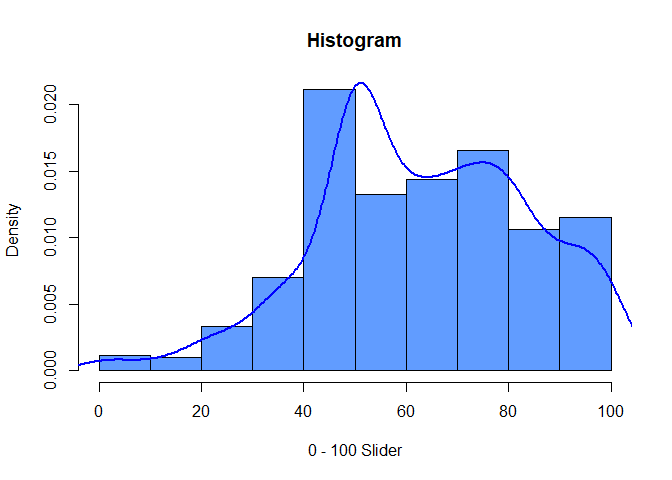<!-- -->


#### Missingness

**Missingness Descriptives**

Delivered / Answered = 691 / 687
Missing = 4
Min = 0, Max = 2, Mean = 0.05, SD = 0.27
(Descriptives are rounded to 2 decimals)

Missingness Intraclass Correlation (ICC) = 1.09 


#### Screenshot


</div>

</div> <!-- Header section -->

<div class = "header-shading">

#### Think about your sleep from last night to this morning: <br>

<div style="font-weight: bold; color: #2a5caa; margin-top: -0.7em; margin-bottom: 1em;">
  <a href="#Item 6302-anchor"> [Item 6302] </a>
</div>


</div>


<!-- Body -->


<div class = "anchor">

<div id="Question 6772-anchor">
  <strong>Question ID</strong>: Question 6772
</div>

**Way the question was delivered:** Informational Fullscreen

**Type of data:** NA

</div> <div class = "anchor">


</div> <!-- Header section -->

<div class = "header-shading">

#### How many minutes did it take for you to fall asleep? <br>

<div style="font-weight: bold; color: #2a5caa; margin-top: -0.7em; margin-bottom: 1em;">
  <a href="#Item 6305-anchor"> [Item 6305] </a>
</div>


</div>


<!-- Body -->


<div class = "anchor">

<div id="Question 6775-anchor">
  <strong>Question ID</strong>: Question 6775
</div>

**Way the question was delivered:** Free Response

**Type of data:** character

</div> <div class = "anchor">


<button 
  onclick="let e = document.getElementById('Question 6775');
           let arrow = document.getElementById('Question 6775_arrow');
           e.style.display = e.style.display === 'none' ? 'block' : 'none';
           arrow.textContent = e.style.display === 'none' ? '▼' : '▲';"
  style="background: none; border: none; padding: 0; font-weight: bold; font-size: 18px; color: #2a5caa; cursor: pointer;">
Click to view visuals <span id="Question 6775_arrow">▼</span>
</button>

<div id="Question 6775" style="display: none;">


<!-- TOC-IGNORE-BEGIN -->

### Descriptives {.tabset}


#### Missingness

**Missingness Descriptives**

Delivered / Answered = 48 / 48
Missing = 0
Min = 0, Max = 0, Mean = 0, SD = 0
(Descriptives are rounded to 2 decimals)

Missingness Intraclass Correlation (ICC) = NaN 


#### Screenshot


</div>


</div> <!-- Header section -->

<div class = "header-shading">

#### Did you wake up during the night (Not counting your final wake-up in the morning)? <br>

<div style="font-weight: bold; color: #2a5caa; margin-top: -0.7em; margin-bottom: 1em;">
  <a href="#Item 6306-anchor"> [Item 6306] </a>
</div>


</div>


<!-- Body -->


<div class = "anchor">

<div id="Question 6776-anchor">
  <strong>Question ID</strong>: Question 6776
</div>

**Way the question was delivered:** Multiple Choice

**Type of data:** integer

</div> 
<div class = "anchor">


<button 
  onclick="let e = document.getElementById('Question 6776');
           let arrow = document.getElementById('Question 6776_arrow');
           e.style.display = e.style.display === 'none' ? 'block' : 'none';
           arrow.textContent = e.style.display === 'none' ? '▼' : '▲';"
  style="background: none; border: none; padding: 0; font-weight: bold; font-size: 18px; color: #2a5caa; cursor: pointer;">
Click to view visuals <span id="Question 6776_arrow">▼</span>
</button>

<div id="Question 6776" style="display: none;">


<!-- TOC-IGNORE-BEGIN -->

### Descriptives {.tabset}


#### Frequency Table

<table class="table" style="color: black; margin-left: auto; margin-right: auto;">
 <thead>
  <tr>
   <th style="text-align:left;"> Value </th>
   <th style="text-align:left;"> Label </th>
   <th style="text-align:left;"> Counts </th>
   <th style="text-align:left;"> Percentages </th>
  </tr>
 </thead>
<tbody>
  <tr>
   <td style="text-align:left;"> 1 </td>
   <td style="text-align:left;"> Yes </td>
   <td style="text-align:left;color: darkgreen !important;"> N = 13 </td>
   <td style="text-align:left;"> 27.1% </td>
  </tr>
  <tr>
   <td style="text-align:left;"> 2 </td>
   <td style="text-align:left;"> No </td>
   <td style="text-align:left;color: darkgreen !important;"> N = 35 </td>
   <td style="text-align:left;"> 72.9% </td>
  </tr>
</tbody>
</table>


#### Barplot

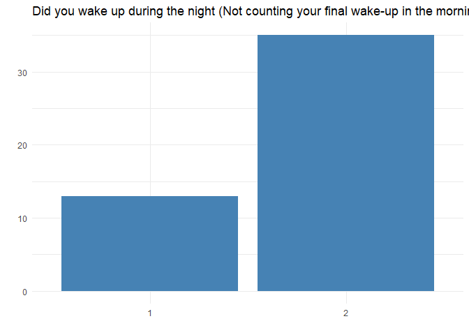<!-- -->


#### Missingness

**Missingness Descriptives**

Delivered / Answered = 48 / 48
Missing = 0
Min = 0, Max = 0, Mean = 0, SD = 0
(Descriptives are rounded to 2 decimals)

Missingness Intraclass Correlation (ICC) = NaN 


#### Screenshot


</div>


</div> 
### Block: Item 6307 <!-- Header section -->

<div class = "header-shading">

#### How would you rate the quality of your sleep? <br>

<div style="font-weight: bold; color: #2a5caa; margin-top: -0.7em; margin-bottom: 1em;">
  <a href="#Item 6309-anchor"> [Item 6309] </a>
</div>


</div>


<!-- Body -->


<div class = "anchor">

<div id="Question 6781-anchor">
  <strong>Question ID</strong>: Question 6781
</div>

**Way the question was delivered:** Slider

**Type of data:** numeric

</div> <div class = "anchor">


**Descriptives**
Min = 13, Max = 100, Mean = 59.92, SD = 23.17 


<button 
  onclick="let e = document.getElementById('Question 6781');
           let arrow = document.getElementById('Question 6781_arrow');
           e.style.display = e.style.display === 'none' ? 'block' : 'none';
           arrow.textContent = e.style.display === 'none' ? '▼' : '▲';"
  style="background: none; border: none; padding: 0; font-weight: bold; font-size: 18px; color: #2a5caa; cursor: pointer;">
Click to view visuals <span id="Question 6781_arrow">▼</span>
</button>

<div id="Question 6781" style="display: none;">


<!-- TOC-IGNORE-BEGIN -->

### Descriptives {.tabset}


#### Histogram

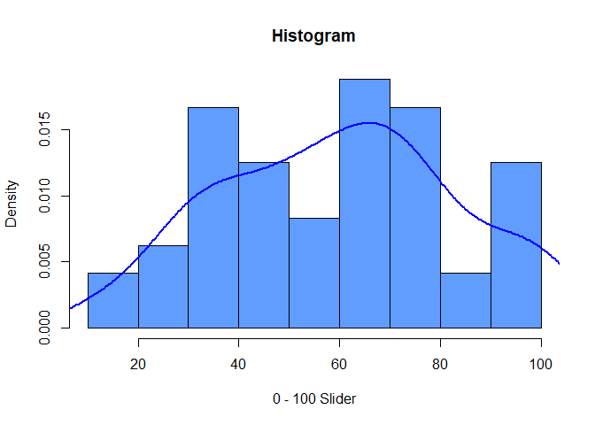<!-- -->


#### Missingness

**Missingness Descriptives**

Delivered / Answered = 48 / 48
Missing = 0
Min = 0, Max = 0, Mean = 0, SD = 0
(Descriptives are rounded to 2 decimals)

Missingness Intraclass Correlation (ICC) = NaN 


#### Screenshot


</div>

</div> 
## Child Morning EMA Survey ID 99
###  <!-- Header section -->

<div class = "header-shading">

#### Since your last survey did you let your parent know about... <br>

<div style="font-weight: bold; color: #2a5caa; margin-top: -0.7em; margin-bottom: 1em;">
  <a href="#Item 872-anchor"> [Item 872] </a>
</div>


</div>


<!-- Body -->


<div class = "anchor">

<div id="Question 4118-anchor">
  <strong>Question ID</strong>: Question 4118
</div>

**Way the question was delivered:** Multiple Select

**Type of data:** integer

</div> 
<div class = "anchor">


<button 
  onclick="let e = document.getElementById('Question 4118');
           let arrow = document.getElementById('Question 4118_arrow');
           e.style.display = e.style.display === 'none' ? 'block' : 'none';
           arrow.textContent = e.style.display === 'none' ? '▼' : '▲';"
  style="background: none; border: none; padding: 0; font-weight: bold; font-size: 18px; color: #2a5caa; cursor: pointer;">
Click to view visuals <span id="Question 4118_arrow">▼</span>
</button>

<div id="Question 4118" style="display: none;">


<!-- TOC-IGNORE-BEGIN -->

### Descriptives {.tabset}


#### Frequency Table

<table class="table" style="color: black; margin-left: auto; margin-right: auto;">
 <thead>
  <tr>
   <th style="text-align:left;"> Value </th>
   <th style="text-align:left;"> Label </th>
   <th style="text-align:left;"> Counts </th>
   <th style="text-align:left;"> Percentages </th>
  </tr>
 </thead>
<tbody>
  <tr>
   <td style="text-align:left;"> 1 </td>
   <td style="text-align:left;"> How you felt </td>
   <td style="text-align:left;color: darkgreen !important;"> N = 80 </td>
   <td style="text-align:left;"> 15.1% </td>
  </tr>
  <tr>
   <td style="text-align:left;"> 2 </td>
   <td style="text-align:left;"> A problem or challenge you had </td>
   <td style="text-align:left;color: darkgreen !important;"> N = 64 </td>
   <td style="text-align:left;"> 12.1% </td>
  </tr>
  <tr>
   <td style="text-align:left;"> 3 </td>
   <td style="text-align:left;"> A problem or challenge that someone else had </td>
   <td style="text-align:left;color: darkgreen !important;"> N = 15 </td>
   <td style="text-align:left;"> 2.8% </td>
  </tr>
  <tr>
   <td style="text-align:left;"> 4 </td>
   <td style="text-align:left;"> None apply </td>
   <td style="text-align:left;color: darkgreen !important;"> N = 370 </td>
   <td style="text-align:left;"> 69.9% </td>
  </tr>
</tbody>
</table>


#### Barplot

<!-- -->


#### Missingness

**Missingness Descriptives**

Delivered / Answered = 487 / 486
Missing = 1
Min = 0, Max = 1, Mean = 0.01, SD = 0.09
(Descriptives are rounded to 2 decimals)

Missingness Intraclass Correlation (ICC) = 1.34 


#### Screenshot


</div>


</div> <!-- Header section -->

<div class = "header-shading">

#### Give you information, or ideas about how to make things better <br>

<div style="font-weight: bold; color: #2a5caa; margin-top: -0.7em; margin-bottom: 1em;">
  <a href="#Item 874-anchor"> [Item 874] </a>
</div>


</div>


<!-- Body -->


<div class = "anchor">

<div id="Question 5629-anchor">
  <strong>Question ID</strong>: Question 5629
</div>

**Way the question was delivered:** Slider

**Type of data:** numeric

</div> <div class = "anchor">


**Descriptives**
Min = 0, Max = 100, Mean = 43.8, SD = 32.65 


<button 
  onclick="let e = document.getElementById('Question 5629');
           let arrow = document.getElementById('Question 5629_arrow');
           e.style.display = e.style.display === 'none' ? 'block' : 'none';
           arrow.textContent = e.style.display === 'none' ? '▼' : '▲';"
  style="background: none; border: none; padding: 0; font-weight: bold; font-size: 18px; color: #2a5caa; cursor: pointer;">
Click to view visuals <span id="Question 5629_arrow">▼</span>
</button>

<div id="Question 5629" style="display: none;">


<!-- TOC-IGNORE-BEGIN -->

### Descriptives {.tabset}


#### Histogram

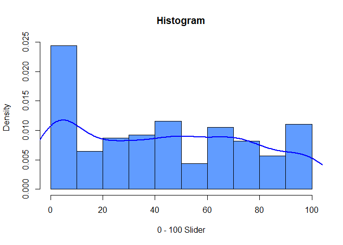<!-- -->


#### Missingness

**Missingness Descriptives**

Delivered / Answered = 390 / 390
Missing = 0
Min = 0, Max = 0, Mean = 0, SD = 0
(Descriptives are rounded to 2 decimals)

Missingness Intraclass Correlation (ICC) = NaN 


#### Screenshot


</div>

</div> <!-- Header section -->

<div class = "header-shading">

#### Do something to help you (ex: pick you up, help with homework) <br>

<div style="font-weight: bold; color: #2a5caa; margin-top: -0.7em; margin-bottom: 1em;">
  <a href="#Item 875-anchor"> [Item 875] </a>
</div>


</div>


<!-- Body -->


<div class = "anchor">

<div id="Question 1355-anchor">
  <strong>Question ID</strong>: Question 1355
</div>

**Way the question was delivered:** Slider

**Type of data:** numeric

</div> <div class = "anchor">


**Descriptives**
Min = 0, Max = 100, Mean = 48.05, SD = 33.42 


<button 
  onclick="let e = document.getElementById('Question 1355');
           let arrow = document.getElementById('Question 1355_arrow');
           e.style.display = e.style.display === 'none' ? 'block' : 'none';
           arrow.textContent = e.style.display === 'none' ? '▼' : '▲';"
  style="background: none; border: none; padding: 0; font-weight: bold; font-size: 18px; color: #2a5caa; cursor: pointer;">
Click to view visuals <span id="Question 1355_arrow">▼</span>
</button>

<div id="Question 1355" style="display: none;">


<!-- TOC-IGNORE-BEGIN -->

### Descriptives {.tabset}


#### Histogram

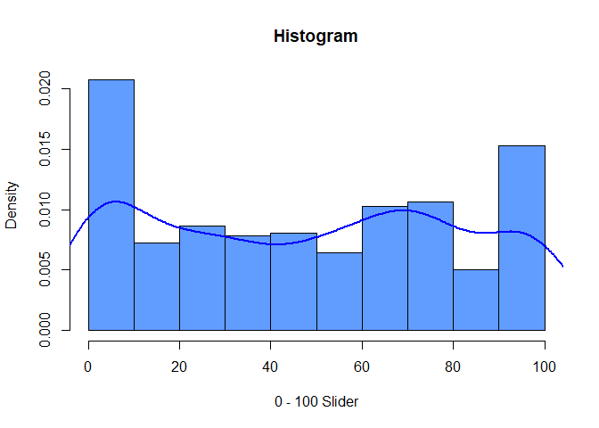<!-- -->


#### Missingness

**Missingness Descriptives**

Delivered / Answered = 499 / 498
Missing = 1
Min = 0, Max = 1, Mean = 0.01, SD = 0.09
(Descriptives are rounded to 2 decimals)

Missingness Intraclass Correlation (ICC) = 1.33 


#### Screenshot


</div>

</div> <!-- Header section -->

<div class = "header-shading">

#### Give you emotional support (ex: listen to and comfort you) <br>

<div style="font-weight: bold; color: #2a5caa; margin-top: -0.7em; margin-bottom: 1em;">
  <a href="#Item 879-anchor"> [Item 879] </a>
</div>


</div>


<!-- Body -->


<div class = "anchor">

<div id="Question 1810-anchor">
  <strong>Question ID</strong>: Question 1810
</div>

**Way the question was delivered:** Slider

**Type of data:** numeric

</div> <div class = "anchor">


**Descriptives**
Min = 0, Max = 100, Mean = 42.68, SD = 31.18 


<button 
  onclick="let e = document.getElementById('Question 1810');
           let arrow = document.getElementById('Question 1810_arrow');
           e.style.display = e.style.display === 'none' ? 'block' : 'none';
           arrow.textContent = e.style.display === 'none' ? '▼' : '▲';"
  style="background: none; border: none; padding: 0; font-weight: bold; font-size: 18px; color: #2a5caa; cursor: pointer;">
Click to view visuals <span id="Question 1810_arrow">▼</span>
</button>

<div id="Question 1810" style="display: none;">


<!-- TOC-IGNORE-BEGIN -->

### Descriptives {.tabset}


#### Histogram

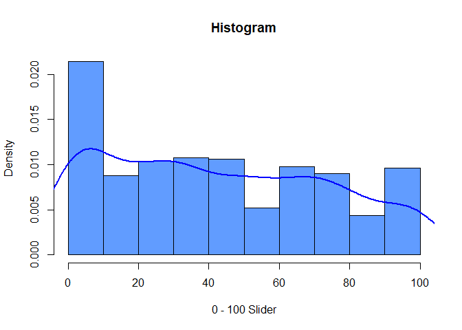<!-- -->


#### Missingness

**Missingness Descriptives**

Delivered / Answered = 501 / 500
Missing = 1
Min = 0, Max = 1, Mean = 0.01, SD = 0.09
(Descriptives are rounded to 2 decimals)

Missingness Intraclass Correlation (ICC) = 1.33 


#### Screenshot


</div>

</div> 
### Block: Item 1136 <!-- Header section -->

<div class = "header-shading">

#### Overall, how helpful was your parent? <br>

<div style="font-weight: bold; color: #2a5caa; margin-top: -0.7em; margin-bottom: 1em;">
  <a href="#Item 1143-anchor"> [Item 1143] </a>
</div>


</div>


<!-- Body -->


<div class = "anchor">

<div id="Question 2071-anchor">
  <strong>Question ID</strong>: Question 2071
</div>

**Way the question was delivered:** Slider

**Type of data:** numeric

</div> <div class = "anchor">


**Descriptives**
Min = 0, Max = 100, Mean = 70.62, SD = 22.49 


<button 
  onclick="let e = document.getElementById('Question 2071');
           let arrow = document.getElementById('Question 2071_arrow');
           e.style.display = e.style.display === 'none' ? 'block' : 'none';
           arrow.textContent = e.style.display === 'none' ? '▼' : '▲';"
  style="background: none; border: none; padding: 0; font-weight: bold; font-size: 18px; color: #2a5caa; cursor: pointer;">
Click to view visuals <span id="Question 2071_arrow">▼</span>
</button>

<div id="Question 2071" style="display: none;">


<!-- TOC-IGNORE-BEGIN -->

### Descriptives {.tabset}


#### Histogram

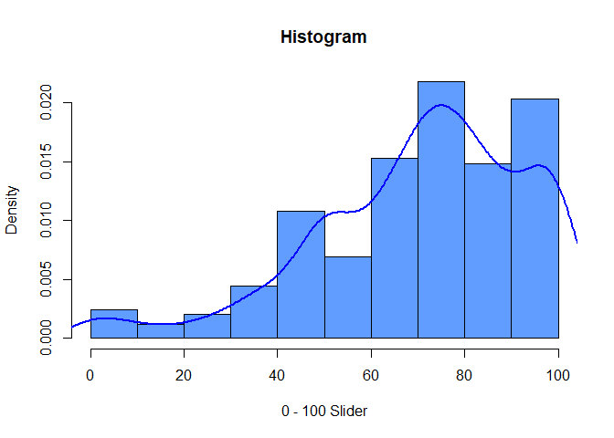<!-- -->


#### Missingness

**Missingness Descriptives**

Delivered / Answered = 493 / 492
Missing = 1
Min = 0, Max = 1, Mean = 0.01, SD = 0.09
(Descriptives are rounded to 2 decimals)

Missingness Intraclass Correlation (ICC) = 1.34 


#### Screenshot


</div>

</div> <!-- Header section -->

<div class = "header-shading">

#### How much did you want your parent to... <br>

<div style="font-weight: bold; color: #2a5caa; margin-top: -0.7em; margin-bottom: 1em;">
  <a href="#Item 1144-anchor"> [Item 1144] </a>
</div>


</div>


<!-- Body -->


<div class = "anchor">

<div id="Question 2070-anchor">
  <strong>Question ID</strong>: Question 2070
</div>

**Way the question was delivered:** Informational Fullscreen

**Type of data:** NA

</div> <div class = "anchor">


</div> <!-- Header section -->

<div class = "header-shading">

#### End Block <br>

<div style="font-weight: bold; color: #2a5caa; margin-top: -0.7em; margin-bottom: 1em;">
  <a href="#Item 1199-anchor"> [Item 1199] </a>
</div>


</div>


<!-- Body -->


<div class = "anchor">

<div id="Question 2072-anchor">
  <strong>Question ID</strong>: Question 2072
</div>

**Way the question was delivered:** End Block

**Type of data:** NA

</div>  
### Block: Item 1361 <!-- Header section -->

<div class = "header-shading">

#### Since your last survey, did you experience any stressful events at home, school or elsewhere? <br>

<div style="font-weight: bold; color: #2a5caa; margin-top: -0.7em; margin-bottom: 1em;">
  <a href="#Item 4463-anchor"> [Item 4463] </a>
</div>


</div>


<!-- Body -->


<div class = "anchor">

<div id="Question 4115-anchor">
  <strong>Question ID</strong>: Question 4115
</div>

**Way the question was delivered:** Multiple Choice

**Type of data:** integer

</div> 
<div class = "anchor">


<button 
  onclick="let e = document.getElementById('Question 4115');
           let arrow = document.getElementById('Question 4115_arrow');
           e.style.display = e.style.display === 'none' ? 'block' : 'none';
           arrow.textContent = e.style.display === 'none' ? '▼' : '▲';"
  style="background: none; border: none; padding: 0; font-weight: bold; font-size: 18px; color: #2a5caa; cursor: pointer;">
Click to view visuals <span id="Question 4115_arrow">▼</span>
</button>

<div id="Question 4115" style="display: none;">


<!-- TOC-IGNORE-BEGIN -->

### Descriptives {.tabset}


#### Frequency Table

<table class="table" style="color: black; margin-left: auto; margin-right: auto;">
 <thead>
  <tr>
   <th style="text-align:left;"> Value </th>
   <th style="text-align:left;"> Label </th>
   <th style="text-align:left;"> Counts </th>
   <th style="text-align:left;"> Percentages </th>
  </tr>
 </thead>
<tbody>
  <tr>
   <td style="text-align:left;"> 1 </td>
   <td style="text-align:left;"> Yes </td>
   <td style="text-align:left;color: darkgreen !important;"> N = 70 </td>
   <td style="text-align:left;"> 7.7% </td>
  </tr>
  <tr>
   <td style="text-align:left;"> 2 </td>
   <td style="text-align:left;"> No </td>
   <td style="text-align:left;color: darkgreen !important;"> N = 836 </td>
   <td style="text-align:left;"> 92.3% </td>
  </tr>
</tbody>
</table>


#### Barplot

<!-- -->


#### Missingness

**Missingness Descriptives**

Delivered / Answered = 906 / 906
Missing = 0
Min = 0, Max = 0, Mean = 0, SD = 0
(Descriptives are rounded to 2 decimals)

Missingness Intraclass Correlation (ICC) = NaN 


#### Screenshot


</div>


</div> <!-- Header section -->

<div class = "header-shading">

#### Since your last survey, did you see or communicate with your parent? <br>

<div style="font-weight: bold; color: #2a5caa; margin-top: -0.7em; margin-bottom: 1em;">
  <a href="#Item 4464-anchor"> [Item 4464] </a>
</div>


</div>


<!-- Body -->


<div class = "anchor">

<div id="Question 4116-anchor">
  <strong>Question ID</strong>: Question 4116
</div>

**Way the question was delivered:** Multiple Choice

**Type of data:** integer

</div> 
<div class = "anchor">


<button 
  onclick="let e = document.getElementById('Question 4116');
           let arrow = document.getElementById('Question 4116_arrow');
           e.style.display = e.style.display === 'none' ? 'block' : 'none';
           arrow.textContent = e.style.display === 'none' ? '▼' : '▲';"
  style="background: none; border: none; padding: 0; font-weight: bold; font-size: 18px; color: #2a5caa; cursor: pointer;">
Click to view visuals <span id="Question 4116_arrow">▼</span>
</button>

<div id="Question 4116" style="display: none;">


<!-- TOC-IGNORE-BEGIN -->

### Descriptives {.tabset}


#### Frequency Table

<table class="table" style="color: black; margin-left: auto; margin-right: auto;">
 <thead>
  <tr>
   <th style="text-align:left;"> Value </th>
   <th style="text-align:left;"> Label </th>
   <th style="text-align:left;"> Counts </th>
   <th style="text-align:left;"> Percentages </th>
  </tr>
 </thead>
<tbody>
  <tr>
   <td style="text-align:left;"> 1 </td>
   <td style="text-align:left;"> Yes </td>
   <td style="text-align:left;color: darkgreen !important;"> N = 492 </td>
   <td style="text-align:left;"> 54.5% </td>
  </tr>
  <tr>
   <td style="text-align:left;"> 2 </td>
   <td style="text-align:left;"> No </td>
   <td style="text-align:left;color: darkgreen !important;"> N = 411 </td>
   <td style="text-align:left;"> 45.5% </td>
  </tr>
</tbody>
</table>


#### Barplot

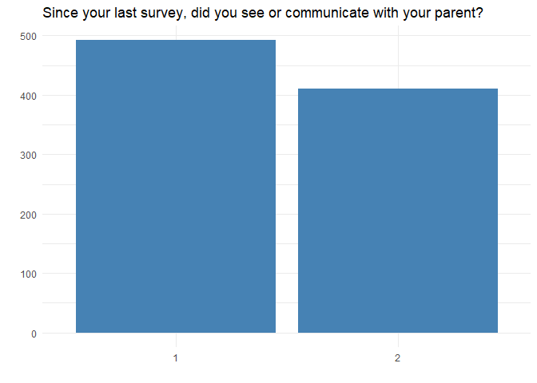<!-- -->


#### Missingness

**Missingness Descriptives**

Delivered / Answered = 904 / 903
Missing = 1
Min = 0, Max = 1, Mean = 0.01, SD = 0.09
(Descriptives are rounded to 2 decimals)

Missingness Intraclass Correlation (ICC) = 1.16 


#### Screenshot


</div>


</div> 
### Block: Item 5539 <!-- Header section -->

<div class = "header-shading">

#### Think about your sleep from last night to this morning: <br>

<div style="font-weight: bold; color: #2a5caa; margin-top: -0.7em; margin-bottom: 1em;">
  <a href="#Item 6302-anchor"> [Item 6302] </a>
</div>


</div>


<!-- Body -->


<div class = "anchor">

<div id="Question 6782-anchor">
  <strong>Question ID</strong>: Question 6782
</div>

**Way the question was delivered:** Informational Fullscreen

**Type of data:** NA

</div> <div class = "anchor">


</div> <!-- Header section -->

<div class = "header-shading">

#### How many minutes did it take for you to fall asleep? <br>

<div style="font-weight: bold; color: #2a5caa; margin-top: -0.7em; margin-bottom: 1em;">
  <a href="#Item 6305-anchor"> [Item 6305] </a>
</div>


</div>


<!-- Body -->


<div class = "anchor">

<div id="Question 6785-anchor">
  <strong>Question ID</strong>: Question 6785
</div>

**Way the question was delivered:** Free Response

**Type of data:** character

</div> <div class = "anchor">


<button 
  onclick="let e = document.getElementById('Question 6785');
           let arrow = document.getElementById('Question 6785_arrow');
           e.style.display = e.style.display === 'none' ? 'block' : 'none';
           arrow.textContent = e.style.display === 'none' ? '▼' : '▲';"
  style="background: none; border: none; padding: 0; font-weight: bold; font-size: 18px; color: #2a5caa; cursor: pointer;">
Click to view visuals <span id="Question 6785_arrow">▼</span>
</button>

<div id="Question 6785" style="display: none;">


<!-- TOC-IGNORE-BEGIN -->

### Descriptives {.tabset}


#### Missingness

**Missingness Descriptives**

Delivered / Answered = 466 / 466
Missing = 0
Min = 0, Max = 0, Mean = 0, SD = 0
(Descriptives are rounded to 2 decimals)

Missingness Intraclass Correlation (ICC) = NaN 


#### Screenshot


</div>


</div> <!-- Header section -->

<div class = "header-shading">

#### Did you wake up during the night (Not counting your final wake-up in the morning)? <br>

<div style="font-weight: bold; color: #2a5caa; margin-top: -0.7em; margin-bottom: 1em;">
  <a href="#Item 6306-anchor"> [Item 6306] </a>
</div>


</div>


<!-- Body -->


<div class = "anchor">

<div id="Question 6786-anchor">
  <strong>Question ID</strong>: Question 6786
</div>

**Way the question was delivered:** Multiple Choice

**Type of data:** integer

</div> 
<div class = "anchor">


<button 
  onclick="let e = document.getElementById('Question 6786');
           let arrow = document.getElementById('Question 6786_arrow');
           e.style.display = e.style.display === 'none' ? 'block' : 'none';
           arrow.textContent = e.style.display === 'none' ? '▼' : '▲';"
  style="background: none; border: none; padding: 0; font-weight: bold; font-size: 18px; color: #2a5caa; cursor: pointer;">
Click to view visuals <span id="Question 6786_arrow">▼</span>
</button>

<div id="Question 6786" style="display: none;">


<!-- TOC-IGNORE-BEGIN -->

### Descriptives {.tabset}


#### Frequency Table

<table class="table" style="color: black; margin-left: auto; margin-right: auto;">
 <thead>
  <tr>
   <th style="text-align:left;"> Value </th>
   <th style="text-align:left;"> Label </th>
   <th style="text-align:left;"> Counts </th>
   <th style="text-align:left;"> Percentages </th>
  </tr>
 </thead>
<tbody>
  <tr>
   <td style="text-align:left;"> 1 </td>
   <td style="text-align:left;"> Yes </td>
   <td style="text-align:left;color: darkgreen !important;"> N = 116 </td>
   <td style="text-align:left;"> 24.9% </td>
  </tr>
  <tr>
   <td style="text-align:left;"> 2 </td>
   <td style="text-align:left;"> No </td>
   <td style="text-align:left;color: darkgreen !important;"> N = 350 </td>
   <td style="text-align:left;"> 75.1% </td>
  </tr>
</tbody>
</table>


#### Barplot

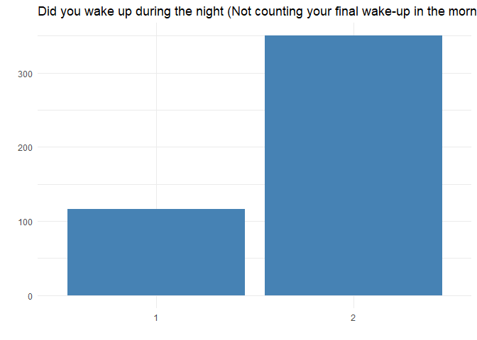<!-- -->


#### Missingness

**Missingness Descriptives**

Delivered / Answered = 466 / 466
Missing = 0
Min = 0, Max = 0, Mean = 0, SD = 0
(Descriptives are rounded to 2 decimals)

Missingness Intraclass Correlation (ICC) = NaN 


#### Screenshot


</div>


</div> 
### Block: Item 6307 <!-- Header section -->

<div class = "header-shading">

#### How would you rate the quality of your sleep? <br>

<div style="font-weight: bold; color: #2a5caa; margin-top: -0.7em; margin-bottom: 1em;">
  <a href="#Item 6309-anchor"> [Item 6309] </a>
</div>


</div>


<!-- Body -->


<div class = "anchor">

<div id="Question 6791-anchor">
  <strong>Question ID</strong>: Question 6791
</div>

**Way the question was delivered:** Slider

**Type of data:** numeric

</div> <div class = "anchor">


**Descriptives**
Min = 0, Max = 100, Mean = 69.18, SD = 23.77 


<button 
  onclick="let e = document.getElementById('Question 6791');
           let arrow = document.getElementById('Question 6791_arrow');
           e.style.display = e.style.display === 'none' ? 'block' : 'none';
           arrow.textContent = e.style.display === 'none' ? '▼' : '▲';"
  style="background: none; border: none; padding: 0; font-weight: bold; font-size: 18px; color: #2a5caa; cursor: pointer;">
Click to view visuals <span id="Question 6791_arrow">▼</span>
</button>

<div id="Question 6791" style="display: none;">


<!-- TOC-IGNORE-BEGIN -->

### Descriptives {.tabset}


#### Histogram

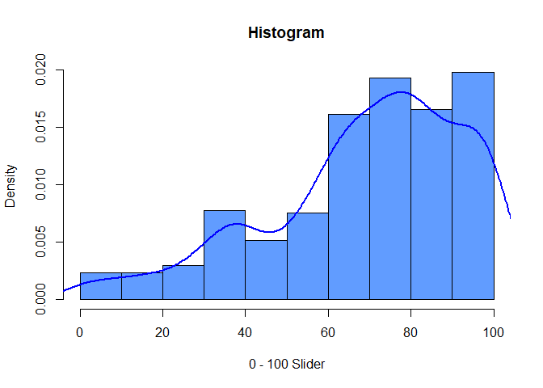<!-- -->


#### Missingness

**Missingness Descriptives**

Delivered / Answered = 465 / 465
Missing = 0
Min = 0, Max = 0, Mean = 0, SD = 0
(Descriptives are rounded to 2 decimals)

Missingness Intraclass Correlation (ICC) = NaN 


#### Screenshot


</div>

</div> <!-- Header section -->

<div class = "header-shading">

#### How bothered or stressed were you because of this? <br>

<div style="font-weight: bold; color: #2a5caa; margin-top: -0.7em; margin-bottom: 1em;">
  <a href="#Item 1118-anchor"> [Item 1118] </a>
</div>


</div>


<!-- Body -->


<div class = "anchor">

<div id="Question 1795-anchor">
  <strong>Question ID</strong>: Question 1795
</div>

**Way the question was delivered:** Slider

**Type of data:** numeric

</div> <div class = "anchor">


**Descriptives**
Min = NA, Max = NA, Mean = NA, SD = NA 


<button 
  onclick="let e = document.getElementById('Question 1795');
           let arrow = document.getElementById('Question 1795_arrow');
           e.style.display = e.style.display === 'none' ? 'block' : 'none';
           arrow.textContent = e.style.display === 'none' ? '▼' : '▲';"
  style="background: none; border: none; padding: 0; font-weight: bold; font-size: 18px; color: #2a5caa; cursor: pointer;">
Click to view visuals <span id="Question 1795_arrow">▼</span>
</button>

<div id="Question 1795" style="display: none;">


<!-- TOC-IGNORE-BEGIN -->

### Descriptives {.tabset}


#### Missingness

**Missingness Descriptives**

Delivered / Answered = 0 / 0
Missing = 0
Min = NA, Max = NA, Mean = NA, SD = NA
(Descriptives are rounded to 2 decimals)

Missingness Intraclass Correlation (ICC) = NA 


#### Screenshot


</div>

</div> <!-- Header section -->

<div class = "header-shading">

#### With whom did you have an argument or disagreement? <br>

<div style="font-weight: bold; color: #2a5caa; margin-top: -0.7em; margin-bottom: 1em;">
  <a href="#Item 1119-anchor"> [Item 1119] </a>
</div>


</div>


<!-- Body -->


<div class = "anchor">

<div id="Question 1796-anchor">
  <strong>Question ID</strong>: Question 1796
</div>

**Way the question was delivered:** Multiple Select

**Type of data:** integer

</div> 
<div class = "anchor">


<button 
  onclick="let e = document.getElementById('Question 1796');
           let arrow = document.getElementById('Question 1796_arrow');
           e.style.display = e.style.display === 'none' ? 'block' : 'none';
           arrow.textContent = e.style.display === 'none' ? '▼' : '▲';"
  style="background: none; border: none; padding: 0; font-weight: bold; font-size: 18px; color: #2a5caa; cursor: pointer;">
Click to view visuals <span id="Question 1796_arrow">▼</span>
</button>

<div id="Question 1796" style="display: none;">


<!-- TOC-IGNORE-BEGIN -->

### Descriptives {.tabset}


<table class="table" style="color: black; margin-left: auto; margin-right: auto;">
 <thead>
  <tr>
   <th style="text-align:right;"> Value </th>
   <th style="text-align:left;"> Label </th>
   <th style="text-align:left;"> Counts </th>
   <th style="text-align:left;"> Percentages </th>
  </tr>
 </thead>
<tbody>
  <tr>
   <td style="text-align:right;"> 1 </td>
   <td style="text-align:left;"> Parents </td>
   <td style="text-align:left;color: darkgreen !important;"> N = 0 </td>
   <td style="text-align:left;"> 0% </td>
  </tr>
  <tr>
   <td style="text-align:right;"> 2 </td>
   <td style="text-align:left;"> Siblings </td>
   <td style="text-align:left;color: darkgreen !important;"> N = 0 </td>
   <td style="text-align:left;"> 0% </td>
  </tr>
  <tr>
   <td style="text-align:right;"> 3 </td>
   <td style="text-align:left;"> Friends, other people your age </td>
   <td style="text-align:left;color: darkgreen !important;"> N = 0 </td>
   <td style="text-align:left;"> 0% </td>
  </tr>
  <tr>
   <td style="text-align:right;"> 4 </td>
   <td style="text-align:left;"> Teachers, coaches, other adults </td>
   <td style="text-align:left;color: darkgreen !important;"> N = 0 </td>
   <td style="text-align:left;"> 0% </td>
  </tr>
  <tr>
   <td style="text-align:right;"> 5 </td>
   <td style="text-align:left;"> Other (ex: cashier, a stranger) </td>
   <td style="text-align:left;color: darkgreen !important;"> N = 0 </td>
   <td style="text-align:left;"> 0% </td>
  </tr>
</tbody>
</table>


#### Missingness

**Missingness Descriptives**

Delivered / Answered = 0 / 0
Missing = 0
Min = NA, Max = NA, Mean = NA, SD = NA
(Descriptives are rounded to 2 decimals)

Missingness Intraclass Correlation (ICC) = NA 


#### Screenshot


</div>


</div> <!-- Header section -->

<div class = "header-shading">

#### How bothered or stressed were you because of this? <br>

<div style="font-weight: bold; color: #2a5caa; margin-top: -0.7em; margin-bottom: 1em;">
  <a href="#Item 1122-anchor"> [Item 1122] </a>
</div>


</div>


<!-- Body -->


<div class = "anchor">

<div id="Question 1798-anchor">
  <strong>Question ID</strong>: Question 1798
</div>

**Way the question was delivered:** Slider

**Type of data:** numeric

</div> <div class = "anchor">


**Descriptives**
Min = NA, Max = NA, Mean = NA, SD = NA 


<button 
  onclick="let e = document.getElementById('Question 1798');
           let arrow = document.getElementById('Question 1798_arrow');
           e.style.display = e.style.display === 'none' ? 'block' : 'none';
           arrow.textContent = e.style.display === 'none' ? '▼' : '▲';"
  style="background: none; border: none; padding: 0; font-weight: bold; font-size: 18px; color: #2a5caa; cursor: pointer;">
Click to view visuals <span id="Question 1798_arrow">▼</span>
</button>

<div id="Question 1798" style="display: none;">


<!-- TOC-IGNORE-BEGIN -->

### Descriptives {.tabset}


#### Missingness

**Missingness Descriptives**

Delivered / Answered = 0 / 0
Missing = 0
Min = NA, Max = NA, Mean = NA, SD = NA
(Descriptives are rounded to 2 decimals)

Missingness Intraclass Correlation (ICC) = NA 


#### Screenshot


</div>

</div> <!-- Header section -->

<div class = "header-shading">

#### Where did you feel this way? <br>

<div style="font-weight: bold; color: #2a5caa; margin-top: -0.7em; margin-bottom: 1em;">
  <a href="#Item 1123-anchor"> [Item 1123] </a>
</div>


</div>


<!-- Body -->


<div class = "anchor">

<div id="Question 1799-anchor">
  <strong>Question ID</strong>: Question 1799
</div>

**Way the question was delivered:** Multiple Select

**Type of data:** integer

</div> 
<div class = "anchor">


<button 
  onclick="let e = document.getElementById('Question 1799');
           let arrow = document.getElementById('Question 1799_arrow');
           e.style.display = e.style.display === 'none' ? 'block' : 'none';
           arrow.textContent = e.style.display === 'none' ? '▼' : '▲';"
  style="background: none; border: none; padding: 0; font-weight: bold; font-size: 18px; color: #2a5caa; cursor: pointer;">
Click to view visuals <span id="Question 1799_arrow">▼</span>
</button>

<div id="Question 1799" style="display: none;">


<!-- TOC-IGNORE-BEGIN -->

### Descriptives {.tabset}


<table class="table" style="color: black; margin-left: auto; margin-right: auto;">
 <thead>
  <tr>
   <th style="text-align:right;"> Value </th>
   <th style="text-align:left;"> Label </th>
   <th style="text-align:left;"> Counts </th>
   <th style="text-align:left;"> Percentages </th>
  </tr>
 </thead>
<tbody>
  <tr>
   <td style="text-align:right;"> 1 </td>
   <td style="text-align:left;"> Home </td>
   <td style="text-align:left;color: darkgreen !important;"> N = 0 </td>
   <td style="text-align:left;"> 0% </td>
  </tr>
  <tr>
   <td style="text-align:right;"> 2 </td>
   <td style="text-align:left;"> School or extracurricular activity </td>
   <td style="text-align:left;color: darkgreen !important;"> N = 0 </td>
   <td style="text-align:left;"> 0% </td>
  </tr>
  <tr>
   <td style="text-align:right;"> 3 </td>
   <td style="text-align:left;"> Other (ex: at the store) </td>
   <td style="text-align:left;color: darkgreen !important;"> N = 0 </td>
   <td style="text-align:left;"> 0% </td>
  </tr>
</tbody>
</table>


#### Missingness

**Missingness Descriptives**

Delivered / Answered = 0 / 0
Missing = 0
Min = NA, Max = NA, Mean = NA, SD = NA
(Descriptives are rounded to 2 decimals)

Missingness Intraclass Correlation (ICC) = NA 


#### Screenshot


</div>


</div> <!-- Header section -->

<div class = "header-shading">

#### How bothered or stressed were you because of this? <br>

<div style="font-weight: bold; color: #2a5caa; margin-top: -0.7em; margin-bottom: 1em;">
  <a href="#Item 1126-anchor"> [Item 1126] </a>
</div>


</div>


<!-- Body -->


<div class = "anchor">

<div id="Question 1801-anchor">
  <strong>Question ID</strong>: Question 1801
</div>

**Way the question was delivered:** Slider

**Type of data:** numeric

</div> <div class = "anchor">


**Descriptives**
Min = NA, Max = NA, Mean = NA, SD = NA 


<button 
  onclick="let e = document.getElementById('Question 1801');
           let arrow = document.getElementById('Question 1801_arrow');
           e.style.display = e.style.display === 'none' ? 'block' : 'none';
           arrow.textContent = e.style.display === 'none' ? '▼' : '▲';"
  style="background: none; border: none; padding: 0; font-weight: bold; font-size: 18px; color: #2a5caa; cursor: pointer;">
Click to view visuals <span id="Question 1801_arrow">▼</span>
</button>

<div id="Question 1801" style="display: none;">


<!-- TOC-IGNORE-BEGIN -->

### Descriptives {.tabset}


#### Missingness

**Missingness Descriptives**

Delivered / Answered = 0 / 0
Missing = 0
Min = NA, Max = NA, Mean = NA, SD = NA
(Descriptives are rounded to 2 decimals)

Missingness Intraclass Correlation (ICC) = NA 


#### Screenshot


</div>

</div> <!-- Header section -->

<div class = "header-shading">

#### Where did this happen? <br>

<div style="font-weight: bold; color: #2a5caa; margin-top: -0.7em; margin-bottom: 1em;">
  <a href="#Item 1127-anchor"> [Item 1127] </a>
</div>


</div>


<!-- Body -->


<div class = "anchor">

<div id="Question 1802-anchor">
  <strong>Question ID</strong>: Question 1802
</div>

**Way the question was delivered:** Multiple Select

**Type of data:** integer

</div> 
<div class = "anchor">


<button 
  onclick="let e = document.getElementById('Question 1802');
           let arrow = document.getElementById('Question 1802_arrow');
           e.style.display = e.style.display === 'none' ? 'block' : 'none';
           arrow.textContent = e.style.display === 'none' ? '▼' : '▲';"
  style="background: none; border: none; padding: 0; font-weight: bold; font-size: 18px; color: #2a5caa; cursor: pointer;">
Click to view visuals <span id="Question 1802_arrow">▼</span>
</button>

<div id="Question 1802" style="display: none;">


<!-- TOC-IGNORE-BEGIN -->

### Descriptives {.tabset}


<table class="table" style="color: black; margin-left: auto; margin-right: auto;">
 <thead>
  <tr>
   <th style="text-align:right;"> Value </th>
   <th style="text-align:left;"> Label </th>
   <th style="text-align:left;"> Counts </th>
   <th style="text-align:left;"> Percentages </th>
  </tr>
 </thead>
<tbody>
  <tr>
   <td style="text-align:right;"> 1 </td>
   <td style="text-align:left;"> Home </td>
   <td style="text-align:left;color: darkgreen !important;"> N = 0 </td>
   <td style="text-align:left;"> 0% </td>
  </tr>
  <tr>
   <td style="text-align:right;"> 2 </td>
   <td style="text-align:left;"> School or extracurricular activity </td>
   <td style="text-align:left;color: darkgreen !important;"> N = 0 </td>
   <td style="text-align:left;"> 0% </td>
  </tr>
  <tr>
   <td style="text-align:right;"> 3 </td>
   <td style="text-align:left;"> Other (ex: at the store) </td>
   <td style="text-align:left;color: darkgreen !important;"> N = 0 </td>
   <td style="text-align:left;"> 0% </td>
  </tr>
</tbody>
</table>


#### Missingness

**Missingness Descriptives**

Delivered / Answered = 0 / 0
Missing = 0
Min = NA, Max = NA, Mean = NA, SD = NA
(Descriptives are rounded to 2 decimals)

Missingness Intraclass Correlation (ICC) = NA 


#### Screenshot


</div>


</div> <!-- Header section -->

<div class = "header-shading">

#### How bothered or stressed were you because of this? <br>

<div style="font-weight: bold; color: #2a5caa; margin-top: -0.7em; margin-bottom: 1em;">
  <a href="#Item 1130-anchor"> [Item 1130] </a>
</div>


</div>


<!-- Body -->


<div class = "anchor">

<div id="Question 1804-anchor">
  <strong>Question ID</strong>: Question 1804
</div>

**Way the question was delivered:** Slider

**Type of data:** numeric

</div> <div class = "anchor">


**Descriptives**
Min = NA, Max = NA, Mean = NA, SD = NA 


<button 
  onclick="let e = document.getElementById('Question 1804');
           let arrow = document.getElementById('Question 1804_arrow');
           e.style.display = e.style.display === 'none' ? 'block' : 'none';
           arrow.textContent = e.style.display === 'none' ? '▼' : '▲';"
  style="background: none; border: none; padding: 0; font-weight: bold; font-size: 18px; color: #2a5caa; cursor: pointer;">
Click to view visuals <span id="Question 1804_arrow">▼</span>
</button>

<div id="Question 1804" style="display: none;">


<!-- TOC-IGNORE-BEGIN -->

### Descriptives {.tabset}


#### Missingness

**Missingness Descriptives**

Delivered / Answered = 0 / 0
Missing = 0
Min = NA, Max = NA, Mean = NA, SD = NA
(Descriptives are rounded to 2 decimals)

Missingness Intraclass Correlation (ICC) = NA 


#### Screenshot


</div>

</div> <!-- Header section -->

<div class = "header-shading">

#### Who did this problem involve? <br>

<div style="font-weight: bold; color: #2a5caa; margin-top: -0.7em; margin-bottom: 1em;">
  <a href="#Item 1131-anchor"> [Item 1131] </a>
</div>


</div>


<!-- Body -->


<div class = "anchor">

<div id="Question 1805-anchor">
  <strong>Question ID</strong>: Question 1805
</div>

**Way the question was delivered:** Multiple Select

**Type of data:** integer

</div> 
<div class = "anchor">


<button 
  onclick="let e = document.getElementById('Question 1805');
           let arrow = document.getElementById('Question 1805_arrow');
           e.style.display = e.style.display === 'none' ? 'block' : 'none';
           arrow.textContent = e.style.display === 'none' ? '▼' : '▲';"
  style="background: none; border: none; padding: 0; font-weight: bold; font-size: 18px; color: #2a5caa; cursor: pointer;">
Click to view visuals <span id="Question 1805_arrow">▼</span>
</button>

<div id="Question 1805" style="display: none;">


<!-- TOC-IGNORE-BEGIN -->

### Descriptives {.tabset}


<table class="table" style="color: black; margin-left: auto; margin-right: auto;">
 <thead>
  <tr>
   <th style="text-align:right;"> Value </th>
   <th style="text-align:left;"> Label </th>
   <th style="text-align:left;"> Counts </th>
   <th style="text-align:left;"> Percentages </th>
  </tr>
 </thead>
<tbody>
  <tr>
   <td style="text-align:right;"> 1 </td>
   <td style="text-align:left;"> Family </td>
   <td style="text-align:left;color: darkgreen !important;"> N = 0 </td>
   <td style="text-align:left;"> 0% </td>
  </tr>
  <tr>
   <td style="text-align:right;"> 2 </td>
   <td style="text-align:left;"> Friends or someone you know </td>
   <td style="text-align:left;color: darkgreen !important;"> N = 0 </td>
   <td style="text-align:left;"> 0% </td>
  </tr>
  <tr>
   <td style="text-align:right;"> 3 </td>
   <td style="text-align:left;"> Other (ex: strangers) </td>
   <td style="text-align:left;color: darkgreen !important;"> N = 0 </td>
   <td style="text-align:left;"> 0% </td>
  </tr>
</tbody>
</table>


#### Missingness

**Missingness Descriptives**

Delivered / Answered = 0 / 0
Missing = 0
Min = NA, Max = NA, Mean = NA, SD = NA
(Descriptives are rounded to 2 decimals)

Missingness Intraclass Correlation (ICC) = NA 


#### Screenshot


</div>


</div> <!-- Header section -->

<div class = "header-shading">

#### Check all the ways that you interacted with your parent, in person. <br>

<div style="font-weight: bold; color: #2a5caa; margin-top: -0.7em; margin-bottom: 1em;">
  <a href="#Item 1133-anchor"> [Item 1133] </a>
</div>


</div>


<!-- Body -->


<div class = "anchor">

<div id="Question 1807-anchor">
  <strong>Question ID</strong>: Question 1807
</div>

**Way the question was delivered:** Multiple Select

**Type of data:** integer

</div> 
<div class = "anchor">


<button 
  onclick="let e = document.getElementById('Question 1807');
           let arrow = document.getElementById('Question 1807_arrow');
           e.style.display = e.style.display === 'none' ? 'block' : 'none';
           arrow.textContent = e.style.display === 'none' ? '▼' : '▲';"
  style="background: none; border: none; padding: 0; font-weight: bold; font-size: 18px; color: #2a5caa; cursor: pointer;">
Click to view visuals <span id="Question 1807_arrow">▼</span>
</button>

<div id="Question 1807" style="display: none;">


<!-- TOC-IGNORE-BEGIN -->

### Descriptives {.tabset}


<table class="table" style="color: black; margin-left: auto; margin-right: auto;">
 <thead>
  <tr>
   <th style="text-align:right;"> Value </th>
   <th style="text-align:left;"> Label </th>
   <th style="text-align:left;"> Counts </th>
   <th style="text-align:left;"> Percentages </th>
  </tr>
 </thead>
<tbody>
  <tr>
   <td style="text-align:right;"> 1 </td>
   <td style="text-align:left;"> Do something together (ex: eat, clean, watch a show) </td>
   <td style="text-align:left;color: darkgreen !important;"> N = 0 </td>
   <td style="text-align:left;"> 0% </td>
  </tr>
  <tr>
   <td style="text-align:right;"> 2 </td>
   <td style="text-align:left;"> Make physical contact (ex: hug, lean on each other) </td>
   <td style="text-align:left;color: darkgreen !important;"> N = 0 </td>
   <td style="text-align:left;"> 0% </td>
  </tr>
  <tr>
   <td style="text-align:right;"> 3 </td>
   <td style="text-align:left;"> Just be together (ex: be on your own phones) </td>
   <td style="text-align:left;color: darkgreen !important;"> N = 0 </td>
   <td style="text-align:left;"> 0% </td>
  </tr>
  <tr>
   <td style="text-align:right;"> 4 </td>
   <td style="text-align:left;"> Ask a question or make a request </td>
   <td style="text-align:left;color: darkgreen !important;"> N = 0 </td>
   <td style="text-align:left;"> 0% </td>
  </tr>
  <tr>
   <td style="text-align:right;"> 5 </td>
   <td style="text-align:left;"> Reply to a question or request </td>
   <td style="text-align:left;color: darkgreen !important;"> N = 0 </td>
   <td style="text-align:left;"> 0% </td>
  </tr>
  <tr>
   <td style="text-align:right;"> 6 </td>
   <td style="text-align:left;"> Have a conversation (ex: exchange a few words or more) </td>
   <td style="text-align:left;color: darkgreen !important;"> N = 0 </td>
   <td style="text-align:left;"> 0% </td>
  </tr>
  <tr>
   <td style="text-align:right;"> 7 </td>
   <td style="text-align:left;"> Other </td>
   <td style="text-align:left;color: darkgreen !important;"> N = 0 </td>
   <td style="text-align:left;"> 0% </td>
  </tr>
  <tr>
   <td style="text-align:right;"> 8 </td>
   <td style="text-align:left;"> None apply </td>
   <td style="text-align:left;color: darkgreen !important;"> N = 0 </td>
   <td style="text-align:left;"> 0% </td>
  </tr>
</tbody>
</table>


#### Missingness

**Missingness Descriptives**

Delivered / Answered = 0 / 0
Missing = 0
Min = NA, Max = NA, Mean = NA, SD = NA
(Descriptives are rounded to 2 decimals)

Missingness Intraclass Correlation (ICC) = NA 


#### Screenshot


</div>


</div> <!-- Header section -->

<div class = "header-shading">

#### How close did you feel to your parent? <br>

<div style="font-weight: bold; color: #2a5caa; margin-top: -0.7em; margin-bottom: 1em;">
  <a href="#Item 1134-anchor"> [Item 1134] </a>
</div>


</div>


<!-- Body -->


<div class = "anchor">

<div id="Question 2069-anchor">
  <strong>Question ID</strong>: Question 2069
</div>

**Way the question was delivered:** Slider

**Type of data:** numeric

</div> <div class = "anchor">


**Descriptives**
Min = NA, Max = NA, Mean = NA, SD = NA 


<button 
  onclick="let e = document.getElementById('Question 2069');
           let arrow = document.getElementById('Question 2069_arrow');
           e.style.display = e.style.display === 'none' ? 'block' : 'none';
           arrow.textContent = e.style.display === 'none' ? '▼' : '▲';"
  style="background: none; border: none; padding: 0; font-weight: bold; font-size: 18px; color: #2a5caa; cursor: pointer;">
Click to view visuals <span id="Question 2069_arrow">▼</span>
</button>

<div id="Question 2069" style="display: none;">


<!-- TOC-IGNORE-BEGIN -->

### Descriptives {.tabset}


#### Missingness

**Missingness Descriptives**

Delivered / Answered = 0 / 0
Missing = 0
Min = NA, Max = NA, Mean = NA, SD = NA
(Descriptives are rounded to 2 decimals)

Missingness Intraclass Correlation (ICC) = NA 


#### Screenshot


</div>

</div> <!-- Header section -->

<div class = "header-shading">

#### Who else was a part of your most recent interaction with your parent? <br>

<div style="font-weight: bold; color: #2a5caa; margin-top: -0.7em; margin-bottom: 1em;">
  <a href="#Item 1135-anchor"> [Item 1135] </a>
</div>


</div>


<!-- Body -->


<div class = "anchor">

<div id="Question 1809-anchor">
  <strong>Question ID</strong>: Question 1809
</div>

**Way the question was delivered:** Multiple Select

**Type of data:** integer

</div> 
<div class = "anchor">


<button 
  onclick="let e = document.getElementById('Question 1809');
           let arrow = document.getElementById('Question 1809_arrow');
           e.style.display = e.style.display === 'none' ? 'block' : 'none';
           arrow.textContent = e.style.display === 'none' ? '▼' : '▲';"
  style="background: none; border: none; padding: 0; font-weight: bold; font-size: 18px; color: #2a5caa; cursor: pointer;">
Click to view visuals <span id="Question 1809_arrow">▼</span>
</button>

<div id="Question 1809" style="display: none;">


<!-- TOC-IGNORE-BEGIN -->

### Descriptives {.tabset}


<table class="table" style="color: black; margin-left: auto; margin-right: auto;">
 <thead>
  <tr>
   <th style="text-align:right;"> Value </th>
   <th style="text-align:left;"> Label </th>
   <th style="text-align:left;"> Counts </th>
   <th style="text-align:left;"> Percentages </th>
  </tr>
 </thead>
<tbody>
  <tr>
   <td style="text-align:right;"> 1 </td>
   <td style="text-align:left;"> Other parent or caregivers </td>
   <td style="text-align:left;color: darkgreen !important;"> N = 0 </td>
   <td style="text-align:left;"> 0% </td>
  </tr>
  <tr>
   <td style="text-align:right;"> 2 </td>
   <td style="text-align:left;"> Siblings </td>
   <td style="text-align:left;color: darkgreen !important;"> N = 0 </td>
   <td style="text-align:left;"> 0% </td>
  </tr>
  <tr>
   <td style="text-align:right;"> 3 </td>
   <td style="text-align:left;"> Other adults </td>
   <td style="text-align:left;color: darkgreen !important;"> N = 0 </td>
   <td style="text-align:left;"> 0% </td>
  </tr>
  <tr>
   <td style="text-align:right;"> 4 </td>
   <td style="text-align:left;"> Other children or teens </td>
   <td style="text-align:left;color: darkgreen !important;"> N = 0 </td>
   <td style="text-align:left;"> 0% </td>
  </tr>
  <tr>
   <td style="text-align:right;"> 5 </td>
   <td style="text-align:left;"> Strangers (ex: cashier) </td>
   <td style="text-align:left;color: darkgreen !important;"> N = 0 </td>
   <td style="text-align:left;"> 0% </td>
  </tr>
  <tr>
   <td style="text-align:right;"> 6 </td>
   <td style="text-align:left;"> None apply </td>
   <td style="text-align:left;color: darkgreen !important;"> N = 0 </td>
   <td style="text-align:left;"> 0% </td>
  </tr>
</tbody>
</table>


#### Missingness

**Missingness Descriptives**

Delivered / Answered = 0 / 0
Missing = 0
Min = NA, Max = NA, Mean = NA, SD = NA
(Descriptives are rounded to 2 decimals)

Missingness Intraclass Correlation (ICC) = NA 


#### Screenshot


</div>


</div> <!-- Header section -->

<div class = "header-shading">

#### Check all the ways that you interacted with parents. <br>

<div style="font-weight: bold; color: #2a5caa; margin-top: -0.7em; margin-bottom: 1em;">
  <a href="#Item 4465-anchor"> [Item 4465] </a>
</div>


</div>


<!-- Body -->


<div class = "anchor">

<div id="Question 4117-anchor">
  <strong>Question ID</strong>: Question 4117
</div>

**Way the question was delivered:** Multiple Select

**Type of data:** integer

</div> 
<div class = "anchor">


<button 
  onclick="let e = document.getElementById('Question 4117');
           let arrow = document.getElementById('Question 4117_arrow');
           e.style.display = e.style.display === 'none' ? 'block' : 'none';
           arrow.textContent = e.style.display === 'none' ? '▼' : '▲';"
  style="background: none; border: none; padding: 0; font-weight: bold; font-size: 18px; color: #2a5caa; cursor: pointer;">
Click to view visuals <span id="Question 4117_arrow">▼</span>
</button>

<div id="Question 4117" style="display: none;">


<!-- TOC-IGNORE-BEGIN -->

### Descriptives {.tabset}


<table class="table" style="color: black; margin-left: auto; margin-right: auto;">
 <thead>
  <tr>
   <th style="text-align:right;"> Value </th>
   <th style="text-align:left;"> Label </th>
   <th style="text-align:left;"> Counts </th>
   <th style="text-align:left;"> Percentages </th>
  </tr>
 </thead>
<tbody>
  <tr>
   <td style="text-align:right;"> 1 </td>
   <td style="text-align:left;"> in person </td>
   <td style="text-align:left;color: darkgreen !important;"> N = 0 </td>
   <td style="text-align:left;"> 0% </td>
  </tr>
  <tr>
   <td style="text-align:right;"> 2 </td>
   <td style="text-align:left;"> text </td>
   <td style="text-align:left;color: darkgreen !important;"> N = 0 </td>
   <td style="text-align:left;"> 0% </td>
  </tr>
  <tr>
   <td style="text-align:right;"> 3 </td>
   <td style="text-align:left;"> Phone call </td>
   <td style="text-align:left;color: darkgreen !important;"> N = 0 </td>
   <td style="text-align:left;"> 0% </td>
  </tr>
  <tr>
   <td style="text-align:right;"> 4 </td>
   <td style="text-align:left;"> video chat </td>
   <td style="text-align:left;color: darkgreen !important;"> N = 0 </td>
   <td style="text-align:left;"> 0% </td>
  </tr>
  <tr>
   <td style="text-align:right;"> 5 </td>
   <td style="text-align:left;"> Other </td>
   <td style="text-align:left;color: darkgreen !important;"> N = 0 </td>
   <td style="text-align:left;"> 0% </td>
  </tr>
</tbody>
</table>


#### Missingness

**Missingness Descriptives**

Delivered / Answered = 0 / 0
Missing = 0
Min = NA, Max = NA, Mean = NA, SD = NA
(Descriptives are rounded to 2 decimals)

Missingness Intraclass Correlation (ICC) = NA 


#### Screenshot


</div>


</div> <!-- Header section -->

<div class = "header-shading">

#### Did you have an argument or disagreement? <br>

<div style="font-weight: bold; color: #2a5caa; margin-top: -0.7em; margin-bottom: 1em;">
  <a href="#Item 1117-anchor"> [Item 1117] </a>
</div>


</div>


<!-- Body -->


<div class = "anchor">

<div id="Question 1794-anchor">
  <strong>Question ID</strong>: Question 1794
</div>

**Way the question was delivered:** Multiple Choice

**Type of data:** integer

</div> 
<div class = "anchor">


<button 
  onclick="let e = document.getElementById('Question 1794');
           let arrow = document.getElementById('Question 1794_arrow');
           e.style.display = e.style.display === 'none' ? 'block' : 'none';
           arrow.textContent = e.style.display === 'none' ? '▼' : '▲';"
  style="background: none; border: none; padding: 0; font-weight: bold; font-size: 18px; color: #2a5caa; cursor: pointer;">
Click to view visuals <span id="Question 1794_arrow">▼</span>
</button>

<div id="Question 1794" style="display: none;">


<!-- TOC-IGNORE-BEGIN -->

### Descriptives {.tabset}


<table class="table" style="color: black; margin-left: auto; margin-right: auto;">
 <thead>
  <tr>
   <th style="text-align:right;"> Value </th>
   <th style="text-align:left;"> Label </th>
   <th style="text-align:left;"> Counts </th>
   <th style="text-align:left;"> Percentages </th>
  </tr>
 </thead>
<tbody>
  <tr>
   <td style="text-align:right;"> 1 </td>
   <td style="text-align:left;"> Yes </td>
   <td style="text-align:left;color: darkgreen !important;"> N = 0 </td>
   <td style="text-align:left;"> 0% </td>
  </tr>
  <tr>
   <td style="text-align:right;"> 2 </td>
   <td style="text-align:left;"> No </td>
   <td style="text-align:left;color: darkgreen !important;"> N = 0 </td>
   <td style="text-align:left;"> 0% </td>
  </tr>
</tbody>
</table>


#### Missingness

**Missingness Descriptives**

Delivered / Answered = 0 / 0
Missing = 0
Min = NA, Max = NA, Mean = NA, SD = NA
(Descriptives are rounded to 2 decimals)

Missingness Intraclass Correlation (ICC) = NA 


#### Screenshot


</div>


</div> 
### Block: Item 1120 <!-- Header section -->

<div class = "header-shading">

#### Did you feel like you had a lot of demands placed on you that were stressful? (ex: had to do a chore; had too much homework)? <br>

<div style="font-weight: bold; color: #2a5caa; margin-top: -0.7em; margin-bottom: 1em;">
  <a href="#Item 1121-anchor"> [Item 1121] </a>
</div>


</div>


<!-- Body -->


<div class = "anchor">

<div id="Question 1797-anchor">
  <strong>Question ID</strong>: Question 1797
</div>

**Way the question was delivered:** Multiple Choice

**Type of data:** integer

</div> 
<div class = "anchor">


<button 
  onclick="let e = document.getElementById('Question 1797');
           let arrow = document.getElementById('Question 1797_arrow');
           e.style.display = e.style.display === 'none' ? 'block' : 'none';
           arrow.textContent = e.style.display === 'none' ? '▼' : '▲';"
  style="background: none; border: none; padding: 0; font-weight: bold; font-size: 18px; color: #2a5caa; cursor: pointer;">
Click to view visuals <span id="Question 1797_arrow">▼</span>
</button>

<div id="Question 1797" style="display: none;">


<!-- TOC-IGNORE-BEGIN -->

### Descriptives {.tabset}


<table class="table" style="color: black; margin-left: auto; margin-right: auto;">
 <thead>
  <tr>
   <th style="text-align:right;"> Value </th>
   <th style="text-align:left;"> Label </th>
   <th style="text-align:left;"> Counts </th>
   <th style="text-align:left;"> Percentages </th>
  </tr>
 </thead>
<tbody>
  <tr>
   <td style="text-align:right;"> 1 </td>
   <td style="text-align:left;"> Yes </td>
   <td style="text-align:left;color: darkgreen !important;"> N = 0 </td>
   <td style="text-align:left;"> 0% </td>
  </tr>
  <tr>
   <td style="text-align:right;"> 2 </td>
   <td style="text-align:left;"> No </td>
   <td style="text-align:left;color: darkgreen !important;"> N = 0 </td>
   <td style="text-align:left;"> 0% </td>
  </tr>
</tbody>
</table>


#### Missingness

**Missingness Descriptives**

Delivered / Answered = 0 / 0
Missing = 0
Min = NA, Max = NA, Mean = NA, SD = NA
(Descriptives are rounded to 2 decimals)

Missingness Intraclass Correlation (ICC) = NA 


#### Screenshot


</div>


</div> 
### Block: Item 1124 <!-- Header section -->

<div class = "header-shading">

#### Did you have some other problem or event that was stressful? (ex: forgot something; was late to an appointment)? <br>

<div style="font-weight: bold; color: #2a5caa; margin-top: -0.7em; margin-bottom: 1em;">
  <a href="#Item 1125-anchor"> [Item 1125] </a>
</div>


</div>


<!-- Body -->


<div class = "anchor">

<div id="Question 1800-anchor">
  <strong>Question ID</strong>: Question 1800
</div>

**Way the question was delivered:** Multiple Choice

**Type of data:** integer

</div> 
<div class = "anchor">


<button 
  onclick="let e = document.getElementById('Question 1800');
           let arrow = document.getElementById('Question 1800_arrow');
           e.style.display = e.style.display === 'none' ? 'block' : 'none';
           arrow.textContent = e.style.display === 'none' ? '▼' : '▲';"
  style="background: none; border: none; padding: 0; font-weight: bold; font-size: 18px; color: #2a5caa; cursor: pointer;">
Click to view visuals <span id="Question 1800_arrow">▼</span>
</button>

<div id="Question 1800" style="display: none;">


<!-- TOC-IGNORE-BEGIN -->

### Descriptives {.tabset}


<table class="table" style="color: black; margin-left: auto; margin-right: auto;">
 <thead>
  <tr>
   <th style="text-align:right;"> Value </th>
   <th style="text-align:left;"> Label </th>
   <th style="text-align:left;"> Counts </th>
   <th style="text-align:left;"> Percentages </th>
  </tr>
 </thead>
<tbody>
  <tr>
   <td style="text-align:right;"> 1 </td>
   <td style="text-align:left;"> Yes </td>
   <td style="text-align:left;color: darkgreen !important;"> N = 0 </td>
   <td style="text-align:left;"> 0% </td>
  </tr>
  <tr>
   <td style="text-align:right;"> 2 </td>
   <td style="text-align:left;"> No </td>
   <td style="text-align:left;color: darkgreen !important;"> N = 0 </td>
   <td style="text-align:left;"> 0% </td>
  </tr>
</tbody>
</table>


#### Missingness

**Missingness Descriptives**

Delivered / Answered = 0 / 0
Missing = 0
Min = NA, Max = NA, Mean = NA, SD = NA
(Descriptives are rounded to 2 decimals)

Missingness Intraclass Correlation (ICC) = NA 


#### Screenshot


</div>


</div> 
### Block: Item 1128 <!-- Header section -->

<div class = "header-shading">

#### Did someone else have a problem or event that turned out to be stressful for you? <br>

<div style="font-weight: bold; color: #2a5caa; margin-top: -0.7em; margin-bottom: 1em;">
  <a href="#Item 1129-anchor"> [Item 1129] </a>
</div>


</div>


<!-- Body -->


<div class = "anchor">

<div id="Question 1803-anchor">
  <strong>Question ID</strong>: Question 1803
</div>

**Way the question was delivered:** Multiple Choice

**Type of data:** integer

</div> 
<div class = "anchor">


<button 
  onclick="let e = document.getElementById('Question 1803');
           let arrow = document.getElementById('Question 1803_arrow');
           e.style.display = e.style.display === 'none' ? 'block' : 'none';
           arrow.textContent = e.style.display === 'none' ? '▼' : '▲';"
  style="background: none; border: none; padding: 0; font-weight: bold; font-size: 18px; color: #2a5caa; cursor: pointer;">
Click to view visuals <span id="Question 1803_arrow">▼</span>
</button>

<div id="Question 1803" style="display: none;">


<!-- TOC-IGNORE-BEGIN -->

### Descriptives {.tabset}


<table class="table" style="color: black; margin-left: auto; margin-right: auto;">
 <thead>
  <tr>
   <th style="text-align:right;"> Value </th>
   <th style="text-align:left;"> Label </th>
   <th style="text-align:left;"> Counts </th>
   <th style="text-align:left;"> Percentages </th>
  </tr>
 </thead>
<tbody>
  <tr>
   <td style="text-align:right;"> 1 </td>
   <td style="text-align:left;"> Yes </td>
   <td style="text-align:left;color: darkgreen !important;"> N = 0 </td>
   <td style="text-align:left;"> 0% </td>
  </tr>
  <tr>
   <td style="text-align:right;"> 2 </td>
   <td style="text-align:left;"> No </td>
   <td style="text-align:left;color: darkgreen !important;"> N = 0 </td>
   <td style="text-align:left;"> 0% </td>
  </tr>
</tbody>
</table>


#### Missingness

**Missingness Descriptives**

Delivered / Answered = 0 / 0
Missing = 0
Min = NA, Max = NA, Mean = NA, SD = NA
(Descriptives are rounded to 2 decimals)

Missingness Intraclass Correlation (ICC) = NA 


#### Screenshot


</div>


</div> 
### Block: Item 1132 <!-- Header section -->

<div class = "header-shading">

#### No Text <br>

<div style="font-weight: bold; color: #2a5caa; margin-top: -0.7em; margin-bottom: 1em;">
  <a href="#Item 1364-anchor"> [Item 1364] </a>
</div>


</div>


<!-- Body -->


<div class = "anchor">

<div id="Question 2302-anchor">
  <strong>Question ID</strong>: Question 2302
</div>

**Way the question was delivered:** End Block

**Type of data:** NA

</div>  <!-- Header section -->

<div class = "header-shading">

#### Did you ask your parent to <br>

<div style="font-weight: bold; color: #2a5caa; margin-top: -0.7em; margin-bottom: 1em;">
  <a href="#Item 5525-anchor"> [Item 5525] </a>
</div>


</div>


<!-- Body -->


<div class = "anchor">

<div id="Question 5662-anchor">
  <strong>Question ID</strong>: Question 5662
</div>

**Way the question was delivered:** Multiple Select

**Type of data:** integer

</div> 
<div class = "anchor">


<button 
  onclick="let e = document.getElementById('Question 5662');
           let arrow = document.getElementById('Question 5662_arrow');
           e.style.display = e.style.display === 'none' ? 'block' : 'none';
           arrow.textContent = e.style.display === 'none' ? '▼' : '▲';"
  style="background: none; border: none; padding: 0; font-weight: bold; font-size: 18px; color: #2a5caa; cursor: pointer;">
Click to view visuals <span id="Question 5662_arrow">▼</span>
</button>

<div id="Question 5662" style="display: none;">


<!-- TOC-IGNORE-BEGIN -->

### Descriptives {.tabset}


<table class="table" style="color: black; margin-left: auto; margin-right: auto;">
 <thead>
  <tr>
   <th style="text-align:right;"> Value </th>
   <th style="text-align:left;"> Label </th>
   <th style="text-align:left;"> Counts </th>
   <th style="text-align:left;"> Percentages </th>
  </tr>
 </thead>
<tbody>
  <tr>
   <td style="text-align:right;"> 1 </td>
   <td style="text-align:left;"> Give you emotional support </td>
   <td style="text-align:left;color: darkgreen !important;"> N = 0 </td>
   <td style="text-align:left;"> 0% </td>
  </tr>
  <tr>
   <td style="text-align:right;"> 2 </td>
   <td style="text-align:left;"> Listen to you when you speak </td>
   <td style="text-align:left;color: darkgreen !important;"> N = 0 </td>
   <td style="text-align:left;"> 0% </td>
  </tr>
  <tr>
   <td style="text-align:right;"> 3 </td>
   <td style="text-align:left;"> Show that she understands or tell you about a similar situation </td>
   <td style="text-align:left;color: darkgreen !important;"> N = 0 </td>
   <td style="text-align:left;"> 0% </td>
  </tr>
  <tr>
   <td style="text-align:right;"> 4 </td>
   <td style="text-align:left;"> Give you information and ideas about how to make things better </td>
   <td style="text-align:left;color: darkgreen !important;"> N = 0 </td>
   <td style="text-align:left;"> 0% </td>
  </tr>
  <tr>
   <td style="text-align:right;"> 5 </td>
   <td style="text-align:left;"> Give you advice about what to do </td>
   <td style="text-align:left;color: darkgreen !important;"> N = 0 </td>
   <td style="text-align:left;"> 0% </td>
  </tr>
  <tr>
   <td style="text-align:right;"> 6 </td>
   <td style="text-align:left;"> Think about the situation with you and tell you what you can do about it </td>
   <td style="text-align:left;color: darkgreen !important;"> N = 0 </td>
   <td style="text-align:left;"> 0% </td>
  </tr>
  <tr>
   <td style="text-align:right;"> 7 </td>
   <td style="text-align:left;"> Do something to help you </td>
   <td style="text-align:left;color: darkgreen !important;"> N = 0 </td>
   <td style="text-align:left;"> 0% </td>
  </tr>
  <tr>
   <td style="text-align:right;"> 8 </td>
   <td style="text-align:left;"> Offer to do something to help you </td>
   <td style="text-align:left;color: darkgreen !important;"> N = 0 </td>
   <td style="text-align:left;"> 0% </td>
  </tr>
  <tr>
   <td style="text-align:right;"> 9 </td>
   <td style="text-align:left;"> None apply </td>
   <td style="text-align:left;color: darkgreen !important;"> N = 0 </td>
   <td style="text-align:left;"> 0% </td>
  </tr>
</tbody>
</table>


#### Missingness

**Missingness Descriptives**

Delivered / Answered = 0 / 0
Missing = 0
Min = NA, Max = NA, Mean = NA, SD = NA
(Descriptives are rounded to 2 decimals)

Missingness Intraclass Correlation (ICC) = NA 


#### Screenshot


</div>


</div> <!-- Header section -->

<div class = "header-shading">

#### Please describe how you asked (ex: directly asking is when you use your words to say what you would like your parents to do; indirectly asking is when you hint at something and hope your parent understands) <br>

<div style="font-weight: bold; color: #2a5caa; margin-top: -0.7em; margin-bottom: 1em;">
  <a href="#Item 5526-anchor"> [Item 5526] </a>
</div>


</div>


<!-- Body -->


<div class = "anchor">

<div id="Question 5663-anchor">
  <strong>Question ID</strong>: Question 5663
</div>

**Way the question was delivered:** Slider

**Type of data:** numeric

</div> <div class = "anchor">


**Descriptives**
Min = NA, Max = NA, Mean = NA, SD = NA 


<button 
  onclick="let e = document.getElementById('Question 5663');
           let arrow = document.getElementById('Question 5663_arrow');
           e.style.display = e.style.display === 'none' ? 'block' : 'none';
           arrow.textContent = e.style.display === 'none' ? '▼' : '▲';"
  style="background: none; border: none; padding: 0; font-weight: bold; font-size: 18px; color: #2a5caa; cursor: pointer;">
Click to view visuals <span id="Question 5663_arrow">▼</span>
</button>

<div id="Question 5663" style="display: none;">


<!-- TOC-IGNORE-BEGIN -->

### Descriptives {.tabset}


#### Missingness

**Missingness Descriptives**

Delivered / Answered = 0 / 0
Missing = 0
Min = NA, Max = NA, Mean = NA, SD = NA
(Descriptives are rounded to 2 decimals)

Missingness Intraclass Correlation (ICC) = NA 


#### Screenshot


</div>

</div> <!-- Header section -->

<div class = "header-shading">

#### Check all that she did: <br>

<div style="font-weight: bold; color: #2a5caa; margin-top: -0.7em; margin-bottom: 1em;">
  <a href="#Item 5527-anchor"> [Item 5527] </a>
</div>


</div>


<!-- Body -->


<div class = "anchor">

<div id="Question 5664-anchor">
  <strong>Question ID</strong>: Question 5664
</div>

**Way the question was delivered:** Multiple Select

**Type of data:** integer

</div> 
<div class = "anchor">


<button 
  onclick="let e = document.getElementById('Question 5664');
           let arrow = document.getElementById('Question 5664_arrow');
           e.style.display = e.style.display === 'none' ? 'block' : 'none';
           arrow.textContent = e.style.display === 'none' ? '▼' : '▲';"
  style="background: none; border: none; padding: 0; font-weight: bold; font-size: 18px; color: #2a5caa; cursor: pointer;">
Click to view visuals <span id="Question 5664_arrow">▼</span>
</button>

<div id="Question 5664" style="display: none;">


<!-- TOC-IGNORE-BEGIN -->

### Descriptives {.tabset}


<table class="table" style="color: black; margin-left: auto; margin-right: auto;">
 <thead>
  <tr>
   <th style="text-align:right;"> Value </th>
   <th style="text-align:left;"> Label </th>
   <th style="text-align:left;"> Counts </th>
   <th style="text-align:left;"> Percentages </th>
  </tr>
 </thead>
<tbody>
  <tr>
   <td style="text-align:right;"> 1 </td>
   <td style="text-align:left;"> Give you emotional support </td>
   <td style="text-align:left;color: darkgreen !important;"> N = 0 </td>
   <td style="text-align:left;"> 0% </td>
  </tr>
  <tr>
   <td style="text-align:right;"> 2 </td>
   <td style="text-align:left;"> Listen to you when you speak </td>
   <td style="text-align:left;color: darkgreen !important;"> N = 0 </td>
   <td style="text-align:left;"> 0% </td>
  </tr>
  <tr>
   <td style="text-align:right;"> 3 </td>
   <td style="text-align:left;"> Show that she understands or tell you about a similar situation </td>
   <td style="text-align:left;color: darkgreen !important;"> N = 0 </td>
   <td style="text-align:left;"> 0% </td>
  </tr>
  <tr>
   <td style="text-align:right;"> 4 </td>
   <td style="text-align:left;"> Give you information and ideas about how to make things better </td>
   <td style="text-align:left;color: darkgreen !important;"> N = 0 </td>
   <td style="text-align:left;"> 0% </td>
  </tr>
  <tr>
   <td style="text-align:right;"> 5 </td>
   <td style="text-align:left;"> Give you advice about what to do </td>
   <td style="text-align:left;color: darkgreen !important;"> N = 0 </td>
   <td style="text-align:left;"> 0% </td>
  </tr>
  <tr>
   <td style="text-align:right;"> 6 </td>
   <td style="text-align:left;"> Think about the situation with you and tell you what you can do about it </td>
   <td style="text-align:left;color: darkgreen !important;"> N = 0 </td>
   <td style="text-align:left;"> 0% </td>
  </tr>
  <tr>
   <td style="text-align:right;"> 7 </td>
   <td style="text-align:left;"> Do something to help you </td>
   <td style="text-align:left;color: darkgreen !important;"> N = 0 </td>
   <td style="text-align:left;"> 0% </td>
  </tr>
  <tr>
   <td style="text-align:right;"> 8 </td>
   <td style="text-align:left;"> Offer to do something to help you </td>
   <td style="text-align:left;color: darkgreen !important;"> N = 0 </td>
   <td style="text-align:left;"> 0% </td>
  </tr>
  <tr>
   <td style="text-align:right;"> 9 </td>
   <td style="text-align:left;"> None apply </td>
   <td style="text-align:left;color: darkgreen !important;"> N = 0 </td>
   <td style="text-align:left;"> 0% </td>
  </tr>
</tbody>
</table>


#### Missingness

**Missingness Descriptives**

Delivered / Answered = 0 / 0
Missing = 0
Min = NA, Max = NA, Mean = NA, SD = NA
(Descriptives are rounded to 2 decimals)

Missingness Intraclass Correlation (ICC) = NA 


#### Screenshot


</div>


</div> <!-- Header section -->

<div class = "header-shading">

#### Please tell us about the interaction you had with your mom: <br>

<div style="font-weight: bold; color: #2a5caa; margin-top: -0.7em; margin-bottom: 1em;">
  <a href="#Item 5528-anchor"> [Item 5528] </a>
</div>


</div>


<!-- Body -->


<div class = "anchor">

<div id="Question 5665-anchor">
  <strong>Question ID</strong>: Question 5665
</div>

**Way the question was delivered:** Informational Fullscreen

**Type of data:** NA

</div> <div class = "anchor">


</div> <!-- Header section -->

<div class = "header-shading">

#### I think that the interaction was high quality <br>

<div style="font-weight: bold; color: #2a5caa; margin-top: -0.7em; margin-bottom: 1em;">
  <a href="#Item 5529-anchor"> [Item 5529] </a>
</div>


</div>


<!-- Body -->


<div class = "anchor">

<div id="Question 5735-anchor">
  <strong>Question ID</strong>: Question 5735
</div>

**Way the question was delivered:** Multiple Choice

**Type of data:** integer

</div> 
<div class = "anchor">


<button 
  onclick="let e = document.getElementById('Question 5735');
           let arrow = document.getElementById('Question 5735_arrow');
           e.style.display = e.style.display === 'none' ? 'block' : 'none';
           arrow.textContent = e.style.display === 'none' ? '▼' : '▲';"
  style="background: none; border: none; padding: 0; font-weight: bold; font-size: 18px; color: #2a5caa; cursor: pointer;">
Click to view visuals <span id="Question 5735_arrow">▼</span>
</button>

<div id="Question 5735" style="display: none;">


<!-- TOC-IGNORE-BEGIN -->

### Descriptives {.tabset}


<table class="table" style="color: black; margin-left: auto; margin-right: auto;">
 <thead>
  <tr>
   <th style="text-align:right;"> Value </th>
   <th style="text-align:left;"> Label </th>
   <th style="text-align:left;"> Counts </th>
   <th style="text-align:left;"> Percentages </th>
  </tr>
 </thead>
<tbody>
  <tr>
   <td style="text-align:right;"> 1 </td>
   <td style="text-align:left;"> Strongly disagree </td>
   <td style="text-align:left;color: darkgreen !important;"> N = 0 </td>
   <td style="text-align:left;"> 0% </td>
  </tr>
  <tr>
   <td style="text-align:right;"> 2 </td>
   <td style="text-align:left;"> Disagree </td>
   <td style="text-align:left;color: darkgreen !important;"> N = 0 </td>
   <td style="text-align:left;"> 0% </td>
  </tr>
  <tr>
   <td style="text-align:right;"> 3 </td>
   <td style="text-align:left;"> Agree some and disagree some </td>
   <td style="text-align:left;color: darkgreen !important;"> N = 0 </td>
   <td style="text-align:left;"> 0% </td>
  </tr>
  <tr>
   <td style="text-align:right;"> 4 </td>
   <td style="text-align:left;"> Agree </td>
   <td style="text-align:left;color: darkgreen !important;"> N = 0 </td>
   <td style="text-align:left;"> 0% </td>
  </tr>
  <tr>
   <td style="text-align:right;"> 5 </td>
   <td style="text-align:left;"> Strongly agree </td>
   <td style="text-align:left;color: darkgreen !important;"> N = 0 </td>
   <td style="text-align:left;"> 0% </td>
  </tr>
</tbody>
</table>


#### Missingness

**Missingness Descriptives**

Delivered / Answered = 0 / 0
Missing = 0
Min = NA, Max = NA, Mean = NA, SD = NA
(Descriptives are rounded to 2 decimals)

Missingness Intraclass Correlation (ICC) = NA 


#### Screenshot


</div>


</div> <!-- Header section -->

<div class = "header-shading">

#### The interaction was good <br>

<div style="font-weight: bold; color: #2a5caa; margin-top: -0.7em; margin-bottom: 1em;">
  <a href="#Item 5530-anchor"> [Item 5530] </a>
</div>


</div>


<!-- Body -->


<div class = "anchor">

<div id="Question 5736-anchor">
  <strong>Question ID</strong>: Question 5736
</div>

**Way the question was delivered:** Multiple Choice

**Type of data:** integer

</div> 
<div class = "anchor">


<button 
  onclick="let e = document.getElementById('Question 5736');
           let arrow = document.getElementById('Question 5736_arrow');
           e.style.display = e.style.display === 'none' ? 'block' : 'none';
           arrow.textContent = e.style.display === 'none' ? '▼' : '▲';"
  style="background: none; border: none; padding: 0; font-weight: bold; font-size: 18px; color: #2a5caa; cursor: pointer;">
Click to view visuals <span id="Question 5736_arrow">▼</span>
</button>

<div id="Question 5736" style="display: none;">


<!-- TOC-IGNORE-BEGIN -->

### Descriptives {.tabset}


<table class="table" style="color: black; margin-left: auto; margin-right: auto;">
 <thead>
  <tr>
   <th style="text-align:right;"> Value </th>
   <th style="text-align:left;"> Label </th>
   <th style="text-align:left;"> Counts </th>
   <th style="text-align:left;"> Percentages </th>
  </tr>
 </thead>
<tbody>
  <tr>
   <td style="text-align:right;"> 1 </td>
   <td style="text-align:left;"> Strongly disagree </td>
   <td style="text-align:left;color: darkgreen !important;"> N = 0 </td>
   <td style="text-align:left;"> 0% </td>
  </tr>
  <tr>
   <td style="text-align:right;"> 2 </td>
   <td style="text-align:left;"> Disagree </td>
   <td style="text-align:left;color: darkgreen !important;"> N = 0 </td>
   <td style="text-align:left;"> 0% </td>
  </tr>
  <tr>
   <td style="text-align:right;"> 3 </td>
   <td style="text-align:left;"> Agree some and disagree some </td>
   <td style="text-align:left;color: darkgreen !important;"> N = 0 </td>
   <td style="text-align:left;"> 0% </td>
  </tr>
  <tr>
   <td style="text-align:right;"> 4 </td>
   <td style="text-align:left;"> Agree </td>
   <td style="text-align:left;color: darkgreen !important;"> N = 0 </td>
   <td style="text-align:left;"> 0% </td>
  </tr>
  <tr>
   <td style="text-align:right;"> 5 </td>
   <td style="text-align:left;"> Strongly agree </td>
   <td style="text-align:left;color: darkgreen !important;"> N = 0 </td>
   <td style="text-align:left;"> 0% </td>
  </tr>
</tbody>
</table>


#### Missingness

**Missingness Descriptives**

Delivered / Answered = 0 / 0
Missing = 0
Min = NA, Max = NA, Mean = NA, SD = NA
(Descriptives are rounded to 2 decimals)

Missingness Intraclass Correlation (ICC) = NA 


#### Screenshot


</div>


</div> <!-- Header section -->

<div class = "header-shading">

#### I feel supported <br>

<div style="font-weight: bold; color: #2a5caa; margin-top: -0.7em; margin-bottom: 1em;">
  <a href="#Item 5531-anchor"> [Item 5531] </a>
</div>


</div>


<!-- Body -->


<div class = "anchor">

<div id="Question 5668-anchor">
  <strong>Question ID</strong>: Question 5668
</div>

**Way the question was delivered:** Multiple Choice

**Type of data:** integer

</div> 
<div class = "anchor">


<button 
  onclick="let e = document.getElementById('Question 5668');
           let arrow = document.getElementById('Question 5668_arrow');
           e.style.display = e.style.display === 'none' ? 'block' : 'none';
           arrow.textContent = e.style.display === 'none' ? '▼' : '▲';"
  style="background: none; border: none; padding: 0; font-weight: bold; font-size: 18px; color: #2a5caa; cursor: pointer;">
Click to view visuals <span id="Question 5668_arrow">▼</span>
</button>

<div id="Question 5668" style="display: none;">


<!-- TOC-IGNORE-BEGIN -->

### Descriptives {.tabset}


<table class="table" style="color: black; margin-left: auto; margin-right: auto;">
 <thead>
  <tr>
   <th style="text-align:right;"> Value </th>
   <th style="text-align:left;"> Label </th>
   <th style="text-align:left;"> Counts </th>
   <th style="text-align:left;"> Percentages </th>
  </tr>
 </thead>
<tbody>
  <tr>
   <td style="text-align:right;"> 1 </td>
   <td style="text-align:left;"> Strongly disagree </td>
   <td style="text-align:left;color: darkgreen !important;"> N = 0 </td>
   <td style="text-align:left;"> 0% </td>
  </tr>
  <tr>
   <td style="text-align:right;"> 2 </td>
   <td style="text-align:left;"> Disagree </td>
   <td style="text-align:left;color: darkgreen !important;"> N = 0 </td>
   <td style="text-align:left;"> 0% </td>
  </tr>
  <tr>
   <td style="text-align:right;"> 3 </td>
   <td style="text-align:left;"> Agree some and disagree some </td>
   <td style="text-align:left;color: darkgreen !important;"> N = 0 </td>
   <td style="text-align:left;"> 0% </td>
  </tr>
  <tr>
   <td style="text-align:right;"> 4 </td>
   <td style="text-align:left;"> Agree </td>
   <td style="text-align:left;color: darkgreen !important;"> N = 0 </td>
   <td style="text-align:left;"> 0% </td>
  </tr>
  <tr>
   <td style="text-align:right;"> 5 </td>
   <td style="text-align:left;"> Strongly agree </td>
   <td style="text-align:left;color: darkgreen !important;"> N = 0 </td>
   <td style="text-align:left;"> 0% </td>
  </tr>
</tbody>
</table>


#### Missingness

**Missingness Descriptives**

Delivered / Answered = 0 / 0
Missing = 0
Min = NA, Max = NA, Mean = NA, SD = NA
(Descriptives are rounded to 2 decimals)

Missingness Intraclass Correlation (ICC) = NA 


#### Screenshot


</div>


</div> <!-- Header section -->

<div class = "header-shading">

#### That was an excellent supportive interaction <br>

<div style="font-weight: bold; color: #2a5caa; margin-top: -0.7em; margin-bottom: 1em;">
  <a href="#Item 5532-anchor"> [Item 5532] </a>
</div>


</div>


<!-- Body -->


<div class = "anchor">

<div id="Question 5737-anchor">
  <strong>Question ID</strong>: Question 5737
</div>

**Way the question was delivered:** Multiple Choice

**Type of data:** integer

</div> 
<div class = "anchor">


<button 
  onclick="let e = document.getElementById('Question 5737');
           let arrow = document.getElementById('Question 5737_arrow');
           e.style.display = e.style.display === 'none' ? 'block' : 'none';
           arrow.textContent = e.style.display === 'none' ? '▼' : '▲';"
  style="background: none; border: none; padding: 0; font-weight: bold; font-size: 18px; color: #2a5caa; cursor: pointer;">
Click to view visuals <span id="Question 5737_arrow">▼</span>
</button>

<div id="Question 5737" style="display: none;">


<!-- TOC-IGNORE-BEGIN -->

### Descriptives {.tabset}


<table class="table" style="color: black; margin-left: auto; margin-right: auto;">
 <thead>
  <tr>
   <th style="text-align:right;"> Value </th>
   <th style="text-align:left;"> Label </th>
   <th style="text-align:left;"> Counts </th>
   <th style="text-align:left;"> Percentages </th>
  </tr>
 </thead>
<tbody>
  <tr>
   <td style="text-align:right;"> 1 </td>
   <td style="text-align:left;"> Strongly disagree </td>
   <td style="text-align:left;color: darkgreen !important;"> N = 0 </td>
   <td style="text-align:left;"> 0% </td>
  </tr>
  <tr>
   <td style="text-align:right;"> 2 </td>
   <td style="text-align:left;"> Disagree </td>
   <td style="text-align:left;color: darkgreen !important;"> N = 0 </td>
   <td style="text-align:left;"> 0% </td>
  </tr>
  <tr>
   <td style="text-align:right;"> 3 </td>
   <td style="text-align:left;"> Agree some and disagree some </td>
   <td style="text-align:left;color: darkgreen !important;"> N = 0 </td>
   <td style="text-align:left;"> 0% </td>
  </tr>
  <tr>
   <td style="text-align:right;"> 4 </td>
   <td style="text-align:left;"> Agree </td>
   <td style="text-align:left;color: darkgreen !important;"> N = 0 </td>
   <td style="text-align:left;"> 0% </td>
  </tr>
  <tr>
   <td style="text-align:right;"> 5 </td>
   <td style="text-align:left;"> Strongly agree </td>
   <td style="text-align:left;color: darkgreen !important;"> N = 0 </td>
   <td style="text-align:left;"> 0% </td>
  </tr>
</tbody>
</table>


#### Missingness

**Missingness Descriptives**

Delivered / Answered = 0 / 0
Missing = 0
Min = NA, Max = NA, Mean = NA, SD = NA
(Descriptives are rounded to 2 decimals)

Missingness Intraclass Correlation (ICC) = NA 


#### Screenshot


</div>


</div> <!-- Header section -->

<div class = "header-shading">

#### The interaction made me feel better <br>

<div style="font-weight: bold; color: #2a5caa; margin-top: -0.7em; margin-bottom: 1em;">
  <a href="#Item 5533-anchor"> [Item 5533] </a>
</div>


</div>


<!-- Body -->


<div class = "anchor">

<div id="Question 5738-anchor">
  <strong>Question ID</strong>: Question 5738
</div>

**Way the question was delivered:** Multiple Choice

**Type of data:** integer

</div> 
<div class = "anchor">


<button 
  onclick="let e = document.getElementById('Question 5738');
           let arrow = document.getElementById('Question 5738_arrow');
           e.style.display = e.style.display === 'none' ? 'block' : 'none';
           arrow.textContent = e.style.display === 'none' ? '▼' : '▲';"
  style="background: none; border: none; padding: 0; font-weight: bold; font-size: 18px; color: #2a5caa; cursor: pointer;">
Click to view visuals <span id="Question 5738_arrow">▼</span>
</button>

<div id="Question 5738" style="display: none;">


<!-- TOC-IGNORE-BEGIN -->

### Descriptives {.tabset}


<table class="table" style="color: black; margin-left: auto; margin-right: auto;">
 <thead>
  <tr>
   <th style="text-align:right;"> Value </th>
   <th style="text-align:left;"> Label </th>
   <th style="text-align:left;"> Counts </th>
   <th style="text-align:left;"> Percentages </th>
  </tr>
 </thead>
<tbody>
  <tr>
   <td style="text-align:right;"> 1 </td>
   <td style="text-align:left;"> Strongly disagree </td>
   <td style="text-align:left;color: darkgreen !important;"> N = 0 </td>
   <td style="text-align:left;"> 0% </td>
  </tr>
  <tr>
   <td style="text-align:right;"> 2 </td>
   <td style="text-align:left;"> Disagree </td>
   <td style="text-align:left;color: darkgreen !important;"> N = 0 </td>
   <td style="text-align:left;"> 0% </td>
  </tr>
  <tr>
   <td style="text-align:right;"> 3 </td>
   <td style="text-align:left;"> Agree some and disagree some </td>
   <td style="text-align:left;color: darkgreen !important;"> N = 0 </td>
   <td style="text-align:left;"> 0% </td>
  </tr>
  <tr>
   <td style="text-align:right;"> 4 </td>
   <td style="text-align:left;"> Agree </td>
   <td style="text-align:left;color: darkgreen !important;"> N = 0 </td>
   <td style="text-align:left;"> 0% </td>
  </tr>
  <tr>
   <td style="text-align:right;"> 5 </td>
   <td style="text-align:left;"> Strongly agree </td>
   <td style="text-align:left;color: darkgreen !important;"> N = 0 </td>
   <td style="text-align:left;"> 0% </td>
  </tr>
</tbody>
</table>


#### Missingness

**Missingness Descriptives**

Delivered / Answered = 0 / 0
Missing = 0
Min = NA, Max = NA, Mean = NA, SD = NA
(Descriptives are rounded to 2 decimals)

Missingness Intraclass Correlation (ICC) = NA 


#### Screenshot


</div>


</div> <!-- Header section -->

<div class = "header-shading">

#### The interaction made me feel supported <br>

<div style="font-weight: bold; color: #2a5caa; margin-top: -0.7em; margin-bottom: 1em;">
  <a href="#Item 5534-anchor"> [Item 5534] </a>
</div>


</div>


<!-- Body -->


<div class = "anchor">

<div id="Question 5739-anchor">
  <strong>Question ID</strong>: Question 5739
</div>

**Way the question was delivered:** Multiple Choice

**Type of data:** integer

</div> 
<div class = "anchor">


<button 
  onclick="let e = document.getElementById('Question 5739');
           let arrow = document.getElementById('Question 5739_arrow');
           e.style.display = e.style.display === 'none' ? 'block' : 'none';
           arrow.textContent = e.style.display === 'none' ? '▼' : '▲';"
  style="background: none; border: none; padding: 0; font-weight: bold; font-size: 18px; color: #2a5caa; cursor: pointer;">
Click to view visuals <span id="Question 5739_arrow">▼</span>
</button>

<div id="Question 5739" style="display: none;">


<!-- TOC-IGNORE-BEGIN -->

### Descriptives {.tabset}


<table class="table" style="color: black; margin-left: auto; margin-right: auto;">
 <thead>
  <tr>
   <th style="text-align:right;"> Value </th>
   <th style="text-align:left;"> Label </th>
   <th style="text-align:left;"> Counts </th>
   <th style="text-align:left;"> Percentages </th>
  </tr>
 </thead>
<tbody>
  <tr>
   <td style="text-align:right;"> 1 </td>
   <td style="text-align:left;"> Strongly disagree </td>
   <td style="text-align:left;color: darkgreen !important;"> N = 0 </td>
   <td style="text-align:left;"> 0% </td>
  </tr>
  <tr>
   <td style="text-align:right;"> 2 </td>
   <td style="text-align:left;"> Disagree </td>
   <td style="text-align:left;color: darkgreen !important;"> N = 0 </td>
   <td style="text-align:left;"> 0% </td>
  </tr>
  <tr>
   <td style="text-align:right;"> 3 </td>
   <td style="text-align:left;"> Agree some and disagree some </td>
   <td style="text-align:left;color: darkgreen !important;"> N = 0 </td>
   <td style="text-align:left;"> 0% </td>
  </tr>
  <tr>
   <td style="text-align:right;"> 4 </td>
   <td style="text-align:left;"> Agree </td>
   <td style="text-align:left;color: darkgreen !important;"> N = 0 </td>
   <td style="text-align:left;"> 0% </td>
  </tr>
  <tr>
   <td style="text-align:right;"> 5 </td>
   <td style="text-align:left;"> Strongly agree </td>
   <td style="text-align:left;color: darkgreen !important;"> N = 0 </td>
   <td style="text-align:left;"> 0% </td>
  </tr>
</tbody>
</table>


#### Missingness

**Missingness Descriptives**

Delivered / Answered = 0 / 0
Missing = 0
Min = NA, Max = NA, Mean = NA, SD = NA
(Descriptives are rounded to 2 decimals)

Missingness Intraclass Correlation (ICC) = NA 


#### Screenshot


</div>


</div> <!-- Header section -->

<div class = "header-shading">

#### I dont feel better after the interaction <br>

<div style="font-weight: bold; color: #2a5caa; margin-top: -0.7em; margin-bottom: 1em;">
  <a href="#Item 5535-anchor"> [Item 5535] </a>
</div>


</div>


<!-- Body -->


<div class = "anchor">

<div id="Question 5672-anchor">
  <strong>Question ID</strong>: Question 5672
</div>

**Way the question was delivered:** Multiple Choice

**Type of data:** integer

</div> 
<div class = "anchor">


<button 
  onclick="let e = document.getElementById('Question 5672');
           let arrow = document.getElementById('Question 5672_arrow');
           e.style.display = e.style.display === 'none' ? 'block' : 'none';
           arrow.textContent = e.style.display === 'none' ? '▼' : '▲';"
  style="background: none; border: none; padding: 0; font-weight: bold; font-size: 18px; color: #2a5caa; cursor: pointer;">
Click to view visuals <span id="Question 5672_arrow">▼</span>
</button>

<div id="Question 5672" style="display: none;">


<!-- TOC-IGNORE-BEGIN -->

### Descriptives {.tabset}


<table class="table" style="color: black; margin-left: auto; margin-right: auto;">
 <thead>
  <tr>
   <th style="text-align:right;"> Value </th>
   <th style="text-align:left;"> Label </th>
   <th style="text-align:left;"> Counts </th>
   <th style="text-align:left;"> Percentages </th>
  </tr>
 </thead>
<tbody>
  <tr>
   <td style="text-align:right;"> 1 </td>
   <td style="text-align:left;"> Strongly disagree </td>
   <td style="text-align:left;color: darkgreen !important;"> N = 0 </td>
   <td style="text-align:left;"> 0% </td>
  </tr>
  <tr>
   <td style="text-align:right;"> 2 </td>
   <td style="text-align:left;"> Disagree </td>
   <td style="text-align:left;color: darkgreen !important;"> N = 0 </td>
   <td style="text-align:left;"> 0% </td>
  </tr>
  <tr>
   <td style="text-align:right;"> 3 </td>
   <td style="text-align:left;"> Agree some and disagree some </td>
   <td style="text-align:left;color: darkgreen !important;"> N = 0 </td>
   <td style="text-align:left;"> 0% </td>
  </tr>
  <tr>
   <td style="text-align:right;"> 4 </td>
   <td style="text-align:left;"> Agree </td>
   <td style="text-align:left;color: darkgreen !important;"> N = 0 </td>
   <td style="text-align:left;"> 0% </td>
  </tr>
  <tr>
   <td style="text-align:right;"> 5 </td>
   <td style="text-align:left;"> Strongly agree </td>
   <td style="text-align:left;color: darkgreen !important;"> N = 0 </td>
   <td style="text-align:left;"> 0% </td>
  </tr>
</tbody>
</table>


#### Missingness

**Missingness Descriptives**

Delivered / Answered = 0 / 0
Missing = 0
Min = NA, Max = NA, Mean = NA, SD = NA
(Descriptives are rounded to 2 decimals)

Missingness Intraclass Correlation (ICC) = NA 


#### Screenshot


</div>


</div> <!-- Header section -->

<div class = "header-shading">

#### The interaction made me feel worse <br>

<div style="font-weight: bold; color: #2a5caa; margin-top: -0.7em; margin-bottom: 1em;">
  <a href="#Item 5536-anchor"> [Item 5536] </a>
</div>


</div>


<!-- Body -->


<div class = "anchor">

<div id="Question 5673-anchor">
  <strong>Question ID</strong>: Question 5673
</div>

**Way the question was delivered:** Multiple Choice

**Type of data:** integer

</div> 
<div class = "anchor">


<button 
  onclick="let e = document.getElementById('Question 5673');
           let arrow = document.getElementById('Question 5673_arrow');
           e.style.display = e.style.display === 'none' ? 'block' : 'none';
           arrow.textContent = e.style.display === 'none' ? '▼' : '▲';"
  style="background: none; border: none; padding: 0; font-weight: bold; font-size: 18px; color: #2a5caa; cursor: pointer;">
Click to view visuals <span id="Question 5673_arrow">▼</span>
</button>

<div id="Question 5673" style="display: none;">


<!-- TOC-IGNORE-BEGIN -->

### Descriptives {.tabset}


<table class="table" style="color: black; margin-left: auto; margin-right: auto;">
 <thead>
  <tr>
   <th style="text-align:right;"> Value </th>
   <th style="text-align:left;"> Label </th>
   <th style="text-align:left;"> Counts </th>
   <th style="text-align:left;"> Percentages </th>
  </tr>
 </thead>
<tbody>
  <tr>
   <td style="text-align:right;"> 1 </td>
   <td style="text-align:left;"> Strongly disagree </td>
   <td style="text-align:left;color: darkgreen !important;"> N = 0 </td>
   <td style="text-align:left;"> 0% </td>
  </tr>
  <tr>
   <td style="text-align:right;"> 2 </td>
   <td style="text-align:left;"> Disagree </td>
   <td style="text-align:left;color: darkgreen !important;"> N = 0 </td>
   <td style="text-align:left;"> 0% </td>
  </tr>
  <tr>
   <td style="text-align:right;"> 3 </td>
   <td style="text-align:left;"> Agree some and disagree some </td>
   <td style="text-align:left;color: darkgreen !important;"> N = 0 </td>
   <td style="text-align:left;"> 0% </td>
  </tr>
  <tr>
   <td style="text-align:right;"> 4 </td>
   <td style="text-align:left;"> Agree </td>
   <td style="text-align:left;color: darkgreen !important;"> N = 0 </td>
   <td style="text-align:left;"> 0% </td>
  </tr>
  <tr>
   <td style="text-align:right;"> 5 </td>
   <td style="text-align:left;"> Strongly agree </td>
   <td style="text-align:left;color: darkgreen !important;"> N = 0 </td>
   <td style="text-align:left;"> 0% </td>
  </tr>
</tbody>
</table>


#### Missingness

**Missingness Descriptives**

Delivered / Answered = 0 / 0
Missing = 0
Min = NA, Max = NA, Mean = NA, SD = NA
(Descriptives are rounded to 2 decimals)

Missingness Intraclass Correlation (ICC) = NA 


#### Screenshot


</div>


</div> <!-- Header section -->

<div class = "header-shading">

#### The interaction helped with a problem I was having <br>

<div style="font-weight: bold; color: #2a5caa; margin-top: -0.7em; margin-bottom: 1em;">
  <a href="#Item 5537-anchor"> [Item 5537] </a>
</div>


</div>


<!-- Body -->


<div class = "anchor">

<div id="Question 5740-anchor">
  <strong>Question ID</strong>: Question 5740
</div>

**Way the question was delivered:** Multiple Choice

**Type of data:** integer

</div> 
<div class = "anchor">


<button 
  onclick="let e = document.getElementById('Question 5740');
           let arrow = document.getElementById('Question 5740_arrow');
           e.style.display = e.style.display === 'none' ? 'block' : 'none';
           arrow.textContent = e.style.display === 'none' ? '▼' : '▲';"
  style="background: none; border: none; padding: 0; font-weight: bold; font-size: 18px; color: #2a5caa; cursor: pointer;">
Click to view visuals <span id="Question 5740_arrow">▼</span>
</button>

<div id="Question 5740" style="display: none;">


<!-- TOC-IGNORE-BEGIN -->

### Descriptives {.tabset}


<table class="table" style="color: black; margin-left: auto; margin-right: auto;">
 <thead>
  <tr>
   <th style="text-align:right;"> Value </th>
   <th style="text-align:left;"> Label </th>
   <th style="text-align:left;"> Counts </th>
   <th style="text-align:left;"> Percentages </th>
  </tr>
 </thead>
<tbody>
  <tr>
   <td style="text-align:right;"> 1 </td>
   <td style="text-align:left;"> Strongly disagree </td>
   <td style="text-align:left;color: darkgreen !important;"> N = 0 </td>
   <td style="text-align:left;"> 0% </td>
  </tr>
  <tr>
   <td style="text-align:right;"> 2 </td>
   <td style="text-align:left;"> Disagree </td>
   <td style="text-align:left;color: darkgreen !important;"> N = 0 </td>
   <td style="text-align:left;"> 0% </td>
  </tr>
  <tr>
   <td style="text-align:right;"> 3 </td>
   <td style="text-align:left;"> Agree some and disagree some </td>
   <td style="text-align:left;color: darkgreen !important;"> N = 0 </td>
   <td style="text-align:left;"> 0% </td>
  </tr>
  <tr>
   <td style="text-align:right;"> 4 </td>
   <td style="text-align:left;"> Agree </td>
   <td style="text-align:left;color: darkgreen !important;"> N = 0 </td>
   <td style="text-align:left;"> 0% </td>
  </tr>
  <tr>
   <td style="text-align:right;"> 5 </td>
   <td style="text-align:left;"> Strongly agree </td>
   <td style="text-align:left;color: darkgreen !important;"> N = 0 </td>
   <td style="text-align:left;"> 0% </td>
  </tr>
</tbody>
</table>


#### Missingness

**Missingness Descriptives**

Delivered / Answered = 0 / 0
Missing = 0
Min = NA, Max = NA, Mean = NA, SD = NA
(Descriptives are rounded to 2 decimals)

Missingness Intraclass Correlation (ICC) = NA 


#### Screenshot


</div>


</div> <!-- Header section -->

<div class = "header-shading">

#### The interaction helped me feel better about a problem <br>

<div style="font-weight: bold; color: #2a5caa; margin-top: -0.7em; margin-bottom: 1em;">
  <a href="#Item 5538-anchor"> [Item 5538] </a>
</div>


</div>


<!-- Body -->


<div class = "anchor">

<div id="Question 5741-anchor">
  <strong>Question ID</strong>: Question 5741
</div>

**Way the question was delivered:** Multiple Choice

**Type of data:** integer

</div> 
<div class = "anchor">


<button 
  onclick="let e = document.getElementById('Question 5741');
           let arrow = document.getElementById('Question 5741_arrow');
           e.style.display = e.style.display === 'none' ? 'block' : 'none';
           arrow.textContent = e.style.display === 'none' ? '▼' : '▲';"
  style="background: none; border: none; padding: 0; font-weight: bold; font-size: 18px; color: #2a5caa; cursor: pointer;">
Click to view visuals <span id="Question 5741_arrow">▼</span>
</button>

<div id="Question 5741" style="display: none;">


<!-- TOC-IGNORE-BEGIN -->

### Descriptives {.tabset}


<table class="table" style="color: black; margin-left: auto; margin-right: auto;">
 <thead>
  <tr>
   <th style="text-align:right;"> Value </th>
   <th style="text-align:left;"> Label </th>
   <th style="text-align:left;"> Counts </th>
   <th style="text-align:left;"> Percentages </th>
  </tr>
 </thead>
<tbody>
  <tr>
   <td style="text-align:right;"> 1 </td>
   <td style="text-align:left;"> Strongly disagree </td>
   <td style="text-align:left;color: darkgreen !important;"> N = 0 </td>
   <td style="text-align:left;"> 0% </td>
  </tr>
  <tr>
   <td style="text-align:right;"> 2 </td>
   <td style="text-align:left;"> Disagree </td>
   <td style="text-align:left;color: darkgreen !important;"> N = 0 </td>
   <td style="text-align:left;"> 0% </td>
  </tr>
  <tr>
   <td style="text-align:right;"> 3 </td>
   <td style="text-align:left;"> Agree some and disagree some </td>
   <td style="text-align:left;color: darkgreen !important;"> N = 0 </td>
   <td style="text-align:left;"> 0% </td>
  </tr>
  <tr>
   <td style="text-align:right;"> 4 </td>
   <td style="text-align:left;"> Agree </td>
   <td style="text-align:left;color: darkgreen !important;"> N = 0 </td>
   <td style="text-align:left;"> 0% </td>
  </tr>
  <tr>
   <td style="text-align:right;"> 5 </td>
   <td style="text-align:left;"> Strongly agree </td>
   <td style="text-align:left;color: darkgreen !important;"> N = 0 </td>
   <td style="text-align:left;"> 0% </td>
  </tr>
</tbody>
</table>


#### Missingness

**Missingness Descriptives**

Delivered / Answered = 0 / 0
Missing = 0
Min = NA, Max = NA, Mean = NA, SD = NA
(Descriptives are rounded to 2 decimals)

Missingness Intraclass Correlation (ICC) = NA 


#### Screenshot


</div>


</div> 
## Child Afternoon EMA Survey ID 100
###  <!-- Header section -->

<div class = "header-shading">

#### Since your last survey did you let your parent know about... <br>

<div style="font-weight: bold; color: #2a5caa; margin-top: -0.7em; margin-bottom: 1em;">
  <a href="#Item 872-anchor"> [Item 872] </a>
</div>


</div>


<!-- Body -->


<div class = "anchor">

<div id="Question 4129-anchor">
  <strong>Question ID</strong>: Question 4129
</div>

**Way the question was delivered:** Multiple Select

**Type of data:** integer

</div> 
<div class = "anchor">


<button 
  onclick="let e = document.getElementById('Question 4129');
           let arrow = document.getElementById('Question 4129_arrow');
           e.style.display = e.style.display === 'none' ? 'block' : 'none';
           arrow.textContent = e.style.display === 'none' ? '▼' : '▲';"
  style="background: none; border: none; padding: 0; font-weight: bold; font-size: 18px; color: #2a5caa; cursor: pointer;">
Click to view visuals <span id="Question 4129_arrow">▼</span>
</button>

<div id="Question 4129" style="display: none;">


<!-- TOC-IGNORE-BEGIN -->

### Descriptives {.tabset}


#### Frequency Table

<table class="table" style="color: black; margin-left: auto; margin-right: auto;">
 <thead>
  <tr>
   <th style="text-align:left;"> Value </th>
   <th style="text-align:left;"> Label </th>
   <th style="text-align:left;"> Counts </th>
   <th style="text-align:left;"> Percentages </th>
  </tr>
 </thead>
<tbody>
  <tr>
   <td style="text-align:left;"> 1 </td>
   <td style="text-align:left;"> How you felt </td>
   <td style="text-align:left;color: darkgreen !important;"> N = 96 </td>
   <td style="text-align:left;"> 14.8% </td>
  </tr>
  <tr>
   <td style="text-align:left;"> 2 </td>
   <td style="text-align:left;"> A problem or challenge you had </td>
   <td style="text-align:left;color: darkgreen !important;"> N = 96 </td>
   <td style="text-align:left;"> 14.8% </td>
  </tr>
  <tr>
   <td style="text-align:left;"> 3 </td>
   <td style="text-align:left;"> A problem or challenge that someone else had </td>
   <td style="text-align:left;color: darkgreen !important;"> N = 18 </td>
   <td style="text-align:left;"> 2.8% </td>
  </tr>
  <tr>
   <td style="text-align:left;"> 4 </td>
   <td style="text-align:left;"> None apply </td>
   <td style="text-align:left;color: darkgreen !important;"> N = 440 </td>
   <td style="text-align:left;"> 67.7% </td>
  </tr>
</tbody>
</table>


#### Barplot

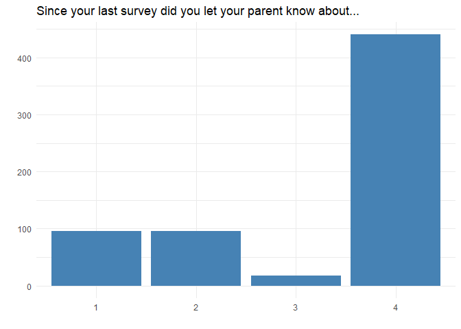<!-- -->


#### Missingness

**Missingness Descriptives**

Delivered / Answered = 599 / 598
Missing = 1
Min = 0, Max = 1, Mean = 0.01, SD = 0.09
(Descriptives are rounded to 2 decimals)

Missingness Intraclass Correlation (ICC) = 1.26 


#### Screenshot


</div>


</div> <!-- Header section -->

<div class = "header-shading">

#### Give you information, or ideas about how to make things better <br>

<div style="font-weight: bold; color: #2a5caa; margin-top: -0.7em; margin-bottom: 1em;">
  <a href="#Item 874-anchor"> [Item 874] </a>
</div>


</div>


<!-- Body -->


<div class = "anchor">

<div id="Question 5630-anchor">
  <strong>Question ID</strong>: Question 5630
</div>

**Way the question was delivered:** Slider

**Type of data:** numeric

</div> <div class = "anchor">


**Descriptives**
Min = 0, Max = 100, Mean = 43.2, SD = 32.89 


<button 
  onclick="let e = document.getElementById('Question 5630');
           let arrow = document.getElementById('Question 5630_arrow');
           e.style.display = e.style.display === 'none' ? 'block' : 'none';
           arrow.textContent = e.style.display === 'none' ? '▼' : '▲';"
  style="background: none; border: none; padding: 0; font-weight: bold; font-size: 18px; color: #2a5caa; cursor: pointer;">
Click to view visuals <span id="Question 5630_arrow">▼</span>
</button>

<div id="Question 5630" style="display: none;">


<!-- TOC-IGNORE-BEGIN -->

### Descriptives {.tabset}


#### Histogram

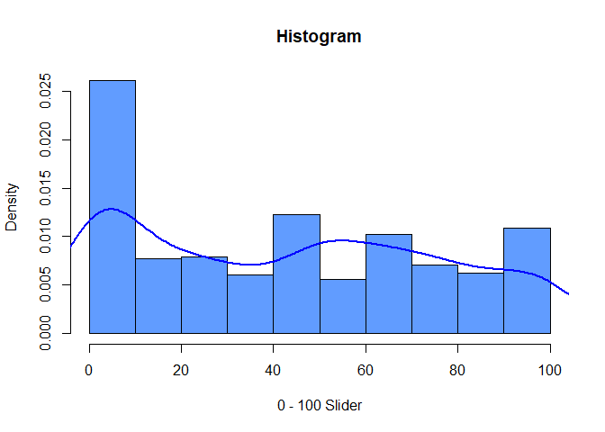<!-- -->


#### Missingness

**Missingness Descriptives**

Delivered / Answered = 482 / 480
Missing = 2
Min = 0, Max = 1, Mean = 0.02, SD = 0.14
(Descriptives are rounded to 2 decimals)

Missingness Intraclass Correlation (ICC) = 1.27 


#### Screenshot


</div>

</div> <!-- Header section -->

<div class = "header-shading">

#### Do something to help you (ex: pick you up, help with homework) <br>

<div style="font-weight: bold; color: #2a5caa; margin-top: -0.7em; margin-bottom: 1em;">
  <a href="#Item 875-anchor"> [Item 875] </a>
</div>


</div>


<!-- Body -->


<div class = "anchor">

<div id="Question 1380-anchor">
  <strong>Question ID</strong>: Question 1380
</div>

**Way the question was delivered:** Slider

**Type of data:** numeric

</div> <div class = "anchor">


**Descriptives**
Min = 0, Max = 100, Mean = 49.72, SD = 33.41 


<button 
  onclick="let e = document.getElementById('Question 1380');
           let arrow = document.getElementById('Question 1380_arrow');
           e.style.display = e.style.display === 'none' ? 'block' : 'none';
           arrow.textContent = e.style.display === 'none' ? '▼' : '▲';"
  style="background: none; border: none; padding: 0; font-weight: bold; font-size: 18px; color: #2a5caa; cursor: pointer;">
Click to view visuals <span id="Question 1380_arrow">▼</span>
</button>

<div id="Question 1380" style="display: none;">


<!-- TOC-IGNORE-BEGIN -->

### Descriptives {.tabset}


#### Histogram

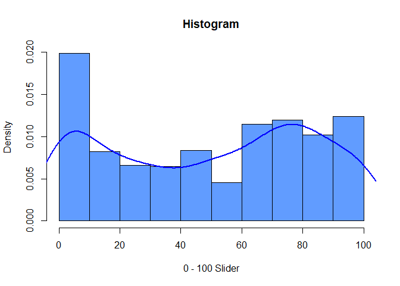<!-- -->


#### Missingness

**Missingness Descriptives**

Delivered / Answered = 621 / 620
Missing = 1
Min = 0, Max = 1, Mean = 0.01, SD = 0.09
(Descriptives are rounded to 2 decimals)

Missingness Intraclass Correlation (ICC) = 1.25 


#### Screenshot


</div>

</div> <!-- Header section -->

<div class = "header-shading">

#### Give you emotional support (ex: listen to and comfort you) <br>

<div style="font-weight: bold; color: #2a5caa; margin-top: -0.7em; margin-bottom: 1em;">
  <a href="#Item 879-anchor"> [Item 879] </a>
</div>


</div>


<!-- Body -->


<div class = "anchor">

<div id="Question 1836-anchor">
  <strong>Question ID</strong>: Question 1836
</div>

**Way the question was delivered:** Slider

**Type of data:** numeric

</div> <div class = "anchor">


**Descriptives**
Min = 0, Max = 100, Mean = 39.35, SD = 32.51 


<button 
  onclick="let e = document.getElementById('Question 1836');
           let arrow = document.getElementById('Question 1836_arrow');
           e.style.display = e.style.display === 'none' ? 'block' : 'none';
           arrow.textContent = e.style.display === 'none' ? '▼' : '▲';"
  style="background: none; border: none; padding: 0; font-weight: bold; font-size: 18px; color: #2a5caa; cursor: pointer;">
Click to view visuals <span id="Question 1836_arrow">▼</span>
</button>

<div id="Question 1836" style="display: none;">


<!-- TOC-IGNORE-BEGIN -->

### Descriptives {.tabset}


#### Histogram

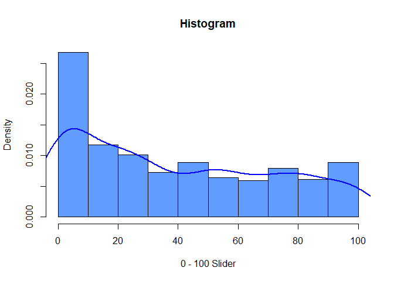<!-- -->


#### Missingness

**Missingness Descriptives**

Delivered / Answered = 621 / 621
Missing = 0
Min = 0, Max = 0, Mean = 0, SD = 0
(Descriptives are rounded to 2 decimals)

Missingness Intraclass Correlation (ICC) = NaN 


#### Screenshot


</div>

</div> 
### Block: Item 1136 <!-- Header section -->

<div class = "header-shading">

#### Overall, how helpful was your parent? <br>

<div style="font-weight: bold; color: #2a5caa; margin-top: -0.7em; margin-bottom: 1em;">
  <a href="#Item 1143-anchor"> [Item 1143] </a>
</div>


</div>


<!-- Body -->


<div class = "anchor">

<div id="Question 2075-anchor">
  <strong>Question ID</strong>: Question 2075
</div>

**Way the question was delivered:** Slider

**Type of data:** numeric

</div> <div class = "anchor">


**Descriptives**
Min = 0, Max = 100, Mean = 70.08, SD = 23.97 


<button 
  onclick="let e = document.getElementById('Question 2075');
           let arrow = document.getElementById('Question 2075_arrow');
           e.style.display = e.style.display === 'none' ? 'block' : 'none';
           arrow.textContent = e.style.display === 'none' ? '▼' : '▲';"
  style="background: none; border: none; padding: 0; font-weight: bold; font-size: 18px; color: #2a5caa; cursor: pointer;">
Click to view visuals <span id="Question 2075_arrow">▼</span>
</button>

<div id="Question 2075" style="display: none;">


<!-- TOC-IGNORE-BEGIN -->

### Descriptives {.tabset}


#### Histogram

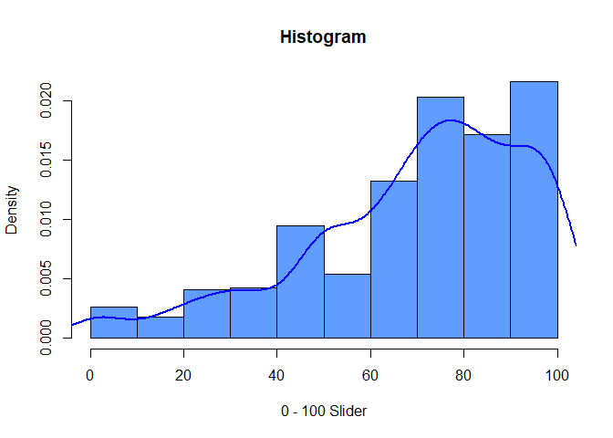<!-- -->


#### Missingness

**Missingness Descriptives**

Delivered / Answered = 612 / 611
Missing = 1
Min = 0, Max = 1, Mean = 0.01, SD = 0.09
(Descriptives are rounded to 2 decimals)

Missingness Intraclass Correlation (ICC) = 1.25 


#### Screenshot


</div>

</div> <!-- Header section -->

<div class = "header-shading">

#### How much did you want your parent to... <br>

<div style="font-weight: bold; color: #2a5caa; margin-top: -0.7em; margin-bottom: 1em;">
  <a href="#Item 1144-anchor"> [Item 1144] </a>
</div>


</div>


<!-- Body -->


<div class = "anchor">

<div id="Question 2074-anchor">
  <strong>Question ID</strong>: Question 2074
</div>

**Way the question was delivered:** Informational Fullscreen

**Type of data:** NA

</div> <div class = "anchor">


</div> <!-- Header section -->

<div class = "header-shading">

#### End Block <br>

<div style="font-weight: bold; color: #2a5caa; margin-top: -0.7em; margin-bottom: 1em;">
  <a href="#Item 1199-anchor"> [Item 1199] </a>
</div>


</div>


<!-- Body -->


<div class = "anchor">

<div id="Question 2076-anchor">
  <strong>Question ID</strong>: Question 2076
</div>

**Way the question was delivered:** End Block

**Type of data:** NA

</div>  
### Block: Item 1361 <!-- Header section -->

<div class = "header-shading">

#### Since your last survey, did you experience any stressful events at home, school or elsewhere? <br>

<div style="font-weight: bold; color: #2a5caa; margin-top: -0.7em; margin-bottom: 1em;">
  <a href="#Item 4463-anchor"> [Item 4463] </a>
</div>


</div>


<!-- Body -->


<div class = "anchor">

<div id="Question 4126-anchor">
  <strong>Question ID</strong>: Question 4126
</div>

**Way the question was delivered:** Multiple Choice

**Type of data:** integer

</div> 
<div class = "anchor">


<button 
  onclick="let e = document.getElementById('Question 4126');
           let arrow = document.getElementById('Question 4126_arrow');
           e.style.display = e.style.display === 'none' ? 'block' : 'none';
           arrow.textContent = e.style.display === 'none' ? '▼' : '▲';"
  style="background: none; border: none; padding: 0; font-weight: bold; font-size: 18px; color: #2a5caa; cursor: pointer;">
Click to view visuals <span id="Question 4126_arrow">▼</span>
</button>

<div id="Question 4126" style="display: none;">


<!-- TOC-IGNORE-BEGIN -->

### Descriptives {.tabset}


#### Frequency Table

<table class="table" style="color: black; margin-left: auto; margin-right: auto;">
 <thead>
  <tr>
   <th style="text-align:left;"> Value </th>
   <th style="text-align:left;"> Label </th>
   <th style="text-align:left;"> Counts </th>
   <th style="text-align:left;"> Percentages </th>
  </tr>
 </thead>
<tbody>
  <tr>
   <td style="text-align:left;"> 1 </td>
   <td style="text-align:left;"> Yes </td>
   <td style="text-align:left;color: darkgreen !important;"> N = 120 </td>
   <td style="text-align:left;"> 13.4% </td>
  </tr>
  <tr>
   <td style="text-align:left;"> 2 </td>
   <td style="text-align:left;"> No </td>
   <td style="text-align:left;color: darkgreen !important;"> N = 778 </td>
   <td style="text-align:left;"> 86.6% </td>
  </tr>
</tbody>
</table>


#### Barplot

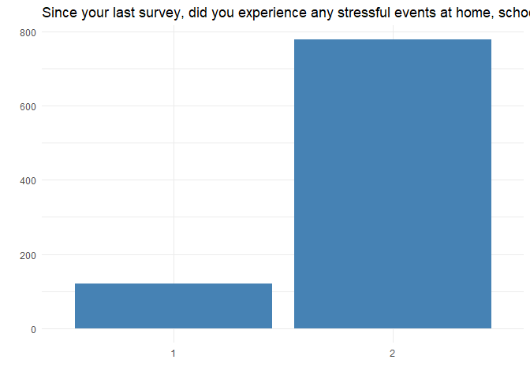<!-- -->


#### Missingness

**Missingness Descriptives**

Delivered / Answered = 898 / 898
Missing = 0
Min = 0, Max = 0, Mean = 0, SD = 0
(Descriptives are rounded to 2 decimals)

Missingness Intraclass Correlation (ICC) = NaN 


#### Screenshot


</div>


</div> <!-- Header section -->

<div class = "header-shading">

#### Since your last survey, did you see or communicate with your parent? <br>

<div style="font-weight: bold; color: #2a5caa; margin-top: -0.7em; margin-bottom: 1em;">
  <a href="#Item 4464-anchor"> [Item 4464] </a>
</div>


</div>


<!-- Body -->


<div class = "anchor">

<div id="Question 4127-anchor">
  <strong>Question ID</strong>: Question 4127
</div>

**Way the question was delivered:** Multiple Choice

**Type of data:** integer

</div> 
<div class = "anchor">


<button 
  onclick="let e = document.getElementById('Question 4127');
           let arrow = document.getElementById('Question 4127_arrow');
           e.style.display = e.style.display === 'none' ? 'block' : 'none';
           arrow.textContent = e.style.display === 'none' ? '▼' : '▲';"
  style="background: none; border: none; padding: 0; font-weight: bold; font-size: 18px; color: #2a5caa; cursor: pointer;">
Click to view visuals <span id="Question 4127_arrow">▼</span>
</button>

<div id="Question 4127" style="display: none;">


<!-- TOC-IGNORE-BEGIN -->

### Descriptives {.tabset}


#### Frequency Table

<table class="table" style="color: black; margin-left: auto; margin-right: auto;">
 <thead>
  <tr>
   <th style="text-align:left;"> Value </th>
   <th style="text-align:left;"> Label </th>
   <th style="text-align:left;"> Counts </th>
   <th style="text-align:left;"> Percentages </th>
  </tr>
 </thead>
<tbody>
  <tr>
   <td style="text-align:left;"> 1 </td>
   <td style="text-align:left;"> Yes </td>
   <td style="text-align:left;color: darkgreen !important;"> N = 610 </td>
   <td style="text-align:left;"> 68% </td>
  </tr>
  <tr>
   <td style="text-align:left;"> 2 </td>
   <td style="text-align:left;"> No </td>
   <td style="text-align:left;color: darkgreen !important;"> N = 287 </td>
   <td style="text-align:left;"> 32% </td>
  </tr>
</tbody>
</table>


#### Barplot

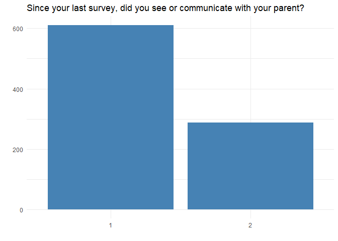<!-- -->


#### Missingness

**Missingness Descriptives**

Delivered / Answered = 897 / 897
Missing = 0
Min = 0, Max = 0, Mean = 0, SD = 0
(Descriptives are rounded to 2 decimals)

Missingness Intraclass Correlation (ICC) = NaN 


#### Screenshot


</div>


</div> 
### Block: Item 5539 <!-- Header section -->

<div class = "header-shading">

#### Think about your sleep from last night to this morning: <br>

<div style="font-weight: bold; color: #2a5caa; margin-top: -0.7em; margin-bottom: 1em;">
  <a href="#Item 6302-anchor"> [Item 6302] </a>
</div>


</div>


<!-- Body -->


<div class = "anchor">

<div id="Question 6792-anchor">
  <strong>Question ID</strong>: Question 6792
</div>

**Way the question was delivered:** Informational Fullscreen

**Type of data:** NA

</div> <div class = "anchor">


</div> <!-- Header section -->

<div class = "header-shading">

#### How many minutes did it take for you to fall asleep? <br>

<div style="font-weight: bold; color: #2a5caa; margin-top: -0.7em; margin-bottom: 1em;">
  <a href="#Item 6305-anchor"> [Item 6305] </a>
</div>


</div>


<!-- Body -->


<div class = "anchor">

<div id="Question 6795-anchor">
  <strong>Question ID</strong>: Question 6795
</div>

**Way the question was delivered:** Free Response

**Type of data:** character

</div> <div class = "anchor">


<button 
  onclick="let e = document.getElementById('Question 6795');
           let arrow = document.getElementById('Question 6795_arrow');
           e.style.display = e.style.display === 'none' ? 'block' : 'none';
           arrow.textContent = e.style.display === 'none' ? '▼' : '▲';"
  style="background: none; border: none; padding: 0; font-weight: bold; font-size: 18px; color: #2a5caa; cursor: pointer;">
Click to view visuals <span id="Question 6795_arrow">▼</span>
</button>

<div id="Question 6795" style="display: none;">


<!-- TOC-IGNORE-BEGIN -->

### Descriptives {.tabset}


#### Missingness

**Missingness Descriptives**

Delivered / Answered = 78 / 77
Missing = 1
Min = 0, Max = 1, Mean = 0.02, SD = 0.15
(Descriptives are rounded to 2 decimals)

Missingness Intraclass Correlation (ICC) = 2.41 


#### Screenshot


</div>


</div> <!-- Header section -->

<div class = "header-shading">

#### Did you wake up during the night (Not counting your final wake-up in the morning)? <br>

<div style="font-weight: bold; color: #2a5caa; margin-top: -0.7em; margin-bottom: 1em;">
  <a href="#Item 6306-anchor"> [Item 6306] </a>
</div>


</div>


<!-- Body -->


<div class = "anchor">

<div id="Question 6796-anchor">
  <strong>Question ID</strong>: Question 6796
</div>

**Way the question was delivered:** Multiple Choice

**Type of data:** integer

</div> 
<div class = "anchor">


<button 
  onclick="let e = document.getElementById('Question 6796');
           let arrow = document.getElementById('Question 6796_arrow');
           e.style.display = e.style.display === 'none' ? 'block' : 'none';
           arrow.textContent = e.style.display === 'none' ? '▼' : '▲';"
  style="background: none; border: none; padding: 0; font-weight: bold; font-size: 18px; color: #2a5caa; cursor: pointer;">
Click to view visuals <span id="Question 6796_arrow">▼</span>
</button>

<div id="Question 6796" style="display: none;">


<!-- TOC-IGNORE-BEGIN -->

### Descriptives {.tabset}


#### Frequency Table

<table class="table" style="color: black; margin-left: auto; margin-right: auto;">
 <thead>
  <tr>
   <th style="text-align:left;"> Value </th>
   <th style="text-align:left;"> Label </th>
   <th style="text-align:left;"> Counts </th>
   <th style="text-align:left;"> Percentages </th>
  </tr>
 </thead>
<tbody>
  <tr>
   <td style="text-align:left;"> 1 </td>
   <td style="text-align:left;"> Yes </td>
   <td style="text-align:left;color: darkgreen !important;"> N = 20 </td>
   <td style="text-align:left;"> 25.6% </td>
  </tr>
  <tr>
   <td style="text-align:left;"> 2 </td>
   <td style="text-align:left;"> No </td>
   <td style="text-align:left;color: darkgreen !important;"> N = 58 </td>
   <td style="text-align:left;"> 74.4% </td>
  </tr>
</tbody>
</table>


#### Barplot

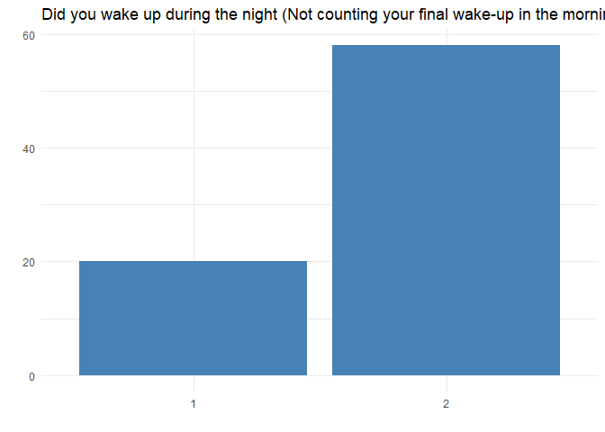<!-- -->


#### Missingness

**Missingness Descriptives**

Delivered / Answered = 78 / 78
Missing = 0
Min = 0, Max = 0, Mean = 0, SD = 0
(Descriptives are rounded to 2 decimals)

Missingness Intraclass Correlation (ICC) = NaN 


#### Screenshot


</div>


</div> 
### Block: Item 6307 <!-- Header section -->

<div class = "header-shading">

#### How would you rate the quality of your sleep? <br>

<div style="font-weight: bold; color: #2a5caa; margin-top: -0.7em; margin-bottom: 1em;">
  <a href="#Item 6309-anchor"> [Item 6309] </a>
</div>


</div>


<!-- Body -->


<div class = "anchor">

<div id="Question 6801-anchor">
  <strong>Question ID</strong>: Question 6801
</div>

**Way the question was delivered:** Slider

**Type of data:** numeric

</div> <div class = "anchor">


**Descriptives**
Min = 0, Max = 100, Mean = 66.06, SD = 24.94 


<button 
  onclick="let e = document.getElementById('Question 6801');
           let arrow = document.getElementById('Question 6801_arrow');
           e.style.display = e.style.display === 'none' ? 'block' : 'none';
           arrow.textContent = e.style.display === 'none' ? '▼' : '▲';"
  style="background: none; border: none; padding: 0; font-weight: bold; font-size: 18px; color: #2a5caa; cursor: pointer;">
Click to view visuals <span id="Question 6801_arrow">▼</span>
</button>

<div id="Question 6801" style="display: none;">


<!-- TOC-IGNORE-BEGIN -->

### Descriptives {.tabset}


#### Histogram

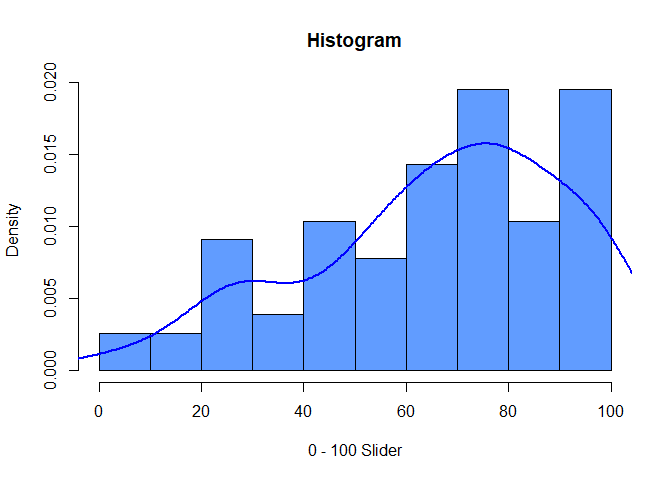<!-- -->


#### Missingness

**Missingness Descriptives**

Delivered / Answered = 77 / 77
Missing = 0
Min = 0, Max = 0, Mean = 0, SD = 0
(Descriptives are rounded to 2 decimals)

Missingness Intraclass Correlation (ICC) = NaN 


#### Screenshot


</div>

</div> <!-- Header section -->

<div class = "header-shading">

#### How bothered or stressed were you because of this? <br>

<div style="font-weight: bold; color: #2a5caa; margin-top: -0.7em; margin-bottom: 1em;">
  <a href="#Item 1118-anchor"> [Item 1118] </a>
</div>


</div>


<!-- Body -->


<div class = "anchor">

<div id="Question 1821-anchor">
  <strong>Question ID</strong>: Question 1821
</div>

**Way the question was delivered:** Slider

**Type of data:** numeric

</div> <div class = "anchor">


**Descriptives**
Min = NA, Max = NA, Mean = NA, SD = NA 


<button 
  onclick="let e = document.getElementById('Question 1821');
           let arrow = document.getElementById('Question 1821_arrow');
           e.style.display = e.style.display === 'none' ? 'block' : 'none';
           arrow.textContent = e.style.display === 'none' ? '▼' : '▲';"
  style="background: none; border: none; padding: 0; font-weight: bold; font-size: 18px; color: #2a5caa; cursor: pointer;">
Click to view visuals <span id="Question 1821_arrow">▼</span>
</button>

<div id="Question 1821" style="display: none;">


<!-- TOC-IGNORE-BEGIN -->

### Descriptives {.tabset}


#### Missingness

**Missingness Descriptives**

Delivered / Answered = 0 / 0
Missing = 0
Min = NA, Max = NA, Mean = NA, SD = NA
(Descriptives are rounded to 2 decimals)

Missingness Intraclass Correlation (ICC) = NA 


#### Screenshot


</div>

</div> <!-- Header section -->

<div class = "header-shading">

#### With whom did you have an argument or disagreement? <br>

<div style="font-weight: bold; color: #2a5caa; margin-top: -0.7em; margin-bottom: 1em;">
  <a href="#Item 1119-anchor"> [Item 1119] </a>
</div>


</div>


<!-- Body -->


<div class = "anchor">

<div id="Question 1822-anchor">
  <strong>Question ID</strong>: Question 1822
</div>

**Way the question was delivered:** Multiple Select

**Type of data:** integer

</div> 
<div class = "anchor">


<button 
  onclick="let e = document.getElementById('Question 1822');
           let arrow = document.getElementById('Question 1822_arrow');
           e.style.display = e.style.display === 'none' ? 'block' : 'none';
           arrow.textContent = e.style.display === 'none' ? '▼' : '▲';"
  style="background: none; border: none; padding: 0; font-weight: bold; font-size: 18px; color: #2a5caa; cursor: pointer;">
Click to view visuals <span id="Question 1822_arrow">▼</span>
</button>

<div id="Question 1822" style="display: none;">


<!-- TOC-IGNORE-BEGIN -->

### Descriptives {.tabset}


<table class="table" style="color: black; margin-left: auto; margin-right: auto;">
 <thead>
  <tr>
   <th style="text-align:right;"> Value </th>
   <th style="text-align:left;"> Label </th>
   <th style="text-align:left;"> Counts </th>
   <th style="text-align:left;"> Percentages </th>
  </tr>
 </thead>
<tbody>
  <tr>
   <td style="text-align:right;"> 1 </td>
   <td style="text-align:left;"> Parents </td>
   <td style="text-align:left;color: darkgreen !important;"> N = 0 </td>
   <td style="text-align:left;"> 0% </td>
  </tr>
  <tr>
   <td style="text-align:right;"> 2 </td>
   <td style="text-align:left;"> Siblings </td>
   <td style="text-align:left;color: darkgreen !important;"> N = 0 </td>
   <td style="text-align:left;"> 0% </td>
  </tr>
  <tr>
   <td style="text-align:right;"> 3 </td>
   <td style="text-align:left;"> Friends, other people your age </td>
   <td style="text-align:left;color: darkgreen !important;"> N = 0 </td>
   <td style="text-align:left;"> 0% </td>
  </tr>
  <tr>
   <td style="text-align:right;"> 4 </td>
   <td style="text-align:left;"> Teachers, coaches, other adults </td>
   <td style="text-align:left;color: darkgreen !important;"> N = 0 </td>
   <td style="text-align:left;"> 0% </td>
  </tr>
  <tr>
   <td style="text-align:right;"> 5 </td>
   <td style="text-align:left;"> Other (ex: cashier, a stranger) </td>
   <td style="text-align:left;color: darkgreen !important;"> N = 0 </td>
   <td style="text-align:left;"> 0% </td>
  </tr>
</tbody>
</table>


#### Missingness

**Missingness Descriptives**

Delivered / Answered = 0 / 0
Missing = 0
Min = NA, Max = NA, Mean = NA, SD = NA
(Descriptives are rounded to 2 decimals)

Missingness Intraclass Correlation (ICC) = NA 


#### Screenshot


</div>


</div> <!-- Header section -->

<div class = "header-shading">

#### How bothered or stressed were you because of this? <br>

<div style="font-weight: bold; color: #2a5caa; margin-top: -0.7em; margin-bottom: 1em;">
  <a href="#Item 1122-anchor"> [Item 1122] </a>
</div>


</div>


<!-- Body -->


<div class = "anchor">

<div id="Question 1824-anchor">
  <strong>Question ID</strong>: Question 1824
</div>

**Way the question was delivered:** Slider

**Type of data:** numeric

</div> <div class = "anchor">


**Descriptives**
Min = NA, Max = NA, Mean = NA, SD = NA 


<button 
  onclick="let e = document.getElementById('Question 1824');
           let arrow = document.getElementById('Question 1824_arrow');
           e.style.display = e.style.display === 'none' ? 'block' : 'none';
           arrow.textContent = e.style.display === 'none' ? '▼' : '▲';"
  style="background: none; border: none; padding: 0; font-weight: bold; font-size: 18px; color: #2a5caa; cursor: pointer;">
Click to view visuals <span id="Question 1824_arrow">▼</span>
</button>

<div id="Question 1824" style="display: none;">


<!-- TOC-IGNORE-BEGIN -->

### Descriptives {.tabset}


#### Missingness

**Missingness Descriptives**

Delivered / Answered = 0 / 0
Missing = 0
Min = NA, Max = NA, Mean = NA, SD = NA
(Descriptives are rounded to 2 decimals)

Missingness Intraclass Correlation (ICC) = NA 


#### Screenshot


</div>

</div> <!-- Header section -->

<div class = "header-shading">

#### Where did you feel this way? <br>

<div style="font-weight: bold; color: #2a5caa; margin-top: -0.7em; margin-bottom: 1em;">
  <a href="#Item 1123-anchor"> [Item 1123] </a>
</div>


</div>


<!-- Body -->


<div class = "anchor">

<div id="Question 1825-anchor">
  <strong>Question ID</strong>: Question 1825
</div>

**Way the question was delivered:** Multiple Select

**Type of data:** integer

</div> 
<div class = "anchor">


<button 
  onclick="let e = document.getElementById('Question 1825');
           let arrow = document.getElementById('Question 1825_arrow');
           e.style.display = e.style.display === 'none' ? 'block' : 'none';
           arrow.textContent = e.style.display === 'none' ? '▼' : '▲';"
  style="background: none; border: none; padding: 0; font-weight: bold; font-size: 18px; color: #2a5caa; cursor: pointer;">
Click to view visuals <span id="Question 1825_arrow">▼</span>
</button>

<div id="Question 1825" style="display: none;">


<!-- TOC-IGNORE-BEGIN -->

### Descriptives {.tabset}


<table class="table" style="color: black; margin-left: auto; margin-right: auto;">
 <thead>
  <tr>
   <th style="text-align:right;"> Value </th>
   <th style="text-align:left;"> Label </th>
   <th style="text-align:left;"> Counts </th>
   <th style="text-align:left;"> Percentages </th>
  </tr>
 </thead>
<tbody>
  <tr>
   <td style="text-align:right;"> 1 </td>
   <td style="text-align:left;"> Home </td>
   <td style="text-align:left;color: darkgreen !important;"> N = 0 </td>
   <td style="text-align:left;"> 0% </td>
  </tr>
  <tr>
   <td style="text-align:right;"> 2 </td>
   <td style="text-align:left;"> School or extracurricular activity </td>
   <td style="text-align:left;color: darkgreen !important;"> N = 0 </td>
   <td style="text-align:left;"> 0% </td>
  </tr>
  <tr>
   <td style="text-align:right;"> 3 </td>
   <td style="text-align:left;"> Other (ex: at the store) </td>
   <td style="text-align:left;color: darkgreen !important;"> N = 0 </td>
   <td style="text-align:left;"> 0% </td>
  </tr>
</tbody>
</table>


#### Missingness

**Missingness Descriptives**

Delivered / Answered = 0 / 0
Missing = 0
Min = NA, Max = NA, Mean = NA, SD = NA
(Descriptives are rounded to 2 decimals)

Missingness Intraclass Correlation (ICC) = NA 


#### Screenshot


</div>


</div> <!-- Header section -->

<div class = "header-shading">

#### How bothered or stressed were you because of this? <br>

<div style="font-weight: bold; color: #2a5caa; margin-top: -0.7em; margin-bottom: 1em;">
  <a href="#Item 1126-anchor"> [Item 1126] </a>
</div>


</div>


<!-- Body -->


<div class = "anchor">

<div id="Question 1827-anchor">
  <strong>Question ID</strong>: Question 1827
</div>

**Way the question was delivered:** Slider

**Type of data:** numeric

</div> <div class = "anchor">


**Descriptives**
Min = NA, Max = NA, Mean = NA, SD = NA 


<button 
  onclick="let e = document.getElementById('Question 1827');
           let arrow = document.getElementById('Question 1827_arrow');
           e.style.display = e.style.display === 'none' ? 'block' : 'none';
           arrow.textContent = e.style.display === 'none' ? '▼' : '▲';"
  style="background: none; border: none; padding: 0; font-weight: bold; font-size: 18px; color: #2a5caa; cursor: pointer;">
Click to view visuals <span id="Question 1827_arrow">▼</span>
</button>

<div id="Question 1827" style="display: none;">


<!-- TOC-IGNORE-BEGIN -->

### Descriptives {.tabset}


#### Missingness

**Missingness Descriptives**

Delivered / Answered = 0 / 0
Missing = 0
Min = NA, Max = NA, Mean = NA, SD = NA
(Descriptives are rounded to 2 decimals)

Missingness Intraclass Correlation (ICC) = NA 


#### Screenshot


</div>

</div> <!-- Header section -->

<div class = "header-shading">

#### Where did this happen? <br>

<div style="font-weight: bold; color: #2a5caa; margin-top: -0.7em; margin-bottom: 1em;">
  <a href="#Item 1127-anchor"> [Item 1127] </a>
</div>


</div>


<!-- Body -->


<div class = "anchor">

<div id="Question 1828-anchor">
  <strong>Question ID</strong>: Question 1828
</div>

**Way the question was delivered:** Multiple Select

**Type of data:** integer

</div> 
<div class = "anchor">


<button 
  onclick="let e = document.getElementById('Question 1828');
           let arrow = document.getElementById('Question 1828_arrow');
           e.style.display = e.style.display === 'none' ? 'block' : 'none';
           arrow.textContent = e.style.display === 'none' ? '▼' : '▲';"
  style="background: none; border: none; padding: 0; font-weight: bold; font-size: 18px; color: #2a5caa; cursor: pointer;">
Click to view visuals <span id="Question 1828_arrow">▼</span>
</button>

<div id="Question 1828" style="display: none;">


<!-- TOC-IGNORE-BEGIN -->

### Descriptives {.tabset}


<table class="table" style="color: black; margin-left: auto; margin-right: auto;">
 <thead>
  <tr>
   <th style="text-align:right;"> Value </th>
   <th style="text-align:left;"> Label </th>
   <th style="text-align:left;"> Counts </th>
   <th style="text-align:left;"> Percentages </th>
  </tr>
 </thead>
<tbody>
  <tr>
   <td style="text-align:right;"> 1 </td>
   <td style="text-align:left;"> Home </td>
   <td style="text-align:left;color: darkgreen !important;"> N = 0 </td>
   <td style="text-align:left;"> 0% </td>
  </tr>
  <tr>
   <td style="text-align:right;"> 2 </td>
   <td style="text-align:left;"> School or extracurricular activity </td>
   <td style="text-align:left;color: darkgreen !important;"> N = 0 </td>
   <td style="text-align:left;"> 0% </td>
  </tr>
  <tr>
   <td style="text-align:right;"> 3 </td>
   <td style="text-align:left;"> Other (ex: at the store) </td>
   <td style="text-align:left;color: darkgreen !important;"> N = 0 </td>
   <td style="text-align:left;"> 0% </td>
  </tr>
</tbody>
</table>


#### Missingness

**Missingness Descriptives**

Delivered / Answered = 0 / 0
Missing = 0
Min = NA, Max = NA, Mean = NA, SD = NA
(Descriptives are rounded to 2 decimals)

Missingness Intraclass Correlation (ICC) = NA 


#### Screenshot


</div>


</div> <!-- Header section -->

<div class = "header-shading">

#### How bothered or stressed were you because of this? <br>

<div style="font-weight: bold; color: #2a5caa; margin-top: -0.7em; margin-bottom: 1em;">
  <a href="#Item 1130-anchor"> [Item 1130] </a>
</div>


</div>


<!-- Body -->


<div class = "anchor">

<div id="Question 1830-anchor">
  <strong>Question ID</strong>: Question 1830
</div>

**Way the question was delivered:** Slider

**Type of data:** numeric

</div> <div class = "anchor">


**Descriptives**
Min = NA, Max = NA, Mean = NA, SD = NA 


<button 
  onclick="let e = document.getElementById('Question 1830');
           let arrow = document.getElementById('Question 1830_arrow');
           e.style.display = e.style.display === 'none' ? 'block' : 'none';
           arrow.textContent = e.style.display === 'none' ? '▼' : '▲';"
  style="background: none; border: none; padding: 0; font-weight: bold; font-size: 18px; color: #2a5caa; cursor: pointer;">
Click to view visuals <span id="Question 1830_arrow">▼</span>
</button>

<div id="Question 1830" style="display: none;">


<!-- TOC-IGNORE-BEGIN -->

### Descriptives {.tabset}


#### Missingness

**Missingness Descriptives**

Delivered / Answered = 0 / 0
Missing = 0
Min = NA, Max = NA, Mean = NA, SD = NA
(Descriptives are rounded to 2 decimals)

Missingness Intraclass Correlation (ICC) = NA 


#### Screenshot


</div>

</div> <!-- Header section -->

<div class = "header-shading">

#### Who did this problem involve? <br>

<div style="font-weight: bold; color: #2a5caa; margin-top: -0.7em; margin-bottom: 1em;">
  <a href="#Item 1131-anchor"> [Item 1131] </a>
</div>


</div>


<!-- Body -->


<div class = "anchor">

<div id="Question 1831-anchor">
  <strong>Question ID</strong>: Question 1831
</div>

**Way the question was delivered:** Multiple Select

**Type of data:** integer

</div> 
<div class = "anchor">


<button 
  onclick="let e = document.getElementById('Question 1831');
           let arrow = document.getElementById('Question 1831_arrow');
           e.style.display = e.style.display === 'none' ? 'block' : 'none';
           arrow.textContent = e.style.display === 'none' ? '▼' : '▲';"
  style="background: none; border: none; padding: 0; font-weight: bold; font-size: 18px; color: #2a5caa; cursor: pointer;">
Click to view visuals <span id="Question 1831_arrow">▼</span>
</button>

<div id="Question 1831" style="display: none;">


<!-- TOC-IGNORE-BEGIN -->

### Descriptives {.tabset}


<table class="table" style="color: black; margin-left: auto; margin-right: auto;">
 <thead>
  <tr>
   <th style="text-align:right;"> Value </th>
   <th style="text-align:left;"> Label </th>
   <th style="text-align:left;"> Counts </th>
   <th style="text-align:left;"> Percentages </th>
  </tr>
 </thead>
<tbody>
  <tr>
   <td style="text-align:right;"> 1 </td>
   <td style="text-align:left;"> Family </td>
   <td style="text-align:left;color: darkgreen !important;"> N = 0 </td>
   <td style="text-align:left;"> 0% </td>
  </tr>
  <tr>
   <td style="text-align:right;"> 2 </td>
   <td style="text-align:left;"> Friends or someone you know </td>
   <td style="text-align:left;color: darkgreen !important;"> N = 0 </td>
   <td style="text-align:left;"> 0% </td>
  </tr>
  <tr>
   <td style="text-align:right;"> 3 </td>
   <td style="text-align:left;"> Other (ex: strangers) </td>
   <td style="text-align:left;color: darkgreen !important;"> N = 0 </td>
   <td style="text-align:left;"> 0% </td>
  </tr>
</tbody>
</table>


#### Missingness

**Missingness Descriptives**

Delivered / Answered = 0 / 0
Missing = 0
Min = NA, Max = NA, Mean = NA, SD = NA
(Descriptives are rounded to 2 decimals)

Missingness Intraclass Correlation (ICC) = NA 


#### Screenshot


</div>


</div> <!-- Header section -->

<div class = "header-shading">

#### Check all the ways that you interacted with your parent, in person. <br>

<div style="font-weight: bold; color: #2a5caa; margin-top: -0.7em; margin-bottom: 1em;">
  <a href="#Item 1133-anchor"> [Item 1133] </a>
</div>


</div>


<!-- Body -->


<div class = "anchor">

<div id="Question 1833-anchor">
  <strong>Question ID</strong>: Question 1833
</div>

**Way the question was delivered:** Multiple Select

**Type of data:** integer

</div> 
<div class = "anchor">


<button 
  onclick="let e = document.getElementById('Question 1833');
           let arrow = document.getElementById('Question 1833_arrow');
           e.style.display = e.style.display === 'none' ? 'block' : 'none';
           arrow.textContent = e.style.display === 'none' ? '▼' : '▲';"
  style="background: none; border: none; padding: 0; font-weight: bold; font-size: 18px; color: #2a5caa; cursor: pointer;">
Click to view visuals <span id="Question 1833_arrow">▼</span>
</button>

<div id="Question 1833" style="display: none;">


<!-- TOC-IGNORE-BEGIN -->

### Descriptives {.tabset}


<table class="table" style="color: black; margin-left: auto; margin-right: auto;">
 <thead>
  <tr>
   <th style="text-align:right;"> Value </th>
   <th style="text-align:left;"> Label </th>
   <th style="text-align:left;"> Counts </th>
   <th style="text-align:left;"> Percentages </th>
  </tr>
 </thead>
<tbody>
  <tr>
   <td style="text-align:right;"> 1 </td>
   <td style="text-align:left;"> Do something together (ex: eat, clean, watch a show) </td>
   <td style="text-align:left;color: darkgreen !important;"> N = 0 </td>
   <td style="text-align:left;"> 0% </td>
  </tr>
  <tr>
   <td style="text-align:right;"> 2 </td>
   <td style="text-align:left;"> Make physical contact (ex: hug, lean on each other) </td>
   <td style="text-align:left;color: darkgreen !important;"> N = 0 </td>
   <td style="text-align:left;"> 0% </td>
  </tr>
  <tr>
   <td style="text-align:right;"> 3 </td>
   <td style="text-align:left;"> Just be together (ex: be on your own phones) </td>
   <td style="text-align:left;color: darkgreen !important;"> N = 0 </td>
   <td style="text-align:left;"> 0% </td>
  </tr>
  <tr>
   <td style="text-align:right;"> 4 </td>
   <td style="text-align:left;"> Ask a question or make a request </td>
   <td style="text-align:left;color: darkgreen !important;"> N = 0 </td>
   <td style="text-align:left;"> 0% </td>
  </tr>
  <tr>
   <td style="text-align:right;"> 5 </td>
   <td style="text-align:left;"> Reply to a question or request </td>
   <td style="text-align:left;color: darkgreen !important;"> N = 0 </td>
   <td style="text-align:left;"> 0% </td>
  </tr>
  <tr>
   <td style="text-align:right;"> 6 </td>
   <td style="text-align:left;"> Have a conversation (ex: exchange a few words or more) </td>
   <td style="text-align:left;color: darkgreen !important;"> N = 0 </td>
   <td style="text-align:left;"> 0% </td>
  </tr>
  <tr>
   <td style="text-align:right;"> 7 </td>
   <td style="text-align:left;"> Other </td>
   <td style="text-align:left;color: darkgreen !important;"> N = 0 </td>
   <td style="text-align:left;"> 0% </td>
  </tr>
  <tr>
   <td style="text-align:right;"> 8 </td>
   <td style="text-align:left;"> None apply </td>
   <td style="text-align:left;color: darkgreen !important;"> N = 0 </td>
   <td style="text-align:left;"> 0% </td>
  </tr>
</tbody>
</table>


#### Missingness

**Missingness Descriptives**

Delivered / Answered = 0 / 0
Missing = 0
Min = NA, Max = NA, Mean = NA, SD = NA
(Descriptives are rounded to 2 decimals)

Missingness Intraclass Correlation (ICC) = NA 


#### Screenshot


</div>


</div> <!-- Header section -->

<div class = "header-shading">

#### How close did you feel to your parent? <br>

<div style="font-weight: bold; color: #2a5caa; margin-top: -0.7em; margin-bottom: 1em;">
  <a href="#Item 1134-anchor"> [Item 1134] </a>
</div>


</div>


<!-- Body -->


<div class = "anchor">

<div id="Question 2073-anchor">
  <strong>Question ID</strong>: Question 2073
</div>

**Way the question was delivered:** Slider

**Type of data:** numeric

</div> <div class = "anchor">


**Descriptives**
Min = NA, Max = NA, Mean = NA, SD = NA 


<button 
  onclick="let e = document.getElementById('Question 2073');
           let arrow = document.getElementById('Question 2073_arrow');
           e.style.display = e.style.display === 'none' ? 'block' : 'none';
           arrow.textContent = e.style.display === 'none' ? '▼' : '▲';"
  style="background: none; border: none; padding: 0; font-weight: bold; font-size: 18px; color: #2a5caa; cursor: pointer;">
Click to view visuals <span id="Question 2073_arrow">▼</span>
</button>

<div id="Question 2073" style="display: none;">


<!-- TOC-IGNORE-BEGIN -->

### Descriptives {.tabset}


#### Missingness

**Missingness Descriptives**

Delivered / Answered = 0 / 0
Missing = 0
Min = NA, Max = NA, Mean = NA, SD = NA
(Descriptives are rounded to 2 decimals)

Missingness Intraclass Correlation (ICC) = NA 


#### Screenshot


</div>

</div> <!-- Header section -->

<div class = "header-shading">

#### Who else was a part of your most recent interaction with your parent? <br>

<div style="font-weight: bold; color: #2a5caa; margin-top: -0.7em; margin-bottom: 1em;">
  <a href="#Item 1135-anchor"> [Item 1135] </a>
</div>


</div>


<!-- Body -->


<div class = "anchor">

<div id="Question 1835-anchor">
  <strong>Question ID</strong>: Question 1835
</div>

**Way the question was delivered:** Multiple Select

**Type of data:** integer

</div> 
<div class = "anchor">


<button 
  onclick="let e = document.getElementById('Question 1835');
           let arrow = document.getElementById('Question 1835_arrow');
           e.style.display = e.style.display === 'none' ? 'block' : 'none';
           arrow.textContent = e.style.display === 'none' ? '▼' : '▲';"
  style="background: none; border: none; padding: 0; font-weight: bold; font-size: 18px; color: #2a5caa; cursor: pointer;">
Click to view visuals <span id="Question 1835_arrow">▼</span>
</button>

<div id="Question 1835" style="display: none;">


<!-- TOC-IGNORE-BEGIN -->

### Descriptives {.tabset}


<table class="table" style="color: black; margin-left: auto; margin-right: auto;">
 <thead>
  <tr>
   <th style="text-align:right;"> Value </th>
   <th style="text-align:left;"> Label </th>
   <th style="text-align:left;"> Counts </th>
   <th style="text-align:left;"> Percentages </th>
  </tr>
 </thead>
<tbody>
  <tr>
   <td style="text-align:right;"> 1 </td>
   <td style="text-align:left;"> Other parent or caregivers </td>
   <td style="text-align:left;color: darkgreen !important;"> N = 0 </td>
   <td style="text-align:left;"> 0% </td>
  </tr>
  <tr>
   <td style="text-align:right;"> 2 </td>
   <td style="text-align:left;"> Siblings </td>
   <td style="text-align:left;color: darkgreen !important;"> N = 0 </td>
   <td style="text-align:left;"> 0% </td>
  </tr>
  <tr>
   <td style="text-align:right;"> 3 </td>
   <td style="text-align:left;"> Other adults </td>
   <td style="text-align:left;color: darkgreen !important;"> N = 0 </td>
   <td style="text-align:left;"> 0% </td>
  </tr>
  <tr>
   <td style="text-align:right;"> 4 </td>
   <td style="text-align:left;"> Other children or teens </td>
   <td style="text-align:left;color: darkgreen !important;"> N = 0 </td>
   <td style="text-align:left;"> 0% </td>
  </tr>
  <tr>
   <td style="text-align:right;"> 5 </td>
   <td style="text-align:left;"> Strangers (ex: cashier) </td>
   <td style="text-align:left;color: darkgreen !important;"> N = 0 </td>
   <td style="text-align:left;"> 0% </td>
  </tr>
  <tr>
   <td style="text-align:right;"> 6 </td>
   <td style="text-align:left;"> None apply </td>
   <td style="text-align:left;color: darkgreen !important;"> N = 0 </td>
   <td style="text-align:left;"> 0% </td>
  </tr>
</tbody>
</table>


#### Missingness

**Missingness Descriptives**

Delivered / Answered = 0 / 0
Missing = 0
Min = NA, Max = NA, Mean = NA, SD = NA
(Descriptives are rounded to 2 decimals)

Missingness Intraclass Correlation (ICC) = NA 


#### Screenshot


</div>


</div> <!-- Header section -->

<div class = "header-shading">

#### Check all the ways that you interacted with parents. <br>

<div style="font-weight: bold; color: #2a5caa; margin-top: -0.7em; margin-bottom: 1em;">
  <a href="#Item 4465-anchor"> [Item 4465] </a>
</div>


</div>


<!-- Body -->


<div class = "anchor">

<div id="Question 4128-anchor">
  <strong>Question ID</strong>: Question 4128
</div>

**Way the question was delivered:** Multiple Select

**Type of data:** integer

</div> 
<div class = "anchor">


<button 
  onclick="let e = document.getElementById('Question 4128');
           let arrow = document.getElementById('Question 4128_arrow');
           e.style.display = e.style.display === 'none' ? 'block' : 'none';
           arrow.textContent = e.style.display === 'none' ? '▼' : '▲';"
  style="background: none; border: none; padding: 0; font-weight: bold; font-size: 18px; color: #2a5caa; cursor: pointer;">
Click to view visuals <span id="Question 4128_arrow">▼</span>
</button>

<div id="Question 4128" style="display: none;">


<!-- TOC-IGNORE-BEGIN -->

### Descriptives {.tabset}


<table class="table" style="color: black; margin-left: auto; margin-right: auto;">
 <thead>
  <tr>
   <th style="text-align:right;"> Value </th>
   <th style="text-align:left;"> Label </th>
   <th style="text-align:left;"> Counts </th>
   <th style="text-align:left;"> Percentages </th>
  </tr>
 </thead>
<tbody>
  <tr>
   <td style="text-align:right;"> 1 </td>
   <td style="text-align:left;"> in person </td>
   <td style="text-align:left;color: darkgreen !important;"> N = 0 </td>
   <td style="text-align:left;"> 0% </td>
  </tr>
  <tr>
   <td style="text-align:right;"> 2 </td>
   <td style="text-align:left;"> text </td>
   <td style="text-align:left;color: darkgreen !important;"> N = 0 </td>
   <td style="text-align:left;"> 0% </td>
  </tr>
  <tr>
   <td style="text-align:right;"> 3 </td>
   <td style="text-align:left;"> Phone call </td>
   <td style="text-align:left;color: darkgreen !important;"> N = 0 </td>
   <td style="text-align:left;"> 0% </td>
  </tr>
  <tr>
   <td style="text-align:right;"> 4 </td>
   <td style="text-align:left;"> video chat </td>
   <td style="text-align:left;color: darkgreen !important;"> N = 0 </td>
   <td style="text-align:left;"> 0% </td>
  </tr>
  <tr>
   <td style="text-align:right;"> 5 </td>
   <td style="text-align:left;"> Other </td>
   <td style="text-align:left;color: darkgreen !important;"> N = 0 </td>
   <td style="text-align:left;"> 0% </td>
  </tr>
</tbody>
</table>


#### Missingness

**Missingness Descriptives**

Delivered / Answered = 0 / 0
Missing = 0
Min = NA, Max = NA, Mean = NA, SD = NA
(Descriptives are rounded to 2 decimals)

Missingness Intraclass Correlation (ICC) = NA 


#### Screenshot


</div>


</div> <!-- Header section -->

<div class = "header-shading">

#### Did you have an argument or disagreement? <br>

<div style="font-weight: bold; color: #2a5caa; margin-top: -0.7em; margin-bottom: 1em;">
  <a href="#Item 1117-anchor"> [Item 1117] </a>
</div>


</div>


<!-- Body -->


<div class = "anchor">

<div id="Question 1820-anchor">
  <strong>Question ID</strong>: Question 1820
</div>

**Way the question was delivered:** Multiple Choice

**Type of data:** integer

</div> 
<div class = "anchor">


<button 
  onclick="let e = document.getElementById('Question 1820');
           let arrow = document.getElementById('Question 1820_arrow');
           e.style.display = e.style.display === 'none' ? 'block' : 'none';
           arrow.textContent = e.style.display === 'none' ? '▼' : '▲';"
  style="background: none; border: none; padding: 0; font-weight: bold; font-size: 18px; color: #2a5caa; cursor: pointer;">
Click to view visuals <span id="Question 1820_arrow">▼</span>
</button>

<div id="Question 1820" style="display: none;">


<!-- TOC-IGNORE-BEGIN -->

### Descriptives {.tabset}


<table class="table" style="color: black; margin-left: auto; margin-right: auto;">
 <thead>
  <tr>
   <th style="text-align:right;"> Value </th>
   <th style="text-align:left;"> Label </th>
   <th style="text-align:left;"> Counts </th>
   <th style="text-align:left;"> Percentages </th>
  </tr>
 </thead>
<tbody>
  <tr>
   <td style="text-align:right;"> 1 </td>
   <td style="text-align:left;"> Yes </td>
   <td style="text-align:left;color: darkgreen !important;"> N = 0 </td>
   <td style="text-align:left;"> 0% </td>
  </tr>
  <tr>
   <td style="text-align:right;"> 2 </td>
   <td style="text-align:left;"> No </td>
   <td style="text-align:left;color: darkgreen !important;"> N = 0 </td>
   <td style="text-align:left;"> 0% </td>
  </tr>
</tbody>
</table>


#### Missingness

**Missingness Descriptives**

Delivered / Answered = 0 / 0
Missing = 0
Min = NA, Max = NA, Mean = NA, SD = NA
(Descriptives are rounded to 2 decimals)

Missingness Intraclass Correlation (ICC) = NA 


#### Screenshot


</div>


</div> 
### Block: Item 1120 <!-- Header section -->

<div class = "header-shading">

#### Did you feel like you had a lot of demands placed on you that were stressful? (ex: had to do a chore; had too much homework)? <br>

<div style="font-weight: bold; color: #2a5caa; margin-top: -0.7em; margin-bottom: 1em;">
  <a href="#Item 1121-anchor"> [Item 1121] </a>
</div>


</div>


<!-- Body -->


<div class = "anchor">

<div id="Question 1823-anchor">
  <strong>Question ID</strong>: Question 1823
</div>

**Way the question was delivered:** Multiple Choice

**Type of data:** integer

</div> 
<div class = "anchor">


<button 
  onclick="let e = document.getElementById('Question 1823');
           let arrow = document.getElementById('Question 1823_arrow');
           e.style.display = e.style.display === 'none' ? 'block' : 'none';
           arrow.textContent = e.style.display === 'none' ? '▼' : '▲';"
  style="background: none; border: none; padding: 0; font-weight: bold; font-size: 18px; color: #2a5caa; cursor: pointer;">
Click to view visuals <span id="Question 1823_arrow">▼</span>
</button>

<div id="Question 1823" style="display: none;">


<!-- TOC-IGNORE-BEGIN -->

### Descriptives {.tabset}


<table class="table" style="color: black; margin-left: auto; margin-right: auto;">
 <thead>
  <tr>
   <th style="text-align:right;"> Value </th>
   <th style="text-align:left;"> Label </th>
   <th style="text-align:left;"> Counts </th>
   <th style="text-align:left;"> Percentages </th>
  </tr>
 </thead>
<tbody>
  <tr>
   <td style="text-align:right;"> 1 </td>
   <td style="text-align:left;"> Yes </td>
   <td style="text-align:left;color: darkgreen !important;"> N = 0 </td>
   <td style="text-align:left;"> 0% </td>
  </tr>
  <tr>
   <td style="text-align:right;"> 2 </td>
   <td style="text-align:left;"> No </td>
   <td style="text-align:left;color: darkgreen !important;"> N = 0 </td>
   <td style="text-align:left;"> 0% </td>
  </tr>
</tbody>
</table>


#### Missingness

**Missingness Descriptives**

Delivered / Answered = 0 / 0
Missing = 0
Min = NA, Max = NA, Mean = NA, SD = NA
(Descriptives are rounded to 2 decimals)

Missingness Intraclass Correlation (ICC) = NA 


#### Screenshot


</div>


</div> 
### Block: Item 1124 <!-- Header section -->

<div class = "header-shading">

#### Did you have some other problem or event that was stressful? (ex: forgot something; was late to an appointment)? <br>

<div style="font-weight: bold; color: #2a5caa; margin-top: -0.7em; margin-bottom: 1em;">
  <a href="#Item 1125-anchor"> [Item 1125] </a>
</div>


</div>


<!-- Body -->


<div class = "anchor">

<div id="Question 1826-anchor">
  <strong>Question ID</strong>: Question 1826
</div>

**Way the question was delivered:** Multiple Choice

**Type of data:** integer

</div> 
<div class = "anchor">


<button 
  onclick="let e = document.getElementById('Question 1826');
           let arrow = document.getElementById('Question 1826_arrow');
           e.style.display = e.style.display === 'none' ? 'block' : 'none';
           arrow.textContent = e.style.display === 'none' ? '▼' : '▲';"
  style="background: none; border: none; padding: 0; font-weight: bold; font-size: 18px; color: #2a5caa; cursor: pointer;">
Click to view visuals <span id="Question 1826_arrow">▼</span>
</button>

<div id="Question 1826" style="display: none;">


<!-- TOC-IGNORE-BEGIN -->

### Descriptives {.tabset}


<table class="table" style="color: black; margin-left: auto; margin-right: auto;">
 <thead>
  <tr>
   <th style="text-align:right;"> Value </th>
   <th style="text-align:left;"> Label </th>
   <th style="text-align:left;"> Counts </th>
   <th style="text-align:left;"> Percentages </th>
  </tr>
 </thead>
<tbody>
  <tr>
   <td style="text-align:right;"> 1 </td>
   <td style="text-align:left;"> Yes </td>
   <td style="text-align:left;color: darkgreen !important;"> N = 0 </td>
   <td style="text-align:left;"> 0% </td>
  </tr>
  <tr>
   <td style="text-align:right;"> 2 </td>
   <td style="text-align:left;"> No </td>
   <td style="text-align:left;color: darkgreen !important;"> N = 0 </td>
   <td style="text-align:left;"> 0% </td>
  </tr>
</tbody>
</table>


#### Missingness

**Missingness Descriptives**

Delivered / Answered = 0 / 0
Missing = 0
Min = NA, Max = NA, Mean = NA, SD = NA
(Descriptives are rounded to 2 decimals)

Missingness Intraclass Correlation (ICC) = NA 


#### Screenshot


</div>


</div> 
### Block: Item 1128 <!-- Header section -->

<div class = "header-shading">

#### Did someone else have a problem or event that turned out to be stressful for you? <br>

<div style="font-weight: bold; color: #2a5caa; margin-top: -0.7em; margin-bottom: 1em;">
  <a href="#Item 1129-anchor"> [Item 1129] </a>
</div>


</div>


<!-- Body -->


<div class = "anchor">

<div id="Question 1829-anchor">
  <strong>Question ID</strong>: Question 1829
</div>

**Way the question was delivered:** Multiple Choice

**Type of data:** integer

</div> 
<div class = "anchor">


<button 
  onclick="let e = document.getElementById('Question 1829');
           let arrow = document.getElementById('Question 1829_arrow');
           e.style.display = e.style.display === 'none' ? 'block' : 'none';
           arrow.textContent = e.style.display === 'none' ? '▼' : '▲';"
  style="background: none; border: none; padding: 0; font-weight: bold; font-size: 18px; color: #2a5caa; cursor: pointer;">
Click to view visuals <span id="Question 1829_arrow">▼</span>
</button>

<div id="Question 1829" style="display: none;">


<!-- TOC-IGNORE-BEGIN -->

### Descriptives {.tabset}


<table class="table" style="color: black; margin-left: auto; margin-right: auto;">
 <thead>
  <tr>
   <th style="text-align:right;"> Value </th>
   <th style="text-align:left;"> Label </th>
   <th style="text-align:left;"> Counts </th>
   <th style="text-align:left;"> Percentages </th>
  </tr>
 </thead>
<tbody>
  <tr>
   <td style="text-align:right;"> 1 </td>
   <td style="text-align:left;"> Yes </td>
   <td style="text-align:left;color: darkgreen !important;"> N = 0 </td>
   <td style="text-align:left;"> 0% </td>
  </tr>
  <tr>
   <td style="text-align:right;"> 2 </td>
   <td style="text-align:left;"> No </td>
   <td style="text-align:left;color: darkgreen !important;"> N = 0 </td>
   <td style="text-align:left;"> 0% </td>
  </tr>
</tbody>
</table>


#### Missingness

**Missingness Descriptives**

Delivered / Answered = 0 / 0
Missing = 0
Min = NA, Max = NA, Mean = NA, SD = NA
(Descriptives are rounded to 2 decimals)

Missingness Intraclass Correlation (ICC) = NA 


#### Screenshot


</div>


</div> 
### Block: Item 1132 <!-- Header section -->

<div class = "header-shading">

#### No Text <br>

<div style="font-weight: bold; color: #2a5caa; margin-top: -0.7em; margin-bottom: 1em;">
  <a href="#Item 1364-anchor"> [Item 1364] </a>
</div>


</div>


<!-- Body -->


<div class = "anchor">

<div id="Question 2303-anchor">
  <strong>Question ID</strong>: Question 2303
</div>

**Way the question was delivered:** End Block

**Type of data:** NA

</div>  <!-- Header section -->

<div class = "header-shading">

#### Did you ask your parent to <br>

<div style="font-weight: bold; color: #2a5caa; margin-top: -0.7em; margin-bottom: 1em;">
  <a href="#Item 5525-anchor"> [Item 5525] </a>
</div>


</div>


<!-- Body -->


<div class = "anchor">

<div id="Question 5676-anchor">
  <strong>Question ID</strong>: Question 5676
</div>

**Way the question was delivered:** Multiple Select

**Type of data:** integer

</div> 
<div class = "anchor">


<button 
  onclick="let e = document.getElementById('Question 5676');
           let arrow = document.getElementById('Question 5676_arrow');
           e.style.display = e.style.display === 'none' ? 'block' : 'none';
           arrow.textContent = e.style.display === 'none' ? '▼' : '▲';"
  style="background: none; border: none; padding: 0; font-weight: bold; font-size: 18px; color: #2a5caa; cursor: pointer;">
Click to view visuals <span id="Question 5676_arrow">▼</span>
</button>

<div id="Question 5676" style="display: none;">


<!-- TOC-IGNORE-BEGIN -->

### Descriptives {.tabset}


<table class="table" style="color: black; margin-left: auto; margin-right: auto;">
 <thead>
  <tr>
   <th style="text-align:right;"> Value </th>
   <th style="text-align:left;"> Label </th>
   <th style="text-align:left;"> Counts </th>
   <th style="text-align:left;"> Percentages </th>
  </tr>
 </thead>
<tbody>
  <tr>
   <td style="text-align:right;"> 1 </td>
   <td style="text-align:left;"> Give you emotional support </td>
   <td style="text-align:left;color: darkgreen !important;"> N = 0 </td>
   <td style="text-align:left;"> 0% </td>
  </tr>
  <tr>
   <td style="text-align:right;"> 2 </td>
   <td style="text-align:left;"> Listen to you when you speak </td>
   <td style="text-align:left;color: darkgreen !important;"> N = 0 </td>
   <td style="text-align:left;"> 0% </td>
  </tr>
  <tr>
   <td style="text-align:right;"> 3 </td>
   <td style="text-align:left;"> Show that she understands or tell you about a similar situation </td>
   <td style="text-align:left;color: darkgreen !important;"> N = 0 </td>
   <td style="text-align:left;"> 0% </td>
  </tr>
  <tr>
   <td style="text-align:right;"> 4 </td>
   <td style="text-align:left;"> Give you information and ideas about how to make things better </td>
   <td style="text-align:left;color: darkgreen !important;"> N = 0 </td>
   <td style="text-align:left;"> 0% </td>
  </tr>
  <tr>
   <td style="text-align:right;"> 5 </td>
   <td style="text-align:left;"> Give you advice about what to do </td>
   <td style="text-align:left;color: darkgreen !important;"> N = 0 </td>
   <td style="text-align:left;"> 0% </td>
  </tr>
  <tr>
   <td style="text-align:right;"> 6 </td>
   <td style="text-align:left;"> Think about the situation with you and tell you what you can do about it </td>
   <td style="text-align:left;color: darkgreen !important;"> N = 0 </td>
   <td style="text-align:left;"> 0% </td>
  </tr>
  <tr>
   <td style="text-align:right;"> 7 </td>
   <td style="text-align:left;"> Do something to help you </td>
   <td style="text-align:left;color: darkgreen !important;"> N = 0 </td>
   <td style="text-align:left;"> 0% </td>
  </tr>
  <tr>
   <td style="text-align:right;"> 8 </td>
   <td style="text-align:left;"> Offer to do something to help you </td>
   <td style="text-align:left;color: darkgreen !important;"> N = 0 </td>
   <td style="text-align:left;"> 0% </td>
  </tr>
  <tr>
   <td style="text-align:right;"> 9 </td>
   <td style="text-align:left;"> None apply </td>
   <td style="text-align:left;color: darkgreen !important;"> N = 0 </td>
   <td style="text-align:left;"> 0% </td>
  </tr>
</tbody>
</table>


#### Missingness

**Missingness Descriptives**

Delivered / Answered = 0 / 0
Missing = 0
Min = NA, Max = NA, Mean = NA, SD = NA
(Descriptives are rounded to 2 decimals)

Missingness Intraclass Correlation (ICC) = NA 


#### Screenshot


</div>


</div> <!-- Header section -->

<div class = "header-shading">

#### Please describe how you asked (ex: directly asking is when you use your words to say what you would like your parents to do; indirectly asking is when you hint at something and hope your parent understands) <br>

<div style="font-weight: bold; color: #2a5caa; margin-top: -0.7em; margin-bottom: 1em;">
  <a href="#Item 5526-anchor"> [Item 5526] </a>
</div>


</div>


<!-- Body -->


<div class = "anchor">

<div id="Question 5677-anchor">
  <strong>Question ID</strong>: Question 5677
</div>

**Way the question was delivered:** Slider

**Type of data:** numeric

</div> <div class = "anchor">


**Descriptives**
Min = NA, Max = NA, Mean = NA, SD = NA 


<button 
  onclick="let e = document.getElementById('Question 5677');
           let arrow = document.getElementById('Question 5677_arrow');
           e.style.display = e.style.display === 'none' ? 'block' : 'none';
           arrow.textContent = e.style.display === 'none' ? '▼' : '▲';"
  style="background: none; border: none; padding: 0; font-weight: bold; font-size: 18px; color: #2a5caa; cursor: pointer;">
Click to view visuals <span id="Question 5677_arrow">▼</span>
</button>

<div id="Question 5677" style="display: none;">


<!-- TOC-IGNORE-BEGIN -->

### Descriptives {.tabset}


#### Missingness

**Missingness Descriptives**

Delivered / Answered = 0 / 0
Missing = 0
Min = NA, Max = NA, Mean = NA, SD = NA
(Descriptives are rounded to 2 decimals)

Missingness Intraclass Correlation (ICC) = NA 


#### Screenshot


</div>

</div> <!-- Header section -->

<div class = "header-shading">

#### Check all that she did: <br>

<div style="font-weight: bold; color: #2a5caa; margin-top: -0.7em; margin-bottom: 1em;">
  <a href="#Item 5527-anchor"> [Item 5527] </a>
</div>


</div>


<!-- Body -->


<div class = "anchor">

<div id="Question 5678-anchor">
  <strong>Question ID</strong>: Question 5678
</div>

**Way the question was delivered:** Multiple Select

**Type of data:** integer

</div> 
<div class = "anchor">


<button 
  onclick="let e = document.getElementById('Question 5678');
           let arrow = document.getElementById('Question 5678_arrow');
           e.style.display = e.style.display === 'none' ? 'block' : 'none';
           arrow.textContent = e.style.display === 'none' ? '▼' : '▲';"
  style="background: none; border: none; padding: 0; font-weight: bold; font-size: 18px; color: #2a5caa; cursor: pointer;">
Click to view visuals <span id="Question 5678_arrow">▼</span>
</button>

<div id="Question 5678" style="display: none;">


<!-- TOC-IGNORE-BEGIN -->

### Descriptives {.tabset}


<table class="table" style="color: black; margin-left: auto; margin-right: auto;">
 <thead>
  <tr>
   <th style="text-align:right;"> Value </th>
   <th style="text-align:left;"> Label </th>
   <th style="text-align:left;"> Counts </th>
   <th style="text-align:left;"> Percentages </th>
  </tr>
 </thead>
<tbody>
  <tr>
   <td style="text-align:right;"> 1 </td>
   <td style="text-align:left;"> Give you emotional support </td>
   <td style="text-align:left;color: darkgreen !important;"> N = 0 </td>
   <td style="text-align:left;"> 0% </td>
  </tr>
  <tr>
   <td style="text-align:right;"> 2 </td>
   <td style="text-align:left;"> Listen to you when you speak </td>
   <td style="text-align:left;color: darkgreen !important;"> N = 0 </td>
   <td style="text-align:left;"> 0% </td>
  </tr>
  <tr>
   <td style="text-align:right;"> 3 </td>
   <td style="text-align:left;"> Show that she understands or tell you about a similar situation </td>
   <td style="text-align:left;color: darkgreen !important;"> N = 0 </td>
   <td style="text-align:left;"> 0% </td>
  </tr>
  <tr>
   <td style="text-align:right;"> 4 </td>
   <td style="text-align:left;"> Give you information and ideas about how to make things better </td>
   <td style="text-align:left;color: darkgreen !important;"> N = 0 </td>
   <td style="text-align:left;"> 0% </td>
  </tr>
  <tr>
   <td style="text-align:right;"> 5 </td>
   <td style="text-align:left;"> Give you advice about what to do </td>
   <td style="text-align:left;color: darkgreen !important;"> N = 0 </td>
   <td style="text-align:left;"> 0% </td>
  </tr>
  <tr>
   <td style="text-align:right;"> 6 </td>
   <td style="text-align:left;"> Think about the situation with you and tell you what you can do about it </td>
   <td style="text-align:left;color: darkgreen !important;"> N = 0 </td>
   <td style="text-align:left;"> 0% </td>
  </tr>
  <tr>
   <td style="text-align:right;"> 7 </td>
   <td style="text-align:left;"> Do something to help you </td>
   <td style="text-align:left;color: darkgreen !important;"> N = 0 </td>
   <td style="text-align:left;"> 0% </td>
  </tr>
  <tr>
   <td style="text-align:right;"> 8 </td>
   <td style="text-align:left;"> Offer to do something to help you </td>
   <td style="text-align:left;color: darkgreen !important;"> N = 0 </td>
   <td style="text-align:left;"> 0% </td>
  </tr>
  <tr>
   <td style="text-align:right;"> 9 </td>
   <td style="text-align:left;"> None apply </td>
   <td style="text-align:left;color: darkgreen !important;"> N = 0 </td>
   <td style="text-align:left;"> 0% </td>
  </tr>
</tbody>
</table>


#### Missingness

**Missingness Descriptives**

Delivered / Answered = 0 / 0
Missing = 0
Min = NA, Max = NA, Mean = NA, SD = NA
(Descriptives are rounded to 2 decimals)

Missingness Intraclass Correlation (ICC) = NA 


#### Screenshot


</div>


</div> <!-- Header section -->

<div class = "header-shading">

#### Please tell us about the interaction you had with your mom: <br>

<div style="font-weight: bold; color: #2a5caa; margin-top: -0.7em; margin-bottom: 1em;">
  <a href="#Item 5528-anchor"> [Item 5528] </a>
</div>


</div>


<!-- Body -->


<div class = "anchor">

<div id="Question 5679-anchor">
  <strong>Question ID</strong>: Question 5679
</div>

**Way the question was delivered:** Informational Fullscreen

**Type of data:** NA

</div> <div class = "anchor">


</div> <!-- Header section -->

<div class = "header-shading">

#### I think that the interaction was high quality <br>

<div style="font-weight: bold; color: #2a5caa; margin-top: -0.7em; margin-bottom: 1em;">
  <a href="#Item 5529-anchor"> [Item 5529] </a>
</div>


</div>


<!-- Body -->


<div class = "anchor">

<div id="Question 5742-anchor">
  <strong>Question ID</strong>: Question 5742
</div>

**Way the question was delivered:** Multiple Choice

**Type of data:** integer

</div> 
<div class = "anchor">


<button 
  onclick="let e = document.getElementById('Question 5742');
           let arrow = document.getElementById('Question 5742_arrow');
           e.style.display = e.style.display === 'none' ? 'block' : 'none';
           arrow.textContent = e.style.display === 'none' ? '▼' : '▲';"
  style="background: none; border: none; padding: 0; font-weight: bold; font-size: 18px; color: #2a5caa; cursor: pointer;">
Click to view visuals <span id="Question 5742_arrow">▼</span>
</button>

<div id="Question 5742" style="display: none;">


<!-- TOC-IGNORE-BEGIN -->

### Descriptives {.tabset}


<table class="table" style="color: black; margin-left: auto; margin-right: auto;">
 <thead>
  <tr>
   <th style="text-align:right;"> Value </th>
   <th style="text-align:left;"> Label </th>
   <th style="text-align:left;"> Counts </th>
   <th style="text-align:left;"> Percentages </th>
  </tr>
 </thead>
<tbody>
  <tr>
   <td style="text-align:right;"> 1 </td>
   <td style="text-align:left;"> Strongly disagree </td>
   <td style="text-align:left;color: darkgreen !important;"> N = 0 </td>
   <td style="text-align:left;"> 0% </td>
  </tr>
  <tr>
   <td style="text-align:right;"> 2 </td>
   <td style="text-align:left;"> Disagree </td>
   <td style="text-align:left;color: darkgreen !important;"> N = 0 </td>
   <td style="text-align:left;"> 0% </td>
  </tr>
  <tr>
   <td style="text-align:right;"> 3 </td>
   <td style="text-align:left;"> Agree some and disagree some </td>
   <td style="text-align:left;color: darkgreen !important;"> N = 0 </td>
   <td style="text-align:left;"> 0% </td>
  </tr>
  <tr>
   <td style="text-align:right;"> 4 </td>
   <td style="text-align:left;"> Agree </td>
   <td style="text-align:left;color: darkgreen !important;"> N = 0 </td>
   <td style="text-align:left;"> 0% </td>
  </tr>
  <tr>
   <td style="text-align:right;"> 5 </td>
   <td style="text-align:left;"> Strongly agree </td>
   <td style="text-align:left;color: darkgreen !important;"> N = 0 </td>
   <td style="text-align:left;"> 0% </td>
  </tr>
</tbody>
</table>


#### Missingness

**Missingness Descriptives**

Delivered / Answered = 0 / 0
Missing = 0
Min = NA, Max = NA, Mean = NA, SD = NA
(Descriptives are rounded to 2 decimals)

Missingness Intraclass Correlation (ICC) = NA 


#### Screenshot


</div>


</div> <!-- Header section -->

<div class = "header-shading">

#### The interaction was good <br>

<div style="font-weight: bold; color: #2a5caa; margin-top: -0.7em; margin-bottom: 1em;">
  <a href="#Item 5530-anchor"> [Item 5530] </a>
</div>


</div>


<!-- Body -->


<div class = "anchor">

<div id="Question 5743-anchor">
  <strong>Question ID</strong>: Question 5743
</div>

**Way the question was delivered:** Multiple Choice

**Type of data:** integer

</div> 
<div class = "anchor">


<button 
  onclick="let e = document.getElementById('Question 5743');
           let arrow = document.getElementById('Question 5743_arrow');
           e.style.display = e.style.display === 'none' ? 'block' : 'none';
           arrow.textContent = e.style.display === 'none' ? '▼' : '▲';"
  style="background: none; border: none; padding: 0; font-weight: bold; font-size: 18px; color: #2a5caa; cursor: pointer;">
Click to view visuals <span id="Question 5743_arrow">▼</span>
</button>

<div id="Question 5743" style="display: none;">


<!-- TOC-IGNORE-BEGIN -->

### Descriptives {.tabset}


<table class="table" style="color: black; margin-left: auto; margin-right: auto;">
 <thead>
  <tr>
   <th style="text-align:right;"> Value </th>
   <th style="text-align:left;"> Label </th>
   <th style="text-align:left;"> Counts </th>
   <th style="text-align:left;"> Percentages </th>
  </tr>
 </thead>
<tbody>
  <tr>
   <td style="text-align:right;"> 1 </td>
   <td style="text-align:left;"> Strongly disagree </td>
   <td style="text-align:left;color: darkgreen !important;"> N = 0 </td>
   <td style="text-align:left;"> 0% </td>
  </tr>
  <tr>
   <td style="text-align:right;"> 2 </td>
   <td style="text-align:left;"> Disagree </td>
   <td style="text-align:left;color: darkgreen !important;"> N = 0 </td>
   <td style="text-align:left;"> 0% </td>
  </tr>
  <tr>
   <td style="text-align:right;"> 3 </td>
   <td style="text-align:left;"> Agree some and disagree some </td>
   <td style="text-align:left;color: darkgreen !important;"> N = 0 </td>
   <td style="text-align:left;"> 0% </td>
  </tr>
  <tr>
   <td style="text-align:right;"> 4 </td>
   <td style="text-align:left;"> Agree </td>
   <td style="text-align:left;color: darkgreen !important;"> N = 0 </td>
   <td style="text-align:left;"> 0% </td>
  </tr>
  <tr>
   <td style="text-align:right;"> 5 </td>
   <td style="text-align:left;"> Strongly agree </td>
   <td style="text-align:left;color: darkgreen !important;"> N = 0 </td>
   <td style="text-align:left;"> 0% </td>
  </tr>
</tbody>
</table>


#### Missingness

**Missingness Descriptives**

Delivered / Answered = 0 / 0
Missing = 0
Min = NA, Max = NA, Mean = NA, SD = NA
(Descriptives are rounded to 2 decimals)

Missingness Intraclass Correlation (ICC) = NA 


#### Screenshot


</div>


</div> <!-- Header section -->

<div class = "header-shading">

#### I feel supported <br>

<div style="font-weight: bold; color: #2a5caa; margin-top: -0.7em; margin-bottom: 1em;">
  <a href="#Item 5531-anchor"> [Item 5531] </a>
</div>


</div>


<!-- Body -->


<div class = "anchor">

<div id="Question 5682-anchor">
  <strong>Question ID</strong>: Question 5682
</div>

**Way the question was delivered:** Multiple Choice

**Type of data:** integer

</div> 
<div class = "anchor">


<button 
  onclick="let e = document.getElementById('Question 5682');
           let arrow = document.getElementById('Question 5682_arrow');
           e.style.display = e.style.display === 'none' ? 'block' : 'none';
           arrow.textContent = e.style.display === 'none' ? '▼' : '▲';"
  style="background: none; border: none; padding: 0; font-weight: bold; font-size: 18px; color: #2a5caa; cursor: pointer;">
Click to view visuals <span id="Question 5682_arrow">▼</span>
</button>

<div id="Question 5682" style="display: none;">


<!-- TOC-IGNORE-BEGIN -->

### Descriptives {.tabset}


<table class="table" style="color: black; margin-left: auto; margin-right: auto;">
 <thead>
  <tr>
   <th style="text-align:right;"> Value </th>
   <th style="text-align:left;"> Label </th>
   <th style="text-align:left;"> Counts </th>
   <th style="text-align:left;"> Percentages </th>
  </tr>
 </thead>
<tbody>
  <tr>
   <td style="text-align:right;"> 1 </td>
   <td style="text-align:left;"> Strongly disagree </td>
   <td style="text-align:left;color: darkgreen !important;"> N = 0 </td>
   <td style="text-align:left;"> 0% </td>
  </tr>
  <tr>
   <td style="text-align:right;"> 2 </td>
   <td style="text-align:left;"> Disagree </td>
   <td style="text-align:left;color: darkgreen !important;"> N = 0 </td>
   <td style="text-align:left;"> 0% </td>
  </tr>
  <tr>
   <td style="text-align:right;"> 3 </td>
   <td style="text-align:left;"> Agree some and disagree some </td>
   <td style="text-align:left;color: darkgreen !important;"> N = 0 </td>
   <td style="text-align:left;"> 0% </td>
  </tr>
  <tr>
   <td style="text-align:right;"> 4 </td>
   <td style="text-align:left;"> Agree </td>
   <td style="text-align:left;color: darkgreen !important;"> N = 0 </td>
   <td style="text-align:left;"> 0% </td>
  </tr>
  <tr>
   <td style="text-align:right;"> 5 </td>
   <td style="text-align:left;"> Strongly agree </td>
   <td style="text-align:left;color: darkgreen !important;"> N = 0 </td>
   <td style="text-align:left;"> 0% </td>
  </tr>
</tbody>
</table>


#### Missingness

**Missingness Descriptives**

Delivered / Answered = 0 / 0
Missing = 0
Min = NA, Max = NA, Mean = NA, SD = NA
(Descriptives are rounded to 2 decimals)

Missingness Intraclass Correlation (ICC) = NA 


#### Screenshot


</div>


</div> <!-- Header section -->

<div class = "header-shading">

#### That was an excellent supportive interaction <br>

<div style="font-weight: bold; color: #2a5caa; margin-top: -0.7em; margin-bottom: 1em;">
  <a href="#Item 5532-anchor"> [Item 5532] </a>
</div>


</div>


<!-- Body -->


<div class = "anchor">

<div id="Question 5744-anchor">
  <strong>Question ID</strong>: Question 5744
</div>

**Way the question was delivered:** Multiple Choice

**Type of data:** integer

</div> 
<div class = "anchor">


<button 
  onclick="let e = document.getElementById('Question 5744');
           let arrow = document.getElementById('Question 5744_arrow');
           e.style.display = e.style.display === 'none' ? 'block' : 'none';
           arrow.textContent = e.style.display === 'none' ? '▼' : '▲';"
  style="background: none; border: none; padding: 0; font-weight: bold; font-size: 18px; color: #2a5caa; cursor: pointer;">
Click to view visuals <span id="Question 5744_arrow">▼</span>
</button>

<div id="Question 5744" style="display: none;">


<!-- TOC-IGNORE-BEGIN -->

### Descriptives {.tabset}


<table class="table" style="color: black; margin-left: auto; margin-right: auto;">
 <thead>
  <tr>
   <th style="text-align:right;"> Value </th>
   <th style="text-align:left;"> Label </th>
   <th style="text-align:left;"> Counts </th>
   <th style="text-align:left;"> Percentages </th>
  </tr>
 </thead>
<tbody>
  <tr>
   <td style="text-align:right;"> 1 </td>
   <td style="text-align:left;"> Strongly disagree </td>
   <td style="text-align:left;color: darkgreen !important;"> N = 0 </td>
   <td style="text-align:left;"> 0% </td>
  </tr>
  <tr>
   <td style="text-align:right;"> 2 </td>
   <td style="text-align:left;"> Disagree </td>
   <td style="text-align:left;color: darkgreen !important;"> N = 0 </td>
   <td style="text-align:left;"> 0% </td>
  </tr>
  <tr>
   <td style="text-align:right;"> 3 </td>
   <td style="text-align:left;"> Agree some and disagree some </td>
   <td style="text-align:left;color: darkgreen !important;"> N = 0 </td>
   <td style="text-align:left;"> 0% </td>
  </tr>
  <tr>
   <td style="text-align:right;"> 4 </td>
   <td style="text-align:left;"> Agree </td>
   <td style="text-align:left;color: darkgreen !important;"> N = 0 </td>
   <td style="text-align:left;"> 0% </td>
  </tr>
  <tr>
   <td style="text-align:right;"> 5 </td>
   <td style="text-align:left;"> Strongly agree </td>
   <td style="text-align:left;color: darkgreen !important;"> N = 0 </td>
   <td style="text-align:left;"> 0% </td>
  </tr>
</tbody>
</table>


#### Missingness

**Missingness Descriptives**

Delivered / Answered = 0 / 0
Missing = 0
Min = NA, Max = NA, Mean = NA, SD = NA
(Descriptives are rounded to 2 decimals)

Missingness Intraclass Correlation (ICC) = NA 


#### Screenshot


</div>


</div> <!-- Header section -->

<div class = "header-shading">

#### The interaction made me feel better <br>

<div style="font-weight: bold; color: #2a5caa; margin-top: -0.7em; margin-bottom: 1em;">
  <a href="#Item 5533-anchor"> [Item 5533] </a>
</div>


</div>


<!-- Body -->


<div class = "anchor">

<div id="Question 5745-anchor">
  <strong>Question ID</strong>: Question 5745
</div>

**Way the question was delivered:** Multiple Choice

**Type of data:** integer

</div> 
<div class = "anchor">


<button 
  onclick="let e = document.getElementById('Question 5745');
           let arrow = document.getElementById('Question 5745_arrow');
           e.style.display = e.style.display === 'none' ? 'block' : 'none';
           arrow.textContent = e.style.display === 'none' ? '▼' : '▲';"
  style="background: none; border: none; padding: 0; font-weight: bold; font-size: 18px; color: #2a5caa; cursor: pointer;">
Click to view visuals <span id="Question 5745_arrow">▼</span>
</button>

<div id="Question 5745" style="display: none;">


<!-- TOC-IGNORE-BEGIN -->

### Descriptives {.tabset}


<table class="table" style="color: black; margin-left: auto; margin-right: auto;">
 <thead>
  <tr>
   <th style="text-align:right;"> Value </th>
   <th style="text-align:left;"> Label </th>
   <th style="text-align:left;"> Counts </th>
   <th style="text-align:left;"> Percentages </th>
  </tr>
 </thead>
<tbody>
  <tr>
   <td style="text-align:right;"> 1 </td>
   <td style="text-align:left;"> Strongly disagree </td>
   <td style="text-align:left;color: darkgreen !important;"> N = 0 </td>
   <td style="text-align:left;"> 0% </td>
  </tr>
  <tr>
   <td style="text-align:right;"> 2 </td>
   <td style="text-align:left;"> Disagree </td>
   <td style="text-align:left;color: darkgreen !important;"> N = 0 </td>
   <td style="text-align:left;"> 0% </td>
  </tr>
  <tr>
   <td style="text-align:right;"> 3 </td>
   <td style="text-align:left;"> Agree some and disagree some </td>
   <td style="text-align:left;color: darkgreen !important;"> N = 0 </td>
   <td style="text-align:left;"> 0% </td>
  </tr>
  <tr>
   <td style="text-align:right;"> 4 </td>
   <td style="text-align:left;"> Agree </td>
   <td style="text-align:left;color: darkgreen !important;"> N = 0 </td>
   <td style="text-align:left;"> 0% </td>
  </tr>
  <tr>
   <td style="text-align:right;"> 5 </td>
   <td style="text-align:left;"> Strongly agree </td>
   <td style="text-align:left;color: darkgreen !important;"> N = 0 </td>
   <td style="text-align:left;"> 0% </td>
  </tr>
</tbody>
</table>


#### Missingness

**Missingness Descriptives**

Delivered / Answered = 0 / 0
Missing = 0
Min = NA, Max = NA, Mean = NA, SD = NA
(Descriptives are rounded to 2 decimals)

Missingness Intraclass Correlation (ICC) = NA 


#### Screenshot


</div>


</div> <!-- Header section -->

<div class = "header-shading">

#### The interaction made me feel supported <br>

<div style="font-weight: bold; color: #2a5caa; margin-top: -0.7em; margin-bottom: 1em;">
  <a href="#Item 5534-anchor"> [Item 5534] </a>
</div>


</div>


<!-- Body -->


<div class = "anchor">

<div id="Question 5746-anchor">
  <strong>Question ID</strong>: Question 5746
</div>

**Way the question was delivered:** Multiple Choice

**Type of data:** integer

</div> 
<div class = "anchor">


<button 
  onclick="let e = document.getElementById('Question 5746');
           let arrow = document.getElementById('Question 5746_arrow');
           e.style.display = e.style.display === 'none' ? 'block' : 'none';
           arrow.textContent = e.style.display === 'none' ? '▼' : '▲';"
  style="background: none; border: none; padding: 0; font-weight: bold; font-size: 18px; color: #2a5caa; cursor: pointer;">
Click to view visuals <span id="Question 5746_arrow">▼</span>
</button>

<div id="Question 5746" style="display: none;">


<!-- TOC-IGNORE-BEGIN -->

### Descriptives {.tabset}


<table class="table" style="color: black; margin-left: auto; margin-right: auto;">
 <thead>
  <tr>
   <th style="text-align:right;"> Value </th>
   <th style="text-align:left;"> Label </th>
   <th style="text-align:left;"> Counts </th>
   <th style="text-align:left;"> Percentages </th>
  </tr>
 </thead>
<tbody>
  <tr>
   <td style="text-align:right;"> 1 </td>
   <td style="text-align:left;"> Strongly disagree </td>
   <td style="text-align:left;color: darkgreen !important;"> N = 0 </td>
   <td style="text-align:left;"> 0% </td>
  </tr>
  <tr>
   <td style="text-align:right;"> 2 </td>
   <td style="text-align:left;"> Disagree </td>
   <td style="text-align:left;color: darkgreen !important;"> N = 0 </td>
   <td style="text-align:left;"> 0% </td>
  </tr>
  <tr>
   <td style="text-align:right;"> 3 </td>
   <td style="text-align:left;"> Agree some and disagree some </td>
   <td style="text-align:left;color: darkgreen !important;"> N = 0 </td>
   <td style="text-align:left;"> 0% </td>
  </tr>
  <tr>
   <td style="text-align:right;"> 4 </td>
   <td style="text-align:left;"> Agree </td>
   <td style="text-align:left;color: darkgreen !important;"> N = 0 </td>
   <td style="text-align:left;"> 0% </td>
  </tr>
  <tr>
   <td style="text-align:right;"> 5 </td>
   <td style="text-align:left;"> Strongly agree </td>
   <td style="text-align:left;color: darkgreen !important;"> N = 0 </td>
   <td style="text-align:left;"> 0% </td>
  </tr>
</tbody>
</table>


#### Missingness

**Missingness Descriptives**

Delivered / Answered = 0 / 0
Missing = 0
Min = NA, Max = NA, Mean = NA, SD = NA
(Descriptives are rounded to 2 decimals)

Missingness Intraclass Correlation (ICC) = NA 


#### Screenshot


</div>


</div> <!-- Header section -->

<div class = "header-shading">

#### I dont feel better after the interaction <br>

<div style="font-weight: bold; color: #2a5caa; margin-top: -0.7em; margin-bottom: 1em;">
  <a href="#Item 5535-anchor"> [Item 5535] </a>
</div>


</div>


<!-- Body -->


<div class = "anchor">

<div id="Question 5686-anchor">
  <strong>Question ID</strong>: Question 5686
</div>

**Way the question was delivered:** Multiple Choice

**Type of data:** integer

</div> 
<div class = "anchor">


<button 
  onclick="let e = document.getElementById('Question 5686');
           let arrow = document.getElementById('Question 5686_arrow');
           e.style.display = e.style.display === 'none' ? 'block' : 'none';
           arrow.textContent = e.style.display === 'none' ? '▼' : '▲';"
  style="background: none; border: none; padding: 0; font-weight: bold; font-size: 18px; color: #2a5caa; cursor: pointer;">
Click to view visuals <span id="Question 5686_arrow">▼</span>
</button>

<div id="Question 5686" style="display: none;">


<!-- TOC-IGNORE-BEGIN -->

### Descriptives {.tabset}


<table class="table" style="color: black; margin-left: auto; margin-right: auto;">
 <thead>
  <tr>
   <th style="text-align:right;"> Value </th>
   <th style="text-align:left;"> Label </th>
   <th style="text-align:left;"> Counts </th>
   <th style="text-align:left;"> Percentages </th>
  </tr>
 </thead>
<tbody>
  <tr>
   <td style="text-align:right;"> 1 </td>
   <td style="text-align:left;"> Strongly disagree </td>
   <td style="text-align:left;color: darkgreen !important;"> N = 0 </td>
   <td style="text-align:left;"> 0% </td>
  </tr>
  <tr>
   <td style="text-align:right;"> 2 </td>
   <td style="text-align:left;"> Disagree </td>
   <td style="text-align:left;color: darkgreen !important;"> N = 0 </td>
   <td style="text-align:left;"> 0% </td>
  </tr>
  <tr>
   <td style="text-align:right;"> 3 </td>
   <td style="text-align:left;"> Agree some and disagree some </td>
   <td style="text-align:left;color: darkgreen !important;"> N = 0 </td>
   <td style="text-align:left;"> 0% </td>
  </tr>
  <tr>
   <td style="text-align:right;"> 4 </td>
   <td style="text-align:left;"> Agree </td>
   <td style="text-align:left;color: darkgreen !important;"> N = 0 </td>
   <td style="text-align:left;"> 0% </td>
  </tr>
  <tr>
   <td style="text-align:right;"> 5 </td>
   <td style="text-align:left;"> Strongly agree </td>
   <td style="text-align:left;color: darkgreen !important;"> N = 0 </td>
   <td style="text-align:left;"> 0% </td>
  </tr>
</tbody>
</table>


#### Missingness

**Missingness Descriptives**

Delivered / Answered = 0 / 0
Missing = 0
Min = NA, Max = NA, Mean = NA, SD = NA
(Descriptives are rounded to 2 decimals)

Missingness Intraclass Correlation (ICC) = NA 


#### Screenshot


</div>


</div> <!-- Header section -->

<div class = "header-shading">

#### The interaction made me feel worse <br>

<div style="font-weight: bold; color: #2a5caa; margin-top: -0.7em; margin-bottom: 1em;">
  <a href="#Item 5536-anchor"> [Item 5536] </a>
</div>


</div>


<!-- Body -->


<div class = "anchor">

<div id="Question 5687-anchor">
  <strong>Question ID</strong>: Question 5687
</div>

**Way the question was delivered:** Multiple Choice

**Type of data:** integer

</div> 
<div class = "anchor">


<button 
  onclick="let e = document.getElementById('Question 5687');
           let arrow = document.getElementById('Question 5687_arrow');
           e.style.display = e.style.display === 'none' ? 'block' : 'none';
           arrow.textContent = e.style.display === 'none' ? '▼' : '▲';"
  style="background: none; border: none; padding: 0; font-weight: bold; font-size: 18px; color: #2a5caa; cursor: pointer;">
Click to view visuals <span id="Question 5687_arrow">▼</span>
</button>

<div id="Question 5687" style="display: none;">


<!-- TOC-IGNORE-BEGIN -->

### Descriptives {.tabset}


<table class="table" style="color: black; margin-left: auto; margin-right: auto;">
 <thead>
  <tr>
   <th style="text-align:right;"> Value </th>
   <th style="text-align:left;"> Label </th>
   <th style="text-align:left;"> Counts </th>
   <th style="text-align:left;"> Percentages </th>
  </tr>
 </thead>
<tbody>
  <tr>
   <td style="text-align:right;"> 1 </td>
   <td style="text-align:left;"> Strongly disagree </td>
   <td style="text-align:left;color: darkgreen !important;"> N = 0 </td>
   <td style="text-align:left;"> 0% </td>
  </tr>
  <tr>
   <td style="text-align:right;"> 2 </td>
   <td style="text-align:left;"> Disagree </td>
   <td style="text-align:left;color: darkgreen !important;"> N = 0 </td>
   <td style="text-align:left;"> 0% </td>
  </tr>
  <tr>
   <td style="text-align:right;"> 3 </td>
   <td style="text-align:left;"> Agree some and disagree some </td>
   <td style="text-align:left;color: darkgreen !important;"> N = 0 </td>
   <td style="text-align:left;"> 0% </td>
  </tr>
  <tr>
   <td style="text-align:right;"> 4 </td>
   <td style="text-align:left;"> Agree </td>
   <td style="text-align:left;color: darkgreen !important;"> N = 0 </td>
   <td style="text-align:left;"> 0% </td>
  </tr>
  <tr>
   <td style="text-align:right;"> 5 </td>
   <td style="text-align:left;"> Strongly agree </td>
   <td style="text-align:left;color: darkgreen !important;"> N = 0 </td>
   <td style="text-align:left;"> 0% </td>
  </tr>
</tbody>
</table>


#### Missingness

**Missingness Descriptives**

Delivered / Answered = 0 / 0
Missing = 0
Min = NA, Max = NA, Mean = NA, SD = NA
(Descriptives are rounded to 2 decimals)

Missingness Intraclass Correlation (ICC) = NA 


#### Screenshot


</div>


</div> <!-- Header section -->

<div class = "header-shading">

#### The interaction helped with a problem I was having <br>

<div style="font-weight: bold; color: #2a5caa; margin-top: -0.7em; margin-bottom: 1em;">
  <a href="#Item 5537-anchor"> [Item 5537] </a>
</div>


</div>


<!-- Body -->


<div class = "anchor">

<div id="Question 5747-anchor">
  <strong>Question ID</strong>: Question 5747
</div>

**Way the question was delivered:** Multiple Choice

**Type of data:** integer

</div> 
<div class = "anchor">


<button 
  onclick="let e = document.getElementById('Question 5747');
           let arrow = document.getElementById('Question 5747_arrow');
           e.style.display = e.style.display === 'none' ? 'block' : 'none';
           arrow.textContent = e.style.display === 'none' ? '▼' : '▲';"
  style="background: none; border: none; padding: 0; font-weight: bold; font-size: 18px; color: #2a5caa; cursor: pointer;">
Click to view visuals <span id="Question 5747_arrow">▼</span>
</button>

<div id="Question 5747" style="display: none;">


<!-- TOC-IGNORE-BEGIN -->

### Descriptives {.tabset}


<table class="table" style="color: black; margin-left: auto; margin-right: auto;">
 <thead>
  <tr>
   <th style="text-align:right;"> Value </th>
   <th style="text-align:left;"> Label </th>
   <th style="text-align:left;"> Counts </th>
   <th style="text-align:left;"> Percentages </th>
  </tr>
 </thead>
<tbody>
  <tr>
   <td style="text-align:right;"> 1 </td>
   <td style="text-align:left;"> Strongly disagree </td>
   <td style="text-align:left;color: darkgreen !important;"> N = 0 </td>
   <td style="text-align:left;"> 0% </td>
  </tr>
  <tr>
   <td style="text-align:right;"> 2 </td>
   <td style="text-align:left;"> Disagree </td>
   <td style="text-align:left;color: darkgreen !important;"> N = 0 </td>
   <td style="text-align:left;"> 0% </td>
  </tr>
  <tr>
   <td style="text-align:right;"> 3 </td>
   <td style="text-align:left;"> Agree some and disagree some </td>
   <td style="text-align:left;color: darkgreen !important;"> N = 0 </td>
   <td style="text-align:left;"> 0% </td>
  </tr>
  <tr>
   <td style="text-align:right;"> 4 </td>
   <td style="text-align:left;"> Agree </td>
   <td style="text-align:left;color: darkgreen !important;"> N = 0 </td>
   <td style="text-align:left;"> 0% </td>
  </tr>
  <tr>
   <td style="text-align:right;"> 5 </td>
   <td style="text-align:left;"> Strongly agree </td>
   <td style="text-align:left;color: darkgreen !important;"> N = 0 </td>
   <td style="text-align:left;"> 0% </td>
  </tr>
</tbody>
</table>


#### Missingness

**Missingness Descriptives**

Delivered / Answered = 0 / 0
Missing = 0
Min = NA, Max = NA, Mean = NA, SD = NA
(Descriptives are rounded to 2 decimals)

Missingness Intraclass Correlation (ICC) = NA 


#### Screenshot


</div>


</div> <!-- Header section -->

<div class = "header-shading">

#### The interaction helped me feel better about a problem <br>

<div style="font-weight: bold; color: #2a5caa; margin-top: -0.7em; margin-bottom: 1em;">
  <a href="#Item 5538-anchor"> [Item 5538] </a>
</div>


</div>


<!-- Body -->


<div class = "anchor">

<div id="Question 5748-anchor">
  <strong>Question ID</strong>: Question 5748
</div>

**Way the question was delivered:** Multiple Choice

**Type of data:** integer

</div> 
<div class = "anchor">


<button 
  onclick="let e = document.getElementById('Question 5748');
           let arrow = document.getElementById('Question 5748_arrow');
           e.style.display = e.style.display === 'none' ? 'block' : 'none';
           arrow.textContent = e.style.display === 'none' ? '▼' : '▲';"
  style="background: none; border: none; padding: 0; font-weight: bold; font-size: 18px; color: #2a5caa; cursor: pointer;">
Click to view visuals <span id="Question 5748_arrow">▼</span>
</button>

<div id="Question 5748" style="display: none;">


<!-- TOC-IGNORE-BEGIN -->

### Descriptives {.tabset}


<table class="table" style="color: black; margin-left: auto; margin-right: auto;">
 <thead>
  <tr>
   <th style="text-align:right;"> Value </th>
   <th style="text-align:left;"> Label </th>
   <th style="text-align:left;"> Counts </th>
   <th style="text-align:left;"> Percentages </th>
  </tr>
 </thead>
<tbody>
  <tr>
   <td style="text-align:right;"> 1 </td>
   <td style="text-align:left;"> Strongly disagree </td>
   <td style="text-align:left;color: darkgreen !important;"> N = 0 </td>
   <td style="text-align:left;"> 0% </td>
  </tr>
  <tr>
   <td style="text-align:right;"> 2 </td>
   <td style="text-align:left;"> Disagree </td>
   <td style="text-align:left;color: darkgreen !important;"> N = 0 </td>
   <td style="text-align:left;"> 0% </td>
  </tr>
  <tr>
   <td style="text-align:right;"> 3 </td>
   <td style="text-align:left;"> Agree some and disagree some </td>
   <td style="text-align:left;color: darkgreen !important;"> N = 0 </td>
   <td style="text-align:left;"> 0% </td>
  </tr>
  <tr>
   <td style="text-align:right;"> 4 </td>
   <td style="text-align:left;"> Agree </td>
   <td style="text-align:left;color: darkgreen !important;"> N = 0 </td>
   <td style="text-align:left;"> 0% </td>
  </tr>
  <tr>
   <td style="text-align:right;"> 5 </td>
   <td style="text-align:left;"> Strongly agree </td>
   <td style="text-align:left;color: darkgreen !important;"> N = 0 </td>
   <td style="text-align:left;"> 0% </td>
  </tr>
</tbody>
</table>


#### Missingness

**Missingness Descriptives**

Delivered / Answered = 0 / 0
Missing = 0
Min = NA, Max = NA, Mean = NA, SD = NA
(Descriptives are rounded to 2 decimals)

Missingness Intraclass Correlation (ICC) = NA 


#### Screenshot


</div>


</div> 
## Child Evening EMA Survey ID 101
###  <!-- Header section -->

<div class = "header-shading">

#### Since your last survey did you let your parent know about... <br>

<div style="font-weight: bold; color: #2a5caa; margin-top: -0.7em; margin-bottom: 1em;">
  <a href="#Item 872-anchor"> [Item 872] </a>
</div>


</div>


<!-- Body -->


<div class = "anchor">

<div id="Question 4140-anchor">
  <strong>Question ID</strong>: Question 4140
</div>

**Way the question was delivered:** Multiple Select

**Type of data:** integer

</div> 
<div class = "anchor">


<button 
  onclick="let e = document.getElementById('Question 4140');
           let arrow = document.getElementById('Question 4140_arrow');
           e.style.display = e.style.display === 'none' ? 'block' : 'none';
           arrow.textContent = e.style.display === 'none' ? '▼' : '▲';"
  style="background: none; border: none; padding: 0; font-weight: bold; font-size: 18px; color: #2a5caa; cursor: pointer;">
Click to view visuals <span id="Question 4140_arrow">▼</span>
</button>

<div id="Question 4140" style="display: none;">


<!-- TOC-IGNORE-BEGIN -->

### Descriptives {.tabset}


#### Frequency Table

<table class="table" style="color: black; margin-left: auto; margin-right: auto;">
 <thead>
  <tr>
   <th style="text-align:left;"> Value </th>
   <th style="text-align:left;"> Label </th>
   <th style="text-align:left;"> Counts </th>
   <th style="text-align:left;"> Percentages </th>
  </tr>
 </thead>
<tbody>
  <tr>
   <td style="text-align:left;"> 1 </td>
   <td style="text-align:left;"> How you felt </td>
   <td style="text-align:left;color: darkgreen !important;"> N = 97 </td>
   <td style="text-align:left;"> 14.9% </td>
  </tr>
  <tr>
   <td style="text-align:left;"> 2 </td>
   <td style="text-align:left;"> A problem or challenge you had </td>
   <td style="text-align:left;color: darkgreen !important;"> N = 90 </td>
   <td style="text-align:left;"> 13.8% </td>
  </tr>
  <tr>
   <td style="text-align:left;"> 3 </td>
   <td style="text-align:left;"> A problem or challenge that someone else had </td>
   <td style="text-align:left;color: darkgreen !important;"> N = 30 </td>
   <td style="text-align:left;"> 4.6% </td>
  </tr>
  <tr>
   <td style="text-align:left;"> 4 </td>
   <td style="text-align:left;"> None apply </td>
   <td style="text-align:left;color: darkgreen !important;"> N = 434 </td>
   <td style="text-align:left;"> 66.7% </td>
  </tr>
</tbody>
</table>


#### Barplot

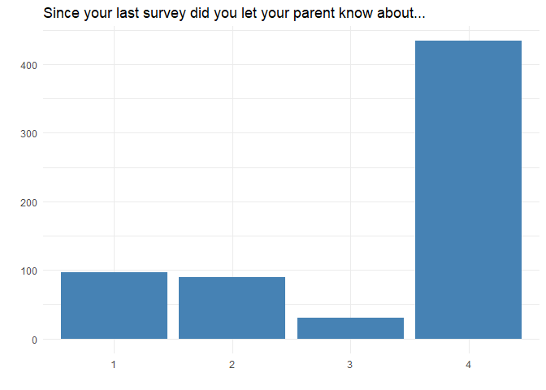<!-- -->


#### Missingness

**Missingness Descriptives**

Delivered / Answered = 583 / 582
Missing = 1
Min = 0, Max = 1, Mean = 0.01, SD = 0.09
(Descriptives are rounded to 2 decimals)

Missingness Intraclass Correlation (ICC) = 1.27 


#### Screenshot


</div>


</div> <!-- Header section -->

<div class = "header-shading">

#### Give you information, or ideas about how to make things better <br>

<div style="font-weight: bold; color: #2a5caa; margin-top: -0.7em; margin-bottom: 1em;">
  <a href="#Item 874-anchor"> [Item 874] </a>
</div>


</div>


<!-- Body -->


<div class = "anchor">

<div id="Question 5631-anchor">
  <strong>Question ID</strong>: Question 5631
</div>

**Way the question was delivered:** Slider

**Type of data:** numeric

</div> <div class = "anchor">


**Descriptives**
Min = 0, Max = 100, Mean = 43.27, SD = 33.35 


<button 
  onclick="let e = document.getElementById('Question 5631');
           let arrow = document.getElementById('Question 5631_arrow');
           e.style.display = e.style.display === 'none' ? 'block' : 'none';
           arrow.textContent = e.style.display === 'none' ? '▼' : '▲';"
  style="background: none; border: none; padding: 0; font-weight: bold; font-size: 18px; color: #2a5caa; cursor: pointer;">
Click to view visuals <span id="Question 5631_arrow">▼</span>
</button>

<div id="Question 5631" style="display: none;">


<!-- TOC-IGNORE-BEGIN -->

### Descriptives {.tabset}


#### Histogram

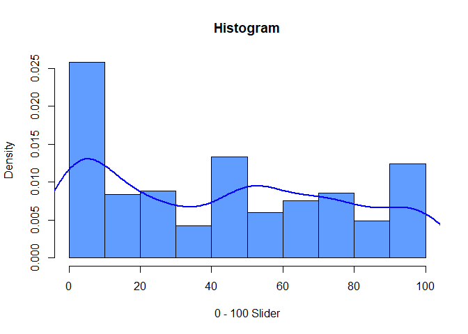<!-- -->


#### Missingness

**Missingness Descriptives**

Delivered / Answered = 469 / 466
Missing = 3
Min = 0, Max = 1, Mean = 0.03, SD = 0.17
(Descriptives are rounded to 2 decimals)

Missingness Intraclass Correlation (ICC) = 1.29 


#### Screenshot


</div>

</div> <!-- Header section -->

<div class = "header-shading">

#### Do something to help you (ex: pick you up, help with homework) <br>

<div style="font-weight: bold; color: #2a5caa; margin-top: -0.7em; margin-bottom: 1em;">
  <a href="#Item 875-anchor"> [Item 875] </a>
</div>


</div>


<!-- Body -->


<div class = "anchor">

<div id="Question 1405-anchor">
  <strong>Question ID</strong>: Question 1405
</div>

**Way the question was delivered:** Slider

**Type of data:** numeric

</div> <div class = "anchor">


**Descriptives**
Min = 0, Max = 100, Mean = 48.35, SD = 33.8 


<button 
  onclick="let e = document.getElementById('Question 1405');
           let arrow = document.getElementById('Question 1405_arrow');
           e.style.display = e.style.display === 'none' ? 'block' : 'none';
           arrow.textContent = e.style.display === 'none' ? '▼' : '▲';"
  style="background: none; border: none; padding: 0; font-weight: bold; font-size: 18px; color: #2a5caa; cursor: pointer;">
Click to view visuals <span id="Question 1405_arrow">▼</span>
</button>

<div id="Question 1405" style="display: none;">


<!-- TOC-IGNORE-BEGIN -->

### Descriptives {.tabset}


#### Histogram

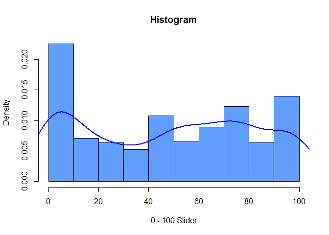<!-- -->


#### Missingness

**Missingness Descriptives**

Delivered / Answered = 597 / 595
Missing = 2
Min = 0, Max = 1, Mean = 0.02, SD = 0.12
(Descriptives are rounded to 2 decimals)

Missingness Intraclass Correlation (ICC) = 1.31 


#### Screenshot


</div>

</div> <!-- Header section -->

<div class = "header-shading">

#### Give you emotional support (ex: listen to and comfort you) <br>

<div style="font-weight: bold; color: #2a5caa; margin-top: -0.7em; margin-bottom: 1em;">
  <a href="#Item 879-anchor"> [Item 879] </a>
</div>


</div>


<!-- Body -->


<div class = "anchor">

<div id="Question 1862-anchor">
  <strong>Question ID</strong>: Question 1862
</div>

**Way the question was delivered:** Slider

**Type of data:** numeric

</div> <div class = "anchor">


**Descriptives**
Min = 0, Max = 100, Mean = 41.47, SD = 32.05 


<button 
  onclick="let e = document.getElementById('Question 1862');
           let arrow = document.getElementById('Question 1862_arrow');
           e.style.display = e.style.display === 'none' ? 'block' : 'none';
           arrow.textContent = e.style.display === 'none' ? '▼' : '▲';"
  style="background: none; border: none; padding: 0; font-weight: bold; font-size: 18px; color: #2a5caa; cursor: pointer;">
Click to view visuals <span id="Question 1862_arrow">▼</span>
</button>

<div id="Question 1862" style="display: none;">


<!-- TOC-IGNORE-BEGIN -->

### Descriptives {.tabset}


#### Histogram

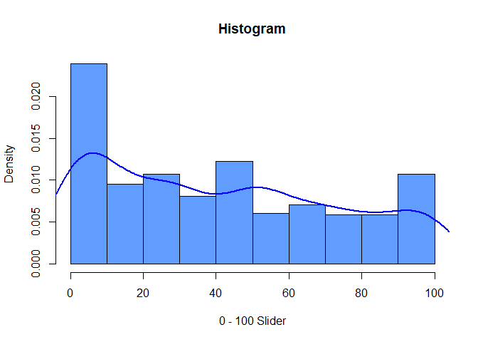<!-- -->


#### Missingness

**Missingness Descriptives**

Delivered / Answered = 598 / 596
Missing = 2
Min = 0, Max = 1, Mean = 0.02, SD = 0.12
(Descriptives are rounded to 2 decimals)

Missingness Intraclass Correlation (ICC) = 1.31 


#### Screenshot


</div>

</div> 
### Block: Item 1136 <!-- Header section -->

<div class = "header-shading">

#### Overall, how helpful was your parent? <br>

<div style="font-weight: bold; color: #2a5caa; margin-top: -0.7em; margin-bottom: 1em;">
  <a href="#Item 1143-anchor"> [Item 1143] </a>
</div>


</div>


<!-- Body -->


<div class = "anchor">

<div id="Question 2079-anchor">
  <strong>Question ID</strong>: Question 2079
</div>

**Way the question was delivered:** Slider

**Type of data:** numeric

</div> <div class = "anchor">


**Descriptives**
Min = 0, Max = 100, Mean = 69.08, SD = 24.42 


<button 
  onclick="let e = document.getElementById('Question 2079');
           let arrow = document.getElementById('Question 2079_arrow');
           e.style.display = e.style.display === 'none' ? 'block' : 'none';
           arrow.textContent = e.style.display === 'none' ? '▼' : '▲';"
  style="background: none; border: none; padding: 0; font-weight: bold; font-size: 18px; color: #2a5caa; cursor: pointer;">
Click to view visuals <span id="Question 2079_arrow">▼</span>
</button>

<div id="Question 2079" style="display: none;">


<!-- TOC-IGNORE-BEGIN -->

### Descriptives {.tabset}


#### Histogram

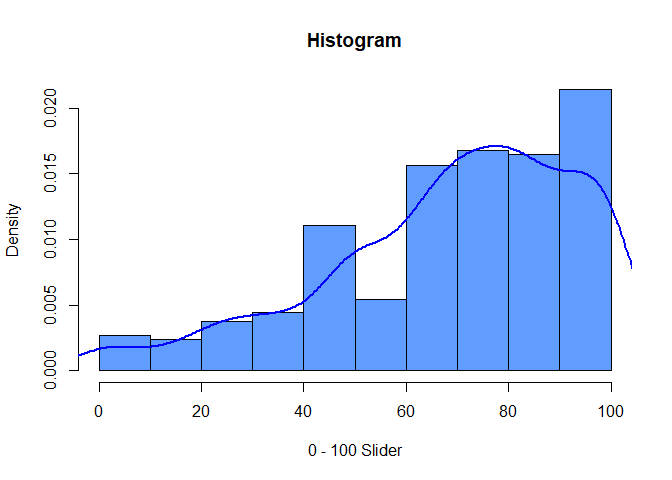<!-- -->


#### Missingness

**Missingness Descriptives**

Delivered / Answered = 590 / 589
Missing = 1
Min = 0, Max = 1, Mean = 0.01, SD = 0.09
(Descriptives are rounded to 2 decimals)

Missingness Intraclass Correlation (ICC) = 1.27 


#### Screenshot


</div>

</div> <!-- Header section -->

<div class = "header-shading">

#### How much did you want your parent to... <br>

<div style="font-weight: bold; color: #2a5caa; margin-top: -0.7em; margin-bottom: 1em;">
  <a href="#Item 1144-anchor"> [Item 1144] </a>
</div>


</div>


<!-- Body -->


<div class = "anchor">

<div id="Question 2078-anchor">
  <strong>Question ID</strong>: Question 2078
</div>

**Way the question was delivered:** Informational Fullscreen

**Type of data:** NA

</div> <div class = "anchor">


</div> <!-- Header section -->

<div class = "header-shading">

#### End Block <br>

<div style="font-weight: bold; color: #2a5caa; margin-top: -0.7em; margin-bottom: 1em;">
  <a href="#Item 1199-anchor"> [Item 1199] </a>
</div>


</div>


<!-- Body -->


<div class = "anchor">

<div id="Question 2080-anchor">
  <strong>Question ID</strong>: Question 2080
</div>

**Way the question was delivered:** End Block

**Type of data:** NA

</div>  
### Block: Item 1361 <!-- Header section -->

<div class = "header-shading">

#### Since your last survey, did you experience any stressful events at home, school or elsewhere? <br>

<div style="font-weight: bold; color: #2a5caa; margin-top: -0.7em; margin-bottom: 1em;">
  <a href="#Item 4463-anchor"> [Item 4463] </a>
</div>


</div>


<!-- Body -->


<div class = "anchor">

<div id="Question 4137-anchor">
  <strong>Question ID</strong>: Question 4137
</div>

**Way the question was delivered:** Multiple Choice

**Type of data:** integer

</div> 
<div class = "anchor">


<button 
  onclick="let e = document.getElementById('Question 4137');
           let arrow = document.getElementById('Question 4137_arrow');
           e.style.display = e.style.display === 'none' ? 'block' : 'none';
           arrow.textContent = e.style.display === 'none' ? '▼' : '▲';"
  style="background: none; border: none; padding: 0; font-weight: bold; font-size: 18px; color: #2a5caa; cursor: pointer;">
Click to view visuals <span id="Question 4137_arrow">▼</span>
</button>

<div id="Question 4137" style="display: none;">


<!-- TOC-IGNORE-BEGIN -->

### Descriptives {.tabset}


#### Frequency Table

<table class="table" style="color: black; margin-left: auto; margin-right: auto;">
 <thead>
  <tr>
   <th style="text-align:left;"> Value </th>
   <th style="text-align:left;"> Label </th>
   <th style="text-align:left;"> Counts </th>
   <th style="text-align:left;"> Percentages </th>
  </tr>
 </thead>
<tbody>
  <tr>
   <td style="text-align:left;"> 1 </td>
   <td style="text-align:left;"> Yes </td>
   <td style="text-align:left;color: darkgreen !important;"> N = 69 </td>
   <td style="text-align:left;"> 8.1% </td>
  </tr>
  <tr>
   <td style="text-align:left;"> 2 </td>
   <td style="text-align:left;"> No </td>
   <td style="text-align:left;color: darkgreen !important;"> N = 788 </td>
   <td style="text-align:left;"> 91.9% </td>
  </tr>
</tbody>
</table>


#### Barplot

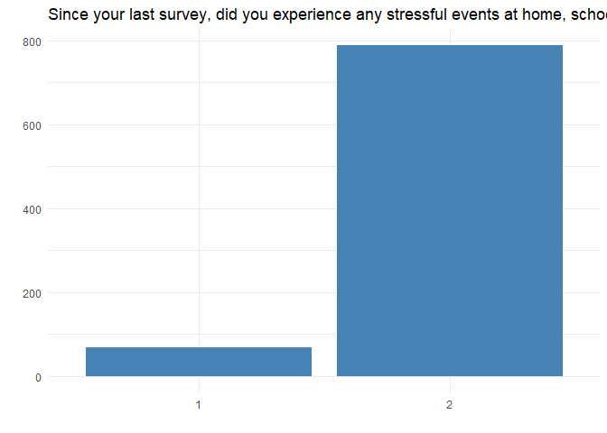<!-- -->


#### Missingness

**Missingness Descriptives**

Delivered / Answered = 857 / 857
Missing = 0
Min = 0, Max = 0, Mean = 0, SD = 0
(Descriptives are rounded to 2 decimals)

Missingness Intraclass Correlation (ICC) = NaN 


#### Screenshot


</div>


</div> <!-- Header section -->

<div class = "header-shading">

#### Since your last survey, did you see or communicate with your parent? <br>

<div style="font-weight: bold; color: #2a5caa; margin-top: -0.7em; margin-bottom: 1em;">
  <a href="#Item 4464-anchor"> [Item 4464] </a>
</div>


</div>


<!-- Body -->


<div class = "anchor">

<div id="Question 4138-anchor">
  <strong>Question ID</strong>: Question 4138
</div>

**Way the question was delivered:** Multiple Choice

**Type of data:** integer

</div> 
<div class = "anchor">


<button 
  onclick="let e = document.getElementById('Question 4138');
           let arrow = document.getElementById('Question 4138_arrow');
           e.style.display = e.style.display === 'none' ? 'block' : 'none';
           arrow.textContent = e.style.display === 'none' ? '▼' : '▲';"
  style="background: none; border: none; padding: 0; font-weight: bold; font-size: 18px; color: #2a5caa; cursor: pointer;">
Click to view visuals <span id="Question 4138_arrow">▼</span>
</button>

<div id="Question 4138" style="display: none;">


<!-- TOC-IGNORE-BEGIN -->

### Descriptives {.tabset}


#### Frequency Table

<table class="table" style="color: black; margin-left: auto; margin-right: auto;">
 <thead>
  <tr>
   <th style="text-align:left;"> Value </th>
   <th style="text-align:left;"> Label </th>
   <th style="text-align:left;"> Counts </th>
   <th style="text-align:left;"> Percentages </th>
  </tr>
 </thead>
<tbody>
  <tr>
   <td style="text-align:left;"> 1 </td>
   <td style="text-align:left;"> Yes </td>
   <td style="text-align:left;color: darkgreen !important;"> N = 592 </td>
   <td style="text-align:left;"> 69.2% </td>
  </tr>
  <tr>
   <td style="text-align:left;"> 2 </td>
   <td style="text-align:left;"> No </td>
   <td style="text-align:left;color: darkgreen !important;"> N = 263 </td>
   <td style="text-align:left;"> 30.8% </td>
  </tr>
</tbody>
</table>


#### Barplot

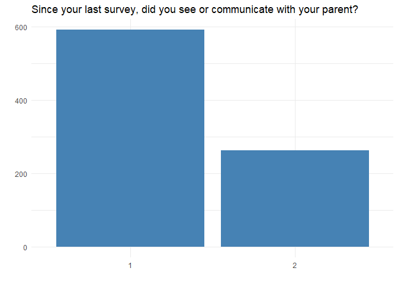<!-- -->


#### Missingness

**Missingness Descriptives**

Delivered / Answered = 856 / 855
Missing = 1
Min = 0, Max = 1, Mean = 0.01, SD = 0.09
(Descriptives are rounded to 2 decimals)

Missingness Intraclass Correlation (ICC) = 1.17 


#### Screenshot


</div>


</div> 
### Block: Item 5539 <!-- Header section -->

<div class = "header-shading">

#### Think about your sleep from last night to this morning: <br>

<div style="font-weight: bold; color: #2a5caa; margin-top: -0.7em; margin-bottom: 1em;">
  <a href="#Item 6302-anchor"> [Item 6302] </a>
</div>


</div>


<!-- Body -->


<div class = "anchor">

<div id="Question 6802-anchor">
  <strong>Question ID</strong>: Question 6802
</div>

**Way the question was delivered:** Informational Fullscreen

**Type of data:** NA

</div> <div class = "anchor">


</div> <!-- Header section -->

<div class = "header-shading">

#### How many minutes did it take for you to fall asleep? <br>

<div style="font-weight: bold; color: #2a5caa; margin-top: -0.7em; margin-bottom: 1em;">
  <a href="#Item 6305-anchor"> [Item 6305] </a>
</div>


</div>


<!-- Body -->


<div class = "anchor">

<div id="Question 6805-anchor">
  <strong>Question ID</strong>: Question 6805
</div>

**Way the question was delivered:** Free Response

**Type of data:** character

</div> <div class = "anchor">


<button 
  onclick="let e = document.getElementById('Question 6805');
           let arrow = document.getElementById('Question 6805_arrow');
           e.style.display = e.style.display === 'none' ? 'block' : 'none';
           arrow.textContent = e.style.display === 'none' ? '▼' : '▲';"
  style="background: none; border: none; padding: 0; font-weight: bold; font-size: 18px; color: #2a5caa; cursor: pointer;">
Click to view visuals <span id="Question 6805_arrow">▼</span>
</button>

<div id="Question 6805" style="display: none;">


<!-- TOC-IGNORE-BEGIN -->

### Descriptives {.tabset}


#### Missingness

**Missingness Descriptives**

Delivered / Answered = 39 / 39
Missing = 0
Min = 0, Max = 0, Mean = 0, SD = 0
(Descriptives are rounded to 2 decimals)

Missingness Intraclass Correlation (ICC) = NaN 


#### Screenshot


</div>


</div> <!-- Header section -->

<div class = "header-shading">

#### Did you wake up during the night (Not counting your final wake-up in the morning)? <br>

<div style="font-weight: bold; color: #2a5caa; margin-top: -0.7em; margin-bottom: 1em;">
  <a href="#Item 6306-anchor"> [Item 6306] </a>
</div>


</div>


<!-- Body -->


<div class = "anchor">

<div id="Question 6806-anchor">
  <strong>Question ID</strong>: Question 6806
</div>

**Way the question was delivered:** Multiple Choice

**Type of data:** integer

</div> 
<div class = "anchor">


<button 
  onclick="let e = document.getElementById('Question 6806');
           let arrow = document.getElementById('Question 6806_arrow');
           e.style.display = e.style.display === 'none' ? 'block' : 'none';
           arrow.textContent = e.style.display === 'none' ? '▼' : '▲';"
  style="background: none; border: none; padding: 0; font-weight: bold; font-size: 18px; color: #2a5caa; cursor: pointer;">
Click to view visuals <span id="Question 6806_arrow">▼</span>
</button>

<div id="Question 6806" style="display: none;">


<!-- TOC-IGNORE-BEGIN -->

### Descriptives {.tabset}


#### Frequency Table

<table class="table" style="color: black; margin-left: auto; margin-right: auto;">
 <thead>
  <tr>
   <th style="text-align:left;"> Value </th>
   <th style="text-align:left;"> Label </th>
   <th style="text-align:left;"> Counts </th>
   <th style="text-align:left;"> Percentages </th>
  </tr>
 </thead>
<tbody>
  <tr>
   <td style="text-align:left;"> 1 </td>
   <td style="text-align:left;"> Yes </td>
   <td style="text-align:left;color: darkgreen !important;"> N = 11 </td>
   <td style="text-align:left;"> 28.2% </td>
  </tr>
  <tr>
   <td style="text-align:left;"> 2 </td>
   <td style="text-align:left;"> No </td>
   <td style="text-align:left;color: darkgreen !important;"> N = 28 </td>
   <td style="text-align:left;"> 71.8% </td>
  </tr>
</tbody>
</table>


#### Barplot

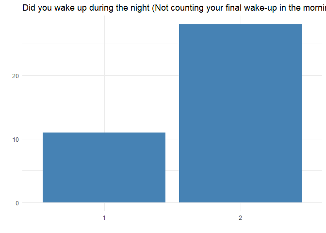<!-- -->


#### Missingness

**Missingness Descriptives**

Delivered / Answered = 39 / 39
Missing = 0
Min = 0, Max = 0, Mean = 0, SD = 0
(Descriptives are rounded to 2 decimals)

Missingness Intraclass Correlation (ICC) = NaN 


#### Screenshot


</div>


</div> 
### Block: Item 6307 <!-- Header section -->

<div class = "header-shading">

#### How would you rate the quality of your sleep? <br>

<div style="font-weight: bold; color: #2a5caa; margin-top: -0.7em; margin-bottom: 1em;">
  <a href="#Item 6309-anchor"> [Item 6309] </a>
</div>


</div>


<!-- Body -->


<div class = "anchor">

<div id="Question 6811-anchor">
  <strong>Question ID</strong>: Question 6811
</div>

**Way the question was delivered:** Slider

**Type of data:** numeric

</div> <div class = "anchor">


**Descriptives**
Min = 9, Max = 100, Mean = 70.08, SD = 21.95 


<button 
  onclick="let e = document.getElementById('Question 6811');
           let arrow = document.getElementById('Question 6811_arrow');
           e.style.display = e.style.display === 'none' ? 'block' : 'none';
           arrow.textContent = e.style.display === 'none' ? '▼' : '▲';"
  style="background: none; border: none; padding: 0; font-weight: bold; font-size: 18px; color: #2a5caa; cursor: pointer;">
Click to view visuals <span id="Question 6811_arrow">▼</span>
</button>

<div id="Question 6811" style="display: none;">


<!-- TOC-IGNORE-BEGIN -->

### Descriptives {.tabset}


#### Histogram

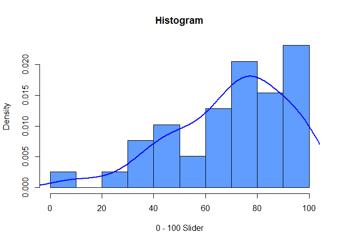<!-- -->


#### Missingness

**Missingness Descriptives**

Delivered / Answered = 39 / 39
Missing = 0
Min = 0, Max = 0, Mean = 0, SD = 0
(Descriptives are rounded to 2 decimals)

Missingness Intraclass Correlation (ICC) = NaN 


#### Screenshot


</div>

</div> <!-- Header section -->

<div class = "header-shading">

#### How bothered or stressed were you because of this? <br>

<div style="font-weight: bold; color: #2a5caa; margin-top: -0.7em; margin-bottom: 1em;">
  <a href="#Item 1118-anchor"> [Item 1118] </a>
</div>


</div>


<!-- Body -->


<div class = "anchor">

<div id="Question 1847-anchor">
  <strong>Question ID</strong>: Question 1847
</div>

**Way the question was delivered:** Slider

**Type of data:** numeric

</div> <div class = "anchor">


**Descriptives**
Min = NA, Max = NA, Mean = NA, SD = NA 


<button 
  onclick="let e = document.getElementById('Question 1847');
           let arrow = document.getElementById('Question 1847_arrow');
           e.style.display = e.style.display === 'none' ? 'block' : 'none';
           arrow.textContent = e.style.display === 'none' ? '▼' : '▲';"
  style="background: none; border: none; padding: 0; font-weight: bold; font-size: 18px; color: #2a5caa; cursor: pointer;">
Click to view visuals <span id="Question 1847_arrow">▼</span>
</button>

<div id="Question 1847" style="display: none;">


<!-- TOC-IGNORE-BEGIN -->

### Descriptives {.tabset}


#### Missingness

**Missingness Descriptives**

Delivered / Answered = 0 / 0
Missing = 0
Min = NA, Max = NA, Mean = NA, SD = NA
(Descriptives are rounded to 2 decimals)

Missingness Intraclass Correlation (ICC) = NA 


#### Screenshot


</div>

</div> <!-- Header section -->

<div class = "header-shading">

#### With whom did you have an argument or disagreement? <br>

<div style="font-weight: bold; color: #2a5caa; margin-top: -0.7em; margin-bottom: 1em;">
  <a href="#Item 1119-anchor"> [Item 1119] </a>
</div>


</div>


<!-- Body -->


<div class = "anchor">

<div id="Question 1848-anchor">
  <strong>Question ID</strong>: Question 1848
</div>

**Way the question was delivered:** Multiple Select

**Type of data:** integer

</div> 
<div class = "anchor">


<button 
  onclick="let e = document.getElementById('Question 1848');
           let arrow = document.getElementById('Question 1848_arrow');
           e.style.display = e.style.display === 'none' ? 'block' : 'none';
           arrow.textContent = e.style.display === 'none' ? '▼' : '▲';"
  style="background: none; border: none; padding: 0; font-weight: bold; font-size: 18px; color: #2a5caa; cursor: pointer;">
Click to view visuals <span id="Question 1848_arrow">▼</span>
</button>

<div id="Question 1848" style="display: none;">


<!-- TOC-IGNORE-BEGIN -->

### Descriptives {.tabset}


<table class="table" style="color: black; margin-left: auto; margin-right: auto;">
 <thead>
  <tr>
   <th style="text-align:right;"> Value </th>
   <th style="text-align:left;"> Label </th>
   <th style="text-align:left;"> Counts </th>
   <th style="text-align:left;"> Percentages </th>
  </tr>
 </thead>
<tbody>
  <tr>
   <td style="text-align:right;"> 1 </td>
   <td style="text-align:left;"> Parents </td>
   <td style="text-align:left;color: darkgreen !important;"> N = 0 </td>
   <td style="text-align:left;"> 0% </td>
  </tr>
  <tr>
   <td style="text-align:right;"> 2 </td>
   <td style="text-align:left;"> Siblings </td>
   <td style="text-align:left;color: darkgreen !important;"> N = 0 </td>
   <td style="text-align:left;"> 0% </td>
  </tr>
  <tr>
   <td style="text-align:right;"> 3 </td>
   <td style="text-align:left;"> Friends, other people your age </td>
   <td style="text-align:left;color: darkgreen !important;"> N = 0 </td>
   <td style="text-align:left;"> 0% </td>
  </tr>
  <tr>
   <td style="text-align:right;"> 4 </td>
   <td style="text-align:left;"> Teachers, coaches, other adults </td>
   <td style="text-align:left;color: darkgreen !important;"> N = 0 </td>
   <td style="text-align:left;"> 0% </td>
  </tr>
  <tr>
   <td style="text-align:right;"> 5 </td>
   <td style="text-align:left;"> Other (ex: cashier, a stranger) </td>
   <td style="text-align:left;color: darkgreen !important;"> N = 0 </td>
   <td style="text-align:left;"> 0% </td>
  </tr>
</tbody>
</table>


#### Missingness

**Missingness Descriptives**

Delivered / Answered = 0 / 0
Missing = 0
Min = NA, Max = NA, Mean = NA, SD = NA
(Descriptives are rounded to 2 decimals)

Missingness Intraclass Correlation (ICC) = NA 


#### Screenshot


</div>


</div> <!-- Header section -->

<div class = "header-shading">

#### How bothered or stressed were you because of this? <br>

<div style="font-weight: bold; color: #2a5caa; margin-top: -0.7em; margin-bottom: 1em;">
  <a href="#Item 1122-anchor"> [Item 1122] </a>
</div>


</div>


<!-- Body -->


<div class = "anchor">

<div id="Question 1850-anchor">
  <strong>Question ID</strong>: Question 1850
</div>

**Way the question was delivered:** Slider

**Type of data:** numeric

</div> <div class = "anchor">


**Descriptives**
Min = NA, Max = NA, Mean = NA, SD = NA 


<button 
  onclick="let e = document.getElementById('Question 1850');
           let arrow = document.getElementById('Question 1850_arrow');
           e.style.display = e.style.display === 'none' ? 'block' : 'none';
           arrow.textContent = e.style.display === 'none' ? '▼' : '▲';"
  style="background: none; border: none; padding: 0; font-weight: bold; font-size: 18px; color: #2a5caa; cursor: pointer;">
Click to view visuals <span id="Question 1850_arrow">▼</span>
</button>

<div id="Question 1850" style="display: none;">


<!-- TOC-IGNORE-BEGIN -->

### Descriptives {.tabset}


#### Missingness

**Missingness Descriptives**

Delivered / Answered = 0 / 0
Missing = 0
Min = NA, Max = NA, Mean = NA, SD = NA
(Descriptives are rounded to 2 decimals)

Missingness Intraclass Correlation (ICC) = NA 


#### Screenshot


</div>

</div> <!-- Header section -->

<div class = "header-shading">

#### Where did you feel this way? <br>

<div style="font-weight: bold; color: #2a5caa; margin-top: -0.7em; margin-bottom: 1em;">
  <a href="#Item 1123-anchor"> [Item 1123] </a>
</div>


</div>


<!-- Body -->


<div class = "anchor">

<div id="Question 1851-anchor">
  <strong>Question ID</strong>: Question 1851
</div>

**Way the question was delivered:** Multiple Select

**Type of data:** integer

</div> 
<div class = "anchor">


<button 
  onclick="let e = document.getElementById('Question 1851');
           let arrow = document.getElementById('Question 1851_arrow');
           e.style.display = e.style.display === 'none' ? 'block' : 'none';
           arrow.textContent = e.style.display === 'none' ? '▼' : '▲';"
  style="background: none; border: none; padding: 0; font-weight: bold; font-size: 18px; color: #2a5caa; cursor: pointer;">
Click to view visuals <span id="Question 1851_arrow">▼</span>
</button>

<div id="Question 1851" style="display: none;">


<!-- TOC-IGNORE-BEGIN -->

### Descriptives {.tabset}


<table class="table" style="color: black; margin-left: auto; margin-right: auto;">
 <thead>
  <tr>
   <th style="text-align:right;"> Value </th>
   <th style="text-align:left;"> Label </th>
   <th style="text-align:left;"> Counts </th>
   <th style="text-align:left;"> Percentages </th>
  </tr>
 </thead>
<tbody>
  <tr>
   <td style="text-align:right;"> 1 </td>
   <td style="text-align:left;"> Home </td>
   <td style="text-align:left;color: darkgreen !important;"> N = 0 </td>
   <td style="text-align:left;"> 0% </td>
  </tr>
  <tr>
   <td style="text-align:right;"> 2 </td>
   <td style="text-align:left;"> School or extracurricular activity </td>
   <td style="text-align:left;color: darkgreen !important;"> N = 0 </td>
   <td style="text-align:left;"> 0% </td>
  </tr>
  <tr>
   <td style="text-align:right;"> 3 </td>
   <td style="text-align:left;"> Other (ex: at the store) </td>
   <td style="text-align:left;color: darkgreen !important;"> N = 0 </td>
   <td style="text-align:left;"> 0% </td>
  </tr>
</tbody>
</table>


#### Missingness

**Missingness Descriptives**

Delivered / Answered = 0 / 0
Missing = 0
Min = NA, Max = NA, Mean = NA, SD = NA
(Descriptives are rounded to 2 decimals)

Missingness Intraclass Correlation (ICC) = NA 


#### Screenshot


</div>


</div> <!-- Header section -->

<div class = "header-shading">

#### How bothered or stressed were you because of this? <br>

<div style="font-weight: bold; color: #2a5caa; margin-top: -0.7em; margin-bottom: 1em;">
  <a href="#Item 1126-anchor"> [Item 1126] </a>
</div>


</div>


<!-- Body -->


<div class = "anchor">

<div id="Question 1853-anchor">
  <strong>Question ID</strong>: Question 1853
</div>

**Way the question was delivered:** Slider

**Type of data:** numeric

</div> <div class = "anchor">


**Descriptives**
Min = NA, Max = NA, Mean = NA, SD = NA 


<button 
  onclick="let e = document.getElementById('Question 1853');
           let arrow = document.getElementById('Question 1853_arrow');
           e.style.display = e.style.display === 'none' ? 'block' : 'none';
           arrow.textContent = e.style.display === 'none' ? '▼' : '▲';"
  style="background: none; border: none; padding: 0; font-weight: bold; font-size: 18px; color: #2a5caa; cursor: pointer;">
Click to view visuals <span id="Question 1853_arrow">▼</span>
</button>

<div id="Question 1853" style="display: none;">


<!-- TOC-IGNORE-BEGIN -->

### Descriptives {.tabset}


#### Missingness

**Missingness Descriptives**

Delivered / Answered = 0 / 0
Missing = 0
Min = NA, Max = NA, Mean = NA, SD = NA
(Descriptives are rounded to 2 decimals)

Missingness Intraclass Correlation (ICC) = NA 


#### Screenshot


</div>

</div> <!-- Header section -->

<div class = "header-shading">

#### Where did this happen? <br>

<div style="font-weight: bold; color: #2a5caa; margin-top: -0.7em; margin-bottom: 1em;">
  <a href="#Item 1127-anchor"> [Item 1127] </a>
</div>


</div>


<!-- Body -->


<div class = "anchor">

<div id="Question 1854-anchor">
  <strong>Question ID</strong>: Question 1854
</div>

**Way the question was delivered:** Multiple Select

**Type of data:** integer

</div> 
<div class = "anchor">


<button 
  onclick="let e = document.getElementById('Question 1854');
           let arrow = document.getElementById('Question 1854_arrow');
           e.style.display = e.style.display === 'none' ? 'block' : 'none';
           arrow.textContent = e.style.display === 'none' ? '▼' : '▲';"
  style="background: none; border: none; padding: 0; font-weight: bold; font-size: 18px; color: #2a5caa; cursor: pointer;">
Click to view visuals <span id="Question 1854_arrow">▼</span>
</button>

<div id="Question 1854" style="display: none;">


<!-- TOC-IGNORE-BEGIN -->

### Descriptives {.tabset}


<table class="table" style="color: black; margin-left: auto; margin-right: auto;">
 <thead>
  <tr>
   <th style="text-align:right;"> Value </th>
   <th style="text-align:left;"> Label </th>
   <th style="text-align:left;"> Counts </th>
   <th style="text-align:left;"> Percentages </th>
  </tr>
 </thead>
<tbody>
  <tr>
   <td style="text-align:right;"> 1 </td>
   <td style="text-align:left;"> Home </td>
   <td style="text-align:left;color: darkgreen !important;"> N = 0 </td>
   <td style="text-align:left;"> 0% </td>
  </tr>
  <tr>
   <td style="text-align:right;"> 2 </td>
   <td style="text-align:left;"> School or extracurricular activity </td>
   <td style="text-align:left;color: darkgreen !important;"> N = 0 </td>
   <td style="text-align:left;"> 0% </td>
  </tr>
  <tr>
   <td style="text-align:right;"> 3 </td>
   <td style="text-align:left;"> Other (ex: at the store) </td>
   <td style="text-align:left;color: darkgreen !important;"> N = 0 </td>
   <td style="text-align:left;"> 0% </td>
  </tr>
</tbody>
</table>


#### Missingness

**Missingness Descriptives**

Delivered / Answered = 0 / 0
Missing = 0
Min = NA, Max = NA, Mean = NA, SD = NA
(Descriptives are rounded to 2 decimals)

Missingness Intraclass Correlation (ICC) = NA 


#### Screenshot


</div>


</div> <!-- Header section -->

<div class = "header-shading">

#### How bothered or stressed were you because of this? <br>

<div style="font-weight: bold; color: #2a5caa; margin-top: -0.7em; margin-bottom: 1em;">
  <a href="#Item 1130-anchor"> [Item 1130] </a>
</div>


</div>


<!-- Body -->


<div class = "anchor">

<div id="Question 1856-anchor">
  <strong>Question ID</strong>: Question 1856
</div>

**Way the question was delivered:** Slider

**Type of data:** numeric

</div> <div class = "anchor">


**Descriptives**
Min = NA, Max = NA, Mean = NA, SD = NA 


<button 
  onclick="let e = document.getElementById('Question 1856');
           let arrow = document.getElementById('Question 1856_arrow');
           e.style.display = e.style.display === 'none' ? 'block' : 'none';
           arrow.textContent = e.style.display === 'none' ? '▼' : '▲';"
  style="background: none; border: none; padding: 0; font-weight: bold; font-size: 18px; color: #2a5caa; cursor: pointer;">
Click to view visuals <span id="Question 1856_arrow">▼</span>
</button>

<div id="Question 1856" style="display: none;">


<!-- TOC-IGNORE-BEGIN -->

### Descriptives {.tabset}


#### Missingness

**Missingness Descriptives**

Delivered / Answered = 0 / 0
Missing = 0
Min = NA, Max = NA, Mean = NA, SD = NA
(Descriptives are rounded to 2 decimals)

Missingness Intraclass Correlation (ICC) = NA 


#### Screenshot


</div>

</div> <!-- Header section -->

<div class = "header-shading">

#### Who did this problem involve? <br>

<div style="font-weight: bold; color: #2a5caa; margin-top: -0.7em; margin-bottom: 1em;">
  <a href="#Item 1131-anchor"> [Item 1131] </a>
</div>


</div>


<!-- Body -->


<div class = "anchor">

<div id="Question 1857-anchor">
  <strong>Question ID</strong>: Question 1857
</div>

**Way the question was delivered:** Multiple Select

**Type of data:** integer

</div> 
<div class = "anchor">


<button 
  onclick="let e = document.getElementById('Question 1857');
           let arrow = document.getElementById('Question 1857_arrow');
           e.style.display = e.style.display === 'none' ? 'block' : 'none';
           arrow.textContent = e.style.display === 'none' ? '▼' : '▲';"
  style="background: none; border: none; padding: 0; font-weight: bold; font-size: 18px; color: #2a5caa; cursor: pointer;">
Click to view visuals <span id="Question 1857_arrow">▼</span>
</button>

<div id="Question 1857" style="display: none;">


<!-- TOC-IGNORE-BEGIN -->

### Descriptives {.tabset}


<table class="table" style="color: black; margin-left: auto; margin-right: auto;">
 <thead>
  <tr>
   <th style="text-align:right;"> Value </th>
   <th style="text-align:left;"> Label </th>
   <th style="text-align:left;"> Counts </th>
   <th style="text-align:left;"> Percentages </th>
  </tr>
 </thead>
<tbody>
  <tr>
   <td style="text-align:right;"> 1 </td>
   <td style="text-align:left;"> Family </td>
   <td style="text-align:left;color: darkgreen !important;"> N = 0 </td>
   <td style="text-align:left;"> 0% </td>
  </tr>
  <tr>
   <td style="text-align:right;"> 2 </td>
   <td style="text-align:left;"> Friends or someone you know </td>
   <td style="text-align:left;color: darkgreen !important;"> N = 0 </td>
   <td style="text-align:left;"> 0% </td>
  </tr>
  <tr>
   <td style="text-align:right;"> 3 </td>
   <td style="text-align:left;"> Other (ex: strangers) </td>
   <td style="text-align:left;color: darkgreen !important;"> N = 0 </td>
   <td style="text-align:left;"> 0% </td>
  </tr>
</tbody>
</table>


#### Missingness

**Missingness Descriptives**

Delivered / Answered = 0 / 0
Missing = 0
Min = NA, Max = NA, Mean = NA, SD = NA
(Descriptives are rounded to 2 decimals)

Missingness Intraclass Correlation (ICC) = NA 


#### Screenshot


</div>


</div> <!-- Header section -->

<div class = "header-shading">

#### Check all the ways that you interacted with your parent, in person. <br>

<div style="font-weight: bold; color: #2a5caa; margin-top: -0.7em; margin-bottom: 1em;">
  <a href="#Item 1133-anchor"> [Item 1133] </a>
</div>


</div>


<!-- Body -->


<div class = "anchor">

<div id="Question 1859-anchor">
  <strong>Question ID</strong>: Question 1859
</div>

**Way the question was delivered:** Multiple Select

**Type of data:** integer

</div> 
<div class = "anchor">


<button 
  onclick="let e = document.getElementById('Question 1859');
           let arrow = document.getElementById('Question 1859_arrow');
           e.style.display = e.style.display === 'none' ? 'block' : 'none';
           arrow.textContent = e.style.display === 'none' ? '▼' : '▲';"
  style="background: none; border: none; padding: 0; font-weight: bold; font-size: 18px; color: #2a5caa; cursor: pointer;">
Click to view visuals <span id="Question 1859_arrow">▼</span>
</button>

<div id="Question 1859" style="display: none;">


<!-- TOC-IGNORE-BEGIN -->

### Descriptives {.tabset}


<table class="table" style="color: black; margin-left: auto; margin-right: auto;">
 <thead>
  <tr>
   <th style="text-align:right;"> Value </th>
   <th style="text-align:left;"> Label </th>
   <th style="text-align:left;"> Counts </th>
   <th style="text-align:left;"> Percentages </th>
  </tr>
 </thead>
<tbody>
  <tr>
   <td style="text-align:right;"> 1 </td>
   <td style="text-align:left;"> Do something together (ex: eat, clean, watch a show) </td>
   <td style="text-align:left;color: darkgreen !important;"> N = 0 </td>
   <td style="text-align:left;"> 0% </td>
  </tr>
  <tr>
   <td style="text-align:right;"> 2 </td>
   <td style="text-align:left;"> Make physical contact (ex: hug, lean on each other) </td>
   <td style="text-align:left;color: darkgreen !important;"> N = 0 </td>
   <td style="text-align:left;"> 0% </td>
  </tr>
  <tr>
   <td style="text-align:right;"> 3 </td>
   <td style="text-align:left;"> Just be together (ex: be on your own phones) </td>
   <td style="text-align:left;color: darkgreen !important;"> N = 0 </td>
   <td style="text-align:left;"> 0% </td>
  </tr>
  <tr>
   <td style="text-align:right;"> 4 </td>
   <td style="text-align:left;"> Ask a question or make a request </td>
   <td style="text-align:left;color: darkgreen !important;"> N = 0 </td>
   <td style="text-align:left;"> 0% </td>
  </tr>
  <tr>
   <td style="text-align:right;"> 5 </td>
   <td style="text-align:left;"> Reply to a question or request </td>
   <td style="text-align:left;color: darkgreen !important;"> N = 0 </td>
   <td style="text-align:left;"> 0% </td>
  </tr>
  <tr>
   <td style="text-align:right;"> 6 </td>
   <td style="text-align:left;"> Have a conversation (ex: exchange a few words or more) </td>
   <td style="text-align:left;color: darkgreen !important;"> N = 0 </td>
   <td style="text-align:left;"> 0% </td>
  </tr>
  <tr>
   <td style="text-align:right;"> 7 </td>
   <td style="text-align:left;"> Other </td>
   <td style="text-align:left;color: darkgreen !important;"> N = 0 </td>
   <td style="text-align:left;"> 0% </td>
  </tr>
  <tr>
   <td style="text-align:right;"> 8 </td>
   <td style="text-align:left;"> None apply </td>
   <td style="text-align:left;color: darkgreen !important;"> N = 0 </td>
   <td style="text-align:left;"> 0% </td>
  </tr>
</tbody>
</table>


#### Missingness

**Missingness Descriptives**

Delivered / Answered = 0 / 0
Missing = 0
Min = NA, Max = NA, Mean = NA, SD = NA
(Descriptives are rounded to 2 decimals)

Missingness Intraclass Correlation (ICC) = NA 


#### Screenshot


</div>


</div> <!-- Header section -->

<div class = "header-shading">

#### How close did you feel to your parent? <br>

<div style="font-weight: bold; color: #2a5caa; margin-top: -0.7em; margin-bottom: 1em;">
  <a href="#Item 1134-anchor"> [Item 1134] </a>
</div>


</div>


<!-- Body -->


<div class = "anchor">

<div id="Question 2077-anchor">
  <strong>Question ID</strong>: Question 2077
</div>

**Way the question was delivered:** Slider

**Type of data:** numeric

</div> <div class = "anchor">


**Descriptives**
Min = NA, Max = NA, Mean = NA, SD = NA 


<button 
  onclick="let e = document.getElementById('Question 2077');
           let arrow = document.getElementById('Question 2077_arrow');
           e.style.display = e.style.display === 'none' ? 'block' : 'none';
           arrow.textContent = e.style.display === 'none' ? '▼' : '▲';"
  style="background: none; border: none; padding: 0; font-weight: bold; font-size: 18px; color: #2a5caa; cursor: pointer;">
Click to view visuals <span id="Question 2077_arrow">▼</span>
</button>

<div id="Question 2077" style="display: none;">


<!-- TOC-IGNORE-BEGIN -->

### Descriptives {.tabset}


#### Missingness

**Missingness Descriptives**

Delivered / Answered = 0 / 0
Missing = 0
Min = NA, Max = NA, Mean = NA, SD = NA
(Descriptives are rounded to 2 decimals)

Missingness Intraclass Correlation (ICC) = NA 


#### Screenshot


</div>

</div> <!-- Header section -->

<div class = "header-shading">

#### Who else was a part of your most recent interaction with your parent? <br>

<div style="font-weight: bold; color: #2a5caa; margin-top: -0.7em; margin-bottom: 1em;">
  <a href="#Item 1135-anchor"> [Item 1135] </a>
</div>


</div>


<!-- Body -->


<div class = "anchor">

<div id="Question 1861-anchor">
  <strong>Question ID</strong>: Question 1861
</div>

**Way the question was delivered:** Multiple Select

**Type of data:** integer

</div> 
<div class = "anchor">


<button 
  onclick="let e = document.getElementById('Question 1861');
           let arrow = document.getElementById('Question 1861_arrow');
           e.style.display = e.style.display === 'none' ? 'block' : 'none';
           arrow.textContent = e.style.display === 'none' ? '▼' : '▲';"
  style="background: none; border: none; padding: 0; font-weight: bold; font-size: 18px; color: #2a5caa; cursor: pointer;">
Click to view visuals <span id="Question 1861_arrow">▼</span>
</button>

<div id="Question 1861" style="display: none;">


<!-- TOC-IGNORE-BEGIN -->

### Descriptives {.tabset}


<table class="table" style="color: black; margin-left: auto; margin-right: auto;">
 <thead>
  <tr>
   <th style="text-align:right;"> Value </th>
   <th style="text-align:left;"> Label </th>
   <th style="text-align:left;"> Counts </th>
   <th style="text-align:left;"> Percentages </th>
  </tr>
 </thead>
<tbody>
  <tr>
   <td style="text-align:right;"> 1 </td>
   <td style="text-align:left;"> Other parent or caregivers </td>
   <td style="text-align:left;color: darkgreen !important;"> N = 0 </td>
   <td style="text-align:left;"> 0% </td>
  </tr>
  <tr>
   <td style="text-align:right;"> 2 </td>
   <td style="text-align:left;"> Siblings </td>
   <td style="text-align:left;color: darkgreen !important;"> N = 0 </td>
   <td style="text-align:left;"> 0% </td>
  </tr>
  <tr>
   <td style="text-align:right;"> 3 </td>
   <td style="text-align:left;"> Other adults </td>
   <td style="text-align:left;color: darkgreen !important;"> N = 0 </td>
   <td style="text-align:left;"> 0% </td>
  </tr>
  <tr>
   <td style="text-align:right;"> 4 </td>
   <td style="text-align:left;"> Other children or teens </td>
   <td style="text-align:left;color: darkgreen !important;"> N = 0 </td>
   <td style="text-align:left;"> 0% </td>
  </tr>
  <tr>
   <td style="text-align:right;"> 5 </td>
   <td style="text-align:left;"> Strangers (ex: cashier) </td>
   <td style="text-align:left;color: darkgreen !important;"> N = 0 </td>
   <td style="text-align:left;"> 0% </td>
  </tr>
  <tr>
   <td style="text-align:right;"> 6 </td>
   <td style="text-align:left;"> None apply </td>
   <td style="text-align:left;color: darkgreen !important;"> N = 0 </td>
   <td style="text-align:left;"> 0% </td>
  </tr>
</tbody>
</table>


#### Missingness

**Missingness Descriptives**

Delivered / Answered = 0 / 0
Missing = 0
Min = NA, Max = NA, Mean = NA, SD = NA
(Descriptives are rounded to 2 decimals)

Missingness Intraclass Correlation (ICC) = NA 


#### Screenshot


</div>


</div> <!-- Header section -->

<div class = "header-shading">

#### Check all the ways that you interacted with parents. <br>

<div style="font-weight: bold; color: #2a5caa; margin-top: -0.7em; margin-bottom: 1em;">
  <a href="#Item 4465-anchor"> [Item 4465] </a>
</div>


</div>


<!-- Body -->


<div class = "anchor">

<div id="Question 4139-anchor">
  <strong>Question ID</strong>: Question 4139
</div>

**Way the question was delivered:** Multiple Select

**Type of data:** integer

</div> 
<div class = "anchor">


<button 
  onclick="let e = document.getElementById('Question 4139');
           let arrow = document.getElementById('Question 4139_arrow');
           e.style.display = e.style.display === 'none' ? 'block' : 'none';
           arrow.textContent = e.style.display === 'none' ? '▼' : '▲';"
  style="background: none; border: none; padding: 0; font-weight: bold; font-size: 18px; color: #2a5caa; cursor: pointer;">
Click to view visuals <span id="Question 4139_arrow">▼</span>
</button>

<div id="Question 4139" style="display: none;">


<!-- TOC-IGNORE-BEGIN -->

### Descriptives {.tabset}


<table class="table" style="color: black; margin-left: auto; margin-right: auto;">
 <thead>
  <tr>
   <th style="text-align:right;"> Value </th>
   <th style="text-align:left;"> Label </th>
   <th style="text-align:left;"> Counts </th>
   <th style="text-align:left;"> Percentages </th>
  </tr>
 </thead>
<tbody>
  <tr>
   <td style="text-align:right;"> 1 </td>
   <td style="text-align:left;"> in person </td>
   <td style="text-align:left;color: darkgreen !important;"> N = 0 </td>
   <td style="text-align:left;"> 0% </td>
  </tr>
  <tr>
   <td style="text-align:right;"> 2 </td>
   <td style="text-align:left;"> text </td>
   <td style="text-align:left;color: darkgreen !important;"> N = 0 </td>
   <td style="text-align:left;"> 0% </td>
  </tr>
  <tr>
   <td style="text-align:right;"> 3 </td>
   <td style="text-align:left;"> Phone call </td>
   <td style="text-align:left;color: darkgreen !important;"> N = 0 </td>
   <td style="text-align:left;"> 0% </td>
  </tr>
  <tr>
   <td style="text-align:right;"> 4 </td>
   <td style="text-align:left;"> video chat </td>
   <td style="text-align:left;color: darkgreen !important;"> N = 0 </td>
   <td style="text-align:left;"> 0% </td>
  </tr>
  <tr>
   <td style="text-align:right;"> 5 </td>
   <td style="text-align:left;"> Other </td>
   <td style="text-align:left;color: darkgreen !important;"> N = 0 </td>
   <td style="text-align:left;"> 0% </td>
  </tr>
</tbody>
</table>


#### Missingness

**Missingness Descriptives**

Delivered / Answered = 0 / 0
Missing = 0
Min = NA, Max = NA, Mean = NA, SD = NA
(Descriptives are rounded to 2 decimals)

Missingness Intraclass Correlation (ICC) = NA 


#### Screenshot


</div>


</div> <!-- Header section -->

<div class = "header-shading">

#### Did you have an argument or disagreement? <br>

<div style="font-weight: bold; color: #2a5caa; margin-top: -0.7em; margin-bottom: 1em;">
  <a href="#Item 1117-anchor"> [Item 1117] </a>
</div>


</div>


<!-- Body -->


<div class = "anchor">

<div id="Question 1846-anchor">
  <strong>Question ID</strong>: Question 1846
</div>

**Way the question was delivered:** Multiple Choice

**Type of data:** integer

</div> 
<div class = "anchor">


<button 
  onclick="let e = document.getElementById('Question 1846');
           let arrow = document.getElementById('Question 1846_arrow');
           e.style.display = e.style.display === 'none' ? 'block' : 'none';
           arrow.textContent = e.style.display === 'none' ? '▼' : '▲';"
  style="background: none; border: none; padding: 0; font-weight: bold; font-size: 18px; color: #2a5caa; cursor: pointer;">
Click to view visuals <span id="Question 1846_arrow">▼</span>
</button>

<div id="Question 1846" style="display: none;">


<!-- TOC-IGNORE-BEGIN -->

### Descriptives {.tabset}


<table class="table" style="color: black; margin-left: auto; margin-right: auto;">
 <thead>
  <tr>
   <th style="text-align:right;"> Value </th>
   <th style="text-align:left;"> Label </th>
   <th style="text-align:left;"> Counts </th>
   <th style="text-align:left;"> Percentages </th>
  </tr>
 </thead>
<tbody>
  <tr>
   <td style="text-align:right;"> 1 </td>
   <td style="text-align:left;"> Yes </td>
   <td style="text-align:left;color: darkgreen !important;"> N = 0 </td>
   <td style="text-align:left;"> 0% </td>
  </tr>
  <tr>
   <td style="text-align:right;"> 2 </td>
   <td style="text-align:left;"> No </td>
   <td style="text-align:left;color: darkgreen !important;"> N = 0 </td>
   <td style="text-align:left;"> 0% </td>
  </tr>
</tbody>
</table>


#### Missingness

**Missingness Descriptives**

Delivered / Answered = 0 / 0
Missing = 0
Min = NA, Max = NA, Mean = NA, SD = NA
(Descriptives are rounded to 2 decimals)

Missingness Intraclass Correlation (ICC) = NA 


#### Screenshot


</div>


</div> 
### Block: Item 1120 <!-- Header section -->

<div class = "header-shading">

#### Did you feel like you had a lot of demands placed on you that were stressful? (ex: had to do a chore; had too much homework)? <br>

<div style="font-weight: bold; color: #2a5caa; margin-top: -0.7em; margin-bottom: 1em;">
  <a href="#Item 1121-anchor"> [Item 1121] </a>
</div>


</div>


<!-- Body -->


<div class = "anchor">

<div id="Question 1849-anchor">
  <strong>Question ID</strong>: Question 1849
</div>

**Way the question was delivered:** Multiple Choice

**Type of data:** integer

</div> 
<div class = "anchor">


<button 
  onclick="let e = document.getElementById('Question 1849');
           let arrow = document.getElementById('Question 1849_arrow');
           e.style.display = e.style.display === 'none' ? 'block' : 'none';
           arrow.textContent = e.style.display === 'none' ? '▼' : '▲';"
  style="background: none; border: none; padding: 0; font-weight: bold; font-size: 18px; color: #2a5caa; cursor: pointer;">
Click to view visuals <span id="Question 1849_arrow">▼</span>
</button>

<div id="Question 1849" style="display: none;">


<!-- TOC-IGNORE-BEGIN -->

### Descriptives {.tabset}


<table class="table" style="color: black; margin-left: auto; margin-right: auto;">
 <thead>
  <tr>
   <th style="text-align:right;"> Value </th>
   <th style="text-align:left;"> Label </th>
   <th style="text-align:left;"> Counts </th>
   <th style="text-align:left;"> Percentages </th>
  </tr>
 </thead>
<tbody>
  <tr>
   <td style="text-align:right;"> 1 </td>
   <td style="text-align:left;"> Yes </td>
   <td style="text-align:left;color: darkgreen !important;"> N = 0 </td>
   <td style="text-align:left;"> 0% </td>
  </tr>
  <tr>
   <td style="text-align:right;"> 2 </td>
   <td style="text-align:left;"> No </td>
   <td style="text-align:left;color: darkgreen !important;"> N = 0 </td>
   <td style="text-align:left;"> 0% </td>
  </tr>
</tbody>
</table>


#### Missingness

**Missingness Descriptives**

Delivered / Answered = 0 / 0
Missing = 0
Min = NA, Max = NA, Mean = NA, SD = NA
(Descriptives are rounded to 2 decimals)

Missingness Intraclass Correlation (ICC) = NA 


#### Screenshot


</div>


</div> 
### Block: Item 1124 <!-- Header section -->

<div class = "header-shading">

#### Did you have some other problem or event that was stressful? (ex: forgot something; was late to an appointment)? <br>

<div style="font-weight: bold; color: #2a5caa; margin-top: -0.7em; margin-bottom: 1em;">
  <a href="#Item 1125-anchor"> [Item 1125] </a>
</div>


</div>


<!-- Body -->


<div class = "anchor">

<div id="Question 1852-anchor">
  <strong>Question ID</strong>: Question 1852
</div>

**Way the question was delivered:** Multiple Choice

**Type of data:** integer

</div> 
<div class = "anchor">


<button 
  onclick="let e = document.getElementById('Question 1852');
           let arrow = document.getElementById('Question 1852_arrow');
           e.style.display = e.style.display === 'none' ? 'block' : 'none';
           arrow.textContent = e.style.display === 'none' ? '▼' : '▲';"
  style="background: none; border: none; padding: 0; font-weight: bold; font-size: 18px; color: #2a5caa; cursor: pointer;">
Click to view visuals <span id="Question 1852_arrow">▼</span>
</button>

<div id="Question 1852" style="display: none;">


<!-- TOC-IGNORE-BEGIN -->

### Descriptives {.tabset}


<table class="table" style="color: black; margin-left: auto; margin-right: auto;">
 <thead>
  <tr>
   <th style="text-align:right;"> Value </th>
   <th style="text-align:left;"> Label </th>
   <th style="text-align:left;"> Counts </th>
   <th style="text-align:left;"> Percentages </th>
  </tr>
 </thead>
<tbody>
  <tr>
   <td style="text-align:right;"> 1 </td>
   <td style="text-align:left;"> Yes </td>
   <td style="text-align:left;color: darkgreen !important;"> N = 0 </td>
   <td style="text-align:left;"> 0% </td>
  </tr>
  <tr>
   <td style="text-align:right;"> 2 </td>
   <td style="text-align:left;"> No </td>
   <td style="text-align:left;color: darkgreen !important;"> N = 0 </td>
   <td style="text-align:left;"> 0% </td>
  </tr>
</tbody>
</table>


#### Missingness

**Missingness Descriptives**

Delivered / Answered = 0 / 0
Missing = 0
Min = NA, Max = NA, Mean = NA, SD = NA
(Descriptives are rounded to 2 decimals)

Missingness Intraclass Correlation (ICC) = NA 


#### Screenshot


</div>


</div> 
### Block: Item 1128 <!-- Header section -->

<div class = "header-shading">

#### Did someone else have a problem or event that turned out to be stressful for you? <br>

<div style="font-weight: bold; color: #2a5caa; margin-top: -0.7em; margin-bottom: 1em;">
  <a href="#Item 1129-anchor"> [Item 1129] </a>
</div>


</div>


<!-- Body -->


<div class = "anchor">

<div id="Question 1855-anchor">
  <strong>Question ID</strong>: Question 1855
</div>

**Way the question was delivered:** Multiple Choice

**Type of data:** integer

</div> 
<div class = "anchor">


<button 
  onclick="let e = document.getElementById('Question 1855');
           let arrow = document.getElementById('Question 1855_arrow');
           e.style.display = e.style.display === 'none' ? 'block' : 'none';
           arrow.textContent = e.style.display === 'none' ? '▼' : '▲';"
  style="background: none; border: none; padding: 0; font-weight: bold; font-size: 18px; color: #2a5caa; cursor: pointer;">
Click to view visuals <span id="Question 1855_arrow">▼</span>
</button>

<div id="Question 1855" style="display: none;">


<!-- TOC-IGNORE-BEGIN -->

### Descriptives {.tabset}


<table class="table" style="color: black; margin-left: auto; margin-right: auto;">
 <thead>
  <tr>
   <th style="text-align:right;"> Value </th>
   <th style="text-align:left;"> Label </th>
   <th style="text-align:left;"> Counts </th>
   <th style="text-align:left;"> Percentages </th>
  </tr>
 </thead>
<tbody>
  <tr>
   <td style="text-align:right;"> 1 </td>
   <td style="text-align:left;"> Yes </td>
   <td style="text-align:left;color: darkgreen !important;"> N = 0 </td>
   <td style="text-align:left;"> 0% </td>
  </tr>
  <tr>
   <td style="text-align:right;"> 2 </td>
   <td style="text-align:left;"> No </td>
   <td style="text-align:left;color: darkgreen !important;"> N = 0 </td>
   <td style="text-align:left;"> 0% </td>
  </tr>
</tbody>
</table>


#### Missingness

**Missingness Descriptives**

Delivered / Answered = 0 / 0
Missing = 0
Min = NA, Max = NA, Mean = NA, SD = NA
(Descriptives are rounded to 2 decimals)

Missingness Intraclass Correlation (ICC) = NA 


#### Screenshot


</div>


</div> 
### Block: Item 1132 <!-- Header section -->

<div class = "header-shading">

#### No Text <br>

<div style="font-weight: bold; color: #2a5caa; margin-top: -0.7em; margin-bottom: 1em;">
  <a href="#Item 1364-anchor"> [Item 1364] </a>
</div>


</div>


<!-- Body -->


<div class = "anchor">

<div id="Question 2304-anchor">
  <strong>Question ID</strong>: Question 2304
</div>

**Way the question was delivered:** End Block

**Type of data:** NA

</div>  <!-- Header section -->

<div class = "header-shading">

#### Did you ask your parent to <br>

<div style="font-weight: bold; color: #2a5caa; margin-top: -0.7em; margin-bottom: 1em;">
  <a href="#Item 5525-anchor"> [Item 5525] </a>
</div>


</div>


<!-- Body -->


<div class = "anchor">

<div id="Question 5690-anchor">
  <strong>Question ID</strong>: Question 5690
</div>

**Way the question was delivered:** Multiple Select

**Type of data:** integer

</div> 
<div class = "anchor">


<button 
  onclick="let e = document.getElementById('Question 5690');
           let arrow = document.getElementById('Question 5690_arrow');
           e.style.display = e.style.display === 'none' ? 'block' : 'none';
           arrow.textContent = e.style.display === 'none' ? '▼' : '▲';"
  style="background: none; border: none; padding: 0; font-weight: bold; font-size: 18px; color: #2a5caa; cursor: pointer;">
Click to view visuals <span id="Question 5690_arrow">▼</span>
</button>

<div id="Question 5690" style="display: none;">


<!-- TOC-IGNORE-BEGIN -->

### Descriptives {.tabset}


<table class="table" style="color: black; margin-left: auto; margin-right: auto;">
 <thead>
  <tr>
   <th style="text-align:right;"> Value </th>
   <th style="text-align:left;"> Label </th>
   <th style="text-align:left;"> Counts </th>
   <th style="text-align:left;"> Percentages </th>
  </tr>
 </thead>
<tbody>
  <tr>
   <td style="text-align:right;"> 1 </td>
   <td style="text-align:left;"> Give you emotional support </td>
   <td style="text-align:left;color: darkgreen !important;"> N = 0 </td>
   <td style="text-align:left;"> 0% </td>
  </tr>
  <tr>
   <td style="text-align:right;"> 2 </td>
   <td style="text-align:left;"> Listen to you when you speak </td>
   <td style="text-align:left;color: darkgreen !important;"> N = 0 </td>
   <td style="text-align:left;"> 0% </td>
  </tr>
  <tr>
   <td style="text-align:right;"> 3 </td>
   <td style="text-align:left;"> Show that she understands or tell you about a similar situation </td>
   <td style="text-align:left;color: darkgreen !important;"> N = 0 </td>
   <td style="text-align:left;"> 0% </td>
  </tr>
  <tr>
   <td style="text-align:right;"> 4 </td>
   <td style="text-align:left;"> Give you information and ideas about how to make things better </td>
   <td style="text-align:left;color: darkgreen !important;"> N = 0 </td>
   <td style="text-align:left;"> 0% </td>
  </tr>
  <tr>
   <td style="text-align:right;"> 5 </td>
   <td style="text-align:left;"> Give you advice about what to do </td>
   <td style="text-align:left;color: darkgreen !important;"> N = 0 </td>
   <td style="text-align:left;"> 0% </td>
  </tr>
  <tr>
   <td style="text-align:right;"> 6 </td>
   <td style="text-align:left;"> Think about the situation with you and tell you what you can do about it </td>
   <td style="text-align:left;color: darkgreen !important;"> N = 0 </td>
   <td style="text-align:left;"> 0% </td>
  </tr>
  <tr>
   <td style="text-align:right;"> 7 </td>
   <td style="text-align:left;"> Do something to help you </td>
   <td style="text-align:left;color: darkgreen !important;"> N = 0 </td>
   <td style="text-align:left;"> 0% </td>
  </tr>
  <tr>
   <td style="text-align:right;"> 8 </td>
   <td style="text-align:left;"> Offer to do something to help you </td>
   <td style="text-align:left;color: darkgreen !important;"> N = 0 </td>
   <td style="text-align:left;"> 0% </td>
  </tr>
  <tr>
   <td style="text-align:right;"> 9 </td>
   <td style="text-align:left;"> None apply </td>
   <td style="text-align:left;color: darkgreen !important;"> N = 0 </td>
   <td style="text-align:left;"> 0% </td>
  </tr>
</tbody>
</table>


#### Missingness

**Missingness Descriptives**

Delivered / Answered = 0 / 0
Missing = 0
Min = NA, Max = NA, Mean = NA, SD = NA
(Descriptives are rounded to 2 decimals)

Missingness Intraclass Correlation (ICC) = NA 


#### Screenshot


</div>


</div> <!-- Header section -->

<div class = "header-shading">

#### Please describe how you asked (ex: directly asking is when you use your words to say what you would like your parents to do; indirectly asking is when you hint at something and hope your parent understands) <br>

<div style="font-weight: bold; color: #2a5caa; margin-top: -0.7em; margin-bottom: 1em;">
  <a href="#Item 5526-anchor"> [Item 5526] </a>
</div>


</div>


<!-- Body -->


<div class = "anchor">

<div id="Question 5691-anchor">
  <strong>Question ID</strong>: Question 5691
</div>

**Way the question was delivered:** Slider

**Type of data:** numeric

</div> <div class = "anchor">


**Descriptives**
Min = NA, Max = NA, Mean = NA, SD = NA 


<button 
  onclick="let e = document.getElementById('Question 5691');
           let arrow = document.getElementById('Question 5691_arrow');
           e.style.display = e.style.display === 'none' ? 'block' : 'none';
           arrow.textContent = e.style.display === 'none' ? '▼' : '▲';"
  style="background: none; border: none; padding: 0; font-weight: bold; font-size: 18px; color: #2a5caa; cursor: pointer;">
Click to view visuals <span id="Question 5691_arrow">▼</span>
</button>

<div id="Question 5691" style="display: none;">


<!-- TOC-IGNORE-BEGIN -->

### Descriptives {.tabset}


#### Missingness

**Missingness Descriptives**

Delivered / Answered = 0 / 0
Missing = 0
Min = NA, Max = NA, Mean = NA, SD = NA
(Descriptives are rounded to 2 decimals)

Missingness Intraclass Correlation (ICC) = NA 


#### Screenshot


</div>

</div> <!-- Header section -->

<div class = "header-shading">

#### Check all that she did: <br>

<div style="font-weight: bold; color: #2a5caa; margin-top: -0.7em; margin-bottom: 1em;">
  <a href="#Item 5527-anchor"> [Item 5527] </a>
</div>


</div>


<!-- Body -->


<div class = "anchor">

<div id="Question 5692-anchor">
  <strong>Question ID</strong>: Question 5692
</div>

**Way the question was delivered:** Multiple Select

**Type of data:** integer

</div> 
<div class = "anchor">


<button 
  onclick="let e = document.getElementById('Question 5692');
           let arrow = document.getElementById('Question 5692_arrow');
           e.style.display = e.style.display === 'none' ? 'block' : 'none';
           arrow.textContent = e.style.display === 'none' ? '▼' : '▲';"
  style="background: none; border: none; padding: 0; font-weight: bold; font-size: 18px; color: #2a5caa; cursor: pointer;">
Click to view visuals <span id="Question 5692_arrow">▼</span>
</button>

<div id="Question 5692" style="display: none;">


<!-- TOC-IGNORE-BEGIN -->

### Descriptives {.tabset}


<table class="table" style="color: black; margin-left: auto; margin-right: auto;">
 <thead>
  <tr>
   <th style="text-align:right;"> Value </th>
   <th style="text-align:left;"> Label </th>
   <th style="text-align:left;"> Counts </th>
   <th style="text-align:left;"> Percentages </th>
  </tr>
 </thead>
<tbody>
  <tr>
   <td style="text-align:right;"> 1 </td>
   <td style="text-align:left;"> Give you emotional support </td>
   <td style="text-align:left;color: darkgreen !important;"> N = 0 </td>
   <td style="text-align:left;"> 0% </td>
  </tr>
  <tr>
   <td style="text-align:right;"> 2 </td>
   <td style="text-align:left;"> Listen to you when you speak </td>
   <td style="text-align:left;color: darkgreen !important;"> N = 0 </td>
   <td style="text-align:left;"> 0% </td>
  </tr>
  <tr>
   <td style="text-align:right;"> 3 </td>
   <td style="text-align:left;"> Show that she understands or tell you about a similar situation </td>
   <td style="text-align:left;color: darkgreen !important;"> N = 0 </td>
   <td style="text-align:left;"> 0% </td>
  </tr>
  <tr>
   <td style="text-align:right;"> 4 </td>
   <td style="text-align:left;"> Give you information and ideas about how to make things better </td>
   <td style="text-align:left;color: darkgreen !important;"> N = 0 </td>
   <td style="text-align:left;"> 0% </td>
  </tr>
  <tr>
   <td style="text-align:right;"> 5 </td>
   <td style="text-align:left;"> Give you advice about what to do </td>
   <td style="text-align:left;color: darkgreen !important;"> N = 0 </td>
   <td style="text-align:left;"> 0% </td>
  </tr>
  <tr>
   <td style="text-align:right;"> 6 </td>
   <td style="text-align:left;"> Think about the situation with you and tell you what you can do about it </td>
   <td style="text-align:left;color: darkgreen !important;"> N = 0 </td>
   <td style="text-align:left;"> 0% </td>
  </tr>
  <tr>
   <td style="text-align:right;"> 7 </td>
   <td style="text-align:left;"> Do something to help you </td>
   <td style="text-align:left;color: darkgreen !important;"> N = 0 </td>
   <td style="text-align:left;"> 0% </td>
  </tr>
  <tr>
   <td style="text-align:right;"> 8 </td>
   <td style="text-align:left;"> Offer to do something to help you </td>
   <td style="text-align:left;color: darkgreen !important;"> N = 0 </td>
   <td style="text-align:left;"> 0% </td>
  </tr>
  <tr>
   <td style="text-align:right;"> 9 </td>
   <td style="text-align:left;"> None apply </td>
   <td style="text-align:left;color: darkgreen !important;"> N = 0 </td>
   <td style="text-align:left;"> 0% </td>
  </tr>
</tbody>
</table>


#### Missingness

**Missingness Descriptives**

Delivered / Answered = 0 / 0
Missing = 0
Min = NA, Max = NA, Mean = NA, SD = NA
(Descriptives are rounded to 2 decimals)

Missingness Intraclass Correlation (ICC) = NA 


#### Screenshot


</div>


</div> <!-- Header section -->

<div class = "header-shading">

#### Please tell us about the interaction you had with your mom: <br>

<div style="font-weight: bold; color: #2a5caa; margin-top: -0.7em; margin-bottom: 1em;">
  <a href="#Item 5528-anchor"> [Item 5528] </a>
</div>


</div>


<!-- Body -->


<div class = "anchor">

<div id="Question 5693-anchor">
  <strong>Question ID</strong>: Question 5693
</div>

**Way the question was delivered:** Informational Fullscreen

**Type of data:** NA

</div> <div class = "anchor">


</div> <!-- Header section -->

<div class = "header-shading">

#### I think that the interaction was high quality <br>

<div style="font-weight: bold; color: #2a5caa; margin-top: -0.7em; margin-bottom: 1em;">
  <a href="#Item 5529-anchor"> [Item 5529] </a>
</div>


</div>


<!-- Body -->


<div class = "anchor">

<div id="Question 5749-anchor">
  <strong>Question ID</strong>: Question 5749
</div>

**Way the question was delivered:** Multiple Choice

**Type of data:** integer

</div> 
<div class = "anchor">


<button 
  onclick="let e = document.getElementById('Question 5749');
           let arrow = document.getElementById('Question 5749_arrow');
           e.style.display = e.style.display === 'none' ? 'block' : 'none';
           arrow.textContent = e.style.display === 'none' ? '▼' : '▲';"
  style="background: none; border: none; padding: 0; font-weight: bold; font-size: 18px; color: #2a5caa; cursor: pointer;">
Click to view visuals <span id="Question 5749_arrow">▼</span>
</button>

<div id="Question 5749" style="display: none;">


<!-- TOC-IGNORE-BEGIN -->

### Descriptives {.tabset}


<table class="table" style="color: black; margin-left: auto; margin-right: auto;">
 <thead>
  <tr>
   <th style="text-align:right;"> Value </th>
   <th style="text-align:left;"> Label </th>
   <th style="text-align:left;"> Counts </th>
   <th style="text-align:left;"> Percentages </th>
  </tr>
 </thead>
<tbody>
  <tr>
   <td style="text-align:right;"> 1 </td>
   <td style="text-align:left;"> Strongly disagree </td>
   <td style="text-align:left;color: darkgreen !important;"> N = 0 </td>
   <td style="text-align:left;"> 0% </td>
  </tr>
  <tr>
   <td style="text-align:right;"> 2 </td>
   <td style="text-align:left;"> Disagree </td>
   <td style="text-align:left;color: darkgreen !important;"> N = 0 </td>
   <td style="text-align:left;"> 0% </td>
  </tr>
  <tr>
   <td style="text-align:right;"> 3 </td>
   <td style="text-align:left;"> Agree some and disagree some </td>
   <td style="text-align:left;color: darkgreen !important;"> N = 0 </td>
   <td style="text-align:left;"> 0% </td>
  </tr>
  <tr>
   <td style="text-align:right;"> 4 </td>
   <td style="text-align:left;"> Agree </td>
   <td style="text-align:left;color: darkgreen !important;"> N = 0 </td>
   <td style="text-align:left;"> 0% </td>
  </tr>
  <tr>
   <td style="text-align:right;"> 5 </td>
   <td style="text-align:left;"> Strongly agree </td>
   <td style="text-align:left;color: darkgreen !important;"> N = 0 </td>
   <td style="text-align:left;"> 0% </td>
  </tr>
</tbody>
</table>


#### Missingness

**Missingness Descriptives**

Delivered / Answered = 0 / 0
Missing = 0
Min = NA, Max = NA, Mean = NA, SD = NA
(Descriptives are rounded to 2 decimals)

Missingness Intraclass Correlation (ICC) = NA 


#### Screenshot


</div>


</div> <!-- Header section -->

<div class = "header-shading">

#### The interaction was good <br>

<div style="font-weight: bold; color: #2a5caa; margin-top: -0.7em; margin-bottom: 1em;">
  <a href="#Item 5530-anchor"> [Item 5530] </a>
</div>


</div>


<!-- Body -->


<div class = "anchor">

<div id="Question 5750-anchor">
  <strong>Question ID</strong>: Question 5750
</div>

**Way the question was delivered:** Multiple Choice

**Type of data:** integer

</div> 
<div class = "anchor">


<button 
  onclick="let e = document.getElementById('Question 5750');
           let arrow = document.getElementById('Question 5750_arrow');
           e.style.display = e.style.display === 'none' ? 'block' : 'none';
           arrow.textContent = e.style.display === 'none' ? '▼' : '▲';"
  style="background: none; border: none; padding: 0; font-weight: bold; font-size: 18px; color: #2a5caa; cursor: pointer;">
Click to view visuals <span id="Question 5750_arrow">▼</span>
</button>

<div id="Question 5750" style="display: none;">


<!-- TOC-IGNORE-BEGIN -->

### Descriptives {.tabset}


<table class="table" style="color: black; margin-left: auto; margin-right: auto;">
 <thead>
  <tr>
   <th style="text-align:right;"> Value </th>
   <th style="text-align:left;"> Label </th>
   <th style="text-align:left;"> Counts </th>
   <th style="text-align:left;"> Percentages </th>
  </tr>
 </thead>
<tbody>
  <tr>
   <td style="text-align:right;"> 1 </td>
   <td style="text-align:left;"> Strongly disagree </td>
   <td style="text-align:left;color: darkgreen !important;"> N = 0 </td>
   <td style="text-align:left;"> 0% </td>
  </tr>
  <tr>
   <td style="text-align:right;"> 2 </td>
   <td style="text-align:left;"> Disagree </td>
   <td style="text-align:left;color: darkgreen !important;"> N = 0 </td>
   <td style="text-align:left;"> 0% </td>
  </tr>
  <tr>
   <td style="text-align:right;"> 3 </td>
   <td style="text-align:left;"> Agree some and disagree some </td>
   <td style="text-align:left;color: darkgreen !important;"> N = 0 </td>
   <td style="text-align:left;"> 0% </td>
  </tr>
  <tr>
   <td style="text-align:right;"> 4 </td>
   <td style="text-align:left;"> Agree </td>
   <td style="text-align:left;color: darkgreen !important;"> N = 0 </td>
   <td style="text-align:left;"> 0% </td>
  </tr>
  <tr>
   <td style="text-align:right;"> 5 </td>
   <td style="text-align:left;"> Strongly agree </td>
   <td style="text-align:left;color: darkgreen !important;"> N = 0 </td>
   <td style="text-align:left;"> 0% </td>
  </tr>
</tbody>
</table>


#### Missingness

**Missingness Descriptives**

Delivered / Answered = 0 / 0
Missing = 0
Min = NA, Max = NA, Mean = NA, SD = NA
(Descriptives are rounded to 2 decimals)

Missingness Intraclass Correlation (ICC) = NA 


#### Screenshot


</div>


</div> <!-- Header section -->

<div class = "header-shading">

#### I feel supported <br>

<div style="font-weight: bold; color: #2a5caa; margin-top: -0.7em; margin-bottom: 1em;">
  <a href="#Item 5531-anchor"> [Item 5531] </a>
</div>


</div>


<!-- Body -->


<div class = "anchor">

<div id="Question 5696-anchor">
  <strong>Question ID</strong>: Question 5696
</div>

**Way the question was delivered:** Multiple Choice

**Type of data:** integer

</div> 
<div class = "anchor">


<button 
  onclick="let e = document.getElementById('Question 5696');
           let arrow = document.getElementById('Question 5696_arrow');
           e.style.display = e.style.display === 'none' ? 'block' : 'none';
           arrow.textContent = e.style.display === 'none' ? '▼' : '▲';"
  style="background: none; border: none; padding: 0; font-weight: bold; font-size: 18px; color: #2a5caa; cursor: pointer;">
Click to view visuals <span id="Question 5696_arrow">▼</span>
</button>

<div id="Question 5696" style="display: none;">


<!-- TOC-IGNORE-BEGIN -->

### Descriptives {.tabset}


<table class="table" style="color: black; margin-left: auto; margin-right: auto;">
 <thead>
  <tr>
   <th style="text-align:right;"> Value </th>
   <th style="text-align:left;"> Label </th>
   <th style="text-align:left;"> Counts </th>
   <th style="text-align:left;"> Percentages </th>
  </tr>
 </thead>
<tbody>
  <tr>
   <td style="text-align:right;"> 1 </td>
   <td style="text-align:left;"> Strongly disagree </td>
   <td style="text-align:left;color: darkgreen !important;"> N = 0 </td>
   <td style="text-align:left;"> 0% </td>
  </tr>
  <tr>
   <td style="text-align:right;"> 2 </td>
   <td style="text-align:left;"> Disagree </td>
   <td style="text-align:left;color: darkgreen !important;"> N = 0 </td>
   <td style="text-align:left;"> 0% </td>
  </tr>
  <tr>
   <td style="text-align:right;"> 3 </td>
   <td style="text-align:left;"> Agree some and disagree some </td>
   <td style="text-align:left;color: darkgreen !important;"> N = 0 </td>
   <td style="text-align:left;"> 0% </td>
  </tr>
  <tr>
   <td style="text-align:right;"> 4 </td>
   <td style="text-align:left;"> Agree </td>
   <td style="text-align:left;color: darkgreen !important;"> N = 0 </td>
   <td style="text-align:left;"> 0% </td>
  </tr>
  <tr>
   <td style="text-align:right;"> 5 </td>
   <td style="text-align:left;"> Strongly agree </td>
   <td style="text-align:left;color: darkgreen !important;"> N = 0 </td>
   <td style="text-align:left;"> 0% </td>
  </tr>
</tbody>
</table>


#### Missingness

**Missingness Descriptives**

Delivered / Answered = 0 / 0
Missing = 0
Min = NA, Max = NA, Mean = NA, SD = NA
(Descriptives are rounded to 2 decimals)

Missingness Intraclass Correlation (ICC) = NA 


#### Screenshot


</div>


</div> <!-- Header section -->

<div class = "header-shading">

#### That was an excellent supportive interaction <br>

<div style="font-weight: bold; color: #2a5caa; margin-top: -0.7em; margin-bottom: 1em;">
  <a href="#Item 5532-anchor"> [Item 5532] </a>
</div>


</div>


<!-- Body -->


<div class = "anchor">

<div id="Question 5751-anchor">
  <strong>Question ID</strong>: Question 5751
</div>

**Way the question was delivered:** Multiple Choice

**Type of data:** integer

</div> 
<div class = "anchor">


<button 
  onclick="let e = document.getElementById('Question 5751');
           let arrow = document.getElementById('Question 5751_arrow');
           e.style.display = e.style.display === 'none' ? 'block' : 'none';
           arrow.textContent = e.style.display === 'none' ? '▼' : '▲';"
  style="background: none; border: none; padding: 0; font-weight: bold; font-size: 18px; color: #2a5caa; cursor: pointer;">
Click to view visuals <span id="Question 5751_arrow">▼</span>
</button>

<div id="Question 5751" style="display: none;">


<!-- TOC-IGNORE-BEGIN -->

### Descriptives {.tabset}


<table class="table" style="color: black; margin-left: auto; margin-right: auto;">
 <thead>
  <tr>
   <th style="text-align:right;"> Value </th>
   <th style="text-align:left;"> Label </th>
   <th style="text-align:left;"> Counts </th>
   <th style="text-align:left;"> Percentages </th>
  </tr>
 </thead>
<tbody>
  <tr>
   <td style="text-align:right;"> 1 </td>
   <td style="text-align:left;"> Strongly disagree </td>
   <td style="text-align:left;color: darkgreen !important;"> N = 0 </td>
   <td style="text-align:left;"> 0% </td>
  </tr>
  <tr>
   <td style="text-align:right;"> 2 </td>
   <td style="text-align:left;"> Disagree </td>
   <td style="text-align:left;color: darkgreen !important;"> N = 0 </td>
   <td style="text-align:left;"> 0% </td>
  </tr>
  <tr>
   <td style="text-align:right;"> 3 </td>
   <td style="text-align:left;"> Agree some and disagree some </td>
   <td style="text-align:left;color: darkgreen !important;"> N = 0 </td>
   <td style="text-align:left;"> 0% </td>
  </tr>
  <tr>
   <td style="text-align:right;"> 4 </td>
   <td style="text-align:left;"> Agree </td>
   <td style="text-align:left;color: darkgreen !important;"> N = 0 </td>
   <td style="text-align:left;"> 0% </td>
  </tr>
  <tr>
   <td style="text-align:right;"> 5 </td>
   <td style="text-align:left;"> Strongly agree </td>
   <td style="text-align:left;color: darkgreen !important;"> N = 0 </td>
   <td style="text-align:left;"> 0% </td>
  </tr>
</tbody>
</table>


#### Missingness

**Missingness Descriptives**

Delivered / Answered = 0 / 0
Missing = 0
Min = NA, Max = NA, Mean = NA, SD = NA
(Descriptives are rounded to 2 decimals)

Missingness Intraclass Correlation (ICC) = NA 


#### Screenshot


</div>


</div> <!-- Header section -->

<div class = "header-shading">

#### The interaction made me feel better <br>

<div style="font-weight: bold; color: #2a5caa; margin-top: -0.7em; margin-bottom: 1em;">
  <a href="#Item 5533-anchor"> [Item 5533] </a>
</div>


</div>


<!-- Body -->


<div class = "anchor">

<div id="Question 5752-anchor">
  <strong>Question ID</strong>: Question 5752
</div>

**Way the question was delivered:** Multiple Choice

**Type of data:** integer

</div> 
<div class = "anchor">


<button 
  onclick="let e = document.getElementById('Question 5752');
           let arrow = document.getElementById('Question 5752_arrow');
           e.style.display = e.style.display === 'none' ? 'block' : 'none';
           arrow.textContent = e.style.display === 'none' ? '▼' : '▲';"
  style="background: none; border: none; padding: 0; font-weight: bold; font-size: 18px; color: #2a5caa; cursor: pointer;">
Click to view visuals <span id="Question 5752_arrow">▼</span>
</button>

<div id="Question 5752" style="display: none;">


<!-- TOC-IGNORE-BEGIN -->

### Descriptives {.tabset}


<table class="table" style="color: black; margin-left: auto; margin-right: auto;">
 <thead>
  <tr>
   <th style="text-align:right;"> Value </th>
   <th style="text-align:left;"> Label </th>
   <th style="text-align:left;"> Counts </th>
   <th style="text-align:left;"> Percentages </th>
  </tr>
 </thead>
<tbody>
  <tr>
   <td style="text-align:right;"> 1 </td>
   <td style="text-align:left;"> Strongly disagree </td>
   <td style="text-align:left;color: darkgreen !important;"> N = 0 </td>
   <td style="text-align:left;"> 0% </td>
  </tr>
  <tr>
   <td style="text-align:right;"> 2 </td>
   <td style="text-align:left;"> Disagree </td>
   <td style="text-align:left;color: darkgreen !important;"> N = 0 </td>
   <td style="text-align:left;"> 0% </td>
  </tr>
  <tr>
   <td style="text-align:right;"> 3 </td>
   <td style="text-align:left;"> Agree some and disagree some </td>
   <td style="text-align:left;color: darkgreen !important;"> N = 0 </td>
   <td style="text-align:left;"> 0% </td>
  </tr>
  <tr>
   <td style="text-align:right;"> 4 </td>
   <td style="text-align:left;"> Agree </td>
   <td style="text-align:left;color: darkgreen !important;"> N = 0 </td>
   <td style="text-align:left;"> 0% </td>
  </tr>
  <tr>
   <td style="text-align:right;"> 5 </td>
   <td style="text-align:left;"> Strongly agree </td>
   <td style="text-align:left;color: darkgreen !important;"> N = 0 </td>
   <td style="text-align:left;"> 0% </td>
  </tr>
</tbody>
</table>


#### Missingness

**Missingness Descriptives**

Delivered / Answered = 0 / 0
Missing = 0
Min = NA, Max = NA, Mean = NA, SD = NA
(Descriptives are rounded to 2 decimals)

Missingness Intraclass Correlation (ICC) = NA 


#### Screenshot


</div>


</div> <!-- Header section -->

<div class = "header-shading">

#### The interaction made me feel supported <br>

<div style="font-weight: bold; color: #2a5caa; margin-top: -0.7em; margin-bottom: 1em;">
  <a href="#Item 5534-anchor"> [Item 5534] </a>
</div>


</div>


<!-- Body -->


<div class = "anchor">

<div id="Question 5753-anchor">
  <strong>Question ID</strong>: Question 5753
</div>

**Way the question was delivered:** Multiple Choice

**Type of data:** integer

</div> 
<div class = "anchor">


<button 
  onclick="let e = document.getElementById('Question 5753');
           let arrow = document.getElementById('Question 5753_arrow');
           e.style.display = e.style.display === 'none' ? 'block' : 'none';
           arrow.textContent = e.style.display === 'none' ? '▼' : '▲';"
  style="background: none; border: none; padding: 0; font-weight: bold; font-size: 18px; color: #2a5caa; cursor: pointer;">
Click to view visuals <span id="Question 5753_arrow">▼</span>
</button>

<div id="Question 5753" style="display: none;">


<!-- TOC-IGNORE-BEGIN -->

### Descriptives {.tabset}


<table class="table" style="color: black; margin-left: auto; margin-right: auto;">
 <thead>
  <tr>
   <th style="text-align:right;"> Value </th>
   <th style="text-align:left;"> Label </th>
   <th style="text-align:left;"> Counts </th>
   <th style="text-align:left;"> Percentages </th>
  </tr>
 </thead>
<tbody>
  <tr>
   <td style="text-align:right;"> 1 </td>
   <td style="text-align:left;"> Strongly disagree </td>
   <td style="text-align:left;color: darkgreen !important;"> N = 0 </td>
   <td style="text-align:left;"> 0% </td>
  </tr>
  <tr>
   <td style="text-align:right;"> 2 </td>
   <td style="text-align:left;"> Disagree </td>
   <td style="text-align:left;color: darkgreen !important;"> N = 0 </td>
   <td style="text-align:left;"> 0% </td>
  </tr>
  <tr>
   <td style="text-align:right;"> 3 </td>
   <td style="text-align:left;"> Agree some and disagree some </td>
   <td style="text-align:left;color: darkgreen !important;"> N = 0 </td>
   <td style="text-align:left;"> 0% </td>
  </tr>
  <tr>
   <td style="text-align:right;"> 4 </td>
   <td style="text-align:left;"> Agree </td>
   <td style="text-align:left;color: darkgreen !important;"> N = 0 </td>
   <td style="text-align:left;"> 0% </td>
  </tr>
  <tr>
   <td style="text-align:right;"> 5 </td>
   <td style="text-align:left;"> Strongly agree </td>
   <td style="text-align:left;color: darkgreen !important;"> N = 0 </td>
   <td style="text-align:left;"> 0% </td>
  </tr>
</tbody>
</table>


#### Missingness

**Missingness Descriptives**

Delivered / Answered = 0 / 0
Missing = 0
Min = NA, Max = NA, Mean = NA, SD = NA
(Descriptives are rounded to 2 decimals)

Missingness Intraclass Correlation (ICC) = NA 


#### Screenshot


</div>


</div> <!-- Header section -->

<div class = "header-shading">

#### I dont feel better after the interaction <br>

<div style="font-weight: bold; color: #2a5caa; margin-top: -0.7em; margin-bottom: 1em;">
  <a href="#Item 5535-anchor"> [Item 5535] </a>
</div>


</div>


<!-- Body -->


<div class = "anchor">

<div id="Question 5700-anchor">
  <strong>Question ID</strong>: Question 5700
</div>

**Way the question was delivered:** Multiple Choice

**Type of data:** integer

</div> 
<div class = "anchor">


<button 
  onclick="let e = document.getElementById('Question 5700');
           let arrow = document.getElementById('Question 5700_arrow');
           e.style.display = e.style.display === 'none' ? 'block' : 'none';
           arrow.textContent = e.style.display === 'none' ? '▼' : '▲';"
  style="background: none; border: none; padding: 0; font-weight: bold; font-size: 18px; color: #2a5caa; cursor: pointer;">
Click to view visuals <span id="Question 5700_arrow">▼</span>
</button>

<div id="Question 5700" style="display: none;">


<!-- TOC-IGNORE-BEGIN -->

### Descriptives {.tabset}


<table class="table" style="color: black; margin-left: auto; margin-right: auto;">
 <thead>
  <tr>
   <th style="text-align:right;"> Value </th>
   <th style="text-align:left;"> Label </th>
   <th style="text-align:left;"> Counts </th>
   <th style="text-align:left;"> Percentages </th>
  </tr>
 </thead>
<tbody>
  <tr>
   <td style="text-align:right;"> 1 </td>
   <td style="text-align:left;"> Strongly disagree </td>
   <td style="text-align:left;color: darkgreen !important;"> N = 0 </td>
   <td style="text-align:left;"> 0% </td>
  </tr>
  <tr>
   <td style="text-align:right;"> 2 </td>
   <td style="text-align:left;"> Disagree </td>
   <td style="text-align:left;color: darkgreen !important;"> N = 0 </td>
   <td style="text-align:left;"> 0% </td>
  </tr>
  <tr>
   <td style="text-align:right;"> 3 </td>
   <td style="text-align:left;"> Agree some and disagree some </td>
   <td style="text-align:left;color: darkgreen !important;"> N = 0 </td>
   <td style="text-align:left;"> 0% </td>
  </tr>
  <tr>
   <td style="text-align:right;"> 4 </td>
   <td style="text-align:left;"> Agree </td>
   <td style="text-align:left;color: darkgreen !important;"> N = 0 </td>
   <td style="text-align:left;"> 0% </td>
  </tr>
  <tr>
   <td style="text-align:right;"> 5 </td>
   <td style="text-align:left;"> Strongly agree </td>
   <td style="text-align:left;color: darkgreen !important;"> N = 0 </td>
   <td style="text-align:left;"> 0% </td>
  </tr>
</tbody>
</table>


#### Missingness

**Missingness Descriptives**

Delivered / Answered = 0 / 0
Missing = 0
Min = NA, Max = NA, Mean = NA, SD = NA
(Descriptives are rounded to 2 decimals)

Missingness Intraclass Correlation (ICC) = NA 


#### Screenshot


</div>


</div> <!-- Header section -->

<div class = "header-shading">

#### The interaction made me feel worse <br>

<div style="font-weight: bold; color: #2a5caa; margin-top: -0.7em; margin-bottom: 1em;">
  <a href="#Item 5536-anchor"> [Item 5536] </a>
</div>


</div>


<!-- Body -->


<div class = "anchor">

<div id="Question 5701-anchor">
  <strong>Question ID</strong>: Question 5701
</div>

**Way the question was delivered:** Multiple Choice

**Type of data:** integer

</div> 
<div class = "anchor">


<button 
  onclick="let e = document.getElementById('Question 5701');
           let arrow = document.getElementById('Question 5701_arrow');
           e.style.display = e.style.display === 'none' ? 'block' : 'none';
           arrow.textContent = e.style.display === 'none' ? '▼' : '▲';"
  style="background: none; border: none; padding: 0; font-weight: bold; font-size: 18px; color: #2a5caa; cursor: pointer;">
Click to view visuals <span id="Question 5701_arrow">▼</span>
</button>

<div id="Question 5701" style="display: none;">


<!-- TOC-IGNORE-BEGIN -->

### Descriptives {.tabset}


<table class="table" style="color: black; margin-left: auto; margin-right: auto;">
 <thead>
  <tr>
   <th style="text-align:right;"> Value </th>
   <th style="text-align:left;"> Label </th>
   <th style="text-align:left;"> Counts </th>
   <th style="text-align:left;"> Percentages </th>
  </tr>
 </thead>
<tbody>
  <tr>
   <td style="text-align:right;"> 1 </td>
   <td style="text-align:left;"> Strongly disagree </td>
   <td style="text-align:left;color: darkgreen !important;"> N = 0 </td>
   <td style="text-align:left;"> 0% </td>
  </tr>
  <tr>
   <td style="text-align:right;"> 2 </td>
   <td style="text-align:left;"> Disagree </td>
   <td style="text-align:left;color: darkgreen !important;"> N = 0 </td>
   <td style="text-align:left;"> 0% </td>
  </tr>
  <tr>
   <td style="text-align:right;"> 3 </td>
   <td style="text-align:left;"> Agree some and disagree some </td>
   <td style="text-align:left;color: darkgreen !important;"> N = 0 </td>
   <td style="text-align:left;"> 0% </td>
  </tr>
  <tr>
   <td style="text-align:right;"> 4 </td>
   <td style="text-align:left;"> Agree </td>
   <td style="text-align:left;color: darkgreen !important;"> N = 0 </td>
   <td style="text-align:left;"> 0% </td>
  </tr>
  <tr>
   <td style="text-align:right;"> 5 </td>
   <td style="text-align:left;"> Strongly agree </td>
   <td style="text-align:left;color: darkgreen !important;"> N = 0 </td>
   <td style="text-align:left;"> 0% </td>
  </tr>
</tbody>
</table>


#### Missingness

**Missingness Descriptives**

Delivered / Answered = 0 / 0
Missing = 0
Min = NA, Max = NA, Mean = NA, SD = NA
(Descriptives are rounded to 2 decimals)

Missingness Intraclass Correlation (ICC) = NA 


#### Screenshot


</div>


</div> <!-- Header section -->

<div class = "header-shading">

#### The interaction helped with a problem I was having <br>

<div style="font-weight: bold; color: #2a5caa; margin-top: -0.7em; margin-bottom: 1em;">
  <a href="#Item 5537-anchor"> [Item 5537] </a>
</div>


</div>


<!-- Body -->


<div class = "anchor">

<div id="Question 5754-anchor">
  <strong>Question ID</strong>: Question 5754
</div>

**Way the question was delivered:** Multiple Choice

**Type of data:** integer

</div> 
<div class = "anchor">


<button 
  onclick="let e = document.getElementById('Question 5754');
           let arrow = document.getElementById('Question 5754_arrow');
           e.style.display = e.style.display === 'none' ? 'block' : 'none';
           arrow.textContent = e.style.display === 'none' ? '▼' : '▲';"
  style="background: none; border: none; padding: 0; font-weight: bold; font-size: 18px; color: #2a5caa; cursor: pointer;">
Click to view visuals <span id="Question 5754_arrow">▼</span>
</button>

<div id="Question 5754" style="display: none;">


<!-- TOC-IGNORE-BEGIN -->

### Descriptives {.tabset}


<table class="table" style="color: black; margin-left: auto; margin-right: auto;">
 <thead>
  <tr>
   <th style="text-align:right;"> Value </th>
   <th style="text-align:left;"> Label </th>
   <th style="text-align:left;"> Counts </th>
   <th style="text-align:left;"> Percentages </th>
  </tr>
 </thead>
<tbody>
  <tr>
   <td style="text-align:right;"> 1 </td>
   <td style="text-align:left;"> Strongly disagree </td>
   <td style="text-align:left;color: darkgreen !important;"> N = 0 </td>
   <td style="text-align:left;"> 0% </td>
  </tr>
  <tr>
   <td style="text-align:right;"> 2 </td>
   <td style="text-align:left;"> Disagree </td>
   <td style="text-align:left;color: darkgreen !important;"> N = 0 </td>
   <td style="text-align:left;"> 0% </td>
  </tr>
  <tr>
   <td style="text-align:right;"> 3 </td>
   <td style="text-align:left;"> Agree some and disagree some </td>
   <td style="text-align:left;color: darkgreen !important;"> N = 0 </td>
   <td style="text-align:left;"> 0% </td>
  </tr>
  <tr>
   <td style="text-align:right;"> 4 </td>
   <td style="text-align:left;"> Agree </td>
   <td style="text-align:left;color: darkgreen !important;"> N = 0 </td>
   <td style="text-align:left;"> 0% </td>
  </tr>
  <tr>
   <td style="text-align:right;"> 5 </td>
   <td style="text-align:left;"> Strongly agree </td>
   <td style="text-align:left;color: darkgreen !important;"> N = 0 </td>
   <td style="text-align:left;"> 0% </td>
  </tr>
</tbody>
</table>


#### Missingness

**Missingness Descriptives**

Delivered / Answered = 0 / 0
Missing = 0
Min = NA, Max = NA, Mean = NA, SD = NA
(Descriptives are rounded to 2 decimals)

Missingness Intraclass Correlation (ICC) = NA 


#### Screenshot


</div>


</div> <!-- Header section -->

<div class = "header-shading">

#### The interaction helped me feel better about a problem <br>

<div style="font-weight: bold; color: #2a5caa; margin-top: -0.7em; margin-bottom: 1em;">
  <a href="#Item 5538-anchor"> [Item 5538] </a>
</div>


</div>


<!-- Body -->


<div class = "anchor">

<div id="Question 5755-anchor">
  <strong>Question ID</strong>: Question 5755
</div>

**Way the question was delivered:** Multiple Choice

**Type of data:** integer

</div> 
<div class = "anchor">


<button 
  onclick="let e = document.getElementById('Question 5755');
           let arrow = document.getElementById('Question 5755_arrow');
           e.style.display = e.style.display === 'none' ? 'block' : 'none';
           arrow.textContent = e.style.display === 'none' ? '▼' : '▲';"
  style="background: none; border: none; padding: 0; font-weight: bold; font-size: 18px; color: #2a5caa; cursor: pointer;">
Click to view visuals <span id="Question 5755_arrow">▼</span>
</button>

<div id="Question 5755" style="display: none;">


<!-- TOC-IGNORE-BEGIN -->

### Descriptives {.tabset}


<table class="table" style="color: black; margin-left: auto; margin-right: auto;">
 <thead>
  <tr>
   <th style="text-align:right;"> Value </th>
   <th style="text-align:left;"> Label </th>
   <th style="text-align:left;"> Counts </th>
   <th style="text-align:left;"> Percentages </th>
  </tr>
 </thead>
<tbody>
  <tr>
   <td style="text-align:right;"> 1 </td>
   <td style="text-align:left;"> Strongly disagree </td>
   <td style="text-align:left;color: darkgreen !important;"> N = 0 </td>
   <td style="text-align:left;"> 0% </td>
  </tr>
  <tr>
   <td style="text-align:right;"> 2 </td>
   <td style="text-align:left;"> Disagree </td>
   <td style="text-align:left;color: darkgreen !important;"> N = 0 </td>
   <td style="text-align:left;"> 0% </td>
  </tr>
  <tr>
   <td style="text-align:right;"> 3 </td>
   <td style="text-align:left;"> Agree some and disagree some </td>
   <td style="text-align:left;color: darkgreen !important;"> N = 0 </td>
   <td style="text-align:left;"> 0% </td>
  </tr>
  <tr>
   <td style="text-align:right;"> 4 </td>
   <td style="text-align:left;"> Agree </td>
   <td style="text-align:left;color: darkgreen !important;"> N = 0 </td>
   <td style="text-align:left;"> 0% </td>
  </tr>
  <tr>
   <td style="text-align:right;"> 5 </td>
   <td style="text-align:left;"> Strongly agree </td>
   <td style="text-align:left;color: darkgreen !important;"> N = 0 </td>
   <td style="text-align:left;"> 0% </td>
  </tr>
</tbody>
</table>


#### Missingness

**Missingness Descriptives**

Delivered / Answered = 0 / 0
Missing = 0
Min = NA, Max = NA, Mean = NA, SD = NA
(Descriptives are rounded to 2 decimals)

Missingness Intraclass Correlation (ICC) = NA 


#### Screenshot


</div>


</div> 
## Proximity Triggered EMA Survey For Child ID 102
###  <!-- Header section -->

<div class = "header-shading">

#### Since your last survey did you let your parent know about... <br>

<div style="font-weight: bold; color: #2a5caa; margin-top: -0.7em; margin-bottom: 1em;">
  <a href="#Item 872-anchor"> [Item 872] </a>
</div>


</div>


<!-- Body -->


<div class = "anchor">

<div id="Question 4151-anchor">
  <strong>Question ID</strong>: Question 4151
</div>

**Way the question was delivered:** Multiple Select

**Type of data:** integer

</div> 
<div class = "anchor">


<button 
  onclick="let e = document.getElementById('Question 4151');
           let arrow = document.getElementById('Question 4151_arrow');
           e.style.display = e.style.display === 'none' ? 'block' : 'none';
           arrow.textContent = e.style.display === 'none' ? '▼' : '▲';"
  style="background: none; border: none; padding: 0; font-weight: bold; font-size: 18px; color: #2a5caa; cursor: pointer;">
Click to view visuals <span id="Question 4151_arrow">▼</span>
</button>

<div id="Question 4151" style="display: none;">


<!-- TOC-IGNORE-BEGIN -->

### Descriptives {.tabset}


#### Frequency Table

<table class="table" style="color: black; margin-left: auto; margin-right: auto;">
 <thead>
  <tr>
   <th style="text-align:left;"> Value </th>
   <th style="text-align:left;"> Label </th>
   <th style="text-align:left;"> Counts </th>
   <th style="text-align:left;"> Percentages </th>
  </tr>
 </thead>
<tbody>
  <tr>
   <td style="text-align:left;"> 1 </td>
   <td style="text-align:left;"> How you felt </td>
   <td style="text-align:left;color: darkgreen !important;"> N = 95 </td>
   <td style="text-align:left;"> 15.6% </td>
  </tr>
  <tr>
   <td style="text-align:left;"> 2 </td>
   <td style="text-align:left;"> A problem or challenge you had </td>
   <td style="text-align:left;color: darkgreen !important;"> N = 74 </td>
   <td style="text-align:left;"> 12.2% </td>
  </tr>
  <tr>
   <td style="text-align:left;"> 3 </td>
   <td style="text-align:left;"> A problem or challenge that someone else had </td>
   <td style="text-align:left;color: darkgreen !important;"> N = 11 </td>
   <td style="text-align:left;"> 1.8% </td>
  </tr>
  <tr>
   <td style="text-align:left;"> 4 </td>
   <td style="text-align:left;"> None apply </td>
   <td style="text-align:left;color: darkgreen !important;"> N = 428 </td>
   <td style="text-align:left;"> 70.4% </td>
  </tr>
</tbody>
</table>


#### Barplot

<!-- -->


#### Missingness

**Missingness Descriptives**

Delivered / Answered = 567 / 567
Missing = 0
Min = 0, Max = 0, Mean = 0, SD = 0
(Descriptives are rounded to 2 decimals)

Missingness Intraclass Correlation (ICC) = NaN 


#### Screenshot


</div>


</div> <!-- Header section -->

<div class = "header-shading">

#### Give you information, or ideas about how to make things better <br>

<div style="font-weight: bold; color: #2a5caa; margin-top: -0.7em; margin-bottom: 1em;">
  <a href="#Item 874-anchor"> [Item 874] </a>
</div>


</div>


<!-- Body -->


<div class = "anchor">

<div id="Question 5632-anchor">
  <strong>Question ID</strong>: Question 5632
</div>

**Way the question was delivered:** Slider

**Type of data:** numeric

</div> <div class = "anchor">


**Descriptives**
Min = 0, Max = 100, Mean = 49.66, SD = 36.43 


<button 
  onclick="let e = document.getElementById('Question 5632');
           let arrow = document.getElementById('Question 5632_arrow');
           e.style.display = e.style.display === 'none' ? 'block' : 'none';
           arrow.textContent = e.style.display === 'none' ? '▼' : '▲';"
  style="background: none; border: none; padding: 0; font-weight: bold; font-size: 18px; color: #2a5caa; cursor: pointer;">
Click to view visuals <span id="Question 5632_arrow">▼</span>
</button>

<div id="Question 5632" style="display: none;">


<!-- TOC-IGNORE-BEGIN -->

### Descriptives {.tabset}


#### Histogram

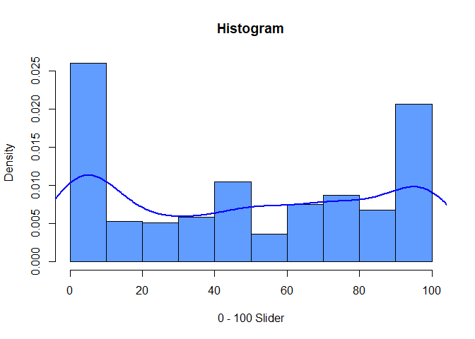<!-- -->


#### Missingness

**Missingness Descriptives**

Delivered / Answered = 417 / 412
Missing = 5
Min = 0, Max = 2, Mean = 0.08, SD = 0.32
(Descriptives are rounded to 2 decimals)

Missingness Intraclass Correlation (ICC) = 1.14 


#### Screenshot


</div>

</div> <!-- Header section -->

<div class = "header-shading">

#### Do something to help you (ex: pick you up, help with homework) <br>

<div style="font-weight: bold; color: #2a5caa; margin-top: -0.7em; margin-bottom: 1em;">
  <a href="#Item 875-anchor"> [Item 875] </a>
</div>


</div>


<!-- Body -->


<div class = "anchor">

<div id="Question 1430-anchor">
  <strong>Question ID</strong>: Question 1430
</div>

**Way the question was delivered:** Slider

**Type of data:** numeric

</div> <div class = "anchor">


**Descriptives**
Min = 0, Max = 100, Mean = 47.46, SD = 35.78 


<button 
  onclick="let e = document.getElementById('Question 1430');
           let arrow = document.getElementById('Question 1430_arrow');
           e.style.display = e.style.display === 'none' ? 'block' : 'none';
           arrow.textContent = e.style.display === 'none' ? '▼' : '▲';"
  style="background: none; border: none; padding: 0; font-weight: bold; font-size: 18px; color: #2a5caa; cursor: pointer;">
Click to view visuals <span id="Question 1430_arrow">▼</span>
</button>

<div id="Question 1430" style="display: none;">


<!-- TOC-IGNORE-BEGIN -->

### Descriptives {.tabset}


#### Histogram

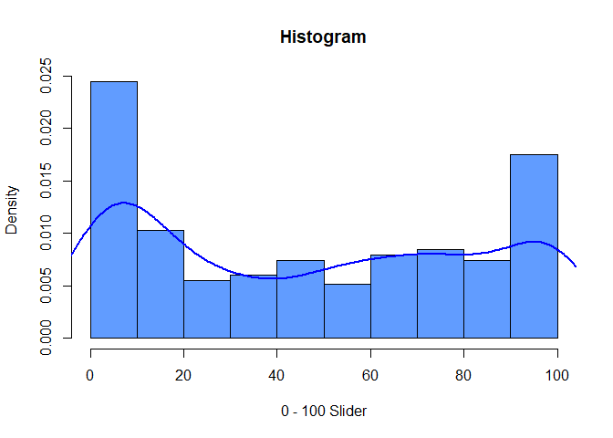<!-- -->


#### Missingness

**Missingness Descriptives**

Delivered / Answered = 586 / 582
Missing = 4
Min = 0, Max = 2, Mean = 0.05, SD = 0.26
(Descriptives are rounded to 2 decimals)

Missingness Intraclass Correlation (ICC) = 1.11 


#### Screenshot


</div>

</div> <!-- Header section -->

<div class = "header-shading">

#### Give you emotional support (ex: listen to and comfort you) <br>

<div style="font-weight: bold; color: #2a5caa; margin-top: -0.7em; margin-bottom: 1em;">
  <a href="#Item 879-anchor"> [Item 879] </a>
</div>


</div>


<!-- Body -->


<div class = "anchor">

<div id="Question 1888-anchor">
  <strong>Question ID</strong>: Question 1888
</div>

**Way the question was delivered:** Slider

**Type of data:** numeric

</div> <div class = "anchor">


**Descriptives**
Min = 0, Max = 100, Mean = 43.16, SD = 33.65 


<button 
  onclick="let e = document.getElementById('Question 1888');
           let arrow = document.getElementById('Question 1888_arrow');
           e.style.display = e.style.display === 'none' ? 'block' : 'none';
           arrow.textContent = e.style.display === 'none' ? '▼' : '▲';"
  style="background: none; border: none; padding: 0; font-weight: bold; font-size: 18px; color: #2a5caa; cursor: pointer;">
Click to view visuals <span id="Question 1888_arrow">▼</span>
</button>

<div id="Question 1888" style="display: none;">


<!-- TOC-IGNORE-BEGIN -->

### Descriptives {.tabset}


#### Histogram

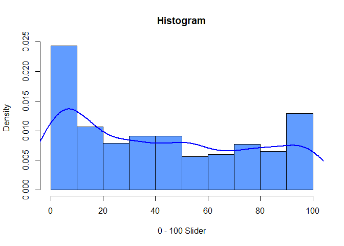<!-- -->


#### Missingness

**Missingness Descriptives**

Delivered / Answered = 586 / 581
Missing = 5
Min = 0, Max = 2, Mean = 0.06, SD = 0.28
(Descriptives are rounded to 2 decimals)

Missingness Intraclass Correlation (ICC) = 1.12 


#### Screenshot


</div>

</div> 
### Block: Item 1136 <!-- Header section -->

<div class = "header-shading">

#### Overall, how helpful was your parent? <br>

<div style="font-weight: bold; color: #2a5caa; margin-top: -0.7em; margin-bottom: 1em;">
  <a href="#Item 1143-anchor"> [Item 1143] </a>
</div>


</div>


<!-- Body -->


<div class = "anchor">

<div id="Question 2083-anchor">
  <strong>Question ID</strong>: Question 2083
</div>

**Way the question was delivered:** Slider

**Type of data:** numeric

</div> <div class = "anchor">


**Descriptives**
Min = 0, Max = 100, Mean = 71.54, SD = 24.14 


<button 
  onclick="let e = document.getElementById('Question 2083');
           let arrow = document.getElementById('Question 2083_arrow');
           e.style.display = e.style.display === 'none' ? 'block' : 'none';
           arrow.textContent = e.style.display === 'none' ? '▼' : '▲';"
  style="background: none; border: none; padding: 0; font-weight: bold; font-size: 18px; color: #2a5caa; cursor: pointer;">
Click to view visuals <span id="Question 2083_arrow">▼</span>
</button>

<div id="Question 2083" style="display: none;">


<!-- TOC-IGNORE-BEGIN -->

### Descriptives {.tabset}


#### Histogram

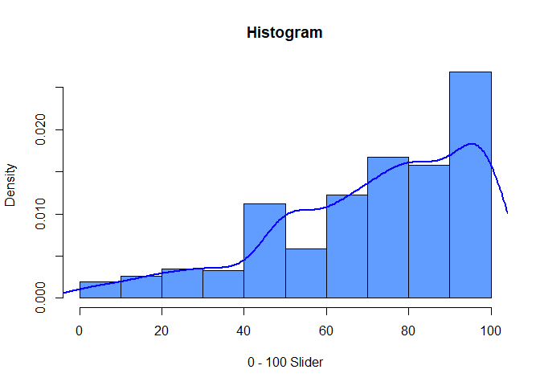<!-- -->


#### Missingness

**Missingness Descriptives**

Delivered / Answered = 580 / 578
Missing = 2
Min = 0, Max = 1, Mean = 0.02, SD = 0.15
(Descriptives are rounded to 2 decimals)

Missingness Intraclass Correlation (ICC) = 1.18 


#### Screenshot


</div>

</div> <!-- Header section -->

<div class = "header-shading">

#### How much did you want your parent to... <br>

<div style="font-weight: bold; color: #2a5caa; margin-top: -0.7em; margin-bottom: 1em;">
  <a href="#Item 1144-anchor"> [Item 1144] </a>
</div>


</div>


<!-- Body -->


<div class = "anchor">

<div id="Question 2082-anchor">
  <strong>Question ID</strong>: Question 2082
</div>

**Way the question was delivered:** Informational Fullscreen

**Type of data:** NA

</div> <div class = "anchor">


</div> <!-- Header section -->

<div class = "header-shading">

#### End Block <br>

<div style="font-weight: bold; color: #2a5caa; margin-top: -0.7em; margin-bottom: 1em;">
  <a href="#Item 1199-anchor"> [Item 1199] </a>
</div>


</div>


<!-- Body -->


<div class = "anchor">

<div id="Question 2084-anchor">
  <strong>Question ID</strong>: Question 2084
</div>

**Way the question was delivered:** End Block

**Type of data:** NA

</div>  
### Block: Item 1361 <!-- Header section -->

<div class = "header-shading">

#### Since your last survey, did you experience any stressful events at home, school or elsewhere? <br>

<div style="font-weight: bold; color: #2a5caa; margin-top: -0.7em; margin-bottom: 1em;">
  <a href="#Item 4463-anchor"> [Item 4463] </a>
</div>


</div>


<!-- Body -->


<div class = "anchor">

<div id="Question 4148-anchor">
  <strong>Question ID</strong>: Question 4148
</div>

**Way the question was delivered:** Multiple Choice

**Type of data:** integer

</div> 
<div class = "anchor">


<button 
  onclick="let e = document.getElementById('Question 4148');
           let arrow = document.getElementById('Question 4148_arrow');
           e.style.display = e.style.display === 'none' ? 'block' : 'none';
           arrow.textContent = e.style.display === 'none' ? '▼' : '▲';"
  style="background: none; border: none; padding: 0; font-weight: bold; font-size: 18px; color: #2a5caa; cursor: pointer;">
Click to view visuals <span id="Question 4148_arrow">▼</span>
</button>

<div id="Question 4148" style="display: none;">


<!-- TOC-IGNORE-BEGIN -->

### Descriptives {.tabset}


#### Frequency Table

<table class="table" style="color: black; margin-left: auto; margin-right: auto;">
 <thead>
  <tr>
   <th style="text-align:left;"> Value </th>
   <th style="text-align:left;"> Label </th>
   <th style="text-align:left;"> Counts </th>
   <th style="text-align:left;"> Percentages </th>
  </tr>
 </thead>
<tbody>
  <tr>
   <td style="text-align:left;"> 1 </td>
   <td style="text-align:left;"> Yes </td>
   <td style="text-align:left;color: darkgreen !important;"> N = 76 </td>
   <td style="text-align:left;"> 9.6% </td>
  </tr>
  <tr>
   <td style="text-align:left;"> 2 </td>
   <td style="text-align:left;"> No </td>
   <td style="text-align:left;color: darkgreen !important;"> N = 718 </td>
   <td style="text-align:left;"> 90.4% </td>
  </tr>
</tbody>
</table>


#### Barplot

<!-- -->


#### Missingness

**Missingness Descriptives**

Delivered / Answered = 794 / 794
Missing = 0
Min = 0, Max = 0, Mean = 0, SD = 0
(Descriptives are rounded to 2 decimals)

Missingness Intraclass Correlation (ICC) = NaN 


#### Screenshot


</div>


</div> <!-- Header section -->

<div class = "header-shading">

#### Since your last survey, did you see or communicate with your parent? <br>

<div style="font-weight: bold; color: #2a5caa; margin-top: -0.7em; margin-bottom: 1em;">
  <a href="#Item 4464-anchor"> [Item 4464] </a>
</div>


</div>


<!-- Body -->


<div class = "anchor">

<div id="Question 4149-anchor">
  <strong>Question ID</strong>: Question 4149
</div>

**Way the question was delivered:** Multiple Choice

**Type of data:** integer

</div> 
<div class = "anchor">


<button 
  onclick="let e = document.getElementById('Question 4149');
           let arrow = document.getElementById('Question 4149_arrow');
           e.style.display = e.style.display === 'none' ? 'block' : 'none';
           arrow.textContent = e.style.display === 'none' ? '▼' : '▲';"
  style="background: none; border: none; padding: 0; font-weight: bold; font-size: 18px; color: #2a5caa; cursor: pointer;">
Click to view visuals <span id="Question 4149_arrow">▼</span>
</button>

<div id="Question 4149" style="display: none;">


<!-- TOC-IGNORE-BEGIN -->

### Descriptives {.tabset}


#### Frequency Table

<table class="table" style="color: black; margin-left: auto; margin-right: auto;">
 <thead>
  <tr>
   <th style="text-align:left;"> Value </th>
   <th style="text-align:left;"> Label </th>
   <th style="text-align:left;"> Counts </th>
   <th style="text-align:left;"> Percentages </th>
  </tr>
 </thead>
<tbody>
  <tr>
   <td style="text-align:left;"> 1 </td>
   <td style="text-align:left;"> Yes </td>
   <td style="text-align:left;color: darkgreen !important;"> N = 570 </td>
   <td style="text-align:left;"> 72.2% </td>
  </tr>
  <tr>
   <td style="text-align:left;"> 2 </td>
   <td style="text-align:left;"> No </td>
   <td style="text-align:left;color: darkgreen !important;"> N = 220 </td>
   <td style="text-align:left;"> 27.8% </td>
  </tr>
</tbody>
</table>


#### Barplot

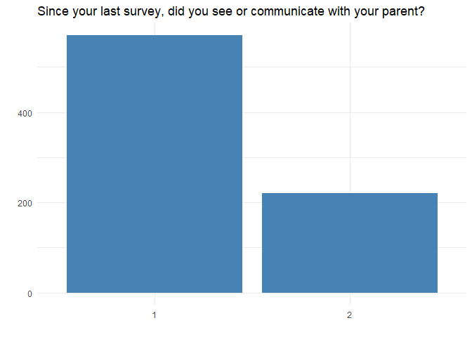<!-- -->


#### Missingness

**Missingness Descriptives**

Delivered / Answered = 792 / 790
Missing = 2
Min = 0, Max = 1, Mean = 0.02, SD = 0.15
(Descriptives are rounded to 2 decimals)

Missingness Intraclass Correlation (ICC) = 1.13 


#### Screenshot


</div>


</div> 
### Block: Item 5539 <!-- Header section -->

<div class = "header-shading">

#### Think about your sleep from last night to this morning: <br>

<div style="font-weight: bold; color: #2a5caa; margin-top: -0.7em; margin-bottom: 1em;">
  <a href="#Item 6302-anchor"> [Item 6302] </a>
</div>


</div>


<!-- Body -->


<div class = "anchor">

<div id="Question 6812-anchor">
  <strong>Question ID</strong>: Question 6812
</div>

**Way the question was delivered:** Informational Fullscreen

**Type of data:** NA

</div> <div class = "anchor">


</div> <!-- Header section -->

<div class = "header-shading">

#### How many minutes did it take for you to fall asleep? <br>

<div style="font-weight: bold; color: #2a5caa; margin-top: -0.7em; margin-bottom: 1em;">
  <a href="#Item 6305-anchor"> [Item 6305] </a>
</div>


</div>


<!-- Body -->


<div class = "anchor">

<div id="Question 6815-anchor">
  <strong>Question ID</strong>: Question 6815
</div>

**Way the question was delivered:** Free Response

**Type of data:** character

</div> <div class = "anchor">


<button 
  onclick="let e = document.getElementById('Question 6815');
           let arrow = document.getElementById('Question 6815_arrow');
           e.style.display = e.style.display === 'none' ? 'block' : 'none';
           arrow.textContent = e.style.display === 'none' ? '▼' : '▲';"
  style="background: none; border: none; padding: 0; font-weight: bold; font-size: 18px; color: #2a5caa; cursor: pointer;">
Click to view visuals <span id="Question 6815_arrow">▼</span>
</button>

<div id="Question 6815" style="display: none;">


<!-- TOC-IGNORE-BEGIN -->

### Descriptives {.tabset}


#### Missingness

**Missingness Descriptives**

Delivered / Answered = 66 / 66
Missing = 0
Min = 0, Max = 0, Mean = 0, SD = 0
(Descriptives are rounded to 2 decimals)

Missingness Intraclass Correlation (ICC) = NaN 


#### Screenshot


</div>


</div> <!-- Header section -->

<div class = "header-shading">

#### Did you wake up during the night (Not counting your final wake-up in the morning)? <br>

<div style="font-weight: bold; color: #2a5caa; margin-top: -0.7em; margin-bottom: 1em;">
  <a href="#Item 6306-anchor"> [Item 6306] </a>
</div>


</div>


<!-- Body -->


<div class = "anchor">

<div id="Question 6816-anchor">
  <strong>Question ID</strong>: Question 6816
</div>

**Way the question was delivered:** Multiple Choice

**Type of data:** integer

</div> 
<div class = "anchor">


<button 
  onclick="let e = document.getElementById('Question 6816');
           let arrow = document.getElementById('Question 6816_arrow');
           e.style.display = e.style.display === 'none' ? 'block' : 'none';
           arrow.textContent = e.style.display === 'none' ? '▼' : '▲';"
  style="background: none; border: none; padding: 0; font-weight: bold; font-size: 18px; color: #2a5caa; cursor: pointer;">
Click to view visuals <span id="Question 6816_arrow">▼</span>
</button>

<div id="Question 6816" style="display: none;">


<!-- TOC-IGNORE-BEGIN -->

### Descriptives {.tabset}


#### Frequency Table

<table class="table" style="color: black; margin-left: auto; margin-right: auto;">
 <thead>
  <tr>
   <th style="text-align:left;"> Value </th>
   <th style="text-align:left;"> Label </th>
   <th style="text-align:left;"> Counts </th>
   <th style="text-align:left;"> Percentages </th>
  </tr>
 </thead>
<tbody>
  <tr>
   <td style="text-align:left;"> 1 </td>
   <td style="text-align:left;"> Yes </td>
   <td style="text-align:left;color: darkgreen !important;"> N = 17 </td>
   <td style="text-align:left;"> 25.8% </td>
  </tr>
  <tr>
   <td style="text-align:left;"> 2 </td>
   <td style="text-align:left;"> No </td>
   <td style="text-align:left;color: darkgreen !important;"> N = 49 </td>
   <td style="text-align:left;"> 74.2% </td>
  </tr>
</tbody>
</table>


#### Barplot

<!-- -->


#### Missingness

**Missingness Descriptives**

Delivered / Answered = 66 / 66
Missing = 0
Min = 0, Max = 0, Mean = 0, SD = 0
(Descriptives are rounded to 2 decimals)

Missingness Intraclass Correlation (ICC) = NaN 


#### Screenshot


</div>


</div> 
### Block: Item 6307 <!-- Header section -->

<div class = "header-shading">

#### How would you rate the quality of your sleep? <br>

<div style="font-weight: bold; color: #2a5caa; margin-top: -0.7em; margin-bottom: 1em;">
  <a href="#Item 6309-anchor"> [Item 6309] </a>
</div>


</div>


<!-- Body -->


<div class = "anchor">

<div id="Question 6821-anchor">
  <strong>Question ID</strong>: Question 6821
</div>

**Way the question was delivered:** Slider

**Type of data:** numeric

</div> <div class = "anchor">


**Descriptives**
Min = 4, Max = 100, Mean = 71.11, SD = 26.28 


<button 
  onclick="let e = document.getElementById('Question 6821');
           let arrow = document.getElementById('Question 6821_arrow');
           e.style.display = e.style.display === 'none' ? 'block' : 'none';
           arrow.textContent = e.style.display === 'none' ? '▼' : '▲';"
  style="background: none; border: none; padding: 0; font-weight: bold; font-size: 18px; color: #2a5caa; cursor: pointer;">
Click to view visuals <span id="Question 6821_arrow">▼</span>
</button>

<div id="Question 6821" style="display: none;">


<!-- TOC-IGNORE-BEGIN -->

### Descriptives {.tabset}


#### Histogram

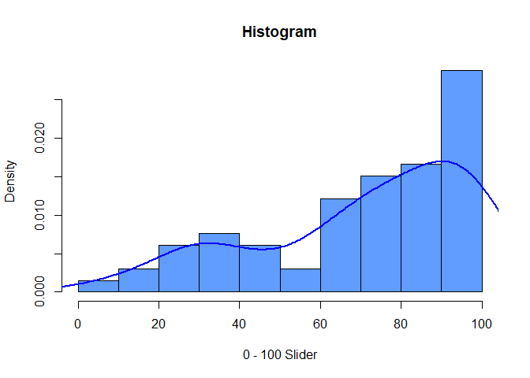<!-- -->


#### Missingness

**Missingness Descriptives**

Delivered / Answered = 66 / 66
Missing = 0
Min = 0, Max = 0, Mean = 0, SD = 0
(Descriptives are rounded to 2 decimals)

Missingness Intraclass Correlation (ICC) = NaN 


#### Screenshot


</div>

</div> <!-- Header section -->

<div class = "header-shading">

#### How bothered or stressed were you because of this? <br>

<div style="font-weight: bold; color: #2a5caa; margin-top: -0.7em; margin-bottom: 1em;">
  <a href="#Item 1118-anchor"> [Item 1118] </a>
</div>


</div>


<!-- Body -->


<div class = "anchor">

<div id="Question 1873-anchor">
  <strong>Question ID</strong>: Question 1873
</div>

**Way the question was delivered:** Slider

**Type of data:** numeric

</div> <div class = "anchor">


**Descriptives**
Min = NA, Max = NA, Mean = NA, SD = NA 


<button 
  onclick="let e = document.getElementById('Question 1873');
           let arrow = document.getElementById('Question 1873_arrow');
           e.style.display = e.style.display === 'none' ? 'block' : 'none';
           arrow.textContent = e.style.display === 'none' ? '▼' : '▲';"
  style="background: none; border: none; padding: 0; font-weight: bold; font-size: 18px; color: #2a5caa; cursor: pointer;">
Click to view visuals <span id="Question 1873_arrow">▼</span>
</button>

<div id="Question 1873" style="display: none;">


<!-- TOC-IGNORE-BEGIN -->

### Descriptives {.tabset}


#### Missingness

**Missingness Descriptives**

Delivered / Answered = 0 / 0
Missing = 0
Min = NA, Max = NA, Mean = NA, SD = NA
(Descriptives are rounded to 2 decimals)

Missingness Intraclass Correlation (ICC) = NA 


#### Screenshot


</div>

</div> <!-- Header section -->

<div class = "header-shading">

#### With whom did you have an argument or disagreement? <br>

<div style="font-weight: bold; color: #2a5caa; margin-top: -0.7em; margin-bottom: 1em;">
  <a href="#Item 1119-anchor"> [Item 1119] </a>
</div>


</div>


<!-- Body -->


<div class = "anchor">

<div id="Question 1874-anchor">
  <strong>Question ID</strong>: Question 1874
</div>

**Way the question was delivered:** Multiple Select

**Type of data:** integer

</div> 
<div class = "anchor">


<button 
  onclick="let e = document.getElementById('Question 1874');
           let arrow = document.getElementById('Question 1874_arrow');
           e.style.display = e.style.display === 'none' ? 'block' : 'none';
           arrow.textContent = e.style.display === 'none' ? '▼' : '▲';"
  style="background: none; border: none; padding: 0; font-weight: bold; font-size: 18px; color: #2a5caa; cursor: pointer;">
Click to view visuals <span id="Question 1874_arrow">▼</span>
</button>

<div id="Question 1874" style="display: none;">


<!-- TOC-IGNORE-BEGIN -->

### Descriptives {.tabset}


<table class="table" style="color: black; margin-left: auto; margin-right: auto;">
 <thead>
  <tr>
   <th style="text-align:right;"> Value </th>
   <th style="text-align:left;"> Label </th>
   <th style="text-align:left;"> Counts </th>
   <th style="text-align:left;"> Percentages </th>
  </tr>
 </thead>
<tbody>
  <tr>
   <td style="text-align:right;"> 1 </td>
   <td style="text-align:left;"> Parents </td>
   <td style="text-align:left;color: darkgreen !important;"> N = 0 </td>
   <td style="text-align:left;"> 0% </td>
  </tr>
  <tr>
   <td style="text-align:right;"> 2 </td>
   <td style="text-align:left;"> Siblings </td>
   <td style="text-align:left;color: darkgreen !important;"> N = 0 </td>
   <td style="text-align:left;"> 0% </td>
  </tr>
  <tr>
   <td style="text-align:right;"> 3 </td>
   <td style="text-align:left;"> Friends, other people your age </td>
   <td style="text-align:left;color: darkgreen !important;"> N = 0 </td>
   <td style="text-align:left;"> 0% </td>
  </tr>
  <tr>
   <td style="text-align:right;"> 4 </td>
   <td style="text-align:left;"> Teachers, coaches, other adults </td>
   <td style="text-align:left;color: darkgreen !important;"> N = 0 </td>
   <td style="text-align:left;"> 0% </td>
  </tr>
  <tr>
   <td style="text-align:right;"> 5 </td>
   <td style="text-align:left;"> Other (ex: cashier, a stranger) </td>
   <td style="text-align:left;color: darkgreen !important;"> N = 0 </td>
   <td style="text-align:left;"> 0% </td>
  </tr>
</tbody>
</table>


#### Missingness

**Missingness Descriptives**

Delivered / Answered = 0 / 0
Missing = 0
Min = NA, Max = NA, Mean = NA, SD = NA
(Descriptives are rounded to 2 decimals)

Missingness Intraclass Correlation (ICC) = NA 


#### Screenshot


</div>


</div> <!-- Header section -->

<div class = "header-shading">

#### How bothered or stressed were you because of this? <br>

<div style="font-weight: bold; color: #2a5caa; margin-top: -0.7em; margin-bottom: 1em;">
  <a href="#Item 1122-anchor"> [Item 1122] </a>
</div>


</div>


<!-- Body -->


<div class = "anchor">

<div id="Question 1876-anchor">
  <strong>Question ID</strong>: Question 1876
</div>

**Way the question was delivered:** Slider

**Type of data:** numeric

</div> <div class = "anchor">


**Descriptives**
Min = NA, Max = NA, Mean = NA, SD = NA 


<button 
  onclick="let e = document.getElementById('Question 1876');
           let arrow = document.getElementById('Question 1876_arrow');
           e.style.display = e.style.display === 'none' ? 'block' : 'none';
           arrow.textContent = e.style.display === 'none' ? '▼' : '▲';"
  style="background: none; border: none; padding: 0; font-weight: bold; font-size: 18px; color: #2a5caa; cursor: pointer;">
Click to view visuals <span id="Question 1876_arrow">▼</span>
</button>

<div id="Question 1876" style="display: none;">


<!-- TOC-IGNORE-BEGIN -->

### Descriptives {.tabset}


#### Missingness

**Missingness Descriptives**

Delivered / Answered = 0 / 0
Missing = 0
Min = NA, Max = NA, Mean = NA, SD = NA
(Descriptives are rounded to 2 decimals)

Missingness Intraclass Correlation (ICC) = NA 


#### Screenshot


</div>

</div> <!-- Header section -->

<div class = "header-shading">

#### Where did you feel this way? <br>

<div style="font-weight: bold; color: #2a5caa; margin-top: -0.7em; margin-bottom: 1em;">
  <a href="#Item 1123-anchor"> [Item 1123] </a>
</div>


</div>


<!-- Body -->


<div class = "anchor">

<div id="Question 1877-anchor">
  <strong>Question ID</strong>: Question 1877
</div>

**Way the question was delivered:** Multiple Select

**Type of data:** integer

</div> 
<div class = "anchor">


<button 
  onclick="let e = document.getElementById('Question 1877');
           let arrow = document.getElementById('Question 1877_arrow');
           e.style.display = e.style.display === 'none' ? 'block' : 'none';
           arrow.textContent = e.style.display === 'none' ? '▼' : '▲';"
  style="background: none; border: none; padding: 0; font-weight: bold; font-size: 18px; color: #2a5caa; cursor: pointer;">
Click to view visuals <span id="Question 1877_arrow">▼</span>
</button>

<div id="Question 1877" style="display: none;">


<!-- TOC-IGNORE-BEGIN -->

### Descriptives {.tabset}


<table class="table" style="color: black; margin-left: auto; margin-right: auto;">
 <thead>
  <tr>
   <th style="text-align:right;"> Value </th>
   <th style="text-align:left;"> Label </th>
   <th style="text-align:left;"> Counts </th>
   <th style="text-align:left;"> Percentages </th>
  </tr>
 </thead>
<tbody>
  <tr>
   <td style="text-align:right;"> 1 </td>
   <td style="text-align:left;"> Home </td>
   <td style="text-align:left;color: darkgreen !important;"> N = 0 </td>
   <td style="text-align:left;"> 0% </td>
  </tr>
  <tr>
   <td style="text-align:right;"> 2 </td>
   <td style="text-align:left;"> School or extracurricular activity </td>
   <td style="text-align:left;color: darkgreen !important;"> N = 0 </td>
   <td style="text-align:left;"> 0% </td>
  </tr>
  <tr>
   <td style="text-align:right;"> 3 </td>
   <td style="text-align:left;"> Other (ex: at the store) </td>
   <td style="text-align:left;color: darkgreen !important;"> N = 0 </td>
   <td style="text-align:left;"> 0% </td>
  </tr>
</tbody>
</table>


#### Missingness

**Missingness Descriptives**

Delivered / Answered = 0 / 0
Missing = 0
Min = NA, Max = NA, Mean = NA, SD = NA
(Descriptives are rounded to 2 decimals)

Missingness Intraclass Correlation (ICC) = NA 


#### Screenshot


</div>


</div> <!-- Header section -->

<div class = "header-shading">

#### How bothered or stressed were you because of this? <br>

<div style="font-weight: bold; color: #2a5caa; margin-top: -0.7em; margin-bottom: 1em;">
  <a href="#Item 1126-anchor"> [Item 1126] </a>
</div>


</div>


<!-- Body -->


<div class = "anchor">

<div id="Question 1879-anchor">
  <strong>Question ID</strong>: Question 1879
</div>

**Way the question was delivered:** Slider

**Type of data:** numeric

</div> <div class = "anchor">


**Descriptives**
Min = NA, Max = NA, Mean = NA, SD = NA 


<button 
  onclick="let e = document.getElementById('Question 1879');
           let arrow = document.getElementById('Question 1879_arrow');
           e.style.display = e.style.display === 'none' ? 'block' : 'none';
           arrow.textContent = e.style.display === 'none' ? '▼' : '▲';"
  style="background: none; border: none; padding: 0; font-weight: bold; font-size: 18px; color: #2a5caa; cursor: pointer;">
Click to view visuals <span id="Question 1879_arrow">▼</span>
</button>

<div id="Question 1879" style="display: none;">


<!-- TOC-IGNORE-BEGIN -->

### Descriptives {.tabset}


#### Missingness

**Missingness Descriptives**

Delivered / Answered = 0 / 0
Missing = 0
Min = NA, Max = NA, Mean = NA, SD = NA
(Descriptives are rounded to 2 decimals)

Missingness Intraclass Correlation (ICC) = NA 


#### Screenshot


</div>

</div> <!-- Header section -->

<div class = "header-shading">

#### Where did this happen? <br>

<div style="font-weight: bold; color: #2a5caa; margin-top: -0.7em; margin-bottom: 1em;">
  <a href="#Item 1127-anchor"> [Item 1127] </a>
</div>


</div>


<!-- Body -->


<div class = "anchor">

<div id="Question 1880-anchor">
  <strong>Question ID</strong>: Question 1880
</div>

**Way the question was delivered:** Multiple Select

**Type of data:** integer

</div> 
<div class = "anchor">


<button 
  onclick="let e = document.getElementById('Question 1880');
           let arrow = document.getElementById('Question 1880_arrow');
           e.style.display = e.style.display === 'none' ? 'block' : 'none';
           arrow.textContent = e.style.display === 'none' ? '▼' : '▲';"
  style="background: none; border: none; padding: 0; font-weight: bold; font-size: 18px; color: #2a5caa; cursor: pointer;">
Click to view visuals <span id="Question 1880_arrow">▼</span>
</button>

<div id="Question 1880" style="display: none;">


<!-- TOC-IGNORE-BEGIN -->

### Descriptives {.tabset}


<table class="table" style="color: black; margin-left: auto; margin-right: auto;">
 <thead>
  <tr>
   <th style="text-align:right;"> Value </th>
   <th style="text-align:left;"> Label </th>
   <th style="text-align:left;"> Counts </th>
   <th style="text-align:left;"> Percentages </th>
  </tr>
 </thead>
<tbody>
  <tr>
   <td style="text-align:right;"> 1 </td>
   <td style="text-align:left;"> Home </td>
   <td style="text-align:left;color: darkgreen !important;"> N = 0 </td>
   <td style="text-align:left;"> 0% </td>
  </tr>
  <tr>
   <td style="text-align:right;"> 2 </td>
   <td style="text-align:left;"> School or extracurricular activity </td>
   <td style="text-align:left;color: darkgreen !important;"> N = 0 </td>
   <td style="text-align:left;"> 0% </td>
  </tr>
  <tr>
   <td style="text-align:right;"> 3 </td>
   <td style="text-align:left;"> Other (ex: at the store) </td>
   <td style="text-align:left;color: darkgreen !important;"> N = 0 </td>
   <td style="text-align:left;"> 0% </td>
  </tr>
</tbody>
</table>


#### Missingness

**Missingness Descriptives**

Delivered / Answered = 0 / 0
Missing = 0
Min = NA, Max = NA, Mean = NA, SD = NA
(Descriptives are rounded to 2 decimals)

Missingness Intraclass Correlation (ICC) = NA 


#### Screenshot


</div>


</div> <!-- Header section -->

<div class = "header-shading">

#### How bothered or stressed were you because of this? <br>

<div style="font-weight: bold; color: #2a5caa; margin-top: -0.7em; margin-bottom: 1em;">
  <a href="#Item 1130-anchor"> [Item 1130] </a>
</div>


</div>


<!-- Body -->


<div class = "anchor">

<div id="Question 1882-anchor">
  <strong>Question ID</strong>: Question 1882
</div>

**Way the question was delivered:** Slider

**Type of data:** numeric

</div> <div class = "anchor">


**Descriptives**
Min = NA, Max = NA, Mean = NA, SD = NA 


<button 
  onclick="let e = document.getElementById('Question 1882');
           let arrow = document.getElementById('Question 1882_arrow');
           e.style.display = e.style.display === 'none' ? 'block' : 'none';
           arrow.textContent = e.style.display === 'none' ? '▼' : '▲';"
  style="background: none; border: none; padding: 0; font-weight: bold; font-size: 18px; color: #2a5caa; cursor: pointer;">
Click to view visuals <span id="Question 1882_arrow">▼</span>
</button>

<div id="Question 1882" style="display: none;">


<!-- TOC-IGNORE-BEGIN -->

### Descriptives {.tabset}


#### Missingness

**Missingness Descriptives**

Delivered / Answered = 0 / 0
Missing = 0
Min = NA, Max = NA, Mean = NA, SD = NA
(Descriptives are rounded to 2 decimals)

Missingness Intraclass Correlation (ICC) = NA 


#### Screenshot


</div>

</div> <!-- Header section -->

<div class = "header-shading">

#### Who did this problem involve? <br>

<div style="font-weight: bold; color: #2a5caa; margin-top: -0.7em; margin-bottom: 1em;">
  <a href="#Item 1131-anchor"> [Item 1131] </a>
</div>


</div>


<!-- Body -->


<div class = "anchor">

<div id="Question 1883-anchor">
  <strong>Question ID</strong>: Question 1883
</div>

**Way the question was delivered:** Multiple Select

**Type of data:** integer

</div> 
<div class = "anchor">


<button 
  onclick="let e = document.getElementById('Question 1883');
           let arrow = document.getElementById('Question 1883_arrow');
           e.style.display = e.style.display === 'none' ? 'block' : 'none';
           arrow.textContent = e.style.display === 'none' ? '▼' : '▲';"
  style="background: none; border: none; padding: 0; font-weight: bold; font-size: 18px; color: #2a5caa; cursor: pointer;">
Click to view visuals <span id="Question 1883_arrow">▼</span>
</button>

<div id="Question 1883" style="display: none;">


<!-- TOC-IGNORE-BEGIN -->

### Descriptives {.tabset}


<table class="table" style="color: black; margin-left: auto; margin-right: auto;">
 <thead>
  <tr>
   <th style="text-align:right;"> Value </th>
   <th style="text-align:left;"> Label </th>
   <th style="text-align:left;"> Counts </th>
   <th style="text-align:left;"> Percentages </th>
  </tr>
 </thead>
<tbody>
  <tr>
   <td style="text-align:right;"> 1 </td>
   <td style="text-align:left;"> Family </td>
   <td style="text-align:left;color: darkgreen !important;"> N = 0 </td>
   <td style="text-align:left;"> 0% </td>
  </tr>
  <tr>
   <td style="text-align:right;"> 2 </td>
   <td style="text-align:left;"> Friends or someone you know </td>
   <td style="text-align:left;color: darkgreen !important;"> N = 0 </td>
   <td style="text-align:left;"> 0% </td>
  </tr>
  <tr>
   <td style="text-align:right;"> 3 </td>
   <td style="text-align:left;"> Other (ex: strangers) </td>
   <td style="text-align:left;color: darkgreen !important;"> N = 0 </td>
   <td style="text-align:left;"> 0% </td>
  </tr>
</tbody>
</table>


#### Missingness

**Missingness Descriptives**

Delivered / Answered = 0 / 0
Missing = 0
Min = NA, Max = NA, Mean = NA, SD = NA
(Descriptives are rounded to 2 decimals)

Missingness Intraclass Correlation (ICC) = NA 


#### Screenshot


</div>


</div> <!-- Header section -->

<div class = "header-shading">

#### Check all the ways that you interacted with your parent, in person. <br>

<div style="font-weight: bold; color: #2a5caa; margin-top: -0.7em; margin-bottom: 1em;">
  <a href="#Item 1133-anchor"> [Item 1133] </a>
</div>


</div>


<!-- Body -->


<div class = "anchor">

<div id="Question 1885-anchor">
  <strong>Question ID</strong>: Question 1885
</div>

**Way the question was delivered:** Multiple Select

**Type of data:** integer

</div> 
<div class = "anchor">


<button 
  onclick="let e = document.getElementById('Question 1885');
           let arrow = document.getElementById('Question 1885_arrow');
           e.style.display = e.style.display === 'none' ? 'block' : 'none';
           arrow.textContent = e.style.display === 'none' ? '▼' : '▲';"
  style="background: none; border: none; padding: 0; font-weight: bold; font-size: 18px; color: #2a5caa; cursor: pointer;">
Click to view visuals <span id="Question 1885_arrow">▼</span>
</button>

<div id="Question 1885" style="display: none;">


<!-- TOC-IGNORE-BEGIN -->

### Descriptives {.tabset}


<table class="table" style="color: black; margin-left: auto; margin-right: auto;">
 <thead>
  <tr>
   <th style="text-align:right;"> Value </th>
   <th style="text-align:left;"> Label </th>
   <th style="text-align:left;"> Counts </th>
   <th style="text-align:left;"> Percentages </th>
  </tr>
 </thead>
<tbody>
  <tr>
   <td style="text-align:right;"> 1 </td>
   <td style="text-align:left;"> Do something together (ex: eat, clean, watch a show) </td>
   <td style="text-align:left;color: darkgreen !important;"> N = 0 </td>
   <td style="text-align:left;"> 0% </td>
  </tr>
  <tr>
   <td style="text-align:right;"> 2 </td>
   <td style="text-align:left;"> Make physical contact (ex: hug, lean on each other) </td>
   <td style="text-align:left;color: darkgreen !important;"> N = 0 </td>
   <td style="text-align:left;"> 0% </td>
  </tr>
  <tr>
   <td style="text-align:right;"> 3 </td>
   <td style="text-align:left;"> Just be together (ex: be on your own phones) </td>
   <td style="text-align:left;color: darkgreen !important;"> N = 0 </td>
   <td style="text-align:left;"> 0% </td>
  </tr>
  <tr>
   <td style="text-align:right;"> 4 </td>
   <td style="text-align:left;"> Ask a question or make a request </td>
   <td style="text-align:left;color: darkgreen !important;"> N = 0 </td>
   <td style="text-align:left;"> 0% </td>
  </tr>
  <tr>
   <td style="text-align:right;"> 5 </td>
   <td style="text-align:left;"> Reply to a question or request </td>
   <td style="text-align:left;color: darkgreen !important;"> N = 0 </td>
   <td style="text-align:left;"> 0% </td>
  </tr>
  <tr>
   <td style="text-align:right;"> 6 </td>
   <td style="text-align:left;"> Have a conversation (ex: exchange a few words or more) </td>
   <td style="text-align:left;color: darkgreen !important;"> N = 0 </td>
   <td style="text-align:left;"> 0% </td>
  </tr>
  <tr>
   <td style="text-align:right;"> 7 </td>
   <td style="text-align:left;"> Other </td>
   <td style="text-align:left;color: darkgreen !important;"> N = 0 </td>
   <td style="text-align:left;"> 0% </td>
  </tr>
  <tr>
   <td style="text-align:right;"> 8 </td>
   <td style="text-align:left;"> None apply </td>
   <td style="text-align:left;color: darkgreen !important;"> N = 0 </td>
   <td style="text-align:left;"> 0% </td>
  </tr>
</tbody>
</table>


#### Missingness

**Missingness Descriptives**

Delivered / Answered = 0 / 0
Missing = 0
Min = NA, Max = NA, Mean = NA, SD = NA
(Descriptives are rounded to 2 decimals)

Missingness Intraclass Correlation (ICC) = NA 


#### Screenshot


</div>


</div> <!-- Header section -->

<div class = "header-shading">

#### How close did you feel to your parent? <br>

<div style="font-weight: bold; color: #2a5caa; margin-top: -0.7em; margin-bottom: 1em;">
  <a href="#Item 1134-anchor"> [Item 1134] </a>
</div>


</div>


<!-- Body -->


<div class = "anchor">

<div id="Question 2081-anchor">
  <strong>Question ID</strong>: Question 2081
</div>

**Way the question was delivered:** Slider

**Type of data:** numeric

</div> <div class = "anchor">


**Descriptives**
Min = NA, Max = NA, Mean = NA, SD = NA 


<button 
  onclick="let e = document.getElementById('Question 2081');
           let arrow = document.getElementById('Question 2081_arrow');
           e.style.display = e.style.display === 'none' ? 'block' : 'none';
           arrow.textContent = e.style.display === 'none' ? '▼' : '▲';"
  style="background: none; border: none; padding: 0; font-weight: bold; font-size: 18px; color: #2a5caa; cursor: pointer;">
Click to view visuals <span id="Question 2081_arrow">▼</span>
</button>

<div id="Question 2081" style="display: none;">


<!-- TOC-IGNORE-BEGIN -->

### Descriptives {.tabset}


#### Missingness

**Missingness Descriptives**

Delivered / Answered = 0 / 0
Missing = 0
Min = NA, Max = NA, Mean = NA, SD = NA
(Descriptives are rounded to 2 decimals)

Missingness Intraclass Correlation (ICC) = NA 


#### Screenshot


</div>

</div> <!-- Header section -->

<div class = "header-shading">

#### Who else was a part of your most recent interaction with your parent? <br>

<div style="font-weight: bold; color: #2a5caa; margin-top: -0.7em; margin-bottom: 1em;">
  <a href="#Item 1135-anchor"> [Item 1135] </a>
</div>


</div>


<!-- Body -->


<div class = "anchor">

<div id="Question 1887-anchor">
  <strong>Question ID</strong>: Question 1887
</div>

**Way the question was delivered:** Multiple Select

**Type of data:** integer

</div> 
<div class = "anchor">


<button 
  onclick="let e = document.getElementById('Question 1887');
           let arrow = document.getElementById('Question 1887_arrow');
           e.style.display = e.style.display === 'none' ? 'block' : 'none';
           arrow.textContent = e.style.display === 'none' ? '▼' : '▲';"
  style="background: none; border: none; padding: 0; font-weight: bold; font-size: 18px; color: #2a5caa; cursor: pointer;">
Click to view visuals <span id="Question 1887_arrow">▼</span>
</button>

<div id="Question 1887" style="display: none;">


<!-- TOC-IGNORE-BEGIN -->

### Descriptives {.tabset}


<table class="table" style="color: black; margin-left: auto; margin-right: auto;">
 <thead>
  <tr>
   <th style="text-align:right;"> Value </th>
   <th style="text-align:left;"> Label </th>
   <th style="text-align:left;"> Counts </th>
   <th style="text-align:left;"> Percentages </th>
  </tr>
 </thead>
<tbody>
  <tr>
   <td style="text-align:right;"> 1 </td>
   <td style="text-align:left;"> Other parent or caregivers </td>
   <td style="text-align:left;color: darkgreen !important;"> N = 0 </td>
   <td style="text-align:left;"> 0% </td>
  </tr>
  <tr>
   <td style="text-align:right;"> 2 </td>
   <td style="text-align:left;"> Siblings </td>
   <td style="text-align:left;color: darkgreen !important;"> N = 0 </td>
   <td style="text-align:left;"> 0% </td>
  </tr>
  <tr>
   <td style="text-align:right;"> 3 </td>
   <td style="text-align:left;"> Other adults </td>
   <td style="text-align:left;color: darkgreen !important;"> N = 0 </td>
   <td style="text-align:left;"> 0% </td>
  </tr>
  <tr>
   <td style="text-align:right;"> 4 </td>
   <td style="text-align:left;"> Other children or teens </td>
   <td style="text-align:left;color: darkgreen !important;"> N = 0 </td>
   <td style="text-align:left;"> 0% </td>
  </tr>
  <tr>
   <td style="text-align:right;"> 5 </td>
   <td style="text-align:left;"> Strangers (ex: cashier) </td>
   <td style="text-align:left;color: darkgreen !important;"> N = 0 </td>
   <td style="text-align:left;"> 0% </td>
  </tr>
  <tr>
   <td style="text-align:right;"> 6 </td>
   <td style="text-align:left;"> None apply </td>
   <td style="text-align:left;color: darkgreen !important;"> N = 0 </td>
   <td style="text-align:left;"> 0% </td>
  </tr>
</tbody>
</table>


#### Missingness

**Missingness Descriptives**

Delivered / Answered = 0 / 0
Missing = 0
Min = NA, Max = NA, Mean = NA, SD = NA
(Descriptives are rounded to 2 decimals)

Missingness Intraclass Correlation (ICC) = NA 


#### Screenshot


</div>


</div> <!-- Header section -->

<div class = "header-shading">

#### Check all the ways that you interacted with parents. <br>

<div style="font-weight: bold; color: #2a5caa; margin-top: -0.7em; margin-bottom: 1em;">
  <a href="#Item 4465-anchor"> [Item 4465] </a>
</div>


</div>


<!-- Body -->


<div class = "anchor">

<div id="Question 4150-anchor">
  <strong>Question ID</strong>: Question 4150
</div>

**Way the question was delivered:** Multiple Select

**Type of data:** integer

</div> 
<div class = "anchor">


<button 
  onclick="let e = document.getElementById('Question 4150');
           let arrow = document.getElementById('Question 4150_arrow');
           e.style.display = e.style.display === 'none' ? 'block' : 'none';
           arrow.textContent = e.style.display === 'none' ? '▼' : '▲';"
  style="background: none; border: none; padding: 0; font-weight: bold; font-size: 18px; color: #2a5caa; cursor: pointer;">
Click to view visuals <span id="Question 4150_arrow">▼</span>
</button>

<div id="Question 4150" style="display: none;">


<!-- TOC-IGNORE-BEGIN -->

### Descriptives {.tabset}


<table class="table" style="color: black; margin-left: auto; margin-right: auto;">
 <thead>
  <tr>
   <th style="text-align:right;"> Value </th>
   <th style="text-align:left;"> Label </th>
   <th style="text-align:left;"> Counts </th>
   <th style="text-align:left;"> Percentages </th>
  </tr>
 </thead>
<tbody>
  <tr>
   <td style="text-align:right;"> 1 </td>
   <td style="text-align:left;"> in person </td>
   <td style="text-align:left;color: darkgreen !important;"> N = 0 </td>
   <td style="text-align:left;"> 0% </td>
  </tr>
  <tr>
   <td style="text-align:right;"> 2 </td>
   <td style="text-align:left;"> text </td>
   <td style="text-align:left;color: darkgreen !important;"> N = 0 </td>
   <td style="text-align:left;"> 0% </td>
  </tr>
  <tr>
   <td style="text-align:right;"> 3 </td>
   <td style="text-align:left;"> Phone call </td>
   <td style="text-align:left;color: darkgreen !important;"> N = 0 </td>
   <td style="text-align:left;"> 0% </td>
  </tr>
  <tr>
   <td style="text-align:right;"> 4 </td>
   <td style="text-align:left;"> video chat </td>
   <td style="text-align:left;color: darkgreen !important;"> N = 0 </td>
   <td style="text-align:left;"> 0% </td>
  </tr>
  <tr>
   <td style="text-align:right;"> 5 </td>
   <td style="text-align:left;"> Other </td>
   <td style="text-align:left;color: darkgreen !important;"> N = 0 </td>
   <td style="text-align:left;"> 0% </td>
  </tr>
</tbody>
</table>


#### Missingness

**Missingness Descriptives**

Delivered / Answered = 0 / 0
Missing = 0
Min = NA, Max = NA, Mean = NA, SD = NA
(Descriptives are rounded to 2 decimals)

Missingness Intraclass Correlation (ICC) = NA 


#### Screenshot


</div>


</div> <!-- Header section -->

<div class = "header-shading">

#### Did you have an argument or disagreement? <br>

<div style="font-weight: bold; color: #2a5caa; margin-top: -0.7em; margin-bottom: 1em;">
  <a href="#Item 1117-anchor"> [Item 1117] </a>
</div>


</div>


<!-- Body -->


<div class = "anchor">

<div id="Question 1872-anchor">
  <strong>Question ID</strong>: Question 1872
</div>

**Way the question was delivered:** Multiple Choice

**Type of data:** integer

</div> 
<div class = "anchor">


<button 
  onclick="let e = document.getElementById('Question 1872');
           let arrow = document.getElementById('Question 1872_arrow');
           e.style.display = e.style.display === 'none' ? 'block' : 'none';
           arrow.textContent = e.style.display === 'none' ? '▼' : '▲';"
  style="background: none; border: none; padding: 0; font-weight: bold; font-size: 18px; color: #2a5caa; cursor: pointer;">
Click to view visuals <span id="Question 1872_arrow">▼</span>
</button>

<div id="Question 1872" style="display: none;">


<!-- TOC-IGNORE-BEGIN -->

### Descriptives {.tabset}


<table class="table" style="color: black; margin-left: auto; margin-right: auto;">
 <thead>
  <tr>
   <th style="text-align:right;"> Value </th>
   <th style="text-align:left;"> Label </th>
   <th style="text-align:left;"> Counts </th>
   <th style="text-align:left;"> Percentages </th>
  </tr>
 </thead>
<tbody>
  <tr>
   <td style="text-align:right;"> 1 </td>
   <td style="text-align:left;"> Yes </td>
   <td style="text-align:left;color: darkgreen !important;"> N = 0 </td>
   <td style="text-align:left;"> 0% </td>
  </tr>
  <tr>
   <td style="text-align:right;"> 2 </td>
   <td style="text-align:left;"> No </td>
   <td style="text-align:left;color: darkgreen !important;"> N = 0 </td>
   <td style="text-align:left;"> 0% </td>
  </tr>
</tbody>
</table>


#### Missingness

**Missingness Descriptives**

Delivered / Answered = 0 / 0
Missing = 0
Min = NA, Max = NA, Mean = NA, SD = NA
(Descriptives are rounded to 2 decimals)

Missingness Intraclass Correlation (ICC) = NA 


#### Screenshot


</div>


</div> 
### Block: Item 1120 <!-- Header section -->

<div class = "header-shading">

#### Did you feel like you had a lot of demands placed on you that were stressful? (ex: had to do a chore; had too much homework)? <br>

<div style="font-weight: bold; color: #2a5caa; margin-top: -0.7em; margin-bottom: 1em;">
  <a href="#Item 1121-anchor"> [Item 1121] </a>
</div>


</div>


<!-- Body -->


<div class = "anchor">

<div id="Question 1875-anchor">
  <strong>Question ID</strong>: Question 1875
</div>

**Way the question was delivered:** Multiple Choice

**Type of data:** integer

</div> 
<div class = "anchor">


<button 
  onclick="let e = document.getElementById('Question 1875');
           let arrow = document.getElementById('Question 1875_arrow');
           e.style.display = e.style.display === 'none' ? 'block' : 'none';
           arrow.textContent = e.style.display === 'none' ? '▼' : '▲';"
  style="background: none; border: none; padding: 0; font-weight: bold; font-size: 18px; color: #2a5caa; cursor: pointer;">
Click to view visuals <span id="Question 1875_arrow">▼</span>
</button>

<div id="Question 1875" style="display: none;">


<!-- TOC-IGNORE-BEGIN -->

### Descriptives {.tabset}


<table class="table" style="color: black; margin-left: auto; margin-right: auto;">
 <thead>
  <tr>
   <th style="text-align:right;"> Value </th>
   <th style="text-align:left;"> Label </th>
   <th style="text-align:left;"> Counts </th>
   <th style="text-align:left;"> Percentages </th>
  </tr>
 </thead>
<tbody>
  <tr>
   <td style="text-align:right;"> 1 </td>
   <td style="text-align:left;"> Yes </td>
   <td style="text-align:left;color: darkgreen !important;"> N = 0 </td>
   <td style="text-align:left;"> 0% </td>
  </tr>
  <tr>
   <td style="text-align:right;"> 2 </td>
   <td style="text-align:left;"> No </td>
   <td style="text-align:left;color: darkgreen !important;"> N = 0 </td>
   <td style="text-align:left;"> 0% </td>
  </tr>
</tbody>
</table>


#### Missingness

**Missingness Descriptives**

Delivered / Answered = 0 / 0
Missing = 0
Min = NA, Max = NA, Mean = NA, SD = NA
(Descriptives are rounded to 2 decimals)

Missingness Intraclass Correlation (ICC) = NA 


#### Screenshot


</div>


</div> 
### Block: Item 1124 <!-- Header section -->

<div class = "header-shading">

#### Did you have some other problem or event that was stressful? (ex: forgot something; was late to an appointment)? <br>

<div style="font-weight: bold; color: #2a5caa; margin-top: -0.7em; margin-bottom: 1em;">
  <a href="#Item 1125-anchor"> [Item 1125] </a>
</div>


</div>


<!-- Body -->


<div class = "anchor">

<div id="Question 1878-anchor">
  <strong>Question ID</strong>: Question 1878
</div>

**Way the question was delivered:** Multiple Choice

**Type of data:** integer

</div> 
<div class = "anchor">


<button 
  onclick="let e = document.getElementById('Question 1878');
           let arrow = document.getElementById('Question 1878_arrow');
           e.style.display = e.style.display === 'none' ? 'block' : 'none';
           arrow.textContent = e.style.display === 'none' ? '▼' : '▲';"
  style="background: none; border: none; padding: 0; font-weight: bold; font-size: 18px; color: #2a5caa; cursor: pointer;">
Click to view visuals <span id="Question 1878_arrow">▼</span>
</button>

<div id="Question 1878" style="display: none;">


<!-- TOC-IGNORE-BEGIN -->

### Descriptives {.tabset}


<table class="table" style="color: black; margin-left: auto; margin-right: auto;">
 <thead>
  <tr>
   <th style="text-align:right;"> Value </th>
   <th style="text-align:left;"> Label </th>
   <th style="text-align:left;"> Counts </th>
   <th style="text-align:left;"> Percentages </th>
  </tr>
 </thead>
<tbody>
  <tr>
   <td style="text-align:right;"> 1 </td>
   <td style="text-align:left;"> Yes </td>
   <td style="text-align:left;color: darkgreen !important;"> N = 0 </td>
   <td style="text-align:left;"> 0% </td>
  </tr>
  <tr>
   <td style="text-align:right;"> 2 </td>
   <td style="text-align:left;"> No </td>
   <td style="text-align:left;color: darkgreen !important;"> N = 0 </td>
   <td style="text-align:left;"> 0% </td>
  </tr>
</tbody>
</table>


#### Missingness

**Missingness Descriptives**

Delivered / Answered = 0 / 0
Missing = 0
Min = NA, Max = NA, Mean = NA, SD = NA
(Descriptives are rounded to 2 decimals)

Missingness Intraclass Correlation (ICC) = NA 


#### Screenshot


</div>


</div> 
### Block: Item 1128 <!-- Header section -->

<div class = "header-shading">

#### Did someone else have a problem or event that turned out to be stressful for you? <br>

<div style="font-weight: bold; color: #2a5caa; margin-top: -0.7em; margin-bottom: 1em;">
  <a href="#Item 1129-anchor"> [Item 1129] </a>
</div>


</div>


<!-- Body -->


<div class = "anchor">

<div id="Question 1881-anchor">
  <strong>Question ID</strong>: Question 1881
</div>

**Way the question was delivered:** Multiple Choice

**Type of data:** integer

</div> 
<div class = "anchor">


<button 
  onclick="let e = document.getElementById('Question 1881');
           let arrow = document.getElementById('Question 1881_arrow');
           e.style.display = e.style.display === 'none' ? 'block' : 'none';
           arrow.textContent = e.style.display === 'none' ? '▼' : '▲';"
  style="background: none; border: none; padding: 0; font-weight: bold; font-size: 18px; color: #2a5caa; cursor: pointer;">
Click to view visuals <span id="Question 1881_arrow">▼</span>
</button>

<div id="Question 1881" style="display: none;">


<!-- TOC-IGNORE-BEGIN -->

### Descriptives {.tabset}


<table class="table" style="color: black; margin-left: auto; margin-right: auto;">
 <thead>
  <tr>
   <th style="text-align:right;"> Value </th>
   <th style="text-align:left;"> Label </th>
   <th style="text-align:left;"> Counts </th>
   <th style="text-align:left;"> Percentages </th>
  </tr>
 </thead>
<tbody>
  <tr>
   <td style="text-align:right;"> 1 </td>
   <td style="text-align:left;"> Yes </td>
   <td style="text-align:left;color: darkgreen !important;"> N = 0 </td>
   <td style="text-align:left;"> 0% </td>
  </tr>
  <tr>
   <td style="text-align:right;"> 2 </td>
   <td style="text-align:left;"> No </td>
   <td style="text-align:left;color: darkgreen !important;"> N = 0 </td>
   <td style="text-align:left;"> 0% </td>
  </tr>
</tbody>
</table>


#### Missingness

**Missingness Descriptives**

Delivered / Answered = 0 / 0
Missing = 0
Min = NA, Max = NA, Mean = NA, SD = NA
(Descriptives are rounded to 2 decimals)

Missingness Intraclass Correlation (ICC) = NA 


#### Screenshot


</div>


</div> 
### Block: Item 1132 <!-- Header section -->

<div class = "header-shading">

#### No Text <br>

<div style="font-weight: bold; color: #2a5caa; margin-top: -0.7em; margin-bottom: 1em;">
  <a href="#Item 1364-anchor"> [Item 1364] </a>
</div>


</div>


<!-- Body -->


<div class = "anchor">

<div id="Question 2305-anchor">
  <strong>Question ID</strong>: Question 2305
</div>

**Way the question was delivered:** End Block

**Type of data:** NA

</div>  <!-- Header section -->

<div class = "header-shading">

#### Did you ask your parent to <br>

<div style="font-weight: bold; color: #2a5caa; margin-top: -0.7em; margin-bottom: 1em;">
  <a href="#Item 5525-anchor"> [Item 5525] </a>
</div>


</div>


<!-- Body -->


<div class = "anchor">

<div id="Question 5704-anchor">
  <strong>Question ID</strong>: Question 5704
</div>

**Way the question was delivered:** Multiple Select

**Type of data:** integer

</div> 
<div class = "anchor">


<button 
  onclick="let e = document.getElementById('Question 5704');
           let arrow = document.getElementById('Question 5704_arrow');
           e.style.display = e.style.display === 'none' ? 'block' : 'none';
           arrow.textContent = e.style.display === 'none' ? '▼' : '▲';"
  style="background: none; border: none; padding: 0; font-weight: bold; font-size: 18px; color: #2a5caa; cursor: pointer;">
Click to view visuals <span id="Question 5704_arrow">▼</span>
</button>

<div id="Question 5704" style="display: none;">


<!-- TOC-IGNORE-BEGIN -->

### Descriptives {.tabset}


<table class="table" style="color: black; margin-left: auto; margin-right: auto;">
 <thead>
  <tr>
   <th style="text-align:right;"> Value </th>
   <th style="text-align:left;"> Label </th>
   <th style="text-align:left;"> Counts </th>
   <th style="text-align:left;"> Percentages </th>
  </tr>
 </thead>
<tbody>
  <tr>
   <td style="text-align:right;"> 1 </td>
   <td style="text-align:left;"> Give you emotional support </td>
   <td style="text-align:left;color: darkgreen !important;"> N = 0 </td>
   <td style="text-align:left;"> 0% </td>
  </tr>
  <tr>
   <td style="text-align:right;"> 2 </td>
   <td style="text-align:left;"> Listen to you when you speak </td>
   <td style="text-align:left;color: darkgreen !important;"> N = 0 </td>
   <td style="text-align:left;"> 0% </td>
  </tr>
  <tr>
   <td style="text-align:right;"> 3 </td>
   <td style="text-align:left;"> Show that she understands or tell you about a similar situation </td>
   <td style="text-align:left;color: darkgreen !important;"> N = 0 </td>
   <td style="text-align:left;"> 0% </td>
  </tr>
  <tr>
   <td style="text-align:right;"> 4 </td>
   <td style="text-align:left;"> Give you information and ideas about how to make things better </td>
   <td style="text-align:left;color: darkgreen !important;"> N = 0 </td>
   <td style="text-align:left;"> 0% </td>
  </tr>
  <tr>
   <td style="text-align:right;"> 5 </td>
   <td style="text-align:left;"> Give you advice about what to do </td>
   <td style="text-align:left;color: darkgreen !important;"> N = 0 </td>
   <td style="text-align:left;"> 0% </td>
  </tr>
  <tr>
   <td style="text-align:right;"> 6 </td>
   <td style="text-align:left;"> Think about the situation with you and tell you what you can do about it </td>
   <td style="text-align:left;color: darkgreen !important;"> N = 0 </td>
   <td style="text-align:left;"> 0% </td>
  </tr>
  <tr>
   <td style="text-align:right;"> 7 </td>
   <td style="text-align:left;"> Do something to help you </td>
   <td style="text-align:left;color: darkgreen !important;"> N = 0 </td>
   <td style="text-align:left;"> 0% </td>
  </tr>
  <tr>
   <td style="text-align:right;"> 8 </td>
   <td style="text-align:left;"> Offer to do something to help you </td>
   <td style="text-align:left;color: darkgreen !important;"> N = 0 </td>
   <td style="text-align:left;"> 0% </td>
  </tr>
  <tr>
   <td style="text-align:right;"> 9 </td>
   <td style="text-align:left;"> None apply </td>
   <td style="text-align:left;color: darkgreen !important;"> N = 0 </td>
   <td style="text-align:left;"> 0% </td>
  </tr>
</tbody>
</table>


#### Missingness

**Missingness Descriptives**

Delivered / Answered = 0 / 0
Missing = 0
Min = NA, Max = NA, Mean = NA, SD = NA
(Descriptives are rounded to 2 decimals)

Missingness Intraclass Correlation (ICC) = NA 


#### Screenshot


</div>


</div> <!-- Header section -->

<div class = "header-shading">

#### Please describe how you asked (ex: directly asking is when you use your words to say what you would like your parents to do; indirectly asking is when you hint at something and hope your parent understands) <br>

<div style="font-weight: bold; color: #2a5caa; margin-top: -0.7em; margin-bottom: 1em;">
  <a href="#Item 5526-anchor"> [Item 5526] </a>
</div>


</div>


<!-- Body -->


<div class = "anchor">

<div id="Question 5705-anchor">
  <strong>Question ID</strong>: Question 5705
</div>

**Way the question was delivered:** Slider

**Type of data:** numeric

</div> <div class = "anchor">


**Descriptives**
Min = NA, Max = NA, Mean = NA, SD = NA 


<button 
  onclick="let e = document.getElementById('Question 5705');
           let arrow = document.getElementById('Question 5705_arrow');
           e.style.display = e.style.display === 'none' ? 'block' : 'none';
           arrow.textContent = e.style.display === 'none' ? '▼' : '▲';"
  style="background: none; border: none; padding: 0; font-weight: bold; font-size: 18px; color: #2a5caa; cursor: pointer;">
Click to view visuals <span id="Question 5705_arrow">▼</span>
</button>

<div id="Question 5705" style="display: none;">


<!-- TOC-IGNORE-BEGIN -->

### Descriptives {.tabset}


#### Missingness

**Missingness Descriptives**

Delivered / Answered = 0 / 0
Missing = 0
Min = NA, Max = NA, Mean = NA, SD = NA
(Descriptives are rounded to 2 decimals)

Missingness Intraclass Correlation (ICC) = NA 


#### Screenshot


</div>

</div> <!-- Header section -->

<div class = "header-shading">

#### Check all that she did: <br>

<div style="font-weight: bold; color: #2a5caa; margin-top: -0.7em; margin-bottom: 1em;">
  <a href="#Item 5527-anchor"> [Item 5527] </a>
</div>


</div>


<!-- Body -->


<div class = "anchor">

<div id="Question 5706-anchor">
  <strong>Question ID</strong>: Question 5706
</div>

**Way the question was delivered:** Multiple Select

**Type of data:** integer

</div> 
<div class = "anchor">


<button 
  onclick="let e = document.getElementById('Question 5706');
           let arrow = document.getElementById('Question 5706_arrow');
           e.style.display = e.style.display === 'none' ? 'block' : 'none';
           arrow.textContent = e.style.display === 'none' ? '▼' : '▲';"
  style="background: none; border: none; padding: 0; font-weight: bold; font-size: 18px; color: #2a5caa; cursor: pointer;">
Click to view visuals <span id="Question 5706_arrow">▼</span>
</button>

<div id="Question 5706" style="display: none;">


<!-- TOC-IGNORE-BEGIN -->

### Descriptives {.tabset}


<table class="table" style="color: black; margin-left: auto; margin-right: auto;">
 <thead>
  <tr>
   <th style="text-align:right;"> Value </th>
   <th style="text-align:left;"> Label </th>
   <th style="text-align:left;"> Counts </th>
   <th style="text-align:left;"> Percentages </th>
  </tr>
 </thead>
<tbody>
  <tr>
   <td style="text-align:right;"> 1 </td>
   <td style="text-align:left;"> Give you emotional support </td>
   <td style="text-align:left;color: darkgreen !important;"> N = 0 </td>
   <td style="text-align:left;"> 0% </td>
  </tr>
  <tr>
   <td style="text-align:right;"> 2 </td>
   <td style="text-align:left;"> Listen to you when you speak </td>
   <td style="text-align:left;color: darkgreen !important;"> N = 0 </td>
   <td style="text-align:left;"> 0% </td>
  </tr>
  <tr>
   <td style="text-align:right;"> 3 </td>
   <td style="text-align:left;"> Show that she understands or tell you about a similar situation </td>
   <td style="text-align:left;color: darkgreen !important;"> N = 0 </td>
   <td style="text-align:left;"> 0% </td>
  </tr>
  <tr>
   <td style="text-align:right;"> 4 </td>
   <td style="text-align:left;"> Give you information and ideas about how to make things better </td>
   <td style="text-align:left;color: darkgreen !important;"> N = 0 </td>
   <td style="text-align:left;"> 0% </td>
  </tr>
  <tr>
   <td style="text-align:right;"> 5 </td>
   <td style="text-align:left;"> Give you advice about what to do </td>
   <td style="text-align:left;color: darkgreen !important;"> N = 0 </td>
   <td style="text-align:left;"> 0% </td>
  </tr>
  <tr>
   <td style="text-align:right;"> 6 </td>
   <td style="text-align:left;"> Think about the situation with you and tell you what you can do about it </td>
   <td style="text-align:left;color: darkgreen !important;"> N = 0 </td>
   <td style="text-align:left;"> 0% </td>
  </tr>
  <tr>
   <td style="text-align:right;"> 7 </td>
   <td style="text-align:left;"> Do something to help you </td>
   <td style="text-align:left;color: darkgreen !important;"> N = 0 </td>
   <td style="text-align:left;"> 0% </td>
  </tr>
  <tr>
   <td style="text-align:right;"> 8 </td>
   <td style="text-align:left;"> Offer to do something to help you </td>
   <td style="text-align:left;color: darkgreen !important;"> N = 0 </td>
   <td style="text-align:left;"> 0% </td>
  </tr>
  <tr>
   <td style="text-align:right;"> 9 </td>
   <td style="text-align:left;"> None apply </td>
   <td style="text-align:left;color: darkgreen !important;"> N = 0 </td>
   <td style="text-align:left;"> 0% </td>
  </tr>
</tbody>
</table>


#### Missingness

**Missingness Descriptives**

Delivered / Answered = 0 / 0
Missing = 0
Min = NA, Max = NA, Mean = NA, SD = NA
(Descriptives are rounded to 2 decimals)

Missingness Intraclass Correlation (ICC) = NA 


#### Screenshot


</div>


</div> <!-- Header section -->

<div class = "header-shading">

#### Please tell us about the interaction you had with your mom: <br>

<div style="font-weight: bold; color: #2a5caa; margin-top: -0.7em; margin-bottom: 1em;">
  <a href="#Item 5528-anchor"> [Item 5528] </a>
</div>


</div>


<!-- Body -->


<div class = "anchor">

<div id="Question 5707-anchor">
  <strong>Question ID</strong>: Question 5707
</div>

**Way the question was delivered:** Informational Fullscreen

**Type of data:** NA

</div> <div class = "anchor">


</div> <!-- Header section -->

<div class = "header-shading">

#### I think that the interaction was high quality <br>

<div style="font-weight: bold; color: #2a5caa; margin-top: -0.7em; margin-bottom: 1em;">
  <a href="#Item 5529-anchor"> [Item 5529] </a>
</div>


</div>


<!-- Body -->


<div class = "anchor">

<div id="Question 5756-anchor">
  <strong>Question ID</strong>: Question 5756
</div>

**Way the question was delivered:** Multiple Choice

**Type of data:** integer

</div> 
<div class = "anchor">


<button 
  onclick="let e = document.getElementById('Question 5756');
           let arrow = document.getElementById('Question 5756_arrow');
           e.style.display = e.style.display === 'none' ? 'block' : 'none';
           arrow.textContent = e.style.display === 'none' ? '▼' : '▲';"
  style="background: none; border: none; padding: 0; font-weight: bold; font-size: 18px; color: #2a5caa; cursor: pointer;">
Click to view visuals <span id="Question 5756_arrow">▼</span>
</button>

<div id="Question 5756" style="display: none;">


<!-- TOC-IGNORE-BEGIN -->

### Descriptives {.tabset}


<table class="table" style="color: black; margin-left: auto; margin-right: auto;">
 <thead>
  <tr>
   <th style="text-align:right;"> Value </th>
   <th style="text-align:left;"> Label </th>
   <th style="text-align:left;"> Counts </th>
   <th style="text-align:left;"> Percentages </th>
  </tr>
 </thead>
<tbody>
  <tr>
   <td style="text-align:right;"> 1 </td>
   <td style="text-align:left;"> Strongly disagree </td>
   <td style="text-align:left;color: darkgreen !important;"> N = 0 </td>
   <td style="text-align:left;"> 0% </td>
  </tr>
  <tr>
   <td style="text-align:right;"> 2 </td>
   <td style="text-align:left;"> Disagree </td>
   <td style="text-align:left;color: darkgreen !important;"> N = 0 </td>
   <td style="text-align:left;"> 0% </td>
  </tr>
  <tr>
   <td style="text-align:right;"> 3 </td>
   <td style="text-align:left;"> Agree some and disagree some </td>
   <td style="text-align:left;color: darkgreen !important;"> N = 0 </td>
   <td style="text-align:left;"> 0% </td>
  </tr>
  <tr>
   <td style="text-align:right;"> 4 </td>
   <td style="text-align:left;"> Agree </td>
   <td style="text-align:left;color: darkgreen !important;"> N = 0 </td>
   <td style="text-align:left;"> 0% </td>
  </tr>
  <tr>
   <td style="text-align:right;"> 5 </td>
   <td style="text-align:left;"> Strongly agree </td>
   <td style="text-align:left;color: darkgreen !important;"> N = 0 </td>
   <td style="text-align:left;"> 0% </td>
  </tr>
</tbody>
</table>


#### Missingness

**Missingness Descriptives**

Delivered / Answered = 0 / 0
Missing = 0
Min = NA, Max = NA, Mean = NA, SD = NA
(Descriptives are rounded to 2 decimals)

Missingness Intraclass Correlation (ICC) = NA 


#### Screenshot


</div>


</div> <!-- Header section -->

<div class = "header-shading">

#### The interaction was good <br>

<div style="font-weight: bold; color: #2a5caa; margin-top: -0.7em; margin-bottom: 1em;">
  <a href="#Item 5530-anchor"> [Item 5530] </a>
</div>


</div>


<!-- Body -->


<div class = "anchor">

<div id="Question 5757-anchor">
  <strong>Question ID</strong>: Question 5757
</div>

**Way the question was delivered:** Multiple Choice

**Type of data:** integer

</div> 
<div class = "anchor">


<button 
  onclick="let e = document.getElementById('Question 5757');
           let arrow = document.getElementById('Question 5757_arrow');
           e.style.display = e.style.display === 'none' ? 'block' : 'none';
           arrow.textContent = e.style.display === 'none' ? '▼' : '▲';"
  style="background: none; border: none; padding: 0; font-weight: bold; font-size: 18px; color: #2a5caa; cursor: pointer;">
Click to view visuals <span id="Question 5757_arrow">▼</span>
</button>

<div id="Question 5757" style="display: none;">


<!-- TOC-IGNORE-BEGIN -->

### Descriptives {.tabset}


<table class="table" style="color: black; margin-left: auto; margin-right: auto;">
 <thead>
  <tr>
   <th style="text-align:right;"> Value </th>
   <th style="text-align:left;"> Label </th>
   <th style="text-align:left;"> Counts </th>
   <th style="text-align:left;"> Percentages </th>
  </tr>
 </thead>
<tbody>
  <tr>
   <td style="text-align:right;"> 1 </td>
   <td style="text-align:left;"> Strongly disagree </td>
   <td style="text-align:left;color: darkgreen !important;"> N = 0 </td>
   <td style="text-align:left;"> 0% </td>
  </tr>
  <tr>
   <td style="text-align:right;"> 2 </td>
   <td style="text-align:left;"> Disagree </td>
   <td style="text-align:left;color: darkgreen !important;"> N = 0 </td>
   <td style="text-align:left;"> 0% </td>
  </tr>
  <tr>
   <td style="text-align:right;"> 3 </td>
   <td style="text-align:left;"> Agree some and disagree some </td>
   <td style="text-align:left;color: darkgreen !important;"> N = 0 </td>
   <td style="text-align:left;"> 0% </td>
  </tr>
  <tr>
   <td style="text-align:right;"> 4 </td>
   <td style="text-align:left;"> Agree </td>
   <td style="text-align:left;color: darkgreen !important;"> N = 0 </td>
   <td style="text-align:left;"> 0% </td>
  </tr>
  <tr>
   <td style="text-align:right;"> 5 </td>
   <td style="text-align:left;"> Strongly agree </td>
   <td style="text-align:left;color: darkgreen !important;"> N = 0 </td>
   <td style="text-align:left;"> 0% </td>
  </tr>
</tbody>
</table>


#### Missingness

**Missingness Descriptives**

Delivered / Answered = 0 / 0
Missing = 0
Min = NA, Max = NA, Mean = NA, SD = NA
(Descriptives are rounded to 2 decimals)

Missingness Intraclass Correlation (ICC) = NA 


#### Screenshot


</div>


</div> <!-- Header section -->

<div class = "header-shading">

#### I feel supported <br>

<div style="font-weight: bold; color: #2a5caa; margin-top: -0.7em; margin-bottom: 1em;">
  <a href="#Item 5531-anchor"> [Item 5531] </a>
</div>


</div>


<!-- Body -->


<div class = "anchor">

<div id="Question 5710-anchor">
  <strong>Question ID</strong>: Question 5710
</div>

**Way the question was delivered:** Multiple Choice

**Type of data:** integer

</div> 
<div class = "anchor">


<button 
  onclick="let e = document.getElementById('Question 5710');
           let arrow = document.getElementById('Question 5710_arrow');
           e.style.display = e.style.display === 'none' ? 'block' : 'none';
           arrow.textContent = e.style.display === 'none' ? '▼' : '▲';"
  style="background: none; border: none; padding: 0; font-weight: bold; font-size: 18px; color: #2a5caa; cursor: pointer;">
Click to view visuals <span id="Question 5710_arrow">▼</span>
</button>

<div id="Question 5710" style="display: none;">


<!-- TOC-IGNORE-BEGIN -->

### Descriptives {.tabset}


<table class="table" style="color: black; margin-left: auto; margin-right: auto;">
 <thead>
  <tr>
   <th style="text-align:right;"> Value </th>
   <th style="text-align:left;"> Label </th>
   <th style="text-align:left;"> Counts </th>
   <th style="text-align:left;"> Percentages </th>
  </tr>
 </thead>
<tbody>
  <tr>
   <td style="text-align:right;"> 1 </td>
   <td style="text-align:left;"> Strongly disagree </td>
   <td style="text-align:left;color: darkgreen !important;"> N = 0 </td>
   <td style="text-align:left;"> 0% </td>
  </tr>
  <tr>
   <td style="text-align:right;"> 2 </td>
   <td style="text-align:left;"> Disagree </td>
   <td style="text-align:left;color: darkgreen !important;"> N = 0 </td>
   <td style="text-align:left;"> 0% </td>
  </tr>
  <tr>
   <td style="text-align:right;"> 3 </td>
   <td style="text-align:left;"> Agree some and disagree some </td>
   <td style="text-align:left;color: darkgreen !important;"> N = 0 </td>
   <td style="text-align:left;"> 0% </td>
  </tr>
  <tr>
   <td style="text-align:right;"> 4 </td>
   <td style="text-align:left;"> Agree </td>
   <td style="text-align:left;color: darkgreen !important;"> N = 0 </td>
   <td style="text-align:left;"> 0% </td>
  </tr>
  <tr>
   <td style="text-align:right;"> 5 </td>
   <td style="text-align:left;"> Strongly agree </td>
   <td style="text-align:left;color: darkgreen !important;"> N = 0 </td>
   <td style="text-align:left;"> 0% </td>
  </tr>
</tbody>
</table>


#### Missingness

**Missingness Descriptives**

Delivered / Answered = 0 / 0
Missing = 0
Min = NA, Max = NA, Mean = NA, SD = NA
(Descriptives are rounded to 2 decimals)

Missingness Intraclass Correlation (ICC) = NA 


#### Screenshot


</div>


</div> <!-- Header section -->

<div class = "header-shading">

#### That was an excellent supportive interaction <br>

<div style="font-weight: bold; color: #2a5caa; margin-top: -0.7em; margin-bottom: 1em;">
  <a href="#Item 5532-anchor"> [Item 5532] </a>
</div>


</div>


<!-- Body -->


<div class = "anchor">

<div id="Question 5758-anchor">
  <strong>Question ID</strong>: Question 5758
</div>

**Way the question was delivered:** Multiple Choice

**Type of data:** integer

</div> 
<div class = "anchor">


<button 
  onclick="let e = document.getElementById('Question 5758');
           let arrow = document.getElementById('Question 5758_arrow');
           e.style.display = e.style.display === 'none' ? 'block' : 'none';
           arrow.textContent = e.style.display === 'none' ? '▼' : '▲';"
  style="background: none; border: none; padding: 0; font-weight: bold; font-size: 18px; color: #2a5caa; cursor: pointer;">
Click to view visuals <span id="Question 5758_arrow">▼</span>
</button>

<div id="Question 5758" style="display: none;">


<!-- TOC-IGNORE-BEGIN -->

### Descriptives {.tabset}


<table class="table" style="color: black; margin-left: auto; margin-right: auto;">
 <thead>
  <tr>
   <th style="text-align:right;"> Value </th>
   <th style="text-align:left;"> Label </th>
   <th style="text-align:left;"> Counts </th>
   <th style="text-align:left;"> Percentages </th>
  </tr>
 </thead>
<tbody>
  <tr>
   <td style="text-align:right;"> 1 </td>
   <td style="text-align:left;"> Strongly disagree </td>
   <td style="text-align:left;color: darkgreen !important;"> N = 0 </td>
   <td style="text-align:left;"> 0% </td>
  </tr>
  <tr>
   <td style="text-align:right;"> 2 </td>
   <td style="text-align:left;"> Disagree </td>
   <td style="text-align:left;color: darkgreen !important;"> N = 0 </td>
   <td style="text-align:left;"> 0% </td>
  </tr>
  <tr>
   <td style="text-align:right;"> 3 </td>
   <td style="text-align:left;"> Agree some and disagree some </td>
   <td style="text-align:left;color: darkgreen !important;"> N = 0 </td>
   <td style="text-align:left;"> 0% </td>
  </tr>
  <tr>
   <td style="text-align:right;"> 4 </td>
   <td style="text-align:left;"> Agree </td>
   <td style="text-align:left;color: darkgreen !important;"> N = 0 </td>
   <td style="text-align:left;"> 0% </td>
  </tr>
  <tr>
   <td style="text-align:right;"> 5 </td>
   <td style="text-align:left;"> Strongly agree </td>
   <td style="text-align:left;color: darkgreen !important;"> N = 0 </td>
   <td style="text-align:left;"> 0% </td>
  </tr>
</tbody>
</table>


#### Missingness

**Missingness Descriptives**

Delivered / Answered = 0 / 0
Missing = 0
Min = NA, Max = NA, Mean = NA, SD = NA
(Descriptives are rounded to 2 decimals)

Missingness Intraclass Correlation (ICC) = NA 


#### Screenshot


</div>


</div> <!-- Header section -->

<div class = "header-shading">

#### The interaction made me feel better <br>

<div style="font-weight: bold; color: #2a5caa; margin-top: -0.7em; margin-bottom: 1em;">
  <a href="#Item 5533-anchor"> [Item 5533] </a>
</div>


</div>


<!-- Body -->


<div class = "anchor">

<div id="Question 5759-anchor">
  <strong>Question ID</strong>: Question 5759
</div>

**Way the question was delivered:** Multiple Choice

**Type of data:** integer

</div> 
<div class = "anchor">


<button 
  onclick="let e = document.getElementById('Question 5759');
           let arrow = document.getElementById('Question 5759_arrow');
           e.style.display = e.style.display === 'none' ? 'block' : 'none';
           arrow.textContent = e.style.display === 'none' ? '▼' : '▲';"
  style="background: none; border: none; padding: 0; font-weight: bold; font-size: 18px; color: #2a5caa; cursor: pointer;">
Click to view visuals <span id="Question 5759_arrow">▼</span>
</button>

<div id="Question 5759" style="display: none;">


<!-- TOC-IGNORE-BEGIN -->

### Descriptives {.tabset}


<table class="table" style="color: black; margin-left: auto; margin-right: auto;">
 <thead>
  <tr>
   <th style="text-align:right;"> Value </th>
   <th style="text-align:left;"> Label </th>
   <th style="text-align:left;"> Counts </th>
   <th style="text-align:left;"> Percentages </th>
  </tr>
 </thead>
<tbody>
  <tr>
   <td style="text-align:right;"> 1 </td>
   <td style="text-align:left;"> Strongly disagree </td>
   <td style="text-align:left;color: darkgreen !important;"> N = 0 </td>
   <td style="text-align:left;"> 0% </td>
  </tr>
  <tr>
   <td style="text-align:right;"> 2 </td>
   <td style="text-align:left;"> Disagree </td>
   <td style="text-align:left;color: darkgreen !important;"> N = 0 </td>
   <td style="text-align:left;"> 0% </td>
  </tr>
  <tr>
   <td style="text-align:right;"> 3 </td>
   <td style="text-align:left;"> Agree some and disagree some </td>
   <td style="text-align:left;color: darkgreen !important;"> N = 0 </td>
   <td style="text-align:left;"> 0% </td>
  </tr>
  <tr>
   <td style="text-align:right;"> 4 </td>
   <td style="text-align:left;"> Agree </td>
   <td style="text-align:left;color: darkgreen !important;"> N = 0 </td>
   <td style="text-align:left;"> 0% </td>
  </tr>
  <tr>
   <td style="text-align:right;"> 5 </td>
   <td style="text-align:left;"> Strongly agree </td>
   <td style="text-align:left;color: darkgreen !important;"> N = 0 </td>
   <td style="text-align:left;"> 0% </td>
  </tr>
</tbody>
</table>


#### Missingness

**Missingness Descriptives**

Delivered / Answered = 0 / 0
Missing = 0
Min = NA, Max = NA, Mean = NA, SD = NA
(Descriptives are rounded to 2 decimals)

Missingness Intraclass Correlation (ICC) = NA 


#### Screenshot


</div>


</div> <!-- Header section -->

<div class = "header-shading">

#### The interaction made me feel supported <br>

<div style="font-weight: bold; color: #2a5caa; margin-top: -0.7em; margin-bottom: 1em;">
  <a href="#Item 5534-anchor"> [Item 5534] </a>
</div>


</div>


<!-- Body -->


<div class = "anchor">

<div id="Question 5760-anchor">
  <strong>Question ID</strong>: Question 5760
</div>

**Way the question was delivered:** Multiple Choice

**Type of data:** integer

</div> 
<div class = "anchor">


<button 
  onclick="let e = document.getElementById('Question 5760');
           let arrow = document.getElementById('Question 5760_arrow');
           e.style.display = e.style.display === 'none' ? 'block' : 'none';
           arrow.textContent = e.style.display === 'none' ? '▼' : '▲';"
  style="background: none; border: none; padding: 0; font-weight: bold; font-size: 18px; color: #2a5caa; cursor: pointer;">
Click to view visuals <span id="Question 5760_arrow">▼</span>
</button>

<div id="Question 5760" style="display: none;">


<!-- TOC-IGNORE-BEGIN -->

### Descriptives {.tabset}


<table class="table" style="color: black; margin-left: auto; margin-right: auto;">
 <thead>
  <tr>
   <th style="text-align:right;"> Value </th>
   <th style="text-align:left;"> Label </th>
   <th style="text-align:left;"> Counts </th>
   <th style="text-align:left;"> Percentages </th>
  </tr>
 </thead>
<tbody>
  <tr>
   <td style="text-align:right;"> 1 </td>
   <td style="text-align:left;"> Strongly disagree </td>
   <td style="text-align:left;color: darkgreen !important;"> N = 0 </td>
   <td style="text-align:left;"> 0% </td>
  </tr>
  <tr>
   <td style="text-align:right;"> 2 </td>
   <td style="text-align:left;"> Disagree </td>
   <td style="text-align:left;color: darkgreen !important;"> N = 0 </td>
   <td style="text-align:left;"> 0% </td>
  </tr>
  <tr>
   <td style="text-align:right;"> 3 </td>
   <td style="text-align:left;"> Agree some and disagree some </td>
   <td style="text-align:left;color: darkgreen !important;"> N = 0 </td>
   <td style="text-align:left;"> 0% </td>
  </tr>
  <tr>
   <td style="text-align:right;"> 4 </td>
   <td style="text-align:left;"> Agree </td>
   <td style="text-align:left;color: darkgreen !important;"> N = 0 </td>
   <td style="text-align:left;"> 0% </td>
  </tr>
  <tr>
   <td style="text-align:right;"> 5 </td>
   <td style="text-align:left;"> Strongly agree </td>
   <td style="text-align:left;color: darkgreen !important;"> N = 0 </td>
   <td style="text-align:left;"> 0% </td>
  </tr>
</tbody>
</table>


#### Missingness

**Missingness Descriptives**

Delivered / Answered = 0 / 0
Missing = 0
Min = NA, Max = NA, Mean = NA, SD = NA
(Descriptives are rounded to 2 decimals)

Missingness Intraclass Correlation (ICC) = NA 


#### Screenshot


</div>


</div> <!-- Header section -->

<div class = "header-shading">

#### I dont feel better after the interaction <br>

<div style="font-weight: bold; color: #2a5caa; margin-top: -0.7em; margin-bottom: 1em;">
  <a href="#Item 5535-anchor"> [Item 5535] </a>
</div>


</div>


<!-- Body -->


<div class = "anchor">

<div id="Question 5714-anchor">
  <strong>Question ID</strong>: Question 5714
</div>

**Way the question was delivered:** Multiple Choice

**Type of data:** integer

</div> 
<div class = "anchor">


<button 
  onclick="let e = document.getElementById('Question 5714');
           let arrow = document.getElementById('Question 5714_arrow');
           e.style.display = e.style.display === 'none' ? 'block' : 'none';
           arrow.textContent = e.style.display === 'none' ? '▼' : '▲';"
  style="background: none; border: none; padding: 0; font-weight: bold; font-size: 18px; color: #2a5caa; cursor: pointer;">
Click to view visuals <span id="Question 5714_arrow">▼</span>
</button>

<div id="Question 5714" style="display: none;">


<!-- TOC-IGNORE-BEGIN -->

### Descriptives {.tabset}


<table class="table" style="color: black; margin-left: auto; margin-right: auto;">
 <thead>
  <tr>
   <th style="text-align:right;"> Value </th>
   <th style="text-align:left;"> Label </th>
   <th style="text-align:left;"> Counts </th>
   <th style="text-align:left;"> Percentages </th>
  </tr>
 </thead>
<tbody>
  <tr>
   <td style="text-align:right;"> 1 </td>
   <td style="text-align:left;"> Strongly disagree </td>
   <td style="text-align:left;color: darkgreen !important;"> N = 0 </td>
   <td style="text-align:left;"> 0% </td>
  </tr>
  <tr>
   <td style="text-align:right;"> 2 </td>
   <td style="text-align:left;"> Disagree </td>
   <td style="text-align:left;color: darkgreen !important;"> N = 0 </td>
   <td style="text-align:left;"> 0% </td>
  </tr>
  <tr>
   <td style="text-align:right;"> 3 </td>
   <td style="text-align:left;"> Agree some and disagree some </td>
   <td style="text-align:left;color: darkgreen !important;"> N = 0 </td>
   <td style="text-align:left;"> 0% </td>
  </tr>
  <tr>
   <td style="text-align:right;"> 4 </td>
   <td style="text-align:left;"> Agree </td>
   <td style="text-align:left;color: darkgreen !important;"> N = 0 </td>
   <td style="text-align:left;"> 0% </td>
  </tr>
  <tr>
   <td style="text-align:right;"> 5 </td>
   <td style="text-align:left;"> Strongly agree </td>
   <td style="text-align:left;color: darkgreen !important;"> N = 0 </td>
   <td style="text-align:left;"> 0% </td>
  </tr>
</tbody>
</table>


#### Missingness

**Missingness Descriptives**

Delivered / Answered = 0 / 0
Missing = 0
Min = NA, Max = NA, Mean = NA, SD = NA
(Descriptives are rounded to 2 decimals)

Missingness Intraclass Correlation (ICC) = NA 


#### Screenshot


</div>


</div> <!-- Header section -->

<div class = "header-shading">

#### The interaction made me feel worse <br>

<div style="font-weight: bold; color: #2a5caa; margin-top: -0.7em; margin-bottom: 1em;">
  <a href="#Item 5536-anchor"> [Item 5536] </a>
</div>


</div>


<!-- Body -->


<div class = "anchor">

<div id="Question 5715-anchor">
  <strong>Question ID</strong>: Question 5715
</div>

**Way the question was delivered:** Multiple Choice

**Type of data:** integer

</div> 
<div class = "anchor">


<button 
  onclick="let e = document.getElementById('Question 5715');
           let arrow = document.getElementById('Question 5715_arrow');
           e.style.display = e.style.display === 'none' ? 'block' : 'none';
           arrow.textContent = e.style.display === 'none' ? '▼' : '▲';"
  style="background: none; border: none; padding: 0; font-weight: bold; font-size: 18px; color: #2a5caa; cursor: pointer;">
Click to view visuals <span id="Question 5715_arrow">▼</span>
</button>

<div id="Question 5715" style="display: none;">


<!-- TOC-IGNORE-BEGIN -->

### Descriptives {.tabset}


<table class="table" style="color: black; margin-left: auto; margin-right: auto;">
 <thead>
  <tr>
   <th style="text-align:right;"> Value </th>
   <th style="text-align:left;"> Label </th>
   <th style="text-align:left;"> Counts </th>
   <th style="text-align:left;"> Percentages </th>
  </tr>
 </thead>
<tbody>
  <tr>
   <td style="text-align:right;"> 1 </td>
   <td style="text-align:left;"> Strongly disagree </td>
   <td style="text-align:left;color: darkgreen !important;"> N = 0 </td>
   <td style="text-align:left;"> 0% </td>
  </tr>
  <tr>
   <td style="text-align:right;"> 2 </td>
   <td style="text-align:left;"> Disagree </td>
   <td style="text-align:left;color: darkgreen !important;"> N = 0 </td>
   <td style="text-align:left;"> 0% </td>
  </tr>
  <tr>
   <td style="text-align:right;"> 3 </td>
   <td style="text-align:left;"> Agree some and disagree some </td>
   <td style="text-align:left;color: darkgreen !important;"> N = 0 </td>
   <td style="text-align:left;"> 0% </td>
  </tr>
  <tr>
   <td style="text-align:right;"> 4 </td>
   <td style="text-align:left;"> Agree </td>
   <td style="text-align:left;color: darkgreen !important;"> N = 0 </td>
   <td style="text-align:left;"> 0% </td>
  </tr>
  <tr>
   <td style="text-align:right;"> 5 </td>
   <td style="text-align:left;"> Strongly agree </td>
   <td style="text-align:left;color: darkgreen !important;"> N = 0 </td>
   <td style="text-align:left;"> 0% </td>
  </tr>
</tbody>
</table>


#### Missingness

**Missingness Descriptives**

Delivered / Answered = 0 / 0
Missing = 0
Min = NA, Max = NA, Mean = NA, SD = NA
(Descriptives are rounded to 2 decimals)

Missingness Intraclass Correlation (ICC) = NA 


#### Screenshot


</div>


</div> <!-- Header section -->

<div class = "header-shading">

#### The interaction helped with a problem I was having <br>

<div style="font-weight: bold; color: #2a5caa; margin-top: -0.7em; margin-bottom: 1em;">
  <a href="#Item 5537-anchor"> [Item 5537] </a>
</div>


</div>


<!-- Body -->


<div class = "anchor">

<div id="Question 5761-anchor">
  <strong>Question ID</strong>: Question 5761
</div>

**Way the question was delivered:** Multiple Choice

**Type of data:** integer

</div> 
<div class = "anchor">


<button 
  onclick="let e = document.getElementById('Question 5761');
           let arrow = document.getElementById('Question 5761_arrow');
           e.style.display = e.style.display === 'none' ? 'block' : 'none';
           arrow.textContent = e.style.display === 'none' ? '▼' : '▲';"
  style="background: none; border: none; padding: 0; font-weight: bold; font-size: 18px; color: #2a5caa; cursor: pointer;">
Click to view visuals <span id="Question 5761_arrow">▼</span>
</button>

<div id="Question 5761" style="display: none;">


<!-- TOC-IGNORE-BEGIN -->

### Descriptives {.tabset}


<table class="table" style="color: black; margin-left: auto; margin-right: auto;">
 <thead>
  <tr>
   <th style="text-align:right;"> Value </th>
   <th style="text-align:left;"> Label </th>
   <th style="text-align:left;"> Counts </th>
   <th style="text-align:left;"> Percentages </th>
  </tr>
 </thead>
<tbody>
  <tr>
   <td style="text-align:right;"> 1 </td>
   <td style="text-align:left;"> Strongly disagree </td>
   <td style="text-align:left;color: darkgreen !important;"> N = 0 </td>
   <td style="text-align:left;"> 0% </td>
  </tr>
  <tr>
   <td style="text-align:right;"> 2 </td>
   <td style="text-align:left;"> Disagree </td>
   <td style="text-align:left;color: darkgreen !important;"> N = 0 </td>
   <td style="text-align:left;"> 0% </td>
  </tr>
  <tr>
   <td style="text-align:right;"> 3 </td>
   <td style="text-align:left;"> Agree some and disagree some </td>
   <td style="text-align:left;color: darkgreen !important;"> N = 0 </td>
   <td style="text-align:left;"> 0% </td>
  </tr>
  <tr>
   <td style="text-align:right;"> 4 </td>
   <td style="text-align:left;"> Agree </td>
   <td style="text-align:left;color: darkgreen !important;"> N = 0 </td>
   <td style="text-align:left;"> 0% </td>
  </tr>
  <tr>
   <td style="text-align:right;"> 5 </td>
   <td style="text-align:left;"> Strongly agree </td>
   <td style="text-align:left;color: darkgreen !important;"> N = 0 </td>
   <td style="text-align:left;"> 0% </td>
  </tr>
</tbody>
</table>


#### Missingness

**Missingness Descriptives**

Delivered / Answered = 0 / 0
Missing = 0
Min = NA, Max = NA, Mean = NA, SD = NA
(Descriptives are rounded to 2 decimals)

Missingness Intraclass Correlation (ICC) = NA 


#### Screenshot


</div>


</div> <!-- Header section -->

<div class = "header-shading">

#### The interaction helped me feel better about a problem <br>

<div style="font-weight: bold; color: #2a5caa; margin-top: -0.7em; margin-bottom: 1em;">
  <a href="#Item 5538-anchor"> [Item 5538] </a>
</div>


</div>


<!-- Body -->


<div class = "anchor">

<div id="Question 5762-anchor">
  <strong>Question ID</strong>: Question 5762
</div>

**Way the question was delivered:** Multiple Choice

**Type of data:** integer

</div> 
<div class = "anchor">


<button 
  onclick="let e = document.getElementById('Question 5762');
           let arrow = document.getElementById('Question 5762_arrow');
           e.style.display = e.style.display === 'none' ? 'block' : 'none';
           arrow.textContent = e.style.display === 'none' ? '▼' : '▲';"
  style="background: none; border: none; padding: 0; font-weight: bold; font-size: 18px; color: #2a5caa; cursor: pointer;">
Click to view visuals <span id="Question 5762_arrow">▼</span>
</button>

<div id="Question 5762" style="display: none;">


<!-- TOC-IGNORE-BEGIN -->

### Descriptives {.tabset}


<table class="table" style="color: black; margin-left: auto; margin-right: auto;">
 <thead>
  <tr>
   <th style="text-align:right;"> Value </th>
   <th style="text-align:left;"> Label </th>
   <th style="text-align:left;"> Counts </th>
   <th style="text-align:left;"> Percentages </th>
  </tr>
 </thead>
<tbody>
  <tr>
   <td style="text-align:right;"> 1 </td>
   <td style="text-align:left;"> Strongly disagree </td>
   <td style="text-align:left;color: darkgreen !important;"> N = 0 </td>
   <td style="text-align:left;"> 0% </td>
  </tr>
  <tr>
   <td style="text-align:right;"> 2 </td>
   <td style="text-align:left;"> Disagree </td>
   <td style="text-align:left;color: darkgreen !important;"> N = 0 </td>
   <td style="text-align:left;"> 0% </td>
  </tr>
  <tr>
   <td style="text-align:right;"> 3 </td>
   <td style="text-align:left;"> Agree some and disagree some </td>
   <td style="text-align:left;color: darkgreen !important;"> N = 0 </td>
   <td style="text-align:left;"> 0% </td>
  </tr>
  <tr>
   <td style="text-align:right;"> 4 </td>
   <td style="text-align:left;"> Agree </td>
   <td style="text-align:left;color: darkgreen !important;"> N = 0 </td>
   <td style="text-align:left;"> 0% </td>
  </tr>
  <tr>
   <td style="text-align:right;"> 5 </td>
   <td style="text-align:left;"> Strongly agree </td>
   <td style="text-align:left;color: darkgreen !important;"> N = 0 </td>
   <td style="text-align:left;"> 0% </td>
  </tr>
</tbody>
</table>


#### Missingness

**Missingness Descriptives**

Delivered / Answered = 0 / 0
Missing = 0
Min = NA, Max = NA, Mean = NA, SD = NA
(Descriptives are rounded to 2 decimals)

Missingness Intraclass Correlation (ICC) = NA 


#### Screenshot


</div>


</div>
# By Item Description <!-- Header section -->

<div class = "header-shading">

#### If you didnt go to school today, why? <br>

<div id="Item 809-anchor" style="font-weight: bold; color: #2a5caa; margin-top: -0.7em; margin-bottom: 1em;">
  [Item 809]
</div>


</div>


<!-- Body -->


<div class = "anchor">


**Way the question was delivered:** Multiple Select

**Type of data:** integer

</div> 
<div class = "anchor">

<div style='font-size:16px; line-height:1.5; margin: 1em 0; padding: 0.5em 1em; border-left: 4px solid #2a5caa; background-color: #f9faff; color: #333;'><strong>Note:</strong> This question is only delivered if participant answered question <em>Item 810</em>: <em>Check all that happened at school today:</em>.</div>


<button 
  onclick="let e = document.getElementById('Item 809');
           let arrow = document.getElementById('Item 809_arrow');
           e.style.display = e.style.display === 'none' ? 'block' : 'none';
           arrow.textContent = e.style.display === 'none' ? '▼' : '▲';"
  style="background: none; border: none; padding: 0; font-weight: bold; font-size: 18px; color: #2a5caa; cursor: pointer;">
Click to view visuals <span id="Item 809_arrow">▼</span>
</button>

<div id="Item 809" style="display: none;">


<!-- TOC-IGNORE-BEGIN -->

### Descriptives {.tabset}


#### Frequency Table

<table class="table" style="color: black; margin-left: auto; margin-right: auto;">
 <thead>
  <tr>
   <th style="text-align:left;"> Value </th>
   <th style="text-align:left;"> Label </th>
   <th style="text-align:left;"> Counts </th>
   <th style="text-align:left;"> Percentages </th>
  </tr>
 </thead>
<tbody>
  <tr>
   <td style="text-align:left;"> 1 </td>
   <td style="text-align:left;"> Weekend </td>
   <td style="text-align:left;color: darkgreen !important;"> N = 207 </td>
   <td style="text-align:left;"> 50.6% </td>
  </tr>
  <tr>
   <td style="text-align:left;"> 2 </td>
   <td style="text-align:left;"> School holiday </td>
   <td style="text-align:left;color: darkgreen !important;"> N = 102 </td>
   <td style="text-align:left;"> 24.9% </td>
  </tr>
  <tr>
   <td style="text-align:left;"> 3 </td>
   <td style="text-align:left;"> didn't feel well </td>
   <td style="text-align:left;color: darkgreen !important;"> N = 17 </td>
   <td style="text-align:left;"> 4.2% </td>
  </tr>
  <tr>
   <td style="text-align:left;"> 4 </td>
   <td style="text-align:left;"> Other </td>
   <td style="text-align:left;color: darkgreen !important;"> N = 76 </td>
   <td style="text-align:left;"> 18.6% </td>
  </tr>
  <tr>
   <td style="text-align:left;"> 5 </td>
   <td style="text-align:left;"> None apply </td>
   <td style="text-align:left;color: darkgreen !important;"> N = 7 </td>
   <td style="text-align:left;"> 1.7% </td>
  </tr>
</tbody>
</table>


#### Barplot

<!-- -->


#### Missingness

This question/item was delivered only to 105 out of 183 participants**Missingness Descriptives**

Delivered / Answered = 373 / 373
Missing = 0
Min = 0, Max = 0, Mean = 0, SD = 0
(Descriptives are rounded to 2 decimals)

Missingness Intraclass Correlation (ICC) = NaN 


#### Surveys/Questions

This Item appears in these surveys 
<div style="font-weight: bold; color: #2a5caa;"><a href="#Question 2050-anchor">[Question 2050]</a>: Child End of Day Survey ID 92</div>

#### Screenshot


</div>


</div> <!-- Header section -->

<div class = "header-shading">

#### Check all that happened at school today: <br>

<div id="Item 810-anchor" style="font-weight: bold; color: #2a5caa; margin-top: -0.7em; margin-bottom: 1em;">
  [Item 810]
</div>


</div>


<!-- Body -->


<div class = "anchor">


**Way the question was delivered:** Multiple Select

**Type of data:** integer

</div> 
<div class = "anchor">


<button 
  onclick="let e = document.getElementById('Item 810');
           let arrow = document.getElementById('Item 810_arrow');
           e.style.display = e.style.display === 'none' ? 'block' : 'none';
           arrow.textContent = e.style.display === 'none' ? '▼' : '▲';"
  style="background: none; border: none; padding: 0; font-weight: bold; font-size: 18px; color: #2a5caa; cursor: pointer;">
Click to view visuals <span id="Item 810_arrow">▼</span>
</button>

<div id="Item 810" style="display: none;">


<!-- TOC-IGNORE-BEGIN -->

### Descriptives {.tabset}


#### Frequency Table

<table class="table" style="color: black; margin-left: auto; margin-right: auto;">
 <thead>
  <tr>
   <th style="text-align:left;"> Value </th>
   <th style="text-align:left;"> Label </th>
   <th style="text-align:left;"> Counts </th>
   <th style="text-align:left;"> Percentages </th>
  </tr>
 </thead>
<tbody>
  <tr>
   <td style="text-align:left;"> 1 </td>
   <td style="text-align:left;"> I did not go to school today </td>
   <td style="text-align:left;color: darkgreen !important;"> N = 373 </td>
   <td style="text-align:left;"> 27.8% </td>
  </tr>
  <tr>
   <td style="text-align:left;"> 2 </td>
   <td style="text-align:left;"> My school work was too hard today. </td>
   <td style="text-align:left;color: darkgreen !important;"> N = 69 </td>
   <td style="text-align:left;"> 5.1% </td>
  </tr>
  <tr>
   <td style="text-align:left;"> 3 </td>
   <td style="text-align:left;"> I had trouble finishing my schoolwork today. </td>
   <td style="text-align:left;color: darkgreen !important;"> N = 120 </td>
   <td style="text-align:left;"> 8.9% </td>
  </tr>
  <tr>
   <td style="text-align:left;"> 4 </td>
   <td style="text-align:left;"> I had trouble learning something new today. </td>
   <td style="text-align:left;color: darkgreen !important;"> N = 68 </td>
   <td style="text-align:left;"> 5.1% </td>
  </tr>
  <tr>
   <td style="text-align:left;"> 5 </td>
   <td style="text-align:left;"> I received a bad grade on a test or paper today. </td>
   <td style="text-align:left;color: darkgreen !important;"> N = 40 </td>
   <td style="text-align:left;"> 3% </td>
  </tr>
  <tr>
   <td style="text-align:left;"> 6 </td>
   <td style="text-align:left;"> None apply </td>
   <td style="text-align:left;color: darkgreen !important;"> N = 673 </td>
   <td style="text-align:left;"> 50.1% </td>
  </tr>
</tbody>
</table>


#### Barplot

<!-- -->


#### Missingness

**Missingness Descriptives**

Delivered / Answered = 1251 / 1247
Missing = 4
Min = 0, Max = 2, Mean = 0.03, SD = 0.2
(Descriptives are rounded to 2 decimals)

Missingness Intraclass Correlation (ICC) = 1.09 


#### Surveys/Questions

This Item appears in these surveys 
<div style="font-weight: bold; color: #2a5caa;"><a href="#Question 2049-anchor">[Question 2049]</a>: Child End of Day Survey ID 92</div>

#### Screenshot


</div>


</div> <!-- Header section -->

<div class = "header-shading">

#### Today, how much did you feel <br>

<div id="Item 844-anchor" style="font-weight: bold; color: #2a5caa; margin-top: -0.7em; margin-bottom: 1em;">
  [Item 844]
</div>


</div>


<!-- Body -->


<div class = "anchor">


**Way the question was delivered:** Multiple Slider

**Type of data:** NA

</div> <div class = "anchor">


</div>

 <div class = "anchor">


**Descriptives**
Min = 0, max = 100, mean = 67.49, std = 23.61


<button 
  onclick="let e = document.getElementById('multiplesliderItem-8445201');
           let arrow = document.getElementById('multiplesliderItem-8445201_arrow');
           e.style.display = e.style.display === 'none' ? 'block' : 'none';
           arrow.textContent = e.style.display === 'none' ? '▼' : '▲';"
  style="background: none; border: none; padding: 0; font-weight: bold; font-size: 18px; color: #2a5caa; cursor: pointer;">
Click to view visuals <span id="multiplesliderItem-8445201_arrow">▼</span>
</button>

<div id="multiplesliderItem-8445201" style="display: none;">


<!-- TOC-IGNORE-BEGIN -->

### Descriptives {.tabset}


#### Histogram


<!-- -->


#### Missingness


**Missingness Descriptives**

Min = 2, max = 18, mean = 7.4, std = 3.6

Interclass Correlation (ICC) = 0.41

**Missingness Codes**

<details>
<summary style="font-weight: bold; font-size: 18px; color: #2a5caa; cursor: pointer;">Click to view missingness codes</summary>

<br>

| Code | Description           |
|------|-----------------------|
| -1   | Skipped by respondent |
| -3   | No response recorded  |
| -6   | Survey timeout        |
| -8   | Consent withdrawn     |
| -9   | Other missing reason  |

</details>


#### Screenshot


</div>

</div>

 <div class = "anchor">


**Descriptives**
Min = 0, max = 100, mean = 24.05, std = 24.99


<button 
  onclick="let e = document.getElementById('multiplesliderItem-8445217');
           let arrow = document.getElementById('multiplesliderItem-8445217_arrow');
           e.style.display = e.style.display === 'none' ? 'block' : 'none';
           arrow.textContent = e.style.display === 'none' ? '▼' : '▲';"
  style="background: none; border: none; padding: 0; font-weight: bold; font-size: 18px; color: #2a5caa; cursor: pointer;">
Click to view visuals <span id="multiplesliderItem-8445217_arrow">▼</span>
</button>

<div id="multiplesliderItem-8445217" style="display: none;">


<!-- TOC-IGNORE-BEGIN -->

### Descriptives {.tabset}


#### Histogram


<!-- -->


#### Missingness


**Missingness Descriptives**

Min = 2, max = 18, mean = 7.4, std = 3.6

Interclass Correlation (ICC) = 0.41

**Missingness Codes**

<details>
<summary style="font-weight: bold; font-size: 18px; color: #2a5caa; cursor: pointer;">Click to view missingness codes</summary>

<br>

| Code | Description           |
|------|-----------------------|
| -1   | Skipped by respondent |
| -3   | No response recorded  |
| -6   | Survey timeout        |
| -8   | Consent withdrawn     |
| -9   | Other missing reason  |

</details>


#### Screenshot


</div>

</div>

 <div class = "anchor">


**Descriptives**
Min = 0, max = 100, mean = 72.21, std = 21.13


<button 
  onclick="let e = document.getElementById('multiplesliderItem-8445203');
           let arrow = document.getElementById('multiplesliderItem-8445203_arrow');
           e.style.display = e.style.display === 'none' ? 'block' : 'none';
           arrow.textContent = e.style.display === 'none' ? '▼' : '▲';"
  style="background: none; border: none; padding: 0; font-weight: bold; font-size: 18px; color: #2a5caa; cursor: pointer;">
Click to view visuals <span id="multiplesliderItem-8445203_arrow">▼</span>
</button>

<div id="multiplesliderItem-8445203" style="display: none;">


<!-- TOC-IGNORE-BEGIN -->

### Descriptives {.tabset}


#### Histogram


<!-- -->


#### Missingness


**Missingness Descriptives**

Min = 2, max = 18, mean = 7.4, std = 3.6

Interclass Correlation (ICC) = 0.41

**Missingness Codes**

<details>
<summary style="font-weight: bold; font-size: 18px; color: #2a5caa; cursor: pointer;">Click to view missingness codes</summary>

<br>

| Code | Description           |
|------|-----------------------|
| -1   | Skipped by respondent |
| -3   | No response recorded  |
| -6   | Survey timeout        |
| -8   | Consent withdrawn     |
| -9   | Other missing reason  |

</details>


#### Screenshot


</div>

</div>

 <div class = "anchor">


**Descriptives**
Min = 0, max = 100, mean = 63.98, std = 25.73


<button 
  onclick="let e = document.getElementById('multiplesliderItem-8445205');
           let arrow = document.getElementById('multiplesliderItem-8445205_arrow');
           e.style.display = e.style.display === 'none' ? 'block' : 'none';
           arrow.textContent = e.style.display === 'none' ? '▼' : '▲';"
  style="background: none; border: none; padding: 0; font-weight: bold; font-size: 18px; color: #2a5caa; cursor: pointer;">
Click to view visuals <span id="multiplesliderItem-8445205_arrow">▼</span>
</button>

<div id="multiplesliderItem-8445205" style="display: none;">


<!-- TOC-IGNORE-BEGIN -->

### Descriptives {.tabset}


#### Histogram


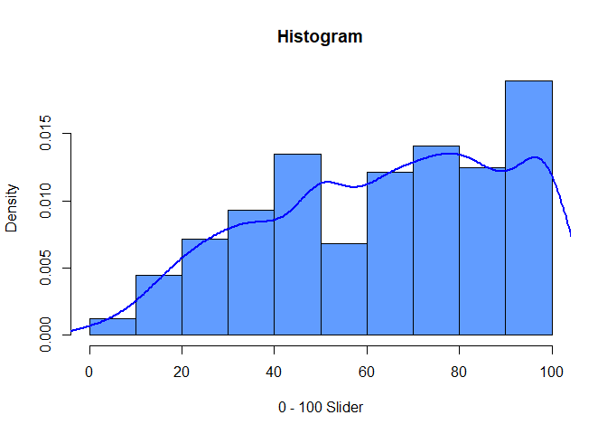<!-- -->


#### Missingness


**Missingness Descriptives**

Min = 2, max = 18, mean = 7.4, std = 3.6

Interclass Correlation (ICC) = 0.41

**Missingness Codes**

<details>
<summary style="font-weight: bold; font-size: 18px; color: #2a5caa; cursor: pointer;">Click to view missingness codes</summary>

<br>

| Code | Description           |
|------|-----------------------|
| -1   | Skipped by respondent |
| -3   | No response recorded  |
| -6   | Survey timeout        |
| -8   | Consent withdrawn     |
| -9   | Other missing reason  |

</details>


#### Screenshot


</div>

</div>

 <div class = "anchor">


**Descriptives**
Min = 0, max = 100, mean = 55.97, std = 28.7


<button 
  onclick="let e = document.getElementById('multiplesliderItem-8445207');
           let arrow = document.getElementById('multiplesliderItem-8445207_arrow');
           e.style.display = e.style.display === 'none' ? 'block' : 'none';
           arrow.textContent = e.style.display === 'none' ? '▼' : '▲';"
  style="background: none; border: none; padding: 0; font-weight: bold; font-size: 18px; color: #2a5caa; cursor: pointer;">
Click to view visuals <span id="multiplesliderItem-8445207_arrow">▼</span>
</button>

<div id="multiplesliderItem-8445207" style="display: none;">


<!-- TOC-IGNORE-BEGIN -->

### Descriptives {.tabset}


#### Histogram


<!-- -->


#### Missingness


**Missingness Descriptives**

Min = 2, max = 18, mean = 7.4, std = 3.6

Interclass Correlation (ICC) = 0.41

**Missingness Codes**

<details>
<summary style="font-weight: bold; font-size: 18px; color: #2a5caa; cursor: pointer;">Click to view missingness codes</summary>

<br>

| Code | Description           |
|------|-----------------------|
| -1   | Skipped by respondent |
| -3   | No response recorded  |
| -6   | Survey timeout        |
| -8   | Consent withdrawn     |
| -9   | Other missing reason  |

</details>


#### Screenshot


</div>

</div>

 <div class = "anchor">


**Descriptives**
Min = 0, max = 100, mean = 21.76, std = 23.32


<button 
  onclick="let e = document.getElementById('multiplesliderItem-8445209');
           let arrow = document.getElementById('multiplesliderItem-8445209_arrow');
           e.style.display = e.style.display === 'none' ? 'block' : 'none';
           arrow.textContent = e.style.display === 'none' ? '▼' : '▲';"
  style="background: none; border: none; padding: 0; font-weight: bold; font-size: 18px; color: #2a5caa; cursor: pointer;">
Click to view visuals <span id="multiplesliderItem-8445209_arrow">▼</span>
</button>

<div id="multiplesliderItem-8445209" style="display: none;">


<!-- TOC-IGNORE-BEGIN -->

### Descriptives {.tabset}


#### Histogram


<!-- -->


#### Missingness


**Missingness Descriptives**

Min = 2, max = 18, mean = 7.4, std = 3.6

Interclass Correlation (ICC) = 0.41

**Missingness Codes**

<details>
<summary style="font-weight: bold; font-size: 18px; color: #2a5caa; cursor: pointer;">Click to view missingness codes</summary>

<br>

| Code | Description           |
|------|-----------------------|
| -1   | Skipped by respondent |
| -3   | No response recorded  |
| -6   | Survey timeout        |
| -8   | Consent withdrawn     |
| -9   | Other missing reason  |

</details>


#### Screenshot


</div>

</div>

 <div class = "anchor">


**Descriptives**
Min = 0, max = 100, mean = 22.28, std = 23.32


<button 
  onclick="let e = document.getElementById('multiplesliderItem-8445211');
           let arrow = document.getElementById('multiplesliderItem-8445211_arrow');
           e.style.display = e.style.display === 'none' ? 'block' : 'none';
           arrow.textContent = e.style.display === 'none' ? '▼' : '▲';"
  style="background: none; border: none; padding: 0; font-weight: bold; font-size: 18px; color: #2a5caa; cursor: pointer;">
Click to view visuals <span id="multiplesliderItem-8445211_arrow">▼</span>
</button>

<div id="multiplesliderItem-8445211" style="display: none;">


<!-- TOC-IGNORE-BEGIN -->

### Descriptives {.tabset}


#### Histogram


<!-- -->


#### Missingness


**Missingness Descriptives**

Min = 2, max = 18, mean = 7.4, std = 3.6

Interclass Correlation (ICC) = 0.41

**Missingness Codes**

<details>
<summary style="font-weight: bold; font-size: 18px; color: #2a5caa; cursor: pointer;">Click to view missingness codes</summary>

<br>

| Code | Description           |
|------|-----------------------|
| -1   | Skipped by respondent |
| -3   | No response recorded  |
| -6   | Survey timeout        |
| -8   | Consent withdrawn     |
| -9   | Other missing reason  |

</details>


#### Screenshot


</div>

</div>

 <div class = "anchor">


**Descriptives**
Min = 0, max = 100, mean = 15.09, std = 20.45


<button 
  onclick="let e = document.getElementById('multiplesliderItem-8445213');
           let arrow = document.getElementById('multiplesliderItem-8445213_arrow');
           e.style.display = e.style.display === 'none' ? 'block' : 'none';
           arrow.textContent = e.style.display === 'none' ? '▼' : '▲';"
  style="background: none; border: none; padding: 0; font-weight: bold; font-size: 18px; color: #2a5caa; cursor: pointer;">
Click to view visuals <span id="multiplesliderItem-8445213_arrow">▼</span>
</button>

<div id="multiplesliderItem-8445213" style="display: none;">


<!-- TOC-IGNORE-BEGIN -->

### Descriptives {.tabset}


#### Histogram


<!-- -->


#### Missingness


**Missingness Descriptives**

Min = 2, max = 18, mean = 7.4, std = 3.6

Interclass Correlation (ICC) = 0.41

**Missingness Codes**

<details>
<summary style="font-weight: bold; font-size: 18px; color: #2a5caa; cursor: pointer;">Click to view missingness codes</summary>

<br>

| Code | Description           |
|------|-----------------------|
| -1   | Skipped by respondent |
| -3   | No response recorded  |
| -6   | Survey timeout        |
| -8   | Consent withdrawn     |
| -9   | Other missing reason  |

</details>


#### Screenshot


</div>

</div>

 <div class = "anchor">


**Descriptives**
Min = 0, max = 100, mean = 67.8, std = 23.16


<button 
  onclick="let e = document.getElementById('multiplesliderItem-8445199');
           let arrow = document.getElementById('multiplesliderItem-8445199_arrow');
           e.style.display = e.style.display === 'none' ? 'block' : 'none';
           arrow.textContent = e.style.display === 'none' ? '▼' : '▲';"
  style="background: none; border: none; padding: 0; font-weight: bold; font-size: 18px; color: #2a5caa; cursor: pointer;">
Click to view visuals <span id="multiplesliderItem-8445199_arrow">▼</span>
</button>

<div id="multiplesliderItem-8445199" style="display: none;">


<!-- TOC-IGNORE-BEGIN -->

### Descriptives {.tabset}


#### Histogram


<!-- -->


#### Missingness


**Missingness Descriptives**

Min = 2, max = 18, mean = 7.4, std = 3.6

Interclass Correlation (ICC) = 0.41

**Missingness Codes**

<details>
<summary style="font-weight: bold; font-size: 18px; color: #2a5caa; cursor: pointer;">Click to view missingness codes</summary>

<br>

| Code | Description           |
|------|-----------------------|
| -1   | Skipped by respondent |
| -3   | No response recorded  |
| -6   | Survey timeout        |
| -8   | Consent withdrawn     |
| -9   | Other missing reason  |

</details>


#### Screenshot


</div>

</div>

 <div class = "anchor">


**Descriptives**
Min = 0, max = 100, mean = 14.6, std = 20.17


<button 
  onclick="let e = document.getElementById('multiplesliderItem-8445215');
           let arrow = document.getElementById('multiplesliderItem-8445215_arrow');
           e.style.display = e.style.display === 'none' ? 'block' : 'none';
           arrow.textContent = e.style.display === 'none' ? '▼' : '▲';"
  style="background: none; border: none; padding: 0; font-weight: bold; font-size: 18px; color: #2a5caa; cursor: pointer;">
Click to view visuals <span id="multiplesliderItem-8445215_arrow">▼</span>
</button>

<div id="multiplesliderItem-8445215" style="display: none;">


<!-- TOC-IGNORE-BEGIN -->

### Descriptives {.tabset}


#### Histogram


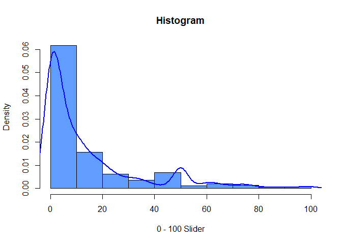<!-- -->


#### Missingness


**Missingness Descriptives**

Min = 2, max = 18, mean = 7.4, std = 3.6

Interclass Correlation (ICC) = 0.41

**Missingness Codes**

<details>
<summary style="font-weight: bold; font-size: 18px; color: #2a5caa; cursor: pointer;">Click to view missingness codes</summary>

<br>

| Code | Description           |
|------|-----------------------|
| -1   | Skipped by respondent |
| -3   | No response recorded  |
| -6   | Survey timeout        |
| -8   | Consent withdrawn     |
| -9   | Other missing reason  |

</details>


#### Screenshot


</div>

</div>


 <!-- Header section -->

<div class = "header-shading">

#### Overall, how stressed have you felt today? <br>

<div id="Item 845-anchor" style="font-weight: bold; color: #2a5caa; margin-top: -0.7em; margin-bottom: 1em;">
  [Item 845]
</div>


</div>


<!-- Body -->


<div class = "anchor">


**Way the question was delivered:** Slider

**Type of data:** numeric

</div> <div class = "anchor">


**Descriptives**
Min = 0, Max = 100, Mean = 33.98, SD = 27.31 


<button 
  onclick="let e = document.getElementById('Item 845');
           let arrow = document.getElementById('Item 845_arrow');
           e.style.display = e.style.display === 'none' ? 'block' : 'none';
           arrow.textContent = e.style.display === 'none' ? '▼' : '▲';"
  style="background: none; border: none; padding: 0; font-weight: bold; font-size: 18px; color: #2a5caa; cursor: pointer;">
Click to view visuals <span id="Item 845_arrow">▼</span>
</button>

<div id="Item 845" style="display: none;">


<!-- TOC-IGNORE-BEGIN -->

### Descriptives {.tabset}


#### Missingness

**Missingness Descriptives**

Delivered / Answered = 0 / 0
Missing = 0
Min = NA, Max = NA, Mean = NA, SD = NA
(Descriptives are rounded to 2 decimals)

Missingness Intraclass Correlation (ICC) = NA 


#### Surveys/Questions

This Item appears in these surveys 
<div style="font-weight: bold; color: #2a5caa;"><a href="#Question 1326-anchor">[Question 1326]</a>: Child End of Day Survey ID 92</div>


#### Screenshot


</div>

</div> <!-- Header section -->

<div class = "header-shading">

#### Since your last survey did you let your parent know about... <br>

<div id="Item 872-anchor" style="font-weight: bold; color: #2a5caa; margin-top: -0.7em; margin-bottom: 1em;">
  [Item 872]
</div>


</div>


<!-- Body -->


<div class = "anchor">


**Way the question was delivered:** Multiple Select

**Type of data:** integer

</div> 
<div class = "anchor">


<button 
  onclick="let e = document.getElementById('Item 872');
           let arrow = document.getElementById('Item 872_arrow');
           e.style.display = e.style.display === 'none' ? 'block' : 'none';
           arrow.textContent = e.style.display === 'none' ? '▼' : '▲';"
  style="background: none; border: none; padding: 0; font-weight: bold; font-size: 18px; color: #2a5caa; cursor: pointer;">
Click to view visuals <span id="Item 872_arrow">▼</span>
</button>

<div id="Item 872" style="display: none;">


<!-- TOC-IGNORE-BEGIN -->

### Descriptives {.tabset}


#### Frequency Table

<table class="table" style="color: black; margin-left: auto; margin-right: auto;">
 <thead>
  <tr>
   <th style="text-align:left;"> Value </th>
   <th style="text-align:left;"> Label </th>
   <th style="text-align:left;"> Counts </th>
   <th style="text-align:left;"> Percentages </th>
  </tr>
 </thead>
<tbody>
  <tr>
   <td style="text-align:left;"> 1 </td>
   <td style="text-align:left;"> How you felt </td>
   <td style="text-align:left;color: darkgreen !important;"> N = 692 </td>
   <td style="text-align:left;"> 16.4% </td>
  </tr>
  <tr>
   <td style="text-align:left;"> 2 </td>
   <td style="text-align:left;"> A problem or challenge you had </td>
   <td style="text-align:left;color: darkgreen !important;"> N = 614 </td>
   <td style="text-align:left;"> 14.6% </td>
  </tr>
  <tr>
   <td style="text-align:left;"> 3 </td>
   <td style="text-align:left;"> A problem or challenge that someone else had </td>
   <td style="text-align:left;color: darkgreen !important;"> N = 160 </td>
   <td style="text-align:left;"> 3.8% </td>
  </tr>
  <tr>
   <td style="text-align:left;"> 4 </td>
   <td style="text-align:left;"> None apply </td>
   <td style="text-align:left;color: darkgreen !important;"> N = 2745 </td>
   <td style="text-align:left;"> 65.2% </td>
  </tr>
</tbody>
</table>


#### Barplot

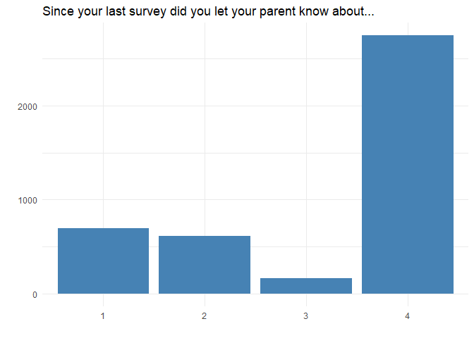<!-- -->


#### Missingness

**Missingness Descriptives**

Delivered / Answered = 3790 / 3778
Missing = 12
Min = 0, Max = 2, Mean = 0.08, SD = 0.34
(Descriptives are rounded to 2 decimals)

Missingness Intraclass Correlation (ICC) = 1.03 


#### Surveys/Questions

This Item appears in these surveys 
<div style="font-weight: bold; color: #2a5caa;"><a href="#Question 4089-anchor">[Question 4089]</a>: Child EMA Survey ID 91</div>
<div style="font-weight: bold; color: #2a5caa;"><a href="#Question 4100-anchor">[Question 4100]</a>: Child End of Day Survey ID 92</div>
<div style="font-weight: bold; color: #2a5caa;"><a href="#Question 4118-anchor">[Question 4118]</a>: Child Morning EMA Survey ID 99</div>
<div style="font-weight: bold; color: #2a5caa;"><a href="#Question 4129-anchor">[Question 4129]</a>: Child Afternoon EMA Survey ID 100</div>
<div style="font-weight: bold; color: #2a5caa;"><a href="#Question 4140-anchor">[Question 4140]</a>: Child Evening EMA Survey ID 101</div>
<div style="font-weight: bold; color: #2a5caa;"><a href="#Question 4151-anchor">[Question 4151]</a>: Proximity Triggered EMA Survey For Child ID 102</div>

#### Screenshot


</div>


</div> <!-- Header section -->

<div class = "header-shading">

#### Give you information, or ideas about how to make things better <br>

<div id="Item 874-anchor" style="font-weight: bold; color: #2a5caa; margin-top: -0.7em; margin-bottom: 1em;">
  [Item 874]
</div>


</div>


<!-- Body -->


<div class = "anchor">


**Way the question was delivered:** Slider

**Type of data:** numeric

</div> <div class = "anchor">


**Descriptives**
Min = 0, Max = 100, Mean = 45.86, SD = 33.55 


<button 
  onclick="let e = document.getElementById('Item 874');
           let arrow = document.getElementById('Item 874_arrow');
           e.style.display = e.style.display === 'none' ? 'block' : 'none';
           arrow.textContent = e.style.display === 'none' ? '▼' : '▲';"
  style="background: none; border: none; padding: 0; font-weight: bold; font-size: 18px; color: #2a5caa; cursor: pointer;">
Click to view visuals <span id="Item 874_arrow">▼</span>
</button>

<div id="Item 874" style="display: none;">


<!-- TOC-IGNORE-BEGIN -->

### Descriptives {.tabset}


#### Missingness

**Missingness Descriptives**

Delivered / Answered = 0 / 0
Missing = 0
Min = NA, Max = NA, Mean = NA, SD = NA
(Descriptives are rounded to 2 decimals)

Missingness Intraclass Correlation (ICC) = NA 


#### Surveys/Questions

This Item appears in these surveys 
<div style="font-weight: bold; color: #2a5caa;"><a href="#Question 5627-anchor">[Question 5627]</a>: Child EMA Survey ID 91</div>
<div style="font-weight: bold; color: #2a5caa;"><a href="#Question 5628-anchor">[Question 5628]</a>: Child End of Day Survey ID 92</div>
<div style="font-weight: bold; color: #2a5caa;"><a href="#Question 5629-anchor">[Question 5629]</a>: Child Morning EMA Survey ID 99</div>
<div style="font-weight: bold; color: #2a5caa;"><a href="#Question 5630-anchor">[Question 5630]</a>: Child Afternoon EMA Survey ID 100</div>
<div style="font-weight: bold; color: #2a5caa;"><a href="#Question 5631-anchor">[Question 5631]</a>: Child Evening EMA Survey ID 101</div>
<div style="font-weight: bold; color: #2a5caa;"><a href="#Question 5632-anchor">[Question 5632]</a>: Proximity Triggered EMA Survey For Child ID 102</div>


#### Screenshot


</div>

</div> <!-- Header section -->

<div class = "header-shading">

#### Do something to help you (ex: pick you up, help with homework) <br>

<div id="Item 875-anchor" style="font-weight: bold; color: #2a5caa; margin-top: -0.7em; margin-bottom: 1em;">
  [Item 875]
</div>


</div>


<!-- Body -->


<div class = "anchor">


**Way the question was delivered:** Slider

**Type of data:** numeric

</div> <div class = "anchor">


**Descriptives**
Min = 0, Max = 100, Mean = 49.32, SD = 33.75 


<button 
  onclick="let e = document.getElementById('Item 875');
           let arrow = document.getElementById('Item 875_arrow');
           e.style.display = e.style.display === 'none' ? 'block' : 'none';
           arrow.textContent = e.style.display === 'none' ? '▼' : '▲';"
  style="background: none; border: none; padding: 0; font-weight: bold; font-size: 18px; color: #2a5caa; cursor: pointer;">
Click to view visuals <span id="Item 875_arrow">▼</span>
</button>

<div id="Item 875" style="display: none;">


<!-- TOC-IGNORE-BEGIN -->

### Descriptives {.tabset}


#### Missingness

**Missingness Descriptives**

Delivered / Answered = 0 / 0
Missing = 0
Min = NA, Max = NA, Mean = NA, SD = NA
(Descriptives are rounded to 2 decimals)

Missingness Intraclass Correlation (ICC) = NA 


#### Surveys/Questions

This Item appears in these surveys 
<div style="font-weight: bold; color: #2a5caa;"><a href="#Question 1259-anchor">[Question 1259]</a>: Child EMA Survey ID 91</div>
<div style="font-weight: bold; color: #2a5caa;"><a href="#Question 2285-anchor">[Question 2285]</a>: Child End of Day Survey ID 92</div>
<div style="font-weight: bold; color: #2a5caa;"><a href="#Question 1355-anchor">[Question 1355]</a>: Child Morning EMA Survey ID 99</div>
<div style="font-weight: bold; color: #2a5caa;"><a href="#Question 1380-anchor">[Question 1380]</a>: Child Afternoon EMA Survey ID 100</div>
<div style="font-weight: bold; color: #2a5caa;"><a href="#Question 1405-anchor">[Question 1405]</a>: Child Evening EMA Survey ID 101</div>
<div style="font-weight: bold; color: #2a5caa;"><a href="#Question 1430-anchor">[Question 1430]</a>: Proximity Triggered EMA Survey For Child ID 102</div>


#### Screenshot


</div>

</div> <!-- Header section -->

<div class = "header-shading">

#### Give you emotional support (ex: listen to and comfort you) <br>

<div id="Item 879-anchor" style="font-weight: bold; color: #2a5caa; margin-top: -0.7em; margin-bottom: 1em;">
  [Item 879]
</div>


</div>


<!-- Body -->


<div class = "anchor">


**Way the question was delivered:** Slider

**Type of data:** numeric

</div> <div class = "anchor">


**Descriptives**
Min = 0, Max = 100, Mean = 43.16, SD = 32.2 


<button 
  onclick="let e = document.getElementById('Item 879');
           let arrow = document.getElementById('Item 879_arrow');
           e.style.display = e.style.display === 'none' ? 'block' : 'none';
           arrow.textContent = e.style.display === 'none' ? '▼' : '▲';"
  style="background: none; border: none; padding: 0; font-weight: bold; font-size: 18px; color: #2a5caa; cursor: pointer;">
Click to view visuals <span id="Item 879_arrow">▼</span>
</button>

<div id="Item 879" style="display: none;">


<!-- TOC-IGNORE-BEGIN -->

### Descriptives {.tabset}


#### Missingness

**Missingness Descriptives**

Delivered / Answered = 0 / 0
Missing = 0
Min = NA, Max = NA, Mean = NA, SD = NA
(Descriptives are rounded to 2 decimals)

Missingness Intraclass Correlation (ICC) = NA 


#### Surveys/Questions

This Item appears in these surveys 
<div style="font-weight: bold; color: #2a5caa;"><a href="#Question 1784-anchor">[Question 1784]</a>: Child EMA Survey ID 91</div>
<div style="font-weight: bold; color: #2a5caa;"><a href="#Question 2283-anchor">[Question 2283]</a>: Child End of Day Survey ID 92</div>
<div style="font-weight: bold; color: #2a5caa;"><a href="#Question 1810-anchor">[Question 1810]</a>: Child Morning EMA Survey ID 99</div>
<div style="font-weight: bold; color: #2a5caa;"><a href="#Question 1836-anchor">[Question 1836]</a>: Child Afternoon EMA Survey ID 100</div>
<div style="font-weight: bold; color: #2a5caa;"><a href="#Question 1862-anchor">[Question 1862]</a>: Child Evening EMA Survey ID 101</div>
<div style="font-weight: bold; color: #2a5caa;"><a href="#Question 1888-anchor">[Question 1888]</a>: Proximity Triggered EMA Survey For Child ID 102</div>


#### Screenshot


</div>

</div> <!-- Header section -->

<div class = "header-shading">

#### Did you have an argument or disagreement? <br>

<div id="Item 1117-anchor" style="font-weight: bold; color: #2a5caa; margin-top: -0.7em; margin-bottom: 1em;">
  [Item 1117]
</div>


</div>


<!-- Body -->


<div class = "anchor">


**Way the question was delivered:** Multiple Choice

**Type of data:** integer

</div> 
<div class = "anchor">


<button 
  onclick="let e = document.getElementById('Item 1117');
           let arrow = document.getElementById('Item 1117_arrow');
           e.style.display = e.style.display === 'none' ? 'block' : 'none';
           arrow.textContent = e.style.display === 'none' ? '▼' : '▲';"
  style="background: none; border: none; padding: 0; font-weight: bold; font-size: 18px; color: #2a5caa; cursor: pointer;">
Click to view visuals <span id="Item 1117_arrow">▼</span>
</button>

<div id="Item 1117" style="display: none;">


<!-- TOC-IGNORE-BEGIN -->

### Descriptives {.tabset}


#### Frequency Table

<table class="table" style="color: black; margin-left: auto; margin-right: auto;">
 <thead>
  <tr>
   <th style="text-align:left;"> Value </th>
   <th style="text-align:left;"> Label </th>
   <th style="text-align:left;"> Counts </th>
   <th style="text-align:left;"> Percentages </th>
  </tr>
 </thead>
<tbody>
  <tr>
   <td style="text-align:left;"> 1 </td>
   <td style="text-align:left;"> Yes </td>
   <td style="text-align:left;color: darkgreen !important;"> N = 61 </td>
   <td style="text-align:left;"> 39.4% </td>
  </tr>
  <tr>
   <td style="text-align:left;"> 2 </td>
   <td style="text-align:left;"> No </td>
   <td style="text-align:left;color: darkgreen !important;"> N = 94 </td>
   <td style="text-align:left;"> 60.6% </td>
  </tr>
</tbody>
</table>


#### Barplot

<!-- -->


#### Missingness

**Missingness Descriptives**

Delivered / Answered = 155 / 155
Missing = 0
Min = 0, Max = 0, Mean = 0, SD = 0
(Descriptives are rounded to 2 decimals)

Missingness Intraclass Correlation (ICC) = NaN 


#### Surveys/Questions

This Item appears in these surveys 
<div style="font-weight: bold; color: #2a5caa;"><a href="#Question 1768-anchor">[Question 1768]</a>: Child EMA Survey ID 91</div>
<div style="font-weight: bold; color: #2a5caa;"><a href="#Question 2269-anchor">[Question 2269]</a>: Child End of Day Survey ID 92</div>
<div style="font-weight: bold; color: #2a5caa;"><a href="#Question 1794-anchor">[Question 1794]</a>: Child Morning EMA Survey ID 99</div>
<div style="font-weight: bold; color: #2a5caa;"><a href="#Question 1820-anchor">[Question 1820]</a>: Child Afternoon EMA Survey ID 100</div>
<div style="font-weight: bold; color: #2a5caa;"><a href="#Question 1846-anchor">[Question 1846]</a>: Child Evening EMA Survey ID 101</div>
<div style="font-weight: bold; color: #2a5caa;"><a href="#Question 1872-anchor">[Question 1872]</a>: Proximity Triggered EMA Survey For Child ID 102</div>


#### Screenshot


</div>


</div> <!-- Header section -->

<div class = "header-shading">

#### How bothered or stressed were you because of this? <br>

<div id="Item 1118-anchor" style="font-weight: bold; color: #2a5caa; margin-top: -0.7em; margin-bottom: 1em;">
  [Item 1118]
</div>


</div>


<!-- Body -->


<div class = "anchor">


**Way the question was delivered:** Slider

**Type of data:** numeric

</div> <div class = "anchor">


**Descriptives**
Min = 18, Max = 100, Mean = 66.97, SD = 21.02 


<button 
  onclick="let e = document.getElementById('Item 1118');
           let arrow = document.getElementById('Item 1118_arrow');
           e.style.display = e.style.display === 'none' ? 'block' : 'none';
           arrow.textContent = e.style.display === 'none' ? '▼' : '▲';"
  style="background: none; border: none; padding: 0; font-weight: bold; font-size: 18px; color: #2a5caa; cursor: pointer;">
Click to view visuals <span id="Item 1118_arrow">▼</span>
</button>

<div id="Item 1118" style="display: none;">


<!-- TOC-IGNORE-BEGIN -->

### Descriptives {.tabset}


#### Missingness

**Missingness Descriptives**

Delivered / Answered = 0 / 0
Missing = 0
Min = NA, Max = NA, Mean = NA, SD = NA
(Descriptives are rounded to 2 decimals)

Missingness Intraclass Correlation (ICC) = NA 


#### Surveys/Questions

This Item appears in these surveys 
<div style="font-weight: bold; color: #2a5caa;"><a href="#Question 1769-anchor">[Question 1769]</a>: Child EMA Survey ID 91</div>
<div style="font-weight: bold; color: #2a5caa;"><a href="#Question 1907-anchor">[Question 1907]</a>: Child End of Day Survey ID 92</div>
<div style="font-weight: bold; color: #2a5caa;"><a href="#Question 1795-anchor">[Question 1795]</a>: Child Morning EMA Survey ID 99</div>
<div style="font-weight: bold; color: #2a5caa;"><a href="#Question 1821-anchor">[Question 1821]</a>: Child Afternoon EMA Survey ID 100</div>
<div style="font-weight: bold; color: #2a5caa;"><a href="#Question 1847-anchor">[Question 1847]</a>: Child Evening EMA Survey ID 101</div>
<div style="font-weight: bold; color: #2a5caa;"><a href="#Question 1873-anchor">[Question 1873]</a>: Proximity Triggered EMA Survey For Child ID 102</div>


#### Screenshot


</div>

</div> <!-- Header section -->

<div class = "header-shading">

#### With whom did you have an argument or disagreement? <br>

<div id="Item 1119-anchor" style="font-weight: bold; color: #2a5caa; margin-top: -0.7em; margin-bottom: 1em;">
  [Item 1119]
</div>


</div>


<!-- Body -->


<div class = "anchor">


**Way the question was delivered:** Multiple Select

**Type of data:** integer

</div> 
<div class = "anchor">


<button 
  onclick="let e = document.getElementById('Item 1119');
           let arrow = document.getElementById('Item 1119_arrow');
           e.style.display = e.style.display === 'none' ? 'block' : 'none';
           arrow.textContent = e.style.display === 'none' ? '▼' : '▲';"
  style="background: none; border: none; padding: 0; font-weight: bold; font-size: 18px; color: #2a5caa; cursor: pointer;">
Click to view visuals <span id="Item 1119_arrow">▼</span>
</button>

<div id="Item 1119" style="display: none;">


<!-- TOC-IGNORE-BEGIN -->

### Descriptives {.tabset}


#### Frequency Table

<table class="table" style="color: black; margin-left: auto; margin-right: auto;">
 <thead>
  <tr>
   <th style="text-align:left;"> Value </th>
   <th style="text-align:left;"> Label </th>
   <th style="text-align:left;"> Counts </th>
   <th style="text-align:left;"> Percentages </th>
  </tr>
 </thead>
<tbody>
  <tr>
   <td style="text-align:left;"> 1 </td>
   <td style="text-align:left;"> Parents </td>
   <td style="text-align:left;color: darkgreen !important;"> N = 36 </td>
   <td style="text-align:left;"> 44.4% </td>
  </tr>
  <tr>
   <td style="text-align:left;"> 2 </td>
   <td style="text-align:left;"> Siblings </td>
   <td style="text-align:left;color: darkgreen !important;"> N = 13 </td>
   <td style="text-align:left;"> 16% </td>
  </tr>
  <tr>
   <td style="text-align:left;"> 3 </td>
   <td style="text-align:left;"> Friends, other people your age </td>
   <td style="text-align:left;color: darkgreen !important;"> N = 21 </td>
   <td style="text-align:left;"> 25.9% </td>
  </tr>
  <tr>
   <td style="text-align:left;"> 4 </td>
   <td style="text-align:left;"> Teachers, coaches, other adults </td>
   <td style="text-align:left;color: darkgreen !important;"> N = 9 </td>
   <td style="text-align:left;"> 11.1% </td>
  </tr>
  <tr>
   <td style="text-align:left;"> 5 </td>
   <td style="text-align:left;"> Other (ex: cashier, a stranger) </td>
   <td style="text-align:left;color: darkgreen !important;"> N = 2 </td>
   <td style="text-align:left;"> 2.5% </td>
  </tr>
</tbody>
</table>


#### Barplot

<!-- -->


#### Missingness

**Missingness Descriptives**

Delivered / Answered = 60 / 60
Missing = 0
Min = 0, Max = 0, Mean = 0, SD = 0
(Descriptives are rounded to 2 decimals)

Missingness Intraclass Correlation (ICC) = NaN 


#### Surveys/Questions

This Item appears in these surveys 
<div style="font-weight: bold; color: #2a5caa;"><a href="#Question 1770-anchor">[Question 1770]</a>: Child EMA Survey ID 91</div>
<div style="font-weight: bold; color: #2a5caa;"><a href="#Question 1908-anchor">[Question 1908]</a>: Child End of Day Survey ID 92</div>
<div style="font-weight: bold; color: #2a5caa;"><a href="#Question 1796-anchor">[Question 1796]</a>: Child Morning EMA Survey ID 99</div>
<div style="font-weight: bold; color: #2a5caa;"><a href="#Question 1822-anchor">[Question 1822]</a>: Child Afternoon EMA Survey ID 100</div>
<div style="font-weight: bold; color: #2a5caa;"><a href="#Question 1848-anchor">[Question 1848]</a>: Child Evening EMA Survey ID 101</div>
<div style="font-weight: bold; color: #2a5caa;"><a href="#Question 1874-anchor">[Question 1874]</a>: Proximity Triggered EMA Survey For Child ID 102</div>

#### Screenshot


</div>


</div> <!-- Header section -->

<div class = "header-shading">

#### Did you feel like you had a lot of demands placed on you that were stressful? (ex: had to do a chore; had too much homework)? <br>

<div id="Item 1121-anchor" style="font-weight: bold; color: #2a5caa; margin-top: -0.7em; margin-bottom: 1em;">
  [Item 1121]
</div>


</div>


<!-- Body -->


<div class = "anchor">


**Way the question was delivered:** Multiple Choice

**Type of data:** integer

</div> 
<div class = "anchor">


<button 
  onclick="let e = document.getElementById('Item 1121');
           let arrow = document.getElementById('Item 1121_arrow');
           e.style.display = e.style.display === 'none' ? 'block' : 'none';
           arrow.textContent = e.style.display === 'none' ? '▼' : '▲';"
  style="background: none; border: none; padding: 0; font-weight: bold; font-size: 18px; color: #2a5caa; cursor: pointer;">
Click to view visuals <span id="Item 1121_arrow">▼</span>
</button>

<div id="Item 1121" style="display: none;">


<!-- TOC-IGNORE-BEGIN -->

### Descriptives {.tabset}


#### Frequency Table

<table class="table" style="color: black; margin-left: auto; margin-right: auto;">
 <thead>
  <tr>
   <th style="text-align:left;"> Value </th>
   <th style="text-align:left;"> Label </th>
   <th style="text-align:left;"> Counts </th>
   <th style="text-align:left;"> Percentages </th>
  </tr>
 </thead>
<tbody>
  <tr>
   <td style="text-align:left;"> 1 </td>
   <td style="text-align:left;"> Yes </td>
   <td style="text-align:left;color: darkgreen !important;"> N = 78 </td>
   <td style="text-align:left;"> 50.6% </td>
  </tr>
  <tr>
   <td style="text-align:left;"> 2 </td>
   <td style="text-align:left;"> No </td>
   <td style="text-align:left;color: darkgreen !important;"> N = 76 </td>
   <td style="text-align:left;"> 49.4% </td>
  </tr>
</tbody>
</table>


#### Barplot

<!-- -->


#### Missingness

**Missingness Descriptives**

Delivered / Answered = 154 / 154
Missing = 0
Min = 0, Max = 0, Mean = 0, SD = 0
(Descriptives are rounded to 2 decimals)

Missingness Intraclass Correlation (ICC) = NaN 


#### Surveys/Questions

This Item appears in these surveys 
<div style="font-weight: bold; color: #2a5caa;"><a href="#Question 1771-anchor">[Question 1771]</a>: Child EMA Survey ID 91</div>
<div style="font-weight: bold; color: #2a5caa;"><a href="#Question 2270-anchor">[Question 2270]</a>: Child End of Day Survey ID 92</div>
<div style="font-weight: bold; color: #2a5caa;"><a href="#Question 1797-anchor">[Question 1797]</a>: Child Morning EMA Survey ID 99</div>
<div style="font-weight: bold; color: #2a5caa;"><a href="#Question 1823-anchor">[Question 1823]</a>: Child Afternoon EMA Survey ID 100</div>
<div style="font-weight: bold; color: #2a5caa;"><a href="#Question 1849-anchor">[Question 1849]</a>: Child Evening EMA Survey ID 101</div>
<div style="font-weight: bold; color: #2a5caa;"><a href="#Question 1875-anchor">[Question 1875]</a>: Proximity Triggered EMA Survey For Child ID 102</div>


#### Screenshot


</div>


</div> <!-- Header section -->

<div class = "header-shading">

#### How bothered or stressed were you because of this? <br>

<div id="Item 1122-anchor" style="font-weight: bold; color: #2a5caa; margin-top: -0.7em; margin-bottom: 1em;">
  [Item 1122]
</div>


</div>


<!-- Body -->


<div class = "anchor">


**Way the question was delivered:** Slider

**Type of data:** numeric

</div> <div class = "anchor">


**Descriptives**
Min = 27, Max = 100, Mean = 72.33, SD = 15.83 


<button 
  onclick="let e = document.getElementById('Item 1122');
           let arrow = document.getElementById('Item 1122_arrow');
           e.style.display = e.style.display === 'none' ? 'block' : 'none';
           arrow.textContent = e.style.display === 'none' ? '▼' : '▲';"
  style="background: none; border: none; padding: 0; font-weight: bold; font-size: 18px; color: #2a5caa; cursor: pointer;">
Click to view visuals <span id="Item 1122_arrow">▼</span>
</button>

<div id="Item 1122" style="display: none;">


<!-- TOC-IGNORE-BEGIN -->

### Descriptives {.tabset}


#### Missingness

**Missingness Descriptives**

Delivered / Answered = 0 / 0
Missing = 0
Min = NA, Max = NA, Mean = NA, SD = NA
(Descriptives are rounded to 2 decimals)

Missingness Intraclass Correlation (ICC) = NA 


#### Surveys/Questions

This Item appears in these surveys 
<div style="font-weight: bold; color: #2a5caa;"><a href="#Question 1772-anchor">[Question 1772]</a>: Child EMA Survey ID 91</div>
<div style="font-weight: bold; color: #2a5caa;"><a href="#Question 1910-anchor">[Question 1910]</a>: Child End of Day Survey ID 92</div>
<div style="font-weight: bold; color: #2a5caa;"><a href="#Question 1798-anchor">[Question 1798]</a>: Child Morning EMA Survey ID 99</div>
<div style="font-weight: bold; color: #2a5caa;"><a href="#Question 1824-anchor">[Question 1824]</a>: Child Afternoon EMA Survey ID 100</div>
<div style="font-weight: bold; color: #2a5caa;"><a href="#Question 1850-anchor">[Question 1850]</a>: Child Evening EMA Survey ID 101</div>
<div style="font-weight: bold; color: #2a5caa;"><a href="#Question 1876-anchor">[Question 1876]</a>: Proximity Triggered EMA Survey For Child ID 102</div>


#### Screenshot


</div>

</div> <!-- Header section -->

<div class = "header-shading">

#### Where did you feel this way? <br>

<div id="Item 1123-anchor" style="font-weight: bold; color: #2a5caa; margin-top: -0.7em; margin-bottom: 1em;">
  [Item 1123]
</div>


</div>


<!-- Body -->


<div class = "anchor">


**Way the question was delivered:** Multiple Select

**Type of data:** integer

</div> 
<div class = "anchor">


<button 
  onclick="let e = document.getElementById('Item 1123');
           let arrow = document.getElementById('Item 1123_arrow');
           e.style.display = e.style.display === 'none' ? 'block' : 'none';
           arrow.textContent = e.style.display === 'none' ? '▼' : '▲';"
  style="background: none; border: none; padding: 0; font-weight: bold; font-size: 18px; color: #2a5caa; cursor: pointer;">
Click to view visuals <span id="Item 1123_arrow">▼</span>
</button>

<div id="Item 1123" style="display: none;">


<!-- TOC-IGNORE-BEGIN -->

### Descriptives {.tabset}


#### Frequency Table

<table class="table" style="color: black; margin-left: auto; margin-right: auto;">
 <thead>
  <tr>
   <th style="text-align:left;"> Value </th>
   <th style="text-align:left;"> Label </th>
   <th style="text-align:left;"> Counts </th>
   <th style="text-align:left;"> Percentages </th>
  </tr>
 </thead>
<tbody>
  <tr>
   <td style="text-align:left;"> 1 </td>
   <td style="text-align:left;"> Home </td>
   <td style="text-align:left;color: darkgreen !important;"> N = 42 </td>
   <td style="text-align:left;"> 38.9% </td>
  </tr>
  <tr>
   <td style="text-align:left;"> 2 </td>
   <td style="text-align:left;"> School or extracurricular activity </td>
   <td style="text-align:left;color: darkgreen !important;"> N = 52 </td>
   <td style="text-align:left;"> 48.1% </td>
  </tr>
  <tr>
   <td style="text-align:left;"> 3 </td>
   <td style="text-align:left;"> Other (ex: at the store) </td>
   <td style="text-align:left;color: darkgreen !important;"> N = 14 </td>
   <td style="text-align:left;"> 13% </td>
  </tr>
</tbody>
</table>


#### Barplot

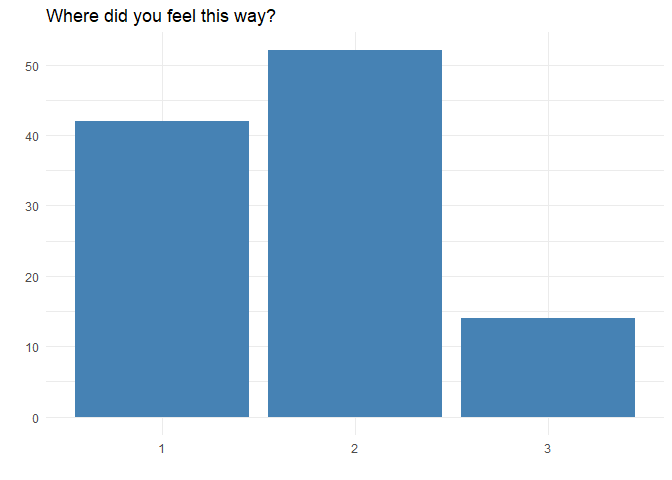<!-- -->


#### Missingness

**Missingness Descriptives**

Delivered / Answered = 78 / 78
Missing = 0
Min = 0, Max = 0, Mean = 0, SD = 0
(Descriptives are rounded to 2 decimals)

Missingness Intraclass Correlation (ICC) = NaN 


#### Surveys/Questions

This Item appears in these surveys 
<div style="font-weight: bold; color: #2a5caa;"><a href="#Question 1773-anchor">[Question 1773]</a>: Child EMA Survey ID 91</div>
<div style="font-weight: bold; color: #2a5caa;"><a href="#Question 1911-anchor">[Question 1911]</a>: Child End of Day Survey ID 92</div>
<div style="font-weight: bold; color: #2a5caa;"><a href="#Question 1799-anchor">[Question 1799]</a>: Child Morning EMA Survey ID 99</div>
<div style="font-weight: bold; color: #2a5caa;"><a href="#Question 1825-anchor">[Question 1825]</a>: Child Afternoon EMA Survey ID 100</div>
<div style="font-weight: bold; color: #2a5caa;"><a href="#Question 1851-anchor">[Question 1851]</a>: Child Evening EMA Survey ID 101</div>
<div style="font-weight: bold; color: #2a5caa;"><a href="#Question 1877-anchor">[Question 1877]</a>: Proximity Triggered EMA Survey For Child ID 102</div>

#### Screenshot


</div>


</div> <!-- Header section -->

<div class = "header-shading">

#### Did you have some other problem or event that was stressful? (ex: forgot something; was late to an appointment)? <br>

<div id="Item 1125-anchor" style="font-weight: bold; color: #2a5caa; margin-top: -0.7em; margin-bottom: 1em;">
  [Item 1125]
</div>


</div>


<!-- Body -->


<div class = "anchor">


**Way the question was delivered:** Multiple Choice

**Type of data:** integer

</div> 
<div class = "anchor">


<button 
  onclick="let e = document.getElementById('Item 1125');
           let arrow = document.getElementById('Item 1125_arrow');
           e.style.display = e.style.display === 'none' ? 'block' : 'none';
           arrow.textContent = e.style.display === 'none' ? '▼' : '▲';"
  style="background: none; border: none; padding: 0; font-weight: bold; font-size: 18px; color: #2a5caa; cursor: pointer;">
Click to view visuals <span id="Item 1125_arrow">▼</span>
</button>

<div id="Item 1125" style="display: none;">


<!-- TOC-IGNORE-BEGIN -->

### Descriptives {.tabset}


#### Frequency Table

<table class="table" style="color: black; margin-left: auto; margin-right: auto;">
 <thead>
  <tr>
   <th style="text-align:left;"> Value </th>
   <th style="text-align:left;"> Label </th>
   <th style="text-align:left;"> Counts </th>
   <th style="text-align:left;"> Percentages </th>
  </tr>
 </thead>
<tbody>
  <tr>
   <td style="text-align:left;"> 1 </td>
   <td style="text-align:left;"> Yes </td>
   <td style="text-align:left;color: darkgreen !important;"> N = 68 </td>
   <td style="text-align:left;"> 44.4% </td>
  </tr>
  <tr>
   <td style="text-align:left;"> 2 </td>
   <td style="text-align:left;"> No </td>
   <td style="text-align:left;color: darkgreen !important;"> N = 85 </td>
   <td style="text-align:left;"> 55.6% </td>
  </tr>
</tbody>
</table>


#### Barplot

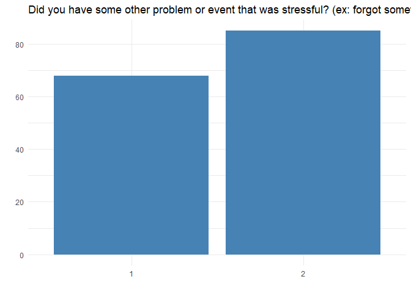<!-- -->


#### Missingness

**Missingness Descriptives**

Delivered / Answered = 154 / 153
Missing = 1
Min = 0, Max = 1, Mean = 0.01, SD = 0.12
(Descriptives are rounded to 2 decimals)

Missingness Intraclass Correlation (ICC) = 1.84 


#### Surveys/Questions

This Item appears in these surveys 
<div style="font-weight: bold; color: #2a5caa;"><a href="#Question 1774-anchor">[Question 1774]</a>: Child EMA Survey ID 91</div>
<div style="font-weight: bold; color: #2a5caa;"><a href="#Question 2271-anchor">[Question 2271]</a>: Child End of Day Survey ID 92</div>
<div style="font-weight: bold; color: #2a5caa;"><a href="#Question 1800-anchor">[Question 1800]</a>: Child Morning EMA Survey ID 99</div>
<div style="font-weight: bold; color: #2a5caa;"><a href="#Question 1826-anchor">[Question 1826]</a>: Child Afternoon EMA Survey ID 100</div>
<div style="font-weight: bold; color: #2a5caa;"><a href="#Question 1852-anchor">[Question 1852]</a>: Child Evening EMA Survey ID 101</div>
<div style="font-weight: bold; color: #2a5caa;"><a href="#Question 1878-anchor">[Question 1878]</a>: Proximity Triggered EMA Survey For Child ID 102</div>


#### Screenshot


</div>


</div> <!-- Header section -->

<div class = "header-shading">

#### How bothered or stressed were you because of this? <br>

<div id="Item 1126-anchor" style="font-weight: bold; color: #2a5caa; margin-top: -0.7em; margin-bottom: 1em;">
  [Item 1126]
</div>


</div>


<!-- Body -->


<div class = "anchor">


**Way the question was delivered:** Slider

**Type of data:** numeric

</div> <div class = "anchor">


**Descriptives**
Min = 0, Max = 100, Mean = 65.49, SD = 24.38 


<button 
  onclick="let e = document.getElementById('Item 1126');
           let arrow = document.getElementById('Item 1126_arrow');
           e.style.display = e.style.display === 'none' ? 'block' : 'none';
           arrow.textContent = e.style.display === 'none' ? '▼' : '▲';"
  style="background: none; border: none; padding: 0; font-weight: bold; font-size: 18px; color: #2a5caa; cursor: pointer;">
Click to view visuals <span id="Item 1126_arrow">▼</span>
</button>

<div id="Item 1126" style="display: none;">


<!-- TOC-IGNORE-BEGIN -->

### Descriptives {.tabset}


#### Missingness

**Missingness Descriptives**

Delivered / Answered = 0 / 0
Missing = 0
Min = NA, Max = NA, Mean = NA, SD = NA
(Descriptives are rounded to 2 decimals)

Missingness Intraclass Correlation (ICC) = NA 


#### Surveys/Questions

This Item appears in these surveys 
<div style="font-weight: bold; color: #2a5caa;"><a href="#Question 1775-anchor">[Question 1775]</a>: Child EMA Survey ID 91</div>
<div style="font-weight: bold; color: #2a5caa;"><a href="#Question 1913-anchor">[Question 1913]</a>: Child End of Day Survey ID 92</div>
<div style="font-weight: bold; color: #2a5caa;"><a href="#Question 1801-anchor">[Question 1801]</a>: Child Morning EMA Survey ID 99</div>
<div style="font-weight: bold; color: #2a5caa;"><a href="#Question 1827-anchor">[Question 1827]</a>: Child Afternoon EMA Survey ID 100</div>
<div style="font-weight: bold; color: #2a5caa;"><a href="#Question 1853-anchor">[Question 1853]</a>: Child Evening EMA Survey ID 101</div>
<div style="font-weight: bold; color: #2a5caa;"><a href="#Question 1879-anchor">[Question 1879]</a>: Proximity Triggered EMA Survey For Child ID 102</div>


#### Screenshot


</div>

</div> <!-- Header section -->

<div class = "header-shading">

#### Where did this happen? <br>

<div id="Item 1127-anchor" style="font-weight: bold; color: #2a5caa; margin-top: -0.7em; margin-bottom: 1em;">
  [Item 1127]
</div>


</div>


<!-- Body -->


<div class = "anchor">


**Way the question was delivered:** Multiple Select

**Type of data:** integer

</div> 
<div class = "anchor">


<button 
  onclick="let e = document.getElementById('Item 1127');
           let arrow = document.getElementById('Item 1127_arrow');
           e.style.display = e.style.display === 'none' ? 'block' : 'none';
           arrow.textContent = e.style.display === 'none' ? '▼' : '▲';"
  style="background: none; border: none; padding: 0; font-weight: bold; font-size: 18px; color: #2a5caa; cursor: pointer;">
Click to view visuals <span id="Item 1127_arrow">▼</span>
</button>

<div id="Item 1127" style="display: none;">


<!-- TOC-IGNORE-BEGIN -->

### Descriptives {.tabset}


#### Frequency Table

<table class="table" style="color: black; margin-left: auto; margin-right: auto;">
 <thead>
  <tr>
   <th style="text-align:left;"> Value </th>
   <th style="text-align:left;"> Label </th>
   <th style="text-align:left;"> Counts </th>
   <th style="text-align:left;"> Percentages </th>
  </tr>
 </thead>
<tbody>
  <tr>
   <td style="text-align:left;"> 1 </td>
   <td style="text-align:left;"> Home </td>
   <td style="text-align:left;color: darkgreen !important;"> N = 32 </td>
   <td style="text-align:left;"> 40% </td>
  </tr>
  <tr>
   <td style="text-align:left;"> 2 </td>
   <td style="text-align:left;"> School or extracurricular activity </td>
   <td style="text-align:left;color: darkgreen !important;"> N = 35 </td>
   <td style="text-align:left;"> 43.8% </td>
  </tr>
  <tr>
   <td style="text-align:left;"> 3 </td>
   <td style="text-align:left;"> Other (ex: at the store) </td>
   <td style="text-align:left;color: darkgreen !important;"> N = 13 </td>
   <td style="text-align:left;"> 16.2% </td>
  </tr>
</tbody>
</table>


#### Barplot

<!-- -->


#### Missingness

**Missingness Descriptives**

Delivered / Answered = 68 / 68
Missing = 0
Min = 0, Max = 0, Mean = 0, SD = 0
(Descriptives are rounded to 2 decimals)

Missingness Intraclass Correlation (ICC) = NaN 


#### Surveys/Questions

This Item appears in these surveys 
<div style="font-weight: bold; color: #2a5caa;"><a href="#Question 1776-anchor">[Question 1776]</a>: Child EMA Survey ID 91</div>
<div style="font-weight: bold; color: #2a5caa;"><a href="#Question 1914-anchor">[Question 1914]</a>: Child End of Day Survey ID 92</div>
<div style="font-weight: bold; color: #2a5caa;"><a href="#Question 1802-anchor">[Question 1802]</a>: Child Morning EMA Survey ID 99</div>
<div style="font-weight: bold; color: #2a5caa;"><a href="#Question 1828-anchor">[Question 1828]</a>: Child Afternoon EMA Survey ID 100</div>
<div style="font-weight: bold; color: #2a5caa;"><a href="#Question 1854-anchor">[Question 1854]</a>: Child Evening EMA Survey ID 101</div>
<div style="font-weight: bold; color: #2a5caa;"><a href="#Question 1880-anchor">[Question 1880]</a>: Proximity Triggered EMA Survey For Child ID 102</div>

#### Screenshot


</div>


</div> <!-- Header section -->

<div class = "header-shading">

#### Did someone else have a problem or event that turned out to be stressful for you? <br>

<div id="Item 1129-anchor" style="font-weight: bold; color: #2a5caa; margin-top: -0.7em; margin-bottom: 1em;">
  [Item 1129]
</div>


</div>


<!-- Body -->


<div class = "anchor">


**Way the question was delivered:** Multiple Choice

**Type of data:** integer

</div> 
<div class = "anchor">


<button 
  onclick="let e = document.getElementById('Item 1129');
           let arrow = document.getElementById('Item 1129_arrow');
           e.style.display = e.style.display === 'none' ? 'block' : 'none';
           arrow.textContent = e.style.display === 'none' ? '▼' : '▲';"
  style="background: none; border: none; padding: 0; font-weight: bold; font-size: 18px; color: #2a5caa; cursor: pointer;">
Click to view visuals <span id="Item 1129_arrow">▼</span>
</button>

<div id="Item 1129" style="display: none;">


<!-- TOC-IGNORE-BEGIN -->

### Descriptives {.tabset}


#### Frequency Table

<table class="table" style="color: black; margin-left: auto; margin-right: auto;">
 <thead>
  <tr>
   <th style="text-align:left;"> Value </th>
   <th style="text-align:left;"> Label </th>
   <th style="text-align:left;"> Counts </th>
   <th style="text-align:left;"> Percentages </th>
  </tr>
 </thead>
<tbody>
  <tr>
   <td style="text-align:left;"> 1 </td>
   <td style="text-align:left;"> Yes </td>
   <td style="text-align:left;color: darkgreen !important;"> N = 38 </td>
   <td style="text-align:left;"> 24.7% </td>
  </tr>
  <tr>
   <td style="text-align:left;"> 2 </td>
   <td style="text-align:left;"> No </td>
   <td style="text-align:left;color: darkgreen !important;"> N = 116 </td>
   <td style="text-align:left;"> 75.3% </td>
  </tr>
</tbody>
</table>


#### Barplot

<!-- -->


#### Missingness

**Missingness Descriptives**

Delivered / Answered = 154 / 154
Missing = 0
Min = 0, Max = 0, Mean = 0, SD = 0
(Descriptives are rounded to 2 decimals)

Missingness Intraclass Correlation (ICC) = NaN 


#### Surveys/Questions

This Item appears in these surveys 
<div style="font-weight: bold; color: #2a5caa;"><a href="#Question 1777-anchor">[Question 1777]</a>: Child EMA Survey ID 91</div>
<div style="font-weight: bold; color: #2a5caa;"><a href="#Question 2272-anchor">[Question 2272]</a>: Child End of Day Survey ID 92</div>
<div style="font-weight: bold; color: #2a5caa;"><a href="#Question 1803-anchor">[Question 1803]</a>: Child Morning EMA Survey ID 99</div>
<div style="font-weight: bold; color: #2a5caa;"><a href="#Question 1829-anchor">[Question 1829]</a>: Child Afternoon EMA Survey ID 100</div>
<div style="font-weight: bold; color: #2a5caa;"><a href="#Question 1855-anchor">[Question 1855]</a>: Child Evening EMA Survey ID 101</div>
<div style="font-weight: bold; color: #2a5caa;"><a href="#Question 1881-anchor">[Question 1881]</a>: Proximity Triggered EMA Survey For Child ID 102</div>


#### Screenshot


</div>


</div> <!-- Header section -->

<div class = "header-shading">

#### How bothered or stressed were you because of this? <br>

<div id="Item 1130-anchor" style="font-weight: bold; color: #2a5caa; margin-top: -0.7em; margin-bottom: 1em;">
  [Item 1130]
</div>


</div>


<!-- Body -->


<div class = "anchor">


**Way the question was delivered:** Slider

**Type of data:** numeric

</div> <div class = "anchor">


**Descriptives**
Min = 15, Max = 98, Mean = 66.08, SD = 21.57 


<button 
  onclick="let e = document.getElementById('Item 1130');
           let arrow = document.getElementById('Item 1130_arrow');
           e.style.display = e.style.display === 'none' ? 'block' : 'none';
           arrow.textContent = e.style.display === 'none' ? '▼' : '▲';"
  style="background: none; border: none; padding: 0; font-weight: bold; font-size: 18px; color: #2a5caa; cursor: pointer;">
Click to view visuals <span id="Item 1130_arrow">▼</span>
</button>

<div id="Item 1130" style="display: none;">


<!-- TOC-IGNORE-BEGIN -->

### Descriptives {.tabset}


#### Missingness

**Missingness Descriptives**

Delivered / Answered = 0 / 0
Missing = 0
Min = NA, Max = NA, Mean = NA, SD = NA
(Descriptives are rounded to 2 decimals)

Missingness Intraclass Correlation (ICC) = NA 


#### Surveys/Questions

This Item appears in these surveys 
<div style="font-weight: bold; color: #2a5caa;"><a href="#Question 1778-anchor">[Question 1778]</a>: Child EMA Survey ID 91</div>
<div style="font-weight: bold; color: #2a5caa;"><a href="#Question 2273-anchor">[Question 2273]</a>: Child End of Day Survey ID 92</div>
<div style="font-weight: bold; color: #2a5caa;"><a href="#Question 1804-anchor">[Question 1804]</a>: Child Morning EMA Survey ID 99</div>
<div style="font-weight: bold; color: #2a5caa;"><a href="#Question 1830-anchor">[Question 1830]</a>: Child Afternoon EMA Survey ID 100</div>
<div style="font-weight: bold; color: #2a5caa;"><a href="#Question 1856-anchor">[Question 1856]</a>: Child Evening EMA Survey ID 101</div>
<div style="font-weight: bold; color: #2a5caa;"><a href="#Question 1882-anchor">[Question 1882]</a>: Proximity Triggered EMA Survey For Child ID 102</div>


#### Screenshot


</div>

</div> <!-- Header section -->

<div class = "header-shading">

#### Who did this problem involve? <br>

<div id="Item 1131-anchor" style="font-weight: bold; color: #2a5caa; margin-top: -0.7em; margin-bottom: 1em;">
  [Item 1131]
</div>


</div>


<!-- Body -->


<div class = "anchor">


**Way the question was delivered:** Multiple Select

**Type of data:** integer

</div> 
<div class = "anchor">


<button 
  onclick="let e = document.getElementById('Item 1131');
           let arrow = document.getElementById('Item 1131_arrow');
           e.style.display = e.style.display === 'none' ? 'block' : 'none';
           arrow.textContent = e.style.display === 'none' ? '▼' : '▲';"
  style="background: none; border: none; padding: 0; font-weight: bold; font-size: 18px; color: #2a5caa; cursor: pointer;">
Click to view visuals <span id="Item 1131_arrow">▼</span>
</button>

<div id="Item 1131" style="display: none;">


<!-- TOC-IGNORE-BEGIN -->

### Descriptives {.tabset}


#### Frequency Table

<table class="table" style="color: black; margin-left: auto; margin-right: auto;">
 <thead>
  <tr>
   <th style="text-align:left;"> Value </th>
   <th style="text-align:left;"> Label </th>
   <th style="text-align:left;"> Counts </th>
   <th style="text-align:left;"> Percentages </th>
  </tr>
 </thead>
<tbody>
  <tr>
   <td style="text-align:left;"> 1 </td>
   <td style="text-align:left;"> Family </td>
   <td style="text-align:left;color: darkgreen !important;"> N = 16 </td>
   <td style="text-align:left;"> 36.4% </td>
  </tr>
  <tr>
   <td style="text-align:left;"> 2 </td>
   <td style="text-align:left;"> Friends or someone you know </td>
   <td style="text-align:left;color: darkgreen !important;"> N = 20 </td>
   <td style="text-align:left;"> 45.5% </td>
  </tr>
  <tr>
   <td style="text-align:left;"> 3 </td>
   <td style="text-align:left;"> Other (ex: strangers) </td>
   <td style="text-align:left;color: darkgreen !important;"> N = 8 </td>
   <td style="text-align:left;"> 18.2% </td>
  </tr>
</tbody>
</table>


#### Barplot

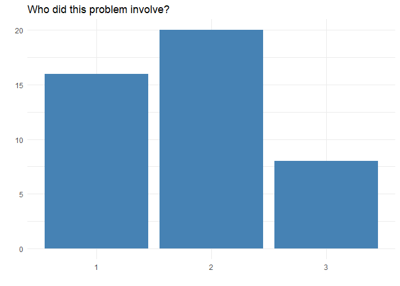<!-- -->


#### Missingness

**Missingness Descriptives**

Delivered / Answered = 37 / 37
Missing = 0
Min = 0, Max = 0, Mean = 0, SD = 0
(Descriptives are rounded to 2 decimals)

Missingness Intraclass Correlation (ICC) = NaN 


#### Surveys/Questions

This Item appears in these surveys 
<div style="font-weight: bold; color: #2a5caa;"><a href="#Question 1779-anchor">[Question 1779]</a>: Child EMA Survey ID 91</div>
<div style="font-weight: bold; color: #2a5caa;"><a href="#Question 2274-anchor">[Question 2274]</a>: Child End of Day Survey ID 92</div>
<div style="font-weight: bold; color: #2a5caa;"><a href="#Question 1805-anchor">[Question 1805]</a>: Child Morning EMA Survey ID 99</div>
<div style="font-weight: bold; color: #2a5caa;"><a href="#Question 1831-anchor">[Question 1831]</a>: Child Afternoon EMA Survey ID 100</div>
<div style="font-weight: bold; color: #2a5caa;"><a href="#Question 1857-anchor">[Question 1857]</a>: Child Evening EMA Survey ID 101</div>
<div style="font-weight: bold; color: #2a5caa;"><a href="#Question 1883-anchor">[Question 1883]</a>: Proximity Triggered EMA Survey For Child ID 102</div>

#### Screenshot


</div>


</div> <!-- Header section -->

<div class = "header-shading">

#### Check all the ways that you interacted with your parent, in person. <br>

<div id="Item 1133-anchor" style="font-weight: bold; color: #2a5caa; margin-top: -0.7em; margin-bottom: 1em;">
  [Item 1133]
</div>


</div>


<!-- Body -->


<div class = "anchor">


**Way the question was delivered:** Multiple Select

**Type of data:** integer

</div> 
<div class = "anchor">

<div style='font-size:16px; line-height:1.5; margin: 1em 0; padding: 0.5em 1em; border-left: 4px solid #2a5caa; background-color: #f9faff; color: #333;'><strong>Note:</strong> This question is only delivered if participant answered question <em>Item 4465</em>: <em>Check all the ways that you interacted with parents.</em>.</div>


<button 
  onclick="let e = document.getElementById('Item 1133');
           let arrow = document.getElementById('Item 1133_arrow');
           e.style.display = e.style.display === 'none' ? 'block' : 'none';
           arrow.textContent = e.style.display === 'none' ? '▼' : '▲';"
  style="background: none; border: none; padding: 0; font-weight: bold; font-size: 18px; color: #2a5caa; cursor: pointer;">
Click to view visuals <span id="Item 1133_arrow">▼</span>
</button>

<div id="Item 1133" style="display: none;">


<!-- TOC-IGNORE-BEGIN -->

### Descriptives {.tabset}


#### Frequency Table

<table class="table" style="color: black; margin-left: auto; margin-right: auto;">
 <thead>
  <tr>
   <th style="text-align:left;"> Value </th>
   <th style="text-align:left;"> Label </th>
   <th style="text-align:left;"> Counts </th>
   <th style="text-align:left;"> Percentages </th>
  </tr>
 </thead>
<tbody>
  <tr>
   <td style="text-align:left;"> 1 </td>
   <td style="text-align:left;"> Do something together (ex: eat, clean, watch a show) </td>
   <td style="text-align:left;color: darkgreen !important;"> N = 359 </td>
   <td style="text-align:left;"> 18.4% </td>
  </tr>
  <tr>
   <td style="text-align:left;"> 2 </td>
   <td style="text-align:left;"> Make physical contact (ex: hug, lean on each other) </td>
   <td style="text-align:left;color: darkgreen !important;"> N = 238 </td>
   <td style="text-align:left;"> 12.2% </td>
  </tr>
  <tr>
   <td style="text-align:left;"> 3 </td>
   <td style="text-align:left;"> Just be together (ex: be on your own phones) </td>
   <td style="text-align:left;color: darkgreen !important;"> N = 323 </td>
   <td style="text-align:left;"> 16.6% </td>
  </tr>
  <tr>
   <td style="text-align:left;"> 4 </td>
   <td style="text-align:left;"> Ask a question or make a request </td>
   <td style="text-align:left;color: darkgreen !important;"> N = 242 </td>
   <td style="text-align:left;"> 12.4% </td>
  </tr>
  <tr>
   <td style="text-align:left;"> 5 </td>
   <td style="text-align:left;"> Reply to a question or request </td>
   <td style="text-align:left;color: darkgreen !important;"> N = 237 </td>
   <td style="text-align:left;"> 12.2% </td>
  </tr>
  <tr>
   <td style="text-align:left;"> 6 </td>
   <td style="text-align:left;"> Have a conversation (ex: exchange a few words or more) </td>
   <td style="text-align:left;color: darkgreen !important;"> N = 468 </td>
   <td style="text-align:left;"> 24% </td>
  </tr>
  <tr>
   <td style="text-align:left;"> 7 </td>
   <td style="text-align:left;"> Other </td>
   <td style="text-align:left;color: darkgreen !important;"> N = 51 </td>
   <td style="text-align:left;"> 2.6% </td>
  </tr>
  <tr>
   <td style="text-align:left;"> 8 </td>
   <td style="text-align:left;"> None apply </td>
   <td style="text-align:left;color: darkgreen !important;"> N = 32 </td>
   <td style="text-align:left;"> 1.6% </td>
  </tr>
</tbody>
</table>


#### Barplot

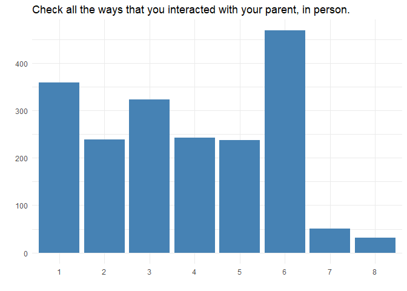<!-- -->


#### Missingness

This question/item was delivered only to 145 out of 183 participants**Missingness Descriptives**

Delivered / Answered = 694 / 692
Missing = 2
Min = 0, Max = 1, Mean = 0.01, SD = 0.12
(Descriptives are rounded to 2 decimals)

Missingness Intraclass Correlation (ICC) = 1.25 


#### Surveys/Questions

This Item appears in these surveys 
<div style="font-weight: bold; color: #2a5caa;"><a href="#Question 1781-anchor">[Question 1781]</a>: Child EMA Survey ID 91</div>
<div style="font-weight: bold; color: #2a5caa;"><a href="#Question 2277-anchor">[Question 2277]</a>: Child End of Day Survey ID 92</div>
<div style="font-weight: bold; color: #2a5caa;"><a href="#Question 1807-anchor">[Question 1807]</a>: Child Morning EMA Survey ID 99</div>
<div style="font-weight: bold; color: #2a5caa;"><a href="#Question 1833-anchor">[Question 1833]</a>: Child Afternoon EMA Survey ID 100</div>
<div style="font-weight: bold; color: #2a5caa;"><a href="#Question 1859-anchor">[Question 1859]</a>: Child Evening EMA Survey ID 101</div>
<div style="font-weight: bold; color: #2a5caa;"><a href="#Question 1885-anchor">[Question 1885]</a>: Proximity Triggered EMA Survey For Child ID 102</div>

#### Screenshot


</div>


</div> <!-- Header section -->

<div class = "header-shading">

#### How close did you feel to your parent? <br>

<div id="Item 1134-anchor" style="font-weight: bold; color: #2a5caa; margin-top: -0.7em; margin-bottom: 1em;">
  [Item 1134]
</div>


</div>


<!-- Body -->


<div class = "anchor">


**Way the question was delivered:** Slider

**Type of data:** numeric

</div> <div class = "anchor">


**Descriptives**
Min = 1, Max = 4, Mean = 3.11, SD = 0.8 


<button 
  onclick="let e = document.getElementById('Item 1134');
           let arrow = document.getElementById('Item 1134_arrow');
           e.style.display = e.style.display === 'none' ? 'block' : 'none';
           arrow.textContent = e.style.display === 'none' ? '▼' : '▲';"
  style="background: none; border: none; padding: 0; font-weight: bold; font-size: 18px; color: #2a5caa; cursor: pointer;">
Click to view visuals <span id="Item 1134_arrow">▼</span>
</button>

<div id="Item 1134" style="display: none;">


<!-- TOC-IGNORE-BEGIN -->

### Descriptives {.tabset}


#### Missingness

**Missingness Descriptives**

Delivered / Answered = 0 / 0
Missing = 0
Min = NA, Max = NA, Mean = NA, SD = NA
(Descriptives are rounded to 2 decimals)

Missingness Intraclass Correlation (ICC) = NA 


#### Surveys/Questions

This Item appears in these surveys 
<div style="font-weight: bold; color: #2a5caa;"><a href="#Question 2025-anchor">[Question 2025]</a>: Child EMA Survey ID 91</div>
<div style="font-weight: bold; color: #2a5caa;"><a href="#Question 2278-anchor">[Question 2278]</a>: Child End of Day Survey ID 92</div>
<div style="font-weight: bold; color: #2a5caa;"><a href="#Question 2069-anchor">[Question 2069]</a>: Child Morning EMA Survey ID 99</div>
<div style="font-weight: bold; color: #2a5caa;"><a href="#Question 2073-anchor">[Question 2073]</a>: Child Afternoon EMA Survey ID 100</div>
<div style="font-weight: bold; color: #2a5caa;"><a href="#Question 2077-anchor">[Question 2077]</a>: Child Evening EMA Survey ID 101</div>
<div style="font-weight: bold; color: #2a5caa;"><a href="#Question 2081-anchor">[Question 2081]</a>: Proximity Triggered EMA Survey For Child ID 102</div>


#### Screenshot


</div>

</div> <!-- Header section -->

<div class = "header-shading">

#### Who else was a part of your most recent interaction with your parent? <br>

<div id="Item 1135-anchor" style="font-weight: bold; color: #2a5caa; margin-top: -0.7em; margin-bottom: 1em;">
  [Item 1135]
</div>


</div>


<!-- Body -->


<div class = "anchor">


**Way the question was delivered:** Multiple Select

**Type of data:** integer

</div> 
<div class = "anchor">


<button 
  onclick="let e = document.getElementById('Item 1135');
           let arrow = document.getElementById('Item 1135_arrow');
           e.style.display = e.style.display === 'none' ? 'block' : 'none';
           arrow.textContent = e.style.display === 'none' ? '▼' : '▲';"
  style="background: none; border: none; padding: 0; font-weight: bold; font-size: 18px; color: #2a5caa; cursor: pointer;">
Click to view visuals <span id="Item 1135_arrow">▼</span>
</button>

<div id="Item 1135" style="display: none;">


<!-- TOC-IGNORE-BEGIN -->

### Descriptives {.tabset}


#### Frequency Table

<table class="table" style="color: black; margin-left: auto; margin-right: auto;">
 <thead>
  <tr>
   <th style="text-align:left;"> Value </th>
   <th style="text-align:left;"> Label </th>
   <th style="text-align:left;"> Counts </th>
   <th style="text-align:left;"> Percentages </th>
  </tr>
 </thead>
<tbody>
  <tr>
   <td style="text-align:left;"> 1 </td>
   <td style="text-align:left;"> Other parent or caregivers </td>
   <td style="text-align:left;color: darkgreen !important;"> N = 288 </td>
   <td style="text-align:left;"> 25.3% </td>
  </tr>
  <tr>
   <td style="text-align:left;"> 2 </td>
   <td style="text-align:left;"> Siblings </td>
   <td style="text-align:left;color: darkgreen !important;"> N = 347 </td>
   <td style="text-align:left;"> 30.5% </td>
  </tr>
  <tr>
   <td style="text-align:left;"> 3 </td>
   <td style="text-align:left;"> Other adults </td>
   <td style="text-align:left;color: darkgreen !important;"> N = 141 </td>
   <td style="text-align:left;"> 12.4% </td>
  </tr>
  <tr>
   <td style="text-align:left;"> 4 </td>
   <td style="text-align:left;"> Other children or teens </td>
   <td style="text-align:left;color: darkgreen !important;"> N = 105 </td>
   <td style="text-align:left;"> 9.2% </td>
  </tr>
  <tr>
   <td style="text-align:left;"> 5 </td>
   <td style="text-align:left;"> Strangers (ex: cashier) </td>
   <td style="text-align:left;color: darkgreen !important;"> N = 39 </td>
   <td style="text-align:left;"> 3.4% </td>
  </tr>
  <tr>
   <td style="text-align:left;"> 6 </td>
   <td style="text-align:left;"> None apply </td>
   <td style="text-align:left;color: darkgreen !important;"> N = 217 </td>
   <td style="text-align:left;"> 19.1% </td>
  </tr>
</tbody>
</table>


#### Barplot

<!-- -->


#### Missingness

**Missingness Descriptives**

Delivered / Answered = 730 / 724
Missing = 6
Min = 0, Max = 2, Mean = 0.04, SD = 0.23
(Descriptives are rounded to 2 decimals)

Missingness Intraclass Correlation (ICC) = 1.19 


#### Surveys/Questions

This Item appears in these surveys 
<div style="font-weight: bold; color: #2a5caa;"><a href="#Question 1783-anchor">[Question 1783]</a>: Child EMA Survey ID 91</div>
<div style="font-weight: bold; color: #2a5caa;"><a href="#Question 2279-anchor">[Question 2279]</a>: Child End of Day Survey ID 92</div>
<div style="font-weight: bold; color: #2a5caa;"><a href="#Question 1809-anchor">[Question 1809]</a>: Child Morning EMA Survey ID 99</div>
<div style="font-weight: bold; color: #2a5caa;"><a href="#Question 1835-anchor">[Question 1835]</a>: Child Afternoon EMA Survey ID 100</div>
<div style="font-weight: bold; color: #2a5caa;"><a href="#Question 1861-anchor">[Question 1861]</a>: Child Evening EMA Survey ID 101</div>
<div style="font-weight: bold; color: #2a5caa;"><a href="#Question 1887-anchor">[Question 1887]</a>: Proximity Triggered EMA Survey For Child ID 102</div>

#### Screenshot


</div>


</div> <!-- Header section -->

<div class = "header-shading">

#### Overall, how helpful was your parent? <br>

<div id="Item 1143-anchor" style="font-weight: bold; color: #2a5caa; margin-top: -0.7em; margin-bottom: 1em;">
  [Item 1143]
</div>


</div>


<!-- Body -->


<div class = "anchor">


**Way the question was delivered:** Slider

**Type of data:** numeric

</div> <div class = "anchor">


**Descriptives**
Min = 0, Max = 100, Mean = 70.65, SD = 23.59 


<button 
  onclick="let e = document.getElementById('Item 1143');
           let arrow = document.getElementById('Item 1143_arrow');
           e.style.display = e.style.display === 'none' ? 'block' : 'none';
           arrow.textContent = e.style.display === 'none' ? '▼' : '▲';"
  style="background: none; border: none; padding: 0; font-weight: bold; font-size: 18px; color: #2a5caa; cursor: pointer;">
Click to view visuals <span id="Item 1143_arrow">▼</span>
</button>

<div id="Item 1143" style="display: none;">


<!-- TOC-IGNORE-BEGIN -->

### Descriptives {.tabset}


#### Missingness

**Missingness Descriptives**

Delivered / Answered = 0 / 0
Missing = 0
Min = NA, Max = NA, Mean = NA, SD = NA
(Descriptives are rounded to 2 decimals)

Missingness Intraclass Correlation (ICC) = NA 


#### Surveys/Questions

This Item appears in these surveys 
<div style="font-weight: bold; color: #2a5caa;"><a href="#Question 2027-anchor">[Question 2027]</a>: Child EMA Survey ID 91</div>
<div style="font-weight: bold; color: #2a5caa;"><a href="#Question 2292-anchor">[Question 2292]</a>: Child End of Day Survey ID 92</div>
<div style="font-weight: bold; color: #2a5caa;"><a href="#Question 2071-anchor">[Question 2071]</a>: Child Morning EMA Survey ID 99</div>
<div style="font-weight: bold; color: #2a5caa;"><a href="#Question 2075-anchor">[Question 2075]</a>: Child Afternoon EMA Survey ID 100</div>
<div style="font-weight: bold; color: #2a5caa;"><a href="#Question 2079-anchor">[Question 2079]</a>: Child Evening EMA Survey ID 101</div>
<div style="font-weight: bold; color: #2a5caa;"><a href="#Question 2083-anchor">[Question 2083]</a>: Proximity Triggered EMA Survey For Child ID 102</div>


#### Screenshot


</div>

</div> <!-- Header section -->

<div class = "header-shading">

#### How much did you want your parent to... <br>

<div id="Item 1144-anchor" style="font-weight: bold; color: #2a5caa; margin-top: -0.7em; margin-bottom: 1em;">
  [Item 1144]
</div>


</div>


<!-- Body -->


<div class = "anchor">


**Way the question was delivered:** Informational Fullscreen

**Type of data:** NA

</div> <div class = "anchor">


</div> <!-- Header section -->

<div class = "header-shading">

#### Please think about the most stressful event, situation or experience you faced today. <br>

<div id="Item 1154-anchor" style="font-weight: bold; color: #2a5caa; margin-top: -0.7em; margin-bottom: 1em;">
  [Item 1154]
</div>


</div>


<!-- Body -->


<div class = "anchor">


**Way the question was delivered:** Informational Fullscreen

**Type of data:** NA

</div> <div class = "anchor">


</div> <!-- Header section -->

<div class = "header-shading">

#### Who did you want to talk to? <br>

<div id="Item 1156-anchor" style="font-weight: bold; color: #2a5caa; margin-top: -0.7em; margin-bottom: 1em;">
  [Item 1156]
</div>


</div>


<!-- Body -->


<div class = "anchor">


**Way the question was delivered:** Multiple Select

**Type of data:** integer

</div> 
<div class = "anchor">

<div style='font-size:16px; line-height:1.5; margin: 1em 0; padding: 0.5em 1em; border-left: 4px solid #2a5caa; background-color: #f9faff; color: #333;'><strong>Note:</strong> This question is only delivered if participant answered question <em>Item 4473</em>: <em>After experiencing this situation, I felt like I needed to talk to someone about it.</em>.</div>


<button 
  onclick="let e = document.getElementById('Item 1156');
           let arrow = document.getElementById('Item 1156_arrow');
           e.style.display = e.style.display === 'none' ? 'block' : 'none';
           arrow.textContent = e.style.display === 'none' ? '▼' : '▲';"
  style="background: none; border: none; padding: 0; font-weight: bold; font-size: 18px; color: #2a5caa; cursor: pointer;">
Click to view visuals <span id="Item 1156_arrow">▼</span>
</button>

<div id="Item 1156" style="display: none;">


<!-- TOC-IGNORE-BEGIN -->

### Descriptives {.tabset}


#### Frequency Table

<table class="table" style="color: black; margin-left: auto; margin-right: auto;">
 <thead>
  <tr>
   <th style="text-align:left;"> Value </th>
   <th style="text-align:left;"> Label </th>
   <th style="text-align:left;"> Counts </th>
   <th style="text-align:left;"> Percentages </th>
  </tr>
 </thead>
<tbody>
  <tr>
   <td style="text-align:left;"> 1 </td>
   <td style="text-align:left;"> Siblings </td>
   <td style="text-align:left;color: darkgreen !important;"> N = 26 </td>
   <td style="text-align:left;"> 8.2% </td>
  </tr>
  <tr>
   <td style="text-align:left;"> 2 </td>
   <td style="text-align:left;"> Parents or caregivers </td>
   <td style="text-align:left;color: darkgreen !important;"> N = 117 </td>
   <td style="text-align:left;"> 36.9% </td>
  </tr>
  <tr>
   <td style="text-align:left;"> 3 </td>
   <td style="text-align:left;"> Other family members </td>
   <td style="text-align:left;color: darkgreen !important;"> N = 20 </td>
   <td style="text-align:left;"> 6.3% </td>
  </tr>
  <tr>
   <td style="text-align:left;"> 4 </td>
   <td style="text-align:left;"> Friends </td>
   <td style="text-align:left;color: darkgreen !important;"> N = 94 </td>
   <td style="text-align:left;"> 29.7% </td>
  </tr>
  <tr>
   <td style="text-align:left;"> 5 </td>
   <td style="text-align:left;"> Online friends </td>
   <td style="text-align:left;color: darkgreen !important;"> N = 13 </td>
   <td style="text-align:left;"> 4.1% </td>
  </tr>
  <tr>
   <td style="text-align:left;"> 6 </td>
   <td style="text-align:left;"> Teachers, coaches or other adults </td>
   <td style="text-align:left;color: darkgreen !important;"> N = 22 </td>
   <td style="text-align:left;"> 6.9% </td>
  </tr>
  <tr>
   <td style="text-align:left;"> 7 </td>
   <td style="text-align:left;"> None apply </td>
   <td style="text-align:left;color: darkgreen !important;"> N = 25 </td>
   <td style="text-align:left;"> 7.9% </td>
  </tr>
</tbody>
</table>


#### Barplot

<!-- -->


#### Missingness

This question/item was delivered only to 85 out of 183 participants**Missingness Descriptives**

Delivered / Answered = 214 / 214
Missing = 0
Min = 0, Max = 0, Mean = 0, SD = 0
(Descriptives are rounded to 2 decimals)

Missingness Intraclass Correlation (ICC) = NaN 


#### Surveys/Questions

This Item appears in these surveys 
<div style="font-weight: bold; color: #2a5caa;"><a href="#Question 2295-anchor">[Question 2295]</a>: Child End of Day Survey ID 92</div>

#### Screenshot


</div>


</div> <!-- Header section -->

<div class = "header-shading">

#### End Block <br>

<div id="Item 1199-anchor" style="font-weight: bold; color: #2a5caa; margin-top: -0.7em; margin-bottom: 1em;">
  [Item 1199]
</div>


</div>


<!-- Body -->


<div class = "anchor">


**Way the question was delivered:** End Block

**Type of data:** NA

</div>  <!-- Header section -->

<div class = "header-shading">

#### Check all that happened to you today: <br>

<div id="Item 1220-anchor" style="font-weight: bold; color: #2a5caa; margin-top: -0.7em; margin-bottom: 1em;">
  [Item 1220]
</div>


</div>


<!-- Body -->


<div class = "anchor">


**Way the question was delivered:** Multiple Select

**Type of data:** integer

</div> 
<div class = "anchor">


<button 
  onclick="let e = document.getElementById('Item 1220');
           let arrow = document.getElementById('Item 1220_arrow');
           e.style.display = e.style.display === 'none' ? 'block' : 'none';
           arrow.textContent = e.style.display === 'none' ? '▼' : '▲';"
  style="background: none; border: none; padding: 0; font-weight: bold; font-size: 18px; color: #2a5caa; cursor: pointer;">
Click to view visuals <span id="Item 1220_arrow">▼</span>
</button>

<div id="Item 1220" style="display: none;">


<!-- TOC-IGNORE-BEGIN -->

### Descriptives {.tabset}


#### Frequency Table

<table class="table" style="color: black; margin-left: auto; margin-right: auto;">
 <thead>
  <tr>
   <th style="text-align:left;"> Value </th>
   <th style="text-align:left;"> Label </th>
   <th style="text-align:left;"> Counts </th>
   <th style="text-align:left;"> Percentages </th>
  </tr>
 </thead>
<tbody>
  <tr>
   <td style="text-align:left;"> 1 </td>
   <td style="text-align:left;"> I felt that my friends didn’t want to be around me today. </td>
   <td style="text-align:left;color: darkgreen !important;"> N = 81 </td>
   <td style="text-align:left;"> 6.2% </td>
  </tr>
  <tr>
   <td style="text-align:left;"> 2 </td>
   <td style="text-align:left;"> Another kid teased me today. </td>
   <td style="text-align:left;color: darkgreen !important;"> N = 29 </td>
   <td style="text-align:left;"> 2.2% </td>
  </tr>
  <tr>
   <td style="text-align:left;"> 3 </td>
   <td style="text-align:left;"> I felt that my friends were talking about me behind my back today. </td>
   <td style="text-align:left;color: darkgreen !important;"> N = 41 </td>
   <td style="text-align:left;"> 3.1% </td>
  </tr>
  <tr>
   <td style="text-align:left;"> 4 </td>
   <td style="text-align:left;"> I got into a fight with another kid today. </td>
   <td style="text-align:left;color: darkgreen !important;"> N = 14 </td>
   <td style="text-align:left;"> 1.1% </td>
  </tr>
  <tr>
   <td style="text-align:left;"> 5 </td>
   <td style="text-align:left;"> One of my friends was mad at me today. </td>
   <td style="text-align:left;color: darkgreen !important;"> N = 52 </td>
   <td style="text-align:left;"> 4% </td>
  </tr>
  <tr>
   <td style="text-align:left;"> 6 </td>
   <td style="text-align:left;"> None apply </td>
   <td style="text-align:left;color: darkgreen !important;"> N = 1090 </td>
   <td style="text-align:left;"> 83.4% </td>
  </tr>
</tbody>
</table>


#### Barplot

<!-- -->


#### Missingness

**Missingness Descriptives**

Delivered / Answered = 1250 / 1246
Missing = 4
Min = 0, Max = 2, Mean = 0.03, SD = 0.2
(Descriptives are rounded to 2 decimals)

Missingness Intraclass Correlation (ICC) = 1.09 


#### Surveys/Questions

This Item appears in these surveys 
<div style="font-weight: bold; color: #2a5caa;"><a href="#Question 2051-anchor">[Question 2051]</a>: Child End of Day Survey ID 92</div>

#### Screenshot


</div>


</div> <!-- Header section -->

<div class = "header-shading">

#### Please tell us about your day overall. <br>

<div id="Item 1358-anchor" style="font-weight: bold; color: #2a5caa; margin-top: -0.7em; margin-bottom: 1em;">
  [Item 1358]
</div>


</div>


<!-- Body -->


<div class = "anchor">


**Way the question was delivered:** Informational Fullscreen

**Type of data:** NA

</div> <div class = "anchor">


</div> <!-- Header section -->

<div class = "header-shading">

#### No Text <br>

<div id="Item 1364-anchor" style="font-weight: bold; color: #2a5caa; margin-top: -0.7em; margin-bottom: 1em;">
  [Item 1364]
</div>


</div>


<!-- Body -->


<div class = "anchor">


**Way the question was delivered:** End Block

**Type of data:** NA

</div>  <!-- Header section -->

<div class = "header-shading">

#### Since your last survey, did you experience any stressful events at home, school or elsewhere? <br>

<div id="Item 4463-anchor" style="font-weight: bold; color: #2a5caa; margin-top: -0.7em; margin-bottom: 1em;">
  [Item 4463]
</div>


</div>


<!-- Body -->


<div class = "anchor">


**Way the question was delivered:** Multiple Choice

**Type of data:** integer

</div> 
<div class = "anchor">


<button 
  onclick="let e = document.getElementById('Item 4463');
           let arrow = document.getElementById('Item 4463_arrow');
           e.style.display = e.style.display === 'none' ? 'block' : 'none';
           arrow.textContent = e.style.display === 'none' ? '▼' : '▲';"
  style="background: none; border: none; padding: 0; font-weight: bold; font-size: 18px; color: #2a5caa; cursor: pointer;">
Click to view visuals <span id="Item 4463_arrow">▼</span>
</button>

<div id="Item 4463" style="display: none;">


<!-- TOC-IGNORE-BEGIN -->

### Descriptives {.tabset}


#### Frequency Table

<table class="table" style="color: black; margin-left: auto; margin-right: auto;">
 <thead>
  <tr>
   <th style="text-align:left;"> Value </th>
   <th style="text-align:left;"> Label </th>
   <th style="text-align:left;"> Counts </th>
   <th style="text-align:left;"> Percentages </th>
  </tr>
 </thead>
<tbody>
  <tr>
   <td style="text-align:left;"> 1 </td>
   <td style="text-align:left;"> Yes </td>
   <td style="text-align:left;color: darkgreen !important;"> N = 576 </td>
   <td style="text-align:left;"> 9.8% </td>
  </tr>
  <tr>
   <td style="text-align:left;"> 2 </td>
   <td style="text-align:left;"> No </td>
   <td style="text-align:left;color: darkgreen !important;"> N = 5326 </td>
   <td style="text-align:left;"> 90.2% </td>
  </tr>
</tbody>
</table>


#### Barplot

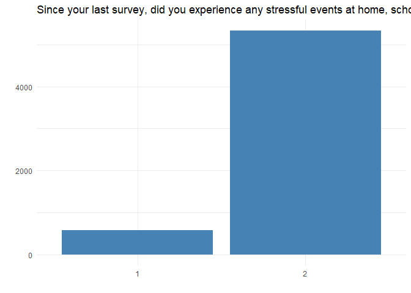<!-- -->


#### Missingness

**Missingness Descriptives**

Delivered / Answered = 5909 / 5902
Missing = 7
Min = 0, Max = 2, Mean = 0.05, SD = 0.24
(Descriptives are rounded to 2 decimals)

Missingness Intraclass Correlation (ICC) = 1.02 


#### Surveys/Questions

This Item appears in these surveys 
<div style="font-weight: bold; color: #2a5caa;"><a href="#Question 4086-anchor">[Question 4086]</a>: Child EMA Survey ID 91</div>
<div style="font-weight: bold; color: #2a5caa;"><a href="#Question 4097-anchor">[Question 4097]</a>: Child End of Day Survey ID 92</div>
<div style="font-weight: bold; color: #2a5caa;"><a href="#Question 4115-anchor">[Question 4115]</a>: Child Morning EMA Survey ID 99</div>
<div style="font-weight: bold; color: #2a5caa;"><a href="#Question 4126-anchor">[Question 4126]</a>: Child Afternoon EMA Survey ID 100</div>
<div style="font-weight: bold; color: #2a5caa;"><a href="#Question 4137-anchor">[Question 4137]</a>: Child Evening EMA Survey ID 101</div>
<div style="font-weight: bold; color: #2a5caa;"><a href="#Question 4148-anchor">[Question 4148]</a>: Proximity Triggered EMA Survey For Child ID 102</div>


#### Screenshot


</div>


</div> <!-- Header section -->

<div class = "header-shading">

#### Since your last survey, did you see or communicate with your parent? <br>

<div id="Item 4464-anchor" style="font-weight: bold; color: #2a5caa; margin-top: -0.7em; margin-bottom: 1em;">
  [Item 4464]
</div>


</div>


<!-- Body -->


<div class = "anchor">


**Way the question was delivered:** Multiple Choice

**Type of data:** integer

</div> 
<div class = "anchor">


<button 
  onclick="let e = document.getElementById('Item 4464');
           let arrow = document.getElementById('Item 4464_arrow');
           e.style.display = e.style.display === 'none' ? 'block' : 'none';
           arrow.textContent = e.style.display === 'none' ? '▼' : '▲';"
  style="background: none; border: none; padding: 0; font-weight: bold; font-size: 18px; color: #2a5caa; cursor: pointer;">
Click to view visuals <span id="Item 4464_arrow">▼</span>
</button>

<div id="Item 4464" style="display: none;">


<!-- TOC-IGNORE-BEGIN -->

### Descriptives {.tabset}


#### Frequency Table

<table class="table" style="color: black; margin-left: auto; margin-right: auto;">
 <thead>
  <tr>
   <th style="text-align:left;"> Value </th>
   <th style="text-align:left;"> Label </th>
   <th style="text-align:left;"> Counts </th>
   <th style="text-align:left;"> Percentages </th>
  </tr>
 </thead>
<tbody>
  <tr>
   <td style="text-align:left;"> 1 </td>
   <td style="text-align:left;"> Yes </td>
   <td style="text-align:left;color: darkgreen !important;"> N = 3838 </td>
   <td style="text-align:left;"> 65.2% </td>
  </tr>
  <tr>
   <td style="text-align:left;"> 2 </td>
   <td style="text-align:left;"> No </td>
   <td style="text-align:left;color: darkgreen !important;"> N = 2049 </td>
   <td style="text-align:left;"> 34.8% </td>
  </tr>
</tbody>
</table>


#### Barplot

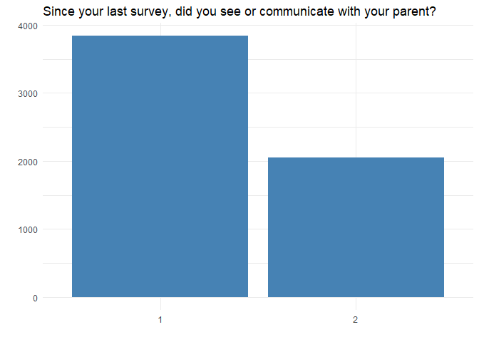<!-- -->


#### Missingness

**Missingness Descriptives**

Delivered / Answered = 5897 / 5887
Missing = 10
Min = 0, Max = 2, Mean = 0.06, SD = 0.29
(Descriptives are rounded to 2 decimals)

Missingness Intraclass Correlation (ICC) = 1.02 


#### Surveys/Questions

This Item appears in these surveys 
<div style="font-weight: bold; color: #2a5caa;"><a href="#Question 4087-anchor">[Question 4087]</a>: Child EMA Survey ID 91</div>
<div style="font-weight: bold; color: #2a5caa;"><a href="#Question 4098-anchor">[Question 4098]</a>: Child End of Day Survey ID 92</div>
<div style="font-weight: bold; color: #2a5caa;"><a href="#Question 4116-anchor">[Question 4116]</a>: Child Morning EMA Survey ID 99</div>
<div style="font-weight: bold; color: #2a5caa;"><a href="#Question 4127-anchor">[Question 4127]</a>: Child Afternoon EMA Survey ID 100</div>
<div style="font-weight: bold; color: #2a5caa;"><a href="#Question 4138-anchor">[Question 4138]</a>: Child Evening EMA Survey ID 101</div>
<div style="font-weight: bold; color: #2a5caa;"><a href="#Question 4149-anchor">[Question 4149]</a>: Proximity Triggered EMA Survey For Child ID 102</div>


#### Screenshot


</div>


</div> <!-- Header section -->

<div class = "header-shading">

#### Check all the ways that you interacted with parents. <br>

<div id="Item 4465-anchor" style="font-weight: bold; color: #2a5caa; margin-top: -0.7em; margin-bottom: 1em;">
  [Item 4465]
</div>


</div>


<!-- Body -->


<div class = "anchor">


**Way the question was delivered:** Multiple Select

**Type of data:** integer

</div> 
<div class = "anchor">


<button 
  onclick="let e = document.getElementById('Item 4465');
           let arrow = document.getElementById('Item 4465_arrow');
           e.style.display = e.style.display === 'none' ? 'block' : 'none';
           arrow.textContent = e.style.display === 'none' ? '▼' : '▲';"
  style="background: none; border: none; padding: 0; font-weight: bold; font-size: 18px; color: #2a5caa; cursor: pointer;">
Click to view visuals <span id="Item 4465_arrow">▼</span>
</button>

<div id="Item 4465" style="display: none;">


<!-- TOC-IGNORE-BEGIN -->

### Descriptives {.tabset}


#### Frequency Table

<table class="table" style="color: black; margin-left: auto; margin-right: auto;">
 <thead>
  <tr>
   <th style="text-align:left;"> Value </th>
   <th style="text-align:left;"> Label </th>
   <th style="text-align:left;"> Counts </th>
   <th style="text-align:left;"> Percentages </th>
  </tr>
 </thead>
<tbody>
  <tr>
   <td style="text-align:left;"> 1 </td>
   <td style="text-align:left;"> in person </td>
   <td style="text-align:left;color: darkgreen !important;"> N = 666 </td>
   <td style="text-align:left;"> 61.2% </td>
  </tr>
  <tr>
   <td style="text-align:left;"> 2 </td>
   <td style="text-align:left;"> text </td>
   <td style="text-align:left;color: darkgreen !important;"> N = 247 </td>
   <td style="text-align:left;"> 22.7% </td>
  </tr>
  <tr>
   <td style="text-align:left;"> 3 </td>
   <td style="text-align:left;"> Phone call </td>
   <td style="text-align:left;color: darkgreen !important;"> N = 122 </td>
   <td style="text-align:left;"> 11.2% </td>
  </tr>
  <tr>
   <td style="text-align:left;"> 4 </td>
   <td style="text-align:left;"> video chat </td>
   <td style="text-align:left;color: darkgreen !important;"> N = 26 </td>
   <td style="text-align:left;"> 2.4% </td>
  </tr>
  <tr>
   <td style="text-align:left;"> 5 </td>
   <td style="text-align:left;"> Other </td>
   <td style="text-align:left;color: darkgreen !important;"> N = 28 </td>
   <td style="text-align:left;"> 2.6% </td>
  </tr>
</tbody>
</table>


#### Barplot

<!-- -->


#### Missingness

**Missingness Descriptives**

Delivered / Answered = 705 / 703
Missing = 2
Min = 0, Max = 2, Mean = 0.01, SD = 0.17
(Descriptives are rounded to 2 decimals)

Missingness Intraclass Correlation (ICC) = 1.11 


#### Surveys/Questions

This Item appears in these surveys 
<div style="font-weight: bold; color: #2a5caa;"><a href="#Question 4088-anchor">[Question 4088]</a>: Child EMA Survey ID 91</div>
<div style="font-weight: bold; color: #2a5caa;"><a href="#Question 4099-anchor">[Question 4099]</a>: Child End of Day Survey ID 92</div>
<div style="font-weight: bold; color: #2a5caa;"><a href="#Question 4117-anchor">[Question 4117]</a>: Child Morning EMA Survey ID 99</div>
<div style="font-weight: bold; color: #2a5caa;"><a href="#Question 4128-anchor">[Question 4128]</a>: Child Afternoon EMA Survey ID 100</div>
<div style="font-weight: bold; color: #2a5caa;"><a href="#Question 4139-anchor">[Question 4139]</a>: Child Evening EMA Survey ID 101</div>
<div style="font-weight: bold; color: #2a5caa;"><a href="#Question 4150-anchor">[Question 4150]</a>: Proximity Triggered EMA Survey For Child ID 102</div>

#### Screenshot


</div>


</div> <!-- Header section -->

<div class = "header-shading">

#### After experiencing this situation, I felt like I needed to talk to someone about it. <br>

<div id="Item 4473-anchor" style="font-weight: bold; color: #2a5caa; margin-top: -0.7em; margin-bottom: 1em;">
  [Item 4473]
</div>


</div>


<!-- Body -->


<div class = "anchor">


**Way the question was delivered:** Multiple Choice

**Type of data:** integer

</div> 
<div class = "anchor">


<button 
  onclick="let e = document.getElementById('Item 4473');
           let arrow = document.getElementById('Item 4473_arrow');
           e.style.display = e.style.display === 'none' ? 'block' : 'none';
           arrow.textContent = e.style.display === 'none' ? '▼' : '▲';"
  style="background: none; border: none; padding: 0; font-weight: bold; font-size: 18px; color: #2a5caa; cursor: pointer;">
Click to view visuals <span id="Item 4473_arrow">▼</span>
</button>

<div id="Item 4473" style="display: none;">


<!-- TOC-IGNORE-BEGIN -->

### Descriptives {.tabset}


#### Frequency Table

<table class="table" style="color: black; margin-left: auto; margin-right: auto;">
 <thead>
  <tr>
   <th style="text-align:left;"> Value </th>
   <th style="text-align:left;"> Label </th>
   <th style="text-align:left;"> Counts </th>
   <th style="text-align:left;"> Percentages </th>
  </tr>
 </thead>
<tbody>
  <tr>
   <td style="text-align:left;"> 1 </td>
   <td style="text-align:left;"> Yes </td>
   <td style="text-align:left;color: darkgreen !important;"> N = 178 </td>
   <td style="text-align:left;"> 14.8% </td>
  </tr>
  <tr>
   <td style="text-align:left;"> 2 </td>
   <td style="text-align:left;"> No </td>
   <td style="text-align:left;color: darkgreen !important;"> N = 1021 </td>
   <td style="text-align:left;"> 85.2% </td>
  </tr>
</tbody>
</table>


#### Barplot

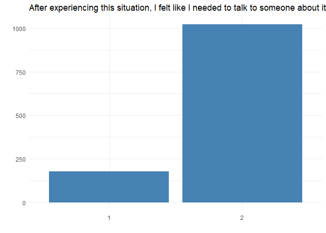<!-- -->


#### Missingness

**Missingness Descriptives**

Delivered / Answered = 1211 / 1199
Missing = 12
Min = 0, Max = 8, Mean = 0.09, SD = 0.72
(Descriptives are rounded to 2 decimals)

Missingness Intraclass Correlation (ICC) = 1.02 


#### Surveys/Questions

This Item appears in these surveys 
<div style="font-weight: bold; color: #2a5caa;"><a href="#Question 4113-anchor">[Question 4113]</a>: Child End of Day Survey ID 92</div>


#### Screenshot


</div>


</div> <!-- Header section -->

<div class = "header-shading">

#### End Block <br>

<div id="Item 4474-anchor" style="font-weight: bold; color: #2a5caa; margin-top: -0.7em; margin-bottom: 1em;">
  [Item 4474]
</div>


</div>


<!-- Body -->


<div class = "anchor">


**Way the question was delivered:** End Block

**Type of data:** NA

</div>  <!-- Header section -->

<div class = "header-shading">

#### Did you ask your parent to <br>

<div id="Item 5525-anchor" style="font-weight: bold; color: #2a5caa; margin-top: -0.7em; margin-bottom: 1em;">
  [Item 5525]
</div>


</div>


<!-- Body -->


<div class = "anchor">


**Way the question was delivered:** Multiple Select

**Type of data:** integer

</div> 
<div class = "anchor">


<button 
  onclick="let e = document.getElementById('Item 5525');
           let arrow = document.getElementById('Item 5525_arrow');
           e.style.display = e.style.display === 'none' ? 'block' : 'none';
           arrow.textContent = e.style.display === 'none' ? '▼' : '▲';"
  style="background: none; border: none; padding: 0; font-weight: bold; font-size: 18px; color: #2a5caa; cursor: pointer;">
Click to view visuals <span id="Item 5525_arrow">▼</span>
</button>

<div id="Item 5525" style="display: none;">


<!-- TOC-IGNORE-BEGIN -->

### Descriptives {.tabset}


#### Frequency Table

<table class="table" style="color: black; margin-left: auto; margin-right: auto;">
 <thead>
  <tr>
   <th style="text-align:left;"> Value </th>
   <th style="text-align:left;"> Label </th>
   <th style="text-align:left;"> Counts </th>
   <th style="text-align:left;"> Percentages </th>
  </tr>
 </thead>
<tbody>
  <tr>
   <td style="text-align:left;"> 1 </td>
   <td style="text-align:left;"> Give you emotional support </td>
   <td style="text-align:left;color: darkgreen !important;"> N = 51 </td>
   <td style="text-align:left;"> 5.3% </td>
  </tr>
  <tr>
   <td style="text-align:left;"> 2 </td>
   <td style="text-align:left;"> Listen to you when you speak </td>
   <td style="text-align:left;color: darkgreen !important;"> N = 75 </td>
   <td style="text-align:left;"> 7.8% </td>
  </tr>
  <tr>
   <td style="text-align:left;"> 3 </td>
   <td style="text-align:left;"> Show that she understands or tell you about a similar situation </td>
   <td style="text-align:left;color: darkgreen !important;"> N = 57 </td>
   <td style="text-align:left;"> 5.9% </td>
  </tr>
  <tr>
   <td style="text-align:left;"> 4 </td>
   <td style="text-align:left;"> Give you information and ideas about how to make things better </td>
   <td style="text-align:left;color: darkgreen !important;"> N = 70 </td>
   <td style="text-align:left;"> 7.2% </td>
  </tr>
  <tr>
   <td style="text-align:left;"> 5 </td>
   <td style="text-align:left;"> Give you advice about what to do </td>
   <td style="text-align:left;color: darkgreen !important;"> N = 90 </td>
   <td style="text-align:left;"> 9.3% </td>
  </tr>
  <tr>
   <td style="text-align:left;"> 6 </td>
   <td style="text-align:left;"> Think about the situation with you and tell you what you can do about it </td>
   <td style="text-align:left;color: darkgreen !important;"> N = 69 </td>
   <td style="text-align:left;"> 7.1% </td>
  </tr>
  <tr>
   <td style="text-align:left;"> 7 </td>
   <td style="text-align:left;"> Do something to help you </td>
   <td style="text-align:left;color: darkgreen !important;"> N = 153 </td>
   <td style="text-align:left;"> 15.8% </td>
  </tr>
  <tr>
   <td style="text-align:left;"> 8 </td>
   <td style="text-align:left;"> Offer to do something to help you </td>
   <td style="text-align:left;color: darkgreen !important;"> N = 72 </td>
   <td style="text-align:left;"> 7.5% </td>
  </tr>
  <tr>
   <td style="text-align:left;"> 9 </td>
   <td style="text-align:left;"> None apply </td>
   <td style="text-align:left;color: darkgreen !important;"> N = 329 </td>
   <td style="text-align:left;"> 34.1% </td>
  </tr>
</tbody>
</table>


#### Barplot

<!-- -->


#### Missingness

**Missingness Descriptives**

Delivered / Answered = 583 / 579
Missing = 4
Min = 0, Max = 1, Mean = 0.03, SD = 0.18
(Descriptives are rounded to 2 decimals)

Missingness Intraclass Correlation (ICC) = 1.27 


#### Surveys/Questions

This Item appears in these surveys 
<div style="font-weight: bold; color: #2a5caa;"><a href="#Question 5633-anchor">[Question 5633]</a>: Child EMA Survey ID 91</div>
<div style="font-weight: bold; color: #2a5caa;"><a href="#Question 5647-anchor">[Question 5647]</a>: Child End of Day Survey ID 92</div>
<div style="font-weight: bold; color: #2a5caa;"><a href="#Question 5662-anchor">[Question 5662]</a>: Child Morning EMA Survey ID 99</div>
<div style="font-weight: bold; color: #2a5caa;"><a href="#Question 5676-anchor">[Question 5676]</a>: Child Afternoon EMA Survey ID 100</div>
<div style="font-weight: bold; color: #2a5caa;"><a href="#Question 5690-anchor">[Question 5690]</a>: Child Evening EMA Survey ID 101</div>
<div style="font-weight: bold; color: #2a5caa;"><a href="#Question 5704-anchor">[Question 5704]</a>: Proximity Triggered EMA Survey For Child ID 102</div>

#### Screenshot


</div>


</div> <!-- Header section -->

<div class = "header-shading">

#### Please describe how you asked (ex: directly asking is when you use your words to say what you would like your parents to do; indirectly asking is when you hint at something and hope your parent understands) <br>

<div id="Item 5526-anchor" style="font-weight: bold; color: #2a5caa; margin-top: -0.7em; margin-bottom: 1em;">
  [Item 5526]
</div>


</div>


<!-- Body -->


<div class = "anchor">


**Way the question was delivered:** Slider

**Type of data:** numeric

</div> <div class = "anchor">


<div style='font-size:16px; line-height:1.5; margin: 1em 0; padding: 0.5em 1em; border-left: 4px solid #2a5caa; background-color: #f9faff; color: #333;'><strong>Note:</strong> This question is only delivered if participant answered question <em>Item 5525</em>: <em>Did you ask your parent to</em>.</div>


**Descriptives**
Min = 0, Max = 100, Mean = 71.47, SD = 25.06 


<button 
  onclick="let e = document.getElementById('Item 5526');
           let arrow = document.getElementById('Item 5526_arrow');
           e.style.display = e.style.display === 'none' ? 'block' : 'none';
           arrow.textContent = e.style.display === 'none' ? '▼' : '▲';"
  style="background: none; border: none; padding: 0; font-weight: bold; font-size: 18px; color: #2a5caa; cursor: pointer;">
Click to view visuals <span id="Item 5526_arrow">▼</span>
</button>

<div id="Item 5526" style="display: none;">


<!-- TOC-IGNORE-BEGIN -->

### Descriptives {.tabset}


#### Missingness

This question/item was delivered only to 0 out of 183 participants**Missingness Descriptives**

Delivered / Answered = 0 / 0
Missing = 0
Min = NA, Max = NA, Mean = NA, SD = NA
(Descriptives are rounded to 2 decimals)

Missingness Intraclass Correlation (ICC) = NA 


#### Surveys/Questions

This Item appears in these surveys 
<div style="font-weight: bold; color: #2a5caa;"><a href="#Question 5634-anchor">[Question 5634]</a>: Child EMA Survey ID 91</div>
<div style="font-weight: bold; color: #2a5caa;"><a href="#Question 5648-anchor">[Question 5648]</a>: Child End of Day Survey ID 92</div>
<div style="font-weight: bold; color: #2a5caa;"><a href="#Question 5663-anchor">[Question 5663]</a>: Child Morning EMA Survey ID 99</div>
<div style="font-weight: bold; color: #2a5caa;"><a href="#Question 5677-anchor">[Question 5677]</a>: Child Afternoon EMA Survey ID 100</div>
<div style="font-weight: bold; color: #2a5caa;"><a href="#Question 5691-anchor">[Question 5691]</a>: Child Evening EMA Survey ID 101</div>
<div style="font-weight: bold; color: #2a5caa;"><a href="#Question 5705-anchor">[Question 5705]</a>: Proximity Triggered EMA Survey For Child ID 102</div>


#### Screenshot


</div>

</div> <!-- Header section -->

<div class = "header-shading">

#### Check all that she did: <br>

<div id="Item 5527-anchor" style="font-weight: bold; color: #2a5caa; margin-top: -0.7em; margin-bottom: 1em;">
  [Item 5527]
</div>


</div>


<!-- Body -->


<div class = "anchor">


**Way the question was delivered:** Multiple Select

**Type of data:** integer

</div> 
<div class = "anchor">


<button 
  onclick="let e = document.getElementById('Item 5527');
           let arrow = document.getElementById('Item 5527_arrow');
           e.style.display = e.style.display === 'none' ? 'block' : 'none';
           arrow.textContent = e.style.display === 'none' ? '▼' : '▲';"
  style="background: none; border: none; padding: 0; font-weight: bold; font-size: 18px; color: #2a5caa; cursor: pointer;">
Click to view visuals <span id="Item 5527_arrow">▼</span>
</button>

<div id="Item 5527" style="display: none;">


<!-- TOC-IGNORE-BEGIN -->

### Descriptives {.tabset}


#### Frequency Table

<table class="table" style="color: black; margin-left: auto; margin-right: auto;">
 <thead>
  <tr>
   <th style="text-align:left;"> Value </th>
   <th style="text-align:left;"> Label </th>
   <th style="text-align:left;"> Counts </th>
   <th style="text-align:left;"> Percentages </th>
  </tr>
 </thead>
<tbody>
  <tr>
   <td style="text-align:left;"> 1 </td>
   <td style="text-align:left;"> Give you emotional support </td>
   <td style="text-align:left;color: darkgreen !important;"> N = 106 </td>
   <td style="text-align:left;"> 7.7% </td>
  </tr>
  <tr>
   <td style="text-align:left;"> 2 </td>
   <td style="text-align:left;"> Listen to you when you speak </td>
   <td style="text-align:left;color: darkgreen !important;"> N = 279 </td>
   <td style="text-align:left;"> 20.2% </td>
  </tr>
  <tr>
   <td style="text-align:left;"> 3 </td>
   <td style="text-align:left;"> Show that she understands or tell you about a similar situation </td>
   <td style="text-align:left;color: darkgreen !important;"> N = 138 </td>
   <td style="text-align:left;"> 10% </td>
  </tr>
  <tr>
   <td style="text-align:left;"> 4 </td>
   <td style="text-align:left;"> Give you information and ideas about how to make things better </td>
   <td style="text-align:left;color: darkgreen !important;"> N = 112 </td>
   <td style="text-align:left;"> 8.1% </td>
  </tr>
  <tr>
   <td style="text-align:left;"> 5 </td>
   <td style="text-align:left;"> Give you advice about what to do </td>
   <td style="text-align:left;color: darkgreen !important;"> N = 130 </td>
   <td style="text-align:left;"> 9.4% </td>
  </tr>
  <tr>
   <td style="text-align:left;"> 6 </td>
   <td style="text-align:left;"> Think about the situation with you and tell you what you can do about it </td>
   <td style="text-align:left;color: darkgreen !important;"> N = 96 </td>
   <td style="text-align:left;"> 7% </td>
  </tr>
  <tr>
   <td style="text-align:left;"> 7 </td>
   <td style="text-align:left;"> Do something to help you </td>
   <td style="text-align:left;color: darkgreen !important;"> N = 201 </td>
   <td style="text-align:left;"> 14.6% </td>
  </tr>
  <tr>
   <td style="text-align:left;"> 8 </td>
   <td style="text-align:left;"> Offer to do something to help you </td>
   <td style="text-align:left;color: darkgreen !important;"> N = 139 </td>
   <td style="text-align:left;"> 10.1% </td>
  </tr>
  <tr>
   <td style="text-align:left;"> 9 </td>
   <td style="text-align:left;"> None apply </td>
   <td style="text-align:left;color: darkgreen !important;"> N = 177 </td>
   <td style="text-align:left;"> 12.8% </td>
  </tr>
</tbody>
</table>


#### Barplot

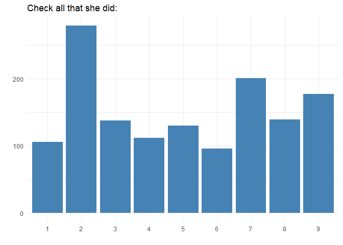<!-- -->


#### Missingness

**Missingness Descriptives**

Delivered / Answered = 582 / 578
Missing = 4
Min = 0, Max = 1, Mean = 0.03, SD = 0.18
(Descriptives are rounded to 2 decimals)

Missingness Intraclass Correlation (ICC) = 1.27 


#### Surveys/Questions

This Item appears in these surveys 
<div style="font-weight: bold; color: #2a5caa;"><a href="#Question 5635-anchor">[Question 5635]</a>: Child EMA Survey ID 91</div>
<div style="font-weight: bold; color: #2a5caa;"><a href="#Question 5649-anchor">[Question 5649]</a>: Child End of Day Survey ID 92</div>
<div style="font-weight: bold; color: #2a5caa;"><a href="#Question 5664-anchor">[Question 5664]</a>: Child Morning EMA Survey ID 99</div>
<div style="font-weight: bold; color: #2a5caa;"><a href="#Question 5678-anchor">[Question 5678]</a>: Child Afternoon EMA Survey ID 100</div>
<div style="font-weight: bold; color: #2a5caa;"><a href="#Question 5692-anchor">[Question 5692]</a>: Child Evening EMA Survey ID 101</div>
<div style="font-weight: bold; color: #2a5caa;"><a href="#Question 5706-anchor">[Question 5706]</a>: Proximity Triggered EMA Survey For Child ID 102</div>

#### Screenshot


</div>


</div> <!-- Header section -->

<div class = "header-shading">

#### Please tell us about the interaction you had with your mom: <br>

<div id="Item 5528-anchor" style="font-weight: bold; color: #2a5caa; margin-top: -0.7em; margin-bottom: 1em;">
  [Item 5528]
</div>


</div>


<!-- Body -->


<div class = "anchor">


**Way the question was delivered:** Informational Fullscreen

**Type of data:** NA

</div> <div class = "anchor">


</div> <!-- Header section -->

<div class = "header-shading">

#### I think that the interaction was high quality <br>

<div id="Item 5529-anchor" style="font-weight: bold; color: #2a5caa; margin-top: -0.7em; margin-bottom: 1em;">
  [Item 5529]
</div>


</div>


<!-- Body -->


<div class = "anchor">


**Way the question was delivered:** Multiple Choice

**Type of data:** integer

</div> 
<div class = "anchor">


<button 
  onclick="let e = document.getElementById('Item 5529');
           let arrow = document.getElementById('Item 5529_arrow');
           e.style.display = e.style.display === 'none' ? 'block' : 'none';
           arrow.textContent = e.style.display === 'none' ? '▼' : '▲';"
  style="background: none; border: none; padding: 0; font-weight: bold; font-size: 18px; color: #2a5caa; cursor: pointer;">
Click to view visuals <span id="Item 5529_arrow">▼</span>
</button>

<div id="Item 5529" style="display: none;">


<!-- TOC-IGNORE-BEGIN -->

### Descriptives {.tabset}


#### Frequency Table

<table class="table" style="color: black; margin-left: auto; margin-right: auto;">
 <thead>
  <tr>
   <th style="text-align:left;"> Value </th>
   <th style="text-align:left;"> Label </th>
   <th style="text-align:left;"> Counts </th>
   <th style="text-align:left;"> Percentages </th>
  </tr>
 </thead>
<tbody>
  <tr>
   <td style="text-align:left;"> 1 </td>
   <td style="text-align:left;"> Strongly disagree </td>
   <td style="text-align:left;color: darkgreen !important;"> N = 14 </td>
   <td style="text-align:left;"> 2.4% </td>
  </tr>
  <tr>
   <td style="text-align:left;"> 2 </td>
   <td style="text-align:left;"> Disagree </td>
   <td style="text-align:left;color: darkgreen !important;"> N = 30 </td>
   <td style="text-align:left;"> 5.2% </td>
  </tr>
  <tr>
   <td style="text-align:left;"> 3 </td>
   <td style="text-align:left;"> Agree some and disagree some </td>
   <td style="text-align:left;color: darkgreen !important;"> N = 137 </td>
   <td style="text-align:left;"> 23.8% </td>
  </tr>
  <tr>
   <td style="text-align:left;"> 4 </td>
   <td style="text-align:left;"> Agree </td>
   <td style="text-align:left;color: darkgreen !important;"> N = 233 </td>
   <td style="text-align:left;"> 40.5% </td>
  </tr>
  <tr>
   <td style="text-align:left;"> 5 </td>
   <td style="text-align:left;"> Strongly agree </td>
   <td style="text-align:left;color: darkgreen !important;"> N = 162 </td>
   <td style="text-align:left;"> 28.1% </td>
  </tr>
</tbody>
</table>


#### Barplot

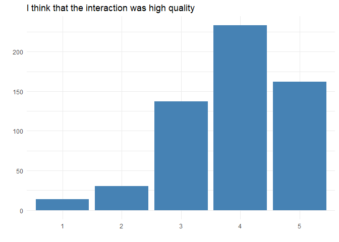<!-- -->


#### Missingness

**Missingness Descriptives**

Delivered / Answered = 579 / 576
Missing = 3
Min = 0, Max = 1, Mean = 0.03, SD = 0.16
(Descriptives are rounded to 2 decimals)

Missingness Intraclass Correlation (ICC) = 1.26 


#### Surveys/Questions

This Item appears in these surveys 
<div style="font-weight: bold; color: #2a5caa;"><a href="#Question 5721-anchor">[Question 5721]</a>: Child EMA Survey ID 91</div>
<div style="font-weight: bold; color: #2a5caa;"><a href="#Question 5728-anchor">[Question 5728]</a>: Child End of Day Survey ID 92</div>
<div style="font-weight: bold; color: #2a5caa;"><a href="#Question 5735-anchor">[Question 5735]</a>: Child Morning EMA Survey ID 99</div>
<div style="font-weight: bold; color: #2a5caa;"><a href="#Question 5742-anchor">[Question 5742]</a>: Child Afternoon EMA Survey ID 100</div>
<div style="font-weight: bold; color: #2a5caa;"><a href="#Question 5749-anchor">[Question 5749]</a>: Child Evening EMA Survey ID 101</div>
<div style="font-weight: bold; color: #2a5caa;"><a href="#Question 5756-anchor">[Question 5756]</a>: Proximity Triggered EMA Survey For Child ID 102</div>


#### Screenshot


</div>


</div> <!-- Header section -->

<div class = "header-shading">

#### The interaction was good <br>

<div id="Item 5530-anchor" style="font-weight: bold; color: #2a5caa; margin-top: -0.7em; margin-bottom: 1em;">
  [Item 5530]
</div>


</div>


<!-- Body -->


<div class = "anchor">


**Way the question was delivered:** Multiple Choice

**Type of data:** integer

</div> 
<div class = "anchor">


<button 
  onclick="let e = document.getElementById('Item 5530');
           let arrow = document.getElementById('Item 5530_arrow');
           e.style.display = e.style.display === 'none' ? 'block' : 'none';
           arrow.textContent = e.style.display === 'none' ? '▼' : '▲';"
  style="background: none; border: none; padding: 0; font-weight: bold; font-size: 18px; color: #2a5caa; cursor: pointer;">
Click to view visuals <span id="Item 5530_arrow">▼</span>
</button>

<div id="Item 5530" style="display: none;">


<!-- TOC-IGNORE-BEGIN -->

### Descriptives {.tabset}


#### Frequency Table

<table class="table" style="color: black; margin-left: auto; margin-right: auto;">
 <thead>
  <tr>
   <th style="text-align:left;"> Value </th>
   <th style="text-align:left;"> Label </th>
   <th style="text-align:left;"> Counts </th>
   <th style="text-align:left;"> Percentages </th>
  </tr>
 </thead>
<tbody>
  <tr>
   <td style="text-align:left;"> 1 </td>
   <td style="text-align:left;"> Strongly disagree </td>
   <td style="text-align:left;color: darkgreen !important;"> N = 11 </td>
   <td style="text-align:left;"> 1.9% </td>
  </tr>
  <tr>
   <td style="text-align:left;"> 2 </td>
   <td style="text-align:left;"> Disagree </td>
   <td style="text-align:left;color: darkgreen !important;"> N = 17 </td>
   <td style="text-align:left;"> 3% </td>
  </tr>
  <tr>
   <td style="text-align:left;"> 3 </td>
   <td style="text-align:left;"> Agree some and disagree some </td>
   <td style="text-align:left;color: darkgreen !important;"> N = 84 </td>
   <td style="text-align:left;"> 14.6% </td>
  </tr>
  <tr>
   <td style="text-align:left;"> 4 </td>
   <td style="text-align:left;"> Agree </td>
   <td style="text-align:left;color: darkgreen !important;"> N = 271 </td>
   <td style="text-align:left;"> 47.2% </td>
  </tr>
  <tr>
   <td style="text-align:left;"> 5 </td>
   <td style="text-align:left;"> Strongly agree </td>
   <td style="text-align:left;color: darkgreen !important;"> N = 191 </td>
   <td style="text-align:left;"> 33.3% </td>
  </tr>
</tbody>
</table>


#### Barplot

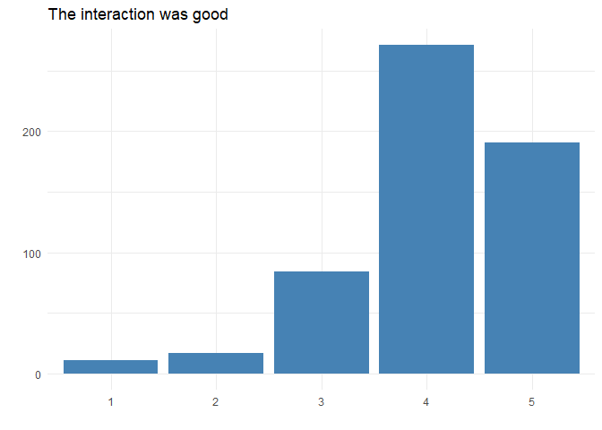<!-- -->


#### Missingness

**Missingness Descriptives**

Delivered / Answered = 577 / 574
Missing = 3
Min = 0, Max = 1, Mean = 0.03, SD = 0.16
(Descriptives are rounded to 2 decimals)

Missingness Intraclass Correlation (ICC) = 1.26 


#### Surveys/Questions

This Item appears in these surveys 
<div style="font-weight: bold; color: #2a5caa;"><a href="#Question 5722-anchor">[Question 5722]</a>: Child EMA Survey ID 91</div>
<div style="font-weight: bold; color: #2a5caa;"><a href="#Question 5729-anchor">[Question 5729]</a>: Child End of Day Survey ID 92</div>
<div style="font-weight: bold; color: #2a5caa;"><a href="#Question 5736-anchor">[Question 5736]</a>: Child Morning EMA Survey ID 99</div>
<div style="font-weight: bold; color: #2a5caa;"><a href="#Question 5743-anchor">[Question 5743]</a>: Child Afternoon EMA Survey ID 100</div>
<div style="font-weight: bold; color: #2a5caa;"><a href="#Question 5750-anchor">[Question 5750]</a>: Child Evening EMA Survey ID 101</div>
<div style="font-weight: bold; color: #2a5caa;"><a href="#Question 5757-anchor">[Question 5757]</a>: Proximity Triggered EMA Survey For Child ID 102</div>


#### Screenshot


</div>


</div> <!-- Header section -->

<div class = "header-shading">

#### I feel supported <br>

<div id="Item 5531-anchor" style="font-weight: bold; color: #2a5caa; margin-top: -0.7em; margin-bottom: 1em;">
  [Item 5531]
</div>


</div>


<!-- Body -->


<div class = "anchor">


**Way the question was delivered:** Multiple Choice

**Type of data:** integer

</div> 
<div class = "anchor">


<button 
  onclick="let e = document.getElementById('Item 5531');
           let arrow = document.getElementById('Item 5531_arrow');
           e.style.display = e.style.display === 'none' ? 'block' : 'none';
           arrow.textContent = e.style.display === 'none' ? '▼' : '▲';"
  style="background: none; border: none; padding: 0; font-weight: bold; font-size: 18px; color: #2a5caa; cursor: pointer;">
Click to view visuals <span id="Item 5531_arrow">▼</span>
</button>

<div id="Item 5531" style="display: none;">


<!-- TOC-IGNORE-BEGIN -->

### Descriptives {.tabset}


#### Frequency Table

<table class="table" style="color: black; margin-left: auto; margin-right: auto;">
 <thead>
  <tr>
   <th style="text-align:left;"> Value </th>
   <th style="text-align:left;"> Label </th>
   <th style="text-align:left;"> Counts </th>
   <th style="text-align:left;"> Percentages </th>
  </tr>
 </thead>
<tbody>
  <tr>
   <td style="text-align:left;"> 1 </td>
   <td style="text-align:left;"> Strongly disagree </td>
   <td style="text-align:left;color: darkgreen !important;"> N = 10 </td>
   <td style="text-align:left;"> 1.7% </td>
  </tr>
  <tr>
   <td style="text-align:left;"> 2 </td>
   <td style="text-align:left;"> Disagree </td>
   <td style="text-align:left;color: darkgreen !important;"> N = 18 </td>
   <td style="text-align:left;"> 3.1% </td>
  </tr>
  <tr>
   <td style="text-align:left;"> 3 </td>
   <td style="text-align:left;"> Agree some and disagree some </td>
   <td style="text-align:left;color: darkgreen !important;"> N = 102 </td>
   <td style="text-align:left;"> 17.7% </td>
  </tr>
  <tr>
   <td style="text-align:left;"> 4 </td>
   <td style="text-align:left;"> Agree </td>
   <td style="text-align:left;color: darkgreen !important;"> N = 261 </td>
   <td style="text-align:left;"> 45.4% </td>
  </tr>
  <tr>
   <td style="text-align:left;"> 5 </td>
   <td style="text-align:left;"> Strongly agree </td>
   <td style="text-align:left;color: darkgreen !important;"> N = 184 </td>
   <td style="text-align:left;"> 32% </td>
  </tr>
</tbody>
</table>


#### Barplot

<!-- -->


#### Missingness

**Missingness Descriptives**

Delivered / Answered = 578 / 575
Missing = 3
Min = 0, Max = 1, Mean = 0.03, SD = 0.16
(Descriptives are rounded to 2 decimals)

Missingness Intraclass Correlation (ICC) = 1.26 


#### Surveys/Questions

This Item appears in these surveys 
<div style="font-weight: bold; color: #2a5caa;"><a href="#Question 5639-anchor">[Question 5639]</a>: Child EMA Survey ID 91</div>
<div style="font-weight: bold; color: #2a5caa;"><a href="#Question 5653-anchor">[Question 5653]</a>: Child End of Day Survey ID 92</div>
<div style="font-weight: bold; color: #2a5caa;"><a href="#Question 5668-anchor">[Question 5668]</a>: Child Morning EMA Survey ID 99</div>
<div style="font-weight: bold; color: #2a5caa;"><a href="#Question 5682-anchor">[Question 5682]</a>: Child Afternoon EMA Survey ID 100</div>
<div style="font-weight: bold; color: #2a5caa;"><a href="#Question 5696-anchor">[Question 5696]</a>: Child Evening EMA Survey ID 101</div>
<div style="font-weight: bold; color: #2a5caa;"><a href="#Question 5710-anchor">[Question 5710]</a>: Proximity Triggered EMA Survey For Child ID 102</div>


#### Screenshot


</div>


</div> <!-- Header section -->

<div class = "header-shading">

#### That was an excellent supportive interaction <br>

<div id="Item 5532-anchor" style="font-weight: bold; color: #2a5caa; margin-top: -0.7em; margin-bottom: 1em;">
  [Item 5532]
</div>


</div>


<!-- Body -->


<div class = "anchor">


**Way the question was delivered:** Multiple Choice

**Type of data:** integer

</div> 
<div class = "anchor">


<button 
  onclick="let e = document.getElementById('Item 5532');
           let arrow = document.getElementById('Item 5532_arrow');
           e.style.display = e.style.display === 'none' ? 'block' : 'none';
           arrow.textContent = e.style.display === 'none' ? '▼' : '▲';"
  style="background: none; border: none; padding: 0; font-weight: bold; font-size: 18px; color: #2a5caa; cursor: pointer;">
Click to view visuals <span id="Item 5532_arrow">▼</span>
</button>

<div id="Item 5532" style="display: none;">


<!-- TOC-IGNORE-BEGIN -->

### Descriptives {.tabset}


#### Frequency Table

<table class="table" style="color: black; margin-left: auto; margin-right: auto;">
 <thead>
  <tr>
   <th style="text-align:left;"> Value </th>
   <th style="text-align:left;"> Label </th>
   <th style="text-align:left;"> Counts </th>
   <th style="text-align:left;"> Percentages </th>
  </tr>
 </thead>
<tbody>
  <tr>
   <td style="text-align:left;"> 1 </td>
   <td style="text-align:left;"> Strongly disagree </td>
   <td style="text-align:left;color: darkgreen !important;"> N = 14 </td>
   <td style="text-align:left;"> 2.4% </td>
  </tr>
  <tr>
   <td style="text-align:left;"> 2 </td>
   <td style="text-align:left;"> Disagree </td>
   <td style="text-align:left;color: darkgreen !important;"> N = 40 </td>
   <td style="text-align:left;"> 6.9% </td>
  </tr>
  <tr>
   <td style="text-align:left;"> 3 </td>
   <td style="text-align:left;"> Agree some and disagree some </td>
   <td style="text-align:left;color: darkgreen !important;"> N = 130 </td>
   <td style="text-align:left;"> 22.6% </td>
  </tr>
  <tr>
   <td style="text-align:left;"> 4 </td>
   <td style="text-align:left;"> Agree </td>
   <td style="text-align:left;color: darkgreen !important;"> N = 223 </td>
   <td style="text-align:left;"> 38.7% </td>
  </tr>
  <tr>
   <td style="text-align:left;"> 5 </td>
   <td style="text-align:left;"> Strongly agree </td>
   <td style="text-align:left;color: darkgreen !important;"> N = 169 </td>
   <td style="text-align:left;"> 29.3% </td>
  </tr>
</tbody>
</table>


#### Barplot

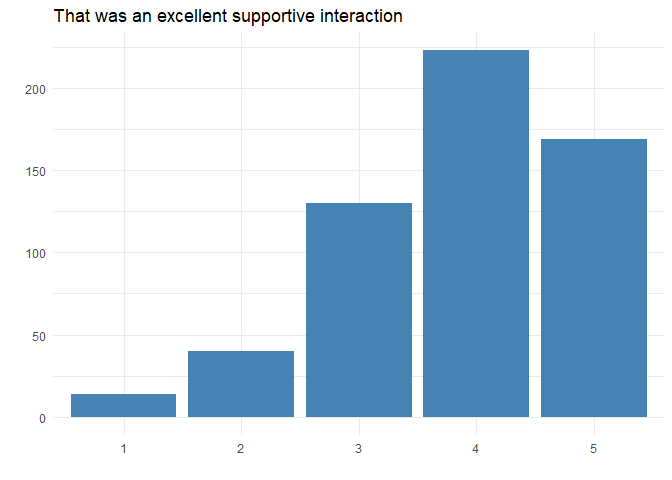<!-- -->


#### Missingness

**Missingness Descriptives**

Delivered / Answered = 577 / 576
Missing = 1
Min = 0, Max = 1, Mean = 0.01, SD = 0.09
(Descriptives are rounded to 2 decimals)

Missingness Intraclass Correlation (ICC) = 1.27 


#### Surveys/Questions

This Item appears in these surveys 
<div style="font-weight: bold; color: #2a5caa;"><a href="#Question 5723-anchor">[Question 5723]</a>: Child EMA Survey ID 91</div>
<div style="font-weight: bold; color: #2a5caa;"><a href="#Question 5730-anchor">[Question 5730]</a>: Child End of Day Survey ID 92</div>
<div style="font-weight: bold; color: #2a5caa;"><a href="#Question 5737-anchor">[Question 5737]</a>: Child Morning EMA Survey ID 99</div>
<div style="font-weight: bold; color: #2a5caa;"><a href="#Question 5744-anchor">[Question 5744]</a>: Child Afternoon EMA Survey ID 100</div>
<div style="font-weight: bold; color: #2a5caa;"><a href="#Question 5751-anchor">[Question 5751]</a>: Child Evening EMA Survey ID 101</div>
<div style="font-weight: bold; color: #2a5caa;"><a href="#Question 5758-anchor">[Question 5758]</a>: Proximity Triggered EMA Survey For Child ID 102</div>


#### Screenshot


</div>


</div> <!-- Header section -->

<div class = "header-shading">

#### The interaction made me feel better <br>

<div id="Item 5533-anchor" style="font-weight: bold; color: #2a5caa; margin-top: -0.7em; margin-bottom: 1em;">
  [Item 5533]
</div>


</div>


<!-- Body -->


<div class = "anchor">


**Way the question was delivered:** Multiple Choice

**Type of data:** integer

</div> 
<div class = "anchor">


<button 
  onclick="let e = document.getElementById('Item 5533');
           let arrow = document.getElementById('Item 5533_arrow');
           e.style.display = e.style.display === 'none' ? 'block' : 'none';
           arrow.textContent = e.style.display === 'none' ? '▼' : '▲';"
  style="background: none; border: none; padding: 0; font-weight: bold; font-size: 18px; color: #2a5caa; cursor: pointer;">
Click to view visuals <span id="Item 5533_arrow">▼</span>
</button>

<div id="Item 5533" style="display: none;">


<!-- TOC-IGNORE-BEGIN -->

### Descriptives {.tabset}


#### Frequency Table

<table class="table" style="color: black; margin-left: auto; margin-right: auto;">
 <thead>
  <tr>
   <th style="text-align:left;"> Value </th>
   <th style="text-align:left;"> Label </th>
   <th style="text-align:left;"> Counts </th>
   <th style="text-align:left;"> Percentages </th>
  </tr>
 </thead>
<tbody>
  <tr>
   <td style="text-align:left;"> 1 </td>
   <td style="text-align:left;"> Strongly disagree </td>
   <td style="text-align:left;color: darkgreen !important;"> N = 12 </td>
   <td style="text-align:left;"> 2.1% </td>
  </tr>
  <tr>
   <td style="text-align:left;"> 2 </td>
   <td style="text-align:left;"> Disagree </td>
   <td style="text-align:left;color: darkgreen !important;"> N = 42 </td>
   <td style="text-align:left;"> 7.3% </td>
  </tr>
  <tr>
   <td style="text-align:left;"> 3 </td>
   <td style="text-align:left;"> Agree some and disagree some </td>
   <td style="text-align:left;color: darkgreen !important;"> N = 142 </td>
   <td style="text-align:left;"> 24.7% </td>
  </tr>
  <tr>
   <td style="text-align:left;"> 4 </td>
   <td style="text-align:left;"> Agree </td>
   <td style="text-align:left;color: darkgreen !important;"> N = 223 </td>
   <td style="text-align:left;"> 38.7% </td>
  </tr>
  <tr>
   <td style="text-align:left;"> 5 </td>
   <td style="text-align:left;"> Strongly agree </td>
   <td style="text-align:left;color: darkgreen !important;"> N = 157 </td>
   <td style="text-align:left;"> 27.3% </td>
  </tr>
</tbody>
</table>


#### Barplot

<!-- -->


#### Missingness

**Missingness Descriptives**

Delivered / Answered = 577 / 576
Missing = 1
Min = 0, Max = 1, Mean = 0.01, SD = 0.09
(Descriptives are rounded to 2 decimals)

Missingness Intraclass Correlation (ICC) = 1.27 


#### Surveys/Questions

This Item appears in these surveys 
<div style="font-weight: bold; color: #2a5caa;"><a href="#Question 5724-anchor">[Question 5724]</a>: Child EMA Survey ID 91</div>
<div style="font-weight: bold; color: #2a5caa;"><a href="#Question 5731-anchor">[Question 5731]</a>: Child End of Day Survey ID 92</div>
<div style="font-weight: bold; color: #2a5caa;"><a href="#Question 5738-anchor">[Question 5738]</a>: Child Morning EMA Survey ID 99</div>
<div style="font-weight: bold; color: #2a5caa;"><a href="#Question 5745-anchor">[Question 5745]</a>: Child Afternoon EMA Survey ID 100</div>
<div style="font-weight: bold; color: #2a5caa;"><a href="#Question 5752-anchor">[Question 5752]</a>: Child Evening EMA Survey ID 101</div>
<div style="font-weight: bold; color: #2a5caa;"><a href="#Question 5759-anchor">[Question 5759]</a>: Proximity Triggered EMA Survey For Child ID 102</div>


#### Screenshot


</div>


</div> <!-- Header section -->

<div class = "header-shading">

#### The interaction made me feel supported <br>

<div id="Item 5534-anchor" style="font-weight: bold; color: #2a5caa; margin-top: -0.7em; margin-bottom: 1em;">
  [Item 5534]
</div>


</div>


<!-- Body -->


<div class = "anchor">


**Way the question was delivered:** Multiple Choice

**Type of data:** integer

</div> 
<div class = "anchor">


<button 
  onclick="let e = document.getElementById('Item 5534');
           let arrow = document.getElementById('Item 5534_arrow');
           e.style.display = e.style.display === 'none' ? 'block' : 'none';
           arrow.textContent = e.style.display === 'none' ? '▼' : '▲';"
  style="background: none; border: none; padding: 0; font-weight: bold; font-size: 18px; color: #2a5caa; cursor: pointer;">
Click to view visuals <span id="Item 5534_arrow">▼</span>
</button>

<div id="Item 5534" style="display: none;">


<!-- TOC-IGNORE-BEGIN -->

### Descriptives {.tabset}


#### Frequency Table

<table class="table" style="color: black; margin-left: auto; margin-right: auto;">
 <thead>
  <tr>
   <th style="text-align:left;"> Value </th>
   <th style="text-align:left;"> Label </th>
   <th style="text-align:left;"> Counts </th>
   <th style="text-align:left;"> Percentages </th>
  </tr>
 </thead>
<tbody>
  <tr>
   <td style="text-align:left;"> 1 </td>
   <td style="text-align:left;"> Strongly disagree </td>
   <td style="text-align:left;color: darkgreen !important;"> N = 10 </td>
   <td style="text-align:left;"> 1.7% </td>
  </tr>
  <tr>
   <td style="text-align:left;"> 2 </td>
   <td style="text-align:left;"> Disagree </td>
   <td style="text-align:left;color: darkgreen !important;"> N = 32 </td>
   <td style="text-align:left;"> 5.6% </td>
  </tr>
  <tr>
   <td style="text-align:left;"> 3 </td>
   <td style="text-align:left;"> Agree some and disagree some </td>
   <td style="text-align:left;color: darkgreen !important;"> N = 140 </td>
   <td style="text-align:left;"> 24.3% </td>
  </tr>
  <tr>
   <td style="text-align:left;"> 4 </td>
   <td style="text-align:left;"> Agree </td>
   <td style="text-align:left;color: darkgreen !important;"> N = 230 </td>
   <td style="text-align:left;"> 39.9% </td>
  </tr>
  <tr>
   <td style="text-align:left;"> 5 </td>
   <td style="text-align:left;"> Strongly agree </td>
   <td style="text-align:left;color: darkgreen !important;"> N = 164 </td>
   <td style="text-align:left;"> 28.5% </td>
  </tr>
</tbody>
</table>


#### Barplot

<!-- -->


#### Missingness

**Missingness Descriptives**

Delivered / Answered = 577 / 576
Missing = 1
Min = 0, Max = 1, Mean = 0.01, SD = 0.09
(Descriptives are rounded to 2 decimals)

Missingness Intraclass Correlation (ICC) = 1.27 


#### Surveys/Questions

This Item appears in these surveys 
<div style="font-weight: bold; color: #2a5caa;"><a href="#Question 5725-anchor">[Question 5725]</a>: Child EMA Survey ID 91</div>
<div style="font-weight: bold; color: #2a5caa;"><a href="#Question 5732-anchor">[Question 5732]</a>: Child End of Day Survey ID 92</div>
<div style="font-weight: bold; color: #2a5caa;"><a href="#Question 5739-anchor">[Question 5739]</a>: Child Morning EMA Survey ID 99</div>
<div style="font-weight: bold; color: #2a5caa;"><a href="#Question 5746-anchor">[Question 5746]</a>: Child Afternoon EMA Survey ID 100</div>
<div style="font-weight: bold; color: #2a5caa;"><a href="#Question 5753-anchor">[Question 5753]</a>: Child Evening EMA Survey ID 101</div>
<div style="font-weight: bold; color: #2a5caa;"><a href="#Question 5760-anchor">[Question 5760]</a>: Proximity Triggered EMA Survey For Child ID 102</div>


#### Screenshot


</div>


</div> <!-- Header section -->

<div class = "header-shading">

#### I dont feel better after the interaction <br>

<div id="Item 5535-anchor" style="font-weight: bold; color: #2a5caa; margin-top: -0.7em; margin-bottom: 1em;">
  [Item 5535]
</div>


</div>


<!-- Body -->


<div class = "anchor">


**Way the question was delivered:** Multiple Choice

**Type of data:** integer

</div> 
<div class = "anchor">


<button 
  onclick="let e = document.getElementById('Item 5535');
           let arrow = document.getElementById('Item 5535_arrow');
           e.style.display = e.style.display === 'none' ? 'block' : 'none';
           arrow.textContent = e.style.display === 'none' ? '▼' : '▲';"
  style="background: none; border: none; padding: 0; font-weight: bold; font-size: 18px; color: #2a5caa; cursor: pointer;">
Click to view visuals <span id="Item 5535_arrow">▼</span>
</button>

<div id="Item 5535" style="display: none;">


<!-- TOC-IGNORE-BEGIN -->

### Descriptives {.tabset}


#### Frequency Table

<table class="table" style="color: black; margin-left: auto; margin-right: auto;">
 <thead>
  <tr>
   <th style="text-align:left;"> Value </th>
   <th style="text-align:left;"> Label </th>
   <th style="text-align:left;"> Counts </th>
   <th style="text-align:left;"> Percentages </th>
  </tr>
 </thead>
<tbody>
  <tr>
   <td style="text-align:left;"> 1 </td>
   <td style="text-align:left;"> Strongly disagree </td>
   <td style="text-align:left;color: darkgreen !important;"> N = 186 </td>
   <td style="text-align:left;"> 32.3% </td>
  </tr>
  <tr>
   <td style="text-align:left;"> 2 </td>
   <td style="text-align:left;"> Disagree </td>
   <td style="text-align:left;color: darkgreen !important;"> N = 241 </td>
   <td style="text-align:left;"> 41.9% </td>
  </tr>
  <tr>
   <td style="text-align:left;"> 3 </td>
   <td style="text-align:left;"> Agree some and disagree some </td>
   <td style="text-align:left;color: darkgreen !important;"> N = 85 </td>
   <td style="text-align:left;"> 14.8% </td>
  </tr>
  <tr>
   <td style="text-align:left;"> 4 </td>
   <td style="text-align:left;"> Agree </td>
   <td style="text-align:left;color: darkgreen !important;"> N = 47 </td>
   <td style="text-align:left;"> 8.2% </td>
  </tr>
  <tr>
   <td style="text-align:left;"> 5 </td>
   <td style="text-align:left;"> Strongly agree </td>
   <td style="text-align:left;color: darkgreen !important;"> N = 16 </td>
   <td style="text-align:left;"> 2.8% </td>
  </tr>
</tbody>
</table>


#### Barplot

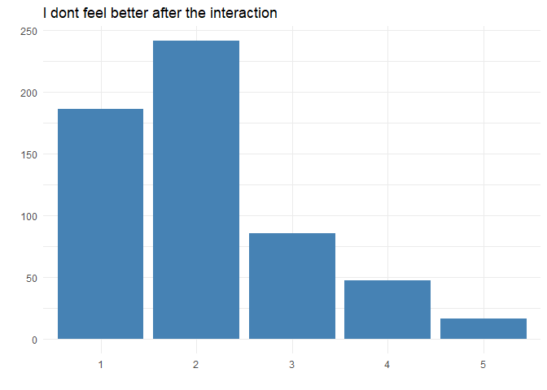<!-- -->


#### Missingness

**Missingness Descriptives**

Delivered / Answered = 577 / 575
Missing = 2
Min = 0, Max = 1, Mean = 0.02, SD = 0.13
(Descriptives are rounded to 2 decimals)

Missingness Intraclass Correlation (ICC) = 1.26 


#### Surveys/Questions

This Item appears in these surveys 
<div style="font-weight: bold; color: #2a5caa;"><a href="#Question 5643-anchor">[Question 5643]</a>: Child EMA Survey ID 91</div>
<div style="font-weight: bold; color: #2a5caa;"><a href="#Question 5657-anchor">[Question 5657]</a>: Child End of Day Survey ID 92</div>
<div style="font-weight: bold; color: #2a5caa;"><a href="#Question 5672-anchor">[Question 5672]</a>: Child Morning EMA Survey ID 99</div>
<div style="font-weight: bold; color: #2a5caa;"><a href="#Question 5686-anchor">[Question 5686]</a>: Child Afternoon EMA Survey ID 100</div>
<div style="font-weight: bold; color: #2a5caa;"><a href="#Question 5700-anchor">[Question 5700]</a>: Child Evening EMA Survey ID 101</div>
<div style="font-weight: bold; color: #2a5caa;"><a href="#Question 5714-anchor">[Question 5714]</a>: Proximity Triggered EMA Survey For Child ID 102</div>


#### Screenshot


</div>


</div> <!-- Header section -->

<div class = "header-shading">

#### The interaction made me feel worse <br>

<div id="Item 5536-anchor" style="font-weight: bold; color: #2a5caa; margin-top: -0.7em; margin-bottom: 1em;">
  [Item 5536]
</div>


</div>


<!-- Body -->


<div class = "anchor">


**Way the question was delivered:** Multiple Choice

**Type of data:** integer

</div> 
<div class = "anchor">


<button 
  onclick="let e = document.getElementById('Item 5536');
           let arrow = document.getElementById('Item 5536_arrow');
           e.style.display = e.style.display === 'none' ? 'block' : 'none';
           arrow.textContent = e.style.display === 'none' ? '▼' : '▲';"
  style="background: none; border: none; padding: 0; font-weight: bold; font-size: 18px; color: #2a5caa; cursor: pointer;">
Click to view visuals <span id="Item 5536_arrow">▼</span>
</button>

<div id="Item 5536" style="display: none;">


<!-- TOC-IGNORE-BEGIN -->

### Descriptives {.tabset}


#### Frequency Table

<table class="table" style="color: black; margin-left: auto; margin-right: auto;">
 <thead>
  <tr>
   <th style="text-align:left;"> Value </th>
   <th style="text-align:left;"> Label </th>
   <th style="text-align:left;"> Counts </th>
   <th style="text-align:left;"> Percentages </th>
  </tr>
 </thead>
<tbody>
  <tr>
   <td style="text-align:left;"> 1 </td>
   <td style="text-align:left;"> Strongly disagree </td>
   <td style="text-align:left;color: darkgreen !important;"> N = 240 </td>
   <td style="text-align:left;"> 41.7% </td>
  </tr>
  <tr>
   <td style="text-align:left;"> 2 </td>
   <td style="text-align:left;"> Disagree </td>
   <td style="text-align:left;color: darkgreen !important;"> N = 244 </td>
   <td style="text-align:left;"> 42.4% </td>
  </tr>
  <tr>
   <td style="text-align:left;"> 3 </td>
   <td style="text-align:left;"> Agree some and disagree some </td>
   <td style="text-align:left;color: darkgreen !important;"> N = 65 </td>
   <td style="text-align:left;"> 11.3% </td>
  </tr>
  <tr>
   <td style="text-align:left;"> 4 </td>
   <td style="text-align:left;"> Agree </td>
   <td style="text-align:left;color: darkgreen !important;"> N = 13 </td>
   <td style="text-align:left;"> 2.3% </td>
  </tr>
  <tr>
   <td style="text-align:left;"> 5 </td>
   <td style="text-align:left;"> Strongly agree </td>
   <td style="text-align:left;color: darkgreen !important;"> N = 13 </td>
   <td style="text-align:left;"> 2.3% </td>
  </tr>
</tbody>
</table>


#### Barplot

<!-- -->


#### Missingness

**Missingness Descriptives**

Delivered / Answered = 577 / 575
Missing = 2
Min = 0, Max = 1, Mean = 0.02, SD = 0.13
(Descriptives are rounded to 2 decimals)

Missingness Intraclass Correlation (ICC) = 1.26 


#### Surveys/Questions

This Item appears in these surveys 
<div style="font-weight: bold; color: #2a5caa;"><a href="#Question 5644-anchor">[Question 5644]</a>: Child EMA Survey ID 91</div>
<div style="font-weight: bold; color: #2a5caa;"><a href="#Question 5658-anchor">[Question 5658]</a>: Child End of Day Survey ID 92</div>
<div style="font-weight: bold; color: #2a5caa;"><a href="#Question 5673-anchor">[Question 5673]</a>: Child Morning EMA Survey ID 99</div>
<div style="font-weight: bold; color: #2a5caa;"><a href="#Question 5687-anchor">[Question 5687]</a>: Child Afternoon EMA Survey ID 100</div>
<div style="font-weight: bold; color: #2a5caa;"><a href="#Question 5701-anchor">[Question 5701]</a>: Child Evening EMA Survey ID 101</div>
<div style="font-weight: bold; color: #2a5caa;"><a href="#Question 5715-anchor">[Question 5715]</a>: Proximity Triggered EMA Survey For Child ID 102</div>


#### Screenshot


</div>


</div> <!-- Header section -->

<div class = "header-shading">

#### The interaction helped with a problem I was having <br>

<div id="Item 5537-anchor" style="font-weight: bold; color: #2a5caa; margin-top: -0.7em; margin-bottom: 1em;">
  [Item 5537]
</div>


</div>


<!-- Body -->


<div class = "anchor">


**Way the question was delivered:** Multiple Choice

**Type of data:** integer

</div> 
<div class = "anchor">


<button 
  onclick="let e = document.getElementById('Item 5537');
           let arrow = document.getElementById('Item 5537_arrow');
           e.style.display = e.style.display === 'none' ? 'block' : 'none';
           arrow.textContent = e.style.display === 'none' ? '▼' : '▲';"
  style="background: none; border: none; padding: 0; font-weight: bold; font-size: 18px; color: #2a5caa; cursor: pointer;">
Click to view visuals <span id="Item 5537_arrow">▼</span>
</button>

<div id="Item 5537" style="display: none;">


<!-- TOC-IGNORE-BEGIN -->

### Descriptives {.tabset}


#### Frequency Table

<table class="table" style="color: black; margin-left: auto; margin-right: auto;">
 <thead>
  <tr>
   <th style="text-align:left;"> Value </th>
   <th style="text-align:left;"> Label </th>
   <th style="text-align:left;"> Counts </th>
   <th style="text-align:left;"> Percentages </th>
  </tr>
 </thead>
<tbody>
  <tr>
   <td style="text-align:left;"> 1 </td>
   <td style="text-align:left;"> Strongly disagree </td>
   <td style="text-align:left;color: darkgreen !important;"> N = 35 </td>
   <td style="text-align:left;"> 6.1% </td>
  </tr>
  <tr>
   <td style="text-align:left;"> 2 </td>
   <td style="text-align:left;"> Disagree </td>
   <td style="text-align:left;color: darkgreen !important;"> N = 110 </td>
   <td style="text-align:left;"> 19.3% </td>
  </tr>
  <tr>
   <td style="text-align:left;"> 3 </td>
   <td style="text-align:left;"> Agree some and disagree some </td>
   <td style="text-align:left;color: darkgreen !important;"> N = 197 </td>
   <td style="text-align:left;"> 34.5% </td>
  </tr>
  <tr>
   <td style="text-align:left;"> 4 </td>
   <td style="text-align:left;"> Agree </td>
   <td style="text-align:left;color: darkgreen !important;"> N = 135 </td>
   <td style="text-align:left;"> 23.6% </td>
  </tr>
  <tr>
   <td style="text-align:left;"> 5 </td>
   <td style="text-align:left;"> Strongly agree </td>
   <td style="text-align:left;color: darkgreen !important;"> N = 94 </td>
   <td style="text-align:left;"> 16.5% </td>
  </tr>
</tbody>
</table>


#### Barplot

<!-- -->


#### Missingness

**Missingness Descriptives**

Delivered / Answered = 576 / 571
Missing = 5
Min = 0, Max = 3, Mean = 0.04, SD = 0.31
(Descriptives are rounded to 2 decimals)

Missingness Intraclass Correlation (ICC) = 1.1 


#### Surveys/Questions

This Item appears in these surveys 
<div style="font-weight: bold; color: #2a5caa;"><a href="#Question 5726-anchor">[Question 5726]</a>: Child EMA Survey ID 91</div>
<div style="font-weight: bold; color: #2a5caa;"><a href="#Question 5733-anchor">[Question 5733]</a>: Child End of Day Survey ID 92</div>
<div style="font-weight: bold; color: #2a5caa;"><a href="#Question 5740-anchor">[Question 5740]</a>: Child Morning EMA Survey ID 99</div>
<div style="font-weight: bold; color: #2a5caa;"><a href="#Question 5747-anchor">[Question 5747]</a>: Child Afternoon EMA Survey ID 100</div>
<div style="font-weight: bold; color: #2a5caa;"><a href="#Question 5754-anchor">[Question 5754]</a>: Child Evening EMA Survey ID 101</div>
<div style="font-weight: bold; color: #2a5caa;"><a href="#Question 5761-anchor">[Question 5761]</a>: Proximity Triggered EMA Survey For Child ID 102</div>


#### Screenshot


</div>


</div> <!-- Header section -->

<div class = "header-shading">

#### The interaction helped me feel better about a problem <br>

<div id="Item 5538-anchor" style="font-weight: bold; color: #2a5caa; margin-top: -0.7em; margin-bottom: 1em;">
  [Item 5538]
</div>


</div>


<!-- Body -->


<div class = "anchor">


**Way the question was delivered:** Multiple Choice

**Type of data:** integer

</div> 
<div class = "anchor">


<button 
  onclick="let e = document.getElementById('Item 5538');
           let arrow = document.getElementById('Item 5538_arrow');
           e.style.display = e.style.display === 'none' ? 'block' : 'none';
           arrow.textContent = e.style.display === 'none' ? '▼' : '▲';"
  style="background: none; border: none; padding: 0; font-weight: bold; font-size: 18px; color: #2a5caa; cursor: pointer;">
Click to view visuals <span id="Item 5538_arrow">▼</span>
</button>

<div id="Item 5538" style="display: none;">


<!-- TOC-IGNORE-BEGIN -->

### Descriptives {.tabset}


#### Frequency Table

<table class="table" style="color: black; margin-left: auto; margin-right: auto;">
 <thead>
  <tr>
   <th style="text-align:left;"> Value </th>
   <th style="text-align:left;"> Label </th>
   <th style="text-align:left;"> Counts </th>
   <th style="text-align:left;"> Percentages </th>
  </tr>
 </thead>
<tbody>
  <tr>
   <td style="text-align:left;"> 1 </td>
   <td style="text-align:left;"> Strongly disagree </td>
   <td style="text-align:left;color: darkgreen !important;"> N = 25 </td>
   <td style="text-align:left;"> 4.4% </td>
  </tr>
  <tr>
   <td style="text-align:left;"> 2 </td>
   <td style="text-align:left;"> Disagree </td>
   <td style="text-align:left;color: darkgreen !important;"> N = 108 </td>
   <td style="text-align:left;"> 18.9% </td>
  </tr>
  <tr>
   <td style="text-align:left;"> 3 </td>
   <td style="text-align:left;"> Agree some and disagree some </td>
   <td style="text-align:left;color: darkgreen !important;"> N = 183 </td>
   <td style="text-align:left;"> 32% </td>
  </tr>
  <tr>
   <td style="text-align:left;"> 4 </td>
   <td style="text-align:left;"> Agree </td>
   <td style="text-align:left;color: darkgreen !important;"> N = 142 </td>
   <td style="text-align:left;"> 24.9% </td>
  </tr>
  <tr>
   <td style="text-align:left;"> 5 </td>
   <td style="text-align:left;"> Strongly agree </td>
   <td style="text-align:left;color: darkgreen !important;"> N = 113 </td>
   <td style="text-align:left;"> 19.8% </td>
  </tr>
</tbody>
</table>


#### Barplot

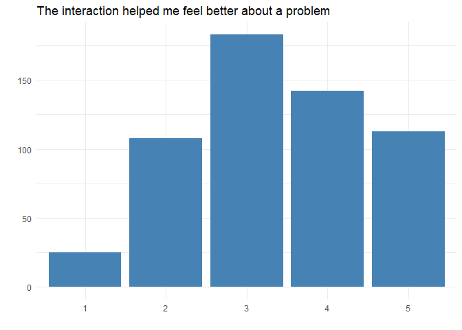<!-- -->


#### Missingness

**Missingness Descriptives**

Delivered / Answered = 575 / 571
Missing = 4
Min = 0, Max = 2, Mean = 0.04, SD = 0.23
(Descriptives are rounded to 2 decimals)

Missingness Intraclass Correlation (ICC) = 1.15 


#### Surveys/Questions

This Item appears in these surveys 
<div style="font-weight: bold; color: #2a5caa;"><a href="#Question 5727-anchor">[Question 5727]</a>: Child EMA Survey ID 91</div>
<div style="font-weight: bold; color: #2a5caa;"><a href="#Question 5734-anchor">[Question 5734]</a>: Child End of Day Survey ID 92</div>
<div style="font-weight: bold; color: #2a5caa;"><a href="#Question 5741-anchor">[Question 5741]</a>: Child Morning EMA Survey ID 99</div>
<div style="font-weight: bold; color: #2a5caa;"><a href="#Question 5748-anchor">[Question 5748]</a>: Child Afternoon EMA Survey ID 100</div>
<div style="font-weight: bold; color: #2a5caa;"><a href="#Question 5755-anchor">[Question 5755]</a>: Child Evening EMA Survey ID 101</div>
<div style="font-weight: bold; color: #2a5caa;"><a href="#Question 5762-anchor">[Question 5762]</a>: Proximity Triggered EMA Survey For Child ID 102</div>


#### Screenshot


</div>


</div> <!-- Header section -->

<div class = "header-shading">

#### At any time today, did you ask your friends to: <br>

<div id="Item 5540-anchor" style="font-weight: bold; color: #2a5caa; margin-top: -0.7em; margin-bottom: 1em;">
  [Item 5540]
</div>


</div>


<!-- Body -->


<div class = "anchor">


**Way the question was delivered:** Multiple Select

**Type of data:** integer

</div> 
<div class = "anchor">


<button 
  onclick="let e = document.getElementById('Item 5540');
           let arrow = document.getElementById('Item 5540_arrow');
           e.style.display = e.style.display === 'none' ? 'block' : 'none';
           arrow.textContent = e.style.display === 'none' ? '▼' : '▲';"
  style="background: none; border: none; padding: 0; font-weight: bold; font-size: 18px; color: #2a5caa; cursor: pointer;">
Click to view visuals <span id="Item 5540_arrow">▼</span>
</button>

<div id="Item 5540" style="display: none;">


<!-- TOC-IGNORE-BEGIN -->

### Descriptives {.tabset}


#### Frequency Table

<table class="table" style="color: black; margin-left: auto; margin-right: auto;">
 <thead>
  <tr>
   <th style="text-align:left;"> Value </th>
   <th style="text-align:left;"> Label </th>
   <th style="text-align:left;"> Counts </th>
   <th style="text-align:left;"> Percentages </th>
  </tr>
 </thead>
<tbody>
  <tr>
   <td style="text-align:left;"> 1 </td>
   <td style="text-align:left;"> Give you emotional support </td>
   <td style="text-align:left;color: darkgreen !important;"> N = 73 </td>
   <td style="text-align:left;"> 4.9% </td>
  </tr>
  <tr>
   <td style="text-align:left;"> 2 </td>
   <td style="text-align:left;"> Listen to you when you speak </td>
   <td style="text-align:left;color: darkgreen !important;"> N = 136 </td>
   <td style="text-align:left;"> 9.2% </td>
  </tr>
  <tr>
   <td style="text-align:left;"> 3 </td>
   <td style="text-align:left;"> Show that she understands or tell you about a similar situation </td>
   <td style="text-align:left;color: darkgreen !important;"> N = 79 </td>
   <td style="text-align:left;"> 5.3% </td>
  </tr>
  <tr>
   <td style="text-align:left;"> 4 </td>
   <td style="text-align:left;"> Give you information and ideas about how to make things better </td>
   <td style="text-align:left;color: darkgreen !important;"> N = 72 </td>
   <td style="text-align:left;"> 4.9% </td>
  </tr>
  <tr>
   <td style="text-align:left;"> 5 </td>
   <td style="text-align:left;"> Give you advice about what to do </td>
   <td style="text-align:left;color: darkgreen !important;"> N = 106 </td>
   <td style="text-align:left;"> 7.2% </td>
  </tr>
  <tr>
   <td style="text-align:left;"> 6 </td>
   <td style="text-align:left;"> Think about the situation with you and tell you what you can do about it </td>
   <td style="text-align:left;color: darkgreen !important;"> N = 70 </td>
   <td style="text-align:left;"> 4.7% </td>
  </tr>
  <tr>
   <td style="text-align:left;"> 7 </td>
   <td style="text-align:left;"> Do something to help you </td>
   <td style="text-align:left;color: darkgreen !important;"> N = 123 </td>
   <td style="text-align:left;"> 8.3% </td>
  </tr>
  <tr>
   <td style="text-align:left;"> 8 </td>
   <td style="text-align:left;"> Offer to do something to help you </td>
   <td style="text-align:left;color: darkgreen !important;"> N = 57 </td>
   <td style="text-align:left;"> 3.8% </td>
  </tr>
  <tr>
   <td style="text-align:left;"> 9 </td>
   <td style="text-align:left;"> None apply </td>
   <td style="text-align:left;color: darkgreen !important;"> N = 765 </td>
   <td style="text-align:left;"> 51.7% </td>
  </tr>
</tbody>
</table>


#### Barplot

<!-- -->


#### Missingness

**Missingness Descriptives**

Delivered / Answered = 1048 / 1042
Missing = 6
Min = 0, Max = 2, Mean = 0.05, SD = 0.29
(Descriptives are rounded to 2 decimals)

Missingness Intraclass Correlation (ICC) = 1.07 


#### Surveys/Questions

This Item appears in these surveys 
<div style="font-weight: bold; color: #2a5caa;"><a href="#Question 5661-anchor">[Question 5661]</a>: Child End of Day Survey ID 92</div>

#### Screenshot


</div>


</div> <!-- Header section -->

<div class = "header-shading">

#### From who else did you receive emotional support today, other than your mother? <br>

<div id="Item 5541-anchor" style="font-weight: bold; color: #2a5caa; margin-top: -0.7em; margin-bottom: 1em;">
  [Item 5541]
</div>


</div>


<!-- Body -->


<div class = "anchor">


**Way the question was delivered:** Multiple Select

**Type of data:** integer

</div> 
<div class = "anchor">


<button 
  onclick="let e = document.getElementById('Item 5541');
           let arrow = document.getElementById('Item 5541_arrow');
           e.style.display = e.style.display === 'none' ? 'block' : 'none';
           arrow.textContent = e.style.display === 'none' ? '▼' : '▲';"
  style="background: none; border: none; padding: 0; font-weight: bold; font-size: 18px; color: #2a5caa; cursor: pointer;">
Click to view visuals <span id="Item 5541_arrow">▼</span>
</button>

<div id="Item 5541" style="display: none;">


<!-- TOC-IGNORE-BEGIN -->

### Descriptives {.tabset}


#### Frequency Table

<table class="table" style="color: black; margin-left: auto; margin-right: auto;">
 <thead>
  <tr>
   <th style="text-align:left;"> Value </th>
   <th style="text-align:left;"> Label </th>
   <th style="text-align:left;"> Counts </th>
   <th style="text-align:left;"> Percentages </th>
  </tr>
 </thead>
<tbody>
  <tr>
   <td style="text-align:left;"> 1 </td>
   <td style="text-align:left;"> Siblings </td>
   <td style="text-align:left;color: darkgreen !important;"> N = 120 </td>
   <td style="text-align:left;"> 8.5% </td>
  </tr>
  <tr>
   <td style="text-align:left;"> 2 </td>
   <td style="text-align:left;"> Other parent or caregiver </td>
   <td style="text-align:left;color: darkgreen !important;"> N = 237 </td>
   <td style="text-align:left;"> 16.8% </td>
  </tr>
  <tr>
   <td style="text-align:left;"> 3 </td>
   <td style="text-align:left;"> Other family members </td>
   <td style="text-align:left;color: darkgreen !important;"> N = 61 </td>
   <td style="text-align:left;"> 4.3% </td>
  </tr>
  <tr>
   <td style="text-align:left;"> 4 </td>
   <td style="text-align:left;"> Friends </td>
   <td style="text-align:left;color: darkgreen !important;"> N = 325 </td>
   <td style="text-align:left;"> 23% </td>
  </tr>
  <tr>
   <td style="text-align:left;"> 5 </td>
   <td style="text-align:left;"> Romantic partner </td>
   <td style="text-align:left;color: darkgreen !important;"> N = 55 </td>
   <td style="text-align:left;"> 3.9% </td>
  </tr>
  <tr>
   <td style="text-align:left;"> 6 </td>
   <td style="text-align:left;"> Online friends </td>
   <td style="text-align:left;color: darkgreen !important;"> N = 34 </td>
   <td style="text-align:left;"> 2.4% </td>
  </tr>
  <tr>
   <td style="text-align:left;"> 7 </td>
   <td style="text-align:left;"> Teachers, coaches, or other adults </td>
   <td style="text-align:left;color: darkgreen !important;"> N = 75 </td>
   <td style="text-align:left;"> 5.3% </td>
  </tr>
  <tr>
   <td style="text-align:left;"> 8 </td>
   <td style="text-align:left;"> Health professionals (like a doctor) </td>
   <td style="text-align:left;color: darkgreen !important;"> N = 6 </td>
   <td style="text-align:left;"> 0.4% </td>
  </tr>
  <tr>
   <td style="text-align:left;"> 9 </td>
   <td style="text-align:left;"> Websites </td>
   <td style="text-align:left;color: darkgreen !important;"> N = 12 </td>
   <td style="text-align:left;"> 0.8% </td>
  </tr>
  <tr>
   <td style="text-align:left;"> 10 </td>
   <td style="text-align:left;"> None apply </td>
   <td style="text-align:left;color: darkgreen !important;"> N = 489 </td>
   <td style="text-align:left;"> 34.6% </td>
  </tr>
</tbody>
</table>


#### Barplot

<!-- -->


#### Missingness

**Missingness Descriptives**

Delivered / Answered = 1048 / 1043
Missing = 5
Min = 0, Max = 2, Mean = 0.04, SD = 0.24
(Descriptives are rounded to 2 decimals)

Missingness Intraclass Correlation (ICC) = 1.09 


#### Surveys/Questions

This Item appears in these surveys 
<div style="font-weight: bold; color: #2a5caa;"><a href="#Question 5718-anchor">[Question 5718]</a>: Child End of Day Survey ID 92</div>

#### Screenshot


</div>


</div> <!-- Header section -->

<div class = "header-shading">

#### To whom did you give emotional support today? <br>

<div id="Item 5543-anchor" style="font-weight: bold; color: #2a5caa; margin-top: -0.7em; margin-bottom: 1em;">
  [Item 5543]
</div>


</div>


<!-- Body -->


<div class = "anchor">


**Way the question was delivered:** Multiple Select

**Type of data:** integer

</div> 
<div class = "anchor">


<button 
  onclick="let e = document.getElementById('Item 5543');
           let arrow = document.getElementById('Item 5543_arrow');
           e.style.display = e.style.display === 'none' ? 'block' : 'none';
           arrow.textContent = e.style.display === 'none' ? '▼' : '▲';"
  style="background: none; border: none; padding: 0; font-weight: bold; font-size: 18px; color: #2a5caa; cursor: pointer;">
Click to view visuals <span id="Item 5543_arrow">▼</span>
</button>

<div id="Item 5543" style="display: none;">


<!-- TOC-IGNORE-BEGIN -->

### Descriptives {.tabset}


#### Frequency Table

<table class="table" style="color: black; margin-left: auto; margin-right: auto;">
 <thead>
  <tr>
   <th style="text-align:left;"> Value </th>
   <th style="text-align:left;"> Label </th>
   <th style="text-align:left;"> Counts </th>
   <th style="text-align:left;"> Percentages </th>
  </tr>
 </thead>
<tbody>
  <tr>
   <td style="text-align:left;"> 1 </td>
   <td style="text-align:left;"> Siblings </td>
   <td style="text-align:left;color: darkgreen !important;"> N = 179 </td>
   <td style="text-align:left;"> 12.2% </td>
  </tr>
  <tr>
   <td style="text-align:left;"> 2 </td>
   <td style="text-align:left;"> Parents or caregivers </td>
   <td style="text-align:left;color: darkgreen !important;"> N = 225 </td>
   <td style="text-align:left;"> 15.4% </td>
  </tr>
  <tr>
   <td style="text-align:left;"> 3 </td>
   <td style="text-align:left;"> Other family members </td>
   <td style="text-align:left;color: darkgreen !important;"> N = 75 </td>
   <td style="text-align:left;"> 5.1% </td>
  </tr>
  <tr>
   <td style="text-align:left;"> 4 </td>
   <td style="text-align:left;"> Friends </td>
   <td style="text-align:left;color: darkgreen !important;"> N = 381 </td>
   <td style="text-align:left;"> 26% </td>
  </tr>
  <tr>
   <td style="text-align:left;"> 5 </td>
   <td style="text-align:left;"> Romantic partners </td>
   <td style="text-align:left;color: darkgreen !important;"> N = 56 </td>
   <td style="text-align:left;"> 3.8% </td>
  </tr>
  <tr>
   <td style="text-align:left;"> 6 </td>
   <td style="text-align:left;"> Online friends </td>
   <td style="text-align:left;color: darkgreen !important;"> N = 37 </td>
   <td style="text-align:left;"> 2.5% </td>
  </tr>
  <tr>
   <td style="text-align:left;"> 7 </td>
   <td style="text-align:left;"> Others </td>
   <td style="text-align:left;color: darkgreen !important;"> N = 29 </td>
   <td style="text-align:left;"> 2% </td>
  </tr>
  <tr>
   <td style="text-align:left;"> 8 </td>
   <td style="text-align:left;"> None apply </td>
   <td style="text-align:left;color: darkgreen !important;"> N = 482 </td>
   <td style="text-align:left;"> 32.9% </td>
  </tr>
</tbody>
</table>


#### Barplot

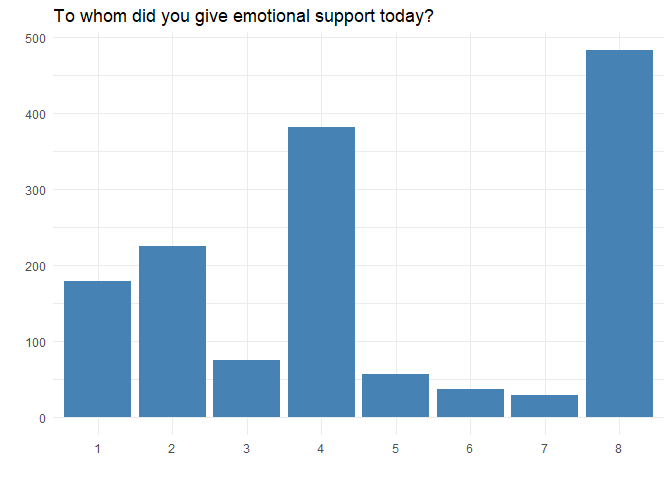<!-- -->


#### Missingness

**Missingness Descriptives**

Delivered / Answered = 1047 / 1043
Missing = 4
Min = 0, Max = 2, Mean = 0.03, SD = 0.22
(Descriptives are rounded to 2 decimals)

Missingness Intraclass Correlation (ICC) = 1.09 


#### Surveys/Questions

This Item appears in these surveys 
<div style="font-weight: bold; color: #2a5caa;"><a href="#Question 5763-anchor">[Question 5763]</a>: Child End of Day Survey ID 92</div>

#### Screenshot


</div>


</div> <!-- Header section -->

<div class = "header-shading">

#### How helpful was the support you received from: %% <br>

<div id="Item 5544-anchor" style="font-weight: bold; color: #2a5caa; margin-top: -0.7em; margin-bottom: 1em;">
  [Item 5544]
</div>


</div>


<!-- Body -->


<div class = "anchor">


**Way the question was delivered:** Slider

**Type of data:** numeric

</div> <div class = "anchor">


```
## Warning in sliderDescriptives(id = "Item 5544", thisData = thisData_item): NAs introduced
## by coercion
```

**Descriptives**
Min = 18, Max = 100, Mean = 79, SD = 16.68 


<button 
  onclick="let e = document.getElementById('Item 5544');
           let arrow = document.getElementById('Item 5544_arrow');
           e.style.display = e.style.display === 'none' ? 'block' : 'none';
           arrow.textContent = e.style.display === 'none' ? '▼' : '▲';"
  style="background: none; border: none; padding: 0; font-weight: bold; font-size: 18px; color: #2a5caa; cursor: pointer;">
Click to view visuals <span id="Item 5544_arrow">▼</span>
</button>

<div id="Item 5544" style="display: none;">


<!-- TOC-IGNORE-BEGIN -->

### Descriptives {.tabset}


#### Missingness

**Missingness Descriptives**

Delivered / Answered = 0 / 0
Missing = 0
Min = NA, Max = NA, Mean = NA, SD = NA
(Descriptives are rounded to 2 decimals)

Missingness Intraclass Correlation (ICC) = NA 


#### Surveys/Questions

This Item appears in these surveys 
<div style="font-weight: bold; color: #2a5caa;"><a href="#Question 5719-anchor">[Question 5719]</a>: Child End of Day Survey ID 92</div>


#### Screenshot


</div>

</div> <!-- Header section -->

<div class = "header-shading">

#### Think about your sleep from last night to this morning: <br>

<div id="Item 6302-anchor" style="font-weight: bold; color: #2a5caa; margin-top: -0.7em; margin-bottom: 1em;">
  [Item 6302]
</div>


</div>


<!-- Body -->


<div class = "anchor">


**Way the question was delivered:** Informational Fullscreen

**Type of data:** NA

</div> <div class = "anchor">


</div> <!-- Header section -->

<div class = "header-shading">

#### How many minutes did it take for you to fall asleep? <br>

<div id="Item 6305-anchor" style="font-weight: bold; color: #2a5caa; margin-top: -0.7em; margin-bottom: 1em;">
  [Item 6305]
</div>


</div>


<!-- Body -->


<div class = "anchor">


**Way the question was delivered:** Free Response

**Type of data:** character

</div> <div class = "anchor">


<button 
  onclick="let e = document.getElementById('Item 6305');
           let arrow = document.getElementById('Item 6305_arrow');
           e.style.display = e.style.display === 'none' ? 'block' : 'none';
           arrow.textContent = e.style.display === 'none' ? '▼' : '▲';"
  style="background: none; border: none; padding: 0; font-weight: bold; font-size: 18px; color: #2a5caa; cursor: pointer;">
Click to view visuals <span id="Item 6305_arrow">▼</span>
</button>

<div id="Item 6305" style="display: none;">


<!-- TOC-IGNORE-BEGIN -->

### Descriptives {.tabset}


#### Missingness

**Missingness Descriptives**

Delivered / Answered = 1023 / 1020
Missing = 3
Min = 0, Max = 1, Mean = 0.04, SD = 0.19
(Descriptives are rounded to 2 decimals)

Missingness Intraclass Correlation (ICC) = 1.09 

#### Surveys/Questions

This Item appears in these surveys 
<div style="font-weight: bold; color: #2a5caa;"><a href="#Question 6765-anchor">[Question 6765]</a>: Child EMA Survey ID 91</div>
<div style="font-weight: bold; color: #2a5caa;"><a href="#Question 6775-anchor">[Question 6775]</a>: Child End of Day Survey ID 92</div>
<div style="font-weight: bold; color: #2a5caa;"><a href="#Question 6785-anchor">[Question 6785]</a>: Child Morning EMA Survey ID 99</div>
<div style="font-weight: bold; color: #2a5caa;"><a href="#Question 6795-anchor">[Question 6795]</a>: Child Afternoon EMA Survey ID 100</div>
<div style="font-weight: bold; color: #2a5caa;"><a href="#Question 6805-anchor">[Question 6805]</a>: Child Evening EMA Survey ID 101</div>
<div style="font-weight: bold; color: #2a5caa;"><a href="#Question 6815-anchor">[Question 6815]</a>: Proximity Triggered EMA Survey For Child ID 102</div>


#### Screenshot


</div>


</div> <!-- Header section -->

<div class = "header-shading">

#### Did you wake up during the night (Not counting your final wake-up in the morning)? <br>

<div id="Item 6306-anchor" style="font-weight: bold; color: #2a5caa; margin-top: -0.7em; margin-bottom: 1em;">
  [Item 6306]
</div>


</div>


<!-- Body -->


<div class = "anchor">


**Way the question was delivered:** Multiple Choice

**Type of data:** integer

</div> 
<div class = "anchor">


<button 
  onclick="let e = document.getElementById('Item 6306');
           let arrow = document.getElementById('Item 6306_arrow');
           e.style.display = e.style.display === 'none' ? 'block' : 'none';
           arrow.textContent = e.style.display === 'none' ? '▼' : '▲';"
  style="background: none; border: none; padding: 0; font-weight: bold; font-size: 18px; color: #2a5caa; cursor: pointer;">
Click to view visuals <span id="Item 6306_arrow">▼</span>
</button>

<div id="Item 6306" style="display: none;">


<!-- TOC-IGNORE-BEGIN -->

### Descriptives {.tabset}


#### Frequency Table

<table class="table" style="color: black; margin-left: auto; margin-right: auto;">
 <thead>
  <tr>
   <th style="text-align:left;"> Value </th>
   <th style="text-align:left;"> Label </th>
   <th style="text-align:left;"> Counts </th>
   <th style="text-align:left;"> Percentages </th>
  </tr>
 </thead>
<tbody>
  <tr>
   <td style="text-align:left;"> 1 </td>
   <td style="text-align:left;"> Yes </td>
   <td style="text-align:left;color: darkgreen !important;"> N = 250 </td>
   <td style="text-align:left;"> 24.5% </td>
  </tr>
  <tr>
   <td style="text-align:left;"> 2 </td>
   <td style="text-align:left;"> No </td>
   <td style="text-align:left;color: darkgreen !important;"> N = 772 </td>
   <td style="text-align:left;"> 75.5% </td>
  </tr>
</tbody>
</table>


#### Barplot

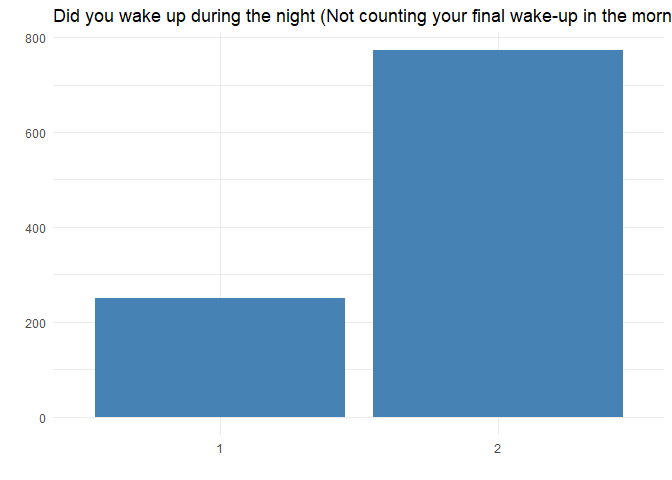<!-- -->


#### Missingness

**Missingness Descriptives**

Delivered / Answered = 1023 / 1022
Missing = 1
Min = 0, Max = 1, Mean = 0.01, SD = 0.11
(Descriptives are rounded to 2 decimals)

Missingness Intraclass Correlation (ICC) = 1.09 


#### Surveys/Questions

This Item appears in these surveys 
<div style="font-weight: bold; color: #2a5caa;"><a href="#Question 6766-anchor">[Question 6766]</a>: Child EMA Survey ID 91</div>
<div style="font-weight: bold; color: #2a5caa;"><a href="#Question 6776-anchor">[Question 6776]</a>: Child End of Day Survey ID 92</div>
<div style="font-weight: bold; color: #2a5caa;"><a href="#Question 6786-anchor">[Question 6786]</a>: Child Morning EMA Survey ID 99</div>
<div style="font-weight: bold; color: #2a5caa;"><a href="#Question 6796-anchor">[Question 6796]</a>: Child Afternoon EMA Survey ID 100</div>
<div style="font-weight: bold; color: #2a5caa;"><a href="#Question 6806-anchor">[Question 6806]</a>: Child Evening EMA Survey ID 101</div>
<div style="font-weight: bold; color: #2a5caa;"><a href="#Question 6816-anchor">[Question 6816]</a>: Proximity Triggered EMA Survey For Child ID 102</div>


#### Screenshot


</div>


</div> <!-- Header section -->

<div class = "header-shading">

#### How would you rate the quality of your sleep? <br>

<div id="Item 6309-anchor" style="font-weight: bold; color: #2a5caa; margin-top: -0.7em; margin-bottom: 1em;">
  [Item 6309]
</div>


</div>


<!-- Body -->


<div class = "anchor">


**Way the question was delivered:** Slider

**Type of data:** numeric

</div> <div class = "anchor">


**Descriptives**
Min = 0, Max = 100, Mean = 69.25, SD = 24.41 


<button 
  onclick="let e = document.getElementById('Item 6309');
           let arrow = document.getElementById('Item 6309_arrow');
           e.style.display = e.style.display === 'none' ? 'block' : 'none';
           arrow.textContent = e.style.display === 'none' ? '▼' : '▲';"
  style="background: none; border: none; padding: 0; font-weight: bold; font-size: 18px; color: #2a5caa; cursor: pointer;">
Click to view visuals <span id="Item 6309_arrow">▼</span>
</button>

<div id="Item 6309" style="display: none;">


<!-- TOC-IGNORE-BEGIN -->

### Descriptives {.tabset}


#### Missingness

**Missingness Descriptives**

Delivered / Answered = 0 / 0
Missing = 0
Min = NA, Max = NA, Mean = NA, SD = NA
(Descriptives are rounded to 2 decimals)

Missingness Intraclass Correlation (ICC) = NA 


#### Surveys/Questions

This Item appears in these surveys 
<div style="font-weight: bold; color: #2a5caa;"><a href="#Question 6771-anchor">[Question 6771]</a>: Child EMA Survey ID 91</div>
<div style="font-weight: bold; color: #2a5caa;"><a href="#Question 6781-anchor">[Question 6781]</a>: Child End of Day Survey ID 92</div>
<div style="font-weight: bold; color: #2a5caa;"><a href="#Question 6791-anchor">[Question 6791]</a>: Child Morning EMA Survey ID 99</div>
<div style="font-weight: bold; color: #2a5caa;"><a href="#Question 6801-anchor">[Question 6801]</a>: Child Afternoon EMA Survey ID 100</div>
<div style="font-weight: bold; color: #2a5caa;"><a href="#Question 6811-anchor">[Question 6811]</a>: Child Evening EMA Survey ID 101</div>
<div style="font-weight: bold; color: #2a5caa;"><a href="#Question 6821-anchor">[Question 6821]</a>: Proximity Triggered EMA Survey For Child ID 102</div>


#### Screenshot


</div>

</div> <!-- Header section -->

<div class = "header-shading">

#### Today, did you see or communicate with your parent? <br>

<div id="Item 6310-anchor" style="font-weight: bold; color: #2a5caa; margin-top: -0.7em; margin-bottom: 1em;">
  [Item 6310]
</div>


</div>


<!-- Body -->


<div class = "anchor">


**Way the question was delivered:** Multiple Choice

**Type of data:** integer

</div> 
<div class = "anchor">


<button 
  onclick="let e = document.getElementById('Item 6310');
           let arrow = document.getElementById('Item 6310_arrow');
           e.style.display = e.style.display === 'none' ? 'block' : 'none';
           arrow.textContent = e.style.display === 'none' ? '▼' : '▲';"
  style="background: none; border: none; padding: 0; font-weight: bold; font-size: 18px; color: #2a5caa; cursor: pointer;">
Click to view visuals <span id="Item 6310_arrow">▼</span>
</button>

<div id="Item 6310" style="display: none;">


<!-- TOC-IGNORE-BEGIN -->

### Descriptives {.tabset}


#### Frequency Table

<table class="table" style="color: black; margin-left: auto; margin-right: auto;">
 <thead>
  <tr>
   <th style="text-align:left;"> Value </th>
   <th style="text-align:left;"> Label </th>
   <th style="text-align:left;"> Counts </th>
   <th style="text-align:left;"> Percentages </th>
  </tr>
 </thead>
<tbody>
  <tr>
   <td style="text-align:left;"> 1 </td>
   <td style="text-align:left;"> Yes </td>
   <td style="text-align:left;color: darkgreen !important;"> N = 697 </td>
   <td style="text-align:left;"> 92.7% </td>
  </tr>
  <tr>
   <td style="text-align:left;"> 2 </td>
   <td style="text-align:left;"> No </td>
   <td style="text-align:left;color: darkgreen !important;"> N = 55 </td>
   <td style="text-align:left;"> 7.3% </td>
  </tr>
</tbody>
</table>


#### Barplot

<!-- -->


#### Missingness

**Missingness Descriptives**

Delivered / Answered = 752 / 752
Missing = 0
Min = 0, Max = 0, Mean = 0, SD = 0
(Descriptives are rounded to 2 decimals)

Missingness Intraclass Correlation (ICC) = NaN 


#### Surveys/Questions

This Item appears in these surveys 
<div style="font-weight: bold; color: #2a5caa;"><a href="#Question 6738-anchor">[Question 6738]</a>: Child End of Day Survey ID 92</div>


#### Screenshot


</div>


</div> <!-- Header section -->

<div class = "header-shading">

#### Tell us about your day with your family <br>

<div id="Item 6311-anchor" style="font-weight: bold; color: #2a5caa; margin-top: -0.7em; margin-bottom: 1em;">
  [Item 6311]
</div>


</div>


<!-- Body -->


<div class = "anchor">


**Way the question was delivered:** Informational Fullscreen

**Type of data:** NA

</div> <div class = "anchor">


</div> <!-- Header section -->

<div class = "header-shading">

#### I had fun with my parent today. <br>

<div id="Item 6312-anchor" style="font-weight: bold; color: #2a5caa; margin-top: -0.7em; margin-bottom: 1em;">
  [Item 6312]
</div>


</div>


<!-- Body -->


<div class = "anchor">


**Way the question was delivered:** Slider

**Type of data:** numeric

</div> <div class = "anchor">


**Descriptives**
Min = 0, Max = 100, Mean = 68.35, SD = 24.69 


<button 
  onclick="let e = document.getElementById('Item 6312');
           let arrow = document.getElementById('Item 6312_arrow');
           e.style.display = e.style.display === 'none' ? 'block' : 'none';
           arrow.textContent = e.style.display === 'none' ? '▼' : '▲';"
  style="background: none; border: none; padding: 0; font-weight: bold; font-size: 18px; color: #2a5caa; cursor: pointer;">
Click to view visuals <span id="Item 6312_arrow">▼</span>
</button>

<div id="Item 6312" style="display: none;">


<!-- TOC-IGNORE-BEGIN -->

### Descriptives {.tabset}


#### Missingness

**Missingness Descriptives**

Delivered / Answered = 0 / 0
Missing = 0
Min = NA, Max = NA, Mean = NA, SD = NA
(Descriptives are rounded to 2 decimals)

Missingness Intraclass Correlation (ICC) = NA 


#### Surveys/Questions

This Item appears in these surveys 
<div style="font-weight: bold; color: #2a5caa;"><a href="#Question 6740-anchor">[Question 6740]</a>: Child End of Day Survey ID 92</div>


#### Screenshot


</div>

</div> <!-- Header section -->

<div class = "header-shading">

#### My parent and I got along today. <br>

<div id="Item 6313-anchor" style="font-weight: bold; color: #2a5caa; margin-top: -0.7em; margin-bottom: 1em;">
  [Item 6313]
</div>


</div>


<!-- Body -->


<div class = "anchor">


**Way the question was delivered:** Slider

**Type of data:** numeric

</div> <div class = "anchor">


**Descriptives**
Min = 0, Max = 100, Mean = 77.7, SD = 20.45 


<button 
  onclick="let e = document.getElementById('Item 6313');
           let arrow = document.getElementById('Item 6313_arrow');
           e.style.display = e.style.display === 'none' ? 'block' : 'none';
           arrow.textContent = e.style.display === 'none' ? '▼' : '▲';"
  style="background: none; border: none; padding: 0; font-weight: bold; font-size: 18px; color: #2a5caa; cursor: pointer;">
Click to view visuals <span id="Item 6313_arrow">▼</span>
</button>

<div id="Item 6313" style="display: none;">


<!-- TOC-IGNORE-BEGIN -->

### Descriptives {.tabset}


#### Missingness

**Missingness Descriptives**

Delivered / Answered = 0 / 0
Missing = 0
Min = NA, Max = NA, Mean = NA, SD = NA
(Descriptives are rounded to 2 decimals)

Missingness Intraclass Correlation (ICC) = NA 


#### Surveys/Questions

This Item appears in these surveys 
<div style="font-weight: bold; color: #2a5caa;"><a href="#Question 6741-anchor">[Question 6741]</a>: Child End of Day Survey ID 92</div>


#### Screenshot


</div>

</div> <!-- Header section -->

<div class = "header-shading">

#### My parent gave me love and attention today. <br>

<div id="Item 6314-anchor" style="font-weight: bold; color: #2a5caa; margin-top: -0.7em; margin-bottom: 1em;">
  [Item 6314]
</div>


</div>


<!-- Body -->


<div class = "anchor">


**Way the question was delivered:** Slider

**Type of data:** numeric

</div> <div class = "anchor">


**Descriptives**
Min = 0, Max = 100, Mean = 77.07, SD = 20.47 


<button 
  onclick="let e = document.getElementById('Item 6314');
           let arrow = document.getElementById('Item 6314_arrow');
           e.style.display = e.style.display === 'none' ? 'block' : 'none';
           arrow.textContent = e.style.display === 'none' ? '▼' : '▲';"
  style="background: none; border: none; padding: 0; font-weight: bold; font-size: 18px; color: #2a5caa; cursor: pointer;">
Click to view visuals <span id="Item 6314_arrow">▼</span>
</button>

<div id="Item 6314" style="display: none;">


<!-- TOC-IGNORE-BEGIN -->

### Descriptives {.tabset}


#### Missingness

**Missingness Descriptives**

Delivered / Answered = 0 / 0
Missing = 0
Min = NA, Max = NA, Mean = NA, SD = NA
(Descriptives are rounded to 2 decimals)

Missingness Intraclass Correlation (ICC) = NA 


#### Surveys/Questions

This Item appears in these surveys 
<div style="font-weight: bold; color: #2a5caa;"><a href="#Question 6742-anchor">[Question 6742]</a>: Child End of Day Survey ID 92</div>


#### Screenshot


</div>

</div> <!-- Header section -->

<div class = "header-shading">

#### My parent got mad at me today. <br>

<div id="Item 6315-anchor" style="font-weight: bold; color: #2a5caa; margin-top: -0.7em; margin-bottom: 1em;">
  [Item 6315]
</div>


</div>


<!-- Body -->


<div class = "anchor">


**Way the question was delivered:** Slider

**Type of data:** numeric

</div> <div class = "anchor">


**Descriptives**
Min = 0, Max = 100, Mean = 16.48, SD = 21.37 


<button 
  onclick="let e = document.getElementById('Item 6315');
           let arrow = document.getElementById('Item 6315_arrow');
           e.style.display = e.style.display === 'none' ? 'block' : 'none';
           arrow.textContent = e.style.display === 'none' ? '▼' : '▲';"
  style="background: none; border: none; padding: 0; font-weight: bold; font-size: 18px; color: #2a5caa; cursor: pointer;">
Click to view visuals <span id="Item 6315_arrow">▼</span>
</button>

<div id="Item 6315" style="display: none;">


<!-- TOC-IGNORE-BEGIN -->

### Descriptives {.tabset}


#### Missingness

**Missingness Descriptives**

Delivered / Answered = 0 / 0
Missing = 0
Min = NA, Max = NA, Mean = NA, SD = NA
(Descriptives are rounded to 2 decimals)

Missingness Intraclass Correlation (ICC) = NA 


#### Surveys/Questions

This Item appears in these surveys 
<div style="font-weight: bold; color: #2a5caa;"><a href="#Question 6743-anchor">[Question 6743]</a>: Child End of Day Survey ID 92</div>


#### Screenshot


</div>

</div> <!-- Header section -->

<div class = "header-shading">

#### I was angry at my parent today. <br>

<div id="Item 6316-anchor" style="font-weight: bold; color: #2a5caa; margin-top: -0.7em; margin-bottom: 1em;">
  [Item 6316]
</div>


</div>


<!-- Body -->


<div class = "anchor">


**Way the question was delivered:** Slider

**Type of data:** numeric

</div> <div class = "anchor">


**Descriptives**
Min = 0, Max = 98, Mean = 16.76, SD = 22.83 


<button 
  onclick="let e = document.getElementById('Item 6316');
           let arrow = document.getElementById('Item 6316_arrow');
           e.style.display = e.style.display === 'none' ? 'block' : 'none';
           arrow.textContent = e.style.display === 'none' ? '▼' : '▲';"
  style="background: none; border: none; padding: 0; font-weight: bold; font-size: 18px; color: #2a5caa; cursor: pointer;">
Click to view visuals <span id="Item 6316_arrow">▼</span>
</button>

<div id="Item 6316" style="display: none;">


<!-- TOC-IGNORE-BEGIN -->

### Descriptives {.tabset}


#### Missingness

**Missingness Descriptives**

Delivered / Answered = 0 / 0
Missing = 0
Min = NA, Max = NA, Mean = NA, SD = NA
(Descriptives are rounded to 2 decimals)

Missingness Intraclass Correlation (ICC) = NA 


#### Surveys/Questions

This Item appears in these surveys 
<div style="font-weight: bold; color: #2a5caa;"><a href="#Question 6744-anchor">[Question 6744]</a>: Child End of Day Survey ID 92</div>


#### Screenshot


</div>

</div> <!-- Header section -->

<div class = "header-shading">

#### My parent punished me today. <br>

<div id="Item 6317-anchor" style="font-weight: bold; color: #2a5caa; margin-top: -0.7em; margin-bottom: 1em;">
  [Item 6317]
</div>


</div>


<!-- Body -->


<div class = "anchor">


**Way the question was delivered:** Slider

**Type of data:** numeric

</div> <div class = "anchor">


**Descriptives**
Min = 0, Max = 93, Mean = 6.38, SD = 12.81 


<button 
  onclick="let e = document.getElementById('Item 6317');
           let arrow = document.getElementById('Item 6317_arrow');
           e.style.display = e.style.display === 'none' ? 'block' : 'none';
           arrow.textContent = e.style.display === 'none' ? '▼' : '▲';"
  style="background: none; border: none; padding: 0; font-weight: bold; font-size: 18px; color: #2a5caa; cursor: pointer;">
Click to view visuals <span id="Item 6317_arrow">▼</span>
</button>

<div id="Item 6317" style="display: none;">


<!-- TOC-IGNORE-BEGIN -->

### Descriptives {.tabset}


#### Missingness

**Missingness Descriptives**

Delivered / Answered = 0 / 0
Missing = 0
Min = NA, Max = NA, Mean = NA, SD = NA
(Descriptives are rounded to 2 decimals)

Missingness Intraclass Correlation (ICC) = NA 


#### Surveys/Questions

This Item appears in these surveys 
<div style="font-weight: bold; color: #2a5caa;"><a href="#Question 6745-anchor">[Question 6745]</a>: Child End of Day Survey ID 92</div>


#### Screenshot


</div>

</div> <!-- Header section -->

<div class = "header-shading">

#### Check all that apply <br>

<div id="Item 6318-anchor" style="font-weight: bold; color: #2a5caa; margin-top: -0.7em; margin-bottom: 1em;">
  [Item 6318]
</div>


</div>


<!-- Body -->


<div class = "anchor">


**Way the question was delivered:** Multiple Select

**Type of data:** integer

</div> 
<div class = "anchor">


<button 
  onclick="let e = document.getElementById('Item 6318');
           let arrow = document.getElementById('Item 6318_arrow');
           e.style.display = e.style.display === 'none' ? 'block' : 'none';
           arrow.textContent = e.style.display === 'none' ? '▼' : '▲';"
  style="background: none; border: none; padding: 0; font-weight: bold; font-size: 18px; color: #2a5caa; cursor: pointer;">
Click to view visuals <span id="Item 6318_arrow">▼</span>
</button>

<div id="Item 6318" style="display: none;">


<!-- TOC-IGNORE-BEGIN -->

### Descriptives {.tabset}


#### Frequency Table

<table class="table" style="color: black; margin-left: auto; margin-right: auto;">
 <thead>
  <tr>
   <th style="text-align:left;"> Value </th>
   <th style="text-align:left;"> Label </th>
   <th style="text-align:left;"> Counts </th>
   <th style="text-align:left;"> Percentages </th>
  </tr>
 </thead>
<tbody>
  <tr>
   <td style="text-align:left;"> 1 </td>
   <td style="text-align:left;"> I ate a meal with my family </td>
   <td style="text-align:left;color: darkgreen !important;"> N = 482 </td>
   <td style="text-align:left;"> 44.6% </td>
  </tr>
  <tr>
   <td style="text-align:left;"> 2 </td>
   <td style="text-align:left;"> I spent leisure time with my family </td>
   <td style="text-align:left;color: darkgreen !important;"> N = 485 </td>
   <td style="text-align:left;"> 44.9% </td>
  </tr>
  <tr>
   <td style="text-align:left;"> 3 </td>
   <td style="text-align:left;"> None apply </td>
   <td style="text-align:left;color: darkgreen !important;"> N = 114 </td>
   <td style="text-align:left;"> 10.5% </td>
  </tr>
</tbody>
</table>


#### Barplot

<!-- -->


#### Missingness

**Missingness Descriptives**

Delivered / Answered = 693 / 692
Missing = 1
Min = 0, Max = 1, Mean = 0.01, SD = 0.11
(Descriptives are rounded to 2 decimals)

Missingness Intraclass Correlation (ICC) = 1.14 


#### Surveys/Questions

This Item appears in these surveys 
<div style="font-weight: bold; color: #2a5caa;"><a href="#Question 6746-anchor">[Question 6746]</a>: Child End of Day Survey ID 92</div>

#### Screenshot


</div>


</div> <!-- Header section -->

<div class = "header-shading">

#### Today, how much did you feel... <br>

<div id="Item 6319-anchor" style="font-weight: bold; color: #2a5caa; margin-top: -0.7em; margin-bottom: 1em;">
  [Item 6319]
</div>


</div>


<!-- Body -->


<div class = "anchor">


**Way the question was delivered:** Informational Fullscreen

**Type of data:** NA

</div> <div class = "anchor">


</div> <!-- Header section -->

<div class = "header-shading">

#### Accepted by your parent <br>

<div id="Item 6320-anchor" style="font-weight: bold; color: #2a5caa; margin-top: -0.7em; margin-bottom: 1em;">
  [Item 6320]
</div>


</div>


<!-- Body -->


<div class = "anchor">


**Way the question was delivered:** Slider

**Type of data:** numeric

</div> <div class = "anchor">


**Descriptives**
Min = 0, Max = 100, Mean = 76.68, SD = 20.99 


<button 
  onclick="let e = document.getElementById('Item 6320');
           let arrow = document.getElementById('Item 6320_arrow');
           e.style.display = e.style.display === 'none' ? 'block' : 'none';
           arrow.textContent = e.style.display === 'none' ? '▼' : '▲';"
  style="background: none; border: none; padding: 0; font-weight: bold; font-size: 18px; color: #2a5caa; cursor: pointer;">
Click to view visuals <span id="Item 6320_arrow">▼</span>
</button>

<div id="Item 6320" style="display: none;">


<!-- TOC-IGNORE-BEGIN -->

### Descriptives {.tabset}


#### Missingness

**Missingness Descriptives**

Delivered / Answered = 0 / 0
Missing = 0
Min = NA, Max = NA, Mean = NA, SD = NA
(Descriptives are rounded to 2 decimals)

Missingness Intraclass Correlation (ICC) = NA 


#### Surveys/Questions

This Item appears in these surveys 
<div style="font-weight: bold; color: #2a5caa;"><a href="#Question 6748-anchor">[Question 6748]</a>: Child End of Day Survey ID 92</div>


#### Screenshot


</div>

</div> <!-- Header section -->

<div class = "header-shading">

#### Understood by your parent <br>

<div id="Item 6321-anchor" style="font-weight: bold; color: #2a5caa; margin-top: -0.7em; margin-bottom: 1em;">
  [Item 6321]
</div>


</div>


<!-- Body -->


<div class = "anchor">


**Way the question was delivered:** Slider

**Type of data:** numeric

</div> <div class = "anchor">


**Descriptives**
Min = 0, Max = 100, Mean = 73.76, SD = 23.45 


<button 
  onclick="let e = document.getElementById('Item 6321');
           let arrow = document.getElementById('Item 6321_arrow');
           e.style.display = e.style.display === 'none' ? 'block' : 'none';
           arrow.textContent = e.style.display === 'none' ? '▼' : '▲';"
  style="background: none; border: none; padding: 0; font-weight: bold; font-size: 18px; color: #2a5caa; cursor: pointer;">
Click to view visuals <span id="Item 6321_arrow">▼</span>
</button>

<div id="Item 6321" style="display: none;">


<!-- TOC-IGNORE-BEGIN -->

### Descriptives {.tabset}


#### Missingness

**Missingness Descriptives**

Delivered / Answered = 0 / 0
Missing = 0
Min = NA, Max = NA, Mean = NA, SD = NA
(Descriptives are rounded to 2 decimals)

Missingness Intraclass Correlation (ICC) = NA 


#### Surveys/Questions

This Item appears in these surveys 
<div style="font-weight: bold; color: #2a5caa;"><a href="#Question 6749-anchor">[Question 6749]</a>: Child End of Day Survey ID 92</div>


#### Screenshot


</div>

</div> <!-- Header section -->

<div class = "header-shading">

#### Cared for by your parent <br>

<div id="Item 6322-anchor" style="font-weight: bold; color: #2a5caa; margin-top: -0.7em; margin-bottom: 1em;">
  [Item 6322]
</div>


</div>


<!-- Body -->


<div class = "anchor">


**Way the question was delivered:** Slider

**Type of data:** numeric

</div> <div class = "anchor">


**Descriptives**
Min = 0, Max = 100, Mean = 80.09, SD = 19.76 


<button 
  onclick="let e = document.getElementById('Item 6322');
           let arrow = document.getElementById('Item 6322_arrow');
           e.style.display = e.style.display === 'none' ? 'block' : 'none';
           arrow.textContent = e.style.display === 'none' ? '▼' : '▲';"
  style="background: none; border: none; padding: 0; font-weight: bold; font-size: 18px; color: #2a5caa; cursor: pointer;">
Click to view visuals <span id="Item 6322_arrow">▼</span>
</button>

<div id="Item 6322" style="display: none;">


<!-- TOC-IGNORE-BEGIN -->

### Descriptives {.tabset}


#### Missingness

**Missingness Descriptives**

Delivered / Answered = 0 / 0
Missing = 0
Min = NA, Max = NA, Mean = NA, SD = NA
(Descriptives are rounded to 2 decimals)

Missingness Intraclass Correlation (ICC) = NA 


#### Surveys/Questions

This Item appears in these surveys 
<div style="font-weight: bold; color: #2a5caa;"><a href="#Question 6750-anchor">[Question 6750]</a>: Child End of Day Survey ID 92</div>


#### Screenshot


</div>

</div> <!-- Header section -->

<div class = "header-shading">

#### Overall, rate the quality of your parents support today. <br>

<div id="Item 6323-anchor" style="font-weight: bold; color: #2a5caa; margin-top: -0.7em; margin-bottom: 1em;">
  [Item 6323]
</div>


</div>


<!-- Body -->


<div class = "anchor">


**Way the question was delivered:** Slider

**Type of data:** numeric

</div> <div class = "anchor">


**Descriptives**
Min = 0, Max = 100, Mean = 79.35, SD = 18.95 


<button 
  onclick="let e = document.getElementById('Item 6323');
           let arrow = document.getElementById('Item 6323_arrow');
           e.style.display = e.style.display === 'none' ? 'block' : 'none';
           arrow.textContent = e.style.display === 'none' ? '▼' : '▲';"
  style="background: none; border: none; padding: 0; font-weight: bold; font-size: 18px; color: #2a5caa; cursor: pointer;">
Click to view visuals <span id="Item 6323_arrow">▼</span>
</button>

<div id="Item 6323" style="display: none;">


<!-- TOC-IGNORE-BEGIN -->

### Descriptives {.tabset}


#### Missingness

**Missingness Descriptives**

Delivered / Answered = 0 / 0
Missing = 0
Min = NA, Max = NA, Mean = NA, SD = NA
(Descriptives are rounded to 2 decimals)

Missingness Intraclass Correlation (ICC) = NA 


#### Surveys/Questions

This Item appears in these surveys 
<div style="font-weight: bold; color: #2a5caa;"><a href="#Question 6751-anchor">[Question 6751]</a>: Child End of Day Survey ID 92</div>


#### Screenshot


</div>

</div> <!-- Header section -->

<div class = "header-shading">

#### Check all that you wanted your parent to do today: <br>

<div id="Item 6324-anchor" style="font-weight: bold; color: #2a5caa; margin-top: -0.7em; margin-bottom: 1em;">
  [Item 6324]
</div>


</div>


<!-- Body -->


<div class = "anchor">


**Way the question was delivered:** Multiple Select

**Type of data:** integer

</div> 
<div class = "anchor">


<button 
  onclick="let e = document.getElementById('Item 6324');
           let arrow = document.getElementById('Item 6324_arrow');
           e.style.display = e.style.display === 'none' ? 'block' : 'none';
           arrow.textContent = e.style.display === 'none' ? '▼' : '▲';"
  style="background: none; border: none; padding: 0; font-weight: bold; font-size: 18px; color: #2a5caa; cursor: pointer;">
Click to view visuals <span id="Item 6324_arrow">▼</span>
</button>

<div id="Item 6324" style="display: none;">


<!-- TOC-IGNORE-BEGIN -->

### Descriptives {.tabset}


#### Frequency Table

<table class="table" style="color: black; margin-left: auto; margin-right: auto;">
 <thead>
  <tr>
   <th style="text-align:left;"> Value </th>
   <th style="text-align:left;"> Label </th>
   <th style="text-align:left;"> Counts </th>
   <th style="text-align:left;"> Percentages </th>
  </tr>
 </thead>
<tbody>
  <tr>
   <td style="text-align:left;"> 1 </td>
   <td style="text-align:left;"> Give me information or tools I need to deal with a situation </td>
   <td style="text-align:left;color: darkgreen !important;"> N = 119 </td>
   <td style="text-align:left;"> 11.5% </td>
  </tr>
  <tr>
   <td style="text-align:left;"> 2 </td>
   <td style="text-align:left;"> Give me advice about what to do </td>
   <td style="text-align:left;color: darkgreen !important;"> N = 179 </td>
   <td style="text-align:left;"> 17.3% </td>
  </tr>
  <tr>
   <td style="text-align:left;"> 3 </td>
   <td style="text-align:left;"> Give me reasons why I should or should not do something </td>
   <td style="text-align:left;color: darkgreen !important;"> N = 96 </td>
   <td style="text-align:left;"> 9.3% </td>
  </tr>
  <tr>
   <td style="text-align:left;"> 4 </td>
   <td style="text-align:left;"> Help me understand why I did not do something well </td>
   <td style="text-align:left;color: darkgreen !important;"> N = 92 </td>
   <td style="text-align:left;"> 8.9% </td>
  </tr>
  <tr>
   <td style="text-align:left;"> 5 </td>
   <td style="text-align:left;"> Think about a situation with me and tell me what I can do about it </td>
   <td style="text-align:left;color: darkgreen !important;"> N = 124 </td>
   <td style="text-align:left;"> 12% </td>
  </tr>
  <tr>
   <td style="text-align:left;"> 6 </td>
   <td style="text-align:left;"> None apply </td>
   <td style="text-align:left;color: darkgreen !important;"> N = 422 </td>
   <td style="text-align:left;"> 40.9% </td>
  </tr>
</tbody>
</table>


#### Barplot

<!-- -->


#### Missingness

**Missingness Descriptives**

Delivered / Answered = 692 / 686
Missing = 6
Min = 0, Max = 4, Mean = 0.08, SD = 0.47
(Descriptives are rounded to 2 decimals)

Missingness Intraclass Correlation (ICC) = 1.04 


#### Surveys/Questions

This Item appears in these surveys 
<div style="font-weight: bold; color: #2a5caa;"><a href="#Question 6752-anchor">[Question 6752]</a>: Child End of Day Survey ID 92</div>

#### Screenshot


</div>


</div> <!-- Header section -->

<div class = "header-shading">

#### Check all that you wanted your parent to do today: <br>

<div id="Item 6325-anchor" style="font-weight: bold; color: #2a5caa; margin-top: -0.7em; margin-bottom: 1em;">
  [Item 6325]
</div>


</div>


<!-- Body -->


<div class = "anchor">


**Way the question was delivered:** Multiple Select

**Type of data:** integer

</div> 
<div class = "anchor">


<button 
  onclick="let e = document.getElementById('Item 6325');
           let arrow = document.getElementById('Item 6325_arrow');
           e.style.display = e.style.display === 'none' ? 'block' : 'none';
           arrow.textContent = e.style.display === 'none' ? '▼' : '▲';"
  style="background: none; border: none; padding: 0; font-weight: bold; font-size: 18px; color: #2a5caa; cursor: pointer;">
Click to view visuals <span id="Item 6325_arrow">▼</span>
</button>

<div id="Item 6325" style="display: none;">


<!-- TOC-IGNORE-BEGIN -->

### Descriptives {.tabset}


#### Frequency Table

<table class="table" style="color: black; margin-left: auto; margin-right: auto;">
 <thead>
  <tr>
   <th style="text-align:left;"> Value </th>
   <th style="text-align:left;"> Label </th>
   <th style="text-align:left;"> Counts </th>
   <th style="text-align:left;"> Percentages </th>
  </tr>
 </thead>
<tbody>
  <tr>
   <td style="text-align:left;"> 1 </td>
   <td style="text-align:left;"> Show sadness for my situation </td>
   <td style="text-align:left;color: darkgreen !important;"> N = 97 </td>
   <td style="text-align:left;"> 7.9% </td>
  </tr>
  <tr>
   <td style="text-align:left;"> 2 </td>
   <td style="text-align:left;"> Listen to me when I speak </td>
   <td style="text-align:left;color: darkgreen !important;"> N = 341 </td>
   <td style="text-align:left;"> 27.7% </td>
  </tr>
  <tr>
   <td style="text-align:left;"> 3 </td>
   <td style="text-align:left;"> Tell me that she or he loves me </td>
   <td style="text-align:left;color: darkgreen !important;"> N = 205 </td>
   <td style="text-align:left;"> 16.7% </td>
  </tr>
  <tr>
   <td style="text-align:left;"> 4 </td>
   <td style="text-align:left;"> Show that she or he understands, or tell me about a similar situation </td>
   <td style="text-align:left;color: darkgreen !important;"> N = 146 </td>
   <td style="text-align:left;"> 11.9% </td>
  </tr>
  <tr>
   <td style="text-align:left;"> 5 </td>
   <td style="text-align:left;"> Provide me with hope or confidence </td>
   <td style="text-align:left;color: darkgreen !important;"> N = 183 </td>
   <td style="text-align:left;"> 14.9% </td>
  </tr>
  <tr>
   <td style="text-align:left;"> 6 </td>
   <td style="text-align:left;"> None apply </td>
   <td style="text-align:left;color: darkgreen !important;"> N = 258 </td>
   <td style="text-align:left;"> 21% </td>
  </tr>
</tbody>
</table>


#### Barplot

<!-- -->


#### Missingness

**Missingness Descriptives**

Delivered / Answered = 692 / 681
Missing = 11
Min = 0, Max = 5, Mean = 0.14, SD = 0.67
(Descriptives are rounded to 2 decimals)

Missingness Intraclass Correlation (ICC) = 1.04 


#### Surveys/Questions

This Item appears in these surveys 
<div style="font-weight: bold; color: #2a5caa;"><a href="#Question 6753-anchor">[Question 6753]</a>: Child End of Day Survey ID 92</div>

#### Screenshot


</div>


</div> <!-- Header section -->

<div class = "header-shading">

#### Check all that you wanted your parent to do today: <br>

<div id="Item 6326-anchor" style="font-weight: bold; color: #2a5caa; margin-top: -0.7em; margin-bottom: 1em;">
  [Item 6326]
</div>


</div>


<!-- Body -->


<div class = "anchor">


**Way the question was delivered:** Multiple Select

**Type of data:** integer

</div> 
<div class = "anchor">


<button 
  onclick="let e = document.getElementById('Item 6326');
           let arrow = document.getElementById('Item 6326_arrow');
           e.style.display = e.style.display === 'none' ? 'block' : 'none';
           arrow.textContent = e.style.display === 'none' ? '▼' : '▲';"
  style="background: none; border: none; padding: 0; font-weight: bold; font-size: 18px; color: #2a5caa; cursor: pointer;">
Click to view visuals <span id="Item 6326_arrow">▼</span>
</button>

<div id="Item 6326" style="display: none;">


<!-- TOC-IGNORE-BEGIN -->

### Descriptives {.tabset}


#### Frequency Table

<table class="table" style="color: black; margin-left: auto; margin-right: auto;">
 <thead>
  <tr>
   <th style="text-align:left;"> Value </th>
   <th style="text-align:left;"> Label </th>
   <th style="text-align:left;"> Counts </th>
   <th style="text-align:left;"> Percentages </th>
  </tr>
 </thead>
<tbody>
  <tr>
   <td style="text-align:left;"> 1 </td>
   <td style="text-align:left;"> Offer to do something to help me </td>
   <td style="text-align:left;color: darkgreen !important;"> N = 156 </td>
   <td style="text-align:left;"> 17% </td>
  </tr>
  <tr>
   <td style="text-align:left;"> 2 </td>
   <td style="text-align:left;"> Do something to help me </td>
   <td style="text-align:left;color: darkgreen !important;"> N = 289 </td>
   <td style="text-align:left;"> 31.4% </td>
  </tr>
  <tr>
   <td style="text-align:left;"> 3 </td>
   <td style="text-align:left;"> Offer to do something with me to help me feel better </td>
   <td style="text-align:left;color: darkgreen !important;"> N = 142 </td>
   <td style="text-align:left;"> 15.5% </td>
  </tr>
  <tr>
   <td style="text-align:left;"> 4 </td>
   <td style="text-align:left;"> None apply </td>
   <td style="text-align:left;color: darkgreen !important;"> N = 332 </td>
   <td style="text-align:left;"> 36.1% </td>
  </tr>
</tbody>
</table>


#### Barplot

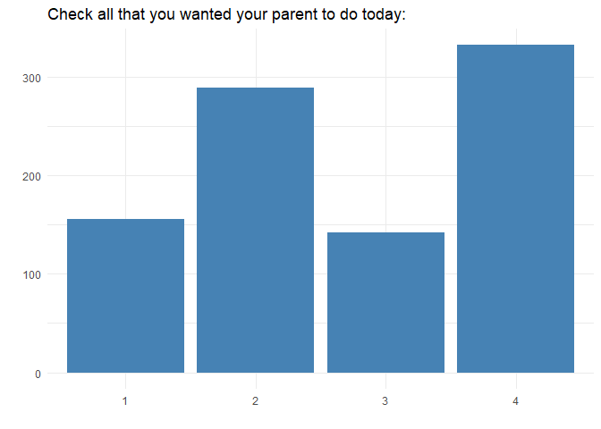<!-- -->


#### Missingness

**Missingness Descriptives**

Delivered / Answered = 692 / 683
Missing = 9
Min = 0, Max = 6, Mean = 0.11, SD = 0.7
(Descriptives are rounded to 2 decimals)

Missingness Intraclass Correlation (ICC) = 1.03 


#### Surveys/Questions

This Item appears in these surveys 
<div style="font-weight: bold; color: #2a5caa;"><a href="#Question 6754-anchor">[Question 6754]</a>: Child End of Day Survey ID 92</div>

#### Screenshot


</div>


</div> <!-- Header section -->

<div class = "header-shading">

#### Check all that you asked your parent to do today: <br>

<div id="Item 6327-anchor" style="font-weight: bold; color: #2a5caa; margin-top: -0.7em; margin-bottom: 1em;">
  [Item 6327]
</div>


</div>


<!-- Body -->


<div class = "anchor">


**Way the question was delivered:** Multiple Select

**Type of data:** integer

</div> 
<div class = "anchor">


<button 
  onclick="let e = document.getElementById('Item 6327');
           let arrow = document.getElementById('Item 6327_arrow');
           e.style.display = e.style.display === 'none' ? 'block' : 'none';
           arrow.textContent = e.style.display === 'none' ? '▼' : '▲';"
  style="background: none; border: none; padding: 0; font-weight: bold; font-size: 18px; color: #2a5caa; cursor: pointer;">
Click to view visuals <span id="Item 6327_arrow">▼</span>
</button>

<div id="Item 6327" style="display: none;">


<!-- TOC-IGNORE-BEGIN -->

### Descriptives {.tabset}


#### Frequency Table

<table class="table" style="color: black; margin-left: auto; margin-right: auto;">
 <thead>
  <tr>
   <th style="text-align:left;"> Value </th>
   <th style="text-align:left;"> Label </th>
   <th style="text-align:left;"> Counts </th>
   <th style="text-align:left;"> Percentages </th>
  </tr>
 </thead>
<tbody>
  <tr>
   <td style="text-align:left;"> 1 </td>
   <td style="text-align:left;"> Give me information or tools I need to deal with a situation </td>
   <td style="text-align:left;color: darkgreen !important;"> N = 79 </td>
   <td style="text-align:left;"> 8.4% </td>
  </tr>
  <tr>
   <td style="text-align:left;"> 2 </td>
   <td style="text-align:left;"> Give me advice about what to do </td>
   <td style="text-align:left;color: darkgreen !important;"> N = 137 </td>
   <td style="text-align:left;"> 14.6% </td>
  </tr>
  <tr>
   <td style="text-align:left;"> 3 </td>
   <td style="text-align:left;"> Give me reasons why I should or should not do something </td>
   <td style="text-align:left;color: darkgreen !important;"> N = 83 </td>
   <td style="text-align:left;"> 8.8% </td>
  </tr>
  <tr>
   <td style="text-align:left;"> 4 </td>
   <td style="text-align:left;"> Help me understand why I did not do something well </td>
   <td style="text-align:left;color: darkgreen !important;"> N = 80 </td>
   <td style="text-align:left;"> 8.5% </td>
  </tr>
  <tr>
   <td style="text-align:left;"> 5 </td>
   <td style="text-align:left;"> Think about a situation with me and tell me what I can do about it </td>
   <td style="text-align:left;color: darkgreen !important;"> N = 90 </td>
   <td style="text-align:left;"> 9.6% </td>
  </tr>
  <tr>
   <td style="text-align:left;"> 6 </td>
   <td style="text-align:left;"> None apply </td>
   <td style="text-align:left;color: darkgreen !important;"> N = 472 </td>
   <td style="text-align:left;"> 50.2% </td>
  </tr>
</tbody>
</table>


#### Barplot

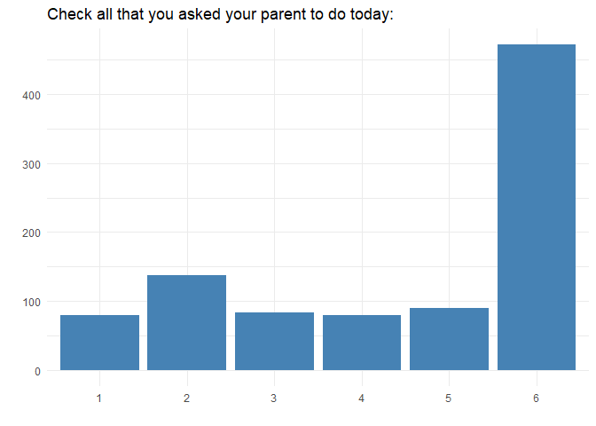<!-- -->


#### Missingness

**Missingness Descriptives**

Delivered / Answered = 692 / 685
Missing = 7
Min = 0, Max = 5, Mean = 0.09, SD = 0.58
(Descriptives are rounded to 2 decimals)

Missingness Intraclass Correlation (ICC) = 1.03 


#### Surveys/Questions

This Item appears in these surveys 
<div style="font-weight: bold; color: #2a5caa;"><a href="#Question 6755-anchor">[Question 6755]</a>: Child End of Day Survey ID 92</div>

#### Screenshot


</div>


</div> <!-- Header section -->

<div class = "header-shading">

#### Check all that you asked your parent to do today: <br>

<div id="Item 6328-anchor" style="font-weight: bold; color: #2a5caa; margin-top: -0.7em; margin-bottom: 1em;">
  [Item 6328]
</div>


</div>


<!-- Body -->


<div class = "anchor">


**Way the question was delivered:** Multiple Select

**Type of data:** integer

</div> 
<div class = "anchor">


<button 
  onclick="let e = document.getElementById('Item 6328');
           let arrow = document.getElementById('Item 6328_arrow');
           e.style.display = e.style.display === 'none' ? 'block' : 'none';
           arrow.textContent = e.style.display === 'none' ? '▼' : '▲';"
  style="background: none; border: none; padding: 0; font-weight: bold; font-size: 18px; color: #2a5caa; cursor: pointer;">
Click to view visuals <span id="Item 6328_arrow">▼</span>
</button>

<div id="Item 6328" style="display: none;">


<!-- TOC-IGNORE-BEGIN -->

### Descriptives {.tabset}


#### Frequency Table

<table class="table" style="color: black; margin-left: auto; margin-right: auto;">
 <thead>
  <tr>
   <th style="text-align:left;"> Value </th>
   <th style="text-align:left;"> Label </th>
   <th style="text-align:left;"> Counts </th>
   <th style="text-align:left;"> Percentages </th>
  </tr>
 </thead>
<tbody>
  <tr>
   <td style="text-align:left;"> 1 </td>
   <td style="text-align:left;"> Show sadness for my situation </td>
   <td style="text-align:left;color: darkgreen !important;"> N = 47 </td>
   <td style="text-align:left;"> 5.2% </td>
  </tr>
  <tr>
   <td style="text-align:left;"> 2 </td>
   <td style="text-align:left;"> Listen to me when I speak </td>
   <td style="text-align:left;color: darkgreen !important;"> N = 123 </td>
   <td style="text-align:left;"> 13.5% </td>
  </tr>
  <tr>
   <td style="text-align:left;"> 3 </td>
   <td style="text-align:left;"> Tell me that she or he loves me </td>
   <td style="text-align:left;color: darkgreen !important;"> N = 80 </td>
   <td style="text-align:left;"> 8.8% </td>
  </tr>
  <tr>
   <td style="text-align:left;"> 4 </td>
   <td style="text-align:left;"> Show that she or he understands, or tell me about a similar situation </td>
   <td style="text-align:left;color: darkgreen !important;"> N = 87 </td>
   <td style="text-align:left;"> 9.5% </td>
  </tr>
  <tr>
   <td style="text-align:left;"> 5 </td>
   <td style="text-align:left;"> Provide me with hope or confidence </td>
   <td style="text-align:left;color: darkgreen !important;"> N = 67 </td>
   <td style="text-align:left;"> 7.3% </td>
  </tr>
  <tr>
   <td style="text-align:left;"> 6 </td>
   <td style="text-align:left;"> None apply </td>
   <td style="text-align:left;color: darkgreen !important;"> N = 508 </td>
   <td style="text-align:left;"> 55.7% </td>
  </tr>
</tbody>
</table>


#### Barplot

<!-- -->


#### Missingness

**Missingness Descriptives**

Delivered / Answered = 692 / 684
Missing = 8
Min = 0, Max = 5, Mean = 0.1, SD = 0.59
(Descriptives are rounded to 2 decimals)

Missingness Intraclass Correlation (ICC) = 1.04 


#### Surveys/Questions

This Item appears in these surveys 
<div style="font-weight: bold; color: #2a5caa;"><a href="#Question 6756-anchor">[Question 6756]</a>: Child End of Day Survey ID 92</div>

#### Screenshot


</div>


</div> <!-- Header section -->

<div class = "header-shading">

#### Check all that you asked your parent to do today: <br>

<div id="Item 6329-anchor" style="font-weight: bold; color: #2a5caa; margin-top: -0.7em; margin-bottom: 1em;">
  [Item 6329]
</div>


</div>


<!-- Body -->


<div class = "anchor">


**Way the question was delivered:** Multiple Select

**Type of data:** integer

</div> 
<div class = "anchor">


<button 
  onclick="let e = document.getElementById('Item 6329');
           let arrow = document.getElementById('Item 6329_arrow');
           e.style.display = e.style.display === 'none' ? 'block' : 'none';
           arrow.textContent = e.style.display === 'none' ? '▼' : '▲';"
  style="background: none; border: none; padding: 0; font-weight: bold; font-size: 18px; color: #2a5caa; cursor: pointer;">
Click to view visuals <span id="Item 6329_arrow">▼</span>
</button>

<div id="Item 6329" style="display: none;">


<!-- TOC-IGNORE-BEGIN -->

### Descriptives {.tabset}


#### Frequency Table

<table class="table" style="color: black; margin-left: auto; margin-right: auto;">
 <thead>
  <tr>
   <th style="text-align:left;"> Value </th>
   <th style="text-align:left;"> Label </th>
   <th style="text-align:left;"> Counts </th>
   <th style="text-align:left;"> Percentages </th>
  </tr>
 </thead>
<tbody>
  <tr>
   <td style="text-align:left;"> 1 </td>
   <td style="text-align:left;"> Offer to do something to help me </td>
   <td style="text-align:left;color: darkgreen !important;"> N = 95 </td>
   <td style="text-align:left;"> 11.7% </td>
  </tr>
  <tr>
   <td style="text-align:left;"> 2 </td>
   <td style="text-align:left;"> Do something to help me </td>
   <td style="text-align:left;color: darkgreen !important;"> N = 240 </td>
   <td style="text-align:left;"> 29.4% </td>
  </tr>
  <tr>
   <td style="text-align:left;"> 3 </td>
   <td style="text-align:left;"> Offer to do something with me to help me feel better </td>
   <td style="text-align:left;color: darkgreen !important;"> N = 86 </td>
   <td style="text-align:left;"> 10.6% </td>
  </tr>
  <tr>
   <td style="text-align:left;"> 4 </td>
   <td style="text-align:left;"> None apply </td>
   <td style="text-align:left;color: darkgreen !important;"> N = 394 </td>
   <td style="text-align:left;"> 48.3% </td>
  </tr>
</tbody>
</table>


#### Barplot

<!-- -->


#### Missingness

**Missingness Descriptives**

Delivered / Answered = 692 / 685
Missing = 7
Min = 0, Max = 5, Mean = 0.09, SD = 0.58
(Descriptives are rounded to 2 decimals)

Missingness Intraclass Correlation (ICC) = 1.03 


#### Surveys/Questions

This Item appears in these surveys 
<div style="font-weight: bold; color: #2a5caa;"><a href="#Question 6757-anchor">[Question 6757]</a>: Child End of Day Survey ID 92</div>

#### Screenshot


</div>


</div> <!-- Header section -->

<div class = "header-shading">

#### Check all that your parent did for you today: <br>

<div id="Item 6330-anchor" style="font-weight: bold; color: #2a5caa; margin-top: -0.7em; margin-bottom: 1em;">
  [Item 6330]
</div>


</div>


<!-- Body -->


<div class = "anchor">


**Way the question was delivered:** Multiple Select

**Type of data:** integer

</div> 
<div class = "anchor">


<button 
  onclick="let e = document.getElementById('Item 6330');
           let arrow = document.getElementById('Item 6330_arrow');
           e.style.display = e.style.display === 'none' ? 'block' : 'none';
           arrow.textContent = e.style.display === 'none' ? '▼' : '▲';"
  style="background: none; border: none; padding: 0; font-weight: bold; font-size: 18px; color: #2a5caa; cursor: pointer;">
Click to view visuals <span id="Item 6330_arrow">▼</span>
</button>

<div id="Item 6330" style="display: none;">


<!-- TOC-IGNORE-BEGIN -->

### Descriptives {.tabset}


#### Frequency Table

<table class="table" style="color: black; margin-left: auto; margin-right: auto;">
 <thead>
  <tr>
   <th style="text-align:left;"> Value </th>
   <th style="text-align:left;"> Label </th>
   <th style="text-align:left;"> Counts </th>
   <th style="text-align:left;"> Percentages </th>
  </tr>
 </thead>
<tbody>
  <tr>
   <td style="text-align:left;"> 1 </td>
   <td style="text-align:left;"> Give me information or tools I need to deal with a situation </td>
   <td style="text-align:left;color: darkgreen !important;"> N = 158 </td>
   <td style="text-align:left;"> 13.8% </td>
  </tr>
  <tr>
   <td style="text-align:left;"> 2 </td>
   <td style="text-align:left;"> Give me advice about what to do </td>
   <td style="text-align:left;color: darkgreen !important;"> N = 225 </td>
   <td style="text-align:left;"> 19.6% </td>
  </tr>
  <tr>
   <td style="text-align:left;"> 3 </td>
   <td style="text-align:left;"> Give me reasons why I should or should not do something </td>
   <td style="text-align:left;color: darkgreen !important;"> N = 140 </td>
   <td style="text-align:left;"> 12.2% </td>
  </tr>
  <tr>
   <td style="text-align:left;"> 4 </td>
   <td style="text-align:left;"> Help me understand why I did not do something well </td>
   <td style="text-align:left;color: darkgreen !important;"> N = 108 </td>
   <td style="text-align:left;"> 9.4% </td>
  </tr>
  <tr>
   <td style="text-align:left;"> 5 </td>
   <td style="text-align:left;"> Think about a situation with me and tell me what I can do about it </td>
   <td style="text-align:left;color: darkgreen !important;"> N = 156 </td>
   <td style="text-align:left;"> 13.6% </td>
  </tr>
  <tr>
   <td style="text-align:left;"> 6 </td>
   <td style="text-align:left;"> None apply </td>
   <td style="text-align:left;color: darkgreen !important;"> N = 360 </td>
   <td style="text-align:left;"> 31.4% </td>
  </tr>
</tbody>
</table>


#### Barplot

<!-- -->


#### Missingness

**Missingness Descriptives**

Delivered / Answered = 691 / 683
Missing = 8
Min = 0, Max = 6, Mean = 0.1, SD = 0.69
(Descriptives are rounded to 2 decimals)

Missingness Intraclass Correlation (ICC) = 1.03 


#### Surveys/Questions

This Item appears in these surveys 
<div style="font-weight: bold; color: #2a5caa;"><a href="#Question 6758-anchor">[Question 6758]</a>: Child End of Day Survey ID 92</div>

#### Screenshot


</div>


</div> <!-- Header section -->

<div class = "header-shading">

#### Check all that your parent did for you today: <br>

<div id="Item 6331-anchor" style="font-weight: bold; color: #2a5caa; margin-top: -0.7em; margin-bottom: 1em;">
  [Item 6331]
</div>


</div>


<!-- Body -->


<div class = "anchor">


**Way the question was delivered:** Multiple Select

**Type of data:** integer

</div> 
<div class = "anchor">


<button 
  onclick="let e = document.getElementById('Item 6331');
           let arrow = document.getElementById('Item 6331_arrow');
           e.style.display = e.style.display === 'none' ? 'block' : 'none';
           arrow.textContent = e.style.display === 'none' ? '▼' : '▲';"
  style="background: none; border: none; padding: 0; font-weight: bold; font-size: 18px; color: #2a5caa; cursor: pointer;">
Click to view visuals <span id="Item 6331_arrow">▼</span>
</button>

<div id="Item 6331" style="display: none;">


<!-- TOC-IGNORE-BEGIN -->

### Descriptives {.tabset}


#### Frequency Table

<table class="table" style="color: black; margin-left: auto; margin-right: auto;">
 <thead>
  <tr>
   <th style="text-align:left;"> Value </th>
   <th style="text-align:left;"> Label </th>
   <th style="text-align:left;"> Counts </th>
   <th style="text-align:left;"> Percentages </th>
  </tr>
 </thead>
<tbody>
  <tr>
   <td style="text-align:left;"> 1 </td>
   <td style="text-align:left;"> Show sadness for my situation </td>
   <td style="text-align:left;color: darkgreen !important;"> N = 108 </td>
   <td style="text-align:left;"> 7.6% </td>
  </tr>
  <tr>
   <td style="text-align:left;"> 2 </td>
   <td style="text-align:left;"> Listen to me when I speak </td>
   <td style="text-align:left;color: darkgreen !important;"> N = 443 </td>
   <td style="text-align:left;"> 31% </td>
  </tr>
  <tr>
   <td style="text-align:left;"> 3 </td>
   <td style="text-align:left;"> Tell me that she or he loves me </td>
   <td style="text-align:left;color: darkgreen !important;"> N = 323 </td>
   <td style="text-align:left;"> 22.6% </td>
  </tr>
  <tr>
   <td style="text-align:left;"> 4 </td>
   <td style="text-align:left;"> Show that she or he understands, or tell me about a similar situation </td>
   <td style="text-align:left;color: darkgreen !important;"> N = 178 </td>
   <td style="text-align:left;"> 12.5% </td>
  </tr>
  <tr>
   <td style="text-align:left;"> 5 </td>
   <td style="text-align:left;"> Provide me with hope or confidence </td>
   <td style="text-align:left;color: darkgreen !important;"> N = 209 </td>
   <td style="text-align:left;"> 14.6% </td>
  </tr>
  <tr>
   <td style="text-align:left;"> 6 </td>
   <td style="text-align:left;"> None apply </td>
   <td style="text-align:left;color: darkgreen !important;"> N = 166 </td>
   <td style="text-align:left;"> 11.6% </td>
  </tr>
</tbody>
</table>


#### Barplot

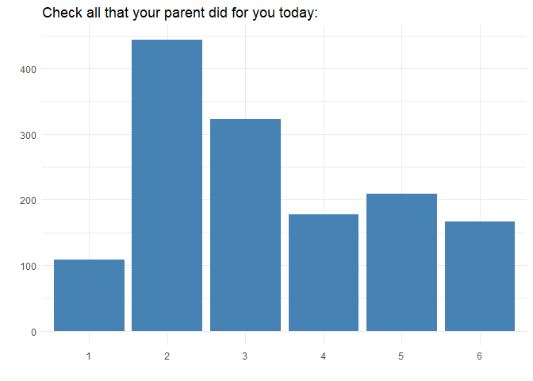<!-- -->


#### Missingness

**Missingness Descriptives**

Delivered / Answered = 691 / 683
Missing = 8
Min = 0, Max = 6, Mean = 0.1, SD = 0.69
(Descriptives are rounded to 2 decimals)

Missingness Intraclass Correlation (ICC) = 1.03 


#### Surveys/Questions

This Item appears in these surveys 
<div style="font-weight: bold; color: #2a5caa;"><a href="#Question 6759-anchor">[Question 6759]</a>: Child End of Day Survey ID 92</div>

#### Screenshot


</div>


</div> <!-- Header section -->

<div class = "header-shading">

#### Check all that your parent did for you today: <br>

<div id="Item 6332-anchor" style="font-weight: bold; color: #2a5caa; margin-top: -0.7em; margin-bottom: 1em;">
  [Item 6332]
</div>


</div>


<!-- Body -->


<div class = "anchor">


**Way the question was delivered:** Multiple Select

**Type of data:** integer

</div> 
<div class = "anchor">


<button 
  onclick="let e = document.getElementById('Item 6332');
           let arrow = document.getElementById('Item 6332_arrow');
           e.style.display = e.style.display === 'none' ? 'block' : 'none';
           arrow.textContent = e.style.display === 'none' ? '▼' : '▲';"
  style="background: none; border: none; padding: 0; font-weight: bold; font-size: 18px; color: #2a5caa; cursor: pointer;">
Click to view visuals <span id="Item 6332_arrow">▼</span>
</button>

<div id="Item 6332" style="display: none;">


<!-- TOC-IGNORE-BEGIN -->

### Descriptives {.tabset}


#### Frequency Table

<table class="table" style="color: black; margin-left: auto; margin-right: auto;">
 <thead>
  <tr>
   <th style="text-align:left;"> Value </th>
   <th style="text-align:left;"> Label </th>
   <th style="text-align:left;"> Counts </th>
   <th style="text-align:left;"> Percentages </th>
  </tr>
 </thead>
<tbody>
  <tr>
   <td style="text-align:left;"> 1 </td>
   <td style="text-align:left;"> Offer to do something to help me </td>
   <td style="text-align:left;color: darkgreen !important;"> N = 237 </td>
   <td style="text-align:left;"> 23.6% </td>
  </tr>
  <tr>
   <td style="text-align:left;"> 2 </td>
   <td style="text-align:left;"> Do something to help me </td>
   <td style="text-align:left;color: darkgreen !important;"> N = 365 </td>
   <td style="text-align:left;"> 36.3% </td>
  </tr>
  <tr>
   <td style="text-align:left;"> 3 </td>
   <td style="text-align:left;"> Offer to do something with me to help me feel better </td>
   <td style="text-align:left;color: darkgreen !important;"> N = 148 </td>
   <td style="text-align:left;"> 14.7% </td>
  </tr>
  <tr>
   <td style="text-align:left;"> 4 </td>
   <td style="text-align:left;"> None apply </td>
   <td style="text-align:left;color: darkgreen !important;"> N = 256 </td>
   <td style="text-align:left;"> 25.4% </td>
  </tr>
</tbody>
</table>


#### Barplot

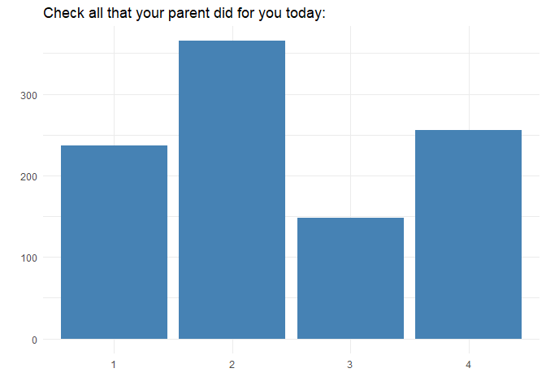<!-- -->


#### Missingness

**Missingness Descriptives**

Delivered / Answered = 691 / 682
Missing = 9
Min = 0, Max = 6, Mean = 0.11, SD = 0.7
(Descriptives are rounded to 2 decimals)

Missingness Intraclass Correlation (ICC) = 1.03 


#### Surveys/Questions

This Item appears in these surveys 
<div style="font-weight: bold; color: #2a5caa;"><a href="#Question 6760-anchor">[Question 6760]</a>: Child End of Day Survey ID 92</div>

#### Screenshot


</div>


</div> <!-- Header section -->

<div class = "header-shading">

#### My parent gave me ____ help than I wanted today <br>

<div id="Item 6333-anchor" style="font-weight: bold; color: #2a5caa; margin-top: -0.7em; margin-bottom: 1em;">
  [Item 6333]
</div>


</div>


<!-- Body -->


<div class = "anchor">


**Way the question was delivered:** Slider

**Type of data:** numeric

</div> <div class = "anchor">


**Descriptives**
Min = 0, Max = 100, Mean = 63.28, SD = 20.71 


<button 
  onclick="let e = document.getElementById('Item 6333');
           let arrow = document.getElementById('Item 6333_arrow');
           e.style.display = e.style.display === 'none' ? 'block' : 'none';
           arrow.textContent = e.style.display === 'none' ? '▼' : '▲';"
  style="background: none; border: none; padding: 0; font-weight: bold; font-size: 18px; color: #2a5caa; cursor: pointer;">
Click to view visuals <span id="Item 6333_arrow">▼</span>
</button>

<div id="Item 6333" style="display: none;">


<!-- TOC-IGNORE-BEGIN -->

### Descriptives {.tabset}


#### Missingness

**Missingness Descriptives**

Delivered / Answered = 0 / 0
Missing = 0
Min = NA, Max = NA, Mean = NA, SD = NA
(Descriptives are rounded to 2 decimals)

Missingness Intraclass Correlation (ICC) = NA 


#### Surveys/Questions

This Item appears in these surveys 
<div style="font-weight: bold; color: #2a5caa;"><a href="#Question 6761-anchor">[Question 6761]</a>: Child End of Day Survey ID 92</div>


#### Screenshot


</div>

</div>


