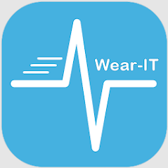

# What Is Wear-IT

The Wear-IT application and the associated framework are designed to allow researchers to minimize the effort that participants must put forward to participate in studies. Wear-IT uses passive data collection approaches in combination with active, low-burden surveys to balance the effort that participants must put forward against the quality of the data available. Featuring real-time responsiveness and adaptive, context-dependent assessments and interventions, Wear-IT can be installed on participants' own phones, and integrates with wearable and emplaceable devices from a variety of manufacturers. Wear-IT is designed with participant privacy and burden at the forefront, and is built to open new opportunities to understand and improve people's day-to-day lives. Wear-IT can be tested by anyone, but requires ethical oversight from an institutional review board to collect real data. Contact the developers to collaborate or participate!

Wear-IT may request the use of the AccessibilityService API. Some studies ask that we use this API to collect data about what apps you use and when you switch between apps. This data is shared with your study coordinators. You may opt out of this at any time.

# What Is Wear-IT For

# What Problem Does Wear-IT Solve?

# What Design Principles Underlie Wear-IT?

  
# How Does Wear-IT Accomplish Its Goals?
